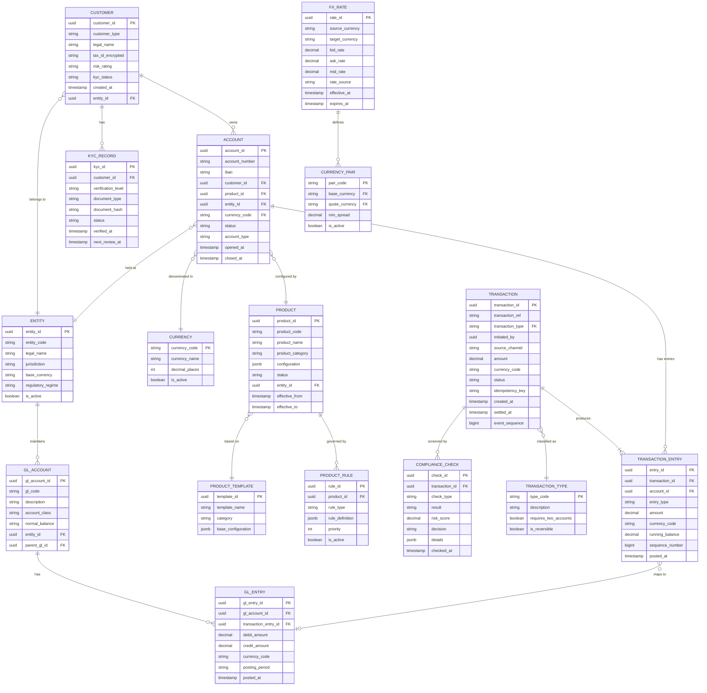

# Low-Level Design — AI-Native Core Banking Platform

## 1. Data Model

### 1.1 Core Entity Relationship Diagram



### 1.2 Double-Entry Ledger Model

The ledger follows strict double-entry bookkeeping principles. Every financial transaction produces at least two entries that net to zero.

**Ledger Event Schema:**

```
LedgerEvent:
  event_id: UUID
  event_type: ENUM (DEBIT, CREDIT, HOLD, RELEASE, REVERSAL)
  transaction_id: UUID
  account_id: UUID
  amount: DECIMAL(19,4)
  currency_code: STRING(3)
  entry_pair_id: UUID          // Links debit-credit pair
  running_balance: DECIMAL(19,4)
  sequence_number: BIGINT      // Monotonically increasing per account
  idempotency_key: STRING
  metadata: MAP<STRING, STRING>
  created_at: TIMESTAMP
  checksum: STRING             // Cryptographic hash chain
```

**Invariants enforced at the database level:**

1. `SUM(debits) = SUM(credits)` for every transaction
2. `sequence_number` is gap-free per account
3. `running_balance` = previous `running_balance` + entry amount
4. `checksum` = HASH(previous_checksum + event_data) — tamper detection
5. No UPDATE or DELETE operations — append-only

### 1.3 Account Balance Projection

```
BalanceProjection:
  account_id: UUID
  currency_code: STRING(3)
  available_balance: DECIMAL(19,4)    // Cleared - holds
  ledger_balance: DECIMAL(19,4)       // All posted entries
  hold_balance: DECIMAL(19,4)         // Pending authorizations
  pending_credit: DECIMAL(19,4)       // Uncleared deposits
  last_event_sequence: BIGINT         // For consistency check
  last_updated_at: TIMESTAMP
  version: BIGINT                     // Optimistic concurrency
```

---

## 2. API Design

### 2.1 Account APIs

```
POST   /v1/accounts                    # Open new account
GET    /v1/accounts/{account_id}       # Get account details
PATCH  /v1/accounts/{account_id}       # Update account attributes
POST   /v1/accounts/{account_id}/freeze    # Freeze account
POST   /v1/accounts/{account_id}/close     # Close account

GET    /v1/accounts/{account_id}/balance   # Get current balance
GET    /v1/accounts/{account_id}/statements # Get account statements
GET    /v1/accounts/{account_id}/transactions # List transactions
```

**Example: Get Balance Response**

```
GET /v1/accounts/{account_id}/balance

Response 200:
{
  "account_id": "acc-uuid",
  "currency": "USD",
  "available_balance": {
    "amount": "15420.75",
    "currency": "USD"
  },
  "ledger_balance": {
    "amount": "16920.75",
    "currency": "USD"
  },
  "hold_amount": {
    "amount": "1500.00",
    "currency": "USD"
  },
  "as_of": "2026-03-09T14:30:00Z",
  "sequence": 48291
}
```

### 2.2 Payment APIs

```
POST   /v1/payments                     # Initiate payment
GET    /v1/payments/{payment_id}        # Get payment status
POST   /v1/payments/{payment_id}/cancel # Cancel pending payment
GET    /v1/payments/{payment_id}/trace  # Get payment audit trail

POST   /v1/payments/batch               # Batch payment submission
GET    /v1/payments/batch/{batch_id}    # Get batch status
```

**Example: Payment Initiation Request**

```
POST /v1/payments

Request:
{
  "idempotency_key": "pay-20260309-001",
  "payment_type": "DOMESTIC_INSTANT",
  "debtor": {
    "account_id": "acc-uuid-debtor",
    "name": "Debtor Corp"
  },
  "creditor": {
    "account_number": "GB29NWBK60161331926819",
    "name": "Creditor Ltd",
    "bank_code": "NWBKGB2L"
  },
  "amount": {
    "value": "5000.00",
    "currency": "GBP"
  },
  "remittance_info": {
    "unstructured": "Invoice INV-2026-0042"
  },
  "requested_execution_date": "2026-03-09"
}

Response 201:
{
  "payment_id": "pay-uuid",
  "status": "ACCEPTED",
  "transaction_id": "txn-uuid",
  "created_at": "2026-03-09T14:30:00Z",
  "estimated_settlement": "2026-03-09T14:30:05Z"
}
```

### 2.3 Open Banking APIs (PSD2/PSD3)

```
# Account Information Service Provider (AISP)
GET    /open-banking/v3/accounts                      # List consented accounts
GET    /open-banking/v3/accounts/{id}/balances         # Get balance
GET    /open-banking/v3/accounts/{id}/transactions     # Get transactions

# Payment Initiation Service Provider (PISP)
POST   /open-banking/v3/payments                       # Initiate payment
GET    /open-banking/v3/payments/{id}                  # Get payment status

# Consent Management
POST   /open-banking/v3/consents                       # Create consent
GET    /open-banking/v3/consents/{id}                  # Get consent details
DELETE /open-banking/v3/consents/{id}                  # Revoke consent
```

**Consent Object Schema:**

```
Consent:
  consent_id: UUID
  tpp_id: STRING                  // Registered TPP identifier
  customer_id: UUID
  permissions: LIST<STRING>       // ["ReadAccountsBasic", "ReadBalances", "ReadTransactions"]
  account_ids: LIST<UUID>         // Specific accounts consented
  valid_from: TIMESTAMP
  valid_until: TIMESTAMP          // Max 90 days per PSD2
  status: ENUM (AWAITING_AUTH, AUTHORIZED, REJECTED, REVOKED, EXPIRED)
  sca_status: ENUM (REQUIRED, COMPLETED, EXEMPTED)
  created_at: TIMESTAMP
  last_accessed_at: TIMESTAMP
```

### 2.4 ISO 20022 Message Mapping

```
Internal Payment Object ←→ ISO 20022 Mapping:

payment.debtor.name          → pain.001 <Dbtr><Nm>
payment.debtor.account       → pain.001 <DbtrAcct><Id><IBAN>
payment.creditor.name        → pain.001 <Cdtr><Nm>
payment.creditor.account     → pain.001 <CdtrAcct><Id><IBAN>
payment.amount.value         → pain.001 <InstdAmt Ccy="XXX">
payment.remittance           → pain.001 <RmtInf><Ustrd>
payment.purpose_code         → pain.001 <Purp><Cd>

Status mapping:
ACCEPTED    → pacs.002 <TxInfAndSts><TxSts>ACCP
REJECTED    → pacs.002 <TxInfAndSts><TxSts>RJCT
SETTLED     → pacs.002 <TxInfAndSts><TxSts>ACSC
PENDING     → pacs.002 <TxInfAndSts><TxSts>PDNG
```

---

## 3. Core Algorithms

### 3.1 Transaction Processing Algorithm

```
ALGORITHM ProcessTransaction(transaction_request):
    // Step 1: Idempotency check
    existing = LOOKUP(idempotency_store, transaction_request.idempotency_key)
    IF existing IS NOT NULL:
        RETURN existing.response  // Return cached result

    // Step 2: Validate transaction
    VALIDATE transaction_request.amount > 0
    VALIDATE transaction_request.currency IN supported_currencies
    source_account = LOAD_ACCOUNT(transaction_request.source_account_id)
    VALIDATE source_account.status = "ACTIVE"
    VALIDATE source_account.currency = transaction_request.currency
        OR transaction_request.is_cross_currency = TRUE

    // Step 3: Inline fraud check (synchronous, < 20ms SLA)
    fraud_result = CALL FraudEngine.Score(transaction_request, source_account)
    IF fraud_result.score > BLOCK_THRESHOLD:
        STORE_IDEMPOTENCY(key, BLOCKED_RESPONSE)
        EMIT Event("TransactionBlocked", transaction_request, fraud_result)
        RETURN BLOCKED_RESPONSE
    IF fraud_result.score > REVIEW_THRESHOLD:
        FLAG_FOR_REVIEW(transaction_request, fraud_result)

    // Step 4: Limit checks
    daily_total = GET_DAILY_TOTAL(source_account.id, today)
    VALIDATE daily_total + transaction_request.amount <= source_account.daily_limit
    VALIDATE transaction_request.amount <= source_account.per_transaction_limit

    // Step 5: Balance check with account-level lock
    ACQUIRE_LOCK(source_account.id, timeout=5s)
    TRY:
        balance = GET_BALANCE(source_account.id)
        VALIDATE balance.available >= transaction_request.amount

        // Step 6: Create double-entry posting
        transaction_id = GENERATE_UUID()
        entry_pair_id = GENERATE_UUID()
        next_seq_source = GET_NEXT_SEQUENCE(source_account.id)
        next_seq_target = GET_NEXT_SEQUENCE(target_account.id)

        debit_entry = CREATE_ENTRY(
            transaction_id = transaction_id,
            account_id = source_account.id,
            type = "DEBIT",
            amount = -transaction_request.amount,
            currency = transaction_request.currency,
            running_balance = balance.ledger - transaction_request.amount,
            sequence = next_seq_source,
            entry_pair_id = entry_pair_id,
            checksum = HASH(previous_checksum, entry_data)
        )

        credit_entry = CREATE_ENTRY(
            transaction_id = transaction_id,
            account_id = target_account.id,
            type = "CREDIT",
            amount = +transaction_request.amount,
            currency = transaction_request.currency,
            running_balance = target_balance.ledger + transaction_request.amount,
            sequence = next_seq_target,
            entry_pair_id = entry_pair_id,
            checksum = HASH(previous_checksum, entry_data)
        )

        // Step 7: Atomic commit (both entries or neither)
        ATOMIC_WRITE(event_store, [debit_entry, credit_entry])

        // Step 8: Update balance projection (cache)
        UPDATE_BALANCE_CACHE(source_account.id, debit_entry.running_balance)
        UPDATE_BALANCE_CACHE(target_account.id, credit_entry.running_balance)

    FINALLY:
        RELEASE_LOCK(source_account.id)

    // Step 9: Store idempotency result
    STORE_IDEMPOTENCY(transaction_request.idempotency_key, success_response)

    // Step 10: Emit events for async processing
    EMIT Event("TransactionPosted", transaction_id, debit_entry, credit_entry)

    RETURN success_response
```

### 3.2 Multi-Currency Conversion Algorithm

```
ALGORITHM ProcessCrossCurrencyTransaction(request):
    source_currency = request.source_account.currency
    target_currency = request.target_account.currency

    // Step 1: Get applicable FX rate
    rate = FX_SERVICE.GetRate(source_currency, target_currency)
    IF rate IS NULL OR rate.is_expired:
        RETURN ERROR("No valid FX rate available")

    // Step 2: Calculate converted amount with rounding
    IF request.fixed_side = "SOURCE":
        // Customer specifies source amount
        source_amount = request.amount
        target_amount = ROUND(
            source_amount * rate.ask_rate,
            currencies[target_currency].decimal_places,
            ROUND_HALF_UP
        )
    ELSE:
        // Customer specifies target amount
        target_amount = request.amount
        source_amount = ROUND(
            target_amount / rate.bid_rate,
            currencies[source_currency].decimal_places,
            ROUND_HALF_UP
        )

    // Step 3: Calculate bank spread/commission
    mid_amount = source_amount * rate.mid_rate
    spread_revenue = ABS(target_amount - mid_amount)

    // Step 4: Create compound journal entries
    entries = []

    // Leg 1: Debit customer source account (source currency)
    entries.ADD(DEBIT, customer_source_account, source_amount, source_currency)
    entries.ADD(CREDIT, fx_position_account_source, source_amount, source_currency)

    // Leg 2: Credit customer target account (target currency)
    entries.ADD(DEBIT, fx_position_account_target, target_amount, target_currency)
    entries.ADD(CREDIT, customer_target_account, target_amount, target_currency)

    // Leg 3: FX revenue recognition
    entries.ADD(CREDIT, fx_revenue_gl, spread_revenue, entity_base_currency)

    // Step 5: Validate all entries balance per currency
    FOR EACH currency IN entries.currencies():
        ASSERT SUM(entries.filter(currency).debits) = SUM(entries.filter(currency).credits)

    // Step 6: Atomic commit all entries
    ATOMIC_WRITE(event_store, entries)

    // Step 7: Update currency positions
    UPDATE_POSITION(entity_id, source_currency, -source_amount)
    UPDATE_POSITION(entity_id, target_currency, +target_amount)

    RETURN FXTransactionResult(
        source_amount, source_currency,
        target_amount, target_currency,
        applied_rate = rate.ask_rate,
        rate_timestamp = rate.effective_at
    )
```

### 3.3 Interest Calculation Algorithm

```
ALGORITHM CalculateInterest(account_id, calculation_date):
    account = LOAD_ACCOUNT(account_id)
    product = LOAD_PRODUCT(account.product_id)
    interest_config = product.configuration.interest

    // Step 1: Determine day count convention
    day_count = interest_config.day_count_convention  // ACT/365, ACT/360, 30/360

    // Step 2: Get applicable interest rate
    IF interest_config.rate_type = "FIXED":
        annual_rate = interest_config.fixed_rate
    ELSE IF interest_config.rate_type = "TIERED":
        balance = GET_BALANCE(account_id).ledger_balance
        annual_rate = RESOLVE_TIER(interest_config.tiers, balance)
    ELSE IF interest_config.rate_type = "FLOATING":
        base_rate = GET_BENCHMARK_RATE(interest_config.benchmark)
        annual_rate = base_rate + interest_config.spread

    // Step 3: Calculate daily interest based on convention
    IF day_count = "ACT/365":
        days_in_year = 365
    ELSE IF day_count = "ACT/360":
        days_in_year = 360
    ELSE IF day_count = "30/360":
        days_in_year = 360

    // Step 4: Get daily balances for the period
    last_accrual_date = GET_LAST_ACCRUAL_DATE(account_id)
    daily_balances = GET_DAILY_BALANCES(account_id, last_accrual_date, calculation_date)

    // Step 5: Accrue interest for each day
    total_interest = 0
    FOR EACH day IN daily_balances:
        daily_rate = annual_rate / days_in_year
        day_interest = day.balance * daily_rate
        total_interest = total_interest + day_interest

        // Record daily accrual entry
        EMIT AccrualEvent(account_id, day.date, day_interest, day.balance, daily_rate)

    // Step 6: Apply rounding
    total_interest = ROUND(total_interest, currency_decimal_places, ROUND_HALF_UP)

    // Step 7: Apply withholding tax if applicable
    tax_config = GET_TAX_CONFIG(account.entity_id, account.customer_id)
    IF tax_config.withholding_applicable:
        tax_amount = ROUND(total_interest * tax_config.rate, decimal_places, ROUND_HALF_UP)
        net_interest = total_interest - tax_amount
    ELSE:
        tax_amount = 0
        net_interest = total_interest

    // Step 8: Post interest (if posting date matches)
    IF interest_config.posting_frequency.matches(calculation_date):
        POST_INTEREST(account_id, net_interest, tax_amount)

    RETURN InterestResult(
        gross_interest = total_interest,
        tax_amount = tax_amount,
        net_interest = net_interest,
        accrual_period = (last_accrual_date, calculation_date)
    )


FUNCTION RESOLVE_TIER(tiers, balance):
    // Tiered interest: different rates for different balance bands
    // Example: 0-10K: 1%, 10K-50K: 1.5%, 50K+: 2%
    applicable_rate = tiers[0].rate  // Default to lowest tier
    FOR EACH tier IN tiers (sorted by min_balance ASC):
        IF balance >= tier.min_balance:
            applicable_rate = tier.rate
    RETURN applicable_rate
```

### 3.4 Regulatory Report Generation Algorithm

```
ALGORITHM GenerateRegulatoryReport(report_type, entity_id, reporting_period):
    // Step 1: Load report template
    template = LOAD_REPORT_TEMPLATE(report_type)
    // Templates: CCAR, DFAST, COREP, FINREP, call reports, etc.

    // Step 2: Resolve data sources for each report field
    field_results = MAP()
    FOR EACH field IN template.fields:
        source_query = field.data_source_query
        aggregation = field.aggregation_rule
        filters = APPLY_ENTITY_FILTER(field.filters, entity_id)
        filters = APPLY_PERIOD_FILTER(filters, reporting_period)

        raw_data = EXECUTE_QUERY(source_query, filters)
        aggregated_value = APPLY_AGGREGATION(raw_data, aggregation)
        field_results[field.id] = aggregated_value

    // Step 3: Apply cross-field validations
    FOR EACH validation IN template.validations:
        result = EVALUATE_EXPRESSION(validation.expression, field_results)
        IF NOT result:
            LOG_VALIDATION_FAILURE(report_type, validation, field_results)
            IF validation.severity = "BLOCKING":
                RETURN ERROR("Report validation failed: " + validation.description)

    // Step 4: Generate data lineage
    lineage = MAP()
    FOR EACH field IN field_results:
        lineage[field.id] = TRACE_DATA_LINEAGE(
            source_transactions = field.source_query,
            transformations = field.aggregation_rule,
            final_value = field_results[field.id]
        )

    // Step 5: Format output
    report = FORMAT_REPORT(template.output_format, field_results)
    // Output formats: XBRL, CSV, XML, PDF

    // Step 6: Store with audit metadata
    STORE_REPORT(
        report_id = GENERATE_UUID(),
        report_type = report_type,
        entity_id = entity_id,
        period = reporting_period,
        content = report,
        lineage = lineage,
        generated_at = NOW(),
        generated_by = SYSTEM_IDENTITY
    )

    RETURN report
```

### 3.5 Sanctions Screening Algorithm

```
ALGORITHM ScreenTransaction(transaction):
    // Step 1: Extract screening entities
    entities_to_screen = EXTRACT_ENTITIES(transaction)
    // Entities: debtor name, creditor name, intermediary banks,
    // remittance text, addresses, country codes

    // Step 2: Screen against sanctions lists
    hits = []
    FOR EACH entity IN entities_to_screen:
        // Exact match screening
        exact_matches = LOOKUP(sanctions_index, NORMALIZE(entity.name))

        // Fuzzy match screening (for name variations)
        fuzzy_matches = FUZZY_SEARCH(
            sanctions_index,
            entity.name,
            threshold = 0.85,  // Jaro-Winkler similarity
            algorithm = "PHONETIC_AWARE"  // Handles transliterations
        )

        // Country and program screening
        country_hits = CHECK_COUNTRY_SANCTIONS(entity.country_code)
        program_hits = CHECK_PROGRAM_LIST(entity.identifiers)

        hits.ADD_ALL(exact_matches + fuzzy_matches + country_hits + program_hits)

    // Step 3: Score and deduplicate hits
    scored_hits = []
    FOR EACH hit IN DEDUPLICATE(hits):
        score = CALCULATE_HIT_SCORE(hit, entity)
        // Score factors: name similarity, country match,
        // identifier match, date-of-birth proximity
        scored_hits.ADD((hit, score))

    // Step 4: Apply disposition rules
    IF ANY scored_hit.score >= AUTO_BLOCK_THRESHOLD:
        BLOCK_TRANSACTION(transaction.id)
        CREATE_ALERT(transaction, scored_hits, severity="CRITICAL")
        RETURN ScreeningResult(decision="BLOCKED", hits=scored_hits)

    IF ANY scored_hit.score >= REVIEW_THRESHOLD:
        HOLD_TRANSACTION(transaction.id)
        CREATE_ALERT(transaction, scored_hits, severity="HIGH")
        RETURN ScreeningResult(decision="HELD_FOR_REVIEW", hits=scored_hits)

    // Step 5: Record clean screening result
    LOG_SCREENING(transaction.id, "PASSED", scored_hits)
    RETURN ScreeningResult(decision="PASSED", hits=[])
```

### 3.6 Balance Reconciliation Algorithm

```
ALGORITHM ReconcileBalances(entity_id, reconciliation_date):
    // Run continuously intra-day to catch discrepancies early

    accounts = GET_ALL_ACCOUNTS(entity_id)
    discrepancies = []

    FOR EACH account IN accounts:
        // Source 1: Event store (source of truth)
        event_balance = REPLAY_EVENTS(
            account.id,
            up_to = reconciliation_date
        )

        // Source 2: Balance projection (read model)
        projected_balance = GET_PROJECTED_BALANCE(account.id)

        // Source 3: GL entries
        gl_balance = SUM_GL_ENTRIES(
            account.gl_mapping,
            up_to = reconciliation_date
        )

        // Compare all three sources
        IF event_balance != projected_balance:
            discrepancies.ADD(
                type = "PROJECTION_DRIFT",
                account = account.id,
                expected = event_balance,
                actual = projected_balance,
                difference = event_balance - projected_balance
            )
            // Auto-repair: rebuild projection from events
            REBUILD_PROJECTION(account.id)

        IF event_balance != gl_balance:
            discrepancies.ADD(
                type = "GL_MISMATCH",
                account = account.id,
                ledger_balance = event_balance,
                gl_balance = gl_balance,
                difference = event_balance - gl_balance
            )

    // Verify entity-level totals
    total_debits = SUM_ALL_DEBITS(entity_id, reconciliation_date)
    total_credits = SUM_ALL_CREDITS(entity_id, reconciliation_date)
    IF total_debits != total_credits:
        discrepancies.ADD(
            type = "TRIAL_BALANCE_IMBALANCE",
            entity = entity_id,
            debit_total = total_debits,
            credit_total = total_credits
        )
        ALERT(severity = "CRITICAL", "Trial balance imbalance detected")

    RETURN ReconciliationReport(
        entity_id = entity_id,
        date = reconciliation_date,
        accounts_checked = accounts.length,
        discrepancies = discrepancies,
        status = "CLEAN" IF discrepancies.empty ELSE "DISCREPANCIES_FOUND"
    )
```

---

## 4. Event Schema Design

### 4.1 Core Event Types

```
Event Hierarchy:

AccountEvent
  ├── AccountOpened { customer_id, product_id, currency, entity_id }
  ├── AccountFrozen { reason, frozen_by, regulatory_hold }
  ├── AccountClosed { closing_balance, closure_reason }
  └── AccountAttributeChanged { field, old_value, new_value }

TransactionEvent
  ├── TransactionInitiated { amount, currency, type, source, target }
  ├── TransactionAuthorized { auth_code, fraud_score }
  ├── TransactionPosted { entries[], posting_timestamp }
  ├── TransactionReversed { original_txn_id, reason }
  └── TransactionFailed { error_code, reason }

PaymentEvent
  ├── PaymentCreated { payment_type, debtor, creditor, amount }
  ├── PaymentScreened { screening_result, hits[] }
  ├── PaymentRouted { network, message_type, routing_key }
  ├── PaymentSettled { settlement_ref, settlement_date }
  └── PaymentReturned { return_reason_code, original_payment_id }

ComplianceEvent
  ├── ScreeningCompleted { transaction_id, result, score }
  ├── AlertCreated { alert_type, severity, entities[] }
  ├── AlertInvestigated { investigator, findings, disposition }
  └── SARFiled { report_id, filing_date, jurisdiction }
```

### 4.2 Event Envelope

```
EventEnvelope:
  event_id: UUID               // Globally unique event identifier
  event_type: STRING           // Fully qualified event type name
  aggregate_type: STRING       // Account, Transaction, Payment
  aggregate_id: UUID           // Primary entity ID
  sequence_number: BIGINT      // Per-aggregate monotonic sequence
  correlation_id: UUID         // Traces related events across services
  causation_id: UUID           // The event/command that caused this event
  timestamp: TIMESTAMP         // Event creation time (UTC)
  version: INT                 // Schema version for evolution
  actor: STRING                // System or user that triggered the event
  entity_id: UUID              // Legal entity context
  payload: BYTES               // Serialized event data
  metadata: MAP<STRING,STRING> // Extensible metadata
  checksum: STRING             // HMAC for integrity verification
```

---

## 5. Configuration-Driven Product Factory

### 5.1 Product Definition Schema

```
ProductDefinition:
  product_code: "SAVINGS_PREMIUM"
  product_name: "Premium Savings Account"
  category: "DEPOSIT"
  currency_restrictions: ["USD", "EUR", "GBP"]
  entity_restrictions: ["ENTITY_US", "ENTITY_UK"]

  interest:
    rate_type: "TIERED"
    day_count_convention: "ACT/365"
    compounding_frequency: "DAILY"
    posting_frequency: "MONTHLY"
    tiers:
      - min_balance: 0, max_balance: 10000, rate: 0.015
      - min_balance: 10000, max_balance: 50000, rate: 0.020
      - min_balance: 50000, max_balance: NULL, rate: 0.025
    accrual_method: "DAILY_BALANCE"

  fees:
    - fee_type: "MONTHLY_MAINTENANCE"
      amount: 5.00
      currency: "ACCOUNT_CURRENCY"
      waiver_conditions:
        - condition: "MIN_BALANCE >= 5000"
    - fee_type: "WIRE_TRANSFER"
      amount: 25.00
      frequency: "PER_TRANSACTION"

  limits:
    daily_debit: 50000
    per_transaction: 25000
    monthly_withdrawal_count: NULL  // Unlimited
    minimum_balance: 100

  lifecycle:
    dormancy_days: 365
    escheatment_days: 1825   // 5 years
    auto_close_zero_balance: FALSE

  tax:
    withholding_applicable: TRUE
    default_rate: 0.10   // 10% TDS
```

### 5.2 Product Composition Pattern

```
ProductTemplate ("BASE_DEPOSIT")
    │
    ├── InterestModule (configurable rates, tiers, conventions)
    ├── FeeModule (fee types, schedules, waivers)
    ├── LimitModule (transaction, daily, monthly limits)
    ├── LifecycleModule (dormancy, escheatment rules)
    ├── TaxModule (withholding rules per jurisdiction)
    └── ComplianceModule (KYC level, screening intensity)

Banks compose products by selecting modules and configuring parameters.
New product launch = new configuration, NOT new code deployment.
```

---

*Next: [Deep Dive & Bottlenecks →](./04-deep-dive-and-bottlenecks.md)*
