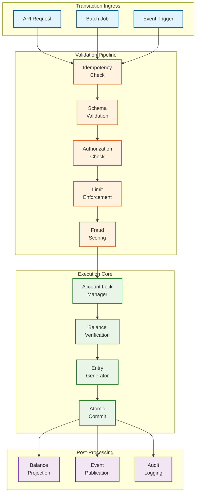

# Deep Dive & Bottlenecks — AI-Native Core Banking Platform

## 1. Deep Dive: Transaction Processing Engine

### 1.1 Architecture of the Transaction Engine

The Transaction Processing Engine (TPE) is the heartbeat of the core banking platform. Every financial mutation—whether a point-of-sale purchase, interbank transfer, interest posting, or fee deduction—flows through this engine. Its design must guarantee ACID semantics while sustaining 100,000+ TPS with sub-100ms latency.



### 1.2 Account-Level Locking Strategy

The most critical concurrency challenge in banking is preventing double-spending while maintaining high throughput. The TPE employs a multi-layered locking approach:

**Layer 1 — Partition-Level Routing**
Each account is deterministically routed to a specific processing partition using consistent hashing on account ID. This guarantees that all transactions for a single account are processed by the same partition, enabling local ordering without distributed locking.

**Layer 2 — Account-Level Optimistic Locking**
Within a partition, transactions for the same account use optimistic concurrency control:

```
SEQUENCE:
  1. Read current balance + version number
  2. Validate sufficient funds
  3. Attempt atomic write with expected version
  4. IF version conflict → retry from step 1 (max 3 retries)
  5. IF max retries exceeded → queue for sequential processing
```

**Layer 3 — Cross-Account Coordination**
Transfers between accounts on different partitions use the saga pattern with compensating actions rather than distributed locks:

```
Transfer A→B across partitions:
  1. HOLD amount on account A (local to partition A)
  2. CREDIT amount to account B (local to partition B)
  3. CONVERT hold to debit on account A (local to partition A)

  If step 2 fails: RELEASE hold on account A
  If step 3 fails: REVERSE credit on account B, RELEASE hold
```

### 1.3 Hot Account Problem

Certain accounts (nostro accounts, pooling accounts, central bank reserves) receive thousands of transactions per second, creating contention bottlenecks.

**Solutions:**

| Strategy | Mechanism | Trade-off |
|---|---|---|
| **Sub-account spreading** | Split hot account into N virtual sub-accounts; round-robin incoming transactions | Requires periodic rebalancing; balance queries aggregate across sub-accounts |
| **Batch coalescing** | Buffer incoming entries for 10ms windows; apply as single aggregated entry | Adds 10ms latency; reduces lock contention by 100x |
| **Deferred balance check** | Use statistical balance estimation for high-confidence debits; reconcile at commit | Small risk of overdraft; bounded by estimation error margin |
| **Dedicated processing lane** | Route hot accounts to dedicated high-performance partitions with local storage | Operational complexity; requires hot-account detection heuristics |

### 1.4 Idempotency Implementation

Financial idempotency requires more than simple request deduplication:

```
IdempotencyStore:
  key: STRING (client-provided idempotency key)
  request_hash: STRING (hash of full request body)
  response: BYTES (serialized response)
  status: ENUM (IN_PROGRESS, COMPLETED, FAILED)
  created_at: TIMESTAMP
  expires_at: TIMESTAMP (typically 24-72 hours)

RULES:
  1. Same key + same request hash → return cached response
  2. Same key + different request hash → return 409 Conflict
  3. Same key + status=IN_PROGRESS → return 409 (concurrent request)
  4. Key expired → treat as new request
```

---

## 2. Deep Dive: Multi-Currency Ledger Engine

### 2.1 Currency Representation Model

Every monetary amount in the system is represented as a strongly-typed currency value:

```
MonetaryAmount:
  value: DECIMAL(19, max_decimal_places)
  currency_code: STRING(3)      // ISO 4217
  decimal_places: INT           // From currency configuration

  // Critical: Never use floating-point for money
  // Internal representation: integer minor units
  // Example: $100.50 USD → 10050 (cents)
  //          ¥1000 JPY → 1000 (no decimals)
  //          0.00100000 BTC → 100000 (satoshis)
```

### 2.2 Multi-Currency Accounting Entries

Each entity maintains a base (functional) currency. Transactions in foreign currencies generate dual postings:

```
Example: US entity (base=USD) receives EUR payment

Entry 1 (Transaction Currency - EUR):
  Debit:  Nostro EUR Account     EUR 10,000
  Credit: Customer EUR Account   EUR 10,000

Entry 2 (Base Currency - USD, for P&L and reporting):
  Debit:  Nostro EUR (USD equiv)   USD 10,850
  Credit: Customer EUR (USD equiv)  USD 10,850

Metadata:
  exchange_rate: 1.0850 (EUR/USD)
  rate_source: "REUTERS_SPOT"
  rate_timestamp: 2026-03-09T14:30:00Z
```

### 2.3 Currency Position Management

Real-time tracking of net currency exposures per entity:

```
CurrencyPosition:
  entity_id: UUID
  currency_code: STRING
  long_position: DECIMAL     // Total assets in this currency
  short_position: DECIMAL    // Total liabilities in this currency
  net_position: DECIMAL      // long - short
  limit: DECIMAL             // Maximum net exposure allowed
  utilization_pct: DECIMAL   // net / limit
  last_updated: TIMESTAMP

Position Update (on every cross-currency transaction):
  1. Update source currency position (decrease)
  2. Update target currency position (increase)
  3. Check against position limits
  4. Alert treasury if utilization > 80%
  5. Block if utilization > 95% (require manual override)
```

### 2.4 Revaluation Process

Foreign currency positions must be revalued to base currency at period-end:

```
ALGORITHM RevaluePositions(entity_id, revaluation_date):
    positions = GET_ALL_POSITIONS(entity_id)
    base_currency = GET_ENTITY_BASE_CURRENCY(entity_id)

    FOR EACH position IN positions:
        IF position.currency = base_currency:
            CONTINUE  // No revaluation needed for base currency

        current_rate = GET_CLOSING_RATE(position.currency, base_currency, revaluation_date)
        previous_rate = GET_PREVIOUS_REVALUATION_RATE(position)

        current_base_value = position.net_position * current_rate
        previous_base_value = position.net_position * previous_rate

        reval_gain_loss = current_base_value - previous_base_value

        IF reval_gain_loss != 0:
            // Post revaluation entry
            IF reval_gain_loss > 0:
                POST(DEBIT, fx_revaluation_asset_gl, ABS(reval_gain_loss), base_currency)
                POST(CREDIT, fx_unrealized_gain_gl, ABS(reval_gain_loss), base_currency)
            ELSE:
                POST(DEBIT, fx_unrealized_loss_gl, ABS(reval_gain_loss), base_currency)
                POST(CREDIT, fx_revaluation_asset_gl, ABS(reval_gain_loss), base_currency)

        UPDATE_POSITION_RATE(position, current_rate)
```

---

## 3. Deep Dive: Regulatory Compliance Engine

### 3.1 Architecture

The compliance engine operates as a stream processor that evaluates every transaction against a configurable set of regulatory rules in real-time.

```
Transaction Event Stream
       │
       ▼
┌──────────────────────────┐
│   Compliance Router      │  ← Routes to applicable rule sets
│   (entity + jurisdiction)│     based on entity and jurisdiction
└──────────┬───────────────┘
           │
     ┌─────┼─────────────┐
     ▼     ▼             ▼
┌────────┐ ┌────────┐ ┌────────────┐
│Sanctions│ │  AML   │ │ Regulatory │
│Screening│ │Pattern │ │ Threshold  │
│Service  │ │Detect. │ │ Monitor    │
└────┬───┘ └────┬───┘ └─────┬──────┘
     │          │            │
     ▼          ▼            ▼
┌──────────────────────────────────┐
│       Alert Management           │
│  Scoring · Dedup · Routing       │
└──────────┬───────────────────────┘
           │
     ┌─────┼─────────┐
     ▼     ▼         ▼
  Auto-   Case    Regulatory
  Dispose Mgmt    Reporting
```

### 3.2 Rule Engine Design

Rules are defined declaratively and versioned:

```
ComplianceRule:
  rule_id: "AML-CTR-001"
  name: "Currency Transaction Report Threshold"
  jurisdiction: ["US"]
  rule_type: "THRESHOLD"
  entity_scope: ["ENTITY_US"]

  condition:
    trigger: "CASH_TRANSACTION"
    aggregation: "DAILY_SUM"
    threshold: 10000.00
    currency: "USD"
    group_by: ["customer_id"]

  action:
    primary: "GENERATE_CTR"
    secondary: "FLAG_FOR_STRUCTURING_ANALYSIS"

  structuring_detection:
    // Detect attempts to stay below threshold
    window: "48_HOURS"
    sub_threshold_transactions: 3
    aggregate_exceeds_threshold: TRUE
    action: "GENERATE_SAR"

  effective_from: "2025-01-01"
  effective_to: NULL
  version: 3
```

### 3.3 AML Pattern Detection with ML

The AML engine uses a combination of rule-based and ML-based detection:

**Rule-Based Patterns:**
- Structuring (smurfing): Multiple sub-threshold deposits
- Rapid movement: Large deposits followed by immediate withdrawal or transfer
- Round-trip: Funds cycling through multiple accounts
- Geographic risk: Transactions involving high-risk jurisdictions

**ML-Based Detection:**
- Graph neural networks to identify suspicious network patterns across accounts
- Sequence models analyzing temporal patterns of transaction behavior
- Anomaly detection comparing individual behavior against peer cohorts
- Entity resolution linking seemingly unrelated accounts to common beneficial owners

```
ML Scoring Pipeline:
  1. Feature extraction (real-time):
     - Transaction velocity (1h, 24h, 7d, 30d windows)
     - Counterparty diversity score
     - Geographic dispersion index
     - Deviation from historical pattern
     - Network centrality metrics

  2. Model ensemble scoring:
     - Behavioral anomaly model: P(unusual | customer_history)
     - Network risk model: P(suspicious | graph_features)
     - Typology classifier: P(typology_X | transaction_features)

  3. Score aggregation:
     composite_score = w1*anomaly + w2*network + w3*typology

  4. Explainability output:
     - Top 3 contributing features
     - Similar historical cases
     - Regulatory typology mapping
```

### 3.4 Basel III/IV Capital Adequacy Calculations

```
ALGORITHM CalculateCapitalAdequacy(entity_id, reporting_date):
    // CET1 Capital Ratio = CET1 Capital / Risk-Weighted Assets

    // Step 1: Calculate CET1 Capital
    cet1 = GET_COMMON_EQUITY(entity_id)
          - GET_REGULATORY_DEDUCTIONS(entity_id)
          + GET_MINORITY_INTERESTS(entity_id, qualifying_portion)

    // Step 2: Calculate Risk-Weighted Assets
    credit_rwa = CALCULATE_CREDIT_RWA(entity_id, reporting_date)
    market_rwa = CALCULATE_MARKET_RWA(entity_id, reporting_date)
    operational_rwa = CALCULATE_OPERATIONAL_RWA(entity_id, reporting_date)
    total_rwa = credit_rwa + market_rwa + operational_rwa

    // Step 3: Calculate ratios
    cet1_ratio = cet1 / total_rwa          // Minimum 4.5%
    tier1_ratio = tier1_capital / total_rwa // Minimum 6.0%
    total_ratio = total_capital / total_rwa // Minimum 8.0%

    // Step 4: Check buffers
    conservation_buffer = 0.025   // 2.5%
    countercyclical_buffer = GET_CCyB_RATE(entity_id.jurisdiction)
    systemic_buffer = GET_SYSTEMIC_BUFFER(entity_id)  // G-SIB/D-SIB

    required_cet1 = 0.045 + conservation_buffer + countercyclical_buffer + systemic_buffer

    IF cet1_ratio < required_cet1:
        ALERT(severity="CRITICAL", "CET1 ratio below requirement")
        RESTRICT_DISTRIBUTIONS(entity_id)  // Dividend restrictions

    RETURN CapitalAdequacyReport(
        cet1_ratio, tier1_ratio, total_ratio,
        total_rwa, credit_rwa, market_rwa, operational_rwa,
        buffer_requirements = required_cet1,
        surplus_deficit = cet1_ratio - required_cet1
    )
```

---

## 4. Bottleneck Analysis

### 4.1 Identified Bottlenecks

| # | Bottleneck | Impact | Severity |
|---|---|---|---|
| B1 | Account-level lock contention on hot accounts | Throughput degradation, increased p99 latency | **Critical** |
| B2 | Synchronous fraud scoring latency | Adds 15-25ms to every transaction | **High** |
| B3 | Event store write throughput saturation | Back-pressure on all transaction processing | **Critical** |
| B4 | Sanctions list lookup for fuzzy matching | 5-15ms per screening with large lists | **High** |
| B5 | Cross-partition transaction coordination | 2-5x latency for inter-account transfers | **Medium** |
| B6 | Balance projection lag under high load | Stale balances may cause false insufficient-funds | **High** |
| B7 | FX rate cache invalidation storm | Burst of cache misses on rate update | **Medium** |
| B8 | Batch processing window pressure | EOD processing competing with real-time traffic | **Medium** |

### 4.2 Mitigation Strategies

**B1: Hot Account Contention**
- Sub-account spreading with round-robin allocation
- Write coalescing: buffer entries for 5-10ms, commit as batch
- Statistical balance checks for high-confidence transactions
- Dedicated processing lanes for known high-volume accounts

**B2: Fraud Scoring Latency**
- Pre-computed feature store updated asynchronously from transaction stream
- Model quantization (INT8) for faster inference
- Circuit breaker: fall back to rule-based scoring if ML latency exceeds 20ms
- Batch fraud scoring for low-risk transaction types (below a configurable amount threshold)

**B3: Event Store Write Saturation**
- Partitioned event store with account-affinity routing
- Write-ahead log with group commit (batch fsync every 1ms)
- Separate event stores for high-volume vs. low-volume domains
- Async replication to read store replicas to reduce read load on primary

**B4: Sanctions Screening Latency**
- In-memory pre-indexed sanctions database (refreshed on list updates)
- Bloom filter pre-check to skip 99%+ of clean transactions
- Tiered screening: exact match first (< 1ms), fuzzy only if needed
- Asynchronous deep screening for cross-border transactions (hold + screen pattern)

**B5: Cross-Partition Transfers**
- Co-locate frequently-interacting accounts on the same partition
- Batch settlement for recurring transfers (net positions rather than gross)
- Async transfer mode for non-time-critical movements

**B6: Balance Projection Lag**
- Write-through cache: update balance cache synchronously on commit (not from event stream)
- Version-stamped projections: reject reads if projection is stale beyond threshold
- Fallback to event store replay for critical balance checks

**B7: FX Rate Cache Storm**
- Staggered cache TTL with jitter to prevent synchronized expiration
- Push-based rate distribution via event stream (not pull-based)
- Rate lock mechanism: once a transaction starts, use the locked rate regardless of updates

**B8: Batch Processing Window**
- Micro-batch architecture: process interest/fees continuously throughout the day
- Dedicated batch processing cluster separate from real-time path
- Priority queuing: real-time transactions always preempt batch operations

---

## 5. Failure Modes and Recovery

### 5.1 Critical Failure Scenarios

| Failure | Detection | Recovery | Impact |
|---|---|---|---|
| Event store node failure | Heartbeat timeout (< 5s) | Automated failover to synchronous replica; zero data loss | Brief pause in writes (< 10s) |
| Fraud engine failure | Circuit breaker trip | Fall back to rule-based scoring; queue for ML re-scoring | Reduced fraud detection accuracy |
| Payment network disconnect | Connection timeout | Queue outbound payments; auto-retry with exponential backoff | Payment settlement delays |
| HSM failure | Signing operation timeout | Failover to secondary HSM cluster; cached session keys | Brief crypto operation delays |
| Balance projection desync | Continuous reconciliation check | Rebuild from event store; alert operations | Potential false insufficient-funds |
| Sanctions list update failure | Health check on list freshness | Use previous list version; alert compliance team | Risk of screening against stale data |

### 5.2 Data Corruption Recovery

```
PROCEDURE RecoverFromCorruption(account_id, corruption_detected_at):
    // The event store is the single source of truth

    1. HALT all new transactions for affected account
    2. IDENTIFY last known good event (verified by checksum chain)
    3. REPLAY all events from last good event
    4. REBUILD all projections (balance, GL, audit)
    5. COMPARE rebuilt state against current state
    6. GENERATE discrepancy report for operations review
    7. RESUME transaction processing
    8. NOTIFY compliance team of incident

    Total expected recovery time: < 30 seconds for single account
```

---

*Next: [Scalability & Reliability →](./05-scalability-and-reliability.md)*
