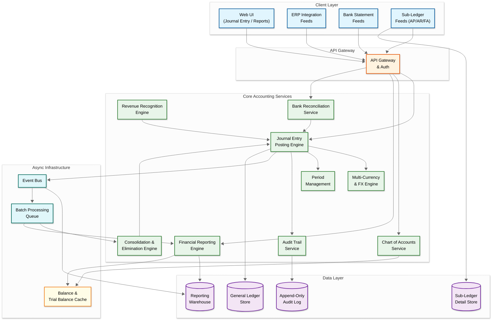
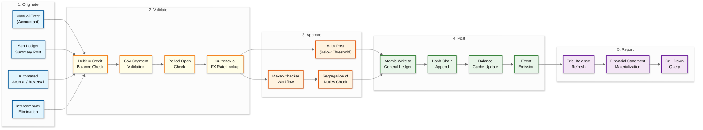

# Accounting / General Ledger System Design

## System Overview

An accounting and general ledger system---the financial backbone of enterprises such as those powered by SAP FI, Oracle Financials, Workday Financials, or Xero---provides the authoritative record of every monetary event in an organization. At its core is the **double-entry bookkeeping engine**: every financial transaction produces a balanced journal entry where total debits equal total credits, enforced at the database level through check constraints and pre-commit validation. The system maintains a **chart of accounts (CoA)** organized as a directed acyclic graph of account segments (company, department, natural account, cost center, project, intercompany) that encodes the organization's reporting structure and enables multi-dimensional financial analysis. Surrounding the general ledger are **sub-ledgers**---Accounts Payable (AP), Accounts Receivable (AR), Fixed Assets (FA), Inventory, Payroll, and Tax---each maintaining detailed transactional records that periodically summarize and post to the GL through controlled summarization pipelines.

The core engineering challenges span: **a double-entry posting engine** that atomically records balanced journal entries with sub-millisecond debit-credit validation across thousands of concurrent postings; **chart of accounts hierarchy management** supporting 6--12 segment structures with tens of thousands of account combinations and real-time rollup aggregation; **sub-ledger architecture** where AP, AR, Fixed Assets, and Inventory each maintain independent transactional detail while feeding summarized postings to the GL on configurable schedules; **bank reconciliation with auto-matching** that pairs thousands of bank statement lines against GL entries using fuzzy matching on amount, date, reference, and counterparty with configurable tolerance windows; **multi-currency accounting with revaluation** that tracks transactions in both functional and reporting currencies, performs month-end unrealized gain/loss calculations across thousands of open balances, and handles triangulation through intermediate currencies; **an immutable audit trail with hash chaining** where every journal entry, reversal, and adjustment is cryptographically linked to its predecessor, producing a tamper-evident ledger that satisfies SOX Section 404 internal control requirements; **revenue recognition engines** implementing ASC 606 (five-step model) and IFRS 15 with support for multi-element arrangements, variable consideration, and time-based performance obligation satisfaction; **a financial reporting engine** that generates trial balance, income statement, balance sheet, and cash flow statement from raw journal entries with sub-second latency for interactive drill-down; **intercompany consolidation and elimination** that automatically identifies, matches, and eliminates reciprocal transactions across legal entities while handling minority interests and currency translation adjustments; and **period open/close management** enforcing temporal boundaries on postings with soft-close, hard-close, and adjustment-period semantics.

---

## Key Characteristics

| Characteristic | Description |
|---------------|-------------|
| **Read/Write Pattern** | Mixed---write-heavy for journal postings, invoice processing, and sub-ledger feeds; read-heavy for reporting, trial balance generation, and audit queries |
| **Latency Sensitivity** | Medium for postings (sub-second for interactive entries, minutes for batch feeds); Low-to-Medium for reporting (sub-5s for trial balance, minutes for consolidation) |
| **Consistency Model** | Strong consistency for ledger entries (debit-credit balance enforced at transaction level); eventual consistency for reporting materialized views and analytics |
| **Data Volume** | High---large enterprises generate 50M--500M journal lines/year; 7--10 year retention for audit; reporting queries scan billions of rows |
| **Architecture Model** | Event-sourced with CQRS---journal entries are immutable events; reporting views are materialized projections; sub-ledger feeds are event-driven |
| **Regulatory Burden** | Very High---SOX (internal controls, audit trail), GAAP/IFRS (recognition standards), tax authority requirements, multi-jurisdiction statutory reporting |
| **Complexity Rating** | **Very High** |

---

## Quick Navigation

| Document | Description |
|----------|-------------|
| [00 - Index & Overview](./00-index.md) | System overview, key characteristics, architecture summary (this file) |
| [01 - Requirements & Estimations](./01-requirements-and-estimations.md) | Functional/non-functional requirements, capacity planning, SLOs |
| [02 - High-Level Design](./02-high-level-design.md) | Architecture diagrams, data flow, key decisions |
| [03 - Low-Level Design](./03-low-level-design.md) | Data models, API design, algorithms (pseudocode) |
| [04 - Deep Dive & Bottlenecks](./04-deep-dive-and-bottlenecks.md) | Double-entry engine internals, period close contention, reconciliation scaling |
| [05 - Scalability & Reliability](./05-scalability-and-reliability.md) | Scaling strategies, fault tolerance, disaster recovery |
| [06 - Security & Compliance](./06-security-and-compliance.md) | Threat model, SOX compliance, audit trail integrity, segregation of duties |
| [07 - Observability](./07-observability.md) | Metrics, logging, tracing, alerting, SLI/SLO dashboards |
| [08 - Interview Guide](./08-interview-guide.md) | 45-min pacing, trade-offs, trap questions, scoring rubric |
| [09 - Insights](./09-insights.md) | Key architectural insights, patterns, lessons |

---

## What Differentiates This from Related Systems

| Aspect | Accounting / GL (This) | Payment Processing (8.2) | Core Banking (8.6) | ERP System (9.1) | Tax Engine (9.3) |
|--------|------------------------|--------------------------|---------------------|-------------------|-------------------|
| **Primary Goal** | Maintain the authoritative, balanced record of all financial transactions and produce compliant financial statements | Route and settle payment transactions between payers and payees in real time | Manage customer deposit/loan accounts with real-time balance computation | Orchestrate end-to-end business processes (procurement, manufacturing, HR, finance) | Calculate tax obligations based on jurisdiction, product type, and transaction characteristics |
| **Data Semantics** | Every entry must balance (debits = credits); immutable once posted; corrections via reversing entries only | Transaction-centric: authorize, capture, settle; mutable status through lifecycle | Account-centric: running balances updated in real time per transaction | Process-centric: workflow state machines across functional modules | Rule-centric: stateless computation against tax code databases |
| **Temporal Model** | Period-based: fiscal years, quarters, months with open/close controls; accrual vs. cash basis | Real-time: transactions settle within seconds to days | Real-time: balances reflect every posted transaction immediately | Mixed: real-time operational data with period-based financial reporting | Point-in-time: rate lookup based on transaction date and jurisdiction |
| **Multi-Entity** | Core---intercompany elimination, consolidation across legal entities, minority interest calculations | Limited---merchant vs. platform entity split | Single entity per core banking instance; group consolidation is external | Multi-entity via shared master data and intercompany posting rules | Multi-jurisdiction tax nexus determination |
| **Audit Requirements** | SOX 404 internal controls, complete audit trail with hash chaining, 7-year retention, segregation of duties | PCI-DSS for card data, transaction logs for dispute resolution | Regulatory reporting (Basel III/IV), transaction audit trail | Process-level audit trails across modules | Tax return substantiation, rate determination audit trail |
| **Reporting** | Financial statements (P&L, balance sheet, cash flow), trial balance, dimensional analysis | Transaction volume, success rates, settlement summaries | Regulatory capital reports, interest accrual statements | Operational dashboards, cross-module analytics | Tax liability summaries, filing worksheets, exemption certificates |

---

## High-Level Architecture Overview

---

## Journal Entry Lifecycle

The journal entry lifecycle divides into five phases, each with distinct consistency and latency requirements:

- **Originate**: Journal entries arrive from four sources---manual accountant input, sub-ledger summarization (AP/AR/FA/Inventory posting batches of thousands of entries), automated accruals and reversals triggered by period close schedules, and intercompany elimination entries generated during consolidation. Each source has different validation strictness: manual entries undergo the most checks; automated reversals of previously validated entries skip redundant CoA validation.

- **Validate**: The posting engine enforces invariants before any write. The debit-credit balance check is non-negotiable---a journal entry with an imbalance of even one cent is rejected. CoA segment validation ensures every account combination is active, properly structured (correct segment values in each position), and authorized for the posting entity. Period validation checks that the target accounting period is open for the entry type (standard entries, adjusting entries, or closing entries each have independent period controls). Multi-currency entries trigger FX rate lookup from the rate table, with fallback logic for missing rates (triangulation through USD, prior-day rate with warning, or hard rejection).

- **Approve**: Entries below configurable thresholds auto-post without human intervention. Entries above thresholds enter a maker-checker workflow where the preparer cannot also approve. The system enforces segregation of duties---cross-referencing the user's role against a duty matrix that prevents the same person from creating a vendor in AP and approving payments to that vendor. Approval routing may vary by journal source, amount, account type (balance sheet vs. income statement), and entity.

- **Post**: The atomic write commits the journal header and all lines to the general ledger in a single transaction. Simultaneously, the system appends to the hash chain---computing a cryptographic hash of the current entry's content combined with the previous entry's hash, creating a tamper-evident chain that auditors can verify. Balance caches for affected accounts are updated synchronously (for real-time trial balance) or asynchronously (for reporting views). An event is emitted to the event bus, triggering downstream consumers: reporting warehouse refresh, intercompany matching, and bank reconciliation candidate generation.

- **Report**: Trial balance materialization aggregates all posted entries by account, producing debit and credit totals that must balance across the entire ledger. Financial statements (income statement, balance sheet, cash flow) are computed from trial balance data using configurable report definitions that map accounts to statement line items. Drill-down capability allows auditors to trace any financial statement line through the trial balance down to individual journal entries and their originating sub-ledger transactions.

---

## Core Architectural Decisions

| Decision | Choice | Rationale |
|----------|--------|-----------|
| **Ledger Immutability** | Append-only with reversing entries; no updates or deletes to posted journals | Audit compliance demands complete history; corrections via reversing entries preserve the original record and the correction as separate, traceable events |
| **Event Sourcing for GL** | Journal entries as immutable events; balances as derived projections | Natural fit---the ledger is inherently an event log; balances are aggregations; replaying events enables period re-close and retroactive corrections |
| **CQRS Split** | Separate write model (posting engine) from read model (reporting warehouse) | Write path optimized for transactional integrity (row-level locking, constraint checks); read path optimized for analytical aggregation (columnar storage, pre-computed rollups) |
| **Sub-Ledger Integration** | Event-driven summarization with configurable posting frequency | Sub-ledgers generate high-volume detail (individual invoices); GL needs summaries (daily AP posting by account). Event-driven decoupling allows each sub-ledger to evolve independently while maintaining GL consistency |
| **Multi-Currency Storage** | Triple-amount storage: transaction currency, functional currency, reporting currency | Eliminates recomputation during reporting; supports revaluation by storing the original rate and allowing gain/loss calculation against current rates |
| **Audit Trail** | Hash-chained append-only log with segregated storage | Hash chaining provides cryptographic tamper evidence beyond simple append-only semantics; segregated storage prevents accidental deletion through application-level bugs |
| **Period Management** | Finite state machine per period per entity with role-based transitions | Period open/close is a critical control point; FSM prevents invalid transitions (e.g., re-opening a hard-closed period without CFO override) |
| **Chart of Accounts** | Segmented structure with validation rules per segment | Segments enable multi-dimensional reporting without separate dimension tables; validation rules prevent posting to invalid combinations (e.g., revenue accounts in a cost-center-only segment) |

---

## Key Engineering Challenges

| Challenge | Why It Matters | Design Implication |
|-----------|---------------|-------------------|
| **Debit-credit balance enforcement at scale** | Every journal entry must balance to zero across all lines; a single unbalanced entry corrupts the entire ledger | Database-level check constraints on journal header aggregate; application-level pre-validation to fail fast before hitting the database; batch posting pipelines must validate each entry independently within the batch |
| **Period close contention** | Month-end close requires freezing a period while hundreds of users are still posting; premature close loses entries, late close delays reporting | Soft-close phase allows only specific entry types (adjustments); hard-close is irreversible and triggers trial balance snapshot; concurrent posting during close window requires careful locking strategy---partition by period + entity to minimize contention |
| **Sub-ledger to GL reconciliation** | Sub-ledger detail must reconcile to GL summary; discrepancies indicate posting failures or timing differences | Reconciliation checkpoints after each posting batch; automated comparison of sub-ledger account totals vs. GL control account balances; discrepancy alerts trigger investigation workflows before period close is permitted |
| **Multi-currency revaluation at month-end** | Open balances in foreign currencies must be revalued at closing rates; unrealized gain/loss entries must be generated and posted automatically | Batch process scans all open foreign currency balances, computes gain/loss against closing rates, generates reversing entries for the next period; must handle thousands of balances across dozens of currencies within the close window |
| **Immutable audit trail with hash chaining** | SOX requires tamper-evident records; simple append-only logs can be truncated or have rows deleted by DBAs | Hash chain links each entry to its predecessor cryptographically; periodic chain verification detects breaks; chain anchoring to external timestamping service provides non-repudiation; segregated storage with separate access controls from the main ledger |
| **Intercompany elimination at consolidation** | Parent company financial statements must eliminate reciprocal transactions (Entity A sells to Entity B); manual elimination is error-prone across hundreds of entities | Automated matching engine identifies reciprocal pairs by intercompany account segments and counterparty entity codes; generates elimination journal entries; handles partial matches and timing differences where one side has posted but the other has not |
| **Chart of accounts hierarchy performance** | Trial balance rollup must aggregate thousands of leaf accounts through multi-level hierarchies in sub-second time for interactive reporting | Pre-computed rollup caches at each hierarchy level; incremental update on posting (adjust parent balances when child receives a posting); cache invalidation strategy when CoA structure changes mid-period |
| **Revenue recognition complexity** | ASC 606 / IFRS 15 requires identifying performance obligations in contracts, allocating transaction price, and recognizing revenue as obligations are satisfied---potentially over months or years | Dedicated revenue recognition engine that models contracts as multi-element arrangements; waterfall schedules for time-based recognition; event-driven triggers for point-in-time recognition; reallocation logic when contract modifications occur |
| **Bank reconciliation auto-matching** | Thousands of bank statement lines must be matched to GL entries daily; unreconciled items indicate errors or fraud | Multi-criteria fuzzy matching (amount within tolerance, date within window, reference number similarity, counterparty name matching); confidence scoring with configurable auto-match thresholds; unmatched items routed to human review queue; reconciliation must complete before period close |
| **Concurrent batch and interactive posting** | Month-end close involves massive batch posting runs (sub-ledger summaries, accruals, revaluations) concurrent with accountants making manual adjustments | Optimistic concurrency on account balances; batch jobs partitioned by account range to minimize lock contention with interactive users; priority scheduling ensures manual entries are not starved by long-running batch jobs |

---

## What Makes This System Unique

1. **The Ledger as an Immutable Event Log with Algebraic Invariants**: Unlike most systems where data undergoes CRUD operations, a general ledger is fundamentally append-only with a mathematical invariant: every journal entry must satisfy `SUM(debits) = SUM(credits)`. This invariant is not a business rule that can be relaxed---it is the defining property of double-entry bookkeeping, and violating it even once renders the entire ledger untrustworthy. The system must enforce this at multiple layers: application-level validation before submission, database-level check constraints at write time, and periodic full-ledger verification during close. Corrections are never made by editing; they are made by posting new reversing entries that reference the original, creating a complete audit chain. This append-only, invariant-preserving model maps naturally to event sourcing, where journal entries are events, and account balances are projections derived by replaying the event stream.

2. **Chart of Accounts as a Multi-Dimensional Encoding Scheme**: The chart of accounts is not simply a list of account numbers---it is a segmented encoding structure where each account string (e.g., `1000-200-5100-300-001`) encodes multiple independent dimensions: company (1000), department (200), natural account (5100), cost center (300), project (001). Each segment has its own validation rules, hierarchies, and access controls. The combinatorial explosion of valid segment combinations (potentially millions) must be managed through cross-validation rules that permit only certain combinations. Reporting rollups traverse these hierarchies independently---a manager can view expenses rolled up by department across all cost centers, or by cost center across all departments. This multi-dimensional structure is the foundation for management accounting and drives the schema design of the entire system.

3. **Sub-Ledger Architecture as a Federation of Specialized Systems**: AP, AR, Fixed Assets, Inventory, and Payroll are each complex domains in their own right, but from the GL's perspective, they are detail systems that periodically post summary entries. The architectural challenge is maintaining this boundary cleanly: sub-ledgers own their transactional detail (individual invoices, depreciation schedules, inventory movements) and post summaries to the GL at configurable frequencies (real-time, daily, on-demand). The GL maintains control accounts that must reconcile with sub-ledger totals. This is a distributed consistency problem---the sub-ledger and GL are separate data stores that must agree on totals, with reconciliation serving as the consistency verification mechanism.

4. **Period Close as a Distributed State Machine**: Closing an accounting period is a multi-step, multi-system orchestration: freeze standard postings, run accrual calculations, execute sub-ledger posting runs, perform foreign currency revaluation, generate intercompany eliminations, run reconciliations, compute trial balance, generate financial statements, and finally hard-close the period. Each step has preconditions (reconciliation must pass before close), rollback semantics (if revaluation fails, the period remains in soft-close), and concurrency constraints (adjusting entries are allowed during soft-close, nothing during hard-close). This process often spans hours and involves coordination across multiple services, making it one of the most complex orchestration challenges in enterprise software.

5. **Multi-Currency as a Three-Layer Computation Model**: Every transaction in a multi-currency ledger exists in three currency layers: the transaction currency (what was actually paid), the functional currency (the legal entity's operating currency, used for local books), and the reporting currency (the parent company's consolidation currency). Each layer requires its own rate source, rounding rules, and gain/loss computation. Month-end revaluation scans every open monetary balance, computes the unrealized gain/loss by comparing the original functional-currency amount with the current-rate equivalent, and posts adjustment entries. These revaluation entries reverse on the first day of the next period, creating a pattern of posting-and-reversal that doubles the journal entry volume during close periods.

6. **Intercompany Consolidation as a Graph Elimination Problem**: When a corporate group has dozens or hundreds of legal entities that transact with each other, the consolidated financial statements must eliminate these internal transactions to show only external activity. The system must identify matching intercompany pairs (Entity A recorded a sale of $1M to Entity B; Entity B recorded a purchase of $1M from Entity A), handle mismatches (Entity A posted $1M but Entity B only posted $980K due to timing), compute currency translation adjustments for foreign subsidiaries, and handle minority interests for partially owned entities. This is a graph problem where entities are nodes, intercompany transactions are edges, and elimination walks the graph to zero out internal flows while preserving external balances.

---

## Quick Reference: Scale Numbers

| Metric | Value | Notes |
|--------|-------|-------|
| Journal entries posted/day | 500K--5M | Varies by enterprise size; spikes 3--5x during month-end close |
| Journal lines (entry details)/day | 2M--20M | Average 4--6 lines per journal entry |
| Chart of accounts (leaf accounts) | 5K--50K | Large multinationals may exceed 100K with segment combinations |
| CoA hierarchy levels | 4--8 | Rollup depth for reporting aggregation |
| Sub-ledger posting batches/day | 50--500 | AP, AR, FA, Inventory, Payroll each posting independently |
| Bank statement lines reconciled/day | 10K--100K | Across all bank accounts and entities |
| Auto-match success rate | 75--90% | Remaining items require manual reconciliation |
| Open foreign currency balances (month-end) | 10K--500K | Each requiring revaluation computation |
| Supported currencies | 50--170 | With daily rate ingestion from multiple FX providers |
| Legal entities in consolidation | 10--500 | Large multinationals; each with independent ledgers |
| Intercompany transaction pairs/month | 5K--100K | Requiring matching and elimination during consolidation |
| Trial balance generation latency | < 3s | Interactive queries against pre-computed rollups |
| Period close duration | 2--8 hours | Fully automated; manual intervention extends this significantly |
| Audit trail entries/year | 100M--2B | Every posting, approval, and state transition |
| Data retention | 7--10 years | Regulatory minimum; some jurisdictions require longer |
| Concurrent users during close | 200--2,000 | Accountants making final adjustments before hard-close |
| Revenue recognition schedules (active) | 10K--500K | Multi-element contracts with monthly recognition events |
| Financial statement generation | < 30s | Full P&L, balance sheet, and cash flow for a single entity |
| Consolidation run time | 5--60 minutes | Depends on entity count and intercompany volume |

---

## Related Designs

| Design | Relevance |
|--------|-----------|
| [9.1 - ERP System](../9.1-erp-system-design/) | Parent system context; GL is the financial hub of ERP; sub-ledger integration patterns |
| [9.3 - Tax Calculation Engine](../9.3-tax-calculation-engine/) | Tax determination feeds journal entries; tax liability accounts in GL |
| [8.2 - Stripe/Razorpay](../8.2-stripe-razorpay/) | Payment processing generates AR/AP entries that flow to sub-ledgers and ultimately to GL |
| [8.4 - Digital Wallet](../8.4-digital-wallet/) | Double-entry ledger patterns, balance computation, reconciliation |
| [8.6 - Core Banking System](../8.6-distributed-ledger-core-banking/) | Ledger architecture, multi-currency accounting, regulatory compliance patterns |
| [8.10 - Expense Management](../8.10-expense-management-system/) | Expense reimbursements post through AP sub-ledger to GL; policy-validated journal entries |
| [1.18 - Event Sourcing](../1.18-event-sourcing-system/) | Event sourcing architecture directly applicable to immutable journal entry design |
| [1.19 - CQRS](../1.19-cqrs-implementation/) | CQRS pattern for separating posting (write) from reporting (read) workloads |
| [1.5 - Distributed Log-Based Broker](../1.5-distributed-log-based-broker/) | Event streaming for audit trail, sub-ledger posting events, reporting pipeline |

---

## Sources

- FASB ASC 606 --- Revenue from Contracts with Customers: Five-Step Recognition Model
- IFRS 15 --- Revenue from Contracts with Customers: Performance Obligation Framework
- SOX Section 404 --- Management Assessment of Internal Controls over Financial Reporting
- AICPA --- Audit and Accounting Guide: Revenue Recognition
- PCAOB AS 2201 --- An Audit of Internal Control over Financial Reporting
- GAAP Codification --- ASC 830: Foreign Currency Matters (Translation and Remeasurement)
- IAS 21 --- The Effects of Changes in Foreign Exchange Rates
- IFRS 10 --- Consolidated Financial Statements: Elimination and Minority Interest
- Martin Fowler --- Patterns of Enterprise Application Architecture (Accounting Patterns)
- SAP --- Financial Accounting (FI) Architecture and Data Model Reference
- Oracle --- Financials Cloud: General Ledger Technical Architecture Guide
- COSO Framework --- Internal Control over Financial Reporting Components
- ISO 19005 --- Document Management for Long-Term Preservation (Audit Trail Archival)
- Ernst & Young --- Global Close and Consolidation: Automation Strategies and Best Practices
