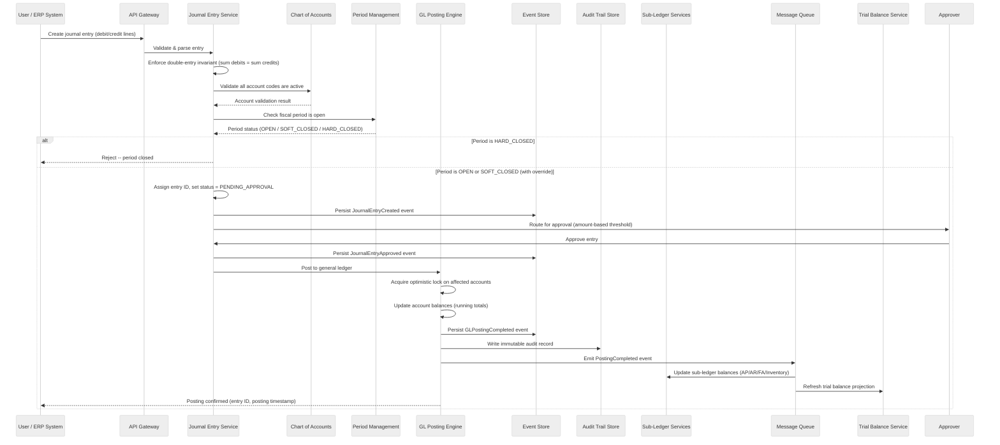
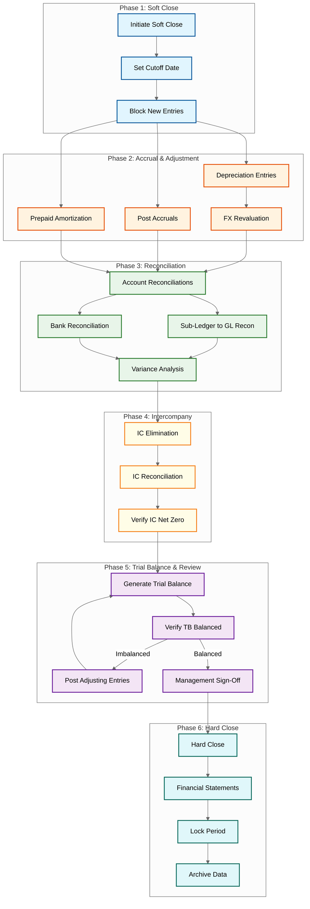
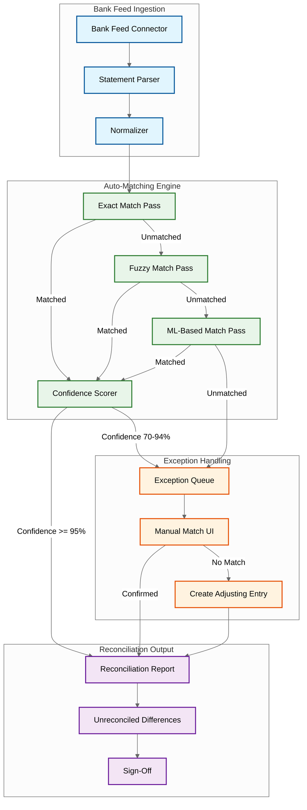

# High-Level Design

## Architecture Overview

The Accounting/General Ledger System follows an **event-sourced, CQRS-based architecture** with six logical layers: **Client** (web dashboard, ERP integrations, API clients), **API Gateway** (auth, rate limiting, tenant routing), **Core Ledger Services** (journal entry processing, GL posting, chart of accounts, fiscal period control), **Sub-Ledger Services** (AP, AR, fixed assets, inventory), **Financial Services** (revenue recognition, intercompany, consolidation), **Matching & Reconciliation** (bank reconciliation, auto-matching), and **Reporting** (financial statements, trial balance, budgeting). Every ledger mutation is captured as an immutable event, guaranteeing a tamper-evident audit trail. The write path enforces double-entry invariants at the service boundary; the read path projects materialized views optimized for reporting. Corrections are performed exclusively via reversing journal entries, preserving complete posting history.

---

## 1. System Architecture Diagram

```mermaid
%%{init: {'theme': 'neutral'}}%%
flowchart TB
    subgraph Clients["Client Layer"]
        WEB[Web Dashboard]
        ERP[ERP Integration]
        APIC[API Clients]
    end
    subgraph Gateway["API Gateway Layer"]
        AG[API Gateway]
        AUTH[Auth & RBAC]
        RL[Rate Limiter]
    end
    subgraph Core["Core Ledger Services"]
        JES[Journal Entry Service]
        GLP[GL Posting Engine]
        COA[Chart of Accounts Service]
        PMS[Period Management Service]
    end
    subgraph SubLedger["Sub-Ledger Services"]
        APS[AP Service]
        ARS[AR Service]
        FAS[Fixed Assets Service]
        ILS[Inventory Ledger Service]
    end
    subgraph Financial["Financial Services"]
        RRE[Revenue Recognition Engine]
        ICS[Intercompany Service]
        CE[Consolidation Engine]
    end
    subgraph Matching["Matching & Reconciliation"]
        BRS[Bank Reconciliation Service]
        AME[Auto-Matching Engine]
    end
    subgraph Reporting["Reporting Layer"]
        FRE[Financial Reporting Engine]
        TBS[Trial Balance Service]
        BDS[Budgeting Service]
    end
    subgraph Data["Data Layer"]
        PDB[(Primary Ledger DB)]
        EVS[(Event Store)]
        ATS[(Audit Trail Store)]
        DCS[(Document Store)]
        CACHE[(Cache)]
        MQ[[Message Queue]]
    end
    subgraph External["External Systems"]
        BF[Bank Feeds]
        CRP[Currency Rate Provider]
        TXE[Tax Engine]
    end

    WEB & ERP & APIC --> AG
    AG --> AUTH & RL
    AG --> JES & COA & PMS

    JES --> GLP
    GLP --> PDB & EVS
    GLP --> ATS
    COA --> PDB & CACHE
    PMS --> PDB & CACHE

    JES --> MQ
    MQ --> APS & ARS & FAS & ILS
    APS & ARS & FAS & ILS --> PDB

    MQ --> RRE & ICS & CE
    RRE --> PDB
    ICS --> PDB & EVS
    CE --> PDB

    BF --> BRS
    BRS --> AME
    AME --> PDB & CACHE

    MQ --> FRE & TBS & BDS
    FRE --> DCS & CACHE
    TBS --> PDB & CACHE
    BDS --> PDB

    GLP --> CRP
    APS & ARS --> TXE

    classDef client fill:#e1f5fe,stroke:#01579b,stroke-width:2px
    classDef gateway fill:#fff3e0,stroke:#e65100,stroke-width:2px
    classDef service fill:#e8f5e9,stroke:#2e7d32,stroke-width:2px
    classDef data fill:#f3e5f5,stroke:#6a1b9a,stroke-width:2px
    classDef cache fill:#fffde7,stroke:#f57f17,stroke-width:2px
    classDef queue fill:#e0f7fa,stroke:#00695c,stroke-width:2px
    classDef external fill:#e0f7fa,stroke:#00695c,stroke-width:2px

    class WEB,ERP,APIC client
    class AG,AUTH,RL gateway
    class JES,GLP,COA,PMS,APS,ARS,FAS,ILS,RRE,ICS,CE,BRS,AME,FRE,TBS,BDS service
    class PDB,EVS,ATS,DCS data
    class CACHE cache
    class MQ queue
    class BF,CRP,TXE external
```



---

## 2. Data Flow Diagrams

### 2.1 Journal Entry Lifecycle Flow

This sequence covers the complete lifecycle from entry creation through GL posting, sub-ledger synchronization, and audit trail persistence.



**Key design notes:**

- **Double-entry validation** rejects any entry where debits do not equal credits, validated in both transaction currency and functional currency.
- **Approval routing** is configurable per tenant -- entries below a threshold are auto-approved; entries above trigger multi-level approval with delegation and escalation.
- **Optimistic locking** on account balances prevents lost updates during concurrent postings. On version conflict, the posting retries with the latest balance.
- **Every state transition emits an event**, enabling downstream projections (trial balance, financial reports) to rebuild from the event stream.

---

### 2.2 Month-End Close Flow

The month-end close is a multi-phase orchestrated process that transitions a fiscal period from OPEN through SOFT_CLOSE to HARD_CLOSE.



**Close process design considerations:**

- **Soft close** permits adjusting entries with override authorization while blocking operational entries; **hard close** is irreversible.
- **The close is orchestrated as a saga** with checkpoint persistence -- on failure, it resumes from the last checkpoint rather than restarting.
- **Each phase emits progress events** consumed by a close dashboard for real-time visibility. Bottleneck detection highlights tasks blocking the close.

---

### 2.3 Bank Reconciliation Flow

Bank reconciliation matches bank statement transactions against ledger entries using a progressive matching strategy.



**Matching algorithm (pseudocode):**

```
FUNCTION reconcile_statement(statement, ledger_entries):
    unmatched_bank = statement.transactions
    unmatched_ledger = ledger_entries
    matches = []

    // Pass 1: Exact match on amount + date + reference
    FOR EACH btxn IN unmatched_bank:
        candidate = find_exact(unmatched_ledger, amount=btxn.amount,
            date=btxn.value_date, reference=btxn.reference_number)
        IF candidate EXISTS:
            matches.append(Match(btxn, candidate, confidence=1.0))
            remove btxn and candidate from unmatched sets

    // Pass 2: Fuzzy match on amount + date range + narrative similarity
    FOR EACH btxn IN unmatched_bank:
        candidates = find_fuzzy(unmatched_ledger, amount_tolerance=0.01,
            date_range=[btxn.date - 5_days, btxn.date + 2_days])
        best = max(candidates, key=description_similarity(btxn.narrative))
        IF best.similarity > 0.80:
            matches.append(Match(btxn, best, confidence=best.similarity))
            remove btxn and best from unmatched sets

    // Pass 3: ML-based matching for remaining items
    FOR EACH btxn IN unmatched_bank:
        prediction = ml_model.predict_match(btxn, unmatched_ledger)
        IF prediction.confidence > 0.70:
            matches.append(Match(btxn, prediction.entry, prediction.confidence))

    // Remaining unmatched items go to exception queue
    enqueue remaining unmatched_bank as BANK_ONLY exceptions
    enqueue remaining unmatched_ledger as LEDGER_ONLY exceptions
    RETURN ReconciliationResult(matches, exception_queue)
```

**Bank feed ingestion details:**

- Feeds are ingested via standardized formats (MT940, CAMT.053, BAI2, OFX) through configurable connectors that normalize raw statements into a canonical model (date, amount, currency, narrative, reference, balance).
- The engine handles one-to-one, one-to-many, and many-to-one matching scenarios. The ML model is trained per-tenant on historical reconciliation decisions.

---

## 3. Key Architecture Decisions

| Decision | Chosen Approach | Rationale | Trade-off |
|----------|----------------|-----------|-----------|
| **Event sourcing for audit trail** | Every mutation stored as an immutable event; balances are derived projections | SOX/IFRS require tamper-evident audit trail; event sourcing provides this natively; enables point-in-time balance reconstruction | Higher storage; read queries need projections (mitigated by materialized views); event schema evolution |
| **CQRS for read/write separation** | Write path persists events; read path serves pre-computed projections | Reporting aggregations across millions of postings must not impact transactional throughput | Eventual consistency (under 3s); additional projection infrastructure |
| **Immutable ledger entries** | Posted entries never modified/deleted; corrections via reversing entries only | Immutability is fundamental to accounting; reversing entries preserve history and are audit-visible | Additional entries for corrections; requires clear reversal UX |
| **Optimistic locking for concurrent postings** | Version-based CAS on account balance records | Pessimistic locks on hot accounts (cash, revenue) bottleneck during month-end close and payroll | Retry overhead under contention; requires idempotent posting logic |
| **Partitioning by fiscal period** | Ledger data partitioned by period; closed partitions independently archived | Financial queries are period-scoped; partition pruning eliminates irrelevant data; cold storage for closed periods | Cross-period queries (YTD) fan out; partition boundary management |
| **Double-entry validation at service boundary** | Balanced-entry invariant enforced before persistence | API-boundary validation prevents corruption and gives immediate feedback; DB constraints as safety net | Write-path latency; multi-currency needs real-time exchange rate lookup |

---

## 4. Component Responsibilities

| Component | Responsibilities | Key Dependencies |
|-----------|-----------------|------------------|
| **Journal Entry Service** | Accept, validate, and persist journal entries; enforce double-entry invariant; support manual, recurring, and system-generated entries; manage entry lifecycle (DRAFT > PENDING_APPROVAL > APPROVED > POSTED > REVERSED) | COA Service, Period Mgmt, GL Posting Engine, Event Store |
| **GL Posting Engine** | Post approved entries to the general ledger; update running account balances with optimistic concurrency; handle multi-currency postings with exchange rate conversion; emit posting events | Primary DB, Event Store, Audit Trail, Currency Rate Provider |
| **Chart of Accounts Service** | Manage hierarchical account structure; support creation, deactivation, reclassification; enforce numbering conventions; maintain account metadata (currency, cost center, department) | Primary DB, Cache |
| **Period Management Service** | Manage fiscal calendar and period transitions (OPEN > SOFT_CLOSE > HARD_CLOSE); enforce posting restrictions per status; support non-standard fiscal years (4-4-5, 4-5-4) | Primary DB, Cache |
| **AP Service** | Manage vendor invoices, credit memos, payment scheduling; generate AP journal entries on approval; maintain vendor aging reports | Primary DB, Journal Entry Service, Tax Engine |
| **AR Service** | Manage customer invoices, receipts, credit notes; generate AR journal entries on issuance/payment; maintain aging and DSO metrics; support dunning workflows | Primary DB, Journal Entry Service, Tax Engine |
| **Fixed Assets Service** | Track acquisition, depreciation (straight-line, declining balance, units-of-production), disposal, impairment; auto-generate monthly depreciation entries | Primary DB, Journal Entry Service, Period Mgmt |
| **Inventory Ledger Service** | Maintain inventory valuation (FIFO, LIFO, weighted average); generate COGS entries on movements; support revaluation and write-downs | Primary DB, Journal Entry Service |
| **Revenue Recognition Engine** | Apply ASC 606 / IFRS 15 rules (point-in-time, over-time, milestone); generate deferred and recognized revenue entries on schedule | Primary DB, Journal Entry Service, Period Mgmt |
| **Intercompany Service** | Record intercompany transactions; auto-generate mirror entries in counterparty entity; maintain IC balances; flag imbalances before close | Primary DB, Journal Entry Service, Event Store |
| **Consolidation Engine** | Aggregate trial balances across entities; apply elimination entries; handle currency translation (current rate, temporal method); produce consolidated statements | Primary DB, Intercompany Service, Currency Rate Provider |
| **Bank Reconciliation Service** | Ingest and normalize bank feeds; orchestrate three-pass matching pipeline; manage exception queues; produce reconciliation reports with sign-off | Bank Feeds, Auto-Matching Engine, Primary DB |
| **Auto-Matching Engine** | Execute exact, fuzzy, and ML-based matching; score confidence; handle 1:1, 1:N, N:1 scenarios; learn from manual match decisions | Primary DB, Cache, ML Model |
| **Financial Reporting Engine** | Generate balance sheet, income statement, cash flow, equity changes; support multi-GAAP (US GAAP, IFRS); export to XBRL | Document Store, Cache, Trial Balance Service |
| **Trial Balance Service** | Compute and cache trial balance per period; drill-down to individual postings; detect out-of-balance conditions; support adjusted/unadjusted views | Primary DB, Cache |
| **Budgeting Service** | Manage budget creation, approval, versioning; actuals vs. budget comparison; rolling forecasts; variance analysis with drill-down | Primary DB, Trial Balance Service |

---

## 5. Integration Points

| Integration | Protocol / Method | Data Flow | Key Considerations |
|------------|-------------------|-----------|-------------------|
| **ERP Modules (HR, Procurement, Sales)** | Event-driven via message queue; batch file import/export | ERP modules emit events (payroll processed, PO received, order fulfilled) triggering journal entry generation | Idempotent processing; schema registry for event versioning; tenant-scoped routing |
| **Banking Systems** | SFTP ingestion (MT940, BAI2); API feeds (Open Banking, CAMT.053); ISO 20022 payment initiation | Inbound: statements for reconciliation. Outbound: payment instructions for AP | Encryption at rest and in transit; bank-specific adapters behind unified interface |
| **Tax Engines** | Synchronous API for invoice-time calculation; batch extracts for filing | AP/AR query tax engine for jurisdiction-specific rates and exemptions; GL provides data for returns | Circuit breaker with fallback to cached rates; separate tax audit trail |
| **Regulatory Reporting** | Batch export (XBRL, iXBRL, local GAAP formats) | Financial Reporting Engine produces compliant reports from consolidated trial balance | Report versioning and signing; COA-to-taxonomy mapping; 7-10 year retention |
| **BI / Analytics** | CDC stream from event store; scheduled warehouse loads | Ledger events streamed to analytics for management reporting and ad-hoc queries | Read replica / CDC to avoid production impact; PII masking; snapshot consistency |
| **Currency Rate Providers** | Scheduled polling (hourly major, daily exotic); on-demand lookup | GL Posting Engine and Consolidation Engine consume rates for conversion and translation | Rate caching with staleness thresholds; multiple rate types (spot, closing, average) |
| **Document Management** | API storage/retrieval; metadata-indexed search | Supporting documents attached to entries via references in the document store | Retention aligned with fiscal period archival; inherited access control |

---

## 6. Architecture Pattern Checklist

| Pattern | Applied | Rationale |
|---------|---------|-----------|
| **Event Sourcing** | Yes | Every ledger mutation is an immutable event; balances are projections. Complete audit trail, point-in-time reconstruction, and regulatory compliance without a separate audit subsystem. |
| **CQRS** | Yes | Write path persists events; read path serves materialized projections (trial balances, statements). Prevents reporting queries from degrading posting throughput. |
| **Saga / Process Manager** | Yes | Month-end close and multi-step approvals orchestrated as sagas with checkpoint persistence. Resumable, observable processes with compensation on failure. |
| **Optimistic Concurrency** | Yes | Version-based CAS on account balances. Avoids lock contention on high-traffic accounts during peak posting while ensuring no lost updates. |
| **Immutable Append-Only Store** | Yes | Posted entries never mutated or deleted; corrections via reversing entries. Event store and audit trail are append-only, satisfying SOX/IFRS requirements. |
| **API Gateway** | Yes | Single entry point for auth (JWT + service accounts), RBAC (segregation of duties), rate limiting, and tenant isolation. |
| **Event-Driven Architecture** | Yes | Domain events (JournalEntryCreated, GLPostingCompleted, PeriodClosed) decouple services. Sub-ledgers, projections, and integrations consume asynchronously. |
| **Partitioning (Time-Based)** | Yes | Ledger data partitioned by fiscal period. Partition pruning for period-scoped queries; independent archival of closed periods. |
| **Circuit Breaker** | Yes | Applied to bank feeds, tax engine, currency rate provider. Fallback to cached data or queued retry on external outages. |
| **Idempotency** | Yes | All posting operations carry idempotency keys. Duplicate event processing detected and suppressed for retry safety. |
