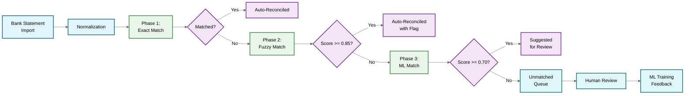
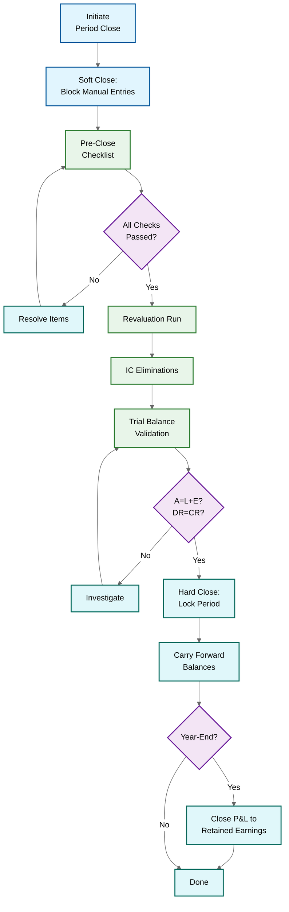

# Deep Dive & Bottlenecks

## Overview

This document examines the five most critical subsystems of an accounting/general ledger platform: the double-entry posting engine, bank reconciliation matching, period close orchestration, immutable audit trails, and the revenue recognition engine. Each section dissects failure modes, concurrency hazards, and optimizations for a system handling millions of journal entries with zero tolerance for balance discrepancies.

---

## 1. Double-Entry Posting Engine Deep Dive

### ACID Guarantees for Balanced Entries

Every financial event---invoice, payment, payroll, depreciation---must be recorded as a balanced journal entry where total debits equal total credits. The posting engine enforces this within a single database transaction. A single unbalanced entry renders the entire ledger unreliable, violates GAAP/IFRS, and can trigger audit failures.

```
FUNCTION post_journal_entry(entry):
    total_debits = SUM(line.amount FOR line IN entry.lines WHERE line.type = DEBIT)
    total_credits = SUM(line.amount FOR line IN entry.lines WHERE line.type = CREDIT)
    IF total_debits != total_credits:
        RETURN ValidationError("Unbalanced: DR=" + total_debits + " CR=" + total_credits)
    IF entry.period.is_closed:
        RETURN PeriodClosedError(entry.period)

    BEGIN TRANSACTION:
        entry_id = JournalStore.Insert(entry.header)
        FOR EACH line IN entry.lines:
            JournalLineStore.Insert(entry_id, line)
            update_account_balance(line.account_id, line.type, line.amount)
        AuditLog.Append(entry_id, hash_chain_link(entry))
    COMMIT
    RETURN Success(entry_id)
```

In practice, the engine uses READ COMMITTED for journal inserts and applies targeted locking only on account balance rows, avoiding the full cost of SERIALIZABLE isolation.

### Locking Strategies for Concurrent Balance Updates

**Pessimistic locking** acquires a row-level exclusive lock (`SELECT ... FOR UPDATE`) on the balance row before mutation. Simple and correct, but creates serial bottlenecks on frequently updated accounts. **Optimistic locking** reads the balance, computes the new value, and writes with a version check---better throughput under low contention, but high retry rates on hot accounts where many transactions compete for the same row.

### Hot Account Problem and Balance Sharding

A small set of accounts---cash, revenue, accounts receivable, intercompany clearing---receive a disproportionate share of postings. During month-end, the cash account might absorb 10,000+ entries per hour. Both locking strategies degrade under this load.

**Solution**: Split a hot account's balance across N sub-balance rows. Each posting targets a randomly selected shard, reducing single-row contention by a factor of N. The true balance is the sum of all shards:

```
FUNCTION update_sharded_balance(account_id, type, amount, shard_count):
    shard_id = RANDOM(0, shard_count - 1)
    UPDATE account_balance_shards
        SET debit_total = debit_total + (amount IF type = DEBIT ELSE 0),
            credit_total = credit_total + (amount IF type = CREDIT ELSE 0)
        WHERE account_id = account_id AND shard_id = shard_id

FUNCTION get_account_balance(account_id):
    shards = SELECT SUM(debit_total), SUM(credit_total)
        FROM account_balance_shards WHERE account_id = account_id
    RETURN Balance(debit_total=shards[0], credit_total=shards[1],
                   net=shards[0] - shards[1])
```

Typically 8--32 shards per hot account. The system dynamically adjusts: if retry rates exceed 5%, the shard manager doubles the count; during quiet periods, a background compactor merges shards back.

### Batch Posting Optimization

Month-end accruals, depreciation, and allocation entries often produce thousands of journal entries in a single batch. Posting them individually creates N transactions with N commit flushes.

**Optimization**: Group entries by target accounts and post in micro-batches of 50--200. Within each micro-batch, all balance updates for the same account are pre-aggregated into a single delta, reducing lock acquisitions from N to 1 per account per batch:

```
FUNCTION batch_post(entries):
    -- Phase 1: Validate all entries
    FOR EACH entry IN entries:
        validate_balance(entry)
        validate_period_open(entry)

    -- Phase 2: Aggregate balance deltas per account
    delta_map = HashMap<account_id, (debit_delta, credit_delta)>()
    FOR EACH entry IN entries:
        FOR EACH line IN entry.lines:
            delta_map[line.account_id].add(line.type, line.amount)

    -- Phase 3: Single transaction for the batch
    BEGIN TRANSACTION:
        JournalStore.BulkInsert(entries)
        FOR EACH (account_id, deltas) IN delta_map:
            update_sharded_balance(account_id, deltas.debit, deltas.credit)
    COMMIT
```

---

## 2. Bank Reconciliation Matching Deep Dive

### Three-Phase Matching Pipeline



**Phase 1 --- Exact Matching**: Match on the triple of amount + date + reference number. Bank transactions carry reference IDs (check numbers, wire refs) that also appear in GL entries. Typical auto-match rate: 60--75%.

**Phase 2 --- Fuzzy Matching**: Configurable tolerances---date window of +/- 3 business days, amount tolerance (exact for > $100, +/- $0.05 for smaller amounts), and description similarity via Levenshtein distance normalized by string length (threshold >= 0.7). Composite score weights: 50% amount, 30% date proximity, 20% description similarity.

**Phase 3 --- ML Matching**: A trained model evaluates candidate pairs using features: amount ratio (bank/GL), date delta, cosine similarity of description embeddings, historical counterparty-to-account patterns, and transaction type signals. Trained on historical match pairs and explicitly rejected pairs. Retrained weekly on the latest 90 days.

### One-to-Many and Many-to-One Matching

A single bank deposit may correspond to multiple GL entries (batch deposit of 50 customer checks), and conversely, multiple bank fees may net against a single GL accrual entry.

The engine uses **group matching**: if no 1:1 match exists, search for subsets of GL entries whose amounts sum to the bank transaction amount. This is a constrained subset-sum problem, bounded by date window and max group size of 20 to keep the search space tractable. When multiple valid subsets exist, the match is flagged as ambiguous and routed to human review.

### Confidence Scoring

| Confidence | Action | Typical Volume |
|---|---|---|
| 0.95--1.00 | Auto-reconcile, no review | 60--70% |
| 0.85--0.94 | Auto-reconcile, flagged for spot-check | 15--20% |
| 0.70--0.84 | Suggested match, requires approval | 8--12% |
| < 0.70 | Manual review queue | 3--8% |

Human decisions feed back as training labels. Mature systems achieve 92--95% automatic reconciliation.

---

## 3. Period Close Orchestration Deep Dive

### Close Orchestration Flow



**Soft close** blocks manual entries while permitting automated accruals/depreciation. Period status transitions: OPEN --> SOFT_CLOSED --> HARD_CLOSED.

**Pre-close checklist** (blocking): sub-ledger reconciliation (AP/AR/FA balanced to GL control accounts), bank reconciliation complete, intercompany balances net to zero, all recurring accrual schedules executed. Non-blocking warnings: pending approvals, suspense accounts above materiality.

**Revaluation run**: Foreign currency monetary accounts revalued at period-end exchange rate. The difference generates an unrealized gain/loss entry that auto-reverses in the next period:

```
FUNCTION run_revaluation(period, closing_rates):
    FOR EACH account IN get_foreign_currency_accounts():
        revalued = account.foreign_balance * closing_rates[account.currency]
        gain_loss = revalued - account.local_balance
        IF ABS(gain_loss) > materiality_threshold:
            post_journal_entry(
                debit = account IF gain_loss > 0 ELSE unrealized_loss_account,
                credit = unrealized_gain_account IF gain_loss > 0 ELSE account,
                amount = ABS(gain_loss), source = "REVALUATION",
                auto_reverse_next_period = TRUE)
```

**Intercompany elimination**: Identify matching IC receivable/payable pairs across entities; generate offsetting entries scoped to consolidation only. Flag mismatches exceeding tolerance.

**Trial balance validation**: (1) Total debits = total credits, (2) Assets = Liabilities + Equity, (3) Each control account = sum of subsidiary ledger. Discrepancies halt the close.

**Year-end close**: Zero out all income/expense accounts by transferring net balances to Retained Earnings. Verify all P&L accounts reach zero post-close.

---

## 4. Immutable Audit Trail with Hash Chaining

### Append-Only Event Store

Every journal posting generates an immutable audit record. The store enforces append-only semantics---database triggers reject UPDATE/DELETE. Schema: (sequence_id, entry_id, timestamp, actor, action, payload_hash, previous_hash, chain_hash). Retention: 7--10 years.

### Hash Chain Construction

Each record's hash incorporates the previous record's hash. Altering any record invalidates all subsequent hashes:

```
FUNCTION append_audit_record(entry, actor, action):
    previous = AuditStore.GetLatest()
    previous_hash = previous.chain_hash IF previous EXISTS ELSE GENESIS_HASH
    payload_hash = SHA256(serialize(entry.id, entry.lines, actor, action, NOW()))
    chain_hash = SHA256(previous_hash + payload_hash)
    AuditStore.Append(sequence_id=previous.sequence_id + 1,
        entry_id=entry.id, payload_hash=payload_hash,
        previous_hash=previous_hash, chain_hash=chain_hash)
```

### Merkle Tree for Batch Verification

Linear chain verification is O(n). A Merkle tree enables O(log n) inclusion proofs: leaf nodes are individual record hashes; internal nodes are SHA256(left_child + right_child). Merkle roots computed daily and stored in a signed, timestamped registry. Auditors verify any single entry by requesting only the O(log n) proof path.

### Tamper Detection

A background integrity checker walks the chain in segments: verifies each record's chain_hash equals SHA256(previous_chain_hash + payload_hash), and recomputes payload_hash from raw data to detect payload mutations. Any mismatch triggers an immediate alert with the affected sequence range.

### Storage Tiering

| Tier | Age | Storage | Access Pattern |
|---|---|---|---|
| Hot | 0--90 days | Primary relational database | Real-time queries |
| Warm | 90 days--2 years | Columnar analytical store | Audit queries, reporting |
| Cold | 2--10 years | Compressed object storage | Regulatory retrieval |

Cold-tier data retains integrity via Merkle roots from the hot-tier era---no need to rehydrate full datasets for verification.

### Regulatory Requirements

**SOX 302/404**: CFO/CEO certification of financial statements; hash chain serves as a technical internal control. **Retention**: 7 years minimum, 10 for banking, indefinite for fraud investigations. **GDPR**: Financial records exempt under legal obligation, but personal identifiers in journal descriptions may require pseudonymization.

---

## 5. Revenue Recognition Engine Deep Dive

### ASC 606 Five-Step Model

```
FUNCTION recognize_revenue(contract):
    -- Step 1: Identify contract (enforceable rights, commercial substance)
    IF NOT meets_contract_criteria(contract): defer_all_revenue(contract); RETURN
    -- Step 2: Identify performance obligations
    obligations = unbundle_performance_obligations(contract)
    -- Step 3: Determine transaction price
    txn_price = determine_transaction_price(contract)
    -- Step 4: Allocate price to obligations by relative SSP
    allocations = allocate_transaction_price(txn_price, obligations)
    -- Step 5: Recognize as obligations are satisfied
    FOR EACH (obligation, allocated_price) IN allocations:
        schedule = generate_recognition_schedule(obligation, allocated_price)
        RevScheduleStore.Save(contract.id, obligation.id, schedule)
```

### Contract Modification Handling

Modifications are treated as: (1) **separate contract** if adding distinct goods at SSP, (2) **cumulative catch-up** if changing scope/price of existing obligations (recalculate and post adjustment), or (3) **prospective** if essentially a new contract for remaining obligations.

### Performance Obligation Unbundling and SSP Allocation

A $100K deal might bundle: license ($60K SSP), support ($25K SSP), implementation ($20K SSP), training ($10K SSP). Each distinct obligation gets allocated proportionally: allocated = txn_price * (obligation_SSP / total_SSP). SSP hierarchy: observable standalone sales > adjusted market assessment > expected cost plus margin > residual approach.

### Over-Time vs Point-in-Time Recognition

**Over-time** (SaaS, support): revenue recognized ratably or by percentage-of-completion. **Point-in-time** (license delivery, hardware): recognized entirely at control transfer. The engine generates recognition schedules accordingly---monthly straight-line, milestone-based, or single-event.

### Variable Consideration and Constraint

Contracts with usage-based pricing, performance bonuses, or penalties include variable consideration. ASC 606 requires estimating the most likely amount (or expected value for large portfolios) and constraining recognition to amounts where significant reversal is not probable:

```
FUNCTION estimate_variable_consideration(contract):
    IF contract.variable_type = USAGE_BASED:
        estimate = forecast_usage(contract) * contract.per_unit_price
        constraint = estimate * confidence_factor(contract.usage_history)
    ELSE IF contract.variable_type = PERFORMANCE_BONUS:
        scenarios = evaluate_bonus_scenarios(contract)
        estimate = most_likely_amount(scenarios)
        constraint = estimate IF probability(estimate) > 0.75 ELSE 0
    RETURN MIN(estimate, constraint)
```

### Revenue Waterfall Tracking

The system maintains a waterfall view per contract showing: total contract value, allocated amounts per obligation, recognized to date, deferred balance, and projected future recognition. This waterfall is the primary artifact for auditors reviewing revenue recognition accuracy and the key data source for revenue forecasting dashboards.

---

## 6. Bottleneck Analysis

| Bottleneck | Impact | Mitigation |
|---|---|---|
| **Month-end posting storm** | 60--70% of entries in last 3 days; latency increases 5--10x; risk of missing close deadline | Batch posting with pre-aggregated deltas; continuous accounting to spread accruals; auto-scaling posting workers on queue depth |
| **Hot account contention** | Cash/revenue accounts become serial bottlenecks; p99 exceeds 2s during peaks | Balance sharding (8--32 sub-balances); dynamic shard scaling on contention metrics; compaction during off-peak |
| **Large reconciliation batch** | 500K+ bank transactions/month; pipeline takes 4--6 hours blocking close | Incremental daily reconciliation; parallel matching across bank accounts; subset-sum pruning with max group size 20 |
| **Complex report generation** | Trial balance with drill-down to journal level requires joins across billions of rows; queries exceed 30s | Pre-materialized balance cubes; CQRS with analytical replica; hierarchical caching of account roll-ups by period |
| **Audit chain verification** | Linear verification is O(n); year-end audit of 10M+ entries takes hours | Daily Merkle roots for O(log n) proofs; parallel verification across date-partitioned segments |
| **Multi-entity consolidation** | N entities x M currencies x P accounts creates combinatorial explosion | Pre-computed entity trial balances; currency translation at trial-balance level; incremental consolidation for changed entities only |
