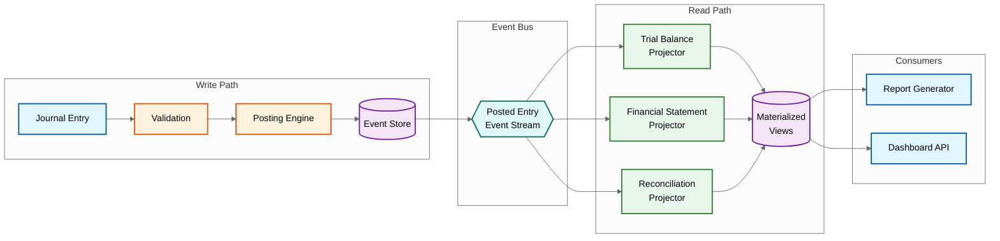
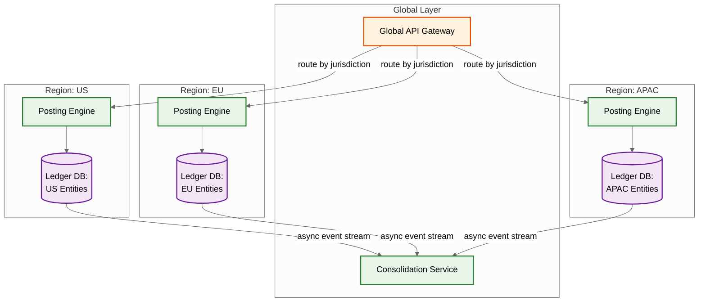

# Accounting / General Ledger System --- Scalability & Reliability

## 1. Scaling Strategies

### Database Scaling

**Partitioning Strategy**: Journal entries are partitioned by composite key `fiscal_period` + `entity_id`. This co-locates all entries for a legal entity within a fiscal period on the same partition, aligning with the two dominant access patterns: period-close operations and entity-level reporting.

```
Shard key = hash(entity_id) % 64       ← distributes entities across 64 shards
  └── Each shard: range-partitioned by fiscal_period
       ├── FY2026-Q1  (current quarter)
       ├── FY2025-Q4  (previous quarter)
       └── ...older periods archived

Benefits: period-close scans one partition per entity, cross-entity consolidation
parallelizes across shards, partition pruning eliminates irrelevant periods.
```

**Hot / Warm / Cold Data Tiering**

| Tier | Data | Storage | Latency | Retention |
|------|------|---------|---------|-----------|
| Hot | Current + previous fiscal period | NVMe SSD, fully indexed | < 5ms | Active |
| Warm | Last 2 fiscal years | SSD-backed, partial indexes | < 50ms | 2 years |
| Cold | Older than 2 years | Compressed columnar in object storage | < 5s | 7--10 years (regulatory) |

Tier migration runs after each period close. Cold-tier data remains queryable through a federated query layer that transparently routes to object storage.

**Read Replicas**: Each shard has one synchronous replica (failover target, RPO=0) and three reporting replicas (trial balance, ad-hoc analytics, month-end close reads). Alert if reporting replica lag > 3 seconds.

**Materialized Views**

| View | Refresh Strategy | Invalidation |
|------|-----------------|--------------|
| Trial balance (per entity, period) | Incremental on each posting batch | Immediate on posting to entity-period |
| Account balance summary | Running totals, delta-updated | Per journal entry |
| Intercompany elimination matrix | Full rebuild nightly | Manual trigger during consolidation |
| Aging schedule (AP/AR) | Incremental bucket recalculation | On invoice/payment status change |

**Index Strategies**

```
Primary:   (account_id, fiscal_period, posting_date)  → account drill-down
           (journal_entry_id)                          → entry lookup
           (posting_date, entity_id)                   → date-range per entity
Secondary: (source_document_id)                        → invoice-to-journal trace
           (reconciliation_id, status)                 → unreconciled items
Partial:   (status='PENDING') ON journal_entries       → unposted entries
           (is_reconciled=FALSE) ON line_items         → open reconciliation
```

### Compute Scaling

**Posting Engine**: Horizontal scaling with partition-aware routing. A consistent-hash ring maps `(entity_id, fiscal_period)` to a specific engine instance, serializing postings per entity-period without distributed locks while parallelizing across entities. On engine failure, the ring rebalances and in-flight postings replay from WAL idempotently.

**Worker Pool Isolation**: OLTP pool (posting, validation, approvals --- 20 baseline), report pool (trial balance, financial statements --- 8 baseline), batch pool (month-end close, consolidation --- 0 baseline, scaled on demand).

**Calendar-Based Pre-Scaling**: Accounting workloads are predictable. Month-end close, quarter-end, and fiscal year-end create 5--20x spikes.

```
FUNCTION pre_scale_for_calendar(date, entity):
    IF is_month_end_close_window(date, entity):
        SET posting_engine.min = baseline * 3, report_pool.min = baseline * 4
    IF is_quarter_end_close_window(date, entity):
        SET posting_engine.min = baseline * 5, batch_pool.min = 10
    IF is_fiscal_year_end_close(date, entity):
        SET posting_engine.min = baseline * 8, batch_pool.min = 20
        PROVISION additional_read_replicas(2)
```

### Caching Strategy

| Cache Target | TTL | Invalidation | Size |
|-------------|-----|--------------|------|
| Chart of Accounts | 30 min | Event-driven on COA change | < 5 MB (< 10K accounts) |
| Exchange Rates | 15 min | Force-refresh on revaluation | < 1 MB |
| Trial Balance Summaries | Until invalidated | On any posting to entity-period | ~50 KB per entity-period |
| Account Balance Snapshots | 1 hour | Replaced on new snapshot | ~100 KB per entity-period |
| GL Account Metadata | 10 min | Event-driven on metadata change | < 2 MB |

Trial balance cache uses version-stamped entries: reads verify the cached version matches the current posting version for that entity-period, falling through to the materialized view on mismatch.

---

## 2. Read/Write Separation (CQRS)

The general ledger is a natural fit for CQRS: the write model enforces double-entry invariants and audit immutability, while the read model serves pre-computed financial projections.



**Write Path**: Journal entry flows through validation (balanced debits/credits, valid accounts, open period) into the posting engine, which atomically writes the entry and emits an event. All invariants are enforced here: double-entry balance, period status, account validity, authorization.

**Read Path**: Projectors consume posted-entry events and maintain denormalized views. Each projector runs independently and can be rebuilt from the event store.

**Projection Rebuilding**: Wipe the projection state for a given scope, replay all `JOURNAL_POSTED` events from the event store for that entity-period, re-apply each event, and update the watermark. This recovers from corruption or deploys schema changes to projections.

**Eventual Consistency Window**: Reporting views lag the write path by at most 5 seconds under normal load (up to 15 seconds during period-close bursts). The dashboard API includes a `data_as_of` timestamp for consumer awareness.

---

## 3. Reliability & Fault Tolerance

### Transaction Integrity

**Two-Phase Commit for Cross-Entity Postings**: Intercompany transactions require atomic postings across entities on different shards. A coordinator runs prepare on all participating shards; if all vote PREPARED, it writes a durable commit record and issues commit to each shard. If any shard votes NO, the coordinator aborts all participants.

**Saga Pattern for Period Close**: Multi-step operations (period close, consolidation) span minutes to hours. Each step is idempotent with a defined compensating action:

```
Period Close Saga:
  Step 1: Freeze period for new postings      → Compensate: unfreeze
  Step 2: Run final validation checks         → Compensate: log skip
  Step 3: Execute automatic adjustments       → Compensate: reverse
  Step 4: Generate closing entries             → Compensate: reverse
  Step 5: Compute and store final balances     → Compensate: delete
  Step 6: Mark period as CLOSED               → Compensate: reopen

Failure at step N triggers compensating actions N-1 → 1 in reverse.
```

**Idempotency Keys**: Every journal posting carries a client-generated idempotency key. Duplicates return the original result without re-posting.

**Write-Ahead Log**: All postings write to WAL before ledger tables. Crash recovery replays WAL to restore consistency.

### Failure Scenarios

| Scenario | Response | Recovery |
|----------|----------|----------|
| Database primary failure | Auto-failover to synchronous replica; connection pool refresh | < 15 seconds |
| Posting engine crash mid-transaction | WAL replay on replacement instance; idempotent retry | < 30 seconds |
| Bank feed ingestion failure | Dead letter queue; manual retry dashboard | Minutes (manual) |
| Report generation timeout | Checkpoint/resume; incremental report building | Retry from checkpoint |
| Event store replication lag | Projectors pause; stale reads flagged with timestamp | Self-healing |
| Corrupt materialized view | Auto-rebuild from event store for affected entity-period | 2--10 minutes |

### Data Protection

- **Point-in-time recovery**: PITR to any second within 7 days via continuous WAL archival
- **Cross-region replication**: Async replication to secondary region for DR
- **Immutable backups**: Object-lock retention prevents deletion by any user (including admins) during retention period (minimum 7 years)
- **Recovery targets**: RPO = 0 (synchronous replication), RTO < 15 minutes

---

## 4. Disaster Recovery

**Active-Passive Setup**: Primary site handles all writes; DR site maintains synchronized replicas.

```
Primary Site                              DR Site
┌───────────────────────────┐            ┌───────────────────────────┐
│  Posting Engine (active)  │            │  Posting Engine (standby) │
│  Event Store (primary)    │──sync───►  │  Event Store (replica)    │
│  Ledger DB (primary)      │──sync───►  │  Ledger DB (replica)      │
│  Read Store (active)      │──async──►  │  Read Store (replica)     │
└───────────────────────────┘            └───────────────────────────┘

Split-brain prevention:
  - Fencing tokens revoke old primary's write capability
  - 3-node quorum lock service across both sites arbitrates promotion
  - If quorum unreachable, both sites refuse writes (safety over availability)
```

**Automated Failover**: Detection (60s health probe failure) then quorum lock acquisition then fencing then DB promotion (< 30s) then DNS update (< 60s) then synthetic validation then ops notification. Elevated alerting for 4 hours post-failover.

**DR Testing**: Monthly automated shard promotion (non-disruptive, 15 min). Quarterly full-region failover drill (production traffic replay, 2 hours). Annual chaos exercise (cascading failures, split-brain simulation, 4 hours).

**Recovery by Scenario**: Data corruption --- PITR to last good timestamp, WAL replay, reconcile with source documents. Accidental deletion --- restore from immutable backups without full DB restore. Ransomware --- object-locked snapshots immune to encryption; restore from clean snapshot, rotate all credentials.

---

## 5. Multi-Region Considerations

Ledger data must reside in the jurisdiction of the legal entity. Entity-level sharding enables this naturally: entities are assigned to shards in their jurisdiction's data center.



**Routing**: The gateway looks up entity jurisdiction from a globally replicated metadata store (< 1ms) and routes to the correct regional posting engine. No ledger data crosses regional boundaries during normal operations.

**Cross-Region Consolidation**: A consolidation service in a designated region consumes posted-entry events asynchronously from each region. It computes elimination entries, currency translation adjustments, and minority interest allocations. Eventually consistent within 30 seconds of the last regional posting.

**Cross-Region Intercompany**: When an intercompany transaction spans regions, the saga coordinator in the initiating region orchestrates sequential postings via authenticated, encrypted API calls. Compensating transactions handle partial failures.

---

## 6. Capacity Planning

### Growth Projections

| Dimension | Small (50 entities) | Medium (500 entities) | Large (5,000 entities) |
|-----------|--------------------|-----------------------|------------------------|
| Journal entries / month | 500K | 5M | 50M |
| Storage growth / month | 5 GB | 50 GB | 500 GB |
| Concurrent users (peak) | 200 | 2,000 | 20,000 |
| Month-end close window | 2 hours | 6 hours | 12 hours |

### Storage Growth Model

```
Per journal entry: ~2.2 KB (hot) | ~1.1 KB (warm) | ~0.6 KB (cold)
  Header: ~500B | Line items: ~200B x 4 = 800B | Audit: ~300B | Index overhead: ~40%

5-year projection (large, 50M entries/month):
  Year 1: Hot=1.3 TB  | Warm=0      | Cold=0       | Total=1.3 TB
  Year 3: Hot=1.3 TB  | Warm=0.7 TB | Cold=0.4 TB  | Total=2.4 TB
  Year 5: Hot=1.3 TB  | Warm=0.7 TB | Cold=1.2 TB  | Total=3.2 TB

Retention: hot=current+1 period → warm=2 years → cold=7+ years → purge with audit
```

### Month-End Close Compute

```
Phase 1 - Final postings (30%):        3x baseline posting engine
Phase 2 - Reconciliation (25%):        2x baseline + reconciliation workers
Phase 3 - Revaluation/translation (15%): 2x baseline, heavy cache usage
Phase 4 - Consolidation (20%):         4x baseline (cross-shard)
Phase 5 - Report generation (10%):     6x baseline report pool

Total peak: ~8x daily baseline for 12-48 hours per month
```

---

## 7. Interview Checklist

| Topic | Key Points |
|-------|-----------|
| Database partitioning | Composite key (fiscal_period + entity_id); 64 shards with range sub-partitions |
| Data tiering | Hot/warm/cold with transparent federated query; regulatory retention 7+ years |
| CQRS | Write path enforces invariants; read path serves materialized projections; < 5s consistency |
| Cross-entity transactions | 2PC for intercompany; saga for period close; idempotency keys throughout |
| Failure handling | WAL replay, dead letter queues, checkpoint/resume, auto-rebuild from event store |
| Data protection | RPO=0 synchronous replication; immutable backups; 7-year PITR |
| Disaster recovery | Active-passive with fencing; automated failover < 15 min; quarterly DR drills |
| Multi-region | Entity-level sharding for data sovereignty; async consolidation; saga-based intercompany |
| Capacity | ~2.2 KB/entry hot; 8x baseline compute at month-end; calendar-based pre-scaling |
