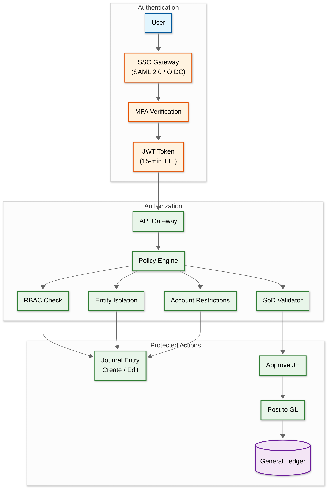
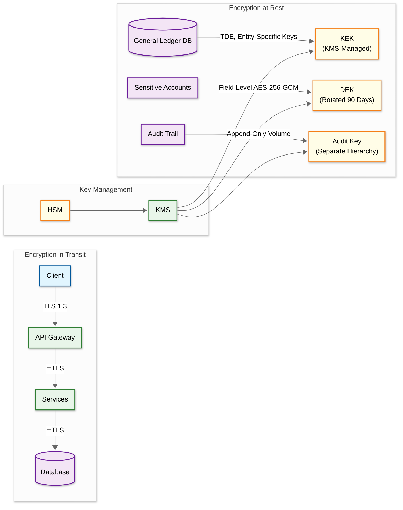

# Accounting / General Ledger System: Security and Compliance

## 1. Threat Model

### STRIDE Analysis

| Threat | Description | Risk |
|--------|------------|------|
| **Spoofing** | Impersonate authorized accountant to create fraudulent journal entries | Critical |
| **Tampering** | Manipulate posted balances or modify audit trail records | Critical |
| **Repudiation** | Deny creating/approving a journal entry with no cryptographic proof | High |
| **Information Disclosure** | Exfiltrate trial balances, income statements, payroll account data | High |
| **Denial of Service** | Flood posting engine during month-end close, block financial reporting | Medium |
| **Elevation of Privilege** | Bypass SoD to self-approve entries; reopen closed period without authorization | Critical |

### Key Threat Scenarios

1. **Unauthorized JE Creation**: Compromised credentials used to post entries inflating revenue or hiding liabilities.
2. **Balance Manipulation**: Direct database modification bypassing the application layer to alter balances without a journal entry.
3. **Audit Trail Tampering**: Deleting or modifying audit records to conceal unauthorized activity before auditor review.
4. **Unauthorized Period Reopening**: Inserting backdated entries after financial statements have been certified.
5. **Financial Data Exfiltration**: Bulk export of chart of accounts, trial balances, or intercompany transactions.
6. **SoD Violations**: Same individual creating and approving a journal entry, controlling the full post-to-report pipeline.

---

## 2. Authentication & Authorization

### RBAC with Fine-Grained Permissions

| Role | Create JE | Approve JE | Post JE | Reverse JE | Close Period | Manage CoA |
|------|-----------|------------|---------|------------|-------------|------------|
| **Staff Accountant** | Yes | -- | -- | -- | -- | -- |
| **Senior Accountant** | Yes | Not own | Yes (approved) | Request | -- | -- |
| **Accounting Manager** | Yes | Not own | Yes | Approve | Initiate | Propose |
| **Controller** | Yes | Not own | Yes | Approve | Approve | Approve |
| **CFO** | -- | Above materiality | -- | Above threshold | Final sign-off | -- |
| **External Auditor** | -- | -- | -- | -- | -- | Read-only |

### Authorization Flow



**Entity-Level Isolation**: Users can only access entities they are assigned to. Intercompany journal entries require authorization from controllers of both entities.

**Account-Level Restrictions**: Sensitive accounts (executive compensation, payroll liability, legal reserves) require MFA step-up, separate approval chains, or dual approval beyond standard RBAC.

**Dual Approval**: Entries above materiality thresholds, manual revenue/equity entries, and top-side consolidation adjustments require two independent approvers or CFO sign-off.

---

## 3. Segregation of Duties Deep Dive

### SoD Matrix

**Core Rule**: No individual may perform more than one of {Create, Approve, Post} on the same journal entry.

| Action | Staff | Senior | Manager | Controller |
|--------|-------|--------|---------|------------|
| **Create JE** | Yes | Yes | Yes | Yes |
| **Approve JE** | -- | Yes (not own) | Yes (not own) | Yes (not own) |
| **Post JE** | -- | Yes (pre-approved) | Yes | Yes |
| **Reverse JE** | -- | Request only | Approve (not own) | Approve |
| **Close Period** | -- | -- | Initiate | Approve (not initiator) |
| **Reopen Period** | -- | -- | -- | Requires CFO co-approval |

### Conflict Detection Algorithm

```
FUNCTION check_sod_conflicts(actor_id, action, journal_entry_id):
    history = GET_ENTRY_ACTION_HISTORY(journal_entry_id)
    creators  = [h.actor_id FOR h IN history WHERE h.action == "CREATE"]
    approvers = [h.actor_id FOR h IN history WHERE h.action == "APPROVE"]
    posters   = [h.actor_id FOR h IN history WHERE h.action == "POST"]

    conflict_rules = {
        "APPROVE": creators,
        "POST":    creators + approvers,
        "REVERSE": creators + approvers + posters
    }
    IF actor_id IN conflict_rules.get(action, []):
        LOG_AUDIT("SOD_VIOLATION_BLOCKED", actor_id, action, journal_entry_id)
        RETURN BLOCKED
    RETURN ALLOWED
```

### Exception Handling for Small Teams

```
FUNCTION apply_small_team_sod_exception(entity_id, journal_entry):
    staff_count = COUNT_ACTIVE_ACCOUNTING_STAFF(entity_id)
    IF staff_count >= 3: RETURN STANDARD_SOD_RULES
    IF staff_count == 2:
        ENFORCE create_actor != approve_actor   // Posting auto-triggers on approval
        LOG_AUDIT("SMALL_TEAM_SOD_EXCEPTION", entity_id, "TWO_PERSON_RULE")
    IF staff_count == 1:
        ROUTE_TO_PARENT_ENTITY_CONTROLLER(journal_entry)
        LOG_AUDIT("SMALL_TEAM_SOD_EXCEPTION", entity_id, "PARENT_ESCALATION")
    // All exceptions logged, reviewed quarterly, reported to external auditors
```

### SoD Override Audit Record

```
SoDOverrideRecord:
    override_id:    UUID
    override_type:  TWO_PERSON_RULE | PARENT_ESCALATION | EMERGENCY_OVERRIDE
    justification:  Free text (required for emergency overrides)
    authorized_by:  Controller or CFO
    expiry:         Emergency overrides expire in 24 hours
    review_status:  PENDING_REVIEW | REVIEWED | ESCALATED
```

---

## 4. Data Protection

### Encryption Architecture



**At Rest**: TDE with entity-specific keys (cross-entity breach isolation). Field-level AES-256-GCM for payroll, executive compensation, and legal reserve amounts. Audit trail on append-only volumes with a separate key hierarchy.

**In Transit**: TLS 1.3 for all client connections. mTLS for service-to-service and database connections with 72-hour certificate rotation.

**Key Hierarchy**: Root key (HSM, rotated annually) > KEKs (per entity, 180 days) > DEKs (per table/field, 90 days). Rotation is zero-downtime via dual-key read paths during re-encryption.

**Data Masking for Non-Production**: Balances scaled +/-30%, entity/counterparty names anonymized, descriptions replaced with synthetic text, audit trail excluded entirely. Production data never replicated without masking pipeline.

---

## 5. Audit Trail Security

### Cryptographic Hash Chaining

```
AuditRecord:
    record_id:        UUID
    prev_record_hash: SHA-256 (chain link)
    timestamp:        ISO8601, microsecond precision
    actor_id / actor_type / action / entity_id
    resource_type:    JOURNAL_ENTRY | ACCOUNT | PERIOD | CHART_OF_ACCOUNTS
    before_state:     JSON snapshot (pre-change)
    after_state:      JSON snapshot (post-change)
    record_hash:      SHA-256(content + prev_record_hash)

Chain property: tampering with any record breaks the chain from that point forward.
Merkle root checkpoints computed hourly, stored in separate write-once storage.
```

**Isolated Storage**: Audit store is physically separated from the operational ledger. No DELETE or UPDATE permissions for any role, including DBAs. Separate credentials, ACLs, and infrastructure. Access limited to: audit write service (append-only), verification service (read-only), external auditors (read-only, time-scoped).

**Digital Signatures**: Entries above materiality threshold signed with HSM-backed private keys. CFO signs period-close certification packages (trial balance + income statement + balance sheet hash).

**Third-Party Verification**: External auditors independently verify hash chain continuity and Merkle root checkpoint consistency without trusting the platform operator.

| Record Type | Retention | Justification |
|-------------|-----------|---------------|
| Journal entry audit trail | 7+ years (hot 1y, warm 3y, cold 3y+) | SOX Section 802 |
| Period close certifications | 10 years | Regulatory requirement |
| Access control change logs | 7 years | ITGC audit evidence |
| Failed authentication attempts | 1 year | Security monitoring |

---

## 6. Compliance Framework

### SOX Compliance (Sarbanes-Oxley)

**Section 302**: System generates certification packages at period close; CFO digitally signs with HSM-backed keys. Post-certification modifications trigger automated audit committee alerts.

**Section 404 -- ITGC Controls**:
- **Access Management**: Role assignment requires manager approval; privileged roles reviewed monthly; terminated accounts disabled within 4 hours via directory sync; no shared accounts.
- **Change Management**: CoA modifications require dual approval; posting rule changes versioned with effective dates; all config changes logged with full audit trail.
- **Operations**: Automated subledger-to-GL reconciliation; daily exception reports; SoD enforced programmatically.
- **Evidence Collection**: Automated SOX evidence packages include access reviews, SoD override records, config change history, reconciliation results, and audit trail integrity verification.

### GAAP/IFRS Compliance

| Standard | System Implementation |
|----------|----------------------|
| **ASC 606** (Revenue) | Revenue sub-ledger enforces five-step model completion; deferred revenue contra accounts |
| **ASC 842** (Leases) | Auto-generated monthly JEs for ROU asset depreciation and lease liability reduction |
| **ASC 830** (FX) | Spot rates for transactions, period-end rates for balance sheet, average rates for P&L; CTA to equity |
| **IFRS 15/16** | Configurable rules per standard; dual-GAAP posting for entities reporting under both |

### Data Privacy

**PII Minimization**: Validation rules reject JE descriptions containing PII patterns. Payroll entries reference batch identifiers, not individual names. Vendor payments use vendor codes only.

**Right to Erasure vs. Retention**: During the retention window, PII is pseudonymized (vendor names become opaque tokens) while financial amounts, dates, and account codes are preserved. Full purge scheduled after retention expires. This aligns with GDPR Article 17(3)(b).

**Cross-Border Transfers**: Jurisdictions with data localization store ledger data in region-local clusters. Consolidation uses aggregated trial balances to minimize cross-border PII transfer; raw data pseudonymized before crossing jurisdictional boundaries.

---

## 7. Security Monitoring

| Alert | Trigger | Severity | Response |
|-------|---------|----------|----------|
| Unusual posting volume | >3x entity daily average | High | Hold entries for manual review |
| After-hours access | Outside entity timezone business hours | Medium | Notify security; enhanced logging |
| Bulk reversals | >5 reversals/hour by same user | Critical | Suspend privileges; alert Controller |
| SoD violation attempt | Blocked SoD action | High | Block; alert compliance officer |
| Period manipulation | Reopen/post to closed period attempt | Critical | Block; alert CFO and audit committee |
| Mass data export | >10K records or full trial balance | High | Require manager approval; watermark |
| Auth spike | >10 failed logins in 5 minutes | High | Lock account; incident response |

### Anomaly Detection

Statistical baselines computed from prior 12 periods detect: volume anomalies (>3 standard deviations), per-account amount anomalies (>5x average), dormant account reactivation (no activity in 180+ days), and elevated manual entry ratios (>2x baseline). Each anomaly generates an alert with entity context and baseline comparison data.

### Incident Response

| Phase | Action | SLA (P1) |
|-------|--------|----------|
| **Detection** | Automated alert or auditor report | Immediate |
| **Triage** | Classify severity; determine blast radius (entities, periods) | 15 min |
| **Containment** | Freeze posting; revoke credentials; snapshot audit trail | 30 min |
| **Investigation** | Reconstruct via audit trail; verify hash chain integrity | 4 hours |
| **Remediation** | Reverse unauthorized entries; re-certify period balances; rotate keys | 24 hours |
| **Reporting** | Notify audit committee, external auditors, regulators if material | 48 hours |

---

## 8. Penetration Testing Considerations

**API Security**: All JE fields parameterized (no dynamic query construction). Amount fields validated as numeric with precision checks. Rate limits: 100 JE creations/min/user, 5 bulk imports/hour, 1 concurrent period close/entity. Token validation covers expiry, entity scope, claim integrity, and network segment restrictions.

**Business Logic Testing**:

```
Critical test cases:
1. Approval Bypass: self-approve via API, approve without workflow, modify after approval
2. Period Violations: backdated posting_date, replay attack on closed period, reopen without CFO auth
3. Balance Integrity: unbalanced entry, negative amount injection, currency field manipulation
4. SoD Circumvention: cross-session self-approve, delegation token forgery, JWT claim escalation
```

**Data Isolation Testing**: Verify entity boundary enforcement even with manipulated resource IDs. Test cross-tenant query filter isolation with modified tenant identifiers. Validate intercompany entries visible only to users authorized on both entities and that elimination workflows cannot expose full counterparty ledger data.

---

## 9. Interview Discussion Points

**Q: How do you handle SoD enforcement when a subsidiary has only two accountants?**

SoD is a control objective, not a rigid rule. The system applies graduated exceptions: two-person teams enforce creator-approver separation with auto-posting; single-person entities escalate all entries to the parent controller. Every exception is logged in a dedicated override register, reviewed quarterly, and disclosed to auditors. Compensating controls (parent oversight, enhanced monitoring, lower materiality thresholds) achieve the same objective.

**Q: Why separate audit trail storage from the operational database?**

If both live in the same database, a compromised DBA can modify data and evidence simultaneously. Separate storage with its own ACLs, write-once semantics, and independent credentials means even a fully compromised operational DBA cannot tamper with audit records. Hash chaining provides mathematical integrity proof, and Merkle checkpoints in a third location give external auditors an independent verification anchor.

**Q: How does the system balance GDPR right-to-erasure with SOX retention?**

Pseudonymization resolves the conflict. During the retention window, PII is replaced with irreversible tokens while financial substance (amounts, dates, account codes) is preserved intact. The record remains audit-complete but no longer personally identifiable. Full purge executes after retention expires. GDPR Article 17(3)(b) explicitly permits this when retention is required for legal compliance.
