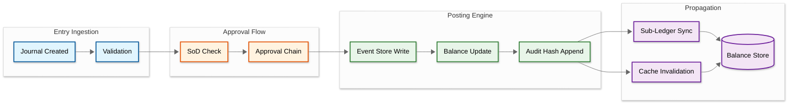
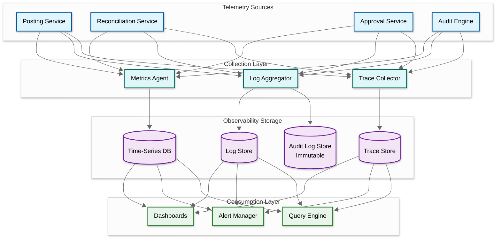

# Observability

## Observability Strategy

An accounting and general ledger system demands observability across three interlocking domains: **financial integrity** (the fundamental accounting equation must hold at every instant -- debits must equal credits, trial balances must net to zero, and intercompany eliminations must leave no residual), **operational throughput** (journal entries must flow from creation through approval, posting, and sub-ledger propagation within strict period-close deadlines), and **audit compliance** (every mutation to any financial record must be cryptographically verifiable, tamper-evident, and retained for 7+ years to satisfy regulatory requirements). Standard infrastructure metrics are necessary but insufficient -- the system must expose first-class business-level indicators that map directly to balance-sheet correctness, close-cycle efficiency, and auditor confidence.

---

## Key Metrics (SLIs)

### Business Metrics

| Metric | Type | Description | Alert Threshold |
|--------|------|-------------|-----------------|
| `journal_entries_posted_total` | Counter | Total entries posted, segmented by type (manual, automated, reversing, recurring) and legal entity | Deviation > 3x standard deviation from same-day-of-week baseline |
| `trial_balance_imbalance` | Gauge | Absolute difference between total debits and total credits across all accounts | Any non-zero value triggers **critical** alert |
| `reconciliation_match_rate` | Gauge | Percentage of bank/sub-ledger transactions auto-matched without human intervention | < 80% sustained for 1 hour |
| `period_close_duration_hours` | Histogram | Wall-clock time from period soft-close initiation to hard-close completion | p50 > 8h, p95 > 24h |
| `unmatched_bank_transactions` | Gauge | Count of unreconciled bank items, segmented by age bucket (0-7d, 7-30d, 30d+) | Any item aged > 30 days |
| `revenue_recognized_total` | Counter | Cumulative revenue recognized per period, segmented by recognition method (point-in-time, over-time) | Variance > 10% from forecast triggers review |
| `intercompany_imbalance` | Gauge | Net position across all intercompany accounts after elimination entries | Any non-zero value post-elimination triggers **critical** alert |
| `approval_queue_depth` | Gauge | Pending journal entries awaiting approval, segmented by approval level and age | Depth > 100 or any item aged > 48h |
| `budget_variance_percentage` | Gauge | Actual vs. budget deviation per cost center per GL account | Absolute variance > 15% triggers finance review |

### System Metrics

| Metric | Type | Description | Alert Threshold |
|--------|------|-------------|-----------------|
| `posting_latency_ms` | Histogram | Journal posting latency (p50, p95, p99) from submission to committed state | p50 > 200ms, p95 > 800ms, p99 > 2000ms |
| `gl_balance_update_latency_ms` | Histogram | Time to propagate a posted entry to materialized GL balances | p95 > 500ms |
| `report_generation_duration_s` | Histogram | Time to generate financial statements (income statement, balance sheet, cash flow) | Trial balance > 10s, full statements > 60s |
| `reconciliation_batch_duration_s` | Histogram | Time to complete a reconciliation batch (bank statement import through matching) | > 300s for standard batch |
| `database_connection_pool_usage` | Gauge | Active connections / pool size per service | > 85% utilization |
| `event_store_lag_ms` | Gauge | Lag between event write and projection update in event-sourced components | > 5000ms |
| `cache_hit_rate` | Gauge | Hit rate for chart-of-accounts cache and balance snapshot cache | COA cache < 95%, balance cache < 80% |
| `audit_chain_verification_duration_s` | Histogram | Time to verify the hash chain integrity for a given entity and period | > 30s per period |

---

## Dashboard Design

### Dashboard 1: Operations Health

| Panel | Visualization | Data Source |
|-------|---------------|-------------|
| Posting Throughput | Line chart (current vs 7-day avg, entries/min) | Posting service counters |
| Posting Latency Distribution | Heatmap (p50/p75/p90/p95/p99 over time) | Posting service histograms |
| Error Rate by Service | Stacked area chart (posting, reconciliation, reporting, approval) | Service error counters |
| Queue Depths | Multi-line chart (approval queue, posting queue, reconciliation queue) | Queue metrics |
| DB Connection Pool | Gauge per database (utilization %) | Connection pool metrics |
| Event Store Projection Lag | Single stat + sparkline | Event store metrics |

### Dashboard 2: Financial Health

| Panel | Visualization | Data Source |
|-------|---------------|-------------|
| Trial Balance Summary | Single stat (imbalance = 0 green, non-zero red) + trend line | GL balance aggregation |
| Reconciliation Match Rates | Line chart (daily, by bank account, last 30 days) | Reconciliation service |
| Intercompany Balance Positions | Table (entity pairs, net position, elimination status) | Intercompany service |
| Budget vs Actual Variance | Bar chart (by cost center, top 10 variances) | Budget service |
| Revenue Recognition Progress | Stacked bar (recognized vs deferred, by period) | Revenue engine |
| Unmatched Transaction Aging | Horizontal bar (age buckets: 0-7d, 7-30d, 30d+) | Reconciliation service |

### Dashboard 3: Audit & Compliance

| Panel | Visualization | Data Source |
|-------|---------------|-------------|
| Hash Chain Integrity Status | Traffic light per entity (green = verified, red = broken) | Audit verification service |
| Segregation of Duties Compliance | Gauge (% of postings with proper SoD) + violation table | Access control logs |
| Access Pattern Anomalies | Scatter plot (user x time x action, anomalies highlighted) | Security analytics |
| Journal Entry Volume by Source | Stacked area chart (manual, automated, sub-ledger, reversing) | Posting service |
| Period Access Control Status | Table (period, status, lock holder, last modification) | Period management service |
| Audit Log Volume | Line chart (events/hour, segmented by event type) | Audit log store |

### Dashboard 4: Period Close Tracker

| Panel | Visualization | Data Source |
|-------|---------------|-------------|
| Close Progress | Gantt chart (close tasks, completion %, ETA) | Period close orchestrator |
| Blocking Items | Table (blocker type, owner, age, estimated resolution) | Close task manager |
| Sub-Ledger Reconciliation Status | Checklist (AP, AR, FA, inventory -- reconciled vs pending) | Sub-ledger services |
| Close Duration Trend | Line chart (last 12 periods, actual vs SLA) | Period close metrics |
| Post-Close Adjustments | Counter (adjustments made after soft-close, by type) | Posting service |

---

## Logging Strategy

### Structured Log Schema

```
{
    "timestamp": "2026-03-09T14:22:08.341Z",
    "level": "INFO|WARN|ERROR",
    "service": "gl-posting-service",
    "trace_id": "tr_gl_8a4f2c1e9b37",
    "span_id": "sp_posting_2c4a",
    "correlation_id": "je_20260309_00847",
    "entity_id": "entity_us_holding",
    "user_id": "usr_hashed_a9f3b2",
    "period_id": "FY2026-Q1-M03",
    "event": "JOURNAL_POSTED",
    "journal_id": "je_20260309_00847",
    "debit_total": { "amount": 125000.00, "currency": "USD" },
    "credit_total": { "amount": 125000.00, "currency": "USD" },
    "account_count": 4,
    "latency_ms": 142,
    "metadata": { "source": "accounts_payable", "reversal": false }
}
```

### Structured Log Events

| Category | Events | Severity |
|----------|--------|----------|
| **Journal Lifecycle** | `JOURNAL_CREATED`, `JOURNAL_APPROVED`, `JOURNAL_POSTED`, `JOURNAL_REVERSED` | INFO |
| **Period Management** | `PERIOD_OPENED`, `PERIOD_SOFT_CLOSED`, `PERIOD_HARD_CLOSED` | INFO |
| **Reconciliation** | `RECONCILIATION_STARTED`, `MATCH_FOUND`, `MATCH_EXCEPTION`, `RECONCILIATION_COMPLETED` | INFO (exception: WARN) |
| **FX & Elimination** | `REVALUATION_RUN`, `ELIMINATION_GENERATED` | INFO |
| **Security Violations** | `SOD_VIOLATION_ATTEMPTED`, `ACCESS_DENIED`, `UNAUTHORIZED_PERIOD_ACCESS` | ERROR |

### Log Enrichment Rules

Every log entry is enriched with contextual fields at the middleware layer:

- **Mandatory fields**: `entity_id`, `user_id`, `period_id`, `correlation_id`, `trace_id`
- **Financial amounts**: always logged with `{ amount, currency }` structure for unambiguous interpretation
- **Sensitive data masking**: account numbers are truncated to last 4 digits in operational log tiers; amounts above a configurable threshold are replaced with `ABOVE_THRESHOLD` in non-secure tiers
- **Cross-reference fields**: `journal_id`, `reconciliation_id`, `batch_id` link logs to domain entities

### Log Retention Policy

| Log Category | Hot Storage | Warm Storage | Cold / Archive | Rationale |
|-------------|-------------|--------------|----------------|-----------|
| Operational logs | 90 days | 1 year | 3 years | Debugging and trend analysis |
| Audit logs | 1 year | 7 years | 10+ years | SOX Section 802 requires 7-year retention; immutable storage mandatory |
| Security logs | 6 months | 3 years | 7 years | Regulatory and forensic requirements |
| Performance metrics | 30 days (full resolution) | 1 year (downsampled) | 3 years (aggregated) | Capacity planning |

---

## Distributed Tracing

### Journal Posting Pipeline Trace

```
Trace: journal_posting (je_20260309_00847)
  +-- [gateway] POST /v1/journals                            total: 1,850ms
  |   +-- [auth] validate_token + check_permissions                   12ms
  |   +-- [validation] validate_journal_structure                     35ms
  |   |   +-- [coa-service] verify_account_codes                      18ms
  |   |   +-- [validator] check_debit_credit_balance                   4ms
  |   |   +-- [validator] check_period_open_status                     8ms
  |   +-- [approval-engine] route_for_approval (async)                45ms
  |   |   +-- [sod-checker] verify_segregation_of_duties              22ms
  |   |   +-- [routing] determine_approval_chain                      15ms
  |   +-- [await] approval_complete                          ... hours/days
  |   +-- [posting-engine] post_journal                              380ms
  |   |   +-- [lock-manager] acquire_period_lock                      12ms
  |   |   +-- [event-store] append_journal_event                      45ms
  |   |   +-- [gl-updater] update_account_balances                   180ms
  |   |   |   +-- [balance-store] debit_accounts (2)                  85ms
  |   |   |   +-- [balance-store] credit_accounts (2)                 90ms
  |   |   +-- [audit-chain] append_hash_link                          35ms
  |   |   +-- [sub-ledger] propagate_to_source_ledger                 95ms
  |   |   +-- [lock-manager] release_period_lock                       8ms
  |   +-- [notification] notify_stakeholders                          28ms
```

### Reconciliation Trace

```
Trace: bank_reconciliation (recon_20260309_acct4521)
  +-- [feed-service] import_bank_statement                   total: 12,400ms
  |   +-- [parser] parse_statement_format                            120ms
  |   +-- [normalizer] standardize_transactions (847 items)          450ms
  |   +-- [matcher] auto_match_pass_1 (exact amount+date+ref)     2,800ms
  |   +-- [matcher] auto_match_pass_2 (fuzzy description)         4,200ms
  |   +-- [exception-handler] flag_unmatched (23 items)              180ms
  |   +-- [reporter] generate_reconciliation_summary                 320ms
  |   +-- [audit-chain] record_reconciliation_event                   85ms
```

### Trace Sampling Strategy

| Flow | Sampling Rate | Rationale |
|------|---------------|-----------|
| Journal posting (success) | 10% | High volume, routine path |
| Journal posting (failure/rejection) | 100% | Every failure must be diagnosable |
| Journal approval action | 100% | Audit trail requirement |
| Period close operations | 100% | Critical path, always traced |
| Reconciliation batch | 100% | Financial accuracy, audit requirement |
| Report generation | 50% | Medium volume, performance tracking |
| Balance query (read) | 1% | Very high volume, routine |
| SoD violation attempt | 100% | Security event, always traced |

### Posting Pipeline Trace Diagram



---

## Alerting Strategy

### Critical Alerts (Page Immediately)

| Alert | Condition | Action |
|-------|-----------|--------|
| `TrialBalanceImbalance` | `trial_balance_imbalance` gauge reports any non-zero value | Page finance-on-call and platform-on-call; halt all postings; initiate forensic trace to identify divergent entry |
| `AuditHashChainBroken` | Hash chain verification fails for any entity/period | Page security-on-call; isolate affected period; trigger full chain rebuild from event store; file incident report |
| `PostingEngineDown` | Posting service error rate > 50% for 2 min OR p99 latency > 5s sustained 3 min | Page platform-on-call; check database health; verify event store availability |
| `SODViolationInProduction` | Any `SOD_VIOLATION_ATTEMPTED` event where the violating action was not blocked | Page security-on-call and compliance-on-call; review access control enforcement; audit recent postings by affected user |
| `UnauthorizedPeriodModification` | Any write to a hard-closed period | Page finance-on-call; revert modification; audit access logs for the period |

### Warning Alerts (Notify Within 1 Hour)

| Alert | Condition | Action |
|-------|-----------|--------|
| `ReconciliationMatchRateDrop` | `reconciliation_match_rate` drops below 80% for 1 hour | Investigate bank feed format changes; check for new transaction types; review matching rules |
| `PeriodCloseSLABreach` | `period_close_duration_hours` exceeds SLA target (e.g., 24h for monthly close) | Identify blocking tasks; escalate to close coordinator; check sub-ledger reconciliation status |
| `EventStoreProjectionLag` | `event_store_lag_ms` > 30,000ms sustained for 5 min | Check projection consumer health; verify event store throughput; scale consumers if needed |
| `UnusualPostingVolume` | Posting rate exceeds 3x standard deviation from trailing 4-week baseline | Investigate source; may indicate bulk import, automation error, or unauthorized batch |
| `ApprovalQueueBacklog` | `approval_queue_depth` > 200 or any item aged > 72h | Notify approvers; check for OOO without delegates; escalate to finance management |

### Informational Alerts (Review Daily)

| Alert | Condition | Action |
|-------|-----------|--------|
| `PeriodCloseCompleted` | Period transitions to hard-closed state | Log summary; distribute close report to stakeholders |
| `RevaluationRunCompleted` | FX revaluation batch completes with summary of P&L impact | Review unrealized gain/loss amounts; verify rates used |
| `MonthlyReconciliationSummary` | End-of-period reconciliation summary generated | Review match rates, exception counts, aging trends |
| `BudgetVarianceReport` | Weekly budget vs actual variance exceeds 10% in any cost center | Route to cost center owner for review |

---

## Runbooks

| Alert | Runbook | First Responder |
|-------|---------|-----------------|
| `TrialBalanceImbalance` | 1. Immediately halt all posting activity. 2. Query GL balance store for total debits and credits by entity. 3. Identify the last balanced state via audit log timestamps. 4. Replay events from event store between last-known-good and current state. 5. Isolate the divergent entry. 6. Correct via reversing journal entry (never direct DB mutation). 7. Verify trial balance returns to zero. 8. Resume posting. | Finance On-Call + Platform On-Call |
| `AuditHashChainBroken` | 1. Identify the broken link (entity, period, sequence number). 2. Compare stored hash with recomputed hash from event store. 3. Check for direct database writes bypassing the application layer. 4. If storage corruption, restore from verified backup. 5. Rebuild chain from event store (source of truth). 6. File security incident if tampering suspected. | Security On-Call |
| `PostingEngineDown` | 1. Check posting service pod/instance health. 2. Verify database connectivity and lock contention. 3. Check event store write availability. 4. Review recent deployments for regression. 5. If DB deadlock, identify and resolve contending transactions. 6. Drain and reprocess posting queue after recovery. | Platform On-Call |
| `PeriodCloseSLABreach` | 1. Open close tracker dashboard; identify incomplete tasks. 2. Check sub-ledger reconciliation status (AP, AR, FA, inventory). 3. Identify blocking dependencies and assign owners. 4. Escalate unresolved items to CFO office. 5. Document delays for audit trail. | Finance On-Call |
| `ReconciliationMatchRateDrop` | 1. Compare current bank feed schema with expected format. 2. Check for new merchant names or transaction codes. 3. Review matching rule configuration for recent changes. 4. Sample unmatched items to identify pattern. 5. Update matching rules or retrain fuzzy matcher. | Integrations On-Call |

---

## SLI/SLO Summary

| SLI | SLO Target | Measurement Method | Error Budget (Monthly) |
|-----|------------|-------------------|----------------------|
| Trial balance accuracy | 100% (zero tolerance) | Continuous gauge check: `trial_balance_imbalance == 0` | 0 minutes of imbalance permitted |
| Journal posting availability | 99.95% | Success rate of posting requests over 5-min windows | 21.6 minutes downtime |
| Journal posting latency | p99 < 2s | Histogram percentile from posting service | 5% of requests may exceed p95 target |
| Reconciliation match rate | > 85% auto-match | Daily gauge from reconciliation service | Below 80% triggers investigation |
| Period close duration | < 3 business days (monthly) | Timer from soft-close to hard-close per period | 1 close per year may exceed target |
| Report generation latency | p95 < 30s for trial balance | Histogram from reporting service | 5% of reports may exceed target |
| Audit chain integrity | 100% (zero tolerance) | Periodic verification job (every 6 hours) | 0 broken links permitted |
| Event store projection freshness | Lag < 5s at p95 | Continuous gauge from event store consumer | 5% of windows may exceed 5s |
| Intercompany elimination accuracy | 100% post-elimination balance = 0 | Post-elimination check after every consolidation run | 0 tolerance for residual imbalance |

### SLO Burn Rate Monitoring

| SLO | Monthly Error Budget | Fast Burn (page) | Slow Burn (warn) |
|-----|---------------------|-------------------|-------------------|
| Trial balance accuracy (100%) | Zero tolerance -- any imbalance is instant critical | N/A | N/A |
| Posting availability (99.95%) | 21.6 min downtime | > 14.4x in 1h | > 3x in 6h |
| Period close (< 3 biz days) | 1 breach/year across entities | 75% SLA elapsed + blockers remain | 50% SLA elapsed + < 60% tasks done |
| Audit chain integrity (100%) | Zero tolerance -- regulatory requirement | Any verification failure | N/A |

---

## Observability Architecture


