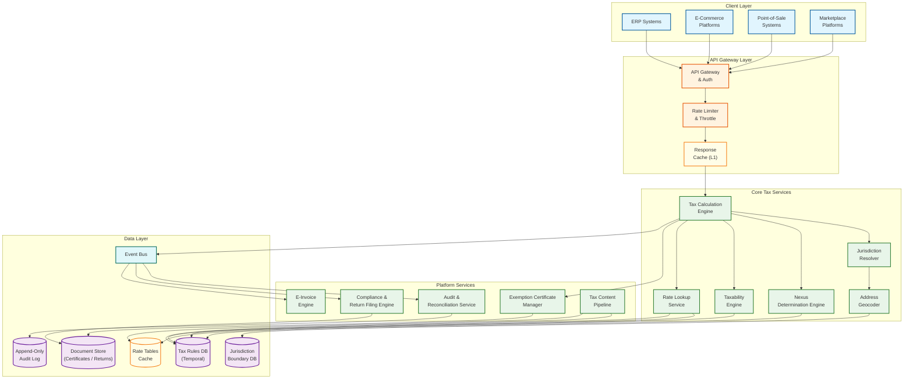
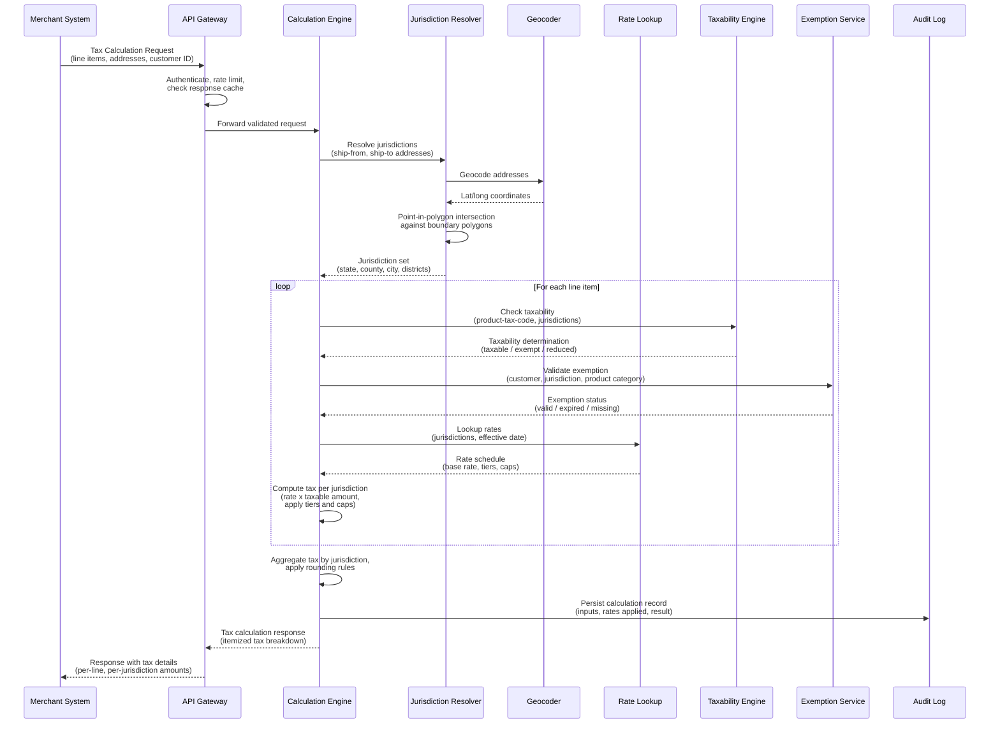

# Tax Calculation Engine System Design

## System Overview

A tax calculation engine---exemplified by enterprise-grade tax determination platforms that serve as the computational backbone for global commerce---is a real-time rules engine that resolves the correct tax obligation for every transaction across 19,000+ tax jurisdictions worldwide. Unlike simplistic tax lookup tables embedded in ERP modules or point-of-sale systems, a purpose-built tax calculation platform maintains a continuously updated repository of 800M+ tax rules spanning sales tax, value-added tax (VAT), goods and services tax (GST), excise duty, customs duty, withholding tax, and dozens of jurisdiction-specific levies. It computes the precise tax amount for any combination of product, seller, buyer, and jurisdiction---accounting for multi-level jurisdiction hierarchies (country, state/province, county, city, special taxing district), product taxability classifications, exemption certificates, tax holidays, and retroactive rate changes---all within a sub-50ms latency envelope at transaction time. The core engineering challenges span multiple domains:

1. **Tax Jurisdiction Hierarchy Resolution** --- Every physical address in the United States alone maps to an average of 5 overlapping taxing jurisdictions (state, county, city, transit district, special purpose district), and a single street can straddle two jurisdictions. The engine must resolve a shipping address or point-of-sale location to the exact set of applicable jurisdictions using rooftop-level geocoding, boundary polygon intersection, and jurisdiction precedence rules. Globally, this extends to VAT zones in the EU (with place-of-supply rules that differ for goods vs. services vs. digital products), GST registration states in India, ICMS/ISS municipality-level taxes in Brazil, and GCC VAT jurisdictions.

2. **Real-Time Tax Calculation Pipeline with Sub-50ms Latency** --- The calculation pipeline must evaluate product taxability, apply jurisdiction-specific rates, check exemption certificates, compute tiered/threshold-based rates, and return a fully itemized tax breakdown---all within 50ms at the p99 level. This is a combinatorial problem: a single multi-line invoice with 100 line items, each potentially taxable in different jurisdictions with different product-tax-code classifications, generates thousands of individual rate lookups that must be resolved and aggregated in a single request.

3. **Tax Nexus Determination Engine** --- Before computing tax, the system must determine whether the seller has a tax collection obligation in the buyer's jurisdiction. Nexus rules vary by jurisdiction and include physical nexus (office, warehouse, employee presence), economic nexus (revenue or transaction count thresholds---e.g., $100K revenue or 200 transactions in a state), marketplace facilitator obligations (where the marketplace collects on behalf of third-party sellers), and click-through nexus. The nexus engine continuously evaluates a seller's evolving footprint against 50+ state-level and hundreds of local threshold rules, triggering registration obligations proactively.

4. **Product-Tax-Code Classification and Taxability Determination** --- Not all products are taxed equally. Grocery food is exempt in most US states but taxable in some; software-as-a-service is taxable in about half of US states; clothing is exempt below $175 in one state but fully taxable in another. The engine maintains a hierarchical product-tax-code (PTC) taxonomy with 10,000+ codes, and each code maps to jurisdiction-specific taxability rules (taxable, exempt, reduced rate, zero-rated, reverse-charged). Sellers assign PTCs to their product catalog, and the engine resolves the applicable treatment at transaction time.

5. **Multi-Regime Support** --- The engine must simultaneously support fundamentally different tax regimes: US sales tax (origin-based vs. destination-based, tax-on-tax in some jurisdictions), EU VAT (reverse charge mechanism, place-of-supply rules, One Stop Shop for cross-border digital services), India GST (CGST/SGST/IGST with input tax credit chains), Brazil ICMS/ISS/IPI (state-level ICMS with interstate rate differentials, municipality-level ISS for services), and Saudi Arabia/GCC VAT. Each regime has its own calculation logic, reporting requirements, and return filing formats.

6. **Tax Rate Versioning and Point-in-Time Accuracy** --- Tax rates change constantly---approximately 600 rate changes per month across US jurisdictions alone. The engine must apply the rate that was effective at the transaction date, not the current rate. This requires temporal versioning of all rate tables and taxability rules with effective-date and end-date ranges, supporting point-in-time queries for historical transactions, amended returns, and audit scenarios. Rate changes are published by jurisdictions with varying lead times (sometimes days, sometimes retroactively), demanding a content research pipeline that ingests legislative updates and publishes verified rate changes to production.

7. **E-Invoicing Compliance** --- An increasing number of jurisdictions mandate real-time or near-real-time electronic invoice reporting: India's Invoice Registration Portal (IRP) for GST e-invoicing with QR code generation, the EU's VAT in the Digital Age (ViDA) initiative, Brazil's Nota Fiscal Eletronica (NF-e) with SEFAZ authorization, and Saudi Arabia's ZATCA Fatoorah e-invoicing system. The engine must generate compliant electronic invoices in jurisdiction-specific XML/JSON schemas, submit them to government portals for validation, and embed authorization codes/QR codes back into the invoice---all as part of the transaction flow.

8. **Exemption Certificate Lifecycle Management** --- Businesses purchasing for resale, government entities, non-profit organizations, and specific industries can claim tax exemptions by presenting valid exemption certificates. The engine must store, validate, and match certificates to transactions---checking certificate type against the product category, verifying the certificate covers the buyer's jurisdiction, confirming the certificate has not expired, and flagging missing certificates for audit risk. At enterprise scale, this involves managing millions of certificates with complex multi-state, multi-product coverage matrices.

9. **Tax Return Filing Automation and Compliance Reporting** --- Beyond calculation, the platform aggregates transactional tax data into jurisdiction-specific return formats, supports filing schedules (monthly, quarterly, annually) across hundreds of jurisdictions, generates remittance amounts accounting for vendor discounts and prepayments, and produces audit-ready reports. This is a batch pipeline that reconciles millions of transactions into a few hundred filing obligations, with penny-level accuracy requirements and penalties for late or incorrect filings.

---

## Key Characteristics

| Characteristic | Description |
|---------------|-------------|
| **Read/Write Pattern** | Read-heavy at transaction time (rate lookups, taxability checks, exemption validation); write-heavy for rate table updates, certificate management, and compliance reporting |
| **Latency Sensitivity** | Very High---p99 tax calculation must complete in < 50ms to avoid blocking checkout flows; batch compliance reporting is latency-tolerant (hours) |
| **Consistency Model** | Strong consistency for tax rate tables and exemption certificates (a stale rate produces an incorrect tax amount); eventual consistency for analytics, dashboards, and aggregate reporting |
| **Data Volume** | Very High---50B+ transactions/year across all customers; 800M+ tax rules; 19,000+ jurisdiction boundary polygons; millions of exemption certificates |
| **Architecture Model** | Multi-tier caching with pre-computed rate matrices; rules engine with jurisdiction-aware evaluation; event-driven pipeline for rate content updates; CQRS for compliance reporting |
| **Regulatory Burden** | Extreme---direct financial liability for incorrect tax calculation; SOC 2 Type II for data handling; jurisdiction-specific filing deadlines with penalty exposure; e-invoicing mandate compliance |
| **Complexity Rating** | **Very High** |

---

## Quick Navigation

| Document | Description |
|----------|-------------|
| [01 - Requirements & Estimations](./01-requirements-and-estimations.md) | Functional/non-functional requirements, capacity planning, SLOs |
| [02 - High-Level Design](./02-high-level-design.md) | Architecture diagrams, data flow, key decisions |
| [03 - Low-Level Design](./03-low-level-design.md) | Data models, API design, algorithms (pseudocode) |
| [04 - Deep Dive & Bottlenecks](./04-deep-dive-and-bottlenecks.md) | Jurisdiction resolution deep dive, rate caching strategies, nexus threshold computation |
| [05 - Scalability & Reliability](./05-scalability-and-reliability.md) | Scaling strategies, fault tolerance, disaster recovery |
| [06 - Security & Compliance](./06-security-and-compliance.md) | Threat model, SOC 2 compliance, data privacy, rate integrity verification |
| [07 - Observability](./07-observability.md) | Metrics, logging, tracing, alerting, SLI/SLO dashboards |
| [08 - Interview Guide](./08-interview-guide.md) | 45-min pacing, trade-offs, trap questions, scoring rubric |
| [09 - Insights](./09-insights.md) | Key architectural insights, patterns, lessons |

---

## What Differentiates This from Related Systems

| Aspect | Tax Calculation Engine (This) | ERP Tax Module | Accounting Software Tax | Manual Tax Compliance | Point-of-Sale Tax | Payment Gateway Tax |
|--------|------------------------------|----------------|------------------------|----------------------|-------------------|-------------------|
| **Primary Goal** | Real-time, jurisdiction-precise tax determination for any transaction globally with sub-50ms latency | Calculate tax as part of broader order processing within a single ERP instance | Apply flat tax rates or simple lookup tables during invoice entry | Spreadsheet-based tax computation and manual return filing | Apply a single tax rate at the register based on store location | Append a tax estimate to payment metadata for reporting |
| **Jurisdiction Coverage** | 19,000+ jurisdictions with rooftop-level address resolution; multi-regime (sales tax, VAT, GST, excise) | Typically limited to jurisdictions where the company operates; manual rate table maintenance | Single-country support with basic state/province rates; no sub-state granularity | Coverage depends on analyst knowledge; error-prone for multi-state sellers | Single store location; pre-configured rates for that jurisdiction | No jurisdiction resolution; relies on merchant-provided tax amounts |
| **Rate Update Cadence** | Continuous---600+ US rate changes/month ingested via automated content research pipeline | Quarterly or manual updates; rate changes often lag behind effective dates by weeks | Annual updates bundled with software releases | Ad-hoc, reactive to audit findings or filing deadlines | Vendor-pushed updates; frequency varies; no temporal versioning | Not applicable; no rate management |
| **Product Taxability** | 10,000+ product-tax-code taxonomy with jurisdiction-specific taxability rules per code | Basic category-level tax groups (e.g., "taxable goods" vs. "services") | Minimal; typically taxable/non-taxable binary classification | Manual determination per product per jurisdiction | Category-level taxation configured per store | Not applicable; no product classification |
| **Exemption Handling** | Full certificate lifecycle---capture, validation, jurisdiction-product matching, expiration tracking, audit exposure scoring | Basic exemption flag on customer record; no certificate management | Manual exemption override per invoice | Paper-based certificate filing; manual matching during audits | Limited; cashier applies exemption code at register | Not applicable |
| **Compliance Reporting** | Automated return preparation across hundreds of jurisdictions; filing-ready output with remittance calculation | Basic tax reports within ERP; manual formatting required for filing | Simple tax summary reports; no filing automation | Entirely manual; high risk of calculation and filing errors | Sales tax report for store location; no multi-jurisdiction aggregation | Transaction-level tax data only; no reporting |
| **Scalability** | 50B+ transactions/year; horizontally scaled calculation nodes; multi-region deployment | Limited by ERP instance capacity; vertical scaling | Desktop or single-server scale; thousands of transactions | Does not scale; analyst bottleneck | Single-store throughput; POS hardware constraints | Scales with payment volume; no computation overhead |

---

## What Makes This System Unique

1. **Jurisdiction Resolution Is a Geospatial Problem, Not a Lookup**: Unlike most systems where "location" is a country or state code, tax jurisdiction resolution requires intersecting a precise geographic coordinate (derived from a rooftop-level geocoded address) against overlapping jurisdiction boundary polygons. A single address can fall within 5--8 taxing jurisdictions simultaneously (state, county, city, school district, transit authority, special improvement district), and moving 50 feet across a street can change the applicable jurisdictions entirely. The system must maintain millions of boundary polygons, update them as jurisdictions annex or redistrict, and perform point-in-polygon intersection at sub-millisecond latency. This geospatial engine is the foundation upon which all rate lookups depend---an incorrect jurisdiction assignment propagates errors through every downstream calculation.

2. **The Rate Table Is a Temporal, Hierarchical, Conditional Knowledge Graph**: A "tax rate" is not a single number. It is a conditional expression: "For product-tax-code X, in jurisdiction Y, sold by a seller with nexus type Z, to a buyer of entity type W, on date D, the rate is R%, with a cap of $C, and the first $T is exempt." These conditions create a combinatorial space of 800M+ effective rules. The rate table must support temporal queries (what was the rate on March 15, 2024?), hierarchical fallback (if no city-level rule exists, fall back to county, then state), conditional overrides (reduced rate for food items below $500, full rate above), and threshold-based tiers (0% on first $1,000, 5% on next $4,000, 7% above $5,000). This is a specialized knowledge graph with temporal semantics, not a relational database table.

3. **Tax Content Research Is the Moat, Not the Code**: The most defensible asset of a tax calculation platform is not its calculation engine but its tax content---the continuously researched, validated, and published corpus of jurisdiction-specific rates, rules, taxability determinations, and boundary maps. This content is produced by a combination of legislative monitoring (tracking thousands of taxing authorities for rate change announcements), human tax researchers who interpret ambiguous legislation, and automated ingestion pipelines that parse government publications. A new rate change flows through a multi-stage pipeline: discovery, research, validation, QA, staging deployment, and production rollout---with SLAs to publish changes before their effective dates. The content pipeline is a parallel system of equal complexity to the calculation engine itself.

4. **Nexus Is a Continuously Evolving Boolean Function Per Jurisdiction**: After the South Dakota v. Wayfair decision (2018), economic nexus thresholds created a dynamic obligation landscape where a seller's tax collection obligations change as their sales volume grows. The nexus engine must continuously aggregate a seller's transaction history by jurisdiction, compare running totals against jurisdiction-specific thresholds (which differ: $100K in one state, $500K in another; some count only taxable sales, others count all sales), detect threshold crossings, and trigger registration workflows. This is a real-time aggregation problem with 50+ state-level thresholds and hundreds of local thresholds, evaluated against every seller's rolling 12-month or calendar-year sales data.

5. **E-Invoicing Transforms Tax Calculation into a Synchronous Government API Integration**: In jurisdictions with mandatory e-invoicing (India, Brazil, Saudi Arabia, and increasingly the EU), the tax calculation is no longer a standalone computation. The platform must format the invoice in a government-mandated schema, submit it to a government portal (India's IRP, Brazil's SEFAZ, Saudi ZATCA), receive a validation response and authorization code, embed the code into the invoice, and return the complete result---all within the transaction flow. Each government portal has different uptime characteristics, retry semantics, timeout behaviors, and failure modes, turning the tax engine into an orchestrator of unreliable external government APIs with strict compliance consequences for failure.

6. **Penny-Level Accuracy Across Billions of Transactions with Legal Liability**: Unlike recommendation engines or analytics systems where approximate results are acceptable, tax calculation has zero tolerance for systematic errors. An incorrect rate applied to millions of transactions creates audit exposure measured in millions of dollars plus penalties and interest. The system must guarantee decimal precision (often to 5+ decimal places for rates, rounded per jurisdiction-specific rules---some round to the nearest cent, others round down, others round half-up), handle tax-on-tax scenarios (where one jurisdiction's tax base includes another jurisdiction's tax), and produce results that are legally defensible in audit proceedings. Every calculation must be reproducible: given the same inputs and the same point-in-time rate table, the engine must produce the identical result years later during an audit.

---

## Quick Reference: Scale Numbers

| Metric | Value | Notes |
|--------|-------|-------|
| Annual tax calculations | ~50B+ | Across all platform customers; includes quotes, commits, and voids |
| Peak calculations per second | ~200K | Black Friday / Cyber Monday peak; sustained bursts during flash sales |
| Steady-state calculations per second | ~50K | Normal business hours across time zones |
| Taxing jurisdictions maintained | ~19,000+ | US alone has ~13,000; remainder across EU, India, Brazil, GCC, APAC |
| Tax rules in production | ~800M+ | Combinatorial product of jurisdictions, product codes, entity types, date ranges |
| Rate changes per month (US only) | ~600+ | State, county, city, and special district rate changes |
| Product-tax-code taxonomy | ~10,000+ codes | Hierarchical taxonomy; each code maps to jurisdiction-specific taxability |
| Exemption certificates managed | ~50M+ | Across all customers; average enterprise customer: 100K--500K certificates |
| Address geocoding lookups per second | ~100K | Rooftop-level precision; cached aggressively by normalized address |
| Boundary polygons maintained | ~300K+ | Multi-resolution: state, county, city, ZIP, special district |
| Tax returns filed per month | ~500K+ | Across all jurisdictions and all customers |
| Calculation latency (p50) | < 15ms | Single-line item, cached jurisdiction and rate |
| Calculation latency (p99) | < 50ms | Multi-line item with exemption certificate validation |
| Rate table cache hit ratio | > 99.5% | Pre-warmed caches with jurisdiction-rate-date composite keys |
| Content pipeline SLA | < 24 hours | From rate change discovery to production deployment |
| E-invoice submissions per day | ~10M+ | India IRP, Brazil NF-e, Saudi ZATCA combined |
| Historical transaction retention | 10+ years | Required for amended return support and audit defense |
| API availability SLA | 99.999% | Tax calculation failure blocks commerce; five-nines is table stakes |

---

## Architecture Overview (Conceptual)

---

## Key Trade-Offs in Tax Engine Design

| Trade-Off | Option A | Option B | This System's Choice |
|-----------|----------|----------|---------------------|
| **Calculation Model: Pre-Computed vs. On-Demand** | Pre-compute rate matrices for all jurisdiction-product combinations (fast lookup, massive storage, stale risk) | Compute tax at request time by evaluating rules dynamically (always current, higher latency) | Hybrid: pre-computed rate matrices for the top 95% of jurisdiction-product pairs (cache-warmed); dynamic rule evaluation for edge cases, new products, and complex conditional rules |
| **Jurisdiction Resolution: ZIP Code vs. Rooftop Geocoding** | ZIP code lookup (fast, simple, but ZIP codes cross jurisdiction boundaries---up to 15% error rate) | Rooftop-level geocoding with polygon intersection (precise, expensive, slower) | Rooftop geocoding with aggressive caching; normalized addresses cached with jurisdiction sets; ZIP code used only as fallback when address parsing fails |
| **Rate Table Storage: Relational vs. Specialized** | Store rates in a relational database with temporal columns (standard tooling, complex queries) | Custom temporal key-value store optimized for point-in-time range queries (fast, specialized) | Relational database as the system of record with a pre-materialized cache layer; temporal key-value cache keyed by (jurisdiction, product-tax-code, effective-date) for hot-path lookups |
| **Content Update Propagation: Immediate vs. Batched** | Push rate changes immediately to all calculation nodes (always current, complex coordination) | Batch rate updates hourly/daily (simpler, but stale window risk) | Immediate propagation via event bus with version-stamped rate snapshots; calculation nodes subscribe to rate-change events and atomically swap local cache segments; staleness window < 30 seconds |
| **Exemption Validation: Inline vs. Post-Calculation** | Validate exemption certificate during tax calculation (accurate, adds latency) | Calculate full tax, then apply exemption as a post-processing step (faster, but may serve incorrect intermediate amounts) | Inline validation for known certificates (pre-cached by customer-jurisdiction pair); async validation for new certificates with provisional tax amount and correction event |
| **E-Invoice Integration: Synchronous vs. Async** | Submit e-invoice synchronously within the tax calculation request (complete response, but coupled to government portal latency) | Calculate tax synchronously, submit e-invoice asynchronously (faster response, but invoice number not immediately available) | Synchronous for jurisdictions requiring pre-authorization (India IRP, Saudi ZATCA); asynchronous with polling for jurisdictions with post-submission models (Brazil NF-e batch windows) |
| **Multi-Regime Architecture: Unified vs. Regime-Specific** | Single calculation engine with regime-specific plugins (shared infrastructure, complex plugin interface) | Separate calculation engines per tax regime (simpler per-engine, operational overhead of multiple systems) | Unified engine with regime-specific strategy modules; common request/response contract with regime-specific calculation strategies injected based on jurisdiction classification |

---

## Tax Calculation Flow

---

## Related Designs

| Design | Relevance |
|--------|-----------|
| [8.1 - Amazon E-Commerce](../8.1-amazon/) | Checkout flow integration, multi-seller marketplace tax collection, order-level tax aggregation |
| [8.2 - Stripe/Razorpay](../8.2-stripe-razorpay/) | Payment-level tax metadata, cross-border transaction tax handling, invoice generation |
| [8.10 - Expense Management](../8.10-expense-management-system/) | Tax reclaim (VAT/GST refund processing), expense-level tax categorization, compliance reporting |
| [9.1 - ERP System](../9.1-erp-system/) | Tax module integration points, purchase order tax calculation, GL posting of tax liabilities |
| [1.4 - Distributed LRU Cache](../1.4-distributed-lru-cache/) | Rate table caching strategies, cache invalidation for rate changes, multi-tier cache architecture |
| [1.18 - Event Sourcing](../1.18-event-sourcing-system/) | Audit trail architecture, point-in-time state reconstruction, rate change event propagation |

---

## Sources

- Streamlined Sales Tax Governing Board --- Streamlined Sales and Use Tax Agreement (SSUTA)
- South Dakota v. Wayfair, Inc., 585 U.S. ___ (2018) --- Economic Nexus Framework
- OECD --- International VAT/GST Guidelines for Cross-Border Trade
- EU Council Directive 2006/112/EC --- VAT Directive and Place-of-Supply Rules
- EU ViDA (VAT in the Digital Age) --- Digital Reporting Requirements Proposal
- India GST Council --- E-Invoicing Technical Standards and IRP Integration Specifications
- Brazil SEFAZ --- Nota Fiscal Eletronica (NF-e) Technical Manual v4.0
- Saudi Arabia ZATCA --- Fatoorah E-Invoicing Technical Implementation Guide
- Avalara Engineering Blog --- Scaling Tax Calculation to Billions of Transactions
- Vertex Tax Research --- Maintaining Tax Content Across 19,000 Jurisdictions
- Thomson Reuters ONESOURCE --- Multi-Regime Tax Determination Architecture
- Sovos Compliance --- Global E-Invoicing Mandate Tracker
- Tax Foundation --- State Sales Tax Rates and Economic Nexus Threshold Analysis
- Wolters Kluwer CCH --- Product Taxability Research and Classification Standards
- Multistate Tax Commission --- Uniform Sales and Use Tax Exemption Certificate Guidelines
