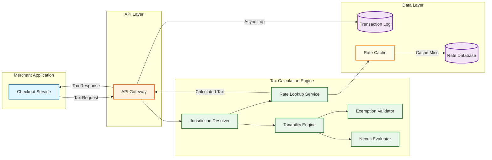
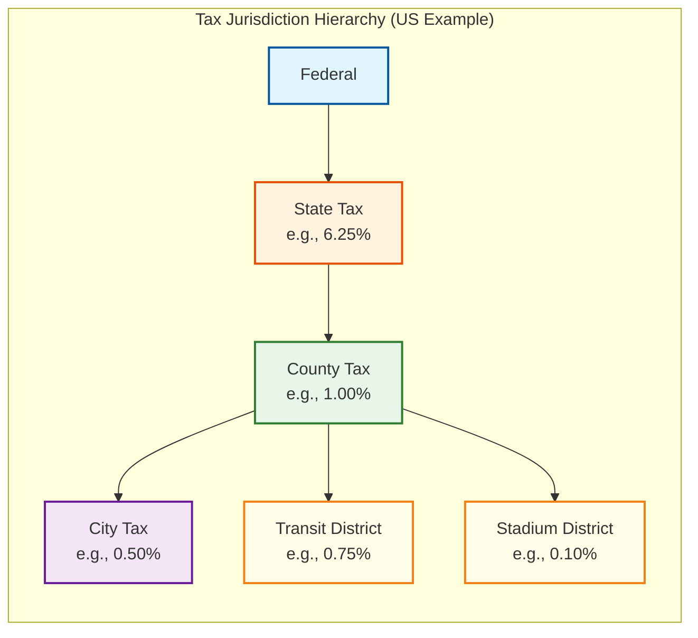

# Requirements & Estimations

## Functional Requirements

### Core Features

| # | Feature | Description |
|---|---------|-------------|
| F1 | **Real-Time Tax Calculation** | Calculate tax on multi-line invoices with per-line-item taxability determination; resolve product-level tax codes, jurisdiction-specific rates, and tiered/bracketed rate structures; support split-shipment scenarios where origin, destination, and intermediary jurisdictions each impose distinct tax obligations; return itemized tax breakdown (state, county, city, district) within a single API response |
| F2 | **Tax Jurisdiction Resolution** | Resolve the precise taxing jurisdictions for a transaction based on ship-from, ship-to, and point-of-acceptance addresses; perform geo-coordinate-based lookup for special taxing districts (transit, stadium, improvement districts) that do not align with postal boundaries; support multi-level hierarchy resolution (federal > state/province > county > city > special district) with overlapping jurisdiction detection |
| F3 | **Product Taxability Determination** | Map merchant product SKUs to a canonical product-tax-code (PTC) taxonomy; evaluate category-based taxability rules (e.g., food exempt in state A but taxable in state B, clothing exempt below a threshold in state C); handle composite products (bundles containing taxable and exempt items) with unbundling logic and true-object-of-the-transaction tests |
| F4 | **Tax Nexus Determination** | Track physical nexus triggers (offices, warehouses, employees, inventory) per jurisdiction; evaluate economic nexus thresholds (revenue and/or transaction count per state, with rolling-12-month and calendar-year windows); apply marketplace facilitator rules where the platform—not the seller—bears collection responsibility; maintain nexus status change history with effective dates |
| F5 | **Exemption Certificate Management** | Accept, validate, and store exemption certificates (resale, government, non-profit, agricultural, manufacturing); auto-apply valid certificates to transactions matching the certificate's jurisdiction and product scope; track certificate expiry dates with 60/30/15-day renewal reminders; support multi-jurisdiction blanket certificates and single-purchase certificates; expose validation status (valid, expired, pending review, rejected) |
| F6 | **Tax Rate Management** | Version all rate changes with effective-date and sunset-date; support point-in-time rate lookups for historical transaction recalculation and audit; handle mid-period rate changes with pro-rata application for subscription billing; ingest rate feeds from government data sources and tax-content providers with automated reconciliation against prior versions |
| F7 | **Tax Return Preparation & Filing** | Aggregate taxable sales, exempt sales, and tax collected by jurisdiction and filing period; generate return-ready data in jurisdiction-specific formats (state sales tax returns, VAT returns, GST returns); support amended return generation when transaction corrections occur post-filing; track filing status, confirmation numbers, and payment remittances per jurisdiction per period |
| F8 | **E-Invoicing Compliance** | Generate and transmit compliant e-invoices to government portals: India GST Invoice Registration Portal (IRP) for IRN and QR code generation, EU ViDA-compliant structured invoices (Peppol BIS 3.0/UBL), Brazil NF-e and NFS-e via SEFAZ, Saudi Arabia ZATCA Phase 2 with cryptographic stamping; handle portal downtime with retry queues and offline signing |
| F9 | **Multi-Tax-Type Support** | Calculate and manage distinct tax types within a unified engine: sales tax (US origin/destination-based), use tax (for untaxed purchases consumed in-state), value-added tax (EU/UK input-output mechanism), goods-and-services tax (India CGST/SGST/IGST, Australia, Canada), excise duty (per-unit and ad-valorem), customs duty (HS-code-based with preferential trade agreements), and withholding tax (cross-border service payments) |
| F10 | **Audit Trail & Transaction Logging** | Record every tax determination with the complete input context (addresses, product codes, amounts, exemptions applied) and the full output (jurisdiction tree, rates used, tax amounts, rule versions); store the rate-table version and rule-engine snapshot hash used for each calculation; support deterministic replay—re-running the same input against the same snapshot must produce an identical result; retain logs for 7+ years with tamper-evident storage |

### User Roles

| Role | Capabilities |
|------|-------------|
| **Merchant Developer** | Integrate tax calculation API, manage API keys, test sandbox transactions, review API logs |
| **Tax Manager** | Configure nexus settings, manage product-tax-code mappings, upload exemption certificates, review jurisdiction overrides, prepare and approve tax returns |
| **Finance Controller** | View tax liability dashboards, reconcile tax collected vs. remitted, approve filing submissions, manage payment remittances |
| **Auditor** | Read-only access to all transactions, rate snapshots, rule versions, and calculation replay; generate audit-ready reports by jurisdiction and period |
| **Platform Admin** | Manage tenant onboarding, configure rate-feed ingestion, monitor system health, manage data retention policies |

### Out of Scope

| Exclusion | Rationale |
|-----------|-----------|
| Payment processing and collection | Tax engine calculates amounts; collection and remittance happen in the payment/ERP layer |
| Full accounting and general ledger | Tax journal entries are exported to the GL system; the tax engine does not maintain a ledger of record |
| Transfer pricing | Intercompany pricing rules are handled by dedicated transfer-pricing modules outside the tax engine |
| Income tax computation | Corporate and personal income tax are fundamentally different workflows from transactional tax |
| Customs brokerage and clearance | The engine computes duty estimates using HS codes; actual clearance is handled by customs brokers |
| Tax advisory and planning | The engine applies codified rules; interpretive tax planning is a professional services function |

---

## Non-Functional Requirements

| Requirement | Target | Rationale |
|-------------|--------|-----------|
| **Single-Line Calculation Latency** | p50 < 20ms, p99 < 50ms | Tax calculation is in the synchronous checkout path; every millisecond of added latency reduces conversion |
| **Multi-Line Invoice Latency** | p50 < 80ms, p99 < 200ms (50-line invoice) | Batch invoices must complete within a single API timeout window; linear scaling with line count |
| **Sustained Throughput** | 100K calculations/second | Enterprise merchants process thousands of concurrent checkouts; the engine must not become a bottleneck |
| **Peak Throughput** | 500K calculations/second | Black Friday / Singles Day / tax-holiday surges produce 5x sustained load for multi-hour windows |
| **Availability** | 99.99% (< 52.6 min downtime/year) | Tax calculation failure blocks the entire purchase flow; even brief outages cascade into revenue loss |
| **Jurisdiction Resolution Accuracy** | 99.99% correct jurisdiction assignment | Misassigned jurisdiction means wrong tax rate, leading to under/over-collection and audit liability |
| **Rate Accuracy** | 100% (rates match published government rates) | Incorrect rates create direct financial liability for the merchant; zero tolerance for rate errors |
| **Data Retention** | 7+ years for transaction logs, indefinite for rate history | IRS, state revenue departments, and international tax authorities require multi-year audit access |
| **Data Sovereignty** | Transaction data stays in region of origin | EU GDPR, India data localization, and various national regulations require in-region processing and storage |
| **CAP Trade-off** | CP for tax rules and rates; AP for analytics and dashboards | Serving a stale tax rate is worse than a brief unavailability; analytics can tolerate eventual consistency |
| **Rate Update Propagation** | < 1 hour from ingestion to serving | Legislative rate changes often take effect at midnight; the engine must reflect new rates before the first transaction of the new effective date |
| **Deterministic Replay** | Bit-identical output for same input + same rule version | Auditors and dispute resolution require the ability to reproduce any historical calculation exactly |

---

## Capacity Estimations

### Traffic

```
Merchants on platform:              200,000
Total monthly transactions:         4,500,000,000 (4.5B)
Daily transactions (average):       150,000,000 (150M)
Daily transactions (peak):          750,000,000 (750M, during tax holidays / Black Friday)

Average lines per transaction:      3.2
Daily line-item calculations:       150M × 3.2 = 480M line-item tax lookups

Calculations per second:
  Average:                          150M / 86,400 ≈ 1,736 TPS (transaction-level)
  Average (line-item level):        480M / 86,400 ≈ 5,556 TPS
  Peak (sustained, 8-hour window):  ~100K TPS (transaction-level)
  Peak (burst, 5-minute window):    ~500K TPS (transaction-level)

Jurisdiction lookups per day:       480M (one per line item, cached heavily)
Nexus evaluations per day:          ~2M (evaluated per-merchant, not per-transaction)
Exemption certificate checks/day:   ~15M (B2B transactions require certificate validation)

API calls breakdown:
  Tax calculation (POST /calculate):  150M/day
  Tax commit (POST /commit):          120M/day (not all calculations convert to sales)
  Tax void/refund (POST /void):       8M/day (~5% return rate)
  Rate lookup (GET /rates):           5M/day (merchant dashboards and previews)
  Certificate validation:             15M/day
```

### Jurisdiction & Rate Data

```
Total taxing jurisdictions (US):      ~13,000 (states, counties, cities, special districts)
Total taxing jurisdictions (global):  ~250,000 (including EU VAT zones, India GST states,
                                       Brazil ICMS states, Canadian provinces)
Rate records (with history):          ~5,000,000 (jurisdictions × rate types × versions)
Rate changes per month:               ~2,000 (US averages ~800 rate changes/quarter)
Product tax codes in taxonomy:        ~15,000 codes across all tax types
Taxability rules (code × jurisdiction): ~50,000,000 (15K codes × ~3,300 rule-variant groups)

Jurisdiction boundary polygons:
  US special taxing districts:         ~35,000 polygons
  Average polygon complexity:          ~200 vertices
  Boundary dataset size:               ~500 MB (compressed GeoJSON)

Rate table size (current snapshot):    ~2 GB (all jurisdictions, all tax types)
Rate table size (full history):        ~50 GB (7+ years of versioned rates)
```

### Storage

```
--- Transaction Logs ---
Transaction record size:            ~4 KB (input context + full tax breakdown + metadata)
Daily transaction log growth:       150M × 4 KB = 600 GB/day
Annual transaction log growth:      ~219 TB/year
7-year retention total:             ~1.5 PB

--- Rate & Rule Data ---
Current rate snapshot:              ~2 GB
Full rate history (7+ years):       ~50 GB
Taxability rule matrix:             ~8 GB (50M rules × ~160 bytes each)
Jurisdiction boundary data:         ~500 MB (polygons + spatial index)
Product tax code taxonomy:          ~50 MB

--- Exemption Certificates ---
Average certificate size:           500 KB (scanned PDF + extracted metadata)
Certificates on file:               ~20M across all merchants
Total certificate storage:          20M × 500 KB = 10 TB
Daily new uploads:                  ~50K certificates
Daily upload volume:                50K × 500 KB = 25 GB/day

--- Audit & Replay Data ---
Calculation snapshot hash per txn:  ~200 bytes (rule-version vector + rate-table hash)
Daily audit metadata:               150M × 200 B = 30 GB/day
Annual audit metadata:              ~11 TB/year

--- E-Invoice Archive ---
E-invoice XML/JSON per document:    ~10 KB (signed, with government response)
Daily e-invoices generated:         ~5M (India + EU + Brazil + Saudi)
Daily e-invoice storage:            5M × 10 KB = 50 GB/day
Annual e-invoice storage:           ~18 TB/year

--- Summary ---
Hot storage (< 30 days):            ~25 TB (recent txn logs + active rate tables + cache)
Warm storage (30 days - 1 year):    ~250 TB (transaction logs + e-invoices)
Cold storage (1 - 7+ years):       ~1.3 PB (archived logs + certificates + rate history)
Grand total (7-year horizon):       ~1.6 PB
```

### Bandwidth

```
Inbound API bandwidth:
  Tax calculation requests:         150M × 1.5 KB avg payload = 225 GB/day
  Average inbound:                  225 GB / 86,400s ≈ 2.6 MB/s
  Peak inbound:                     2.6 × 50 = 130 MB/s (burst)

Outbound API bandwidth:
  Tax calculation responses:        150M × 2 KB avg response = 300 GB/day
  Average outbound:                 300 GB / 86,400s ≈ 3.5 MB/s
  Peak outbound:                    3.5 × 50 = 175 MB/s (burst)

E-invoice portal traffic:
  Outbound to government portals:   5M × 10 KB = 50 GB/day
  Average:                          ~580 KB/s
  Peak (batch filing windows):      ~10 MB/s

Rate feed ingestion:
  Monthly rate update feed:         ~500 MB/month
  Boundary polygon refresh:         ~500 MB/quarter
  Negligible continuous bandwidth

Certificate upload bandwidth:
  Daily uploads:                    25 GB/day
  Average:                          ~290 KB/s
  Peak:                             ~5 MB/s
```

### Cache Sizing

```
--- Rate Table Cache ---
Current rate snapshot (all jurisdictions):   ~2 GB
Hot jurisdiction rates (top 1,000):          ~200 MB
Product taxability matrix (hot codes):       ~500 MB
Rate cache total per node:                   ~3 GB (fits in memory)

--- Jurisdiction Lookup Cache ---
Spatial index (R-tree) for US districts:     ~1.5 GB
Address-to-jurisdiction mapping cache:       ~4 GB (LRU, 50M most-recent lookups)
Jurisdiction cache total per node:           ~6 GB

--- Exemption Certificate Cache ---
Certificate validity index:                  ~2 GB (merchant×jurisdiction×product scope→valid/expired)
Hot certificates (recently accessed):        ~500 MB
Certificate cache total per node:            ~2.5 GB

--- Nexus Status Cache ---
Merchant nexus matrix (200K merchants × 50 states): ~500 MB
Economic nexus threshold counters:           ~200 MB
Nexus cache total per node:                  ~700 MB

--- Total Cache per Compute Node ---
Grand total:                                 ~12 GB per node
Cluster total (50 nodes):                    ~600 GB aggregate cache
```

---

## SLO Definitions

### Calculation Latency SLOs

| Operation | Metric | SLO | SLA | Measurement Point |
|-----------|--------|-----|-----|-------------------|
| Single-line tax calculation | p50 latency | < 20ms | < 40ms | API gateway ingress to response egress |
| Single-line tax calculation | p99 latency | < 50ms | < 100ms | Including jurisdiction resolution and rate lookup |
| Multi-line invoice (10 lines) | p50 latency | < 40ms | < 80ms | Parallelized per-line calculation with aggregation |
| Multi-line invoice (50 lines) | p50 latency | < 80ms | < 160ms | Linear scaling with constant overhead |
| Multi-line invoice (50 lines) | p99 latency | < 200ms | < 400ms | Worst-case jurisdiction resolution for 50 distinct destinations |
| Batch calculation (1,000 invoices) | p50 latency | < 5s | < 10s | Async batch endpoint with callback |
| Jurisdiction resolution (address) | p50 latency | < 5ms | < 10ms | Address normalization + spatial lookup + hierarchy resolution |
| Exemption certificate validation | p50 latency | < 10ms | < 25ms | Certificate index lookup + scope matching |

### Accuracy SLOs

| Dimension | SLO | SLA | Measurement Method |
|-----------|-----|-----|--------------------|
| Jurisdiction assignment accuracy | 99.99% | 99.95% | Monthly audit against ground-truth jurisdiction dataset; address-to-jurisdiction correctness |
| Rate accuracy (matches published rate) | 100% | 100% | Automated daily reconciliation of served rates against government-published rate tables |
| Product taxability correctness | 99.95% | 99.9% | Quarterly review of taxability determinations against jurisdiction-specific taxability guides |
| Exemption application accuracy | 99.99% | 99.95% | Valid certificates correctly applied; expired certificates correctly rejected |
| E-invoice acceptance rate | > 99.5% | > 99% | Percentage of submitted e-invoices accepted by government portal on first attempt |
| Deterministic replay fidelity | 100% | 100% | Re-calculation with same input and same rule-version produces bit-identical output |

### Availability SLOs

| Component | SLO | SLA | Scope |
|-----------|-----|-----|-------|
| Tax calculation API | 99.99% | 99.95% | POST /calculate, POST /commit, POST /void endpoints |
| Rate lookup API | 99.95% | 99.9% | GET /rates, GET /jurisdictions endpoints |
| Certificate management API | 99.9% | 99.5% | Upload, validate, query endpoints (not in critical purchase path) |
| Tax return preparation | 99.5% | 99% | Batch processing; filing deadlines provide multi-day buffer |
| E-invoice submission | 99.9% | 99.5% | Government portal availability is external dependency; retry queue absorbs outages |
| Admin and dashboard UI | 99.9% | 99.5% | Tax manager configuration and reporting interfaces |

### Data Freshness SLOs

| Data Type | Freshness SLO | Measurement |
|-----------|---------------|-------------|
| Legislative rate changes | Reflected within 24 hours of official publication | Time from government gazette publication to rate serving in production |
| Emergency rate changes (disaster relief) | Reflected within 4 hours of notification | Time from official notification to rate update in production |
| Nexus threshold updates | Recalculated within 1 hour of qualifying transaction | Economic nexus counters updated in near-real-time |
| Exemption certificate status | Reflected within 5 minutes of upload/expiry | Certificate validity index update latency |
| E-invoice portal responses | Reflected within 15 minutes | Government acknowledgment/rejection propagated to merchant |
| Transaction analytics | Available within 30 minutes | Calculation data reflected in reporting dashboards |

---

## Constraints and Assumptions

### Regulatory Constraints

1. **Jurisdiction complexity grows monotonically**: The US alone has ~13,000 taxing jurisdictions, and new special districts are created regularly. The system must handle jurisdiction count growth without architectural changes. Globally, e-invoicing mandates are expanding (40+ countries by 2027), adding new compliance formats continuously.

2. **Retroactive rate changes occur**: Legislatures occasionally pass rate changes with retroactive effective dates. The engine must support backdated rate insertion and provide tooling to identify and re-calculate affected transactions.

3. **Tax holidays create temporal complexity**: State-declared tax holidays (e.g., back-to-school weekends) exempt specific product categories for precise date-time windows, sometimes with per-item dollar thresholds. The rate engine must support time-bounded, product-scoped, amount-capped rate overrides.

4. **Data residency requirements vary by region**: EU transaction data must be processed and stored within the EU. India GST data must reside in India. Brazil NF-e records must be accessible to SEFAZ. Multi-region deployment is a compliance requirement, not just a performance optimization.

5. **Audit defensibility requires deterministic replay**: Tax authorities may audit transactions years after they occurred. The engine must store sufficient state (rate-table version, rule-engine version, input snapshot) to reproduce any historical calculation identically.

### Technical Assumptions

1. **Address quality is variable**: Merchant-provided addresses range from fully structured (street, city, state, ZIP+4) to partial (ZIP-only or city+state). The engine must gracefully degrade jurisdiction resolution accuracy based on address completeness, returning the most specific jurisdiction determinable from available data.

2. **Product-tax-code mapping is merchant-managed**: Merchants are responsible for assigning product tax codes to their SKUs. The engine provides a taxonomy and mapping tools, but incorrect PTC assignment is a merchant-side data quality issue. The system should flag unmapped or suspicious mappings but cannot guarantee correctness of merchant-provided codes.

3. **Calculation volume is highly seasonal**: Peak volumes (5x sustained) occur during retail events (Black Friday, Singles Day, Prime Day) and coincide with the periods where downtime is least tolerable. The architecture must support rapid horizontal scaling with pre-warmed caches.

4. **Rate data is sourced from multiple providers**: No single data provider covers all 250K+ global jurisdictions. The engine aggregates rates from multiple feeds and must reconcile conflicts (different sources reporting different rates for the same jurisdiction) with a configurable source-priority hierarchy.

5. **Most transactions hit a small jurisdiction set**: Despite 250K+ jurisdictions globally, the top 1,000 jurisdictions account for ~95% of transaction volume. Cache design should exploit this Zipfian distribution aggressively.

6. **Tax calculation must be idempotent**: The same transaction submitted multiple times (due to retries, network issues, or merchant implementation bugs) must return identical results and must not create duplicate tax obligations. Idempotency keys are required at the API layer.

### Architectural Constraints

1. **Zero-downtime deployments**: Rate table updates, rule engine changes, and code deployments must not cause calculation unavailability. Blue-green or canary deployment with rate-table versioning ensures continuous service.

2. **Multi-tenant isolation**: Each merchant's nexus configuration, exemption certificates, and product-tax-code mappings are strictly isolated. A misconfiguration for one merchant must never affect calculations for another.

3. **Backward-compatible API evolution**: Merchants integrate the tax API into their checkout flows. Breaking API changes cause merchant outages. API versioning with minimum 24-month deprecation windows is required.

4. **Separation of calculation and commitment**: Tax calculation (quote) and tax commitment (invoice finalization) are distinct operations. A calculated tax amount is not a tax obligation until committed. Uncommitted calculations expire after a configurable TTL (default: 30 minutes for checkout flows, 24 hours for quote scenarios).

---

## Request Flow Overview





---

## Key Estimation Insights

1. **Transaction logging is the dominant storage cost, not rate data**: While rate tables and jurisdiction boundaries are complex, they total ~60 GB. Transaction logs at 600 GB/day with 7-year retention accumulate to ~1.5 PB—dwarfing every other storage category by orders of magnitude. A tiered storage strategy (hot SSD for 30 days, warm object storage for 1 year, cold archival beyond) with efficient compression is essential to keep costs viable.

2. **Cache hit rate is the primary latency lever**: With 95% of transactions hitting the top 1,000 jurisdictions, an in-memory rate cache of ~3 GB per node can serve the vast majority of lookups in < 1ms, leaving the 20ms p50 budget entirely for request parsing, jurisdiction resolution, and response serialization. Cache invalidation on rate changes must be atomic and cluster-wide—serving a stale rate is a compliance violation, not merely a performance issue.

3. **Jurisdiction resolution via spatial lookup is the hardest sub-problem**: US special taxing districts (transit authorities, improvement districts) have boundaries that do not align with ZIP codes, counties, or cities. A point-in-polygon query against ~35,000 district polygons is required for every unique address. Pre-computing address-to-jurisdiction mappings and caching them (4 GB LRU cache covers 50M addresses) converts this from a computational bottleneck to a memory-bounded problem.

4. **The 100K-to-500K TPS scaling range defines the architecture**: Sustained 100K TPS with 5x burst capability means the system cannot rely on vertical scaling or single-region deployment. Stateless calculation nodes reading from replicated in-memory rate caches, fronted by consistent-hash routing, allow horizontal scaling. The rate cache is the shared state—keeping it small (~12 GB per node) ensures that node startup and cache warming complete in seconds, enabling rapid auto-scaling.

5. **E-invoicing transforms the engine from pure calculation to document orchestration**: With 5M e-invoices daily across 4+ government portal integrations, each with distinct schemas, signing requirements, and retry semantics, the e-invoicing subsystem is a distributed integration platform in its own right. Portal downtime, cryptographic signing latency, and asynchronous acknowledgment flows require a dedicated queue-based architecture separate from the synchronous calculation path.

6. **Economic nexus evaluation is a streaming aggregation problem**: Tracking whether each merchant has crossed revenue or transaction-count thresholds in each of 50 US states (with rolling windows) requires maintaining ~10M counters (200K merchants x 50 states) updated in near-real-time. This is a distinct workload from per-transaction calculation—it resembles a streaming analytics pipeline more than a request-response service, and should be architecturally separated to avoid coupling nexus counter latency to checkout latency.
