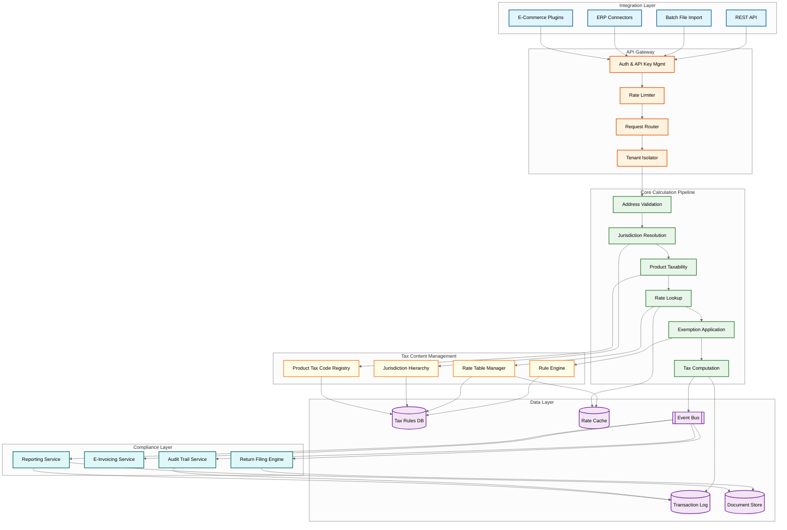
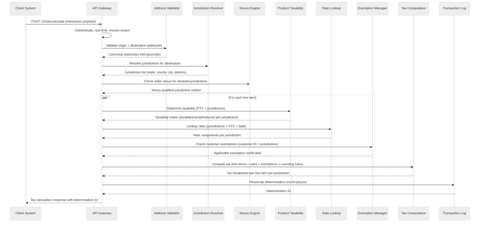
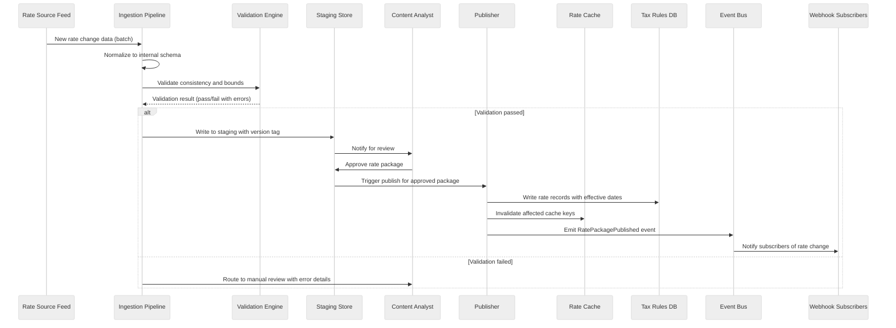
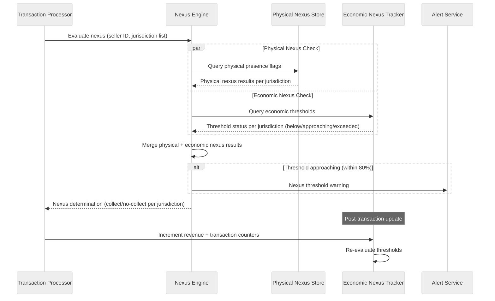

# High-Level Design

## Architecture Overview

The Tax Calculation Engine is decomposed into six logical layers: **Integration Layer** (REST API, batch file import, ERP connectors, e-commerce plugins), **API Gateway** (authentication, rate limiting, request routing, tenant isolation), **Core Calculation Pipeline** (address validation, jurisdiction resolution, product taxability determination, rate lookup, exemption application, tax computation), **Tax Content Management** (rule engine, rate table manager, jurisdiction hierarchy, product tax code registry), **Compliance Layer** (return filing, e-invoicing, audit trail, reporting), and **Data Layer** (tax rules database, rate cache, transaction log, document store). The calculation pipeline is the hot path -- optimized for sub-50ms p99 latency by pre-computing jurisdiction-to-rate mappings and caching aggressively. The content management layer operates on a separate cadence, ingesting rate changes and propagating them through a versioned publishing pipeline so that no in-flight calculation reads a partially-updated rule set.

---

## 1. System Architecture Diagram



---

## 2. Core Components

### 2.1 Tax Calculation Engine (Hot Path)

The calculation engine is the central orchestrator that receives a transaction request (seller address, buyer address, line items with product tax codes, transaction date, customer exemption certificates) and produces a fully-computed tax breakdown. It executes the six-stage pipeline sequentially for each line item:

1. **Address Validation** -- normalizes and geocodes both origin and destination addresses to canonical postal representations.
2. **Jurisdiction Resolution** -- maps the validated address to every taxing jurisdiction that has authority over the transaction (country, state/province, county, city, special district).
3. **Product Taxability** -- determines whether each line item is taxable, exempt, or subject to special rates in each resolved jurisdiction, based on the product tax code.
4. **Rate Lookup** -- retrieves the applicable tax rate for each jurisdiction-product combination at the transaction date, aggregating multi-level rates.
5. **Exemption Application** -- applies any customer-held exemption certificates that cover the transaction's jurisdictions and product categories.
6. **Tax Computation** -- calculates the final tax amount per line item per jurisdiction, applying rounding rules, tax-on-tax rules, and threshold-based rate tiers.

The engine is stateless -- all context arrives with the request, all reference data is read from cache. This enables horizontal scaling by adding compute instances. Each calculation produces an immutable **tax determination record** written to the transaction log, serving as the legal basis for the tax charged.

### 2.2 Jurisdiction Resolution Service

Addresses map to taxing jurisdictions through a multi-layer resolution process. A single US address, for example, may fall under federal, state, county, city, and multiple special-purpose district jurisdictions (transit, school, fire). The service maintains a geospatial index of jurisdiction boundaries (polygons) and performs point-in-polygon lookups against the geocoded address.

**Key data structures:**
- **Jurisdiction boundary index** -- R-tree spatial index of jurisdiction polygons, rebuilt nightly from authoritative boundary data feeds.
- **Jurisdiction hierarchy DAG** -- jurisdictions form a directed acyclic graph (not a strict tree) because special districts overlap across county and city boundaries. Each node carries metadata: jurisdiction type, FIPS code, effective date range, and parent pointers.
- **Rooftop geocode cache** -- caches address-to-coordinate mappings to avoid repeated geocoding.

The service returns an ordered list of jurisdiction codes with hierarchy relationships for downstream rule and rate lookups.

### 2.3 Product Taxability Service

Not all products are taxed equally. Groceries may be exempt in one state but taxable in another. SaaS subscriptions may be taxable as tangible personal property in some jurisdictions and non-taxable services in others. The Product Taxability Service maps each line item's **Product Tax Code (PTC)** to a taxability determination per jurisdiction.

**Product Tax Code hierarchy:**
```
PTC-00000  (Fully Taxable - default)
├── PTC-10000  (Clothing & Apparel)
│   ├── PTC-10010  (General Clothing)
│   └── PTC-10020  (Protective Clothing)
├── PTC-20000  (Food & Beverage)
│   ├── PTC-20010  (Grocery / Unprepared Food)
│   └── PTC-20020  (Prepared Food)
├── PTC-30000  (Software & Digital Goods)
│   ├── PTC-30010  (Canned / Off-the-Shelf Software)
│   ├── PTC-30020  (Custom Software)
│   └── PTC-30030  (SaaS / Cloud Services)
└── PTC-40000  (Services)
    ├── PTC-40010  (Professional Services)
    └── PTC-40020  (Maintenance & Repair)
```

Taxability rules are evaluated in specificity order: jurisdiction-specific rules for the exact PTC override parent PTC rules, which override default taxability.

### 2.4 Rate Lookup Service

The Rate Lookup Service retrieves the effective tax rate for a given jurisdiction, PTC, and transaction date. Rates are stored in a time-versioned table where each row represents a rate effective within a date range. The service aggregates rates across the jurisdiction hierarchy -- summing state + county + city + special district rates into a combined rate.

**Rate aggregation logic (pseudocode):**
```
FUNCTION lookup_rates(jurisdictions[], ptc, txn_date):
    rates = []
    FOR EACH jurisdiction IN jurisdictions:
        rate_record = rate_cache.get(
            key = (jurisdiction.code, ptc, txn_date)
        )
        IF rate_record IS NULL:
            rate_record = rate_db.query(
                jurisdiction = jurisdiction.code,
                ptc = ptc,
                effective_start <= txn_date,
                effective_end > txn_date
            )
            rate_cache.set(key, rate_record, ttl = rate_record.effective_end - txn_date)

        rates.append(RateComponent(
            jurisdiction = jurisdiction,
            rate = rate_record.rate,
            rate_type = rate_record.type,  // PERCENTAGE, FLAT, TIERED
            caps = rate_record.caps,
            thresholds = rate_record.thresholds
        ))

    RETURN AggregatedRate(components = rates, combined = sum(r.rate FOR r IN rates))
```

The cache TTL is set to the remaining validity period of the rate record, ensuring automatic invalidation when a rate change takes effect. For tiered rates (where the rate varies by transaction amount), the service returns the tier schedule and the computation stage applies the correct tier.

### 2.5 Nexus Determination Engine

**Nexus** is the legal concept that determines whether a seller has sufficient connection to a jurisdiction to be required to collect and remit tax. The Nexus Determination Engine tracks both physical nexus (offices, warehouses, employees in a jurisdiction) and economic nexus (revenue or transaction count thresholds triggering collection obligations).

**Physical nexus signals:** employee locations, warehouse addresses, registered business addresses, property ownership, affiliate relationships, drop-ship arrangements.

**Economic nexus thresholds:** tracked per jurisdiction per rolling 12-month or calendar-year window. Typical thresholds: $100K revenue or 200 transactions. The engine maintains running counters and triggers alerts when a seller approaches or crosses a threshold.

The nexus matrix (seller x jurisdiction x nexus type) is evaluated at calculation start to determine collection obligations. Jurisdictions where the seller has no nexus return "no collection obligation" -- distinct from "exempt" or "zero-rated."

### 2.6 Exemption Certificate Manager

Businesses frequently hold exemption certificates that relieve them from tax on certain purchases (resale certificates, manufacturing exemptions, government exemptions). The Exemption Certificate Manager stores, validates, and applies these certificates.

**Certificate lifecycle:** upload (PDF/image) --> OCR extraction --> validation against issuing authority --> approval/rejection --> storage with expiration tracking --> automatic renewal reminders.

**Application logic:** when a transaction arrives with a customer identifier, the engine queries for active exemption certificates held by that customer, matching on jurisdiction and product category. Partial exemptions (e.g., exempt on manufacturing equipment but not office supplies) are applied at the line-item level. The manager supports single-use certificates (one-time exempt purchases), blanket certificates (covering all qualifying purchases from a specific seller), and multi-jurisdiction certificates (accepted across participating states under harmonized frameworks).

### 2.7 Tax Content Ingestion Pipeline

Tax rates and rules change constantly -- thousands of rate changes take effect each year across global jurisdictions. The ingestion pipeline ensures these changes flow into the system accurately and are activated exactly on their effective date.

**Pipeline stages:** (1) **Source collection** -- crawlers and analysts gather rate changes from government gazettes and partner data feeds. (2) **Normalization** -- raw data transformed into internal schema (jurisdiction code, PTC, rate, effective date range, rule conditions). (3) **Validation** -- automated consistency checks (no overlapping effective dates, rates within plausible bounds, mandatory fields present). (4) **Staging** -- validated changes written to a staging environment for QA review. (5) **Publishing** -- approved changes published as a versioned, atomic **rate package**. (6) **Propagation** -- rate cache invalidated for affected keys; in-flight calculations continue using the prior version (snapshot isolation).

### 2.8 Compliance and Filing Engine

The compliance engine consumes tax determination records and produces the outputs required by tax authorities: periodic tax returns, e-invoices, and audit-ready reports.

**Return filing:** aggregates transaction-level tax data into jurisdiction-specific return formats. Each jurisdiction has its own filing frequency (monthly, quarterly, annually), form format, and submission method. The engine generates pre-filled returns, routes them for review, and submits via the appropriate channel.

**E-invoicing:** for jurisdictions requiring real-time tax reporting, the engine generates compliant e-invoice documents and transmits them to the authority's clearinghouse. Failed transmissions are retried with exponential backoff, with manual escalation after retries are exhausted.

---

## 3. Data Flow

### 3.1 End-to-End Tax Calculation Flow



### 3.2 Rate Update Propagation Flow



### 3.3 Nexus Evaluation Flow



---

## 4. Key Design Decisions

| Decision | Chosen Approach | Alternative | Rationale |
|----------|----------------|-------------|-----------|
| **Rate lookup strategy** | Pre-computed rate cache with versioned snapshots | On-the-fly computation from raw rules at query time | Pre-computation moves the cost to the publish step (infrequent) rather than the query path (high-frequency). Cache hit rate exceeds 99.5% for steady-state traffic, keeping p99 latency under 50ms. On-the-fly computation would add 15-30ms per jurisdiction per line item. |
| **Jurisdiction hierarchy model** | Directed Acyclic Graph (DAG) | Strict tree hierarchy | Special taxing districts (transit authorities, economic zones, fire districts) overlap across city and county boundaries, making a tree insufficient. The DAG allows a jurisdiction to have multiple parents and enables correct rate aggregation for overlapping authorities. |
| **Rate versioning** | Immutable versioned rate packages with snapshot isolation | In-place updates with read locks | Immutable packages guarantee that a calculation started at time T always uses the rate set effective at T, even if a new package is published mid-calculation. Eliminates read-write contention on the rate table entirely. |
| **Address normalization** | Internal normalization service backed by postal authority data | Third-party geocoding API per request | Reduces external dependency on the hot path. Postal authority datasets are ingested nightly into the local address index. External geocoding is used only as a fallback for addresses that fail local resolution (~2% of traffic). |
| **Exemption certificate storage** | Document store with structured metadata index | Relational DB with BLOB column | Certificates are unstructured documents (PDFs, images) with structured metadata (issuer, jurisdiction, expiration, product categories). A document store handles both the binary content and the queryable metadata efficiently. |
| **Multi-line-item parallelism** | Parallel evaluation of independent line items within a single request | Sequential line-item processing | Line items share address validation and jurisdiction resolution results but have independent taxability, rate lookup, and exemption evaluations. Parallel execution reduces latency for invoices with many line items (100+ lines common in B2B). |
| **Nexus threshold tracking** | Materialized running counters per seller per jurisdiction | On-demand aggregation from transaction log | Running counters provide O(1) nexus evaluation. Transaction log aggregation would require scanning potentially millions of records. Counters are updated asynchronously after each transaction commits, with periodic reconciliation against the log. |
| **Compliance return generation** | Template-based return engine with jurisdiction-specific plugins | Hardcoded return formats per jurisdiction | Tax return formats change frequently. Template-based generation with jurisdiction plugins allows updating a single template when a form changes, without redeploying the core engine. Plugins handle jurisdiction-specific validation rules and submission protocols. |
| **Cache invalidation** | Event-driven selective invalidation keyed on (jurisdiction, PTC, effective_date) | Time-based TTL expiration only | TTL-only invalidation risks serving stale rates after a mid-period correction. Event-driven invalidation ensures the cache is refreshed within seconds of a rate publish. TTL remains as a secondary safety net with a 24-hour expiry. |
| **Audit trail granularity** | Full determination record per transaction (all inputs, intermediate results, final output) | Summary-only audit (inputs + final tax amount) | Tax audits require demonstrating exactly which rules, rates, and exemptions produced a given tax amount. The full determination record enables reproducing any historical calculation without re-running the engine, which is critical because rates and rules may have changed since the original transaction. |

---

## 5. Integration Patterns

### 5.1 Synchronous API for Real-Time Calculation

The primary integration path for e-commerce checkouts, POS systems, and ERP invoice creation. The REST API accepts a transaction payload and returns a fully computed tax breakdown synchronously.

**Request flow:** client sends a POST to `/v2/tax/calculate` with seller/buyer addresses, line items (quantity, unit price, PTC, discount), customer identifier, and transaction date. The engine returns within the SLA (p50 < 20ms, p99 < 50ms for single-jurisdiction; p99 < 150ms for 50+ line items).

**Idempotency:** each request carries a client-generated idempotency key. Re-submission within 24 hours returns the cached determination without re-execution.

**Versioned endpoints:** API is versioned (v1, v2) to allow breaking schema changes. Older versions maintained for 18 months after deprecation notice.

### 5.2 Batch Processing for Bulk Transactions

Batch processing supports high-volume scenarios: month-end invoice runs, historical recalculation after a rate correction, and migration from a previous tax system.

**Batch protocol:** (1) Client uploads a CSV or JSON-lines file to the batch endpoint. (2) Processor validates the schema, assigns a batch ID, and returns immediately with a status polling URL. (3) File is partitioned into chunks (1,000 transactions each) distributed across workers via a work queue. (4) Each worker runs the standard calculation pipeline, writing results to the transaction log. (5) Result file is assembled in object storage and a BatchCompleted event is emitted. (6) Client polls or receives a webhook callback. Throughput target: 50,000 transactions/minute, scaling linearly with workers.

### 5.3 Webhook Notifications for Rate Changes

Integrating systems often need to know when tax rates change -- to update product pricing displays, recalculate open quotes, or trigger compliance reviews. The webhook notification system provides near-real-time alerts.

**Subscription model:** tenants register webhook endpoints with filter criteria (specific jurisdictions, product tax code categories, or all changes). When a rate package is published, the event bus routes RatePackagePublished events to the webhook dispatcher, which fans out HTTP POST callbacks to all matching subscriptions.

**Delivery guarantees:** at-least-once delivery with exponential backoff (1s, 5s, 30s, 2m, 15m, 1h). Each webhook carries a unique event ID for subscriber-side deduplication. After 24 hours of failures, the subscription is marked degraded and the tenant is notified. Payload includes affected jurisdictions, PTC categories, previous/new rates, and effective date.

### 5.4 ERP Connector Architecture

ERP integrations are bidirectional: the tax engine receives transaction data from the ERP for tax calculation, and the tax engine pushes compliance data (tax determination records, filing statuses) back to the ERP for general ledger posting.

**Connector design:** each ERP has a dedicated connector module translating between the ERP's data model and the tax engine's canonical schema:

- **Inbound mapping:** ERP invoice fields mapped to product tax codes, customer exemption identifiers, and canonical address format.
- **Outbound mapping:** tax determination results mapped back to ERP tax fields (tax amount per line, jurisdiction codes, GL account codes).
- **Authentication:** OAuth2 or API key with credentials in a secrets manager, rotated on schedule.
- **Error handling:** structured error codes mapped to ERP-native handling (hold invoice, flag for review, apply default rate).

Connectors are deployed as sidecar processes, communicating via a local message queue to decouple the ERP's request cadence from the engine's processing capacity.

---

## Architecture Pattern Checklist

| Pattern | Applied | Rationale |
|---------|---------|-----------|
| **Pipeline Architecture** | Yes | The six-stage calculation pipeline (address validation through tax computation) enforces a strict ordering of operations where each stage enriches the context for the next. Stages are independently testable and replaceable. |
| **CQRS** | Yes | Tax calculations write determination records to the transaction log (write store). Compliance reporting and audit queries read from materialized views optimized for aggregation (read store). Decouples high-throughput calculation from complex reporting queries. |
| **Event-Driven Architecture** | Yes | Rate publish events trigger cache invalidation, webhook notifications, and compliance recalculation. Transaction events drive audit trail projection and nexus counter updates. All events are durably persisted for replay. |
| **Snapshot Isolation** | Yes | Versioned rate packages ensure calculations always use a consistent set of rates, even during a rate publish. No partial reads of an in-progress update are possible. |
| **Cache-Aside with Event Invalidation** | Yes | Rate cache is populated on first access and invalidated by rate publish events. TTL provides a safety net. Cache hit rate target: 99.5%+. |
| **Multi-Tenancy** | Yes | Tenant isolation at every layer: per-tenant API keys, tenant-scoped nexus profiles, tenant-specific exemption certificate stores, and tenant-aware rate overrides for marketplace scenarios where the platform remits on behalf of sellers. |
| **Idempotent Operations** | Yes | Client-generated idempotency keys on calculation requests. Batch processing deduplicates on (batch_id, row_index). Return filing is idempotent on (jurisdiction, period, filing_type). Prevents duplicate tax records across retry scenarios. |
| **Circuit Breaker** | Yes | Applied to external address validation fallback, e-invoice submission to tax authority portals, and ERP outbound connectors. Prevents cascading failures when downstream systems are unavailable. |
| **Bulkhead Isolation** | Yes | Batch processing and real-time calculation run on separate compute pools. A large batch job cannot starve real-time checkout calculations of resources. Rate content ingestion runs on its own worker pool. |
| **Immutable Audit Log** | Yes | Every tax determination is an append-only record capturing all inputs, resolved jurisdictions, applied rates, exemptions, and the computed result. Records are cryptographically chained (each record includes a hash of the prior record) for tamper detection. |
