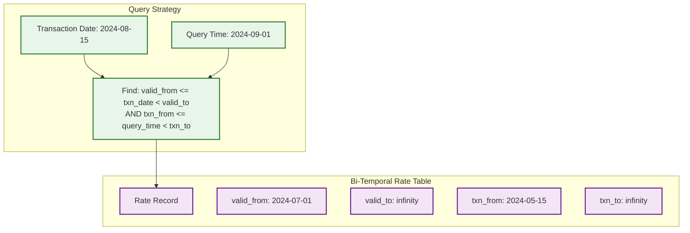
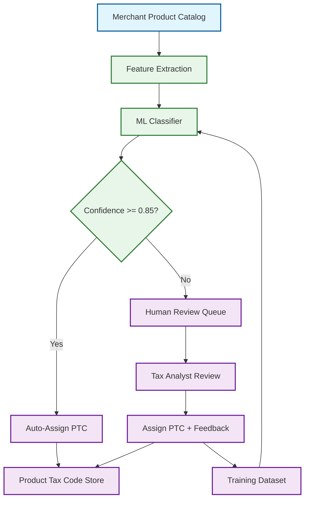
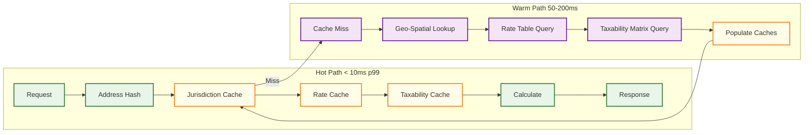

# Deep Dive & Bottlenecks

## 1. Jurisdiction Resolution Deep Dive

### The Problem

In the United States alone, there are over 13,000 distinct taxing jurisdictions---states, counties, cities, and special purpose districts---whose boundaries overlap and shift over time. A single street address may fall under 5--8 simultaneously active taxing authorities. Getting jurisdiction wrong means collecting the wrong tax amount, leading to audit exposure and penalties. The target is rooftop-level accuracy (resolving to the exact building), not ZIP-code approximation, because a ZIP code can span multiple counties or cities with different tax rates.

### Geo-Spatial Lookup Architecture

```mermaid
flowchart LR
    A[Raw Address] --> B[Address Standardizer]
    B --> C[Geo-Hash Cache Lookup]
    C -->|Hit| D[Return Jurisdictions]
    C -->|Miss| E[Geo-Spatial Index]
    E --> F[Point-in-Polygon Engine]
    F --> G[Overlay Special Districts]
    G --> H[Assemble Jurisdiction Stack]
    H --> I[Populate Cache]
    I --> D

    classDef client fill:#e1f5fe,stroke:#01579b,stroke-width:2px
    classDef service fill:#e8f5e9,stroke:#2e7d32,stroke-width:2px
    classDef cache fill:#fffde7,stroke:#f57f17,stroke-width:2px
    classDef data fill:#f3e5f5,stroke:#6a1b9a,stroke-width:2px

    class A,B client
    class E,F,G,H service
    class C,I cache
    class D data
```



**Address Standardization (5--20ms)** --- Normalize raw addresses by parsing components, correcting misspellings, expanding abbreviations, and validating against a postal authority database. Handles PO boxes, military addresses, and secondary units. Failed validation is flagged for manual review rather than silently defaulting to a ZIP-centroid.

**Geo-Hash Based Caching** --- Each geocoded coordinate converts to a geo-hash at configurable precision (7--8 characters, ~150m x 150m cells). All addresses in the same cell share identical jurisdictions. Dense urban areas use precision 8 (~38m cells), rural areas use precision 6 (~1.2km cells).

```
FUNCTION resolve_jurisdictions(address):
    standardized = standardize_address(address)
    IF NOT standardized.is_valid:
        RETURN Error("Address cannot be resolved, manual review required")

    lat_lng = geocode(standardized)
    geo_hash = encode_geohash(lat_lng, precision = 7)

    cached = jurisdiction_cache.get(geo_hash)
    IF cached IS NOT NULL AND cached.expires_at > NOW():
        RETURN cached.jurisdiction_stack

    base = spatial_index.point_in_polygon(lat_lng,
        layers = ["state", "county", "city", "township"])
    specials = spatial_index.point_in_polygon(lat_lng,
        layers = ["transit", "stadium", "school", "hospital",
                  "fire", "improvement", "tourism"])

    stack = merge_and_order(base, specials)
    next_change = boundary_change_calendar.next_effective_date(geo_hash)
    jurisdiction_cache.set(geo_hash, stack, MIN(next_change - NOW(), MAX_TTL))
    RETURN stack
```

### Special Taxing Districts

Special purpose districts overlay standard boundaries without aligning to them. A single address might fall within a transit authority, stadium financing district, school district, and hospital improvement district---each imposing its own rate. Approximately 3,500 special districts levy sales or use tax, with boundaries defined by metes-and-bounds legal descriptions requiring separate polygon layers per district type.

### Boundary Change Management

Approximately 500--800 boundary changes occur annually through annexations, de-annexations, and redistricting. The engine must:

1. **Ingest boundary updates** from authoritative sources as geospatial files (shapefiles, GeoJSON).
2. **Version boundaries temporally** --- a change effective July 1 must not affect June 30 transactions.
3. **Invalidate affected geo-hash cache cells** by identifying cells intersecting the changed polygon.
4. **Maintain audit trail** --- every jurisdiction assignment records the boundary version used for retroactive correction.

---

## 2. Rate Lookup and Aggregation Deep Dive

### Multi-Level Rate Stacking

Tax rates are stacks, not single values. A typical US transaction combines rates from every jurisdiction in the resolved stack:

| Level | Jurisdiction | Rate |
|-------|-------------|------|
| State | California | 7.25% |
| County | Los Angeles County | 0.25% |
| City | Santa Monica | 0.50% |
| Special | Metro Transit Authority | 0.50% |
| Special | Tourism District | 0.25% |
| **Total** | | **8.75%** |

For US sales tax, rates are additive. VAT/GST regimes use compound calculation (tax-on-tax)---e.g., provincial sales tax applied to price-plus-GST. The engine must know per jurisdiction combination whether to use additive or compound calculation.

### Bi-Temporal Rate Versioning

Rate tables track two time dimensions: **valid time** (when legally effective) and **transaction time** (when loaded into the system).



This supports: (a) loading future rates before their effective date without affecting current transactions; (b) retroactively determining which rate was in effect when a historical transaction was processed, supporting audit defense.

### Rate Change Propagation Pipeline

1. **Content team** enters the new rate with effective date into staging.
2. **Validation** --- automated bounds checks, cross-reference with neighbors, regression tests against a golden dataset.
3. **Staging** --- integration tests against active merchant configurations.
4. **Production** --- atomic promotion; cache invalidation for affected jurisdiction on dates >= effective date.

### Sales Tax Holidays

Several US states declare periodic sales tax holidays where specific product categories are exempt up to a price threshold. The engine models these as temporal rate overrides:

```
FUNCTION get_effective_rate(jurisdiction_stack, product_tax_code, txn_date, line_amount):
    FOR EACH jurisdiction IN jurisdiction_stack:
        holiday = holiday_overrides.find(jurisdiction.id, product_tax_code, txn_date)
        IF holiday IS NOT NULL AND line_amount <= holiday.price_threshold:
            jurisdiction.override_rate = holiday.rate  -- often 0%
    RETURN aggregate_rates(jurisdiction_stack)
```

### Rate Caching Strategy

Cache key: deterministic hash of sorted jurisdiction IDs. TTL: minimum of the next known rate change date for any jurisdiction in the stack and a 24-hour maximum. During bulk rate updates (e.g., January 1), the system pre-warms caches by computing rates for the top 10,000 most-queried jurisdiction stacks before midnight.

---

## 3. Product Taxability Engine Deep Dive

### The Taxonomy Problem

Merchants sell millions of SKUs, but tax authorities define taxability at the level of ~600--700 standardized product tax codes (PTCs). Mapping each SKU to the correct PTC is the fundamental challenge---manual classification does not scale beyond a few thousand SKUs.

### ML-Assisted Classification Pipeline



The classifier uses product title, description, category hierarchy, UPC/GTIN codes, and price. Above the 0.85 confidence threshold, assignment is automatic; below it, items enter human review. Human decisions feed back as training data. Typical 500K SKU onboarding: 70--75% auto-classified, 20--25% review, 5% specialist escalation.

### Jurisdiction-Specific Taxability Rules

The same PTC can have different outcomes across jurisdictions:

| Product Tax Code | New York | Mississippi | Pennsylvania | Texas |
|-----------------|----------|-------------|--------------|-------|
| Food - Grocery | Exempt | Taxable (7%) | Exempt | Exempt |
| Clothing - General | Exempt (< $110) | Taxable (7%) | Exempt | Taxable (6.25%) |
| Software - SaaS | Taxable (8%) | Exempt | Taxable (6%) | Taxable (6.25%) |
| Digital Books | Exempt | Taxable (7%) | Exempt | Exempt |

Note the threshold-based exemptions: New York exempts clothing under $110 per item, but the full amount becomes taxable above that threshold. The engine evaluates taxability per line item, not per category.

### Bundled and Composite Items

A gift basket with taxable candy and exempt groceries triggers jurisdiction-specific rules:

- **True object test**: If the exempt item defines the bundle's essential character, the entire bundle is exempt.
- **Percentage threshold**: If > 10--25% of the bundle's value is taxable items, the entire bundle is taxable.
- **Item-level split**: Some jurisdictions allow proportional splitting into taxable and exempt components.

### Digital Goods Taxation

SaaS, streaming media, e-books, and online courses each have distinct treatments varying by jurisdiction. A state might tax streaming video but exempt e-books, or tax B2B SaaS but exempt B2C. Sourcing rules add complexity: physical goods source to the destination, but some jurisdictions source digital goods to the billing address or seller's location.

---

## 4. Nexus Determination Deep Dive

### Physical and Economic Nexus

Nexus is the legal threshold obligating a seller to collect tax. Post-*South Dakota v. Wayfair* (2018), most US states enforce economic nexus---exceeding a revenue or transaction count threshold creates collection obligation regardless of physical presence.

**Physical nexus triggers**: office/store, warehouse/inventory, employees/contractors, trade show attendance exceeding state-specific day thresholds, affiliate referrals. **Economic nexus triggers**: revenue exceeding $100K and/or transaction count exceeding 200 per calendar year (varies by state; some use rolling 12-month windows). **Marketplace facilitator**: marketplace collects instead of the seller.

### Economic Nexus Threshold Tracking

The engine maintains per-seller, per-state running counters:

```
FUNCTION check_economic_nexus(seller_id, state, transaction):
    counter = nexus_counters.get(seller_id, state, current_period(state))
    threshold = state_thresholds.get(state)

    breach = FALSE
    IF threshold.type = "REVENUE_OR_COUNT":
        breach = (counter.revenue + transaction.amount >= threshold.revenue_limit
                  OR counter.tx_count + 1 >= threshold.count_limit)

    nexus_counters.atomic_increment(seller_id, state, current_period(state),
        delta_revenue = transaction.amount, delta_count = 1)

    IF breach AND NOT counter.already_breached:
        nexus_counters.mark_breached(seller_id, state, current_period(state))
        alert_service.notify(seller_id, state, "ECONOMIC_NEXUS_THRESHOLD_REACHED")
        registration_workflow.trigger(seller_id, state)
    RETURN breach
```

### Marketplace Facilitator Rules

Nearly all US states with sales tax have enacted marketplace facilitator laws: when a seller transacts through a qualifying marketplace, the marketplace bears the collection obligation. The engine determines per transaction whether the seller is operating through a marketplace or directly, affecting which entity's nexus profile is evaluated.

### Multi-Entity Nexus

Large enterprises operate through multiple legal entities with different nexus footprints. Some states aggregate related entities for threshold calculations (combined reporting). The engine models entity relationships and applies per-state aggregation rules.

---

## 5. Hot Path Optimization

### The Calculation Hot Path

At 100,000+ TPS during peak periods, each calculation must complete in under 10ms at p99. The hot path: **address hash --> jurisdiction cache --> rate cache --> taxability cache --> calculate --> respond**.



### Pre-Computed Jurisdiction-Rate-Taxability Tuples

For high-volume merchants, a small number of {ship-to region, product category} combinations account for the majority of transactions. The engine pre-computes full calculation results for these common tuples:

```
STRUCTURE PreComputedTuple:
    address_geo_hash, product_tax_code, jurisdiction_stack,
    combined_rate, taxability_result, valid_from, valid_until

FUNCTION fast_calculate(address, product_tax_code, amount, txn_date):
    geo_hash = encode_geohash(geocode(address), precision = 7)
    tuple = precomputed_cache.get(hash(geo_hash, product_tax_code))

    IF tuple IS NOT NULL AND tuple.valid_from <= txn_date <= tuple.valid_until:
        IF tuple.taxability_result = "EXEMPT":
            RETURN TaxResult(tax = 0, rate = 0, jurisdictions = tuple.jurisdiction_stack)
        RETURN TaxResult(
            tax = ROUND(amount * tuple.combined_rate, 2),
            rate = tuple.combined_rate, jurisdictions = tuple.jurisdiction_stack)

    RETURN full_calculate(address, product_tax_code, amount, txn_date)
```

### In-Memory Rule Engine

The hot path avoids database queries entirely. All rate tables, taxability matrices, and jurisdiction polygons are loaded into process-local memory and refreshed via change-data-capture. Data structures are optimized for CPU cache locality:

- **Rate tables**: Flat arrays sorted by jurisdiction ID for binary search. All US jurisdictions fit in ~2MB---within L3 cache.
- **Taxability matrix**: Compressed bitmap per PTC; 700 PTCs x 13,000 jurisdictions compresses to ~1.1MB.
- **Jurisdiction index**: R-tree spatial index with commonly accessed nodes pinned in memory.

### Request Batching for Multi-Line Invoices

A 200-line invoice shipping to one address resolves the jurisdiction stack once and reuses it. Rate retrieval is vectorized: all unique PTCs fetched in a single operation against the in-memory rate table, reducing per-line overhead from ~50us to ~5us.

### Connection Pooling and Backpressure

Bounded connection pools for the warm path prevent cascade failures. When exhausted, requests are shed with retriable errors. Circuit breakers default to ZIP-code-level approximation with a degradation flag if warm-path p99 exceeds 500ms.

---

## 6. Bottleneck Analysis

| Component | Bottleneck | Symptom | Mitigation |
|-----------|-----------|---------|------------|
| **Jurisdiction Cache** | Invalidation stampede during bulk boundary updates | Spike in geo-spatial DB queries; p99 jumps 10--50x | Staggered invalidation with jitter; pre-warm affected cells |
| **Rate Table Cache** | Mass expiration on Jan 1 / Jul 1 | Thundering herd on rate DB; latency exceeds SLA | Pre-warm top-N stacks 24h before; stale-while-revalidate |
| **Nexus Counters** | Write contention during high-volume sales | Counter lag; delayed threshold breach detection | Sharded counters with async aggregation |
| **Taxability Matrix** | Memory pressure loading full matrix | GC pauses; increased p99 tail latency | Compressed bitmaps; load only active-merchant jurisdictions |
| **Exemption Certs** | Validation latency for first-time B2B customers | 200--500ms added to first transaction | Async pre-validation at upload; cache by certificate ID |
| **Geo-Spatial Index** | R-tree lock contention during boundary updates | Read latency spikes during refresh | Copy-on-write index; atomic pointer swap |

### Bottleneck 1: Rate Table Cache Invalidation Stampede

**The problem**: Jan 1 and Jul 1 account for ~80% of annual rate changes. Hundreds of jurisdictions change simultaneously, and cache TTLs aligned to midnight create a thundering herd at 50K+ TPS.

**Mitigations**:
- **Pre-warming**: Background job computes new rates for top 50,000 jurisdiction stacks 24h before, swaps atomically at midnight.
- **Stale-while-revalidate**: Return stale rate immediately while fetching asynchronously; flag for reconciliation.
- **Staggered TTLs**: Random jitter (0--60s) spreads expirations across a minute.

### Bottleneck 2: Nexus Counter Contention

**The problem**: A seller in 45 states needs 45 counter updates per transaction. With 10K sellers at peak, that is 450K writes/second on hot rows.

**Mitigations**:
- **Sharded counters**: 16--64 shards per seller-state counter; increment random shard, aggregate every 30s.
- **Threshold buffer**: Alert at 90% of threshold to compensate for aggregation delay.
- **Async aggregation**: Shards in memory; background job writes totals to durable storage.

### Bottleneck 3: Exemption Certificate Validation

**The problem**: First-time B2B certificate validation requires external registry lookups (200--500ms), unacceptable in the checkout hot path.

**Mitigations**:
- **Eager validation**: Validate at upload time, not transaction time. Cache result by certificate fingerprint.
- **Graceful degradation**: If registry unavailable, accept provisionally; async retry and flag on failure.

---

## 7. Failure Modes and Graceful Degradation

| Failure | Impact | Degradation Strategy |
|---------|--------|---------------------|
| Geo-spatial DB down | Cannot resolve new addresses | Serve from cache; ZIP-code fallback for misses |
| Rate DB unavailable | Cannot fetch cache-miss rates | Serve stale rates; flag `rate_confidence: STALE` |
| Nexus counter store down | Threshold tracking halted | Buffer in local WAL; replay on recovery |
| Certificate registry timeout | Cannot validate new certs | Accept provisionally; async retry |
| Boundary ingestion failure | Stale boundaries | Continue existing; alert content team |
| ML classifier down | Cannot classify new products | Queue for review; tax at highest rate |
