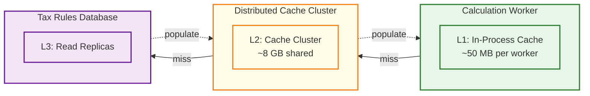
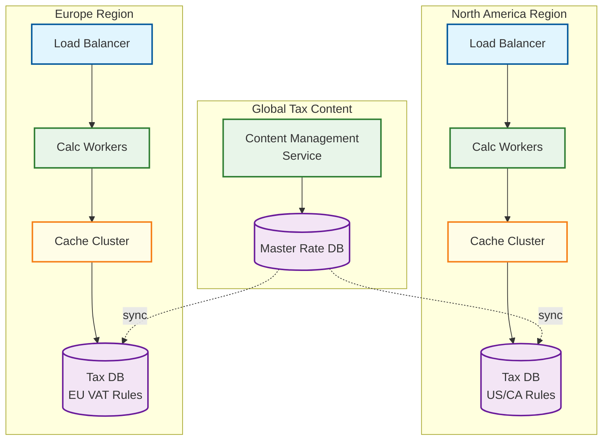

# Scalability & Reliability

## Scaling Strategy Overview

A tax calculation engine sits on the critical path of every e-commerce checkout, invoice generation, and point-of-sale transaction. Latency must stay below 50ms at p99 for real-time calculations, while batch workloads can tolerate seconds. The workload is CPU-bound (rate lookup + multi-jurisdiction arithmetic) with a read-heavy data pattern --- tax rules are read millions of times per day but updated only when legislatures change rates.

| Component | Strategy | Primary Bottleneck |
|-----------|----------|-------------------|
| Calculation Workers | Stateless horizontal scaling | CPU (rule evaluation) |
| Rate Table Service | Read replicas + in-memory cache | Memory (full rate table) |
| Jurisdiction Resolver | Geo-hash indexed cache | CPU + cache hit rate |
| Exemption Service | Stateless + distributed cache | DB read latency |
| Batch Calculator | Separate worker pool, queue-driven | CPU + I/O throughput |

---

## 1. Scaling Strategy

### Stateless Calculation Workers

Every calculation worker is stateless --- it receives a request, resolves jurisdictions, fetches rates from cache, applies rules, and returns the result. No session affinity required. Worker pools are isolated by workload type to prevent batch surges from starving checkout latency.

```
Load Balancer (Layer 7, round-robin)
├── Real-Time Pool    → checkout, invoice, POS calculations (p99 < 50ms)
├── Batch Pool        → end-of-day, filing, retroactive recalculations (throughput-optimized)
└── Internal Pool     → tax estimate previews, what-if simulations (best-effort)
```

### Tenant-Based Sharding

Data is sharded by `tenant_id`. All tenant-specific data co-locates on the same shard: nexus rules, exemption certificates, product taxability overrides, and transaction history. Cross-tenant tax content (rate tables, jurisdiction definitions) lives in a shared, read-only reference database replicated to every region.

```
Shard assignment: hash(tenant_id) % shard_count

Co-located per shard:
  TenantConfig, NexusRegistrations, ExemptionCertificates,
  ProductTaxabilityOverrides, TransactionLog, AuditTrail

Sizing: 64 shards initial | ~200 GB per shard | 3 read replicas per shard
Large tenants (>1M txns/day): dedicated shard with isolated connection pool
```

### Read Replica Strategy

Tax rule reads outnumber writes by approximately 100,000:1. Rate tables change when legislatures update laws --- a few hundred changes per year across all jurisdictions, versus billions of lookups.

```
Write path (rare):  Content Team → Content Service → Primary DB → WAL replication
Read path (hot):    Worker → L1 Cache (miss) → L2 Cache (miss) → Read Replica

Replica topology:
  Primary (1) ──sync──► Regional Replicas (3, one per region)
                ──async─► Analytics Replica (1, reporting workloads)
Replication lag budget: < 500ms sync, < 5s analytics
```

### Rate Table Partitioning

Each regional deployment loads only the jurisdictions relevant to its geography, reducing memory footprint and startup time.

```
Region: North America  → US (12,000+ jurisdictions), CA (provinces + HST/GST/PST)
Region: Europe         → EU VAT (27 member states + reverse charge rules)
Region: Asia-Pacific   → IN GST (states + UT + IGST), AU GST, SG GST
Region: Latin America  → BR (ICMS/ISS/IPI per state), MX (IVA + local taxes)

Per-region memory: ~200 MB (rates) + ~50 MB (product taxability) | Full global: ~1.2 GB
```

### Auto-Scaling Policies

```
Calculation Workers (CPU-bound):
  Scale-out: CPU > 65% for 2 min OR p99 > 40ms → +4 instances
  Scale-in:  CPU < 20% AND p99 < 15ms for 15 min → -2 instances | Min: 8 | Max: 120

Cache Nodes (memory-bound):
  Scale-out: Memory > 75% OR eviction rate > 100/sec → +1 node (resharding)
  Scale-in:  Memory < 40% for 30 min → -1 node | Min: 3 | Max: 12

Batch Workers (throughput-bound):
  Scale-out: Queue depth > 50K OR drain time > 30 min → +8 workers
  Scale-in:  Queue empty for 10 min → scale to min | Min: 2 | Max: 64

Calendar pre-scaling:
  Black Friday window      → calc_workers.min = baseline * 10
  Rate change effective date → baseline * 2 + cache warm trigger
  Tax filing deadline       → batch_workers.min = baseline * 5
```

---

## 2. Caching Architecture



### L1 --- In-Process Cache (Per Worker)

Each worker maintains a local in-memory cache, eliminating network round-trips for the hottest lookups.

```
Rate Tables:        Full regional rate table, loaded at startup, refreshed every 15 min
                    Size: ~200 MB | Hit rate: ~99%
Jurisdiction Index: Geo-hash → jurisdiction mapping (top 10K addresses)
                    LRU eviction | TTL: 30 min | Hit rate: ~92%
Product Tax Codes:  PTC → default taxability (top 5K PTCs)
                    LRU eviction | TTL: 60 min | Hit rate: ~95%
```

### L2 --- Distributed Cache Cluster

```
Rate Lookups:       key="rate:{jurisdiction_id}:{effective_date}"   TTL: 6h  | ~2 GB
Jurisdiction:       key="geo:{geo_hash_6}:{country}"               TTL: 24h | ~1 GB | ~95% hit
Product Taxability: key="tax:{ptc}:{jurisdiction_id}"              TTL: 4h  | ~3 GB
Exemptions:         key="exempt:{customer_id}:{jurisdiction_id}"   TTL: 15m | ~500 MB
Nexus Status:       key="nexus:{tenant_id}:{jurisdiction_id}"      TTL: 1h  | ~200 MB
```

### Cache Invalidation Strategy

Event-driven invalidation with staggered refresh prevents thundering herd on rate changes.

```
FUNCTION on_rate_change_event(event):
    jurisdiction_ids = event.affected_jurisdictions

    // Invalidate L2 immediately
    FOR EACH jid IN jurisdiction_ids:
        cache.delete("rate:{jid}:*")
        cache.delete("tax:*:{jid}")

    // Staggered L1 refresh --- each worker adds random jitter (0-60s)
    PUBLISH refresh_signal(jurisdiction_ids, event.effective_date)

FUNCTION on_refresh_signal(worker, jurisdiction_ids, effective_date):
    SLEEP(random(0, 60))
    FOR EACH jid IN jurisdiction_ids:
        worker.l1_cache.put(jid, db.get_rate(jid, effective_date))
```

### Cache Warming

Before predictable traffic surges, caches are pre-loaded to ensure high hit rates from the first request. On cold start, each worker marks itself NOT READY, loads the regional rate table from L2 (or DB on miss), then marks READY. Total warm time: ~8 seconds per worker.

```
Pre-warm triggers:
  1. New rate effective date approaching → warm affected rates 24h ahead
  2. Black Friday / holiday season       → warm full rate tables + top 50K taxability tuples
  3. New tenant onboarding               → warm nexus states + exemption certificates
  4. Worker cold start                    → warm from L2 before accepting traffic (readiness probe)
```

---

## 3. Multi-Region Deployment



### Data Sovereignty

Tax transaction data must remain in-region for regulatory compliance. Transaction logs, audit trails, and exemption certificates (PII) stay in the originating region. Tax content (public rate tables) replicates globally. DNS-based geo-routing directs API calls to the nearest region; cross-region requests proxy to the tenant's home region.

### Cross-Region Rate Table Synchronization

Changes replicate from the master rate database to all regions. Future-dated changes replicate ahead of time; activation is clock-driven (region-local midnight), not replication-driven --- all regions see the same rate for the same jurisdiction at the same effective date.

### Region-Level Failover

```
Failover trigger: region health score < 50% for 60 seconds
  Health score = calc worker availability (40%) + cache hit rate (20%)
               + DB responsiveness (30%) + error rate (10%)

Steps:
  1. Global LB redirects traffic to nearest healthy region
  2. Rate tables for failed region's jurisdictions hot-loaded from global set
  3. Transaction logs written to failover region; reconciled on recovery
Failback: gradual DNS shift (canary 10% → 50% → 100%) after 10 min healthy
```

---

## 4. Fault Tolerance

### Circuit Breaker Patterns

```
Rate Table Service:
  Threshold: 5 failures/30s | Open: serve from L1/L2 cache (stale rates flagged)
  Half-open: 1 probe/10s | Close after 3 successes

Jurisdiction Resolver (external geocoding):
  Threshold: 10 failures/60s | Open: zip-code-only lookup (less precise)

Exemption Validation:
  Threshold: 5 failures/30s | Open: assume no exemption (charge full tax, flag for review)

Audit Log Writer:
  Threshold: 20 failures/60s | Open: buffer events in local memory (max 10K); flush on recovery
```

### Graceful Degradation Levels

```
Level 0 — Full Fidelity:   Real-time rates + full jurisdiction + exemption validation
Level 1 — Cached Rates:    Serve from L1/L2 cache; response includes "rates_as_of" timestamp
Level 2 — Reduced Precision: Zip-code-level resolution (state + county only); flagged for reconciliation
Level 3 — Safe Default:    Highest known rate for state/province (prevents under-collection)
Level 4 — Offline Mode:    Return cached rate with "ESTIMATED" flag for POS fallback
```

### Idempotent Calculations

Every request includes a client-provided `idempotency_key`. The same input always yields the same output, enabling safe retries without duplicate tax determinations.

### Transaction Log for Recovery

Every completed calculation is appended to a durable transaction log before the response is returned. This enables replay after rate corrections, regulatory audit proof, state recovery after failure, and reconciliation of calculated vs remitted amounts. Retention: 7 years (tax audit statute of limitations).

---

## 5. Disaster Recovery

### Recovery Objectives

| Component | RPO | RTO | Strategy |
|-----------|-----|-----|----------|
| Tax Rules DB (rates) | 0 (sync replication) | < 2 min | Multi-AZ sync replicas, auto-failover |
| Transaction Log | < 30s | < 5 min | WAL streaming to standby region |
| Exemption Store | < 1 min | < 5 min | Sync replication within region |
| Cache Cluster | N/A (rebuildable) | < 3 min | Warm standby; rebuild from DB |
| Audit Trail | < 30s | < 10 min | Append-only log with sync replication |

### Backup and Restore

```
Continuous: WAL streaming to standby region (< 500ms lag)
Hourly:     Incremental backup of transaction log partitions
Daily:      Full snapshot of tax rules DB at 03:00 UTC (90-day retention)
Weekly:     Restore validation in isolated environment
Quarterly:  Full DR drill --- failover to secondary, run production 2 hours, failback
```

### DR Drill Procedures

```
1. Announce maintenance window (~15 min read-only period)
2. Quiesce writes, verify replication lag = 0
3. Promote DR region to primary, route 100% traffic
4. Validate: 10K sample calculations, transaction log continuity, audit trail integrity
5. Run production traffic for 2 hours
6. Failback to original primary
7. Document: failover time, data loss, calculation accuracy, latency impact
```

---

## 6. Load Management

### Per-Tenant Rate Limiting

```
Starter:     50 calc/sec  | burst: 100 for 10s
Growth:      500 calc/sec | burst: 1,000 for 10s
Enterprise:  5,000 calc/sec | burst: 10,000 for 10s
Dedicated:   unlimited (own worker pool)

Implementation: sliding window counter per tenant_id in distributed cache
                429 response with Retry-After header on breach
```

### Priority Queuing

```
P0: Real-time checkout calculations  → immediate dispatch, dedicated worker pool
P1: Invoice generation               → < 2s SLA, shared worker pool
P2: Batch recalculations             → throughput-optimized, separate pool
P3: Tax filing aggregation           → background, off-peak hours
P4: What-if simulations              → best-effort, shed first under load

Preemption: P0/P1 can preempt P3/P4 workers under extreme load
```

### Backpressure Handling

```
FUNCTION handle_backpressure(queue_depth, error_rate):
    IF queue_depth > HIGH_WATERMARK OR error_rate > 5%:
        REJECT P4/P3 with 503 (Retry-After: 30-60s)
        TRIGGER auto_scale(calc_workers, +20%)

    IF queue_depth > CRITICAL_WATERMARK OR error_rate > 15%:
        REJECT P2, ACTIVATE degradation_level_1
        ALERT on-call

    IF error_rate > 30%:
        ACTIVATE degradation_level_2, PAGE on-call
```

### Traffic Shaping During Rate Updates

Pre-warm new rates into L2 cache 24 hours before effective date. At the effective date, flip the active version pointer atomically (no cache flush). L1 caches refresh with staggered jitter (0-60s). During the refresh window, read replica connection pools are temporarily increased by 50% and reverted once cache hit rate stabilizes above 95%.

---

## 7. Performance Benchmarks

### Calculation Latency Targets

| Scenario | Complexity | p50 | p95 | p99 |
|----------|-----------|-----|-----|-----|
| Single jurisdiction, single line item | Low | 3ms | 8ms | 15ms |
| Single jurisdiction, 50 line items | Medium | 8ms | 18ms | 30ms |
| Multi-jurisdiction (nexus in 20 states) | High | 15ms | 35ms | 50ms |
| Cross-border with VAT reverse charge | High | 20ms | 40ms | 55ms |
| Batch recalculation (per transaction) | N/A | 5ms | 12ms | 25ms |
| Full cart with exemptions + overrides | Very High | 25ms | 45ms | 65ms |

### Throughput by Deployment Size

| Deployment | Workers | Cache Nodes | DB Replicas | Sustained Calc/sec | Peak Calc/sec |
|-----------|---------|-------------|-------------|-------------------|---------------|
| Small (startup) | 8 | 3 | 2 | 5,000 | 10,000 |
| Medium (mid-market) | 24 | 6 | 4 | 20,000 | 50,000 |
| Large (enterprise) | 64 | 9 | 8 | 80,000 | 150,000 |
| XL (marketplace) | 120 | 12 | 12 | 200,000 | 400,000 |

### Cache Performance Targets

| Cache Layer | Hit Rate | Miss Penalty | Eviction Policy |
|------------|---------|--------------|-----------------|
| L1 Rate Tables | > 99% | 2ms (L2) | Full reload on schedule |
| L1 Jurisdiction | > 92% | 3ms (L2) | LRU, 30-min TTL |
| L2 Rate Lookups | > 98% | 8ms (DB) | TTL + event invalidation |
| L2 Jurisdiction | > 95% | 15ms (DB) | TTL, 24h |
| L2 Exemptions | > 85% | 10ms (DB) | TTL, 15-min |

### Scaling Efficiency

Target: linear scaling up to 120 workers with < 5% coordination overhead. Measured overhead at max scale: cache coherence ~1%, distributed cache contention ~2%, load balancer + health checks ~1%. Total: ~4% (within budget).
