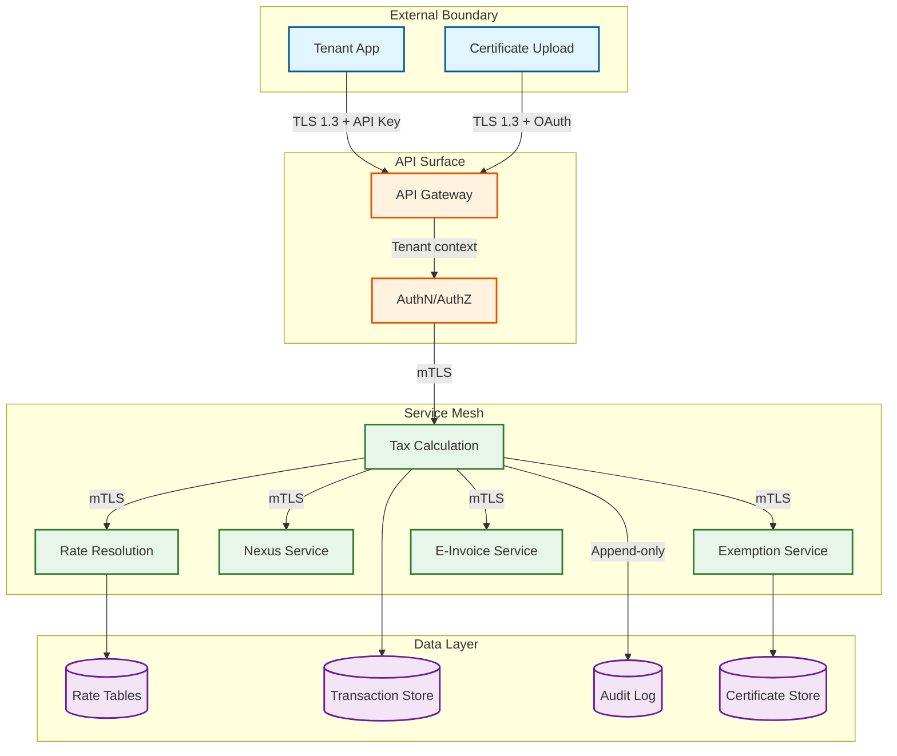

# Security & Compliance

## 1. Threat Model

### STRIDE Analysis

| Category | Attack | Severity |
|---|---|---|
| **Spoofing** | Attacker impersonates tenant to submit calculations with manipulated nexus data | Critical |
| **Tampering** | Modification of rate tables or jurisdiction mappings producing silent miscalculation | Critical |
| **Repudiation** | Tenant disputes a determination; engine cannot reproduce the original result | High |
| **Information Disclosure** | Exfiltration of addresses, registration numbers, and revenue figures | High |
| **Denial of Service** | Volumetric attack on calculation API during quarter-end filing peaks | High |
| **Elevation of Privilege** | API integrator escalates to tax admin; modifies rate tables cross-tenant | Critical |

### Key Attack Vectors

```
Rate Manipulation:     Write access to rate tables → transactions processed at wrong rates
Exemption Fraud:       Forged/expired certificates uploaded to bypass tax collection
Jurisdiction Spoofing: Manipulated ship-to addresses route through lower-tax jurisdictions
Data Exfiltration:     Bulk export via reporting APIs or address validation cache leaks
```

### Trust Boundaries



---

## 2. Authentication and Authorization

### Tenant Authentication

```
API Key (machine-to-machine):
  - Key per tenant per environment (sandbox, production)
  - Stored as HMAC-SHA256 hash; plaintext shown once
  - Request signing: HMAC-SHA256(timestamp + body, secret); reject > 5 min drift
  - 90-day rotation with 7-day overlap window

OAuth 2.0 (interactive):
  - Client credentials for server-to-server; auth code + PKCE for dashboard
  - JWT access token (15-min TTL), opaque refresh token (24-hour TTL)
  - Claims: sub=tenant_id, roles, scopes, tenant_context{tenant_id, nexus_states}
```

### Role-Based Access Control

| Role | Calculate | Rates | Exemptions | Transactions | Nexus | Audit | Config |
|---|---|---|---|---|---|---|---|
| **API Integrator** | Yes | Read | -- | Own only | -- | -- | -- |
| **Tax Analyst** | Yes | Read | View, Validate | All (own tenant) | View | Read | -- |
| **Tax Admin** | Yes | Full | Full CRUD | All (own tenant) | Full | Read | Yes |
| **Auditor** | -- | Read | Read | Read-only all | Read | Full | Read |

### Multi-Tenant Isolation

```
FUNCTION enforce_tenant_isolation(request, data_entity):
    request_tenant = request.headers["X-Tenant-Context"]
    IF data_entity.tenant_id != request_tenant:
        LOG_SECURITY_EVENT("CROSS_TENANT_ACCESS_ATTEMPT",
            requesting_tenant=request_tenant, target=data_entity.tenant_id)
        RETURN DENIED
    RETURN ALLOWED

Enforcement layers:
  - API Gateway injects X-Tenant-Context from authenticated token
  - Query middleware appends tenant_id to all database queries (raw queries prohibited)
  - Rate table cache partitioned by tenant_id — no shared cache entries
  - Background jobs tagged and isolated by tenant_id
```

### Service-to-Service Auth (mTLS)

```
  - Each service holds unique X.509 cert from internal CA (CN: service.tax-engine.internal)
  - 30-day automated rotation; CRL checked on every connection
  - Service-level permissions enforced: rate-service reads rate-db only,
    calculation-service reads rates + writes transactions, etc.
```

---

## 3. Data Protection

### Encryption

```
At rest (AES-256-GCM):
  - Envelope encryption: per-partition DEK rotated monthly, KEK in KMS rotated quarterly
  - Field-level encryption: addresses, tax IDs (EIN, VAT, GSTIN), bank details

In transit (TLS 1.3):
  - Client-to-gateway: TLS 1.3 mandatory; 1.2 accepted; 1.1 rejected
  - Service-to-service: mTLS; event bus: per-message envelope encryption
```

### Tokenization of Tax Identifiers

```
FUNCTION tokenize(tenant_id, field_type, value):
    existing = LOOKUP(tenant_id, field_type, HMAC(value))
    IF existing: RETURN existing.token
    token = GENERATE_FORMAT_PRESERVING_TOKEN(field_type)
    STORE(tenant_id, token, ENCRYPT(value), field_type)
    RETURN token

Tokenized: EIN → tok_ein_*, VAT → tok_vat_*, GSTIN → tok_gst_*, CPF/CNPJ → tok_br_*
Token vault: separate hardened service; detokenize requires explicit permission + audit entry
Same value in different tenants → different tokens (no cross-tenant correlation)
```

### Data Masking (Non-Production)

```
Tax IDs → synthetic valid-format identifiers; addresses → randomized per jurisdiction
Amounts → scaled ±15%; names → anonymized; certificates → synthetic test documents
Production data NEVER cloned without masking pipeline. Masked sets versioned.
```

---

## 4. Tax-Specific Compliance

### SOC 2 Type II

```
Security:     Annual pen-test + continuous scanning; critical CVEs patched within 72 hrs
Availability: 99.95% SLA; multi-region failover; DR tested quarterly (RTO < 4h, RPO < 1h)
Integrity:    Deterministic replay verification; shadow-mode rate validation; daily reconciliation
Privacy:      PII per GDPR/CCPA; automated retention; privacy impact assessment for new PII
```

### Data Retention by Jurisdiction

```
US (IRS): 7 years | EU (VAT): 10 years | UK (HMRC): 6 years | India (GST): 8 years
Brazil (NF-e): 5 years | Saudi (ZATCA): 6 years | Canada (CRA): 6 years | Australia: 5 years

Tiering: Hot (current FY+1) → Warm (2-5 yr) → Cold (5+ yr) → Purge after expiry
```

### Data Sovereignty

```
Tax data must remain in the jurisdiction it relates to.
  - Regional deployment: calculation nodes per tax region
  - Routing: transaction routed by jurisdiction to appropriate region
  - EU data → EU storage; India GST → India storage; Brazil NF-e → Brazil storage
  - Cross-border: only aggregated, anonymized metrics
```

### Right to Deletion vs Tax Retention

```
FUNCTION handle_deletion_request(data_subject, tenant_id):
    FOR txn IN FIND_TRANSACTIONS(data_subject, tenant_id):
        IF txn.retention_expiry > NOW():
            ANONYMIZE_PII(txn)  // name→REDACTED, address→hashed, tax_id→tokenized
            RETAIN financial records (amounts, rates, jurisdiction, dates)
            SCHEDULE_FULL_PURGE(txn.id, txn.retention_expiry)
        ELSE:
            FULL_PURGE(txn)
        LOG_AUDIT("GDPR_DELETION", data_subject, txn.id)

Legal basis: GDPR Art. 17(3)(b) — exemption for legal obligations
```

---

## 5. E-Invoicing Security

### Digital Signature Fundamentals

```
1. Construct canonical invoice (structured XML/JSON)
2. Hash payload (SHA-256)
3. Sign with sender's private key (RSA-2048 or ECDSA P-256)
4. Attach signature + certificate; recipient/authority verifies against CA chain
```

### India GST IRP

```
IRN = SHA-256(supplier_gstin + fiscal_year + doc_type + doc_number)
Submit signed JSON → IRP validates + counter-signs → returns IRN + signed QR
QR contains: GSTINs, invoice number/date/value, HSN code, IRN, digital signature
Certificate bound to GSTIN; IRP access via OAuth 2.0 client credentials
```

### EU ViDA (Peppol)

```
Format: UBL 2.1 XML; Signature: XAdES-BES with eIDAS qualified certificate
Peppol 4-corner model: Sender → AP → SMP → Receiver AP → Receiver
B2G requires Qualified Electronic Signature (QES); B2B accepts Advanced (AES)
ViDA mandate: invoice hash registered with tax authority for real-time reporting
```

### Brazil NF-e

```
XML per SEFAZ schema v4.0; signed with ICP-Brasil A1 (software) or A3 (hardware token)
Flow: Issuer → State SEFAZ → National SEFAZ → Distribution
SEFAZ validates: schema, signature chain, business rules, duplicate check
Returns authorization protocol + signed XML; DANFE includes QR with access key
```

### Saudi ZATCA

```
UBL 2.1 XML; hash signed with ZATCA-issued CSID (Cryptographic Stamp Identifier)
Clearance model (B2B): submit → ZATCA validates → returns clearance + UUID
QR (TLV): seller name, VAT number, timestamp, total, VAT amount, hash, ECDSA sig, pubkey
Production CSID issued after compliance testing; cleared invoices immutable
```

### Certificate Management

```
Registry tracks: jurisdiction, CA, expiry, bound entity, cert type (signing/TLS)
Renewal alert at 60 days; auto-disable submission at expiry
Private keys in HSM/key vault — never exported, logged, or transmitted
Compromised cert: immediate revocation, flag invoices signed post-compromise for re-issuance
```

---

## 6. Exemption Certificate Security

### Validation and Fraud Detection

```
FUNCTION evaluate_certificate_fraud_risk(cert):
    risk = 0
    IF DETECT_DIGITAL_ALTERATION(cert.document):       risk += 50  // tampering
    IF NOT MATCHES_STATE_FORMAT(cert.number, cert.state): risk += 40  // format mismatch
    IF cert.holder_tax_id NOT IN KNOWN_ENTITIES(cert.tenant): risk += 25
    IF cert.expiry_date < NOW():                        risk += 35  // expired
    IF cert.effective_date > NOW():                     risk += 30  // future-dated

    RETURN risk < 20 ? "AUTO_APPROVE" : risk < 50 ? "MANUAL_REVIEW" : "REJECT"

Pipeline: OCR extraction → state registry cross-reference → fraud scoring → decision
```

### Storage and Access Control

```
Documents: encrypted object storage, accessed via pre-signed URLs (10-min TTL)
Metadata: indexed in relational DB (number, state, expiry, entity, status)
Access: upload (admin, analyst); view (admin, analyst, auditor); approve/revoke (admin only)
API integrators reference certificate IDs in calculations but CANNOT view documents

Cross-entity sharing: parent cert covers subsidiaries via explicit admin config
Revocation cascades to all shared references; each shared usage logged independently
```

---

## 7. Audit and Compliance

### Immutable Audit Log

```
Schema: event_id, event_type, actor, tenant_id, resource, timestamp,
        before_state, after_state, calculation_context{input_hash, rate_version,
        rule_version, result_hash}, previous_hash, record_hash

Hash chain: record_hash = SHA-256(content + previous_record_hash)
Immutability: INSERT-only DB permissions; triggers reject UPDATE/DELETE
Hourly integrity verification; Merkle root checkpoints in write-once storage
```

### Calculation Reproducibility

```
FUNCTION reproduce_calculation(transaction_id):
    original = LOAD_TRANSACTION(transaction_id)
    audit = LOAD_AUDIT(transaction_id, "TAX_CALCULATED")
    reproduced = CALCULATE_TAX(
        inputs=original.input_payload,
        rate_version=audit.calculation_context.rate_version,
        rule_version=audit.calculation_context.rule_version)
    ASSERT SHA256(reproduced) == audit.calculation_context.result_hash

Rate tables versioned and immutable once published; old versions never overwritten.
Quarterly reproducibility test: 1,000 random transactions replayed and verified.
```

### Change Management

```
Rate change workflow:
  1. Analyst proposes: jurisdiction, old/new rate, effective date, legislative reference
  2. System validates: no duplicate, future effective date, rate within plausible range
  3. Admin approves (dual approval if change affects > 1,000 txns/day)
  4. Shadow deployment: 24-hour parallel run comparing production vs new rate
  5. Production promotion: version incremented, cache invalidated, audit entry written
     with before/after state, approver ID, justification, supporting documentation
```

---

## 8. Incident Response

### Tax Miscalculation Response

```
Severity: P1 (>10K txns or >$100K impact) | P2 (1K-10K / $10K-$100K) | P3 (<1K / <$10K)

Phase 1 — Containment (30 min P1):
  Identify root cause → deploy emergency correction or circuit-break jurisdiction

Phase 2 — Impact Assessment (4 hrs P1):
  Query affected transactions, calculate tax delta, identify affected tenants

Phase 3 — Remediation (24 hrs P1):
  FUNCTION remediate(jurisdiction, time_range, correct_rate):
      FOR txn IN QUERY_TRANSACTIONS(jurisdiction, time_range):
          delta = RECALCULATE(txn.inputs, correct_rate) - txn.calculated_tax
          IF ABS(delta) > 0.01:
              CREATE_ADJUSTMENT(txn.id, delta, reason="Rate correction", incident_id)
              NOTIFY_TENANT(txn.tenant_id, adjustment_details)

Phase 4 — Post-Incident (5 days): RCA, timeline, process improvements, test coverage
```

### Breach Notification

```
Timelines: GDPR 72 hrs to authority | CCPA 30 days | India DPDP 72 hrs | Brazil LGPD reasonable

Procedure:
  1. Containment: isolate systems, revoke credentials
  2. Forensics: determine scope (tenants, data fields)
  3. Notify: internal (4 hrs), tenants (24 hrs), regulators (per jurisdiction)
  4. Tenant notice includes: breach date, data categories affected, record count,
     containment measures, recommended actions, security team contact
  5. Post-breach report filed within 30 days
```
