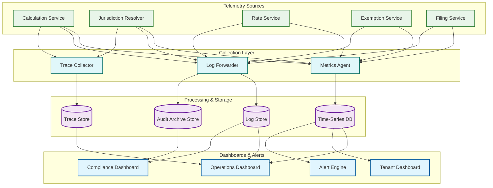

# Observability

## Observability Strategy

A tax calculation engine demands observability across three domains: **computational correctness** (every tax amount must reflect the correct jurisdiction, rate, exemption, and taxability rules at the exact point in time of the transaction), **operational performance** (calculations must return within strict latency budgets since they sit in the critical path of checkout flows), and **regulatory compliance** (every rate applied, exemption granted, and jurisdiction resolved must be reconstructable for audits spanning 7+ years). Standard RED/USE metrics are insufficient---the system must expose business-level signals mapping to filing accuracy, nexus compliance, and rate currency.

---

## 1. Key Metrics

### Business Metrics

| Metric | Type | Description | Alert Threshold |
|--------|------|-------------|-----------------|
| `tax.calculations_per_second` | Counter (by tenant, jurisdiction, tax_type) | Tax computations completed per second, segmented by tenant ID, jurisdiction code, and tax type (sales, VAT, GST, excise) | Deviation > 60% from same-hour baseline |
| `tax.accuracy_rate` | Gauge | Percentage of calculations where jurisdiction resolution, rate selection, and taxability determination are all correct (validated via shadow audit pipeline) | < 99.95% |
| `tax.exemption_application_rate` | Gauge (by exemption_type) | Percentage of line items where an exemption certificate was matched and applied | Monitor for sudden drops > 20% (indicates certificate ingestion failure) |
| `tax.nexus_threshold_proximity` | Gauge (by tenant, state) | Distance to nexus threshold as percentage (e.g., 85% of economic nexus threshold reached) | > 80% proximity triggers advisory alert |
| `tax.rate_change_deployment_lag` | Gauge (by jurisdiction) | Time elapsed from legislative effective date to production deployment of new rate | > 24 hours |
| `tax.filing_success_rate` | Gauge (by jurisdiction, filing_period) | Percentage of tax returns filed successfully without rejection | < 99% |
| `tax.rate_disputes_opened` | Counter | Customer-initiated disputes on tax amounts per day | > 2x trailing 30-day average |
| `tax.jurisdiction_resolution_success` | Gauge | Percentage of address inputs that resolve to a valid jurisdiction chain | < 99.5% |

### Infrastructure Metrics

| Metric | Type | Description | Alert Threshold |
|--------|------|-------------|-----------------|
| `calc.latency_p50` | Histogram (by line_item_bucket) | Median calculation latency bucketed by line-item count (1, 2-10, 11-50, 51-200, 200+) | p50 > 15ms for single-item |
| `calc.latency_p95` | Histogram (by line_item_bucket) | 95th percentile calculation latency | p95 > 50ms |
| `calc.latency_p99` | Histogram (by line_item_bucket) | 99th percentile calculation latency | p99 > 100ms |
| `cache.hit_rate.jurisdiction` | Gauge | Hit rate for jurisdiction resolution cache | < 90% |
| `cache.hit_rate.rate` | Gauge | Hit rate for tax rate lookup cache | < 85% |
| `cache.hit_rate.taxability` | Gauge | Hit rate for product taxability matrix cache | < 80% |
| `cache.hit_rate.exemption` | Gauge | Hit rate for exemption certificate cache | < 75% |
| `rate_table.age_seconds` | Gauge (by jurisdiction) | Seconds since the in-memory rate table was last refreshed | > 3600 (1 hour) |
| `api.error_rate` | Counter (by error_type, endpoint) | API errors segmented by type (validation, timeout, internal, rate_limit) | Total error rate > 0.1% |
| `worker.pool_utilization` | Gauge (by pool_name) | Active workers / total workers in calculation thread pool | > 85% sustained 5 min |
| `db.rate_lookup_latency_p99` | Histogram | 99th percentile latency for rate table database queries | > 10ms |
| `db.connection_pool.utilization` | Gauge (per service) | Active connections / pool size | > 80% |
| `queue.depth.rate_update` | Gauge | Pending rate update events awaiting processing | > 500 |
| `queue.depth.filing` | Gauge | Pending filing jobs in queue | > 100 |

---

## 2. Logging Strategy

### Structured Log Schema

```
{
    "timestamp": "2026-03-09T14:22:08.342Z",
    "level": "INFO|WARN|ERROR",
    "service": "tax-calculation-service",
    "trace_id": "tr_7f3a9b2c1d4e5f6a",
    "span_id": "sp_a1b2c3d4",
    "transaction_id": "txn_20260309_abc123",
    "tenant_id": "tenant_shopify_na",
    "event": "tax.calculation.complete",
    "jurisdiction_chain": ["US", "US-CA", "US-CA-LA"],
    "tax_type": "sales_tax",
    "line_item_count": 3,
    "rates_applied": [
        {"jurisdiction": "US-CA", "rate": 0.0725, "type": "state"},
        {"jurisdiction": "US-CA-LA", "rate": 0.0250, "type": "county"}
    ],
    "exemptions_matched": ["exempt_cert_12345"],
    "total_tax_amount": 14.63,
    "total_taxable_amount": 150.00,
    "calculation_duration_ms": 8,
    "rate_table_version": "v2026.03.08.001",
    "cache_hits": {"jurisdiction": true, "rate": true, "taxability": false, "exemption": true}
}
```

### What to Log vs What NOT to Log

```
ALWAYS LOG:
  Transaction ID, tenant ID, jurisdiction chain (codes only, e.g. "US-CA-LA"),
  rates applied with jurisdiction attribution, exemption cert IDs matched,
  total tax/taxable/exempt amounts, calculation duration ms, rate table version,
  cache hit/miss per layer, product tax code (PTC)

NEVER LOG:
  Customer names/emails/phone, full street addresses, payment instruments,
  SSN/TIN, certificate images/documents, raw IP addresses, full invoice content
```

### Log Levels by Component

| Component | INFO | WARN | ERROR |
|-----------|------|------|-------|
| **Address Validation** | Validation complete, jurisdiction chain resolved, confidence score | Ambiguous address (multiple jurisdiction matches), low-confidence resolution | Address unresolvable, geocoding service unavailable, invalid country code |
| **Jurisdiction Resolution** | Jurisdiction chain determined, boundary version used | Boundary overlap detected, fallback to postal-code resolution | Resolution failure, boundary data missing for region, stale boundary data |
| **Rate Lookup** | Rate retrieved, rate version, effective date range | Rate approaching expiry, multiple candidate rates for jurisdiction | Rate not found for jurisdiction, rate table load failure, corrupt rate data |
| **Taxability Engine** | Product tax code evaluated, taxability matrix result | Unknown product tax code (defaulting to taxable), deprecated PTC used | Taxability matrix unavailable, conflicting taxability rules |
| **Exemption Processor** | Certificate matched, exemption applied, partial exemption calculated | Certificate approaching expiration (< 30 days), certificate validation warning | Certificate validation failure, certificate store unavailable, expired cert used |
| **Computation Engine** | Calculation complete, line-item breakdown, rounding applied | Rounding discrepancy > 0.01, negative tax computed (review required) | Computation overflow, division by zero in tiered rate, inconsistent totals |
| **Filing Service** | Return generated, filing submitted, acknowledgment received | Filing deadline approaching (< 72h), filing retry scheduled | Filing rejected by authority, submission timeout, schema validation failure |
| **Rate Update Pipeline** | Rate update ingested, validation passed, deployed to production | Rate effective date in past (retroactive), conflicting rate for jurisdiction | Rate update ingestion failure, validation failure, deployment rollback |

### Log Retention Policy

```
Hot  (0-90 days):   Full structured logs, full-text searchable, log aggregation cluster
Warm (90d-2 years): Compressed, indexed by transaction_id + tenant_id, columnar store
Cold (2-7+ years):  Immutable append-only object storage with legal-hold capability
                    Statute-of-limitations varies by jurisdiction (some require 10+ years)
                    Retrieval SLA: < 4 hours for specific transaction lookup

Audit-critical events (rate changes, exemption grants, filing submissions):
  Replicated to dedicated audit store with tamper-evident checksums; never deleted
```

---

## 3. Distributed Tracing

### Calculation Pipeline Trace

```
Trace: tax_calculation (txn_20260309_abc123)
  ┌─ [gateway] POST /v2/tax/calculate                      total: 42ms
  │  ├─ [auth] validate_api_key + tenant_resolution                3ms
  │  ├─ [validator] validate_request_schema                        2ms
  │  ├─ [address-service] validate_and_normalize_address          8ms
  │  │  ├─ [geocoder] geocode_address                             5ms
  │  │  └─ [normalizer] standardize_address_components            2ms
  │  ├─ [jurisdiction-resolver] resolve_jurisdiction_chain         6ms
  │  │  ├─ [boundary-engine] point_in_polygon_lookup              3ms
  │  │  └─ [hierarchy-builder] construct_jurisdiction_chain        2ms
  │  ├─ [rate-service] lookup_rates (per jurisdiction in chain)   5ms
  │  │  ├─ [cache] check_rate_cache                               1ms
  │  │  └─ [rate-store] fetch_effective_rate                      3ms
  │  ├─ [taxability-engine] determine_taxability                  4ms
  │  │  ├─ [ptc-resolver] resolve_product_tax_code                1ms
  │  │  └─ [matrix-engine] evaluate_taxability_matrix             2ms
  │  ├─ [exemption-service] check_exemptions                     5ms
  │  │  ├─ [cert-cache] lookup_active_certificates                2ms
  │  │  ├─ [cert-validator] validate_certificate_scope            2ms
  │  │  └─ [exemption-calculator] compute_exempt_amount           1ms
  │  ├─ [computation-engine] calculate_tax                        4ms
  │  │  ├─ [rate-applicator] apply_rates_to_line_items            2ms
  │  │  ├─ [rounding-engine] apply_jurisdiction_rounding_rules    1ms
  │  │  └─ [aggregator] sum_line_item_taxes                       1ms
  │  ├─ [audit-logger] persist_calculation_record (async)         1ms
  │  └─ [gateway] serialize_response                              2ms
```

### Cross-Service Trace Propagation

```
Headers: X-Trace-ID, X-Span-ID, X-Parent-Span-ID, X-Tenant-ID, X-Transaction-ID

Rules:
  - Internal RPCs: propagate full trace context
  - Async events (rate updates, filing jobs): carry context in message headers
  - External calls (geocoding, filing APIs): create child spans but do NOT
    propagate internal headers externally
  - Batch calculations: parent span per batch, child spans per line-item group
```

### Trace Sampling Strategy

| Flow | Sampling Rate | Rationale |
|------|---------------|-----------|
| Calculation (success, < p95 latency) | 10% | High volume, routine path |
| Calculation (success, > p95 latency) | 100% | Latency outliers must be diagnosable |
| Calculation (any error) | 100% | Every error requires root cause analysis |
| Jurisdiction resolution failure | 100% | Accuracy-critical; potential compliance impact |
| Exemption applied | 50% | Higher than baseline; exemption logic is audit-sensitive |
| Rate update pipeline | 100% | Every rate change must be fully traceable |
| Filing submission | 100% | Regulatory interaction; full traceability required |
| High-volume tenant (> 1K TPS) | 1% | Avoid storage explosion; increase on-demand for debugging |
| Batch calculation (> 200 line items) | 100% | Complex calculations prone to edge cases |

---

## 4. Alerting Framework

### Critical Alerts (Page Immediately)

| Alert | Condition | Action |
|-------|-----------|--------|
| `CalculationErrorRateHigh` | API error rate > 0.1% sustained for 5 min | Page on-call; check rate table integrity and service health; activate circuit breaker if cascading |
| `CalculationLatencyBreach` | p99 latency > 100ms sustained for 3 min | Page on-call; check worker pool saturation, cache health, database latency |
| `RateTableStale` | Any active jurisdiction rate table age > 24 hours | Page tax-content-on-call; verify rate update pipeline; check for stuck deployments |
| `JurisdictionResolutionFailure` | Resolution failure rate > 0.5% sustained for 5 min | Page on-call; check boundary data integrity and geocoding service health |
| `NexusThresholdBreached` | Tenant crosses economic nexus threshold in any state | Page tax-compliance-on-call; tenant must register for tax collection; filing obligations begin |
| `AuditLogWriteFailure` | Any audit log write fails | Page on-call immediately; halt calculations if audit logging cannot be restored within 5 min (compliance requirement) |
| `FilingRejected` | Tax return rejected by filing authority | Page tax-ops; investigate rejection codes; correct and refile before deadline |
| `RateConflictDetected` | Conflicting rates loaded for same jurisdiction and date range | Page tax-content-on-call; resolve conflict before next calculation uses disputed rate |

### Warning Alerts (Notify On-Call)

| Alert | Condition | Action |
|-------|-----------|--------|
| `CacheHitRateDegraded` | Any cache hit rate drops below 85% sustained for 15 min | Investigate cache eviction patterns; check for rate table churn or new jurisdiction patterns |
| `RateChangePendingDeployment` | Legislative rate change pending deployment > 48 hours | Escalate to tax content team; prioritize rate update validation and deployment |
| `ExemptionCertificateBulkExpiry` | > 50 certificates for a tenant expiring within 30 days | Notify tenant; trigger certificate renewal workflow |
| `FilingDeadlineApproaching` | Filing deadline < 72 hours with incomplete or unsubmitted returns | Notify tax-ops team; prioritize return generation and review |
| `WorkerPoolSaturation` | Worker pool utilization > 85% sustained for 10 min | Scale worker pool; investigate traffic spike source |
| `RateTableVersionSkew` | Different calculation nodes serving different rate table versions for > 10 min | Investigate deployment pipeline; force consistency check |
| `CalculationDisparityDetected` | Shadow audit pipeline detects calculation mismatch > 0.01% of transactions | Investigate root cause; possible rate or taxability rule error |
| `DatabaseReplicationLag` | Read replica lag > 5 seconds sustained for 5 min | Check replication health; possible write volume spike |

### Informational Alerts (Review Daily)

| Alert | Condition | Action |
|-------|-----------|--------|
| `NewJurisdictionEncountered` | Jurisdiction not previously seen for tenant | Verify nexus status; may indicate market expansion |
| `ExemptionUsageAnomaly` | Exemption rate deviates > 30% from baseline | Review certificate population; possible data quality issue |
| `RateUpdateVolumeBatch` | > 100 rate updates in single batch | Confirm all validated; monitor for deployment issues |

---

## 5. Dashboards

### Dashboard 1: Real-Time Operations

| Panel | Visualization | Data Source |
|-------|---------------|-------------|
| Calculation Throughput | Line chart (current vs 7-day avg, by tax type) | Calculation service counters |
| Latency Distribution | Heatmap (p50/p75/p90/p95/p99 by line-item bucket) | Service histograms |
| Error Rate by Type | Stacked area chart (validation, timeout, rate_not_found, internal) | API error counters |
| Cache Performance | Multi-line chart (jurisdiction, rate, taxability, exemption hit rates) | Cache metrics |
| Worker Pool Status | Gauge per pool (utilization %) + queue depth sparkline | Worker pool metrics |
| Rate Table Freshness | Table (jurisdiction, last_updated, age, status indicator) | Rate update service |

### Dashboard 2: Tenant Health

| Panel | Visualization | Data Source |
|-------|---------------|-------------|
| Top Tenants by Volume | Horizontal bar (calculations/sec, top 20) | Tenant-partitioned counters |
| Tenant Error Rates | Table (tenant, error_rate, p99_latency, status) | Per-tenant aggregations |
| Tenant Exemption Rates | Stacked bar (exempt vs taxable by tenant) | Exemption service logs |
| Nexus Threshold Map | Geographic heatmap (proximity % by state per tenant) | Nexus monitoring service |
| Tenant SLO Compliance | Scorecard (availability %, latency SLO met %) | SLO tracking system |
| Per-Tenant Cache Efficiency | Multi-line chart (cache hit rate by tenant, top 10 lowest) | Cache metrics |

### Dashboard 3: Tax Content Currency

| Panel | Visualization | Data Source |
|-------|---------------|-------------|
| Rate Table Freshness by Jurisdiction | Heatmap (jurisdiction vs age, color-coded) | Rate update pipeline |
| Pending Rate Changes | Table (jurisdiction, effective_date, status, days_until_effective) | Rate change backlog |
| Rate Update Pipeline Throughput | Line chart (updates ingested, validated, deployed per day) | Pipeline metrics |
| Boundary Data Version | Table (region, boundary version, last updated) | Jurisdiction resolver |
| Legislative Change Backlog | Single stat + trend (pending changes awaiting implementation) | Content management system |
| Rate Change Deployment Lag Distribution | Histogram (hours from effective date to deployment) | Deployment tracking |

### Dashboard 4: Compliance

| Panel | Visualization | Data Source |
|-------|---------------|-------------|
| Filing Status by Jurisdiction | Table (jurisdiction, period, status, deadline, days_remaining) | Filing service |
| Filing Success Rate Trend | Line chart (daily, last 90 days) | Filing outcome logs |
| Nexus Status Overview | Table (tenant, state, threshold_type, current_value, threshold, proximity %) | Nexus tracker |
| Audit Trail Completeness | Gauge (% of transactions with complete audit records) | Audit verification service |
| Exemption Certificate Status | Stacked bar (active, expiring_soon, expired by tenant) | Certificate store |
| Dispute Rate Trend | Line chart (disputes opened/day, last 30 days, by category) | Dispute tracking |

---

## 6. SLI/SLO Monitoring

### SLI Definitions and SLO Targets

| SLI | Measurement | SLO Target | Error Budget (30-day) |
|-----|-------------|------------|----------------------|
| **Calculation Availability** | Successful responses / total requests (excluding client 4xx) | 99.99% | 4.32 minutes downtime |
| **Calculation Latency** | % of requests completing within latency target by tier: single-item < 20ms, batch < 100ms | 99% within target | 1% of requests may exceed target |
| **Calculation Accuracy** | % of calculations producing correct tax amount (validated by shadow audit) | 99.99% | ~3 incorrect calculations per 30K |
| **Rate Table Currency** | % of time all active jurisdiction rate tables are within freshness SLA (< 4 hours of update availability) | 99.9% | 43.2 minutes of staleness allowed |
| **Filing Success** | % of tax returns accepted by filing authority on first submission | 99.5% | 0.5% rejection budget |
| **Audit Trail Completeness** | % of transactions with full audit trail (jurisdiction, rates, exemptions, computation) | 100% | Zero tolerance---any gap triggers critical alert |

### Error Budget and Burn Rate Alerts

```
Calculation Availability (SLO: 99.99%):  Monthly budget = 4.32 min downtime
Calculation Accuracy (SLO: 99.99%):      Monthly budget = ~50 incorrect per 500K/day
Rate Table Currency (SLO: 99.9%):        Monthly budget = 43.2 min staleness
```

| Burn Rate | Window | Severity | Action |
|-----------|--------|----------|--------|
| > 2x | Sustained 1 hour | Warning | Investigate; identify degradation source |
| > 5x | Sustained 30 min | Critical | Page on-call; likely incident in progress |
| > 10x | Any 10-min window | Emergency | Declare incident; engage all responders |
| Budget < 20% remaining | Rolling 30-day | Warning | Restrict deployments; prioritize reliability work |

---

## 7. Audit Observability

### Audit Trail Querying

```
Query dimensions:
  - By transaction_id:          complete calculation record (inputs, rates, exemptions, result)
  - By tenant_id + date_range:  all calculations within a filing period for reconciliation
  - By jurisdiction + date_range: all calculations touching a jurisdiction for authority audits
  - By rate_version:            all calculations using a specific rate table version
  - By exemption_certificate_id: all transactions where a certificate was applied

Each record includes: rate table version, boundary version, taxability matrix version,
exemption certificate state, per-line-item computation breakdown, microsecond timestamp
```

### Point-in-Time Calculation Replay

```
Replay flow:
  1. Auditor submits replay request with transaction_id
  2. System retrieves original request payload from audit store
  3. Reconstructs point-in-time state (rate tables, boundaries,
     taxability matrix, exemption certificates as of transaction timestamp)
  4. Re-executes calculation with reconstructed state
  5. Compares result with original; generates discrepancy report if different

Guarantees: all reference data is versioned and immutable once published;
rate table versions are append-only; replay produces identical results
for identical inputs and state.
```

### Rate Change Impact Analysis

```
When a rate correction is identified:
  1. Impact scope: query all transactions using incorrect rate, segmented
     by tenant/jurisdiction/filing period; quantify over/under-collection
  2. Filing analysis: identify affected filed returns, calculate amended
     return adjustments, generate correction entries per period
  3. Remediation: notify affected tenants, generate amended return drafts,
     track correction status per tenant per jurisdiction
```

---

## Observability Architecture



