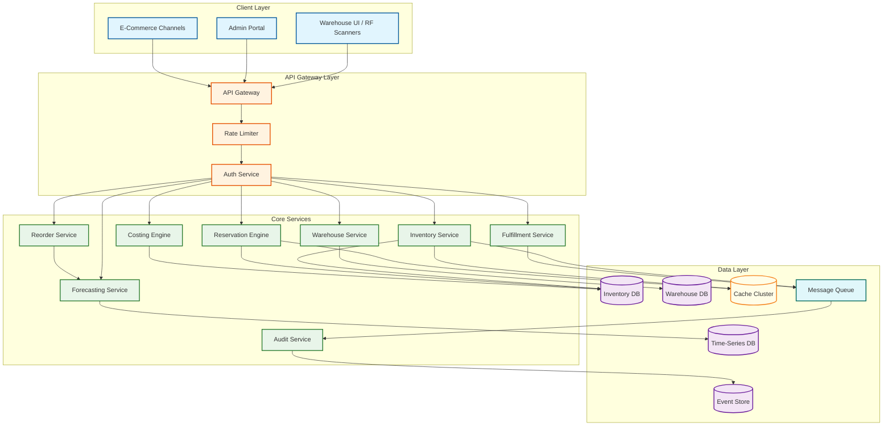

# Inventory Management System Design

## System Overview

An Inventory Management System (IMS) --- often integrated with a Warehouse Management System (WMS) --- is the operational backbone that tracks, controls, and optimizes the flow of physical goods from receiving docks through storage locations to outbound shipping. Modern systems such as Manhattan Associates WMS, Blue Yonder Luminate, and Oracle WMS Cloud handle millions of SKUs across thousands of warehouse locations, processing billions of inventory movements per year at enterprises operating hundreds of distribution centers globally.

The system's core responsibility is maintaining a single source of truth for stock levels --- answering the deceptively simple question "how much do we have, and where is it?" with sub-second accuracy even as thousands of concurrent warehouse operations (receipts, picks, putaways, transfers, adjustments) continuously mutate state. This real-time visibility extends beyond internal warehouse walls into omnichannel commerce through Available-to-Promise (ATP) calculations that aggregate on-hand stock, inbound purchase orders, reserved quantities, and safety stock thresholds to determine what can actually be sold and fulfilled.

Beyond basic counting, the system must enforce inventory costing methods --- FIFO (First-In, First-Out), LIFO (Last-In, First-Out), FEFO (First-Expired, First-Out), weighted average, and standard cost --- ensuring that every unit movement carries the correct financial valuation for accounting and tax compliance. Batch and lot tracking provides full traceability from supplier to customer, critical for regulated industries (pharmaceuticals, food, electronics) where recall management requires identifying every downstream recipient of a specific production batch within minutes. Serial number tracking extends this to individual unit-level provenance.

The warehouse execution layer orchestrates physical workflows: directed putaway that assigns optimal bin locations based on velocity, weight, and product compatibility; wave planning that batches orders into efficient pick sequences; zone-based picking strategies that minimize travel time; pack verification that catches errors before shipping; and cross-docking that routes inbound goods directly to outbound without storage. Cycle counting replaces disruptive wall-to-wall physical inventories with statistical sampling that continuously validates stock accuracy.

At enterprise scale --- 500+ warehouses, 5 million active SKUs, 50 million bin locations, and 500 million daily inventory movements --- the system must handle reservation conflicts where dozens of orders compete for the last units of a popular item, reorder point automation that triggers replenishment before stockouts, and demand forecasting integration that adjusts safety stock levels based on predicted consumption patterns.

---

## Key Characteristics

| Characteristic | Description |
|---------------|-------------|
| **Read/Write Pattern** | Write-heavy for inventory movements (receipts, picks, transfers, adjustments, reservations); read-heavy for availability checks, ATP queries from e-commerce channels, and reporting dashboards |
| **Latency Sensitivity** | High --- ATP queries from storefront must respond in < 50ms; reservation locks must acquire in < 100ms; pick confirmations must persist in < 200ms to avoid warehouse operator idle time |
| **Consistency Model** | Strong consistency for stock levels and reservations (double-selling a unit is unacceptable); eventual consistency for analytics, reporting aggregates, and demand forecasting inputs |
| **Data Volume** | Very High --- 500M+ inventory movements per day; 50M+ bin location records; multi-year transaction history for audit and traceability; time-series data for demand patterns |
| **Architecture Model** | Event-driven microservices with CQRS for separating high-throughput write paths (movements) from high-fanout read paths (ATP); event sourcing for full audit trail of every stock mutation |
| **Regulatory Burden** | High --- SOX compliance for inventory valuation accuracy; FDA 21 CFR Part 11 for pharmaceutical traceability; FSMA for food safety; customs and trade compliance for cross-border movements |
| **Complexity Rating** | **Very High** |

---

## High-Level Architecture



---

## Document Map

| Document | Description |
|----------|-------------|
| [Requirements & Estimations](01-requirements-and-estimations.md) | Functional/non-functional requirements, capacity planning, SLOs for inventory operations |
| [High-Level Design](02-high-level-design.md) | Architecture diagrams, service decomposition, data flow for inbound/outbound/transfer workflows |
| [Low-Level Design](03-low-level-design.md) | Data models, API contracts, reservation algorithms, costing method implementations (pseudocode) |
| [Deep Dive & Bottlenecks](04-deep-dive-and-bottlenecks.md) | ATP calculation at scale, reservation conflict resolution, wave planning optimization, cycle count reconciliation |
| [Scalability & Reliability](05-scalability-and-reliability.md) | Sharding strategies, hot-SKU handling, multi-region warehouse topology, failover patterns |
| [Security & Compliance](06-security-and-compliance.md) | Threat model, SOX audit controls, batch/lot traceability, role-based access, data integrity guarantees |
| [Observability](07-observability.md) | Metrics (stock accuracy, fill rate, cycle count variance), logging, tracing, alerting, SLI/SLO dashboards |
| [Interview Guide](08-interview-guide.md) | 45-min pacing, trade-off discussions, common trap questions, scoring rubric for inventory system design |
| [Insights](09-insights.md) | Key architectural insights, design patterns, and lessons from real-world inventory system implementations |

---

## Core Challenges

| Challenge | Description |
|-----------|-------------|
| **Real-Time Stock Accuracy at Scale** | Maintaining sub-second accuracy across 50M+ bin locations with 500M+ daily mutations requires careful write path optimization, conflict resolution, and cache invalidation strategies. A 0.1% inaccuracy rate means 50,000 incorrect bin records at any moment. |
| **Concurrent Reservation Conflicts** | During flash sales, hundreds of orders may compete for the last units of a popular SKU within milliseconds. The reservation engine must prevent overselling while minimizing failed reservations through techniques like optimistic locking, distributed counters, and reservation queuing. |
| **Multi-Warehouse ATP Calculation** | Available-to-Promise must aggregate on-hand stock, pending receipts, reserved quantities, and safety stock across 500+ warehouses in < 50ms for e-commerce storefronts. This requires pre-computed materialized views, distributed caching, and incremental update propagation. |
| **Costing Method Consistency** | Applying FIFO/LIFO/FEFO costing across concurrent movements without race conditions requires careful transaction isolation. A single mispriced unit cascades through COGS calculations, financial statements, and tax reporting --- potentially triggering SOX compliance violations. |
| **Cycle Count Reconciliation** | When a cycle count reveals a discrepancy between system records and physical count, the system must determine root cause (mis-pick, receiving error, theft, system bug), adjust stock levels, revalue inventory costs, and potentially trigger downstream order re-allocation --- all while warehouse operations continue. |
| **Wave Planning Optimization** | Batching thousands of orders into pick waves that minimize travel distance, balance workload across zones, respect carrier cutoff times, and handle priority orders is an NP-hard combinatorial optimization problem requiring heuristic algorithms that produce near-optimal solutions in seconds. |
| **Demand-Supply Synchronization** | Integrating demand forecasts with reorder point calculations, safety stock levels, and supplier lead times to prevent both stockouts (lost revenue) and overstock (carrying cost) requires continuous recalibration as demand patterns shift seasonally and in response to promotions. |
| **Batch/Lot Traceability Under Recall** | When a product recall is triggered, the system must trace every unit from a specific batch through receiving, storage, transfers, picks, and shipments to identify all affected downstream customers --- often within a regulatory deadline of hours, not days. |

---

## What Differentiates This from Related Systems

| Aspect | Inventory/WMS (This) | ERP Inventory Module | E-Commerce Platform | Supply Chain Management | Point of Sale |
|--------|----------------------|---------------------|---------------------|------------------------|---------------|
| **Primary Focus** | Physical stock accuracy, warehouse execution, and unit-level movement tracking | Financial inventory valuation integrated with GL, procurement, and manufacturing | Product catalog and order management with basic stock counters | End-to-end supply chain visibility from supplier to last mile | Real-time POS stock deduction and store replenishment |
| **Granularity** | Bin-level, lot-level, serial-level tracking with directed putaway and pick paths | Item-level or warehouse-level aggregates; limited sub-warehouse visibility | SKU-level availability counts; no physical location awareness | Shipment-level and container-level; aggregate inventory positions | Store-level or register-level; limited backroom tracking |
| **Execution Layer** | Full warehouse execution: wave planning, pick routing, pack verification, cross-dock orchestration | No warehouse execution; relies on separate WMS integration | No physical execution; delegates to fulfillment partners or WMS | Transportation and logistics execution; not warehouse-internal operations | In-store operations only; no distribution center management |
| **Costing Depth** | Full costing engine: FIFO, LIFO, FEFO, weighted average, standard cost with movement-level valuation | Integrated with financial module; costing tied to accounting periods | Minimal costing; focused on retail pricing and margin | Landed cost calculation including freight, duties, and customs | Retail price management; limited cost-of-goods visibility |
| **Consistency Model** | Strong consistency for stock mutations; eventual for analytics | Batch-oriented; periodic sync between modules | Eventual consistency acceptable; overselling handled by backorder | Eventual consistency across supply chain partners | Strong consistency at register level; async to central |

---

## What Makes This System Unique

1. **The "Last Unit" Problem Is Fundamentally Different from General Concurrency**: Unlike most distributed systems where concurrent writes to the same key can be resolved through CRDTs or last-writer-wins, inventory reservations are a zero-sum game --- once a unit is committed, it is physically gone. Overselling creates real-world consequences (customer disappointment, expedited shipping costs, brand damage) that cannot be resolved through eventual consistency. This makes the reservation engine the most latency-sensitive, consistency-critical component in the system.

2. **Physical Reality Constrains System Design**: Unlike purely digital systems, inventory management must account for the fact that physical goods have weight, volume, expiration dates, hazmat classifications, and temperature requirements. A bin assignment algorithm cannot place heavy items on high shelves, flammable goods next to oxidizers, or frozen food in ambient zones. This physical constraint layer has no equivalent in typical software systems.

3. **Costing Is a Hidden Complexity Multiplier**: What appears to be a simple "track quantities" problem becomes dramatically more complex when every unit movement must carry a financial valuation. Under FIFO costing, the cost assigned to a picked unit depends on the order in which previous units were received --- meaning the costing engine must maintain a time-ordered queue of receipt costs per SKU per warehouse, and a pick from the "wrong" position in the queue creates accounting errors that cascade through financial statements.

4. **Cycle Counting Creates a "Split-Brain" Window**: During a cycle count, the system must simultaneously maintain the book quantity (system record), the count quantity (physical observation), and any in-flight movements that occurred between the count snapshot and the reconciliation decision. This creates a temporal consistency challenge where the "truth" depends on the observation timestamp.

5. **ATP Is a Distributed Aggregation Problem with Freshness Guarantees**: Computing Available-to-Promise across hundreds of warehouses with sub-50ms latency requires pre-computed snapshots that are incrementally updated as inventory events flow in. The challenge is maintaining freshness --- an ATP response that is 30 seconds stale could promise units that have already been reserved, while requiring real-time accuracy at every query would collapse the read path under load.

6. **Wave Planning Bridges Software Optimization and Physical Labor**: Unlike purely algorithmic optimization problems, wave planning must account for human factors --- worker fatigue, shift changes, equipment availability, dock door scheduling, and the physical layout of aisles. An algorithmically optimal pick sequence that requires a worker to traverse the entire warehouse for a single order is practically inferior to a suboptimal sequence that clusters picks in adjacent aisles.

---

## Key Trade-Offs in Inventory System Design

| Trade-Off | Option A | Option B | This System's Choice |
|-----------|----------|----------|---------------------|
| **ATP Freshness vs Query Latency** | Real-time ATP from transactional DB (always fresh, high latency, DB load) | Pre-computed ATP cache with async updates (sub-50ms, slight staleness) | Pre-computed cache with event-driven incremental updates; staleness bounded to < 500ms via change-data-capture from movement events |
| **Reservation Model: Optimistic vs Pessimistic** | Pessimistic locking (hold lock during checkout, guaranteed allocation, reduces throughput) | Optimistic locking with retry (higher throughput, occasional reservation failures) | Optimistic for soft reservations with CAS-based retry; pessimistic for hard reservation commit to prevent oversell at the final step |
| **Costing: Real-Time vs Batch** | Real-time costing on every movement (accurate, adds latency to write path) | Batch costing at period-end (fast writes, delayed cost visibility) | Hybrid: synchronous costing for picks/shipments (COGS must be timely); async costing for internal transfers and adjustments (cost can catch up within minutes) |
| **Event Sourcing Scope** | Full event sourcing for all inventory state (complete audit trail, complex replay) | Traditional CRUD with audit log (simpler, limited reconstruction) | Event sourcing for movement history (primary audit trail); materialized views for current state (query performance); CRUD for master data (SKU, bins) |
| **Bin Assignment: Directed vs Operator Choice** | Fully directed putaway (system assigns bin; consistent, optimal space utilization) | Operator-selected bins (flexible, faster in simple warehouses, lower accuracy) | Directed putaway with operator override: system suggests optimal bin, operator can override with reason code; overrides tracked for process improvement |
| **Cycle Count Approach: Continuous vs Wall-to-Wall** | Continuous cycle counting (ABC-frequency, no operations disruption, statistical coverage) | Annual wall-to-wall physical inventory (complete coverage, operations halt) | Continuous cycle counting as primary method; wall-to-wall reserved for regulatory mandate or major discrepancy investigation |
| **Multi-Warehouse Consistency** | Synchronous cross-warehouse consistency (strong, high latency for cross-DC operations) | Per-warehouse consistency with async cross-DC sync (fast local ops, eventual global view) | Per-warehouse strong consistency; cross-warehouse eventual consistency with conflict detection for transfer orders and global ATP aggregation |

---

## Inventory Movement Lifecycle (Simplified)

```mermaid
sequenceDiagram
    participant PO as Purchase Order
    participant RCV as Receiving Dock
    participant QC as Quality Check
    participant PUT as Putaway
    participant STK as Stock (Bin)
    participant RES as Reservation Engine
    participant PCK as Pick Task
    participant PAK as Pack Station
    participant SHP as Shipping Dock

    PO->>RCV: ASN / Arrival Notification
    RCV->>RCV: Scan & Verify (qty, SKU, lot)
    RCV->>QC: Route to Inspection (if required)
    QC-->>RCV: Pass / Fail / Partial
    RCV->>PUT: Generate Putaway Task
    PUT->>STK: Place in Directed Bin
    Note over STK: Stock available; ATP updated

    RES->>STK: Soft Reserve (cart/checkout)
    STK-->>RES: Reservation Confirmed
    RES->>STK: Hard Reserve (order confirmed)
    STK->>PCK: Generate Pick Task (wave plan)
    PCK->>PCK: Scan Pick Confirmation
    PCK->>PAK: Deliver to Pack Station
    PAK->>PAK: Scan Verify & Pack
    PAK->>SHP: Label & Manifest
    SHP->>SHP: Carrier Handoff
    Note over SHP: Inventory deducted; COGS posted
```

---

## Quick Reference: Scale Numbers

| Metric | Value | Notes |
|--------|-------|-------|
| Active warehouses | ~500 | Distribution centers, fulfillment centers, cross-dock facilities |
| Active SKUs | ~5M | Across all product categories and warehouses |
| Total bin locations | ~50M | Zones, aisles, racks, shelves, bins across all warehouses |
| Daily inventory movements | ~500M | Receipts, picks, putaways, transfers, adjustments combined |
| Peak ATP queries/second | ~200K | E-commerce traffic spikes during promotional events |
| Reservations per second (peak) | ~50K | Flash sale scenarios with high-demand SKUs |
| Cycle counts per day | ~500K | Continuous counting across all warehouses |
| Inbound receipts per day | ~2M | Purchase orders, returns, transfer receipts |
| Outbound shipments per day | ~5M | Individual parcels and pallets shipped |
| Lot/batch records | ~100M | Active lot records across all warehouses |
| Serial numbers tracked | ~500M | Individual unit-level tracking for high-value items |
| Average pick-to-ship time | ~2 hours | From order release to carrier handoff |
| Stock accuracy target | > 99.9% | System record matches physical count |
| Order fulfillment rate | > 99.5% | Orders shipped complete and on time |

---

## Related Designs

| Design | Relevance |
|--------|-----------|
| [9.1 - ERP System Design](../9.1-erp-system-design/) | Inventory module integration, financial posting of inventory transactions, procurement-to-receipt flow |
| [9.2 - Accounting / General Ledger](../9.2-accounting-general-ledger-system/) | Inventory valuation posting, COGS journal entries, period-end inventory reconciliation |
| [9.3 - Tax Calculation Engine](../9.3-tax-calculation-engine/) | Tax implications of inventory movements across jurisdictions, duty and tariff calculations |
| [9.5 - Procurement System](../9.5-procurement-system/) | Purchase order creation triggers inbound receipt expectations; supplier lead time feeds reorder calculations |

---

## Sources

- Manhattan Associates --- Warehouse Management System Architecture and Best Practices
- Blue Yonder (JDA) --- Luminate Platform Supply Chain Planning Documentation
- Oracle --- WMS Cloud Technical Reference and API Documentation
- APICS / ASCM --- Inventory Management Body of Knowledge (CPIM Certification Materials)
- GS1 --- Global Standards for Supply Chain Visibility and Traceability (GTIN, SSCC, EPCIS)
- FDA --- 21 CFR Part 11: Electronic Records; Electronic Signatures
- FDA --- FSMA (Food Safety Modernization Act) Traceability Requirements
- SOX --- Sarbanes-Oxley Act Section 404: Internal Controls Over Financial Reporting (Inventory Valuation)
- IFRS / IAS 2 --- Inventories: Measurement, Costing Methods, and Disclosure Requirements
- Bartholdi & Hackman --- "Warehouse & Distribution Science" (Georgia Tech Supply Chain Research)
