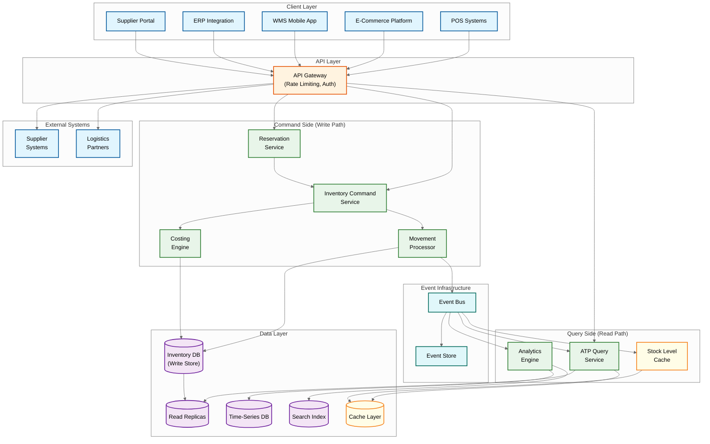
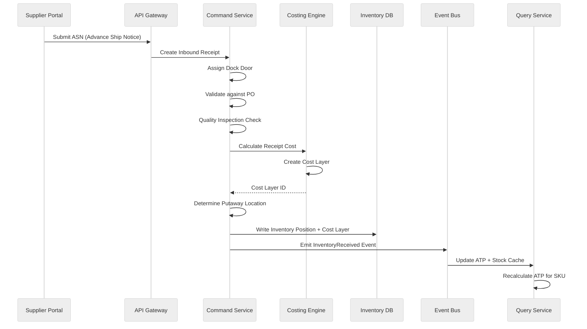
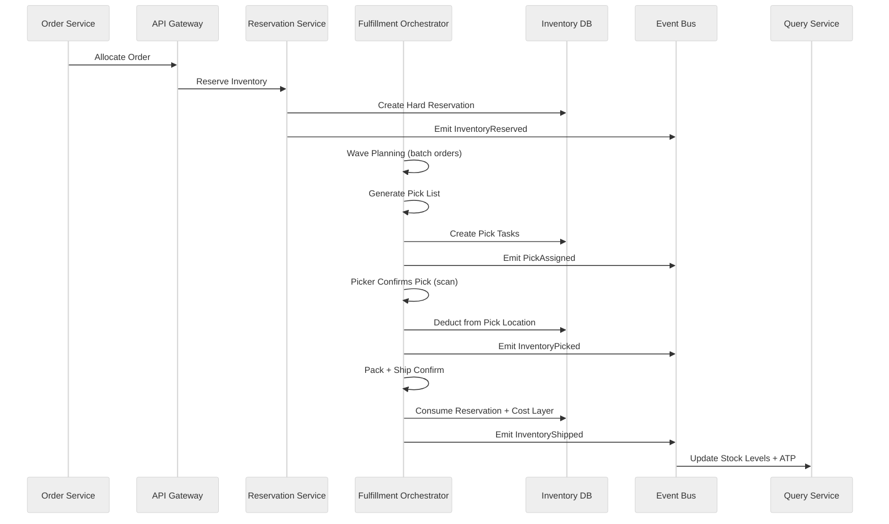

# High-Level Design

## Architecture Overview

An Inventory Management System (IMS) is the backbone of supply chain operations, tracking every unit of stock across warehouses, channels, and stages of fulfillment. The architecture follows an **event-driven microservices** approach with **CQRS** (Command Query Responsibility Segregation) separating inventory writes from reads.

**Why CQRS?** Inventory has a fundamentally asymmetric workload. Reads (checking stock levels, ATP queries, analytics) outnumber writes (receiving, picking, adjustments) by 50-100x. A single e-commerce flash sale can generate millions of stock-check queries per minute while actual inventory mutations remain relatively modest. Splitting the read and write paths lets each scale independently.

**Why Event Sourcing?** Every inventory change is a discrete, auditable event: a receipt, a pick, a transfer, an adjustment. Rather than storing only the current state, we persist the full sequence of movements. This gives us:

- **Complete audit trail** - regulatory compliance and dispute resolution
- **Point-in-time reconstruction** - valuation as of any historical date
- **Derived views** - multiple read models from the same event stream (stock levels, cost layers, analytics)
- **Conflict resolution** - concurrent operations resolved via event ordering

The write side processes commands (ReceiveGoods, ReserveStock, PickItem) that produce domain events. The read side materializes these events into optimized query models: stock-level caches, ATP views, and analytics aggregates.

---

## Architecture Diagram



---

## Core Component Design

### 1. Inventory Command Pipeline

All inventory mutations follow a strict pipeline ensuring consistency and auditability:

1. **Receive Command** - Inbound request (receive goods, adjust stock, transfer) arrives at the Inventory Command Service
2. **Validate** - Business rule checks: does the SKU exist? Is the location valid? Does the operator have permissions? Is the quantity within tolerance?
3. **Apply Costing** - The Costing Engine calculates the cost impact. For receipts, a new cost layer is created. For issues, cost layers are consumed per the configured method (FIFO, LIFO, FEFO, WAC)
4. **Update Stock** - The Movement Processor writes the inventory position change to the write store within a transaction
5. **Emit Event** - A domain event (e.g., `InventoryReceived`, `InventoryPicked`) is published to the Event Bus
6. **Update Read Models** - Downstream consumers materialize the event into read-optimized views: stock caches, ATP calculations, analytics aggregates

The pipeline uses **idempotency keys** on every command to safely handle retries without double-counting stock.

### 2. Reservation Engine

Reservations temporarily hold stock for pending orders, preventing overselling across channels.

- **Soft Reservation** - A tentative hold placed when a customer adds items to their cart. Has a short TTL (typically 10-15 minutes). Does not guarantee fulfillment. Automatically released on expiry.
- **Hard Reservation** - Created at checkout or order confirmation. Guarantees the stock is allocated. Released only by explicit cancellation or fulfillment.
- **Two-Phase Reservation** - Used during checkout flows: (1) Reserve stock with a short TTL, (2) Confirm reservation upon payment success. If payment fails, the reservation auto-expires.
- **TTL-Based Auto-Release** - A background sweeper process runs every 30 seconds, releasing expired soft reservations back to the available pool. This prevents stock from being locked indefinitely by abandoned carts.

### 3. ATP (Available-to-Promise) Engine

ATP answers the question: "How much can I promise to sell right now?" This is the most queried value in the system.

**Core Formula:**

```
ATP = On-Hand Quantity
    - Reserved Quantity
    - Allocated Quantity (committed to picks)
    + Incoming Supply (confirmed POs within planning horizon)
```

The ATP Engine maintains **near-real-time materialized views** updated via event consumption. Each stock movement event triggers a recalculation for the affected SKU-warehouse combination. For high-velocity SKUs, updates are batched at sub-second intervals to avoid thrashing.

**Channel-Specific Allocation** - Business rules can reserve portions of ATP for specific channels. For example, 70% for e-commerce, 20% for wholesale, 10% buffer. This prevents a single channel from consuming all available stock.

### 4. Warehouse Topology Manager

Models the physical layout of each warehouse as a hierarchical structure:

**Hierarchy:** Warehouse > Zone > Aisle > Rack > Level > Bin

**Location Classifications:**
- **Bulk Storage** - Large-volume holding areas, typically for pallets
- **Pick Locations** - Forward-pick areas optimized for piece/case picking
- **Staging Areas** - Temporary holding for inbound receiving or outbound shipping
- **Dock Doors** - Inbound/outbound loading positions
- **Quarantine** - Isolated areas for quality holds or damaged goods

**Velocity Scoring** - Each location receives an A/B/C velocity classification based on pick frequency. High-velocity SKUs are assigned to ergonomically optimal A-locations (waist height, near packing stations). The system periodically re-slots SKUs based on updated velocity data.

### 5. Costing Engine

Supports multiple inventory costing methods, configurable per SKU or product category:

- **FIFO (First In, First Out)** - Consumes the oldest cost layer first. Most common for perishables and general merchandise.
- **LIFO (Last In, First Out)** - Consumes the newest cost layer first. Used in specific tax jurisdictions.
- **FEFO (First Expired, First Out)** - Consumes by earliest expiry date. Mandatory for pharmaceuticals and food.
- **WAC (Weighted Average Cost)** - Recalculates average cost on each receipt. Simpler but loses individual cost traceability.
- **Standard Cost** - Uses a predetermined cost, with variances tracked separately. Common in manufacturing.

**Cost Layers** are immutable records created on each receipt, tracking quantity, unit cost, and remaining quantity. As stock is consumed, layers are depleted in order dictated by the costing method. This enables inventory valuation at any point in time by summing remaining cost layers.

### 6. Fulfillment Orchestrator

Manages the pick-pack-ship workflow from order allocation through shipment:

- **Wave Planning** - Groups orders into waves based on shipping priority, carrier cutoff times, and zone proximity. Optimizes for minimum travel distance across the warehouse.
- **Batch Picking** - Multiple orders picked simultaneously when they share common SKUs or zones. A picker handles 15-30 orders in a single pass.
- **Zone-Based Picking** - Large warehouses split picks by zone. Each picker works a single zone; items are consolidated at a merge station downstream.
- **Pick Confirmation** - Mobile scanning confirms each pick at the bin level. Short-picks trigger reallocation or backorder logic.
- **Packing** - Weight verification, label generation, cartonization (selecting optimal box size).
- **Ship Confirm** - Carrier manifest creation, tracking number assignment, final stock deduction.

---

## Data Flow Patterns

### Inbound Flow (Receiving)



### Outbound Flow (Fulfillment)



### Transfer Flow

Inter-warehouse transfers create **in-transit inventory** that is neither at the source nor destination:

1. Source warehouse creates a transfer-out movement, reducing on-hand stock
2. An in-transit record is created, visible to both warehouses
3. Destination warehouse receives the transfer, creating a transfer-in movement
4. In-transit record is closed; destination on-hand increases
5. Cost layers travel with the inventory, preserving cost traceability

---

## API Design

| Method | Path | Description |
|--------|------|-------------|
| POST | `/v1/inventory/receive` | Record goods receipt against a PO |
| POST | `/v1/inventory/reserve` | Create a soft or hard reservation |
| DELETE | `/v1/inventory/reserve/{id}` | Cancel a reservation |
| POST | `/v1/inventory/pick` | Confirm a pick from a location |
| POST | `/v1/inventory/adjust` | Record a stock adjustment (count, damage) |
| POST | `/v1/inventory/transfer` | Initiate inter-warehouse transfer |
| GET | `/v1/inventory/atp/{sku}` | Get ATP across all warehouses |
| GET | `/v1/inventory/atp/{sku}/{warehouse}` | Get ATP for a specific warehouse |
| GET | `/v1/inventory/position/{sku}` | Get all positions for a SKU |
| GET | `/v1/inventory/movements` | Query movement history with filters |
| GET | `/v1/inventory/valuation` | Get inventory valuation report |
| POST | `/v1/inventory/cycle-count` | Submit cycle count results |
| GET | `/v1/inventory/location/{id}/contents` | Get all SKUs in a location |

---

## Event Catalog

| Event | Trigger | Key Payload Fields |
|-------|---------|-------------------|
| `InventoryReceived` | Goods receipt confirmed | sku_id, warehouse_id, quantity, cost_per_unit, lot_number, po_reference |
| `InventoryReserved` | Reservation created | sku_id, warehouse_id, quantity, reservation_type, channel, order_id, expires_at |
| `ReservationReleased` | Reservation expired or cancelled | reservation_id, sku_id, quantity, release_reason |
| `InventoryAllocated` | Stock committed to a pick wave | sku_id, warehouse_id, quantity, wave_id, pick_location |
| `InventoryPicked` | Picker confirms item picked | sku_id, location_id, quantity, operator_id, pick_task_id |
| `InventoryPacked` | Item packed into shipment | sku_id, shipment_id, carton_id, quantity |
| `InventoryShipped` | Shipment leaves warehouse | shipment_id, carrier, tracking_number, sku_quantities |
| `InventoryAdjusted` | Manual or count-based adjustment | sku_id, location_id, old_qty, new_qty, reason_code, operator_id |
| `InventoryTransferred` | Inter-warehouse transfer initiated | sku_id, from_warehouse, to_warehouse, quantity, in_transit_id |
| `CostLayerCreated` | New cost layer from receipt | sku_id, warehouse_id, quantity, unit_cost, method, po_reference |
| `CostLayerConsumed` | Cost layer depleted by issue | layer_id, quantity_consumed, remaining_quantity, consuming_reference |
| `ReorderTriggered` | Stock falls below reorder point | sku_id, warehouse_id, current_qty, reorder_point, suggested_order_qty |
| `CycleCountCompleted` | Count results submitted | location_id, sku_id, system_qty, counted_qty, variance, operator_id |
| `ATPRecalculated` | ATP value updated | sku_id, warehouse_id, new_atp, previous_atp, trigger_event |
