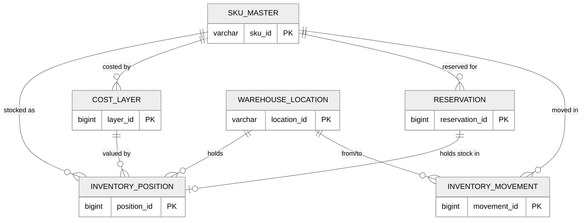
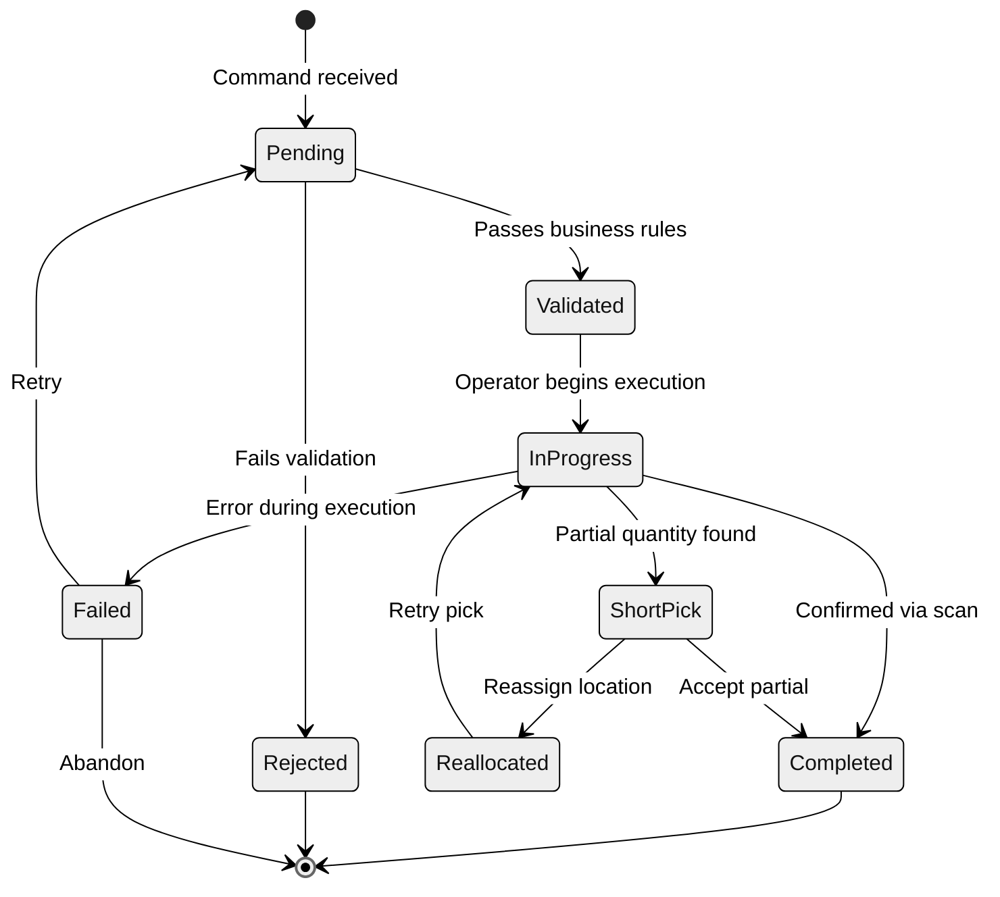
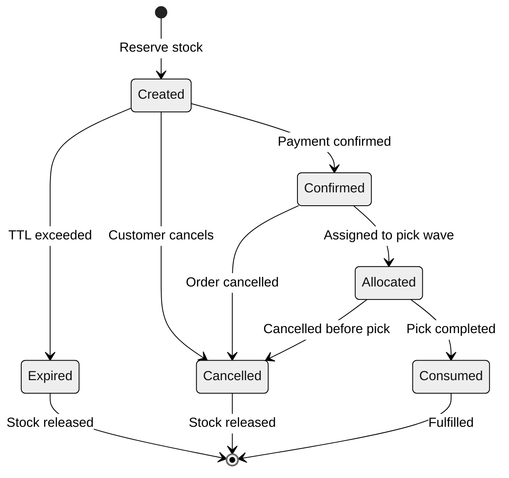

# Low-Level Design

## Data Models

### SKU Master

```
sku_master {
    sku_id              VARCHAR(20)   PK
    name                VARCHAR(255), category_id VARCHAR(20) FK, brand VARCHAR(100)
    unit_of_measure     ENUM('EACH','CASE','PALLET','KG','LITRE')
    units_per_case INT, cases_per_pallet INT
    weight_kg DECIMAL(10,3), length_cm DECIMAL(8,2), width_cm DECIMAL(8,2), height_cm DECIMAL(8,2)
    shelf_life_days     INT                        -- NULL if non-perishable
    storage_temp_min_c  DECIMAL(5,1)               -- NULL if ambient
    storage_temp_max_c  DECIMAL(5,1)
    humidity_min_pct DECIMAL(4,1), humidity_max_pct DECIMAL(4,1)
    hazmat_class        VARCHAR(10)                -- NULL if non-hazardous
    is_serialized BOOLEAN, is_lot_tracked BOOLEAN, is_expiry_tracked BOOLEAN
    costing_method      ENUM('FIFO','LIFO','FEFO','WAC','STANDARD')
    standard_cost       DECIMAL(12,4)              -- used when method = STANDARD
    reorder_point INT, safety_stock INT, lead_time_days INT
    economic_order_qty INT, min_order_qty INT DEFAULT 1, max_order_qty INT
    abc_class           ENUM('A','B','C')
    status              ENUM('ACTIVE','DISCONTINUED','PENDING')
    created_at TIMESTAMP, updated_at TIMESTAMP
}
```

### Warehouse Location

```
warehouse_location {
    location_id         VARCHAR(30)   PK
    warehouse_id        VARCHAR(10)   FK -> warehouse
    zone VARCHAR(10), aisle VARCHAR(5), rack VARCHAR(5), level VARCHAR(3), bin VARCHAR(5)
    location_barcode    VARCHAR(30)   UNIQUE
    location_type       ENUM('BULK','PICK','STAGING_IN','STAGING_OUT',
                             'DOCK','QUARANTINE','RETURNS','CROSSDOCK')
    max_capacity_units INT, max_weight_kg DECIMAL(10,2)
    current_fill_units INT DEFAULT 0, current_weight_kg DECIMAL(10,2) DEFAULT 0
    velocity_class      ENUM('A','B','C')
    pick_sequence       INT                        -- pick path optimization order
    temperature_zone    ENUM('AMBIENT','CHILLED','FROZEN','CONTROLLED')
    is_active BOOLEAN DEFAULT TRUE, is_mixed_sku BOOLEAN DEFAULT TRUE
    last_count_date TIMESTAMP, last_pick_date TIMESTAMP
    created_at TIMESTAMP, updated_at TIMESTAMP
}
```

### Inventory Position

```
inventory_position {
    position_id         BIGINT        PK AUTO_INCREMENT
    sku_id VARCHAR(20) FK, location_id VARCHAR(30) FK, warehouse_id VARCHAR(10) FK
    quantity_on_hand INT DEFAULT 0, quantity_reserved INT DEFAULT 0
    quantity_allocated INT DEFAULT 0, quantity_in_transit INT DEFAULT 0
    lot_number VARCHAR(30), batch_id VARCHAR(30), serial_number VARCHAR(50)
    expiry_date DATE, manufacture_date DATE, received_date TIMESTAMP
    cost_per_unit DECIMAL(12,4), cost_layer_id BIGINT FK
    status              ENUM('AVAILABLE','HELD','DAMAGED','QUARANTINE','IN_TRANSIT','EXPIRED')
    hold_reason VARCHAR(100)
    version             INT DEFAULT 1              -- optimistic lock
    created_at TIMESTAMP, updated_at TIMESTAMP
    CHECK (quantity_on_hand >= 0 AND quantity_reserved <= quantity_on_hand)
    UNIQUE (sku_id, location_id, lot_number, status)
}
```

### Cost Layer

```
cost_layer {
    layer_id            BIGINT        PK AUTO_INCREMENT
    sku_id VARCHAR(20) FK, warehouse_id VARCHAR(10) FK
    original_quantity INT, remaining_quantity INT, unit_cost DECIMAL(12,4)
    total_cost DECIMAL(14,4), currency VARCHAR(3) DEFAULT 'USD'
    received_date TIMESTAMP, expiry_date DATE      -- for FEFO ordering
    costing_method      ENUM('FIFO','LIFO','FEFO','WAC','STANDARD')
    po_reference VARCHAR(30), supplier_id VARCHAR(20)
    is_fully_consumed BOOLEAN DEFAULT FALSE, consumed_at TIMESTAMP
    created_at TIMESTAMP
    CHECK (remaining_quantity >= 0 AND remaining_quantity <= original_quantity)
}
```

### Inventory Movement

```
inventory_movement {
    movement_id         BIGINT        PK AUTO_INCREMENT
    movement_type       ENUM('RECEIVE','PICK','PACK','SHIP','TRANSFER_OUT',
                             'TRANSFER_IN','ADJUST_UP','ADJUST_DOWN',
                             'CYCLE_COUNT','RETURN','SCRAP')
    sku_id VARCHAR(20) FK, warehouse_id VARCHAR(10) FK
    from_location_id VARCHAR(30) FK, to_location_id VARCHAR(30) FK
    quantity INT, lot_number VARCHAR(30), serial_number VARCHAR(50)
    movement_timestamp TIMESTAMP DEFAULT NOW(), operator_id VARCHAR(20)
    reference_type ENUM('PO','SO','TRANSFER','COUNT','ADJUSTMENT'), reference_id VARCHAR(30)
    cost_impact DECIMAL(14,4), cost_layer_id BIGINT FK
    reason_code VARCHAR(20), notes TEXT
    idempotency_key     VARCHAR(64)   UNIQUE
    created_at TIMESTAMP
}
```

### Reservation

```
reservation {
    reservation_id      BIGINT        PK AUTO_INCREMENT
    sku_id VARCHAR(20) FK, warehouse_id VARCHAR(10) FK
    quantity INT, reservation_type ENUM('SOFT','HARD')
    status              ENUM('CREATED','CONFIRMED','ALLOCATED','CONSUMED','EXPIRED','CANCELLED')
    channel VARCHAR(20), order_id VARCHAR(30), priority INT DEFAULT 5
    created_at TIMESTAMP, expires_at TIMESTAMP
    confirmed_at TIMESTAMP, allocated_at TIMESTAMP, consumed_at TIMESTAMP, cancelled_at TIMESTAMP
    version             INT DEFAULT 1              -- optimistic lock
    CHECK (expires_at > created_at)
}
```

---

## Entity Relationship Diagram



---

## Core Algorithms

### FIFO Cost Consumption

When inventory is issued, the oldest cost layers are consumed first.

```
FUNCTION consume_cost_fifo(sku_id, warehouse_id, qty_to_consume):
    remaining = qty_to_consume
    total_cost = 0
    consumed = []

    layers = QUERY cost_layer
        WHERE sku_id = sku_id AND warehouse_id = warehouse_id
          AND remaining_quantity > 0
        ORDER BY received_date ASC  -- oldest first

    FOR each layer IN layers:
        IF remaining <= 0: BREAK
        take = MIN(layer.remaining_quantity, remaining)
        layer.remaining_quantity -= take
        total_cost += take * layer.unit_cost
        IF layer.remaining_quantity == 0:
            layer.is_fully_consumed = TRUE
        consumed.APPEND({layer.layer_id, take, layer.unit_cost})
        remaining -= take

    IF remaining > 0:
        RAISE InsufficientCostLayersError(sku_id)
    RETURN {total_cost, consumed}
```

### FEFO Expiry-Based Picking

Selects inventory with the earliest expiry date, ensuring near-expiry stock ships first.

```
FUNCTION pick_fefo(sku_id, warehouse_id, qty_needed):
    candidates = QUERY inventory_position
        WHERE sku_id = sku_id AND warehouse_id = warehouse_id
          AND status = 'AVAILABLE'
          AND (quantity_on_hand - quantity_reserved - quantity_allocated) > 0
          AND (expiry_date IS NULL OR expiry_date > NOW() + MIN_SHELF_LIFE_BUFFER)
        ORDER BY expiry_date ASC NULLS LAST, received_date ASC

    plan = []
    remaining = qty_needed
    FOR each pos IN candidates:
        IF remaining <= 0: BREAK
        avail = pos.quantity_on_hand - pos.quantity_reserved - pos.quantity_allocated
        take = MIN(avail, remaining)
        plan.APPEND({pos.location_id, pos.lot_number, pos.expiry_date, take})
        remaining -= take

    IF remaining > 0: RAISE InsufficientStockError(sku_id)
    RETURN plan
```

### Reorder Point Calculation

```
FUNCTION calculate_reorder_parameters(sku_id, warehouse_id):
    daily_demand = QUERY last 90 days of demand for sku_id at warehouse_id
    avg_daily  = MEAN(daily_demand)
    std_dev    = STDDEV(daily_demand)
    lead_time  = GET sku_master.lead_time_days

    -- Safety stock (z = 1.65 for 95% service level, 2.33 for 99%)
    z_score = 1.65
    safety_stock = CEIL(z_score * std_dev * SQRT(lead_time))

    -- Reorder point = demand during lead time + safety buffer
    reorder_point = CEIL(avg_daily * lead_time) + safety_stock

    -- Economic Order Quantity
    annual_demand = avg_daily * 365
    ordering_cost = GET supplier_contract.order_cost
    holding_cost  = GET sku_master.standard_cost * 0.25  -- 25%/year
    eoq = CEIL(SQRT((2 * annual_demand * ordering_cost) / holding_cost))

    RETURN {reorder_point, safety_stock, eoq}
```

### ATP Calculation

```
FUNCTION calculate_atp(sku_id, warehouse_id, channel):
    on_hand   = SUM(quantity_on_hand)   WHERE status = 'AVAILABLE'
    reserved  = SUM(quantity_reserved)
    allocated = SUM(quantity_allocated)
    incoming  = SUM(expected_qty) FROM confirmed POs arriving within planning horizon

    gross_atp = on_hand - reserved - allocated + incoming

    -- Apply channel allocation if specified
    IF channel IS NOT NULL:
        pct = GET channel_allocation.percentage FOR (sku_id, channel)
        channel_atp = FLOOR(gross_atp * pct / 100)
        already_reserved = COUNT channel reservations
        RETURN MAX(0, channel_atp - already_reserved)

    RETURN MAX(0, gross_atp)
```

### Wave Planning Algorithm

```
FUNCTION plan_wave(pending_orders, warehouse_id, max_wave_size):
    -- Score orders by priority, carrier cutoff, and age
    FOR each order: order.score = priority_score(order)
    wave_orders = TOP max_wave_size BY score DESC

    -- Group picks by zone
    zone_groups = {}
    FOR each order IN wave_orders:
        FOR each line IN order.lines:
            loc = select_pick_location(line.sku_id, warehouse_id)
            zone_groups[loc.zone].APPEND({order.id, line.sku_id,
                loc.location_id, line.quantity, loc.pick_sequence})

    -- Sort each zone by pick_sequence for minimal travel
    FOR each zone: SORT zone_groups[zone] BY pick_sequence ASC

    -- Balance workload across available pickers
    assignments = balance_workload(zone_groups, available_pickers)
    RETURN {wave_id, wave_orders, zone_groups, assignments}
```

### Cycle Count Scheduling

ABC-velocity-based scheduling counts high-velocity locations more frequently.

```
FUNCTION schedule_cycle_counts(warehouse_id, planning_date):
    frequency = { 'A': 30, 'B': 60, 'C': 90 }  -- days between counts
    schedule = []
    FOR each active location IN warehouse_id:
        days_since = (planning_date - location.last_count_date).days
        IF days_since >= frequency[location.velocity_class]:
            schedule.APPEND({location, days_overdue, priority_from_velocity})
    SORT schedule BY priority ASC, days_overdue DESC
    RETURN schedule[0 : daily_count_capacity]
```

---

## State Machines

### Inventory Movement State Machine



### Reservation State Machine



---

## Concurrency Control

### Optimistic Locking for Stock Updates

Every `inventory_position` row carries a `version` column. Updates use compare-and-swap:

```
FUNCTION update_stock_optimistic(position_id, qty_delta, expected_version):
    rows = UPDATE inventory_position
        SET quantity_on_hand = quantity_on_hand + qty_delta,
            version = version + 1, updated_at = NOW()
        WHERE position_id = position_id
          AND version = expected_version
          AND (quantity_on_hand + qty_delta) >= 0

    IF rows == 0:
        current = SELECT version, quantity_on_hand FROM inventory_position
        IF current.version != expected_version:
            RAISE ConcurrentModificationError("Retry with fresh version")
        ELSE:
            RAISE InsufficientStockError("Cannot reduce below zero")
```

### Concurrent Reservation Handling

High-concurrency scenarios (flash sales) use **partition-level locking** to avoid hot-row contention:

1. **Partition stock into buckets** - Pre-split available quantity into N buckets (e.g., 10 buckets of 100 units). Route reservations via consistent hashing on order ID.
2. **Bucket-level atomic decrement** - Each bucket is decremented independently. If empty, try the next bucket.
3. **Periodic rebalancing** - Background process redistributes when imbalance exceeds 30%.

```
FUNCTION reserve_with_partitioning(sku_id, warehouse_id, quantity, order_id):
    bucket_idx = HASH(order_id) MOD num_buckets
    FOR attempt IN 0..num_buckets-1:
        target = (bucket_idx + attempt) MOD num_buckets
        IF ATOMIC_DECREMENT(sku_id, warehouse_id, target, quantity):
            CREATE reservation record
            RETURN reservation_id
    RAISE StockExhaustedError(sku_id)
```

---

## Indexing Strategy

| Table | Index | Columns | Purpose |
|-------|-------|---------|---------|
| `inventory_position` | `idx_pos_sku_wh` | `(sku_id, warehouse_id, status)` | ATP queries, stock lookups |
| `inventory_position` | `idx_pos_location` | `(location_id)` | Location content queries |
| `inventory_position` | `idx_pos_expiry` | `(sku_id, expiry_date)` | FEFO picking, expiry alerts |
| `inventory_position` | `idx_pos_lot` | `(lot_number, sku_id)` | Lot traceability |
| `cost_layer` | `idx_cl_fifo` | `(sku_id, warehouse_id, is_fully_consumed, received_date)` | FIFO consumption |
| `cost_layer` | `idx_cl_fefo` | `(sku_id, warehouse_id, is_fully_consumed, expiry_date)` | FEFO consumption |
| `inventory_movement` | `idx_mv_sku_time` | `(sku_id, movement_timestamp DESC)` | Movement history |
| `inventory_movement` | `idx_mv_reference` | `(reference_type, reference_id)` | Trace by PO/SO |
| `inventory_movement` | `idx_mv_operator` | `(operator_id, movement_timestamp DESC)` | Operator audit |
| `inventory_movement` | `idx_mv_idempotency` | `(idempotency_key)` UNIQUE | Duplicate detection |
| `reservation` | `idx_res_sku_status` | `(sku_id, warehouse_id, status)` | Active reservation lookups |
| `reservation` | `idx_res_expiry` | `(status, expires_at)` | TTL sweeper |
| `reservation` | `idx_res_order` | `(order_id)` | Order-level lookup |
| `warehouse_location` | `idx_loc_zone_seq` | `(warehouse_id, zone, pick_sequence)` | Pick path optimization |
| `warehouse_location` | `idx_loc_velocity` | `(warehouse_id, velocity_class, location_type)` | Slotting optimization |
| `warehouse_location` | `idx_loc_count` | `(warehouse_id, last_count_date)` | Cycle count scheduling |
