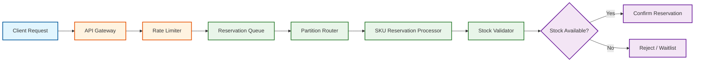
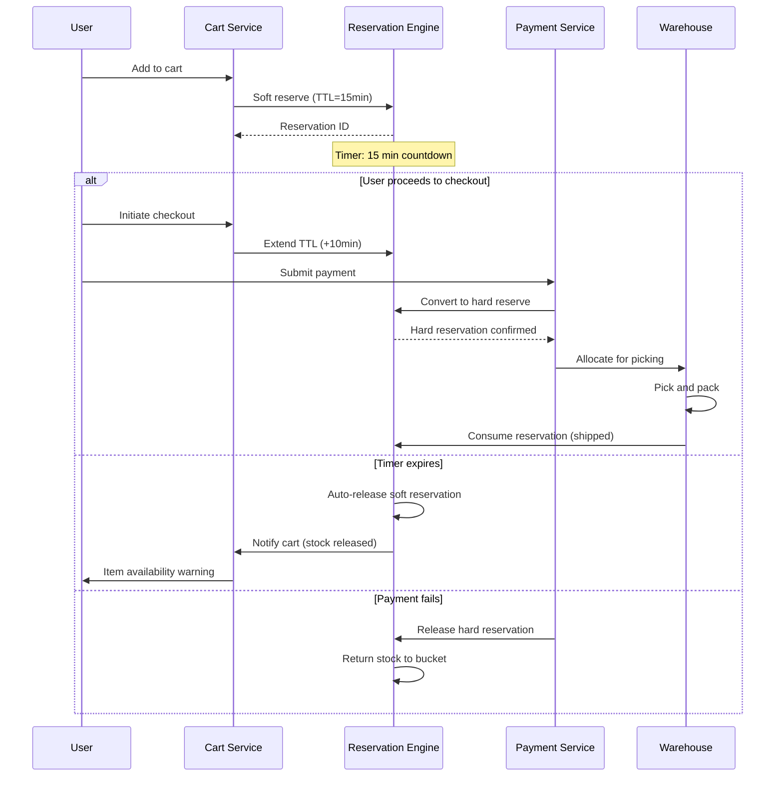
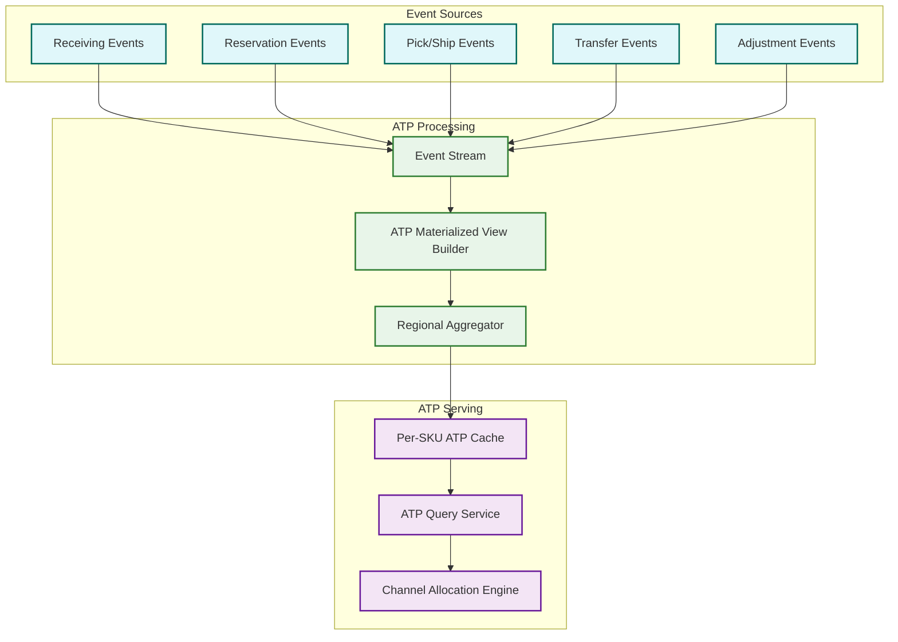
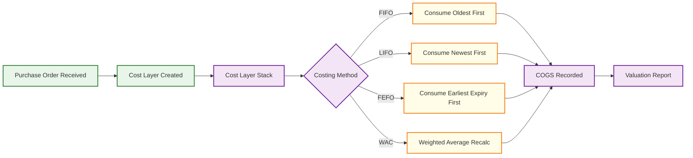
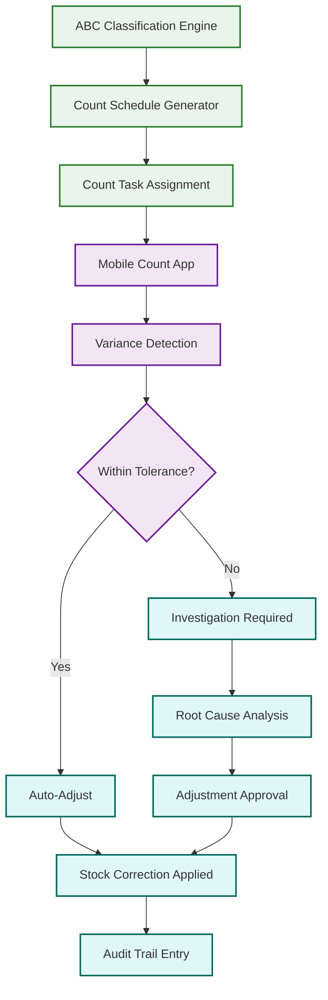

# Deep Dive & Bottlenecks

## 1. Reservation Engine Under Extreme Concurrency

### The Problem

During flash sales, 50K+ concurrent reservation requests target the same popular SKU within seconds. A naive approach---row-level locking on the inventory row---serializes all requests through a single database row, creating a bottleneck where throughput collapses to ~500 TPS regardless of how many application servers are available. This is the thundering herd problem for hot SKUs: thousands of threads contend for the same lock, causing cascading timeouts, connection pool exhaustion, and failed customer experiences at peak demand.

### Reservation Request Flow



### Solution: Partitioned Reservation with Token Bucket

Pre-partition available stock into reservation "buckets" distributed across channels and regions. Each bucket maintains an independent atomic counter decremented without cross-bucket coordination.

**Bucket allocation example** (SKU with 10,000 units):

| Channel | Region | Allocated Units | Counter |
|---------|--------|-----------------|---------|
| Web | North | 3,000 | Atomic counter A |
| Web | South | 2,500 | Atomic counter B |
| Mobile App | North | 2,000 | Atomic counter C |
| Mobile App | South | 1,500 | Atomic counter D |
| Wholesale | All | 1,000 | Atomic counter E |

A background rebalancer runs every 30 seconds, redistributing unsold capacity from slow buckets to fast-moving ones based on sell-through velocity.

```
FUNCTION reserve_stock(sku_id, channel, region, quantity):
    bucket = resolve_bucket(sku_id, channel, region)
    remaining = bucket.atomic_decrement(quantity)

    IF remaining >= 0:
        create_reservation(sku_id, quantity, bucket.id, TTL=15min)
        RETURN ReservationConfirmed(reservation_id)

    -- Local bucket exhausted; attempt steal from sibling buckets
    donor = find_donor_bucket(sku_id, min_surplus=100)
    IF donor IS NOT NULL:
        transferred = donor.atomic_transfer(bucket, quantity)
        IF transferred:
            RETURN reserve_stock(sku_id, channel, region, quantity)

    RETURN ReservationRejected(reason="out_of_stock")

FUNCTION rebalance_buckets(sku_id):
    buckets = get_all_buckets(sku_id)
    total_remaining = SUM(b.remaining FOR b IN buckets)
    velocities = get_sell_through_velocity(sku_id, window=5min)

    FOR EACH bucket IN buckets:
        target = total_remaining * (velocities[bucket.id] / SUM(velocities))
        delta = target - bucket.remaining
        IF ABS(delta) > REBALANCE_THRESHOLD:
            apply_rebalance(bucket, delta)
```

### Soft vs Hard Reservation Lifecycle



**Soft reservation**: 15-minute hold from cart addition. Not financially committed. Auto-released on expiry. **Hard reservation**: Created on payment confirmation. Persists until fulfillment. Triggers warehouse allocation.

### Handling Oversell

When reservations exceed physical stock, the oversell resolution pipeline activates:
1. **Detection**: Periodic reconciliation (every 60s) compares `SUM(reservations)` against `physical_on_hand` per SKU per warehouse.
2. **Triage**: Reservations ranked by age, customer tier, and order value. Newest, lowest-value reservations are cancellation candidates.
3. **Customer notification**: Options presented: wait for backorder, substitute SKU, or cancel with compensation.
4. **Backorder queue**: Incoming stock auto-allocated to backorders before becoming available for new reservations.
5. **Auto-cancellation**: Unfulfillable backorders cancelled after SLA (7--14 days) with refund and courtesy credit.

---

## 2. Multi-Warehouse ATP Calculation at Scale

### The Problem

Every product page must display stock availability---the Available-to-Promise (ATP) query. With 500 warehouses and 5M SKUs, computing ATP on-the-fly by querying each warehouse is prohibitively slow. Product pages require sub-50ms responses, yet ATP depends on real-time data: on-hand stock, reserved quantities, allocated picks, and in-transit transfers.

### Event-Driven ATP Architecture



### Solution: Event-Driven Materialized Views

Every inventory event updates a materialized ATP view pre-computing: `ATP(sku, warehouse) = on_hand - reserved - allocated + in_transit_incoming`. Regional aggregation sums across warehouses within a fulfillment zone.

```
FUNCTION handle_inventory_event(event):
    MATCH event.type:
        CASE "RECEIVED":
            atp_view.increment(event.sku_id, event.warehouse_id, event.quantity)
        CASE "RESERVED":
            atp_view.decrement(event.sku_id, event.warehouse_id, event.quantity)
        CASE "RESERVATION_RELEASED":
            atp_view.increment(event.sku_id, event.warehouse_id, event.quantity)
        CASE "PICKED":
            atp_view.decrement(event.sku_id, event.warehouse_id, event.quantity)
        CASE "TRANSFER_SHIPPED":
            atp_view.decrement(event.sku_id, event.source_wh, event.quantity)
            atp_view.increment_in_transit(event.sku_id, event.dest_wh, event.quantity)
        CASE "TRANSFER_RECEIVED":
            atp_view.convert_in_transit_to_on_hand(event.sku_id, event.dest_wh, event.quantity)

    regional_atp = aggregate_by_region(event.sku_id)
    cache.set("atp:" + event.sku_id, regional_atp, TTL=30s)
    publish("atp_updated", event.sku_id, regional_atp)
```

### Channel Allocation Strategy

Channel allocation reserves ATP portions for specific channels:

| Channel | Default Allocation | Dynamic Adjustment |
|---------|-------------------|-------------------|
| E-commerce | 80% of ATP | Increases if sell-through > 2x forecast |
| Retail Stores | 15% of ATP | Protected minimum for in-store customers |
| Wholesale / B2B | 5% of ATP | Allocated in bulk, released weekly |

The waterfall works top-down: e-commerce first, retail second, wholesale last. Exhausted channels borrow from lower-priority channels only. Velocity-based reallocation runs every 15 minutes.

### Consistency Trade-offs

| Context | Consistency Model | Staleness | Rationale |
|---------|------------------|-----------|-----------|
| Product page | Eventually consistent | 2--5s | Acceptable; rare false positives caught at checkout |
| Search results | Eventually consistent | 5--30s | Tolerable; in-stock filter is approximate |
| Checkout | Strongly consistent | 0 | Critical; prevents oversell via atomic reservation |
| Warehouse ops | Strongly consistent | 0 | Picking accuracy depends on exact counts |

---

## 3. FIFO/LIFO/FEFO Cost Layer Management

### The Problem

A single SKU may accumulate hundreds of cost layers from different purchase orders at different prices. When items are sold, the correct cost layer must be consumed according to the costing method (FIFO, LIFO, FEFO, Weighted Average, or Standard Cost). Incorrect consumption produces wrong COGS, cascading into financial misstatement and audit failures.

### Cost Layer Flow



### Solution: Ordered Cost Layer Stack

Each cost layer contains: `layer_id`, `sku_id`, `warehouse_id`, `quantity_remaining`, `unit_cost`, `received_date`, `expiry_date`, `purchase_order_id`. Layer ordering is determined by costing method: **FIFO** (`received_date` ascending), **LIFO** (`received_date` descending), **FEFO** (`expiry_date` ascending---critical for perishables).

```
FUNCTION consume_cost_layers(sku_id, warehouse_id, quantity, method):
    layers = get_ordered_layers(sku_id, warehouse_id, method)
    consumed = []
    remaining_qty = quantity

    FOR EACH layer IN layers:
        IF remaining_qty <= 0:
            BREAK

        consume_qty = MIN(remaining_qty, layer.quantity_remaining)
        layer.quantity_remaining -= consume_qty
        remaining_qty -= consume_qty

        consumed.append({
            layer_id: layer.id,
            quantity: consume_qty,
            unit_cost: layer.unit_cost,
            cogs: consume_qty * layer.unit_cost
        })

        IF layer.quantity_remaining = 0:
            mark_layer_depleted(layer.id)

    IF remaining_qty > 0:
        RAISE InsufficientCostLayersError(sku_id, remaining_qty)

    total_cogs = SUM(c.cogs FOR c IN consumed)
    record_cogs_entry(sku_id, consumed, total_cogs)
    RETURN consumed
```

### Weighted Average Cost Recalculation

WAC maintains a single running average, recalculated on every receipt:

```
FUNCTION receive_stock_wac(sku_id, warehouse_id, new_qty, new_unit_cost):
    current = get_wac_record(sku_id, warehouse_id)

    IF current.quantity_on_hand = 0:
        -- Reset WAC when starting from zero
        new_wac = new_unit_cost
    ELSE:
        new_wac = (current.quantity_on_hand * current.wac + new_qty * new_unit_cost)
                  / (current.quantity_on_hand + new_qty)

    current.quantity_on_hand += new_qty
    current.wac = ROUND(new_wac, 4)
    save_wac_record(current)

FUNCTION consume_stock_wac(sku_id, warehouse_id, quantity):
    current = get_wac_record(sku_id, warehouse_id)
    cogs = quantity * current.wac
    current.quantity_on_hand -= quantity
    -- WAC does NOT change on consumption, only on receipt
    save_wac_record(current)
    record_cogs_entry(sku_id, quantity, current.wac, cogs)
```

**Edge case at zero inventory**: WAC resets on next receipt after stock fully depletes, preventing stale costs from distorting valuation.

### Standard Cost Variance Analysis

Standard cost assigns a predetermined unit cost per SKU. Actual purchase prices create variances: **PPV** = (Actual - Standard) x Quantity. Positive PPV is unfavorable (paid more), negative is favorable. Variance is tracked per receipt/supplier/SKU. Monthly reports flag SKUs where cumulative PPV exceeds 5--10% of standard, triggering revision review. Updates are applied prospectively---existing inventory is not revalued.

---

## 4. Cycle Counting & Inventory Reconciliation

### The Problem

Physical inventory drifts from system records due to shrinkage, misplacement, receiving errors, and picking errors. Full physical counts require shutting down operations for 12--48 hours---unacceptable for continuous fulfillment. Cycle counting provides continuous accuracy without disruption.

### Cycle Counting Architecture



### Solution: ABC-Velocity Cycle Counting

Items are classified by movement velocity (not just value):

| Class | Criteria | Count Frequency | Tolerance |
|-------|----------|----------------|-----------|
| A | Top 20% by picks/week | Weekly | +/- 1 unit or 1% |
| B | Next 30% by picks/week | Monthly | +/- 3 units or 2% |
| C | Bottom 50% by picks/week | Quarterly | +/- 5 units or 5% |

**Blind counts**: The operator counts without seeing system quantity, eliminating confirmation bias. The system compares only after submission. **Guided counts**: Used for recount after variance---operator sees both system quantity and prior count.

```
FUNCTION generate_daily_count_tasks(warehouse_id):
    a_items = get_class_a_items(warehouse_id)
    daily_a_sample = random_sample(a_items, size=CEIL(LEN(a_items) / 5))
    b_items_due = get_class_b_items_due_this_week(warehouse_id)
    daily_b_sample = random_sample(b_items_due, size=CEIL(LEN(b_items_due) / 5))
    flagged = get_recently_flagged_locations(warehouse_id, days=14)
    tasks = deduplicate_and_prioritize(daily_a_sample + daily_b_sample + flagged)
    FOR EACH task IN tasks:
        assign_to_counter(task, method="blind")
    RETURN tasks
```

**Auto-adjustment**: Variances within tolerance are auto-applied with audit trail. Out-of-tolerance variances freeze the location, notify a supervisor, and require root cause documentation before approval.

---

## 5. Key Bottlenecks & Mitigations

| Bottleneck | Impact | Mitigation | Trade-off |
|-----------|--------|------------|-----------|
| **Hot SKU reservation contention** | Throughput collapse to < 500 TPS on popular items during flash sales | Partitioned reservation buckets with independent atomic counters; background rebalancing | Slight risk of early stockout on one bucket while another has surplus; rebalancer lag of ~30s |
| **ATP cache staleness during flash sales** | Product page shows "In Stock" after actual stockout; customer frustration at checkout | Event-driven cache invalidation with bounded staleness of 2--5s; synchronous check at checkout | Higher infrastructure cost for event processing; eventual consistency visible to browsing users |
| **Cost layer consumption lock contention** | Concurrent sales of the same SKU serialize on cost layer table; slows order processing | Batch cost layer consumption: accumulate sales for 5--10 seconds, consume layers in a single batch transaction | COGS recording delayed by batch window; real-time margin reports have slight lag |
| **Cycle count disrupting operations** | Counting a location blocks picks/putaways at that location; reduces warehouse throughput | Schedule counts during low-activity windows; use zone-based counting to limit disruption radius | Counts skewed toward off-peak periods; high-velocity locations may drift between counts |
| **Cross-warehouse transfer latency** | Transfers take 2--7 days; ATP is inaccurate during transit; risk of double-counting | In-transit inventory state tracked separately; ATP includes in-transit only when ETA < 24h | Conservative ATP may show items as unavailable when they are in transit and will arrive soon |
| **Event processing backlog during peak** | ATP views fall behind; stale stock data; oversell risk increases | Auto-scaling consumer groups; priority lanes for reservation and pick events over adjustment events | Lower-priority events (adjustments, transfers) may experience minutes of delay during peak |

---

## 6. Failure Modes and Graceful Degradation

| Failure | Impact | Graceful Degradation |
|---------|--------|---------------------|
| Reservation engine down | No new reservations; carts cannot hold stock | Queue reservation requests; allow checkout with synchronous stock check as fallback; accept oversell risk |
| ATP cache unavailable | Product pages cannot show stock status | Fall back to "Check availability at checkout"; serve stale cached values with warning |
| Event stream backlog | ATP views stale; reservation buckets not rebalanced | Switch to direct DB queries for ATP (slower but accurate); pause rebalancing |
| Cost layer service down | COGS cannot be recorded | Queue sales events; process cost layers asynchronously on recovery; flag affected orders |
| Warehouse management system down | No picks, putaways, or transfers | Buffer inbound receiving; prioritize outbound shipments from pre-picked orders |
| Cycle count app offline | Counting halted; accuracy degrades | Paper-based counting fallback; manual entry on recovery; extend count deadlines |
