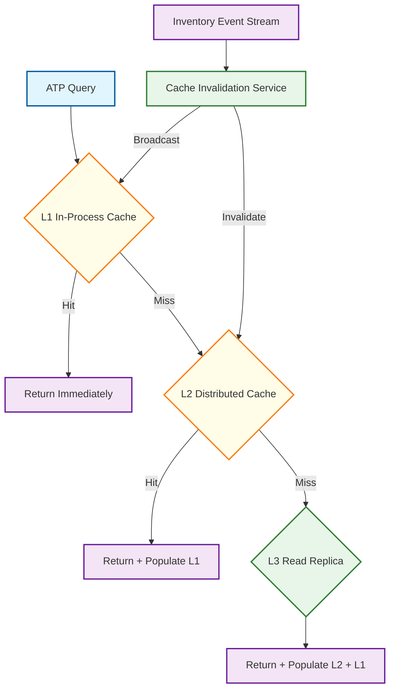
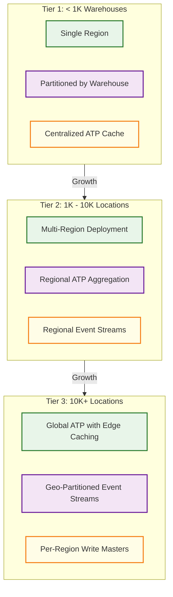
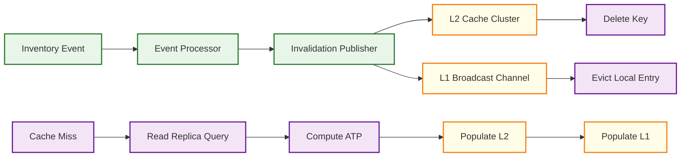

# Scalability & Reliability

## Scaling Strategy Overview

An inventory management system faces asymmetric scaling demands. Read traffic (ATP queries) outweighs write traffic (reservations, movements) by 50--100x. Flash sales produce 10--20x normal reservation volume in minutes. The event-sourced architecture separates concerns: the write path (event log) scales independently from the read path (materialized views and caches).

| Component | Scaling Dimension | Strategy | Primary Bottleneck |
|-----------|------------------|----------|-------------------|
| ATP Query Service | QPS (product pages) | Materialized views + multi-layer cache | Cache miss rate |
| Reservation Engine | TPS (concurrent reserves) | Partitioned counters per SKU | Hot SKU contention |
| Movement Service | Events/sec (warehouse ops) | Partition by warehouse_id | DB write throughput |
| Event Store | Events/sec (all mutations) | Partition by aggregate_id | Disk I/O + replication |
| Cost Layer Service | Transactions/sec (sales) | Batch consumption per SKU | Layer lock contention |
| Reporting Service | Query complexity | Read replicas + pre-aggregation | Long-running queries |

---

## 1. Read Path Scaling

ATP queries dominate read traffic---a retailer with 5M SKUs and 100K concurrent shoppers generates 100K+ QPS. The read path uses a three-layer caching strategy.

### Multi-Layer Cache Architecture



**L1 --- In-Process Cache**: Local cache for warehouse topology and SKU master data. Changes infrequently, tolerates staleness.

```
Content: Warehouse topology, SKU master attributes, channel allocation rules
TTL: 5 minutes | Invalidation: pub/sub broadcast on change | Hit rate: ~99%
Eviction: LRU with 50K entry cap per instance
```

**L2 --- Distributed Cache**: Pre-computed ATP values partitioned by SKU hash. The workhorse cache layer.

```
Content: ATP per SKU per region, reservation bucket states
Key format: "atp:{sku_id}:{region}" | TTL: 5--30s (configurable per SKU velocity class)
Invalidation: Event-driven (inventory events publish invalidation messages)
Hit rate: ~95% during steady state, ~80% during flash sales
Cluster: 16 nodes, consistent hashing, 2 replicas per key
```

**L3 --- Read Replicas**: Authoritative read source for cache miss backfill.

```
Content: Full inventory positions, movement history, reservation state
Replicas: 2--4 per partition, lag < 1 second from primary
Purpose: Cache miss backfill, reporting queries, historical lookups
```

### Cache Warming for Peak Events

Before known peak events, a pre-warming job loads ATP values for promoted and high-velocity SKUs into L2 cache in batches of 1,000. This prevents a flood of cache misses when traffic spikes hit.

---

## 2. Write Path Scaling

All inventory mutations flow through the event store as the single source of truth. State is reconstructed by replaying events from the most recent snapshot.

```
Write path:
  Mutation Request → Command Handler → Validate → Append Event → ACK
                                                       ↓
                                              Async Projection
                                                       ↓
                                        Materialized View (ATP, Cost Layers, Reports)
```

**Partition by warehouse_id** for location-level operations (receiving, putaway, picking). **Partition by sku_id** for stock-level operations (reservation, ATP, cost layers). Each partition processes events sequentially, preventing race conditions without cross-partition coordination.

**Throughput targets**: Reservation 50K TPS (flash sales), Pick/ship 20K TPS (shipping wave), Receiving 5K TPS (morning wave), Transfer 1K TPS (background), Adjustment 500 TPS (cycle count windows).

---

## 3. Horizontal Scaling Strategy



**Tier 1 (< 1K warehouses)**: Single-region, centralized ATP cache. Sufficient for most mid-market retailers.

**Tier 2 (1K--10K locations)**: Multi-region with regional ATP aggregation and async cross-region event replication. Global ATP has 5--10s staleness.

**Tier 3 (10K+ locations)**: Global deployment with edge-cached ATP. Per-region event streams and write masters.

---

## 4. Data Partitioning

### Inventory Data Partitioning

**Partition key**: Composite `warehouse_id + sku_id`. Co-locates data per warehouse for efficient queries while avoiding hot partitions from popular SKUs.

```
Inventory Position Table:
  Partition key: warehouse_id (range partitioned, 64 partitions)
  Sort key: sku_id
  Co-located: reservations, cost layers, location assignments

Movement History Table:
  Partition key: sku_id (hash partitioned, 256 partitions)
  Sort key: event_timestamp
  Use case: SKU-level movement analysis, cost layer replay
```

### Event Store Partitioning

Partition by `aggregate_id` (`sku_id` for reservation/ATP, `warehouse_id` for operations). Causal ordering within aggregates; parallel processing across them.

```
Retention policies:
  Hot (0--30 days):    Full event detail, indexed, on fast storage
  Warm (30 days--1 year): Compressed events, queryable, on standard storage
  Cold (1--7+ years):  Archived snapshots + event log, compliance retention
  Snapshots:          Daily snapshots per SKU per warehouse (fast replay)
```

---

## 5. Caching Strategy

### Cache Invalidation Flow



| Cache Layer | Content | TTL | Invalidation | Hit Rate |
|------------|---------|-----|-------------|----------|
| L1 In-Process | Warehouse topology, SKU master | 5 min | Pub/sub broadcast | ~99% |
| L2 Distributed | ATP values, reservation states | 5--30s | Event-driven delete | ~95% |
| L3 Read Replica | Full inventory positions | N/A | Replication lag < 1s | 100% (authoritative) |

**Stampede prevention**: When a popular SKU's cache entry expires, hundreds of concurrent requests may simultaneously recompute ATP. The system uses probabilistic early expiration (random TTL jitter) plus a short-lived lock to serialize recomputation.

```
FUNCTION get_atp_with_stampede_prevention(sku_id, region):
    entry = cache.get("atp:" + sku_id + ":" + region)
    IF entry IS NOT NULL:
        effective_ttl = entry.ttl - RANDOM(0, entry.ttl * 0.1)
        IF effective_ttl > 0: RETURN entry.value

    IF cache.try_lock("atp_lock:" + sku_id, TTL=2s):
        atp = compute_atp_from_replica(sku_id, region)
        cache.set("atp:" + sku_id + ":" + region, atp, TTL=30s)
        cache.release_lock("atp_lock:" + sku_id)
        RETURN atp
    ELSE:
        SLEEP(50ms)
        RETURN cache.get("atp:" + sku_id + ":" + region).value
```

---

## 6. Reliability Patterns

### Inventory Consistency Guarantees

Inventory must never go negative. Every mutation uses compare-and-swap (CAS):

```
FUNCTION decrement_stock(sku_id, warehouse_id, quantity, idempotency_key):
    -- Check idempotency first
    IF already_processed(idempotency_key):
        RETURN previous_result(idempotency_key)

    FOR attempt IN 1..MAX_CAS_RETRIES:
        current = read_inventory_position(sku_id, warehouse_id)
        IF current.on_hand < quantity:
            RETURN InsufficientStockError(current.on_hand, quantity)

        new_version = current.version + 1
        success = cas_update(
            sku_id, warehouse_id,
            expected_version = current.version,
            new_on_hand = current.on_hand - quantity,
            new_version = new_version
        )
        IF success:
            record_idempotency(idempotency_key, new_version)
            emit_event("STOCK_DECREMENTED", sku_id, warehouse_id, quantity)
            RETURN Success(new_version)

    RETURN ConcurrencyError("Max retries exceeded")
```

**Multi-warehouse transfers** use the saga pattern: debit source → credit destination. On credit failure, compensating transaction re-credits source. State machine: `INITIATED → SOURCE_DEBITED → IN_TRANSIT → DESTINATION_CREDITED → COMPLETED` (or `→ COMPENSATED`).

### Reservation Reliability

```
Reliability mechanisms:
  1. TTL-based auto-release:  Soft reservations expire after 15 min
  2. Dead letter queue:       Stuck reservations (no state change in 30 min) → DLQ
  3. Periodic reconciliation: Every 5 min, compare SUM(active_reservations) vs on_hand
  4. Circuit breaker:         If fulfillment service error rate > 30%, stop converting
                              hard reservations to allocations; queue for manual review
```

### Event Processing Reliability

```
Exactly-once semantics:
  Producer: Deterministic idempotency key (e.g., "receive:{po_id}:{line_id}:{wh_id}")
  Broker:   Deduplicates by key within 24-hour window
  Consumer: Idempotent processing; re-processing produces same state

Dead letter queue:
  Events failing after 5 retries → DLQ | Alert on reservation/pick events
  Operator reviews and replays after root cause fix

Projection rebuild:
  Load latest snapshot + replay events since | Full rebuild: ~4h for 5M SKUs × 500 warehouses
```

---

## 7. Disaster Recovery

### RPO/RTO Targets

| Component | RPO | RTO | Strategy |
|-----------|-----|-----|----------|
| Inventory Positions | 0 (zero data loss) | < 5 min | Synchronous replication + auto-failover |
| ATP Cache | 5 seconds | < 30 seconds | Warm standby cache; rebuild from read replica |
| Event Store | 0 (zero data loss) | < 10 min | Synchronous replication; append-only durability |
| Movement History | 0 (zero data loss) | < 15 min | Co-replicated with event store |
| Cost Layer Records | 0 (zero data loss) | < 10 min | Co-located with inventory positions |
| Reservation State | < 5 seconds | < 2 min | Replicated; auto-release resolves stale reservations |
| Reporting Views | < 1 min | < 30 min | Rebuild from event store on failover |

### Multi-Region Strategy

```
Region A (Primary)                        Region B (Standby)
┌────────────────────────┐                ┌────────────────────────┐
│ Reservation Engine     │                │ Reservation Engine     │
│ Movement Service       │                │ Movement Service       │
│ ATP Query Service      │                │ ATP Query Service      │
│ Cost Layer Service     │                │ Cost Layer Service     │
│                        │                │                        │
│ Event Store (writes)   │───sync────────►│ Event Store (replica)  │
│ Inventory DB (writes)  │───sync────────►│ Inventory DB (replica) │
│ ATP Cache              │───async───────►│ ATP Cache (warm)       │
└────────────────────────┘                └────────────────────────┘

Write path: Active-passive (all mutations go to Region A primary)
Read path:  Active-active (ATP queries served from nearest region)
```

**Failover procedure**: Health monitor detects degradation (3 failed checks, 15s interval) → DNS failover to Region B (< 60s) → promote event store and inventory DB replicas (< 2 min each, parallel) → warm ATP cache from promoted DB (< 5 min) → rebuild reservation state from event replay (< 3 min). Full restoration target: < 10 minutes.

### Backup Strategy

```
Continuous:   Event store WAL streaming to standby region (< 1s lag)
Hourly:       Event store snapshots per aggregate (fast replay baseline)
Daily:        Full database snapshot at 02:00 UTC (30-day retention)
Weekly:       Restore validation in isolated environment
Quarterly:    Full DR drill with traffic failover and failback
```

---

## 8. Capacity Planning

### Auto-Scaling Triggers

```
ATP Query Service:
  Scale-out: Cache miss rate > 10% OR p99 > 30ms for 2 min  → +3 instances
  Scale-in:  Cache miss rate < 2% AND p99 < 10ms for 15 min → -1 instance
  Min: 6 | Max: 60

Reservation Engine:
  Scale-out: Queue depth > 1,000 OR p99 > 50ms for 1 min → +4 instances
  Scale-in:  Queue depth < 50 AND p99 < 20ms for 10 min  → -1 instance
  Min: 4 | Max: 40

Event Consumers (ATP projection):
  Scale-out: Consumer lag > 5,000 events OR lag growing for 2 min → +2 consumers
  Scale-in:  Consumer lag < 100 for 15 min → -1 consumer
  Min: 8 | Max: 32

Movement Service:
  Scale-out: p99 > 40ms OR CPU > 70% for 3 min → +2 instances
  Scale-in:  p99 < 15ms AND CPU < 25% for 15 min → -1 instance
  Min: 4 | Max: 24
```

### Pre-Scaling for Known Events

Pre-scale 2 hours before anticipated events:

| Event Type | Reservation Engine | ATP Service | Event Consumers |
|-----------|-------------------|-------------|-----------------|
| Flash sale | 10x baseline | 5x baseline | 4x baseline |
| Seasonal peak | 5x baseline | 3x baseline | 3x baseline |
| Warehouse launch | 1x baseline | 1x baseline | 2x baseline |

---

## 9. Performance Benchmarks

| Operation | p50 Latency | p99 Latency | Throughput | Notes |
|-----------|-------------|-------------|------------|-------|
| ATP query (cache hit) | 2 ms | 8 ms | 100K QPS | L2 cache hit path |
| ATP query (cache miss) | 15 ms | 50 ms | 10K QPS | Read replica computation |
| Soft reservation create | 8 ms | 35 ms | 50K TPS | Partitioned counter decrement |
| Hard reservation convert | 12 ms | 60 ms | 30K TPS | Includes persistence |
| Stock receive | 10 ms | 45 ms | 5K TPS | Event append + async projection |
| Pick confirmation | 8 ms | 40 ms | 20K TPS | Event append + reservation update |
| Cost layer consumption | 15 ms | 80 ms | 10K TPS | Batch mode; per-SKU lock |
| Transfer initiation | 20 ms | 100 ms | 1K TPS | Saga initiation + source debit |
| Cycle count submission | 25 ms | 120 ms | 500 TPS | Variance check + conditional adjust |
| Movement history query | 30 ms | 200 ms | 5K QPS | Read replica, indexed by SKU |

### Load Testing Strategy

| Scenario | Description | Duration |
|----------|-------------|----------|
| Steady state | 20K TPS mixed workload | 4 hours |
| Flash sale | Ramp 5K → 50K reservation TPS | 10 min |
| Cache failure | Disable L2; verify graceful degradation | 30 min |
| Region failover | Simulate primary failure; verify RTO < 10 min | 1 hour |
