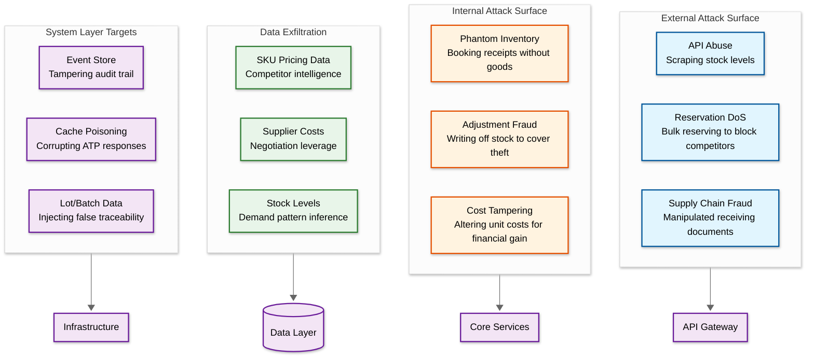
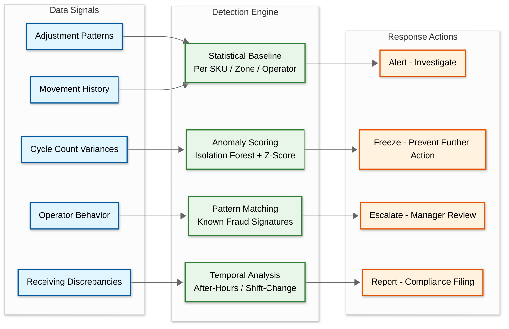

# Inventory Management System: Security and Compliance

## 1. Threat Model

### Attack Surface Analysis

An inventory management system exposes multiple attack vectors spanning API-level manipulation, insider fraud, supply chain deception, and competitive intelligence extraction. The diagram below maps the primary attack surfaces.



### Threat Categories

| # | Threat | Vector | Impact | Likelihood | Mitigation |
|---|--------|--------|--------|------------|------------|
| 1 | **Inventory manipulation fraud** | Insider adjusts quantities to steal physical goods; adjustment records disguise shrinkage as system corrections | Financial loss, inaccurate COGS, SOX violation | Medium | Dual-approval for adjustments above threshold; automated variance investigation; segregation of duties between physical and system operations |
| 2 | **Phantom receiving** | Warehouse operator books receipt of goods that never physically arrived; creates inflated inventory that masks real shrinkage | Overstated inventory valuation, financial misstatement | Medium | Require ASN (Advance Ship Notice) match before receipt confirmation; weight/dimension validation at dock; random spot audits with photo evidence |
| 3 | **Cost layer tampering** | Finance user alters unit costs in receipt records to inflate or deflate inventory valuation, manipulating COGS and margins | Incorrect financial statements, potential securities fraud if publicly traded | Low | Field-level encryption on cost data; immutable cost layer records in event store; variance alerts when cost deviates >10% from PO price |
| 4 | **Reservation denial-of-service** | Competitor or malicious actor creates bulk reservations to exhaust available stock without completing purchases | Stockouts for legitimate customers, lost revenue, brand damage | Medium | Reservation TTL (time-to-live) with automatic expiration; rate limiting per API consumer; progressive reservation quotas; require payment commitment for large reservations |
| 5 | **Data exfiltration** | Attacker or insider extracts stock levels, supplier costs, or SKU pricing data for competitive intelligence | Loss of competitive advantage, supplier relationship damage | Medium | API response filtering by role; data loss prevention monitoring; query pattern anomaly detection; watermarking exported reports |
| 6 | **Insider adjustment abuse** | Warehouse operator systematically writes off small quantities across many SKUs to cover theft; amounts stay below approval thresholds | Cumulative financial loss, undetected shrinkage patterns | High | ML-based anomaly detection on adjustment patterns per operator; aggregate threshold monitoring (not just per-adjustment); mandatory rotation of zone assignments |
| 7 | **API abuse for competitive intelligence** | External party scrapes ATP endpoints to infer demand patterns, stock levels, and pricing strategies | Strategic intelligence leakage | Medium | Rate limiting per channel; response obfuscation (return availability bands rather than exact counts); CAPTCHA or proof-of-work for unauthenticated queries |
| 8 | **Supply chain poisoning** | Tampered lot/batch metadata injected during receiving, creating false traceability records that undermine recall accuracy | Regulatory non-compliance, inability to execute accurate recalls, public safety risk | Low | Cryptographic verification of supplier-provided batch data; immutable lot records with digital signatures; cross-reference against supplier certificates of analysis |

---

## 2. Authentication & Authorization

### RBAC Model

Role-based access control enforces the principle of least privilege across all inventory operations. Each role maps to specific capabilities bounded by organizational scope (zone, warehouse, region).

| Role | Permissions | Scope |
|------|------------|-------|
| **Warehouse Operator** | Pick, pack, count, receive, putaway, confirm movements | Own assigned zone within a single warehouse |
| **Warehouse Supervisor** | All operator permissions + approve cycle counts + create adjustments (up to threshold) + reassign zone operators | Single warehouse, all zones |
| **Inventory Manager** | Full warehouse operations + transfer orders between warehouses + reorder management + safety stock configuration | Regional warehouse group |
| **Finance Controller** | View all inventory data + cost adjustments + valuation reports + period-end reconciliation + COGS review | All warehouses (read-only for physical operations) |
| **System Administrator** | Configuration management + user management + integration settings + system health monitoring | Platform-wide (no inventory mutation permissions) |
| **API Consumer** | Scoped read-only access to ATP and stock levels via API keys; no write operations | Defined by API scope; typically channel-specific |

### Permission Boundaries

**Zone-Level Isolation**: Warehouse operators can only execute operations (picks, putaways, counts) within their assigned zone. An operator assigned to Zone A cannot confirm a pick in Zone B, even within the same warehouse. Zone assignments are managed by supervisors and logged in the audit trail.

**Warehouse-Level Isolation**: Inventory managers see aggregate data only for warehouses within their assigned region. Cross-region visibility requires explicit escalation. Transfer orders between regions require approval from both source and destination managers.

**Segregation of Duties**: The system enforces the following separation rules to prevent single-actor fraud:

```
RULE 1: The person who receives goods CANNOT also adjust inventory
        for those same SKUs within the same accounting period.

RULE 2: The person who performs a cycle count CANNOT also approve
        the resulting adjustment.

RULE 3: The person who creates a transfer order CANNOT also confirm
        receipt at the destination warehouse.

RULE 4: The person who modifies cost layers CANNOT also approve
        the corresponding valuation report.
```

Violations of segregation rules are blocked at the API layer and logged as security events.

### API Security

| Control | Implementation |
|---------|---------------|
| **Rate Limiting** | Per-channel quotas: e-commerce storefront (200K req/s ATP queries), ERP integration (10K req/s), third-party marketplace (5K req/s). Separate limits for read vs. write operations |
| **API Key Rotation** | Mandatory 90-day rotation for all API consumers; automated key provisioning via self-service portal; old keys expire 48 hours after new key activation |
| **OAuth2 Scopes** | Granular scopes: `atp:read`, `stock:read`, `stock:write`, `reservation:create`, `reservation:cancel`, `cost:read`, `adjustment:create`. Each consumer receives minimum required scopes |
| **HMAC Signatures** | Webhook callbacks to ERP systems use HMAC-SHA256 signatures; receiving system verifies signature before processing; timestamp included in signature to prevent replay attacks (5-minute window) |
| **Mutual TLS** | Service-to-service communication within the platform uses mTLS with short-lived certificates (24-hour TTL) rotated automatically |

---

## 3. Data Protection

### Data Classification

| Data Type | Classification | Protection Measures |
|-----------|---------------|-------------------|
| Inventory quantities (on-hand, reserved, available) | Internal / Confidential | Encryption at rest (AES-256); access logged; API responses filtered by role |
| Cost and pricing data (unit cost, landed cost, margins) | Highly Confidential | Field-level encryption; dedicated encryption keys; access restricted to Finance Controller role |
| Supplier information (contracts, lead times, pricing tiers) | Confidential | Encrypted at rest; access-controlled by role; supplier-specific data isolated |
| Movement history (picks, putaways, transfers, adjustments) | Internal | Encrypted at rest; full audit logging; retained for 7+ years |
| Lot, batch, and serial numbers | Regulated | Tamper-proof storage in append-only event store; cryptographic chaining; retained per regulatory requirement |
| Employee/operator data (names, IDs, shift records) | PII / Restricted | PII encryption; pseudonymized in analytics pipelines; right-to-erasure supported with audit trail preservation |
| Warehouse layout and zone configuration | Internal | Access-controlled; changes logged; no external API exposure |

### Encryption Strategy

**At Rest**: All databases use transparent data encryption (TDE) with AES-256. Cost data uses additional field-level encryption with separate key material managed through a centralized key management service. Encryption keys are rotated quarterly; re-encryption of existing data occurs as a background process during low-traffic windows.

**In Transit**: All inter-service communication uses TLS 1.3 with certificate pinning. External API traffic terminates TLS at the API gateway. Internal service mesh enforces mTLS for all east-west traffic.

**Key Management**: Centralized key management service with hardware security module (HSM) backing for master keys. Application-level keys derived from master keys using key derivation functions. Key hierarchy: Master Key → Service Key → Data Key → Field Key.

### Data Masking by Role

| Data Element | Warehouse Operator | Warehouse Supervisor | Inventory Manager | Finance Controller |
|-------------|-------------------|---------------------|-------------------|-------------------|
| On-hand quantity | Visible (own zone) | Visible (all zones) | Visible (all warehouses) | Visible (all) |
| Unit cost | Hidden | Hidden | Summary only | Full detail |
| Landed cost | Hidden | Hidden | Hidden | Full detail |
| Supplier name | Hidden | Visible | Visible | Visible |
| Bin location | Visible (own zone) | Visible (all zones) | Aggregate view | Hidden |
| Lot/batch details | Visible (scan context) | Visible | Visible | Visible |
| Operator identity in audit | Own records only | Own warehouse | Own region | All (anonymized) |

---

## 4. Audit & Compliance

### Immutable Audit Trail

Every inventory state mutation generates an immutable audit record stored in an append-only event store. Records cannot be modified or deleted --- only new corrective entries can be appended.

**Audit Record Schema**:

```
AuditRecord:
    record_id:       globally unique identifier
    previous_hash:   SHA-256 hash of the preceding record (cryptographic chaining)
    timestamp:       server-side UTC timestamp (not client-supplied)
    warehouse_id:    warehouse where the event occurred
    zone_id:         zone within the warehouse
    sku_id:          affected SKU
    lot_id:          affected lot/batch (if applicable)
    serial_number:   affected serial number (if applicable)
    movement_type:   RECEIPT | PICK | PUTAWAY | TRANSFER | ADJUSTMENT | COUNT | RESERVATION
    quantity_before: stock level before the operation
    quantity_after:  stock level after the operation
    cost_before:     unit cost before (encrypted, Finance role only)
    cost_after:      unit cost after (encrypted, Finance role only)
    operator_id:     user who performed the action
    approver_id:     user who approved (if dual-approval required)
    reason_code:     standardized reason (e.g., CYCLE_COUNT_VARIANCE, DAMAGE, EXPIRY)
    source_document: reference to PO, SO, transfer order, or count sheet
    ip_address:      originating device IP (for API operations)
    device_id:       RF scanner or terminal identifier (for warehouse operations)
    digital_signature: operator's digital signature (for regulated workflows)
```

**Cryptographic Chaining**: Each audit record includes the SHA-256 hash of the previous record, creating a tamper-evident chain. Any modification to a historical record breaks the hash chain, which is detected by periodic integrity verification jobs that run every hour.

**Retention Policy**: Audit records are retained for a minimum of 7 years to satisfy SOX and FDA requirements. Records related to regulated products (pharmaceuticals, food) follow industry-specific retention schedules that may extend to 15 years. Archived records are moved to cold storage after 2 years but remain queryable within 4 hours.

### Regulatory Compliance Matrix

| Regulation | Requirement | Implementation |
|-----------|-------------|----------------|
| **SOX (Sarbanes-Oxley)** | Segregation of duties; reliable internal controls over inventory valuation; auditable trail of all financial-impacting changes | RBAC with enforced duty separation; immutable audit log with cryptographic chaining; automated reconciliation reports; dual-approval for cost adjustments |
| **FDA 21 CFR Part 11** | Electronic records must be attributable, legible, contemporaneous, original, and accurate (ALCOA); electronic signatures must be legally binding | Digital signatures on lot/batch records using operator credentials; system-generated timestamps (not operator-supplied); full traceability from receipt through distribution; validated workflows with change control |
| **GDPR** | Data privacy for employee/operator personal data; right to erasure; data minimization | PII encryption with dedicated keys; right-to-erasure implementation that anonymizes operator identity while preserving audit trail integrity (replace name with pseudonym, retain action record); data minimization in analytics pipelines |
| **GxP (Good Practices)** | Validated processes for regulated industries (pharma, food, medical devices); documented procedures; training records | Validated workflow engine with electronic signatures at each step; system qualification documentation (IQ/OQ/PQ); user training records linked to permission grants |
| **Customs & Trade Compliance** | Country-of-origin tracking; harmonized tariff codes; import/export documentation; denied-party screening | Lot-level origin tracking with supplier certificates; automated HTS code assignment; export control screening at order release; customs document generation |
| **FSMA (Food Safety)** | Traceability for food products from farm to fork; ability to trace one step forward and one step back within 24 hours | Lot-level tracking with supplier/grower identification; forward and backward trace queries; critical tracking events (CTEs) recorded at each custody transfer |

### Inventory Audit Controls

**Dual-Approval Thresholds**: Any inventory adjustment above a configurable threshold (default: 100 units or $5,000 in value) requires approval from a second authorized user. The approver must hold a different role than the initiator (e.g., operator initiates, supervisor approves). Adjustments below the threshold are auto-approved but still logged and subject to pattern analysis.

**Automated Variance Investigation Triggers**: When a cycle count reveals variance exceeding 2% for a given SKU-location, the system automatically:

```
1. Freeze the affected bin location (no new picks or putaways)
2. Generate an investigation ticket assigned to the warehouse supervisor
3. Pull recent movement history for the SKU-location (last 30 days)
4. Flag any operators who interacted with the location
5. Cross-reference against other recent variances by the same operator
6. Escalate to Inventory Manager if variance exceeds 5% or $10,000
```

**Periodic Reconciliation**: The system generates daily, weekly, and monthly reconciliation reports comparing system records against financial postings, PO receipts against physical receiving confirmations, and cycle count results against expected accuracy targets. Discrepancies trigger automatic investigation workflows.

**Segregation of Physical and Financial Adjustments**: Physical adjustments (changing on-hand quantities) and financial adjustments (changing unit costs or valuation) are separate operations requiring different authorization chains. A single user cannot perform both types of adjustment on the same SKU within the same accounting period.

---

## 5. Fraud Detection

### ML-Based Anomaly Detection

The fraud detection system analyzes inventory movement patterns to identify anomalies that may indicate theft, errors, or systematic manipulation.



**Detection Scenarios**:

| Scenario | Signal | Detection Method | Action |
|----------|--------|-----------------|--------|
| Systematic small write-offs | Operator consistently adjusts 1-5 units below approval threshold across many SKUs | Aggregate threshold monitoring; cumulative adjustment volume per operator per week | Alert supervisor; flag for investigation if cumulative adjustments exceed 500 units or $10K/month |
| After-hours movements | Inventory movements recorded outside normal shift hours for the operator's assigned schedule | Temporal anomaly detection; movement timestamp vs. shift schedule correlation | Immediate alert to security; freeze operator's access pending review |
| Zone-specific shrinkage | One zone consistently shows higher shrinkage than comparable zones in the same warehouse | Statistical comparison across zones; control chart monitoring with 3-sigma thresholds | Increase cycle count frequency in affected zone; review camera footage; rotate operators |
| Receiving quantity mismatches | Receiving operator consistently books more units than the ASN specifies or the weight check validates | ASN vs. receipt quantity comparison; weight-based quantity estimation vs. booked quantity | Alert receiving supervisor; require weight verification for all receipts by flagged operator |
| Correlated adjustments | Two operators in different roles create complementary adjustments that net to zero but move value between cost centers | Graph analysis on adjustment pairs; temporal correlation between adjustments by different operators on the same SKU | Escalate to compliance team; review for potential collusion |

---

## 6. Incident Response

### Inventory-Specific Playbooks

**Playbook 1: Discovered Shrinkage (Systematic)**

```
TRIGGER: Cycle count variance exceeds 5% across multiple SKUs in the
         same zone, or cumulative unexplained shrinkage exceeds $50K
         in a rolling 30-day window.

IMMEDIATE (0-30 min):
  1. Freeze affected zone for all non-critical operations
  2. Notify warehouse supervisor, inventory manager, and security
  3. Preserve camera footage for the affected period
  4. Generate movement history report for affected SKUs (last 90 days)

INVESTIGATION (30 min - 4 hours):
  5. Cross-reference shrinkage patterns against operator schedules
  6. Compare receiving records against ASN and supplier invoices
  7. Analyze adjustment history for threshold-avoidance patterns
  8. Review access logs for unusual after-hours system access

RESOLUTION (4-24 hours):
  9. Post adjustment entries to correct inventory levels
  10. Update cost layers to reflect corrected quantities
  11. File incident report with compliance team
  12. Implement corrective controls (increased count frequency,
      operator rotation, camera coverage)
```

**Playbook 2: Cost Data Breach**

```
TRIGGER: Unauthorized access to cost/pricing data detected, or
         cost data found in unauthorized system/export.

IMMEDIATE (0-15 min):
  1. Revoke access tokens for compromised accounts
  2. Rotate encryption keys for cost data fields
  3. Notify security team and data protection officer
  4. Identify scope of exposed data (which SKUs, time range, detail level)

CONTAINMENT (15 min - 2 hours):
  5. Audit all API access logs for cost-related endpoints (last 30 days)
  6. Identify all data exports containing cost fields
  7. Check for unauthorized query patterns against cost tables

RECOVERY (2-24 hours):
  8. Re-encrypt all cost data with new key material
  9. Review and tighten RBAC permissions for cost visibility
  10. Notify affected suppliers if their pricing data was exposed
  11. File regulatory notification if required (GDPR if PII involved)
```

**Playbook 3: Lot Recall Response**

```
TRIGGER: Supplier or regulatory agency issues recall for a specific
         lot/batch number.

IMMEDIATE (0-30 min):
  1. Query forward trace: identify all downstream locations and
     customers who received units from the affected lot
  2. Freeze all remaining units of the affected lot in all warehouses
  3. Notify fulfillment service to hold any pending orders containing
     affected lot units
  4. Generate affected-customer list for outbound notification

CONTAINMENT (30 min - 4 hours):
  5. Create quarantine zone and physically segregate affected inventory
  6. Update ATP to exclude affected lot from available stock
  7. Notify customer service team with talking points and affected
     order list
  8. Generate regulatory traceability report (within required timeframe)

RESOLUTION (4 hours - 7 days):
  9. Coordinate return logistics for shipped affected units
  10. Process inventory write-off or return-to-supplier for quarantined
      stock
  11. Post financial adjustments for affected inventory valuation
  12. Conduct root cause analysis and update supplier scorecards
```

**Playbook 4: System-of-Record Divergence**

```
TRIGGER: Reconciliation process detects >0.5% variance between
         inventory system quantities and ERP/financial system
         quantities for the same accounting period.

IMMEDIATE (0-1 hour):
  1. Identify divergence scope (warehouses, SKU categories, time range)
  2. Check event processing pipeline for lag or failed events
  3. Verify no in-flight batch processes that may resolve naturally

INVESTIGATION (1-4 hours):
  4. Compare event store records against materialized inventory views
  5. Identify transactions that did not propagate to financial system
  6. Check for failed webhook deliveries or dropped queue messages

RESOLUTION (4-24 hours):
  7. Replay failed events from the event store to the financial system
  8. Post corrective journal entries for any unrecoverable gaps
  9. Validate reconciliation after replay/correction
  10. Add monitoring for root cause (queue depth alerts, webhook tracking)
```
