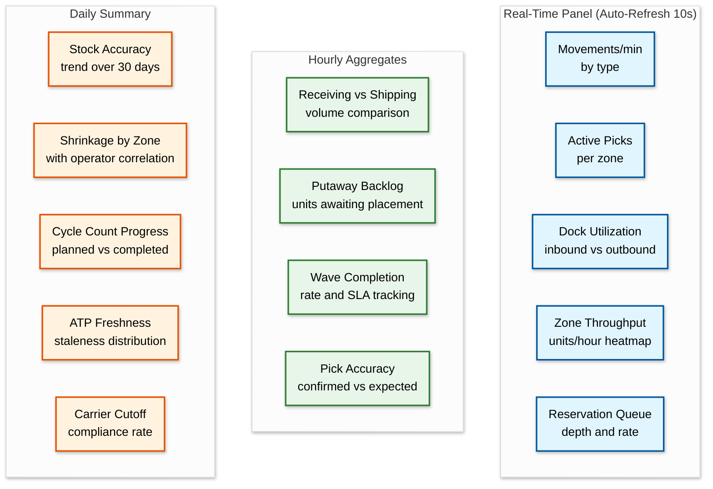
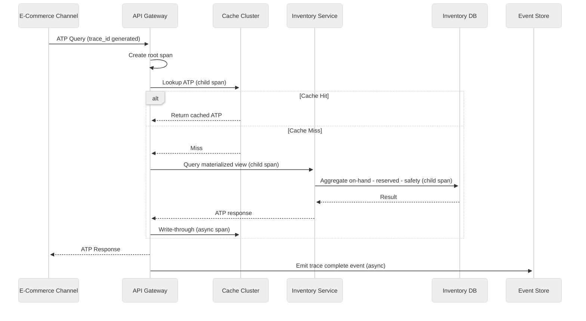

# Inventory Management System: Observability

## 1. Monitoring Strategy

### Four Pillars

Observability for an inventory management system extends beyond standard infrastructure monitoring into a domain where business metrics often provide earlier warning signals than system metrics. A warehouse operator waiting 500ms for a pick confirmation is idle time that compounds across millions of daily operations. A 0.1% stock accuracy degradation means 50,000 incorrect bin records. The observability strategy rests on four pillars:

1. **Metrics**: Quantitative signals covering both infrastructure health (latency, throughput, error rates) and business health (stock accuracy, fill rate, shrinkage rate).
2. **Logs**: Structured event records capturing every inventory mutation with sufficient context for forensic analysis and audit compliance.
3. **Traces**: Distributed traces following inventory operations across service boundaries --- from order placement through reservation, wave planning, picking, packing, and shipping.
4. **Business Signals**: Inventory-specific indicators that do not map to traditional system metrics --- cycle count variance trends, dead stock accumulation, reservation conversion anomalies, and costing drift.

---

## 2. Metrics

### System Metrics (USE Method)

| Resource | Utilization | Saturation | Errors |
|----------|-------------|------------|--------|
| **Inventory Service** | Mutation rate per pod, CPU/memory per instance | Write queue depth, connection pool active/max | Failed mutations, constraint violations, timeout rate |
| **Reservation Engine** | Active reservations / max capacity, lock contention rate | Reservation queue depth, pending reservation age | Double-reservation attempts, TTL expirations, deadlocks |
| **Costing Engine** | Cost layer calculations per second, CPU per valuation batch | Recalculation backlog depth, pending cost events | Layer corruption errors, valuation mismatches, rounding drift |
| **Event Store** | Write throughput, disk I/O utilization | Replication lag, compaction backlog | Write failures, hash chain verification errors |
| **Cache Cluster** | ATP cache hit rate, memory usage per shard | Eviction rate, fragmentation ratio | Stale entry serves, serialization errors, connection failures |
| **Message Queue** | Consumer throughput per topic, partition lag | Oldest unprocessed message age, consumer group rebalance frequency | Dead letter queue size, deserialization failures |

### System Metric Alerts

| Metric | Description | Alert Threshold |
|--------|-------------|-----------------|
| `inventory_mutation_latency_p99` | Time to persist an inventory movement (receipt, pick, putaway, transfer, adjustment) end-to-end | > 100ms |
| `reservation_processing_rate` | Reservations processed per second across all warehouse partitions | < 1,000/s during peak hours |
| `atp_cache_hit_ratio` | Percentage of ATP queries served from cache without hitting the materialized view | < 95% |
| `event_processing_lag` | Delay between event emission and consumer processing (event store to projections) | > 5 seconds |
| `db_connection_pool_utilization` | Active connections as percentage of pool maximum across all inventory database shards | > 80% |
| `cost_layer_recalculation_latency` | Time to recalculate weighted average cost or process a FIFO layer after a receipt | > 200ms |
| `hash_chain_verification_rate` | Percentage of audit records passing cryptographic hash chain verification | < 100% (any failure is critical) |

### Business Metrics (RED Method)

| Metric | Description | Alert Threshold |
|--------|-------------|-----------------|
| `stock_accuracy_rate` | Percentage of SKU-locations where system quantity matches physical count (measured via cycle counts) | < 99.5% |
| `reservation_conversion_rate` | Percentage of reservations that convert to fulfilled orders (vs. expired or cancelled) | Monitor for anomalies; baseline varies by channel |
| `stockout_rate` | Percentage of active SKUs with zero available-to-promise inventory | > 2% of active catalog |
| `inventory_turn_ratio` | Cost of goods sold divided by average inventory value; measures how quickly inventory sells through | Below target (varies by product category) |
| `shrinkage_rate` | Unexplained inventory loss as percentage of total inventory value (adjustments without matching receipts/shipments) | > 0.5% in any rolling 30-day window |
| `cycle_count_variance` | Average absolute variance found during cycle counts as percentage of expected quantity | > 1% |
| `fill_rate` | Percentage of customer orders fulfilled completely from available stock without backorder or partial shipment | < 98% |
| `dead_stock_percentage` | Percentage of SKUs with zero outbound movements in the last 90 days | > 5% of active SKU catalog |

### Costing Metrics

| Metric | Description | Alert Threshold |
|--------|-------------|-----------------|
| `cost_layer_depth` | Average number of active cost layers per SKU (FIFO/LIFO); deep stacks indicate slow-moving receipts | > 50 layers per SKU |
| `wac_recalculation_frequency` | Number of weighted-average-cost recalculations triggered per minute | > 10,000/min (indicates excessive receipt churn) |
| `standard_cost_variance_pct` | Percentage difference between standard cost and actual cost across all movements in the period | > 5% (triggers variance analysis) |
| `cost_layer_age_p95` | 95th percentile age of oldest unconsumed cost layer; stale layers indicate receiving/costing mismatches | > 180 days |

---

## 3. Dashboards

### Operations Dashboard



### Financial Dashboard

| Panel | Content | Refresh Interval |
|-------|---------|-----------------|
| **Inventory Valuation Summary** | Total inventory value by costing method (FIFO, WAC, standard); breakdown by warehouse and product category; trend over 12 months | Daily |
| **COGS Trend** | Cost of goods sold by period with variance against budget; drill-down by product category and warehouse | Daily |
| **Cost Variance Report** | Standard cost vs. actual cost variance by SKU category; purchase price variance; manufacturing variance | Weekly |
| **Slow-Moving Inventory** | SKUs with inventory turn below threshold; aging analysis (30/60/90/180 days); carrying cost impact | Weekly |
| **Write-Off Summary** | Adjustments categorized by reason code (damage, expiry, shrinkage, obsolescence); trend and comparison to budget | Daily |

### Capacity Dashboard

| Panel | Content | Refresh Interval |
|-------|---------|-----------------|
| **Warehouse Utilization** | Percentage of bin locations occupied by zone; cubic utilization vs. slot utilization; trend with forecast | Hourly |
| **Bin Fill Rates** | Distribution of bin fill percentages; over-stocked bins (>95%) and under-stocked bins (<20%) | Hourly |
| **Worker Productivity** | Units processed per operator per hour by operation type (pick, pack, putaway); comparison across shifts | End of shift |
| **Pick Path Efficiency** | Average distance traveled per pick; comparison of actual vs. optimal path; zone-level heatmap | Daily |
| **Dock Door Scheduling** | Inbound/outbound dock utilization; average dwell time; trailer wait time; appointment adherence rate | Real-time |

---

## 4. Distributed Tracing

### Critical Trace Paths

Traces follow complete inventory workflows across service boundaries. Each trace captures the end-to-end latency and identifies bottleneck services within the flow.

| # | Trace Path | Key Spans | End-to-End SLA |
|---|-----------|-----------|---------------|
| 1 | **Order-to-Ship** | Order → reserve_stock → wave_plan → assign_picks → confirm_pick → confirm_pack → generate_label → ship_confirmed | < 4 hours |
| 2 | **Receive-to-Stock** | check_in_trailer → dock_assigned → confirm_receipt → quality_check → calculate_cost → assign_bin → putaway_confirmed → update_atp | < 2 hours |
| 3 | **ATP Query** | check_availability → cache_lookup → (HIT: return / MISS: query_materialized_view → aggregate → cache_write) → atp_response | < 50ms |

### Trace Architecture



**Trace Propagation**: Every request generates a `trace_id` at the API gateway, propagated via HTTP headers (`X-Trace-Id`) and message queue metadata. Child spans are annotated with `warehouse_id`, `zone_id`, `sku_id`, `movement_type`, and `costing_method` for domain-specific context.

---

## 5. Structured Logging

### Log Schema

All services emit structured JSON logs with a consistent schema. PII is masked at the emission point.

```
InventoryLogEntry:
    timestamp:       ISO-8601 UTC timestamp
    service:         emitting service name (e.g., "inventory-service", "reservation-engine")
    trace_id:        distributed trace identifier
    span_id:         current span identifier
    level:           ERROR | WARN | INFO | DEBUG
    event:           structured event name (e.g., "stock_adjusted", "reservation_created")
    warehouse_id:    warehouse context
    zone_id:         zone context (if applicable)
    sku_id:          affected SKU
    movement_type:   RECEIPT | PICK | PUTAWAY | TRANSFER | ADJUSTMENT | RESERVATION
    quantity:         units affected (absolute value)
    operator_id:     pseudonymized operator identifier
    duration_ms:     operation duration in milliseconds
    error_code:      standardized error code (null if success)
    metadata:        operation-specific key-value pairs
```

### Log Levels Strategy

| Level | Usage | Destination | Retention |
|-------|-------|-------------|-----------|
| **ERROR** | Failed inventory mutations, constraint violations (negative stock), cost layer corruption, security events (unauthorized access, segregation-of-duty violation), hash chain verification failure | Immediate alert via pager; indexed for search | 1 year |
| **WARN** | High mutation latency (p99 breach), reservation queue depth above threshold, ATP cache miss rate spike, approaching rate limits, cycle count variance above 2%, event processing lag > 5s | Dashboard metric; aggregated alert if sustained > 5 minutes | 6 months |
| **INFO** | Inventory movement lifecycle events (received, picked, packed, shipped), reservation created/fulfilled/expired, cost layer created/consumed, cycle count completed, wave generated | Searchable log store; audit compliance queries | 90 days (7 years for audit-relevant events) |
| **DEBUG** | Full request/response payloads (cost data masked), cache lookup details, bin assignment algorithm decisions, wave planning optimization steps, ATP calculation breakdown | Staging and development only; never in production | 7 days |

---

## 6. Alerting Strategy

### Alert Tiers

| Tier | Response Time | Channel | Examples |
|------|--------------|---------|----------|
| **P1 - Critical** | 5 minutes | PagerDuty + Phone call | Stock going negative for any SKU-location; reservation engine unresponsive; cost layer corruption detected; hash chain verification failure; event store write failures |
| **P2 - High** | 15 minutes | Slack alert channel + PagerDuty | ATP cache hit rate < 90%; event processing lag > 30 seconds; cycle count variance > 5% for any warehouse; reservation queue depth > 10K; costing engine latency p99 > 1s |
| **P3 - Medium** | 1 hour | Slack operations channel | Shrinkage rate above 0.5% threshold; putaway backlog > 2 hours old; dead stock percentage increase > 1% week-over-week; dock utilization consistently > 90%; fill rate drops below 98% |
| **P4 - Low** | Next business day | Email digest | Reporting pipeline delays; minor stock accuracy variance trends; slow-moving inventory approaching threshold; cost layer depth increasing for specific SKUs |

### Runbook: ATP Cache Failure

```
SYMPTOM:  atp_cache_hit_ratio drops below 90%; ATP query latency
          p99 exceeds 200ms; e-commerce checkout errors increase.

DIAGNOSIS:
  1. Check cache cluster health: memory utilization, eviction rate,
     connection count per shard
  2. Verify cache invalidation event pipeline is processing
     (check consumer lag on ATP-update topic)
  3. Check if a bulk inventory operation (wall-to-wall count,
     mass receipt) is flooding cache invalidations
  4. Verify materialized view query performance (may be degraded
     if underlying inventory tables are under heavy write load)

MITIGATION:
  1. If cache cluster is unhealthy: failover to standby cluster
  2. If invalidation storm: throttle cache invalidation consumer;
     serve slightly stale ATP (< 30s) during recovery
  3. If materialized view slow: scale read replicas; consider
     serving from last-known-good ATP snapshot
  4. Communicate to e-commerce team if ATP freshness degrades
     beyond 60 seconds

RESOLUTION:
  1. Restore cache cluster to full health
  2. Verify cache hit ratio returns to > 95%
  3. Run ATP reconciliation to ensure cached values match
     current materialized view
  4. Post-incident: review cache sizing and invalidation strategy
```

### Runbook: Reservation Queue Backup

```
SYMPTOM:  reservation_queue_depth > 10K; processing p99 > 5s;
          order placement failures increase.

DIAGNOSIS:
  1. Check reservation engine pod health and scaling status
  2. Verify database lock contention on hot SKUs
  3. Check if flash sale is driving abnormal reservation volume

MITIGATION:
  1. Scale reservation engine horizontally (add pods)
  2. Hot-SKU contention: enable distributed counter mode
  3. Flash sale: activate pre-allocated reservation pool
  4. Increase reservation TTL to reduce retry storms

RESOLUTION:
  1. Queue depth < 100; processing latency p99 < 100ms
  2. Verify no reservations lost; clean up orphaned reservations
  3. Post-incident: review capacity plan for promotional events
```

### Runbook: Cost Layer Inconsistency

```
SYMPTOM:  cost_layer_verification detects mismatch between sum
          of cost layers and total inventory valuation.

DIAGNOSIS:
  1. Identify affected SKUs/warehouses from verification output
  2. Check event store for recent cost events on affected SKUs
  3. Verify costing engine processed events in order
  4. Compare cost layer state against event store replay

MITIGATION:
  1. Flag affected SKUs in financial reporting as under review
  2. Freeze cost adjustments on affected SKUs until resolved
  3. Run event store replay to rebuild cost layers from truth

RESOLUTION:
  1. Rebuilt cost layers match event store replay exactly
  2. Post corrective journal entry if valuation was misstated
  3. Root cause: fix event ordering or idempotency bug
```

### Runbook: Negative Stock Detected

```
SYMPTOM:  SKU-location quantity drops below zero; constraint
          violation alert fires.

DIAGNOSIS:
  1. Identify the movement that caused the negative (pick,
     adjustment, or transfer)
  2. Check for concurrent operations (race condition)
  3. Verify reservation engine state consistency
  4. Check for stale cache serving outdated availability

MITIGATION:
  1. Freeze the SKU-location for further picks
  2. Race condition: identify offsetting movement to resolve
  3. No offset expected: emergency adjustment to zero
     (requires supervisor approval)

RESOLUTION:
  1. SKU-location quantity >= 0; root cause identified
  2. Scan for similarly affected SKU-locations
  3. Verify no customer orders were double-fulfilled
```

---

## 7. Health Checks

### Service Health

Each service exposes a `/health` endpoint returning structured status:

| Check | Description | Failure Action |
|-------|-------------|---------------|
| **Liveness** | Service process is running and responsive | Restart container |
| **Readiness** | Service can accept traffic (database connected, cache reachable, queue consumer active) | Remove from load balancer; do not route traffic |
| **Dependency health** | Status of each downstream dependency (database, cache, queue, event store) | Degrade gracefully; serve from cache if database unavailable; queue writes if event store unavailable |

### Data Freshness Checks

| Check | Frequency | Threshold | Action on Failure |
|-------|-----------|-----------|-------------------|
| **ATP cache freshness** | Every 30 seconds | No cached entry older than 60 seconds | Trigger cache refresh; alert if refresh fails |
| **Materialized view lag** | Every minute | View reflects events within 10 seconds of real-time | Increase projection consumer throughput; alert if lag grows |
| **Event store replication** | Every 30 seconds | Replica lag < 5 seconds | Alert; prepare for failover if lag exceeds 30 seconds |
| **Cycle count schedule adherence** | Hourly | Planned counts for current day > 80% completed by end of shift | Alert warehouse supervisor; adjust next-day schedule |

### Cross-System Reconciliation Checks

| Reconciliation | Frequency | Comparison | Tolerance |
|---------------|-----------|------------|-----------|
| **Inventory vs. ERP** | Daily (end of business) | Sum of on-hand quantities by SKU-warehouse in inventory system vs. ERP inventory module | < 0.1% variance |
| **Cost layers vs. GL** | Daily | Total inventory valuation from cost layers vs. general ledger inventory account balance | Exact match (zero tolerance) |
| **Reservations vs. Orders** | Hourly | Active reservations in reservation engine vs. open orders in order management system | < 0.5% orphaned reservations |
| **Event store vs. Projections** | Every 15 minutes | Latest event sequence number processed by each projection vs. latest in event store | Lag < 1,000 events |
| **Physical count vs. System** | Per cycle count batch | Counted quantity vs. system on-hand at count snapshot time | Variance logged and investigated if > 1% |

---

## 8. Summary

Observability for inventory management layers system metrics (USE/RED methods) with domain-specific business signals --- stock accuracy, shrinkage rate, fill rate, costing integrity --- that directly map to operational and financial KPIs. Distributed tracing across order-to-ship and receive-to-stock workflows surfaces bottlenecks invisible to single-service metrics. Tiered alerting with inventory-specific runbooks enables on-call teams to triage domain incidents (negative stock, cost layer corruption, ATP staleness) without requiring deep warehouse management expertise.
