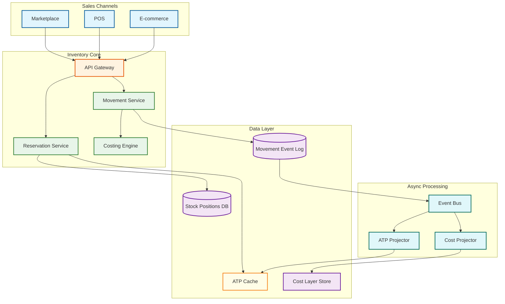

# Interview Guide

## Problem Statement

"Design an inventory management system that tracks stock across multiple warehouses, supports different costing methods (FIFO, LIFO, WAC), and provides real-time availability to e-commerce channels. The system should handle flash-sale traffic, support omnichannel retail, and maintain an auditable movement ledger for financial compliance."

This problem tests a candidate's ability to blend domain modeling (cost layers, lot tracking, reservation semantics) with distributed systems design (high-concurrency reservations, materialized ATP views, event-sourced ledgers). It is a strong differentiator between mid-level and senior/staff engineers because the domain complexity is high—simple CRUD approaches collapse under the weight of costing, traceability, and concurrency requirements.

---

## Clarifying Questions

### Essential Questions to Ask

| # | Question | Why It Matters |
|---|----------|----------------|
| 1 | How many warehouses and what is the SKU catalog size? | Determines partitioning strategy—100 warehouses with 5M SKUs is fundamentally different from 3 warehouses with 10K SKUs |
| 2 | Which costing methods must be supported (FIFO, LIFO, WAC, FEFO)? | Cost layer data model and consumption logic vary significantly; FEFO adds expiry tracking |
| 3 | Is this omnichannel (retail POS + e-commerce + wholesale + marketplace)? | Omnichannel requires channel allocation rules and ATP segmentation |
| 4 | Do we need real-time Available-to-Promise or is batch (hourly) acceptable? | Real-time ATP demands event-driven materialized views and caching infrastructure |
| 5 | What industries does this serve—perishables, pharma, general merchandise? | Pharma needs lot tracking and recall traceability; perishables need FEFO and expiry alerts |
| 6 | Is this multi-tenant (SaaS) or single-tenant (enterprise)? | Multi-tenant adds data isolation, tenant-specific configuration, and noisy-neighbor concerns |
| 7 | Do we need pick-pack-ship workflows or just abstract stock tracking? | Pick-pack-ship adds location-level granularity (aisle/bin/shelf) and task assignment |
| 8 | What is the peak reservation rate during flash sales? | Determines whether naive locking suffices or reservation bucketing is required |
| 9 | Do we need demand forecasting and automatic reorder, or just manual reorder points? | Forecasting adds an ML pipeline; reorder points are rule-based and simpler |
| 10 | How many sales channels consume inventory concurrently? | Affects contention on shared stock pools and whether channel-specific allocation is needed |
| 11 | What is the acceptable tolerance for stock inaccuracy? | Drives cycle counting frequency, safety stock buffers, and reconciliation workflows |
| 12 | Do we need cross-docking or flow-through capabilities? | Cross-docking means goods bypass storage—different movement types and location semantics |
| 13 | What are the audit and compliance requirements (SOX, FDA 21 CFR Part 11)? | Immutable ledgers, electronic signatures, and retention policies add architectural constraints |

---

## Solution Walkthrough

### Phase 1: Core Inventory Model (15 min)

Begin by establishing the foundational data model. Draw these core entities on the whiteboard:

- **SKU Master** — product identifier, description, unit of measure, category, costing method
- **Location Hierarchy** — warehouse > zone > aisle > rack > bin (tree structure)
- **Stock Position** — the quantity of a specific SKU at a specific location, with status (available, reserved, damaged, quarantined)
- **Inventory Movement** — every change to stock position is recorded as a movement event with type (receive, pick, transfer, adjust, return), quantity, timestamp, and reference

Explain the cardinal rule: stock positions are never updated directly. Every mutation is an inventory movement event that produces a new stock position as a derived state. This is the event-sourced foundation.

```
FUNCTION process_movement(movement):
    VALIDATE movement against business rules
    APPEND movement to event log
    UPDATE source stock position (decrement)
    UPDATE destination stock position (increment)
    PUBLISH InventoryMovementEvent to event bus
    UPDATE ATP materialized view
    UPDATE cost layers if movement affects valuation
```

Walk through a simple receive flow: a purchase order arrives at the warehouse dock, goods are inspected, a RECEIVE movement is created, stock position at the receiving location increments, and an event propagates to update ATP.

### Phase 2: Reservation and ATP Engine (10 min)

Layer the reservation model on top of the stock foundation:

- **Soft Reservation** — temporary hold with a TTL (e.g., 10 minutes for cart hold), auto-expires
- **Hard Reservation** — confirmed hold tied to a paid order, released only by pick or cancellation
- **Allocation** — assignment of a reservation to a specific warehouse and location for fulfillment

Derive the ATP formula and draw it prominently:

```
ATP = on_hand - reserved - allocated + in_transit + on_order (within lead time)
```

Discuss the caching strategy: ATP is computed per SKU per warehouse and stored in a distributed cache. Every movement event triggers an async update to the cached ATP value. Product pages read from cache, never from the transactional database.

For flash-sale scenarios, introduce reservation bucketing: pre-partition 10,000 reservable units into 100 buckets of 100, each assigned to a reservation processor. This eliminates the single-row contention bottleneck.

### Phase 3: Costing Engine (5 min)

Introduce cost layers as a first-class entity:

- Each purchase receipt creates a **cost layer**: {SKU, receipt_date, quantity, unit_cost, remaining_quantity}
- When goods are sold, the costing method determines which layer to consume
- **FIFO**: consume the oldest layer first (dequeue from head)
- **LIFO**: consume the newest layer first (dequeue from tail)
- **WAC**: maintain a weighted average cost, updated on each receipt
- **FEFO**: consume the layer with the earliest expiry date first

Show pseudocode for FIFO consumption:

```
FUNCTION consume_fifo(sku, quantity_needed):
    layers = GET cost_layers(sku) ORDER BY receipt_date ASC
    total_cost = 0
    remaining = quantity_needed
    FOR layer IN layers:
        consumed = MIN(layer.remaining_quantity, remaining)
        total_cost += consumed * layer.unit_cost
        layer.remaining_quantity -= consumed
        remaining -= consumed
        IF remaining == 0: BREAK
    RETURN total_cost
```

### Phase 4: Scale and Reliability (10 min)

Address the scaling dimensions:

- **Partitioning**: partition stock positions by warehouse_id for write isolation; partition ATP cache by SKU hash for read distribution
- **Event sourcing**: the movement event log is the system of record; stock positions are projections that can be rebuilt from the log
- **Multi-warehouse ATP aggregation**: each warehouse maintains its own ATP; a network-level aggregation service sums across warehouses for the product catalog, updated via event streaming
- **Hot SKU handling**: detect SKUs with abnormally high reservation rates and dynamically increase their bucket count
- **Consistency model**: strong consistency within a single warehouse (movements are serialized per SKU-location), eventual consistency across warehouses for aggregated ATP



---

## Deep Dive Topics

### Topic 1: How would you handle a flash sale where 100K users try to reserve the same SKU simultaneously?

**Expected answer:**

The core problem is contention on a single SKU's stock row. A SELECT FOR UPDATE serializes all 100K requests, giving ~1K TPS at best. The solution involves multiple layers:

1. **Pre-partitioned reservation buckets** — before the sale, split 10,000 units into 100 buckets of 100 units each. Each bucket is owned by a stateless reservation worker. Incoming requests are hash-routed to a bucket. Each worker decrements its local bucket without cross-bucket coordination.
2. **Token-based reservation** — issue pre-minted reservation tokens (like concert tickets). Users claim a token, then have N minutes to complete payment. Tokens that expire return to the pool.
3. **Queue-based backpressure** — place reservation requests into a queue with a consumer pool. Reject requests beyond a threshold with a "sold out" response rather than letting them pile up.
4. **Optimistic concurrency with retry** — use version-stamped stock rows. On conflict, retry with exponential backoff (limited retries).
5. **Graceful degradation** — show "limited stock" instead of exact counts. Once stock drops below a threshold, switch the UI to a waitlist model.

### Topic 2: How do you ensure inventory accuracy without shutting down the warehouse for a full count?

**Expected answer:**

Full physical inventory counts halt operations for 1-3 days—unacceptable for 24/7 e-commerce fulfillment. The modern approach is **perpetual inventory with cycle counting**:

1. **ABC classification** — classify SKUs by movement velocity and value. A-items (top 20% by value) are counted monthly, B-items quarterly, C-items annually.
2. **Blind counting** — the counter does not see the system quantity, preventing confirmation bias. They scan and count, then the system compares.
3. **Variance thresholds** — if the physical count is within 2% of system count, auto-adjust. If beyond 2%, flag for investigation by a supervisor.
4. **Count scheduling** — schedule counts during low-traffic windows. Never count a location that has open pick tasks.
5. **Root cause tracking** — every adjustment records the suspected cause: shrinkage, receiving error, mis-pick, damage. This data feeds process improvement.

### Topic 3: How would you implement omnichannel ATP across 500 warehouses with sub-50ms latency?

**Expected answer:**

Direct database queries across 500 warehouses are impossible at e-commerce latency requirements. The architecture uses event-driven materialized views:

1. **Per-warehouse ATP projection** — each warehouse has a local projector that consumes movement events and maintains ATP per SKU in a local cache.
2. **Regional aggregation** — warehouses are grouped into regions. A regional aggregator sums per-warehouse ATP into a regional ATP view.
3. **Edge cache layer** — ATP values are pushed to a distributed cache cluster close to the API gateway. Product page queries hit this cache, never the warehouse databases.
4. **Channel allocation rules** — business rules can reserve portions of ATP for specific channels (e.g., 70% e-commerce, 20% wholesale, 10% marketplace). These are applied as filters on the cached ATP.
5. **Staleness tolerance** — ATP shown on product pages can be 5-10 seconds stale. The reservation service validates against the authoritative source at checkout time. If the cached ATP was wrong, the user gets a graceful "stock just sold out" message.

### Topic 4: What happens when system inventory says 100 units but physical count finds only 95?

**Expected answer:**

This is an **inventory variance** scenario requiring a structured resolution workflow:

1. **Recount** — if the variance exceeds the threshold, request a recount by a different operator to rule out counting error.
2. **Variance investigation** — categorize the likely cause: shrinkage (theft/pilferage), spoilage/damage, receiving error (vendor short-shipped), pick error (wrong item sent to customer), or system bug.
3. **Adjustment approval** — create an inventory adjustment movement of -5 units. Adjustments below a dollar threshold auto-approve; above threshold requires manager approval.
4. **Cost layer impact** — the adjustment must consume cost layers (using the configured costing method) so that COGS and inventory valuation remain accurate. Five units at FIFO cost are written off.
5. **Reconciliation audit trail** — the adjustment movement references the cycle count ID, the investigator, the suspected cause, and the approval chain. This is required for SOX compliance.

### Topic 5: How do you handle a product recall that requires tracing all units from a specific lot?

**Expected answer:**

Lot traceability requires a purpose-built data model:

1. **Lot/batch tracking** — every received unit is assigned to a lot (supplier lot number + internal lot ID). The lot carries attributes: manufacture date, expiry date, supplier, country of origin.
2. **Forward traceability** — from a lot, trace to all movement events, then to all orders that consumed units from that lot. This answers: "Which customers received product from lot X?"
3. **Backward traceability** — from a customer order, trace back through the pick movement to the lot, then to the receiving event and supplier. This answers: "Where did this customer's product come from?"
4. **Recall workflow** — quarantine all remaining units of the affected lot (status change to QUARANTINED, excluded from ATP). Generate a list of affected customers for notification. Create return authorizations for recalled units.
5. **Recall status tracking** — track recall progress: units quarantined, units returned, units destroyed, units unaccounted for. Report to regulatory authorities as required.

---

## Common Mistakes

| # | Mistake | Why It's Problematic |
|---|---------|---------------------|
| 1 | Using a single database row with `UPDATE quantity = quantity - 1` for reservations | Creates a serialization bottleneck that caps throughput regardless of hardware scale |
| 2 | Treating inventory as mutable state instead of event-sourced movements | Loses the audit trail, makes cost calculation impossible, and prevents point-in-time queries |
| 3 | Ignoring the costing impact of every movement | Every pick, transfer, adjustment, and return affects inventory valuation and COGS |
| 4 | Designing ATP as a synchronous cross-warehouse query | At scale, this creates unacceptable latency and puts load on transactional databases |
| 5 | No role-based access control for inventory adjustments | Adjustments directly affect financial statements; uncontrolled access is a compliance violation |
| 6 | Forgetting in-transit inventory in ATP calculation | Goods moving between warehouses are neither at source nor destination but are still owned inventory |
| 7 | Not handling negative stock edge cases | Race conditions can drive stock below zero; the system must detect, alert, and reconcile |
| 8 | Ignoring the physical-digital gap (shrinkage, misplacement) | System inventory will always diverge from physical reality; the design must accommodate this |
| 9 | Over-engineering costing when the interviewer only asked for stock tracking | Read the room—start simple and add costing only if the interviewer asks or the problem demands it |
| 10 | Not discussing data partitioning strategy for multi-warehouse | Without partitioning, a single hot warehouse or hot SKU can degrade the entire system |

---

## Evaluation Criteria

### Junior (L3-L4)

- Designs basic CRUD for inventory with a stock table (SKU, warehouse, quantity)
- Implements simple reservation using database locks (SELECT FOR UPDATE)
- Aware that FIFO exists as a costing method but does not detail the data model
- May not consider concurrent access patterns or flash-sale scenarios
- Acceptable: a working single-warehouse design with basic reservation

### Mid-Level (L5)

- Uses event-sourced movements as the foundation rather than direct state mutation
- Implements reservation with TTL-based expiration for soft holds
- Introduces ATP as a cached, pre-computed value rather than a live query
- Discusses basic partitioning by warehouse for write isolation
- Mentions cycle counting as an accuracy mechanism
- Acceptable: a multi-warehouse design with caching and basic event flow

### Senior (L6)

- Designs a full costing engine with cost layers and multiple method support
- Architects multi-warehouse ATP with event-driven materialized views
- Articulates consistency vs. availability trade-offs for different operations
- Designs cycle counting with ABC classification and variance workflows
- Discusses lot tracking and traceability for regulated industries
- Acceptable: a production-grade design with clear trade-off reasoning

### Staff (L7+)

- Designs cross-channel allocation algorithms with configurable optimization objectives
- Integrates demand forecasting for proactive replenishment
- Architects cost-optimal fulfillment routing across warehouse network
- Handles organizational complexity: multi-tenant, multi-region, multi-currency
- Discusses operational concerns: deployment strategy, migration from legacy ERP, observability
- Acceptable: a system that addresses business and organizational complexity, not just technical

---

## Related Systems

| System | Relationship to Inventory |
|--------|--------------------------|
| Order Management System | Consumes ATP, creates reservations, triggers allocation and pick |
| Procurement System | Triggers replenishment purchase orders based on reorder points |
| ERP / General Ledger | Receives inventory valuation and COGS entries for financial reporting |
| Warehouse Management System | Manages physical operations: put-away, picking, packing, shipping |
| Transportation Management | Coordinates shipments, provides in-transit visibility for ATP |
| Product Information Management | Provides SKU master data, categories, and attributes |
| Demand Forecasting | Provides demand signals for safety stock and reorder calculations |

---

## Trade-off Discussions

| # | Trade-off | Considerations |
|---|-----------|---------------|
| 1 | **Strong consistency vs. low latency for ATP** | Product pages need sub-50ms responses (favor caching/eventual consistency). Checkout must validate against authoritative stock (favor strong consistency). Use different consistency levels for different operations. |
| 2 | **Pre-allocated channel buckets vs. single pool with priority** | Buckets prevent one channel from starving another but reduce overall utilization. A single pool maximizes utilization but requires priority logic and can lead to channel starvation during spikes. Hybrid: soft allocation with overflow. |
| 3 | **Event sourcing vs. state-based for inventory** | Event sourcing provides full audit trail and enables multiple projections but increases storage and query complexity. State-based is simpler but loses history. For inventory, event sourcing is almost always the right choice due to compliance requirements. |
| 4 | **Centralized vs. distributed reservation** | Centralized is simpler to reason about but creates a single point of failure and a throughput ceiling. Distributed (per-warehouse reservation) scales but complicates cross-warehouse allocation. Use centralized for allocation decisions, distributed for execution. |
| 5 | **Real-time vs. batch costing updates** | Real-time costing ensures accurate COGS on every transaction but adds latency to movement processing. Batch costing (nightly) is simpler but means intraday reports show stale valuations. Compromise: real-time for high-value movements, batch for adjustments and transfers. |
