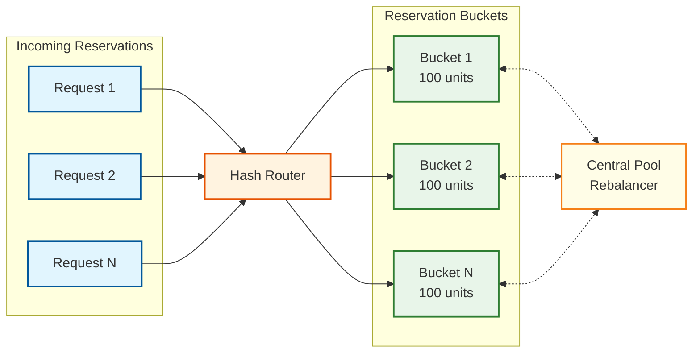

# Key Architectural Insights

## 1. Inventory Is an Event-Sourced Domain by Nature -- Every Unit Has a Provenance Chain

**Category:** System Modeling

**One-liner:** Inventory positions are derived state; the sequence of
movements (receive, transfer, pick, adjust) is the true source of truth.

**Why it matters:**

Most software systems store only current state -- when a user changes
their email, you overwrite the old one. Inventory is fundamentally
different. Every physical unit in a warehouse has a provenance: it was
received on a specific date, from a specific supplier, at a specific
per-unit cost, placed at a specific bin location. Every subsequent
touch -- a transfer to a different zone, a pick for an order, a cycle
count adjustment -- is a discrete event with business significance.
The current stock quantity at any location is merely a projection
derived from summing all inbound movements and subtracting all
outbound movements. Modeling inventory as mutable state (running
`UPDATE stock SET quantity = quantity - 1`) discards the causal chain
behind every change.

This is not an academic preference -- it is a regulatory and financial
requirement. SOX compliance demands a complete audit trail of inventory
changes with timestamps, actors, and authorization records. FDA
regulations (21 CFR Part 11) for pharmaceutical inventory require
electronic signatures on adjustments and full lot traceability. Even
outside regulated industries, any business carrying inventory needs to
answer point-in-time queries like "What was our total inventory
valuation on December 31?" or "How many units of SKU-4829 did we
receive from Supplier X in Q3?" These queries are trivial with an
event log and impossible with a mutable state table.

The architectural implication is that the movement event log is the
system of record. Every other data structure in the system -- stock
position tables, ATP caches, cost layer stacks, location heat maps --
is a read-model projection from that log. The event log enables
replay: if a cost layer calculation bug is discovered, fix the
projection logic and replay the event stream to produce corrected
valuations without touching the authoritative data.

```
EVENT LOG (source of truth)
  +---> Stock Position Projection (warehouse operations)
  +---> ATP Projection (e-commerce availability)
  +---> Cost Layer Projection (financial valuation)
  +---> Location Heat Map Projection (layout optimization)
```

The movement event log must be append-only, immutable, and durably
stored with replication. Corrections are modeled as new adjustment
movements referencing the original event, never as edits. This creates
a tamper-evident ledger satisfying auditors while enabling multiple
independent projections -- ATP for e-commerce, location view for
operations, cost view for finance -- each optimized for its queries.

The deeper lesson: recognize domains where history is intrinsic.
Inventory, financial transactions, healthcare records, and legal
documents all share this characteristic. When "why did this change?"
is as important as "what is the current value?", event sourcing is
the correct structural alignment between software and domain reality.

---

## 2. Reservation Is a Distributed Resource Allocation Problem -- Not a Database Lock

**Category:** Scalability

**One-liner:** Pre-partitioning inventory into reservation buckets
transforms a global lock bottleneck into embarrassingly parallel
decrements.

**Why it matters:**

The naive approach to inventory reservation is straightforward: execute
a SELECT FOR UPDATE on the stock row, check if quantity_available > 0,
decrement, and release the lock. At 10 concurrent reservations per
second, the lock hold time (5-20ms) creates negligible contention. But
during a flash sale where 50,000 users simultaneously attempt to
reserve the same limited-edition product, this serialization point
caps throughput at approximately 1,000 TPS regardless of hardware.
The constraint is the serial nature of locking, not machine speed. No
amount of vertical scaling resolves a fundamentally serial bottleneck.

The architectural insight is to reframe reservation as a distributed
resource allocation problem. Before the flash sale, pre-partition
10,000 available units into 100 buckets of 100 units each. Each bucket
is assigned to a stateless reservation worker. Incoming requests are
hash-routed (by session ID) to a specific bucket. Each worker
independently decrements its local counter without cross-bucket
coordination, transforming throughput from O(1) serial to O(N)
parallel. With 100 buckets, theoretical throughput reaches 100K TPS.



The trade-off is that the "available quantity" becomes eventually
consistent. When bucket #37 depletes, the global count is momentarily
inaccurate. This is acceptable for display -- showing "limited stock"
instead of an exact count. The critical invariant -- never over-selling
beyond total physical stock -- holds because each bucket's decrement
is strongly consistent within itself and the sum of all bucket
capacities equals total stock. Depleted buckets request rebalancing
from a central coordinator off the hot path.

This pattern generalizes to any hot counter with high concurrent
writes -- rate limiters, ticket sales, promotional code redemption.
The deeper lesson: when you identify a serialization bottleneck,
decompose it into independent parallel operations. Reservation
bucketing is sharding applied to a single logical counter. Edge cases
require attention: bucket exhaustion (fallback routing when a
customer hits an empty bucket), rebalancing without new serialization
points, and TTL-based expiry returning units to the pool.

---

## 3. ATP Is a Materialized View Problem -- Not a Query Problem

**Category:** Performance

**One-liner:** Computing Available-to-Promise on every request by
querying raw inventory data is architecturally untenable at
e-commerce scale.

**Why it matters:**

Available-to-Promise (ATP) is the quantity that can be promised to a
customer. The formula is deceptively simple:

```
ATP = on_hand - reserved - allocated + in_transit
    + on_order_within_lead_time
```

For a single SKU at a single warehouse, this is a trivial multi-table
join taking ~10ms. At the scale of a large retailer -- 5M SKUs, 500
warehouses, 100K product page views per second -- executing that many
cross-table queries against the transactional database produces
latency far beyond the 50ms threshold for responsive product pages
and competes with the write workload, creating cascading degradation.

The solution is to treat ATP as a continuously maintained materialized
view. Every inventory event (receive, reserve, ship) triggers an async
update to a pre-computed ATP value in a distributed cache. The query
service reads from cache with single-digit millisecond latency. This
shifts computation from read-time (expensive, frequent) to write-time
(cheap, infrequent). With a typical read-to-write ratio of 1000:1,
this trade-off is enormously favorable.

A dedicated ATP Projector subscribes to the inventory event stream,
recalculates the affected SKU-warehouse ATP, and writes it to cache.
For network-level ATP, a second-level aggregator sums per-warehouse
values. Cache entries carry a version number to detect and discard
stale out-of-order updates. A periodic reconciliation job compares
cached values against the source-of-truth event log and corrects any
drift caused by missed events or processing failures.

The key design decision is staleness tolerance. ATP on product listing
pages can be 5-10 seconds stale -- the reservation service validates
against authoritative stock at checkout. This separation -- eventually
consistent for browsing, strongly consistent for commitment -- allows
the read and write paths to scale independently. The general principle
extends beyond inventory: any metric that is expensive to compute,
frequently read, and tolerant of bounded staleness is a candidate for
event-driven materialized views.

---

## 4. Cost Layers Are the Financial Backbone -- Getting Them Wrong Means Restating Earnings

**Category:** Data Structures

**One-liner:** Each purchase creates a cost layer, and the costing
method determines which layer is consumed first, directly impacting
COGS and company valuation.

**Why it matters:**

When a retailer purchases 1,000 units at $10 in January and 1,000 at
$12 in March, selling 500 units produces different COGS depending on
the method. Under FIFO, COGS = $5,000 (500 at $10). Under LIFO, COGS
= $6,000 (500 at $12). This $1,000 difference in a trivial example
scales to millions for large retailers and directly impacts gross
profit, tax liability, and stock price.
Getting the costing wrong is not just a data error -- it triggers
financial restatement, regulatory scrutiny, and loss of investor
confidence.

The data structure is a per-SKU ordered collection where each entry
contains receipt reference, receipt date, original quantity, remaining
quantity, and unit cost. FIFO dequeues from the head (oldest first),
LIFO from the tail (newest first), FEFO by earliest expiry date.
Weighted Average Cost (WAC) maintains a single blended cost
recalculated on each receipt:

```
new_wac = (existing_qty * existing_wac + received_qty * received_cost)
          / (existing_qty + received_qty)
```

The consumption operation must be atomic and handle partial layer
consumption correctly. Selling 1,500 units under FIFO fully consumes
Layer 1 (1,000 at $10) and partially consumes Layer 2 (500 of 1,000
at $12). A crash between these updates corrupts cost data, requiring
transactional guarantees. Returns further complicate the model:
returned units must be added back to the correct cost layer or a new
layer at the original sale cost, depending on accounting policy.

```
FUNCTION consume_cost_layers(sku, quantity, method):
    IF method == FIFO:
        layers = GET layers ORDER BY receipt_date ASC
    ELSE IF method == LIFO:
        layers = GET layers ORDER BY receipt_date DESC
    ELSE IF method == FEFO:
        layers = GET layers ORDER BY expiry_date ASC

    total_cost = 0, remaining = quantity
    BEGIN TRANSACTION
        FOR layer IN layers:
            consumed = MIN(layer.remaining_qty, remaining)
            total_cost += consumed * layer.unit_cost
            layer.remaining_qty -= consumed
            remaining -= consumed
            IF remaining == 0: BREAK
        IF remaining > 0: RAISE InsufficientCostLayerError
    COMMIT TRANSACTION
    RETURN total_cost
```

Cost layers must be a first-class entity maintained in near-real-time
as a projection from the movement event stream. Computing on demand
turns month-end financial close into a multi-day batch job. Maintaining
cost layer state as a continuously updated projection enables real-time
valuation reports. The cost layer projector is among the most business-
critical components in the entire system.

For multi-tenant SaaS systems, different tenants may use different
costing methods, and some jurisdictions prohibit certain methods (LIFO
is not permitted under IFRS). The system must support per-tenant,
per-SKU costing method configuration. Changing the costing method
mid-year requires a revaluation event that recalculates all cost
layers from the beginning of the fiscal period under the new method --
a rare but high-stakes operation the architecture must accommodate.

---

## 5. The Physical-Digital Gap Is the Fundamental Challenge -- Shrinkage Is a Feature, Not a Bug

**Category:** Domain Modeling

**One-liner:** System inventory will always diverge from physical
inventory; the architecture must embrace this gap rather than
pretending it does not exist.

**Why it matters:**

Every inventory system faces a fundamental tension: the digital record
says 100 units are in Bin A-14-3, but physical reality might be 97
because 1 was damaged during put-away and unreported, 1 was stolen,
and 1 was placed in the wrong bin. This divergence -- shrinkage -- is
not an edge case. The National Retail Federation estimates annual
shrinkage at 1.4% of sales, exceeding $100 billion annually in the
US alone. A system assuming digital records perfectly reflect physical
reality produces phantom inventory (system says in stock, but it is
not there) leading to failed fulfillment and customer dissatisfaction.

The architectural response is cycle counting: continuous, statistical
sampling rather than periodic full-warehouse counts. The system must
support multiple counting strategies:

| Strategy | Description | When to Use |
|----------|-------------|-------------|
| ABC classification | Count frequency by value and velocity | Ongoing accuracy |
| Zone-based | Rotate through warehouse zones | Even location coverage |
| Triggered counting | Auto-schedule on anomaly detection | Reactive to discrepancies |
| Blind counting | Operator cannot see system quantity | Prevents confirmation bias |

A-items (top 20% by revenue impact) are counted weekly or monthly,
B-items quarterly, C-items annually. Triggered counting fires when a
picker reports an empty bin that the system shows stocked, or when
adjustment rates for a SKU exceed normal variance.

When a cycle count reveals variance, the system executes a structured
reconciliation. Variances within threshold (e.g., 2% or $50) auto-
adjust with a CYCLE_COUNT_ADJUSTMENT movement event, consuming the
appropriate cost layers. Variances exceeding threshold generate an
investigation task requiring supervisor verification, root cause
identification (shrinkage, receiving error, mis-pick, damage), and
explicit approval. Every adjustment feeds analytics: consistent
negative variances at a location may indicate systemic issues like
poor lighting, access control gaps, or receiving process failures.

The adjustment's financial impact is significant. A -5 unit adjustment
is a write-off that reduces inventory asset value and increases
shrinkage expense on the income statement. The cost layers of "lost"
units must be consumed per the configured costing method and posted to
the general ledger. This ties back to Insight #1 (event sourcing) and
Insight #4 (cost layers): the adjustment creates a movement event that
triggers cost layer consumption in the costing projection.

The broader lesson: any system modeling physical reality must include
a calibration mechanism. GPS has differential correction, sensor
networks have calibration routines, inventory has cycle counting.
Designing for this gap from the start -- safety buffers in ATP,
shrinkage provisions in financial projections, continuous counting
workflows -- produces a system robust to physical-world messiness.

---

## 6. Multi-Warehouse Fulfillment Is an Optimization Problem with Competing Objectives

**Category:** Algorithms

**One-liner:** Choosing which warehouse fulfills which order involves
minimizing shipping cost, maximizing freshness, balancing utilization,
and maintaining service levels -- simultaneously.

**Why it matters:**

When a customer orders a product available in multiple warehouses, the
naive approach -- pick the nearest -- optimizes a single dimension
while ignoring others. Fulfillment routing involves at least five
competing objectives: minimize shipping cost/time, maximize freshness
(oldest stock for FEFO/FIFO rotation), balance utilization across the
network, prefer complete-order fulfillment (avoid split shipments),
and maintain safety stock levels (do not drain a warehouse below its
reorder point).

These objectives frequently conflict. The nearest warehouse might have
the newest stock, peak utilization, and below-threshold stock levels.
The routing engine weighs objectives according to configurable
business priorities using a scoring function:

```
FUNCTION score_warehouse(warehouse, order):
    dist_score   = normalize(1 / shipping_distance(warehouse, order.dest))
    fresh_score  = normalize(oldest_stock_age(warehouse, order.sku))
    util_score   = normalize(1 - warehouse.current_utilization)
    compl_score  = 1.0 IF can fulfill entire order ELSE 0.5
    health_score = normalize(warehouse.stock - warehouse.reorder_point)

    RETURN w1 * dist_score + w2 * fresh_score
         + w3 * util_score + w4 * compl_score
         + w5 * health_score
```

Weights vary by product category (perishables weight freshness), by
season (holidays weight utilization balancing), and by business context
(promotions weight cost minimization). This configurability is
essential because fulfillment priorities shift constantly.

The general case is NP-hard (a facility assignment variant). For
individual orders, the scoring function is fast. For batch
optimization -- routing thousands of orders simultaneously -- the
problem requires linear programming relaxations, greedy heuristics, or
constraint satisfaction solvers. The batch optimizer runs periodically,
producing a fulfillment plan. Tight-SLA orders bypass batch and route
immediately via the greedy scorer.

The fulfillment routing engine should be a pluggable strategy with a
clean interface: given an order and candidate warehouses, return a
ranked list of fulfillment options with scores. This allows swapping
strategies without modifying the core inventory system and enables A/B
testing -- route halves of traffic through different strategies,
measure shipping cost, speed, and split-shipment rate. Small routing
improvements compound across millions of orders.

If the selected warehouse cannot fulfill (stock discrepancy during
picking), the system must re-route within seconds. The scoring
function should pre-compute next-best alternatives at original routing
time rather than recomputing during failure recovery. This adds modest
memory overhead but provides critical resilience when physical reality
deviates from digital records -- which, as Insight #5 establishes, is
not a question of "if" but "when."
