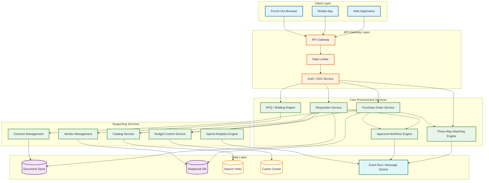
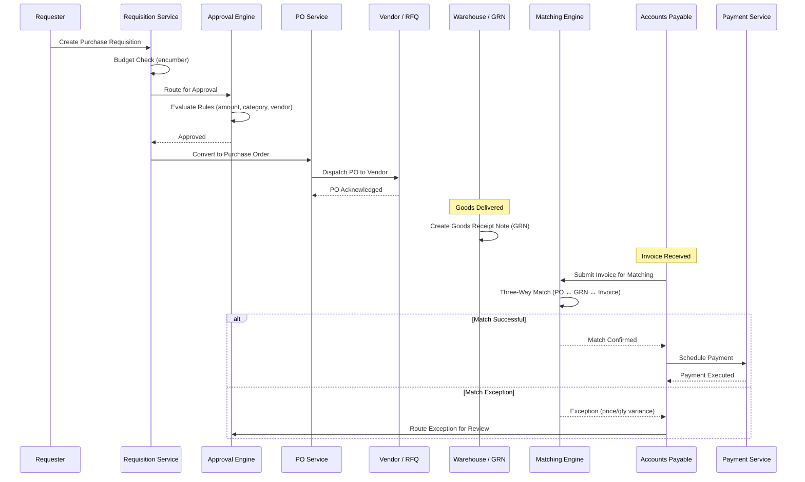

# Procurement System Design (Procure-to-Pay / P2P)

## System Overview

A Procurement System---often called a Procure-to-Pay (P2P) platform---orchestrates the entire purchasing lifecycle from initial need identification through payment disbursement. Systems like Coupa, SAP Ariba, and Jaggaer manage purchase requisitions, multi-level approvals, vendor relationships, competitive bidding (RFQ/RFP), purchase order lifecycle, goods receipt, three-way invoice matching, and spend analytics across thousands of cost centers and legal entities. The core engineering challenge is building a workflow engine that enforces complex, organization-specific approval hierarchies and budget controls while maintaining the flexibility to handle exceptions, amendments, and multi-currency transactions across global supply chains. Unlike consumer-facing systems optimized for throughput, procurement platforms are optimized for correctness, auditability, and policy compliance---every state transition must be traceable, every approval recorded, and every financial commitment reconcilable against budgets and contracts.

---

## Key Characteristics

| Characteristic | Description |
|---------------|-------------|
| **Read/Write Pattern** | Write-heavy for document creation (requisitions, POs, invoices, GRNs); read-heavy for approvals, status tracking, spend dashboards, and vendor lookups |
| **Latency Sensitivity** | Moderate---users expect sub-second UI responses, but workflow transitions (approvals, matching) can tolerate 2--5 second processing; batch operations (settlement, analytics) run asynchronously |
| **Consistency Model** | Strong consistency for financial documents (POs, invoices, budget commitments); eventual consistency for analytics, vendor scores, and catalog search indexes |
| **Data Volume** | Medium-to-High---large enterprises generate 500K--2M purchase orders/year, 5M+ invoices, and millions of line items; contract repositories grow to hundreds of thousands of documents |
| **Architecture Model** | Event-driven microservices with workflow orchestration engine; CQRS for approval queues vs. document storage; document versioning with full audit trail |
| **Regulatory Burden** | High---SOX compliance for financial controls, GDPR for vendor PII, anti-bribery regulations (FCPA/UK Bribery Act), trade compliance and sanctions screening |
| **Complexity Rating** | **High** |

---

## Quick Navigation

| Document | Description |
|----------|-------------|
| [01 - Requirements & Estimations](./01-requirements-and-estimations.md) | Functional/non-functional requirements, capacity planning, SLOs |
| [02 - High-Level Design](./02-high-level-design.md) | Architecture diagrams, data flow, key decisions |
| [03 - Low-Level Design](./03-low-level-design.md) | Data models, API design, algorithms (pseudocode) |
| [04 - Deep Dive & Bottlenecks](./04-deep-dive-and-bottlenecks.md) | Approval engine, three-way matching, budget control deep dives |
| [05 - Scalability & Reliability](./05-scalability-and-reliability.md) | Scaling strategies, fault tolerance, disaster recovery |
| [06 - Security & Compliance](./06-security-and-compliance.md) | Threat model, AuthN/AuthZ, SOX compliance, fraud prevention |
| [07 - Observability](./07-observability.md) | Metrics, logging, tracing, alerting, SLI/SLO dashboards |
| [08 - Interview Guide](./08-interview-guide.md) | 45-min pacing, trade-offs, trap questions, scoring rubric |
| [09 - Insights](./09-insights.md) | Key architectural insights, patterns, lessons |

---

## What Differentiates This from Related Systems

| Aspect | Procurement (This) | ERP System | Inventory Management | Accounting/GL | Invoice & Billing |
|--------|-------------------|------------|---------------------|---------------|-------------------|
| **Core Function** | End-to-end purchasing lifecycle from need to payment | Unified business operations across all departments | Stock tracking, warehouse operations, reorder management | Financial record-keeping, journal entries, reporting | Outbound billing, revenue recognition, collections |
| **Workflow Complexity** | Very High---multi-level approval chains, delegation, escalation, budget holds, exception routing | High---spans all business processes | Low-to-Medium---automated reorder triggers | Low---mostly automated posting rules | Medium---billing cycles, dunning sequences |
| **Document Chain** | Requisition → RFQ → Quote → PO → GRN → Invoice → Payment (7-stage chain with amendment tracking) | Varies by module | Receipt → Put-away → Pick → Ship (warehouse-focused) | Journal Entry → Trial Balance → Financial Statements | Invoice → Payment → Revenue Recognition |
| **Vendor Relationship** | Deep---onboarding, qualification, scoring, risk assessment, contract management, performance tracking | Broad but shallow across modules | Supplier lead times and reorder data only | None---tracks accounts, not vendor relationships | Customer-facing, not supplier-facing |
| **Matching Logic** | Three-way match (PO ↔ GRN ↔ Invoice) with tolerance thresholds and exception workflows | Cross-module reconciliation | Receipt matching against ASN | Intercompany reconciliation | Payment application to open invoices |
| **Competitive Bidding** | Full RFQ/RFP engine with sealed bids, reverse auctions, weighted scoring, negotiation workflows | Not applicable | Not applicable | Not applicable | Not applicable |
| **Budget Control** | Real-time budget commitment tracking with soft/hard limits and encumbrance accounting | Aggregated across all modules | Limited to procurement budgets | Budget vs. actual reporting (post-facto) | Revenue forecasting, not budget control |

---

## What Makes This System Unique

1. **Seven-Stage Document Chain with Referential Integrity**: Unlike most systems that manage independent documents, procurement creates a chain where each document references its predecessors: a requisition spawns an RFQ, which produces quotes, which generate a PO, which is matched against goods receipt notes and invoices. Every link must maintain referential integrity---an invoice cannot reference a PO line item that has been fully received and matched. This creates a complex state machine where each document's valid state transitions depend on the states of all related documents in the chain.

2. **Multi-Dimensional Approval Engine**: Approval routing in procurement is not a simple hierarchy. A single requisition might require approval based on amount threshold (department head for < $10K, VP for < $100K, CFO for > $100K), budget availability (automatic hold if budget exhausted), commodity category (IT purchases need IT governance approval), vendor risk level (new vendors require procurement review), regulatory requirements (hazardous materials need EHS approval), and contract compliance (off-contract purchases need sourcing approval). These dimensions compose multiplicatively, creating complex approval matrices that must be configurable per organization without code changes.

3. **Three-Way Matching as a Distributed Consensus Problem**: Matching a PO, goods receipt, and invoice sounds simple, but in practice involves partial deliveries (GRN covers 60% of PO quantity), split invoices (vendor sends separate invoices per delivery), price variances (contract price vs. invoice price within tolerance), unit-of-measure conversions, multi-currency reconciliation, and retroactive PO amendments. The matching engine must find the optimal assignment of invoice lines to PO lines and GRN entries---a combinatorial optimization problem with financial consequences for incorrect matches.

4. **Budget Encumbrance Accounting**: When a PO is approved, the committed amount must be "encumbered"---reserved against the budget but not yet spent. This creates three budget states: available, encumbered (committed via approved POs), and actual (spent via matched invoices). Budget queries must reflect all three states in real time, and encumbrances must be released when POs are cancelled, reduced when partial receipts occur, and converted to actuals when invoices are matched. This is effectively a double-entry bookkeeping system within the procurement domain.

5. **Sealed Bid and Reverse Auction Engine**: RFQ responses must be cryptographically sealed until the bid opening time---no one, including system administrators, should be able to view bid prices before the designated opening. Reverse auctions add real-time bidding with countdown timers, automatic extensions on last-second bids, minimum decrement rules, and rank visibility controls. These require WebSocket-based real-time communication with strong consistency guarantees on bid ordering.

6. **Catalog and Punch-Out Integration**: The system must support both internal catalogs (hosted within the platform) and external punch-out catalogs where users browse a supplier's external website within the procurement UI, add items to a cart, and the cart contents are transferred back via cXML/OCI protocols. This creates a unique UI integration challenge where the procurement system must maintain session state across an embedded third-party browsing experience.

---

## Quick Reference: Scale Numbers

| Metric | Value | Notes |
|--------|-------|-------|
| Organizations supported | ~5,000 | Multi-tenant platform serving enterprises globally |
| Total users | ~2M | Requesters, approvers, buyers, AP clerks, vendor managers |
| Purchase orders per year | ~50M | Across all tenants; large enterprises generate 500K--2M each |
| Purchase requisitions per day | ~200K | Peak at month-end and quarter-end |
| Invoices processed per year | ~100M | Including electronic and scanned/OCR invoices |
| Active vendors across platform | ~10M | Each enterprise manages 5K--50K vendors |
| RFQ events per month | ~50K | Including sealed bids and reverse auctions |
| Three-way match attempts per day | ~500K | Automated matching with exception routing |
| Catalog items (internal + punch-out) | ~500M | Aggregated across all tenant catalogs |
| Budget check operations per day | ~1M | Real-time budget validation for every requisition and PO |
| Approval actions per day | ~300K | Approve, reject, delegate, escalate, request-info |
| Contract documents managed | ~5M | Active and archived across all tenants |
| Average PO line items | ~8 | Varies from 1 (simple) to 500+ (blanket POs) |
| Spend data stored | ~$2T annually | Aggregated procurement spend across all tenants |
| Concurrent WebSocket connections (auctions) | ~10K | Peak during large reverse auction events |

---

## Architecture Overview (Conceptual)

---

## Key Trade-Offs in Procurement System Design

| Trade-Off | Option A | Option B | This System's Choice |
|-----------|----------|----------|---------------------|
| **Document Storage** | Relational DB (strong consistency, joins) | Document store (flexible schema, versioning) | Hybrid: relational for transactional data (PO headers, line items, budgets); document store for attachments, contracts, and audit logs |
| **Approval Engine** | Hard-coded approval chains (simple, predictable) | Rule-engine-based dynamic routing (flexible, complex) | Rule engine with DSL---organizations define approval matrices via configuration, not code; pre-compiled rule evaluation for performance |
| **Three-Way Matching** | Strict match (zero tolerance, manual exception handling) | Fuzzy match with configurable tolerances (automated, risk of incorrect matches) | Configurable tolerance thresholds per commodity/vendor with automated exception routing for out-of-tolerance items |
| **Budget Control** | Soft controls (warn but allow over-budget) | Hard controls (block transactions exceeding budget) | Both---configurable per cost center; hard blocks for operational budgets, soft warnings for project budgets with override approval |
| **Catalog Architecture** | Centralized catalog (single source of truth) | Federated catalog with punch-out (richer selection, integration complexity) | Federated with internal catalog as primary and punch-out for specialized suppliers; unified search across both |
| **RFQ Bid Security** | Application-level encryption (simpler implementation) | Cryptographic sealed bids with HSM-backed key management | Cryptographic sealing with time-locked decryption keys---bids are encrypted with keys that cannot be reconstructed before the opening time |
| **Event Architecture** | Synchronous API calls between services | Event-driven with message queue | Event-driven for cross-service communication (matching results, budget updates, analytics); synchronous for approval chain traversal where immediate response is needed |

---

## Procure-to-Pay Lifecycle Flow

---

## Related Designs

| Design | Relevance |
|--------|-----------|
| [9.1 - ERP System](../9.1-erp-system-design/) | Parent system; procurement is a core ERP module with deep integration to GL, inventory, and HR |
| [9.2 - Accounting / General Ledger](../9.2-accounting-general-ledger/) | Budget encumbrance, invoice posting, payment journal entries |
| [9.4 - Inventory Management](../9.4-inventory-management-system/) | Goods receipt, stock level updates, reorder point triggers |
| [9.6 - Invoice & Billing](../9.6-invoice-billing-system/) | Invoice processing, payment scheduling, dunning workflows |

---

## Sources

- Coupa Engineering --- Procure-to-Pay Platform Architecture at Scale
- SAP Ariba --- Network Architecture and Integration Patterns
- Jaggaer / SciQuest --- Source-to-Pay Workflow Engine Design
- GEP SMART --- Unified Procurement Platform Architecture
- cXML.org --- Commerce XML Standard for Punch-Out and PO Transmission
- OCI (Open Catalog Interface) --- Catalog Integration Protocol Specification
- OASIS UBL --- Universal Business Language for Procurement Documents
- ISM (Institute for Supply Management) --- Procurement Best Practices Framework
- CIPS --- Chartered Institute of Procurement & Supply Standards
- APQC --- Procure-to-Pay Process Benchmarking Reports
- Spend Matters --- AI in Procure-to-Pay Platform Analysis (2026)
- Gartner --- Magic Quadrant for Procure-to-Pay Suites
