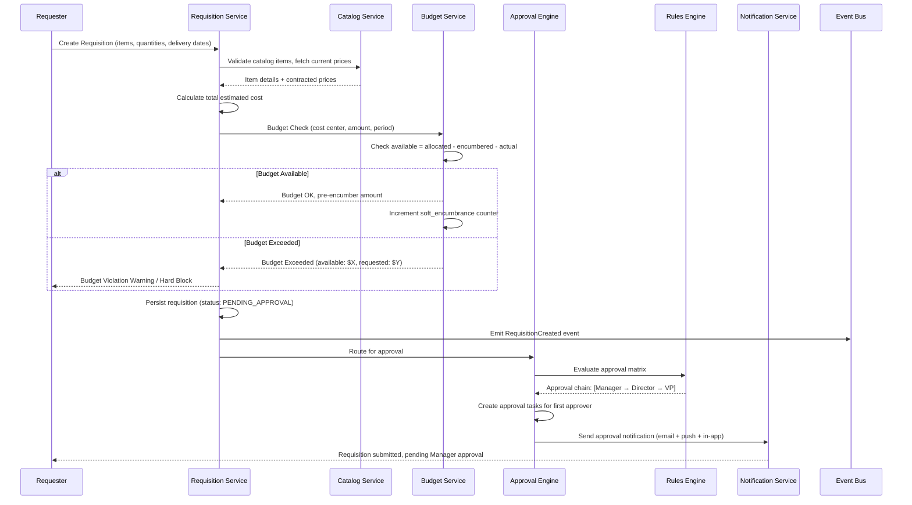
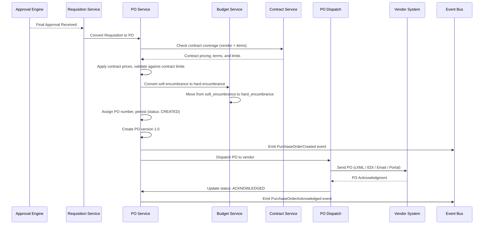
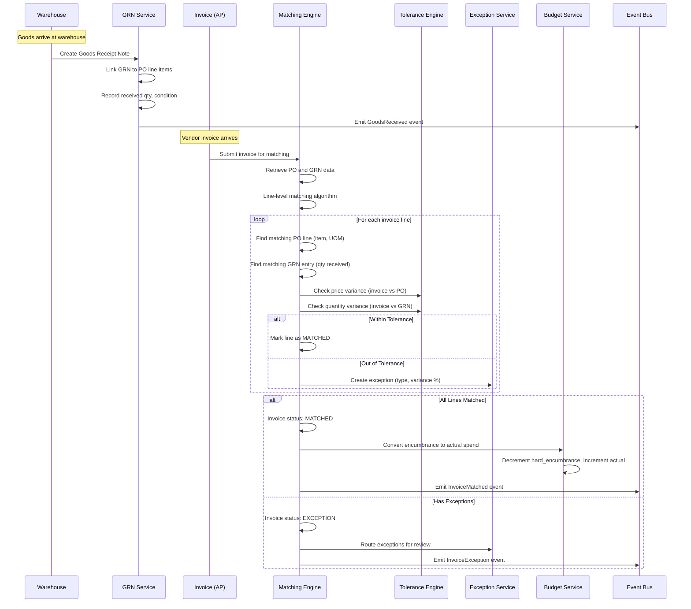
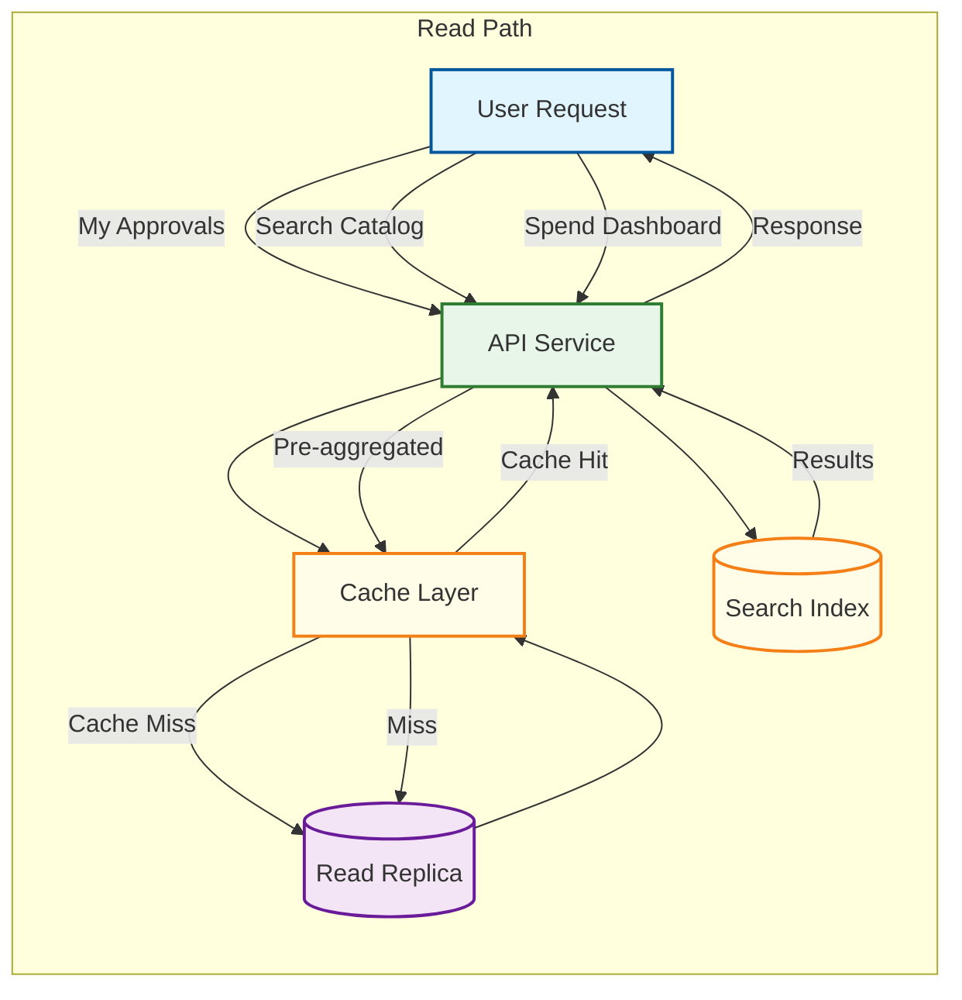
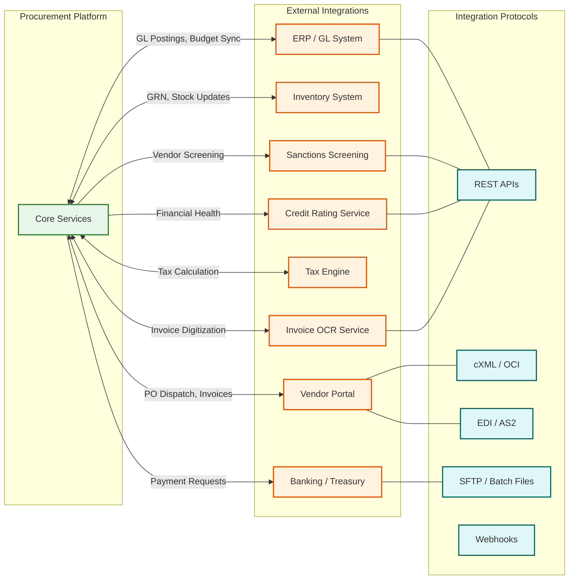
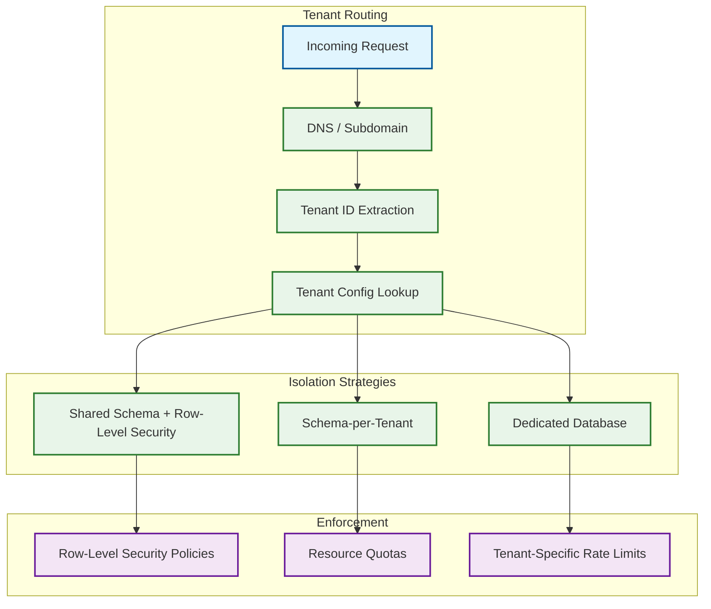

# High-Level Design

## System Architecture

The procurement platform follows a domain-driven microservices architecture with an event-driven backbone. Services are organized around procurement lifecycle stages (requisition, sourcing, ordering, receiving, matching, payment authorization), with shared infrastructure services for workflow orchestration, budget control, and vendor management.

### Architecture Decisions

| Decision | Choice | Rationale |
|----------|--------|-----------|
| **Service Topology** | Microservices with domain boundaries | Each procurement stage has distinct data models, scaling needs, and team ownership; approval engine scales independently from matching engine |
| **Communication** | Event-driven (async) for cross-service; synchronous for user-facing APIs | Approval decisions must propagate to downstream services (PO creation, budget release) without blocking the approver's response |
| **Database Strategy** | Polyglot persistence | Relational DB for transactional data (POs, budgets); document store for contracts and attachments; search engine for catalogs; time-series for spend analytics |
| **Caching** | Multi-layer (local + distributed) | Budget balances cached locally for sub-100ms checks; catalog data in distributed cache for cross-instance consistency |
| **Message Queue** | Durable message broker with exactly-once semantics | Financial events (PO creation, invoice match) must never be lost or duplicated |
| **Workflow Engine** | Embedded orchestration engine with externalized rule definitions | Approval workflows are too varied across tenants to hard-code; rules are stored as data and interpreted at runtime |

---

## System Architecture Diagram

```mermaid
flowchart TB
    subgraph Clients["Client Layer"]
        WEB[Web App - SPA]
        MOB[Mobile App]
        EMAIL[Email Approval Gateway]
        CXML[cXML / OCI Gateway]
        ERP_INT[ERP Integration Layer]
    end

    subgraph GW["API Gateway Layer"]
        AG[API Gateway]
        RL[Rate Limiter]
        SSO[SSO / Auth Service]
        TENANT[Tenant Router]
    end

    subgraph Requisition["Requisition Domain"]
        REQ_SVC[Requisition Service]
        CART[Shopping Cart Service]
        TEMPL[Template Service]
    end

    subgraph Sourcing["Sourcing Domain"]
        RFQ_SVC[RFQ Service]
        AUCTION[Reverse Auction Engine]
        BID[Bid Management Service]
        EVAL[Bid Evaluation Service]
    end

    subgraph Ordering["Ordering Domain"]
        PO_SVC[Purchase Order Service]
        AMEND[Amendment Service]
        BLANKET[Blanket PO / Release Service]
        DISPATCH[PO Dispatch Service]
    end

    subgraph Receiving["Receiving Domain"]
        GRN_SVC[Goods Receipt Service]
        INSPECT[Quality Inspection Service]
        SES[Service Entry Sheet Service]
    end

    subgraph Matching["Matching Domain"]
        MATCH_SVC[Three-Way Matching Engine]
        EXCEPT[Exception Management Service]
        TOLERANCE[Tolerance Rules Engine]
    end

    subgraph Workflow["Workflow & Control"]
        APPR_ENG[Approval Workflow Engine]
        RULE_ENG[Business Rules Engine]
        BUDGET_SVC[Budget Control Service]
        NOTIF[Notification Service]
    end

    subgraph VendorMgmt["Vendor Domain"]
        VEND_SVC[Vendor Management Service]
        ONBOARD[Vendor Onboarding Service]
        SCORE[Vendor Scoring Service]
        RISK[Vendor Risk Assessment]
        COMPLY[Compliance Screening]
    end

    subgraph Support["Supporting Services"]
        CAT_SVC[Catalog Service]
        CONTRACT[Contract Management]
        DOC_SVC[Document Management]
        SPEND[Spend Analytics Engine]
    end

    subgraph DataLayer["Data Layer"]
        PG[(Relational DB Cluster)]
        DOCDB[(Document Store)]
        ELASTIC[(Search Engine)]
        REDIS[(Cache Cluster)]
        KAFKA[Event Bus]
        BLOB[Object Storage]
        TSDB[(Time-Series DB)]
    end

    WEB --> AG
    MOB --> AG
    EMAIL --> AG
    CXML --> AG
    ERP_INT --> AG
    AG --> RL --> SSO --> TENANT

    TENANT --> REQ_SVC
    TENANT --> PO_SVC
    TENANT --> RFQ_SVC
    TENANT --> VEND_SVC
    TENANT --> CAT_SVC

    REQ_SVC --> CART
    REQ_SVC --> TEMPL
    REQ_SVC --> APPR_ENG
    REQ_SVC --> BUDGET_SVC

    RFQ_SVC --> BID
    RFQ_SVC --> AUCTION
    BID --> EVAL
    EVAL --> PO_SVC

    PO_SVC --> AMEND
    PO_SVC --> BLANKET
    PO_SVC --> DISPATCH
    PO_SVC --> APPR_ENG
    PO_SVC --> BUDGET_SVC
    PO_SVC --> CONTRACT

    GRN_SVC --> INSPECT
    GRN_SVC --> MATCH_SVC
    SES --> MATCH_SVC

    MATCH_SVC --> TOLERANCE
    MATCH_SVC --> EXCEPT

    APPR_ENG --> RULE_ENG
    APPR_ENG --> NOTIF

    VEND_SVC --> ONBOARD
    VEND_SVC --> SCORE
    VEND_SVC --> RISK
    RISK --> COMPLY

    REQ_SVC --> PG
    PO_SVC --> PG
    MATCH_SVC --> PG
    VEND_SVC --> PG
    BUDGET_SVC --> REDIS
    BUDGET_SVC --> PG
    CAT_SVC --> ELASTIC
    CONTRACT --> DOCDB
    DOC_SVC --> BLOB
    SPEND --> TSDB
    APPR_ENG --> KAFKA
    MATCH_SVC --> KAFKA
    PO_SVC --> KAFKA

    classDef client fill:#e1f5fe,stroke:#01579b,stroke-width:2px
    classDef api fill:#fff3e0,stroke:#e65100,stroke-width:2px
    classDef service fill:#e8f5e9,stroke:#2e7d32,stroke-width:2px
    classDef data fill:#f3e5f5,stroke:#6a1b9a,stroke-width:2px
    classDef cache fill:#fffde7,stroke:#f57f17,stroke-width:2px
    classDef queue fill:#e0f7fa,stroke:#00695c,stroke-width:2px

    class WEB,MOB,EMAIL,CXML,ERP_INT client
    class AG,RL,SSO,TENANT api
    class REQ_SVC,CART,TEMPL,RFQ_SVC,AUCTION,BID,EVAL,PO_SVC,AMEND,BLANKET,DISPATCH,GRN_SVC,INSPECT,SES,MATCH_SVC,EXCEPT,TOLERANCE,APPR_ENG,RULE_ENG,BUDGET_SVC,NOTIF,VEND_SVC,ONBOARD,SCORE,RISK,COMPLY,CAT_SVC,CONTRACT,DOC_SVC,SPEND service
    class PG,DOCDB,TSDB data
    class ELASTIC,REDIS cache
    class KAFKA,BLOB queue
```



---

## Data Flow: Purchase Requisition to Payment Authorization

### Write Path: Requisition Creation and Approval



### Write Path: PO Creation and Dispatch



### Write Path: Three-Way Matching



---

## Read Path: Approval Queue and Dashboard



---

## Architecture Pattern Checklist

- [x] **Sync vs Async communication decided** --- Synchronous for user-facing API responses; asynchronous (event bus) for cross-service state propagation, notifications, and analytics
- [x] **Event-driven vs Request-response decided** --- Event-driven for document lifecycle transitions (RequisitionCreated → ApprovalCompleted → POCreated → GoodsReceived → InvoiceMatched); request-response for budget checks and approval actions
- [x] **Push vs Pull model decided** --- Push for approval notifications (email, mobile push); pull for dashboard data (user refreshes); WebSocket push for reverse auction bid updates
- [x] **Stateless vs Stateful services identified** --- All API services are stateless; workflow engine maintains state in database; reverse auction engine is stateful (maintains active auction state in memory with persistence)
- [x] **Read-heavy vs Write-heavy optimization applied** --- CQRS pattern: write path uses primary relational DB; read path uses read replicas + materialized views for dashboards + search indexes for catalog
- [x] **Real-time vs Batch processing decided** --- Real-time for approvals, budget checks, matching; batch for spend analytics aggregation, vendor scoring recalculation, compliance screening
- [x] **Edge vs Origin processing considered** --- Not applicable---B2B platform primarily accessed from corporate networks; CDN for static assets only

---

## Key Integration Points

### External System Integration



---

## Event-Driven Architecture

### Domain Events

| Event | Producer | Consumers | Purpose |
|-------|----------|-----------|---------|
| `RequisitionCreated` | Requisition Service | Approval Engine, Budget Service, Analytics | Triggers approval workflow and budget pre-encumbrance |
| `RequisitionApproved` | Approval Engine | PO Service, Requisition Service, Notification | Triggers PO creation from approved requisition |
| `RequisitionRejected` | Approval Engine | Budget Service, Requisition Service, Notification | Releases budget pre-encumbrance |
| `PurchaseOrderCreated` | PO Service | Dispatch Service, Budget Service, Analytics, Contract Service | Triggers PO dispatch to vendor and hard encumbrance |
| `PurchaseOrderAmended` | PO Service | Dispatch Service, Budget Service, Matching Engine | Updates encumbrance, re-dispatches amended PO |
| `GoodsReceived` | GRN Service | Matching Engine, Inventory Service, Analytics | Triggers matching attempt if pending invoice exists |
| `InvoiceReceived` | AP Gateway | Matching Engine, OCR Service | Triggers three-way match attempt |
| `InvoiceMatched` | Matching Engine | AP Service, Budget Service, Analytics | Authorizes payment, converts encumbrance to actual |
| `InvoiceException` | Matching Engine | Exception Service, Notification, Analytics | Routes exception for human review |
| `VendorOnboarded` | Vendor Service | Compliance Service, Notification | Triggers compliance screening and welcome communication |
| `ContractExpiring` | Contract Service | Notification, Sourcing Service | Alerts buyers 90/60/30 days before expiration |
| `BudgetExhausted` | Budget Service | Notification, Analytics | Alerts cost center owners and blocks new commitments |
| `AuctionBidPlaced` | Auction Engine | Notification, Analytics | Updates real-time bid rankings and notifies participants |

### Event Schema Pattern

```
Event Envelope:
{
  event_id: UUID (idempotency key)
  event_type: "PurchaseOrderCreated"
  tenant_id: UUID
  aggregate_id: UUID (e.g., PO ID)
  aggregate_type: "PurchaseOrder"
  version: 1
  timestamp: ISO-8601
  correlation_id: UUID (traces across event chain)
  causation_id: UUID (parent event that caused this)
  actor: { user_id, role, ip_address }
  payload: { ... domain-specific data ... }
  metadata: { source_service, schema_version }
}
```

---

## Multi-Tenancy Architecture



Every database query, cache key, event message, and search index operation is scoped by `tenant_id`. This is enforced at the data access layer---no service can issue a query without a tenant context, and the ORM/query builder automatically injects the `tenant_id` predicate.
