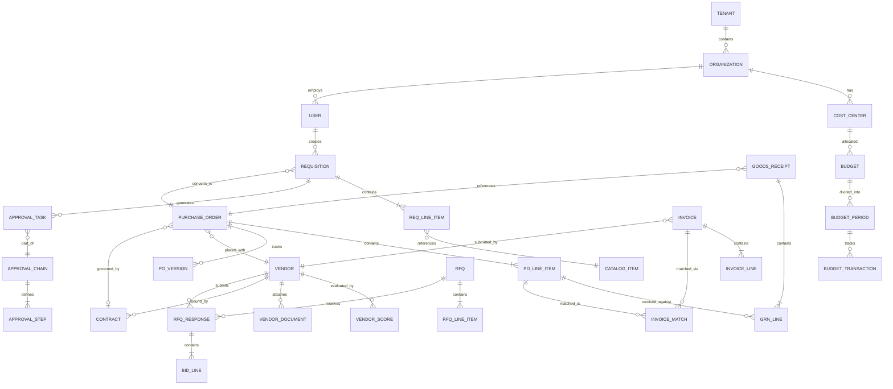

# Low-Level Design

## Data Model

### Entity Relationship Diagram



---

### Core Tables

#### Purchase Requisition

```
TABLE purchase_requisition:
    id                  UUID PRIMARY KEY
    tenant_id           UUID NOT NULL (partition key)
    requisition_number  VARCHAR(30) UNIQUE per tenant
    requester_id        UUID FOREIGN KEY -> user
    status              ENUM(DRAFT, PENDING_APPROVAL, APPROVED,
                             REJECTED, CANCELLED, CONVERTED_TO_PO)
    priority            ENUM(LOW, NORMAL, HIGH, URGENT)
    justification       TEXT
    delivery_address_id UUID FOREIGN KEY -> address
    requested_by_date   DATE
    total_estimated     DECIMAL(18,4)
    currency            VARCHAR(3)
    cost_center_id      UUID FOREIGN KEY -> cost_center
    project_id          UUID NULLABLE
    created_at          TIMESTAMP
    updated_at          TIMESTAMP
    submitted_at        TIMESTAMP
    approved_at         TIMESTAMP

    INDEX: (tenant_id, status, created_at)
    INDEX: (tenant_id, requester_id, status)
    INDEX: (tenant_id, cost_center_id, status)
```

#### Requisition Line Item

```
TABLE req_line_item:
    id                  UUID PRIMARY KEY
    tenant_id           UUID NOT NULL
    requisition_id      UUID FOREIGN KEY -> purchase_requisition
    line_number         INTEGER
    catalog_item_id     UUID NULLABLE (null for free-text items)
    description         TEXT
    quantity            DECIMAL(12,4)
    unit_of_measure     VARCHAR(10)
    estimated_unit_price DECIMAL(18,4)
    currency            VARCHAR(3)
    extended_amount     DECIMAL(18,4) (quantity × unit_price)
    cost_center_id      UUID (can override header)
    gl_account_code     VARCHAR(20)
    commodity_code      VARCHAR(20)
    delivery_date       DATE
    notes               TEXT

    INDEX: (tenant_id, requisition_id)
    INDEX: (tenant_id, commodity_code)
```

#### Purchase Order

```
TABLE purchase_order:
    id                  UUID PRIMARY KEY
    tenant_id           UUID NOT NULL
    po_number           VARCHAR(30) UNIQUE per tenant
    version             INTEGER DEFAULT 1
    status              ENUM(DRAFT, PENDING_APPROVAL, APPROVED, DISPATCHED,
                             ACKNOWLEDGED, PARTIALLY_RECEIVED, FULLY_RECEIVED,
                             CLOSED, CANCELLED)
    po_type             ENUM(STANDARD, BLANKET, CONTRACT, SCHEDULED)
    vendor_id           UUID FOREIGN KEY -> vendor
    contract_id         UUID NULLABLE
    requisition_id      UUID NULLABLE
    buyer_id            UUID FOREIGN KEY -> user
    payment_terms       VARCHAR(50)
    delivery_terms      VARCHAR(50) (Incoterms)
    ship_to_address_id  UUID
    bill_to_address_id  UUID
    total_amount        DECIMAL(18,4)
    currency            VARCHAR(3)
    exchange_rate       DECIMAL(12,6) NULLABLE
    tax_amount          DECIMAL(18,4)
    freight_amount      DECIMAL(18,4)
    notes_to_vendor     TEXT
    internal_notes      TEXT
    created_at          TIMESTAMP
    dispatched_at       TIMESTAMP
    acknowledged_at     TIMESTAMP
    closed_at           TIMESTAMP

    INDEX: (tenant_id, status, created_at)
    INDEX: (tenant_id, vendor_id, status)
    INDEX: (tenant_id, po_number)
    INDEX: (tenant_id, contract_id)
```

#### PO Line Item

```
TABLE po_line_item:
    id                  UUID PRIMARY KEY
    tenant_id           UUID NOT NULL
    po_id               UUID FOREIGN KEY -> purchase_order
    line_number         INTEGER
    req_line_item_id    UUID NULLABLE (traceability to requisition)
    item_id             VARCHAR(50)
    description         TEXT
    quantity_ordered    DECIMAL(12,4)
    quantity_received   DECIMAL(12,4) DEFAULT 0
    quantity_invoiced   DECIMAL(12,4) DEFAULT 0
    unit_of_measure     VARCHAR(10)
    unit_price          DECIMAL(18,4)
    extended_amount     DECIMAL(18,4)
    tax_rate            DECIMAL(5,4)
    tax_amount          DECIMAL(18,4)
    gl_account_code     VARCHAR(20)
    cost_center_id      UUID
    delivery_date       DATE
    receiving_status    ENUM(NOT_RECEIVED, PARTIALLY_RECEIVED, FULLY_RECEIVED)
    matching_status     ENUM(NOT_MATCHED, PARTIALLY_MATCHED, FULLY_MATCHED)

    INDEX: (tenant_id, po_id)
    INDEX: (tenant_id, matching_status)
```

#### PO Version History

```
TABLE po_version:
    id                  UUID PRIMARY KEY
    tenant_id           UUID NOT NULL
    po_id               UUID FOREIGN KEY -> purchase_order
    version_number      INTEGER
    change_type         ENUM(CREATED, LINE_ADDED, LINE_REMOVED, LINE_MODIFIED,
                             QUANTITY_CHANGED, PRICE_CHANGED, TERMS_CHANGED,
                             DELIVERY_CHANGED, CANCELLED)
    changed_by          UUID FOREIGN KEY -> user
    change_reason       TEXT
    previous_value      JSONB
    new_value           JSONB
    approval_required   BOOLEAN
    approved_by         UUID NULLABLE
    created_at          TIMESTAMP

    INDEX: (tenant_id, po_id, version_number)
```

#### Vendor

```
TABLE vendor:
    id                  UUID PRIMARY KEY
    tenant_id           UUID NOT NULL
    vendor_code         VARCHAR(20) UNIQUE per tenant
    legal_name          VARCHAR(255)
    trade_name          VARCHAR(255)
    status              ENUM(PROSPECT, PENDING_ONBOARDING, ACTIVE,
                             SUSPENDED, BLOCKED, DEACTIVATED)
    tier                ENUM(STRATEGIC, PREFERRED, APPROVED, CONDITIONAL, RESTRICTED)
    tax_id              VARCHAR(50) (encrypted)
    registration_number VARCHAR(50)
    incorporation_country VARCHAR(2)
    primary_contact     JSONB
    bank_details        JSONB (encrypted)
    payment_terms       VARCHAR(50)
    currency            VARCHAR(3)
    risk_score          DECIMAL(5,2) (0-100)
    performance_score   DECIMAL(5,2) (0-100)
    diversity_flags     JSONB (minority, women-owned, veteran, etc.)
    last_screened_at    TIMESTAMP
    onboarded_at        TIMESTAMP
    created_at          TIMESTAMP
    updated_at          TIMESTAMP

    INDEX: (tenant_id, status, tier)
    INDEX: (tenant_id, vendor_code)
    INDEX: (tenant_id, risk_score)
```

#### Three-Way Match Record

```
TABLE invoice_match:
    id                  UUID PRIMARY KEY
    tenant_id           UUID NOT NULL
    invoice_id          UUID FOREIGN KEY -> invoice
    invoice_line_id     UUID FOREIGN KEY -> invoice_line
    po_line_item_id     UUID FOREIGN KEY -> po_line_item
    grn_line_id         UUID NULLABLE FOREIGN KEY -> grn_line
    match_status        ENUM(MATCHED, PRICE_EXCEPTION, QTY_EXCEPTION,
                             ITEM_MISMATCH, NO_PO_FOUND, NO_GRN_FOUND)
    po_unit_price       DECIMAL(18,4)
    invoice_unit_price  DECIMAL(18,4)
    price_variance_pct  DECIMAL(5,2)
    po_quantity         DECIMAL(12,4)
    grn_quantity        DECIMAL(12,4)
    invoice_quantity    DECIMAL(12,4)
    quantity_variance_pct DECIMAL(5,2)
    tolerance_rule_id   UUID (which tolerance rule was applied)
    exception_id        UUID NULLABLE (if exception created)
    matched_at          TIMESTAMP
    matched_by          ENUM(SYSTEM, MANUAL)
    resolution          TEXT NULLABLE

    INDEX: (tenant_id, invoice_id)
    INDEX: (tenant_id, match_status)
    INDEX: (tenant_id, po_line_item_id)
```

#### Budget

```
TABLE budget:
    id                  UUID PRIMARY KEY
    tenant_id           UUID NOT NULL
    cost_center_id      UUID FOREIGN KEY -> cost_center
    fiscal_year         INTEGER
    period_type         ENUM(ANNUAL, QUARTERLY, MONTHLY)
    total_allocated     DECIMAL(18,4)
    currency            VARCHAR(3)
    status              ENUM(DRAFT, ACTIVE, FROZEN, CLOSED)

TABLE budget_period:
    id                  UUID PRIMARY KEY
    tenant_id           UUID NOT NULL
    budget_id           UUID FOREIGN KEY -> budget
    period_start        DATE
    period_end          DATE
    allocated_amount    DECIMAL(18,4)
    soft_encumbered     DECIMAL(18,4) DEFAULT 0
    hard_encumbered     DECIMAL(18,4) DEFAULT 0
    actual_spent        DECIMAL(18,4) DEFAULT 0
    available           DECIMAL(18,4) GENERATED AS
                        (allocated_amount - hard_encumbered - actual_spent)

    INDEX: (tenant_id, cost_center_id, period_start, period_end)
    CONSTRAINT: hard_encumbered + actual_spent <= allocated_amount (for hard-control budgets)
```

#### Approval Workflow

```
TABLE approval_chain:
    id                  UUID PRIMARY KEY
    tenant_id           UUID NOT NULL
    document_type       ENUM(REQUISITION, PURCHASE_ORDER, INVOICE_EXCEPTION,
                             VENDOR_ONBOARDING, CONTRACT, PO_AMENDMENT)
    name                VARCHAR(100)
    is_active           BOOLEAN DEFAULT true

TABLE approval_step:
    id                  UUID PRIMARY KEY
    tenant_id           UUID NOT NULL
    chain_id            UUID FOREIGN KEY -> approval_chain
    step_order          INTEGER
    approver_type       ENUM(SPECIFIC_USER, ROLE, COST_CENTER_OWNER,
                             MANAGER_OF_REQUESTER, DYNAMIC_RULE)
    approver_id         UUID NULLABLE (for SPECIFIC_USER)
    approver_role       VARCHAR(50) NULLABLE (for ROLE)
    rule_expression     TEXT NULLABLE (for DYNAMIC_RULE)
    approval_mode       ENUM(ANY_ONE, ALL, QUORUM)
    quorum_count        INTEGER NULLABLE
    timeout_hours       INTEGER DEFAULT 48
    escalation_to       UUID NULLABLE (user or role)
    can_delegate        BOOLEAN DEFAULT true

TABLE approval_task:
    id                  UUID PRIMARY KEY
    tenant_id           UUID NOT NULL
    chain_id            UUID FOREIGN KEY -> approval_chain
    step_id             UUID FOREIGN KEY -> approval_step
    document_type       VARCHAR(50)
    document_id         UUID
    assignee_id         UUID FOREIGN KEY -> user
    delegated_from      UUID NULLABLE
    status              ENUM(PENDING, APPROVED, REJECTED, DELEGATED,
                             ESCALATED, TIMED_OUT, CANCELLED)
    decision_at         TIMESTAMP NULLABLE
    comments            TEXT NULLABLE
    created_at          TIMESTAMP
    due_at              TIMESTAMP

    INDEX: (tenant_id, assignee_id, status)
    INDEX: (tenant_id, document_id, document_type)
    INDEX: (tenant_id, status, due_at)
```

#### RFQ and Bidding

```
TABLE rfq:
    id                  UUID PRIMARY KEY
    tenant_id           UUID NOT NULL
    rfq_number          VARCHAR(30) UNIQUE per tenant
    title               VARCHAR(255)
    status              ENUM(DRAFT, PUBLISHED, BID_PERIOD, EVALUATION,
                             AWARDED, CANCELLED)
    rfq_type            ENUM(STANDARD, SEALED_BID, REVERSE_AUCTION)
    publish_date        TIMESTAMP
    bid_deadline        TIMESTAMP
    bid_opening_date    TIMESTAMP NULLABLE (for sealed bids)
    evaluation_criteria JSONB
    created_by          UUID FOREIGN KEY -> user
    awarded_vendor_id   UUID NULLABLE
    encryption_key_id   UUID NULLABLE (for sealed bids, HSM reference)

TABLE rfq_response:
    id                  UUID PRIMARY KEY
    tenant_id           UUID NOT NULL
    rfq_id              UUID FOREIGN KEY -> rfq
    vendor_id           UUID FOREIGN KEY -> vendor
    status              ENUM(DRAFT, SUBMITTED, OPENED, EVALUATED,
                             AWARDED, REJECTED, WITHDRAWN)
    submitted_at        TIMESTAMP
    total_bid_amount    DECIMAL(18,4)
    technical_score     DECIMAL(5,2) NULLABLE
    commercial_score    DECIMAL(5,2) NULLABLE
    weighted_score      DECIMAL(5,2) NULLABLE
    encrypted_payload   BYTEA NULLABLE (sealed bids)
    bid_hash            VARCHAR(64) (SHA-256 of bid content for integrity)

    INDEX: (tenant_id, rfq_id, vendor_id)
    INDEX: (tenant_id, rfq_id, weighted_score DESC)
```

---

### Indexing Strategy

| Table | Index | Type | Purpose |
|-------|-------|------|---------|
| purchase_order | (tenant_id, status, created_at) | B-tree | Dashboard queries: "Show my open POs" |
| purchase_order | (tenant_id, vendor_id) | B-tree | Vendor-centric queries |
| po_line_item | (tenant_id, matching_status) | B-tree | Matching engine: find unmatched lines |
| approval_task | (tenant_id, assignee_id, status) | B-tree | Approval queue: "My pending approvals" |
| approval_task | (tenant_id, status, due_at) | B-tree | Escalation daemon: find overdue tasks |
| vendor | (tenant_id, status, tier) | Composite | Vendor filtering in sourcing |
| budget_period | (tenant_id, cost_center_id, period) | Covering | Budget check hot path |
| invoice_match | (tenant_id, match_status) | Partial (WHERE status != 'MATCHED') | Exception dashboard |
| catalog_item | Full-text index on description, keywords | GIN / Inverted | Catalog search |

### Partitioning Strategy

| Table | Partition Key | Strategy | Rationale |
|-------|--------------|----------|-----------|
| purchase_order | tenant_id + created_at | Range (monthly) + Hash (tenant) | Even distribution; time-based archival |
| approval_task | tenant_id | Hash | Even workload distribution |
| invoice_match | tenant_id + matched_at | Range (monthly) | Time-series queries for analytics |
| audit_log | tenant_id + created_at | Range (daily) | High-volume append-only; daily rotation |
| budget_period | tenant_id + fiscal_year | Range | Natural fiscal year boundary |

---

## API Design

### RESTful API Structure

All APIs follow the pattern: `/{version}/tenants/{tenant_id}/{resource}`

#### Requisition APIs

```
POST   /v1/tenants/{tid}/requisitions
       Body: { items: [...], cost_center_id, justification, ... }
       Response: 201 Created { requisition_id, requisition_number, status: "DRAFT" }
       Idempotency: Client-generated idempotency_key in header

GET    /v1/tenants/{tid}/requisitions
       Query: status, requester_id, cost_center_id, date_from, date_to, page, size
       Response: 200 { items: [...], pagination: { total, page, size } }

GET    /v1/tenants/{tid}/requisitions/{req_id}
       Response: 200 { ... full requisition with line items, approval status ... }

PUT    /v1/tenants/{tid}/requisitions/{req_id}
       Body: { ... updated fields ... }
       Precondition: If-Match header with ETag (optimistic locking)
       Response: 200 { ... updated requisition ... }

POST   /v1/tenants/{tid}/requisitions/{req_id}/submit
       Response: 200 { status: "PENDING_APPROVAL", approval_chain_id }

POST   /v1/tenants/{tid}/requisitions/{req_id}/cancel
       Body: { reason }
       Response: 200 { status: "CANCELLED" }
```

#### Purchase Order APIs

```
POST   /v1/tenants/{tid}/purchase-orders
       Body: { requisition_id, vendor_id, lines: [...], terms, ... }
       Response: 201 { po_id, po_number, version: 1 }

GET    /v1/tenants/{tid}/purchase-orders/{po_id}
       Response: 200 { ... PO with lines, versions, matching status ... }

POST   /v1/tenants/{tid}/purchase-orders/{po_id}/amend
       Body: { changes: [...], reason }
       Response: 200 { version: N+1, amendment_id, approval_required: bool }

POST   /v1/tenants/{tid}/purchase-orders/{po_id}/dispatch
       Response: 200 { dispatch_id, method: "cXML", dispatched_at }

GET    /v1/tenants/{tid}/purchase-orders/{po_id}/versions
       Response: 200 { versions: [{ version, changes, changed_by, at }] }
```

#### Approval APIs

```
GET    /v1/tenants/{tid}/approvals/pending
       Query: assignee_id (default: current user), document_type
       Response: 200 { items: [{ task_id, document_type, document_id,
                                  summary, amount, requester, created_at }] }

POST   /v1/tenants/{tid}/approvals/{task_id}/approve
       Body: { comments }
       Response: 200 { next_step: "Director Approval" | "Fully Approved" }

POST   /v1/tenants/{tid}/approvals/{task_id}/reject
       Body: { reason }
       Response: 200 { status: "REJECTED" }

POST   /v1/tenants/{tid}/approvals/{task_id}/delegate
       Body: { delegate_to_user_id, reason }
       Response: 200 { new_task_id, delegated_to }
```

#### Three-Way Matching APIs

```
POST   /v1/tenants/{tid}/invoices/{inv_id}/match
       Response: 200 { match_result: "MATCHED" | "EXCEPTION",
                       line_results: [{ line, status, variance }] }

GET    /v1/tenants/{tid}/matching/exceptions
       Query: status, vendor_id, date_from, page
       Response: 200 { items: [{ exception_id, invoice, po, type, variance }] }

POST   /v1/tenants/{tid}/matching/exceptions/{exc_id}/resolve
       Body: { resolution: "ACCEPT" | "REJECT" | "ADJUST", adjustment: {...} }
       Response: 200 { resolved_at, resolved_by }
```

#### RFQ and Auction APIs

```
POST   /v1/tenants/{tid}/rfqs
       Body: { title, items, criteria, type, deadline, invited_vendors }
       Response: 201 { rfq_id, rfq_number }

POST   /v1/tenants/{tid}/rfqs/{rfq_id}/publish
       Response: 200 { published_at, bid_deadline }

POST   /v1/tenants/{tid}/rfqs/{rfq_id}/bids
       Body: { line_prices: [...], technical_response, attachments }
       Headers: X-Bid-Hash: SHA-256(bid_content)
       Response: 201 { bid_id, submitted_at, hash_verified: true }

POST   /v1/tenants/{tid}/rfqs/{rfq_id}/open-bids
       Precondition: Current time >= bid_opening_date
       Response: 200 { bids: [{ vendor_id, total, line_prices }] }

WebSocket /v1/tenants/{tid}/auctions/{auction_id}/stream
       Events: BidPlaced, BidRankUpdate, TimeExtension, AuctionClosed
```

#### Vendor APIs

```
POST   /v1/tenants/{tid}/vendors
       Body: { legal_name, tax_id, contacts, bank_details, documents }
       Response: 201 { vendor_id, status: "PENDING_ONBOARDING" }

GET    /v1/tenants/{tid}/vendors/{vendor_id}/scorecard
       Response: 200 { quality: 87, delivery: 92, responsiveness: 78,
                       compliance: 95, overall: 88, history: [...] }

POST   /v1/tenants/{tid}/vendors/{vendor_id}/screen
       Response: 202 { screening_id } (async - sanctions, credit, ESG)
```

---

## Core Algorithms

### 1. Approval Chain Resolution Algorithm

```
FUNCTION resolve_approval_chain(document, tenant_config):
    rules = load_approval_rules(tenant_config, document.type)
    chain = []

    FOR rule IN rules SORTED BY priority:
        IF evaluate_condition(rule.condition, document):
            step = {
                approver: resolve_approver(rule, document),
                mode: rule.approval_mode,
                timeout: rule.timeout_hours,
                step_order: len(chain) + 1
            }

            // Handle parallel approval groups
            IF rule.parallel_with_previous AND len(chain) > 0:
                chain[-1].parallel_approvers.append(step.approver)
            ELSE:
                chain.append(step)

    // Deduplication: remove duplicate approvers across steps
    seen_approvers = SET()
    deduplicated_chain = []
    FOR step IN chain:
        IF step.approver NOT IN seen_approvers:
            deduplicated_chain.append(step)
            seen_approvers.add(step.approver)

    // Self-approval prevention
    FOR step IN deduplicated_chain:
        IF step.approver == document.requester:
            step.approver = resolve_escalation(step, document)

    RETURN deduplicated_chain

FUNCTION evaluate_condition(condition, document):
    // Conditions compose via AND/OR logic
    MATCH condition.type:
        CASE "amount_threshold":
            RETURN document.total >= condition.min AND document.total < condition.max
        CASE "commodity_category":
            RETURN document.commodity IN condition.categories
        CASE "vendor_risk":
            RETURN vendor_risk_score(document.vendor_id) >= condition.threshold
        CASE "cost_center":
            RETURN document.cost_center_id IN condition.cost_centers
        CASE "composite":
            RETURN evaluate_composite(condition.operator, condition.children, document)

// Time complexity: O(R × C) where R = rules, C = conditions per rule
// Space complexity: O(S) where S = approval steps
```

### 2. Three-Way Matching Algorithm

```
FUNCTION three_way_match(invoice, tenant_config):
    results = []
    tolerance = load_tolerance_rules(tenant_config, invoice.vendor_id)

    FOR invoice_line IN invoice.lines:
        // Step 1: Find matching PO line
        po_line = find_po_line(invoice_line, invoice.po_number)
        IF po_line IS NULL:
            results.append(MatchResult(invoice_line, NO_PO_FOUND))
            CONTINUE

        // Step 2: Find matching GRN entries
        grn_entries = find_grn_entries(po_line.id)
        total_received = SUM(grn.quantity FOR grn IN grn_entries)

        // Step 3: Price matching
        price_variance = ABS(invoice_line.unit_price - po_line.unit_price) / po_line.unit_price
        price_ok = price_variance <= tolerance.price_pct
            OR ABS(invoice_line.unit_price - po_line.unit_price) <= tolerance.price_abs

        // Step 4: Quantity matching
        qty_variance = ABS(invoice_line.quantity - total_received) / total_received
        qty_ok = qty_variance <= tolerance.qty_pct
            OR ABS(invoice_line.quantity - total_received) <= tolerance.qty_abs

        // Step 5: Determine match status
        IF price_ok AND qty_ok:
            status = MATCHED
        ELSE IF NOT price_ok AND NOT qty_ok:
            status = PRICE_AND_QTY_EXCEPTION
        ELSE IF NOT price_ok:
            status = PRICE_EXCEPTION
        ELSE:
            status = QTY_EXCEPTION

        results.append(MatchResult(
            invoice_line, po_line, grn_entries,
            status, price_variance, qty_variance
        ))

    // Aggregate result
    IF ALL(r.status == MATCHED FOR r IN results):
        RETURN MatchOutcome(FULLY_MATCHED, results)
    ELSE:
        RETURN MatchOutcome(HAS_EXCEPTIONS, results)

// Time: O(L × G) where L = invoice lines, G = avg GRN entries per PO line
// Space: O(L)
```

### 3. Budget Encumbrance State Machine

```
FUNCTION process_budget_event(event, budget_period):
    // Acquire row-level lock on budget_period
    LOCK budget_period FOR UPDATE

    MATCH event.type:
        CASE REQUISITION_SUBMITTED:
            // Pre-encumber (soft hold)
            IF budget_period.available >= event.amount:
                budget_period.soft_encumbered += event.amount
                RECORD budget_transaction(SOFT_ENCUMBER, event.amount, event.doc_id)
                RETURN BudgetResult(APPROVED)
            ELSE:
                IF budget_period.control_type == HARD:
                    RETURN BudgetResult(BLOCKED, available: budget_period.available)
                ELSE:
                    budget_period.soft_encumbered += event.amount
                    RECORD budget_transaction(SOFT_ENCUMBER_OVER_BUDGET, event.amount)
                    RETURN BudgetResult(WARNING, over_by: event.amount - budget_period.available)

        CASE REQUISITION_REJECTED:
            // Release soft encumbrance
            budget_period.soft_encumbered -= event.amount
            RECORD budget_transaction(SOFT_RELEASE, event.amount, event.doc_id)

        CASE PO_APPROVED:
            // Convert soft to hard encumbrance
            budget_period.soft_encumbered -= event.amount
            budget_period.hard_encumbered += event.amount
            RECORD budget_transaction(HARD_ENCUMBER, event.amount, event.doc_id)

        CASE INVOICE_MATCHED:
            // Convert hard encumbrance to actual
            budget_period.hard_encumbered -= event.encumbered_amount
            budget_period.actual_spent += event.invoice_amount
            // Handle variance (invoice != PO price)
            variance = event.invoice_amount - event.encumbered_amount
            IF variance > 0:
                budget_period.available -= variance
            RECORD budget_transaction(ACTUAL, event.invoice_amount, event.doc_id)

        CASE PO_CANCELLED:
            // Release hard encumbrance
            budget_period.hard_encumbered -= event.amount
            RECORD budget_transaction(HARD_RELEASE, event.amount, event.doc_id)

    UNLOCK budget_period
    EMIT BudgetUpdated event

// Invariant: allocated = available + soft_encumbered + hard_encumbered + actual_spent
```

### 4. Sealed Bid Encryption and Opening

```
FUNCTION create_sealed_rfq(rfq):
    // Generate time-locked encryption key pair
    key_pair = HSM.generate_key_pair(
        algorithm: "RSA-4096",
        usage: "ENCRYPT_DECRYPT",
        release_after: rfq.bid_opening_date
    )
    rfq.encryption_key_id = key_pair.key_id
    rfq.public_key = key_pair.public_key
    PUBLISH rfq with public_key to invited vendors

FUNCTION submit_sealed_bid(rfq, vendor, bid_data):
    // Vendor encrypts bid with RFQ's public key
    plaintext = SERIALIZE(bid_data)
    bid_hash = SHA256(plaintext)
    encrypted_payload = ENCRYPT(plaintext, rfq.public_key)

    STORE bid = {
        rfq_id: rfq.id,
        vendor_id: vendor.id,
        encrypted_payload: encrypted_payload,
        bid_hash: bid_hash,
        submitted_at: NOW()
    }
    RETURN bid.id, bid_hash

FUNCTION open_sealed_bids(rfq):
    ASSERT NOW() >= rfq.bid_opening_date
    ASSERT rfq.status == BID_PERIOD

    // HSM releases private key only after opening date
    private_key = HSM.get_private_key(rfq.encryption_key_id)

    opened_bids = []
    FOR bid IN get_bids(rfq.id):
        plaintext = DECRYPT(bid.encrypted_payload, private_key)
        // Verify integrity
        ASSERT SHA256(plaintext) == bid.bid_hash
        bid_data = DESERIALIZE(plaintext)
        opened_bids.append({ vendor: bid.vendor_id, data: bid_data })

    // Destroy private key after opening
    HSM.destroy_key(rfq.encryption_key_id)

    rfq.status = EVALUATION
    RETURN opened_bids
```

---

## Idempotency Handling

| Operation | Idempotency Mechanism |
|-----------|-----------------------|
| Create Requisition | Client-generated `idempotency_key` in request header; stored with record; duplicate key returns original response |
| Approval Action | Unique constraint on `(task_id, assignee_id, decision)`; second approval on same task returns existing decision |
| PO Creation | Unique constraint on `(tenant_id, requisition_id)` for auto-created POs; manual POs use idempotency key |
| Invoice Match | Unique constraint on `(invoice_line_id, po_line_item_id)`; re-match returns existing result |
| Budget Transaction | Unique constraint on `(document_id, event_type)`; prevents double-encumbrance |
| Bid Submission | Unique constraint on `(rfq_id, vendor_id, version)`; re-submission requires explicit version increment |

---

## API Versioning Strategy

- URL path versioning: `/v1/`, `/v2/`
- Breaking changes require new version; additive changes are backward-compatible within a version
- Deprecated versions supported for 12 months with sunset header
- Content negotiation via `Accept` header for response format (JSON default, cXML for vendor integration)
