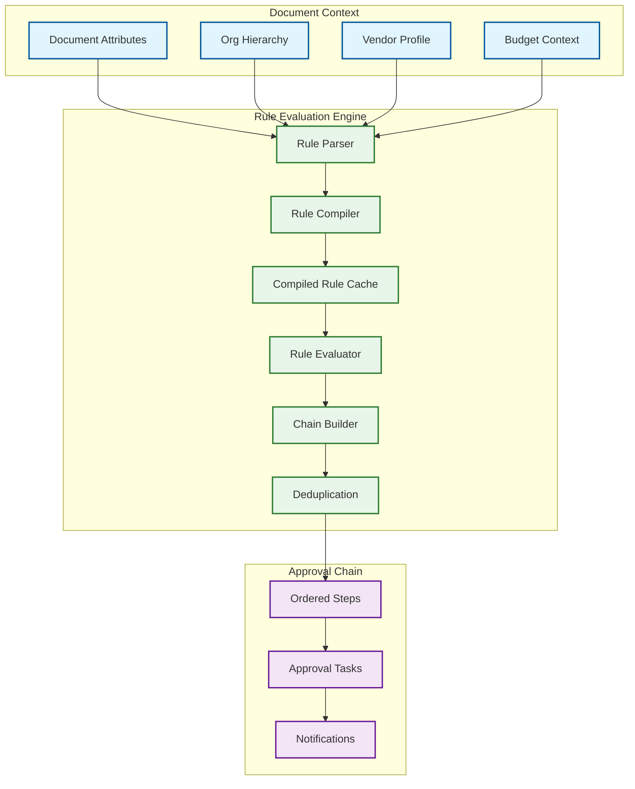
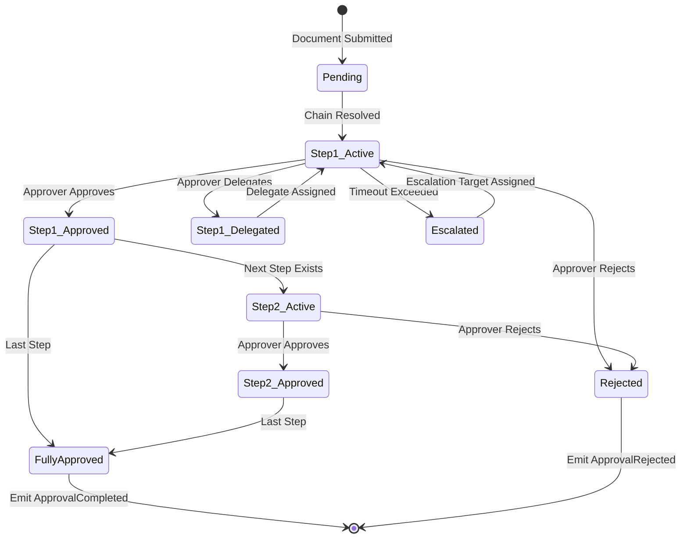
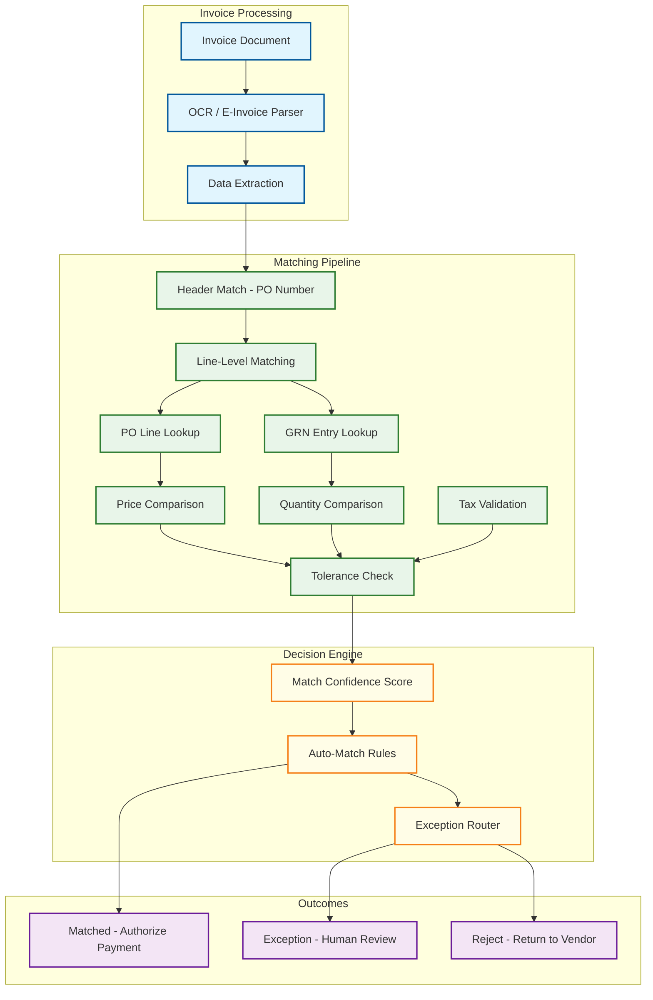

# Deep Dive & Bottlenecks

## Critical Component 1: Multi-Dimensional Approval Workflow Engine

### Why This Is Critical

The approval engine is the single most business-critical component in procurement. Every dollar committed through the system must pass through the correct approval chain. A failure in the approval engine---routing to the wrong approver, skipping a required step, or allowing unauthorized approval---is a SOX compliance violation that can result in audit findings, financial restatements, and regulatory penalties. The engine must be simultaneously flexible (every organization has unique approval rules), performant (approvers expect instant response), and correct (zero tolerance for misrouted approvals).

### How It Works Internally

The approval engine operates as a state machine interpreter that evaluates a tenant-specific rule set against document attributes to determine the approval chain, then orchestrates the chain execution through a task-based workflow.

#### Rule Evaluation Architecture



Rules are defined using a domain-specific language (DSL) that supports:
- **Amount thresholds**: `WHEN amount >= 10000 AND amount < 50000 THEN require DEPT_HEAD`
- **Category conditions**: `WHEN commodity IN ("IT Hardware", "Software") THEN require IT_GOVERNANCE`
- **Vendor risk**: `WHEN vendor.risk_score > 70 THEN require RISK_COMMITTEE`
- **Composite logic**: `WHEN (amount > 100000 OR vendor.tier == "NEW") AND commodity == "Professional Services" THEN require VP_PROCUREMENT AND LEGAL`

Rules are compiled into an abstract syntax tree (AST) on configuration change and cached per tenant. At evaluation time, the AST is traversed against the document context---avoiding re-parsing the DSL on every approval request.

#### Approval Chain Execution State Machine



### Failure Modes

| Failure | Impact | Mitigation |
|---------|--------|------------|
| **Approver unavailable** (no delegation set) | Approval chain stalls indefinitely | Timeout-based escalation: after N hours, auto-escalate to approver's manager; configurable timeout per step |
| **Rule configuration error** (contradictory rules) | Wrong approval chain or infinite loop | Rule validation engine that simulates chain resolution for test documents before activation; rollback to previous rule version on validation failure |
| **Concurrent approval race** (two delegates approve same task) | Duplicate approval, potential double-spend | Optimistic locking with version check; only first approval action succeeds; second receives "already decided" response |
| **Organizational hierarchy change** mid-approval | Chain references roles/people who have changed | Snapshot org hierarchy at submission time; in-flight approvals use snapshot; new submissions use current hierarchy |
| **Approval engine crash** during chain traversal | Partial chain state---some steps created, others not | Transactional chain creation: all steps created in single DB transaction; idempotent event processing for retry |

### Performance Optimization

- **Compiled rule cache**: Rules are compiled to AST once on configuration change, not on every evaluation. Cache hit rate > 99.9% (rules change rarely).
- **Approval queue materialization**: Each user's pending approvals are maintained as a materialized view, updated via event subscription. Dashboard queries hit the materialized view, not the task table.
- **Batch notification**: Approval notifications are batched within a 30-second window to avoid flooding users with individual notifications during bulk operations.

---

## Critical Component 2: Three-Way Matching Engine

### Why This Is Critical

Three-way matching is the financial control that prevents overpayment, duplicate payment, and fraud. It ensures that the organization only pays for goods that were ordered (PO), received (GRN), and correctly invoiced. A matching engine that is too strict creates operational friction---AP clerks spend hours manually resolving exceptions for trivial variances. An engine that is too lenient allows financial leakage. The matching engine processes 500K+ invoice-to-PO matches per day, each involving multiple line items, making it the highest-throughput financial processing component.

### How It Works Internally



#### Line-Level Matching Complexity

The challenge is not just comparing values---it is finding the correct assignment of invoice lines to PO lines when:

1. **Partial deliveries**: PO has 100 units, GRN shows 60 received, invoice is for 60 units
2. **Split invoices**: Vendor sends two invoices for one PO---first for 40 units, second for 60 units
3. **Line item reordering**: Invoice line order does not match PO line order
4. **Description variations**: PO says "Widget Model A-100", invoice says "A100 Widget"
5. **Unit of measure differences**: PO in "cases", invoice in "each" (12 each = 1 case)
6. **Consolidated invoices**: One invoice references multiple POs from same vendor

The matching engine uses a scoring-based assignment algorithm:

```
FUNCTION assign_invoice_lines_to_po(invoice, pos):
    // Build candidate matrix: score each (invoice_line, po_line) pair
    candidates = []
    FOR inv_line IN invoice.lines:
        FOR po IN pos:
            FOR po_line IN po.lines WHERE po_line.remaining_qty > 0:
                score = compute_match_score(inv_line, po_line)
                IF score > MIN_THRESHOLD:
                    candidates.append((inv_line, po_line, score))

    // Sort by score descending
    candidates.SORT_BY(score, DESC)

    // Greedy assignment (optimal for most cases)
    assignments = {}
    assigned_inv_lines = SET()
    assigned_po_qtys = {} // track remaining qty per po_line

    FOR (inv_line, po_line, score) IN candidates:
        IF inv_line NOT IN assigned_inv_lines:
            remaining = po_line.remaining_qty - assigned_po_qtys.get(po_line, 0)
            IF remaining >= inv_line.quantity:
                assignments[inv_line] = (po_line, score)
                assigned_inv_lines.add(inv_line)
                assigned_po_qtys[po_line] += inv_line.quantity

    RETURN assignments

FUNCTION compute_match_score(inv_line, po_line):
    score = 0
    // Item identifier match (exact)
    IF inv_line.item_id == po_line.item_id: score += 40
    // Description similarity (fuzzy)
    desc_sim = fuzzy_similarity(inv_line.description, po_line.description)
    score += desc_sim * 20
    // Price proximity
    price_diff = ABS(inv_line.unit_price - po_line.unit_price) / po_line.unit_price
    score += MAX(0, 20 - price_diff * 100)
    // Quantity proximity
    qty_diff = ABS(inv_line.quantity - po_line.remaining_qty) / po_line.remaining_qty
    score += MAX(0, 20 - qty_diff * 100)
    RETURN score
```

### Failure Modes

| Failure | Impact | Mitigation |
|---------|--------|------------|
| **Incorrect line assignment** | Wrong PO line matched to invoice line; incorrect variance calculation | Confidence threshold: auto-match only above 85% confidence; below 85% routes to human review |
| **Stale GRN data** | Invoice arrives before GRN is entered; match fails on quantity | "Park" the invoice: hold in PENDING_GRN status; re-trigger matching when GRN event arrives (event-driven) |
| **Duplicate invoice** | Same invoice submitted twice; double payment risk | Invoice duplicate detection: hash of (vendor_id, invoice_number, invoice_date, total_amount); block exact duplicates, flag near-duplicates |
| **Currency conversion mismatch** | PO in USD, invoice in EUR; exchange rate disagreement | Use PO exchange rate as reference; flag if invoice rate differs by > 2%; treasury integration for authoritative rates |
| **Tolerance rule conflict** | Vendor-specific tolerance contradicts commodity tolerance | Priority hierarchy: vendor-specific > commodity-specific > organization default; always apply the most specific applicable rule |

---

## Critical Component 3: Budget Control Service

### Why This Is Critical

The budget control service acts as the financial guardrail for the entire procurement process. It must answer the question "Is there enough budget for this purchase?" within 100ms, while maintaining absolute consistency across concurrent requests from multiple users against the same cost center. A budget check that returns a false positive (says budget is available when it is not) leads to over-commitment. A false negative (says budget is exhausted when it is not) blocks legitimate purchases. Both scenarios have real financial and operational consequences.

### How It Works Internally

#### Budget State Model

```
For any budget period at any point in time:

    allocated_amount = soft_encumbered + hard_encumbered + actual_spent + available

Where:
    soft_encumbered  = Sum of submitted but not-yet-approved requisitions
    hard_encumbered  = Sum of approved POs not yet invoiced/matched
    actual_spent     = Sum of matched invoices (converted from hard encumbrance)
    available        = Remaining budget for new commitments
```

#### Concurrency Control for Budget Checks

The budget service faces a classic concurrent-write problem: multiple users in the same department submit requisitions against the same cost center simultaneously.

```
FUNCTION budget_check_and_encumber(cost_center, period, amount, control_type):
    // Strategy: Optimistic check with pessimistic commit

    // Step 1: Optimistic read from cache (fast path)
    cached_balance = CACHE.get(budget_key(cost_center, period))
    IF cached_balance IS NOT NULL AND cached_balance.available < amount:
        IF control_type == HARD:
            RETURN BLOCKED_FAST  // Avoid DB round-trip for clearly insufficient budget

    // Step 2: Pessimistic database operation (correct path)
    BEGIN TRANSACTION (SERIALIZABLE for this row)
        period_row = SELECT * FROM budget_period
                     WHERE cost_center_id = cost_center
                       AND period_start <= NOW()
                       AND period_end >= NOW()
                     FOR UPDATE  // Row-level lock

        available = period_row.allocated - period_row.hard_encumbered
                    - period_row.actual_spent

        IF available >= amount:
            UPDATE budget_period
            SET soft_encumbered = soft_encumbered + amount
            WHERE id = period_row.id

            INSERT INTO budget_transaction (...)

            // Update cache
            CACHE.set(budget_key(cost_center, period),
                      { available: available - amount },
                      TTL: 30 seconds)

            COMMIT
            RETURN APPROVED
        ELSE:
            ROLLBACK
            IF control_type == HARD:
                RETURN BLOCKED(available)
            ELSE:
                // Soft control: allow but warn
                UPDATE budget_period
                SET soft_encumbered = soft_encumbered + amount
                COMMIT
                RETURN WARNING(over_by: amount - available)
    END TRANSACTION
```

#### Budget Rollup and Hierarchical Checking

Cost centers often form a hierarchy (Division → Department → Team). A purchase may require budget availability at multiple levels:

```
FUNCTION hierarchical_budget_check(cost_center, amount):
    hierarchy = get_cost_center_hierarchy(cost_center)
    // hierarchy = [Team-A, Engineering-Dept, Technology-Division]

    results = []
    FOR level IN hierarchy:
        result = budget_check_and_encumber(level, current_period(), amount, level.control_type)
        results.append(result)
        IF result == BLOCKED:
            // Roll back any successful encumbrances at lower levels
            FOR prev_result IN results WHERE prev_result == APPROVED:
                release_encumbrance(prev_result.cost_center, amount)
            RETURN BLOCKED_AT(level)

    RETURN ALL_LEVELS_APPROVED(results)
```

### Failure Modes

| Failure | Impact | Mitigation |
|---------|--------|------------|
| **Cache-DB inconsistency** | Cache shows budget available; DB shows exhausted | Cache is advisory only; DB is authoritative; 30-second TTL ensures convergence; budget commit always goes through DB |
| **Lock contention on hot cost centers** | Multiple concurrent requisitions against same cost center create serialization bottleneck | Pre-allocated budget slices for high-volume cost centers; shard budget counters across N partitions with periodic reconciliation |
| **Encumbrance leak** | Requisition rejected but encumbrance not released due to event loss | Reconciliation job runs hourly: compares active encumbrances against document states; auto-releases orphaned encumbrances |
| **Cross-period budget carry-forward** | Fiscal year rollover while active POs span periods | Period transition job: moves un-spent encumbrances from closing period to new period; configurable carry-forward policies |
| **Multi-currency budget** | PO in EUR against USD budget; exchange rate fluctuation changes availability | Budget expressed in base currency; exchange rate snapshot at encumbrance time; monthly revaluation of outstanding encumbrances |

---

## Concurrency & Race Conditions

### Race Condition 1: Simultaneous Approval and Cancellation

**Scenario**: Approver clicks "Approve" at the same moment the requester clicks "Cancel".

```
FUNCTION handle_approval_action(task_id, action, actor):
    BEGIN TRANSACTION
        task = SELECT * FROM approval_task WHERE id = task_id FOR UPDATE

        IF task.status != PENDING:
            ROLLBACK
            RETURN ALREADY_DECIDED(task.status)

        document = SELECT * FROM document WHERE id = task.document_id FOR UPDATE

        IF document.status == CANCELLED:
            task.status = CANCELLED
            COMMIT
            RETURN DOCUMENT_CANCELLED

        task.status = action  // APPROVED or REJECTED
        task.decided_by = actor
        task.decided_at = NOW()

        COMMIT
    END TRANSACTION
```

### Race Condition 2: Concurrent Three-Way Matches

**Scenario**: Two invoices arrive for the same PO within seconds. Both try to match against the same PO line.

```
FUNCTION claim_po_line_quantity(po_line_id, claimed_qty):
    BEGIN TRANSACTION
        po_line = SELECT * FROM po_line_item WHERE id = po_line_id FOR UPDATE

        available = po_line.quantity_ordered - po_line.quantity_invoiced

        IF available >= claimed_qty:
            UPDATE po_line_item
            SET quantity_invoiced = quantity_invoiced + claimed_qty
            WHERE id = po_line_id
            COMMIT
            RETURN CLAIMED
        ELSE:
            ROLLBACK
            RETURN INSUFFICIENT_QUANTITY(available)
    END TRANSACTION
```

### Race Condition 3: Budget Exhaustion During Bulk Requisition

**Scenario**: Year-end "budget flush" where 50 users simultaneously submit requisitions against the same cost center.

**Mitigation**: Pre-allocated budget slices (same pattern as distributed counter):

```
FUNCTION get_budget_slice(cost_center, slice_size):
    // Each service instance gets a pre-allocated slice
    BEGIN TRANSACTION
        period = SELECT * FROM budget_period
                 WHERE cost_center_id = cost_center FOR UPDATE

        IF period.available >= slice_size:
            period.available -= slice_size
            period.soft_encumbered += slice_size
            COMMIT
            RETURN BudgetSlice(remaining: slice_size)
        ELSE:
            available = period.available
            period.available = 0
            period.soft_encumbered += available
            COMMIT
            RETURN BudgetSlice(remaining: available)
    END TRANSACTION

// Instance-local operations against the slice (no DB contention)
FUNCTION local_budget_check(slice, amount):
    IF slice.remaining >= amount:
        slice.remaining -= amount
        RETURN APPROVED
    ELSE:
        // Slice exhausted; request new slice from DB
        new_slice = get_budget_slice(cost_center, DEFAULT_SLICE_SIZE)
        ...
```

---

## Bottleneck Analysis

### Bottleneck 1: Approval Queue Latency at Quarter-End

**Problem**: Quarter-end creates 5--8x spike in approval volume. Approvers (especially VPs and CFOs who are in multiple chains) have hundreds of pending approvals. Dashboard queries become slow; notification volumes overwhelm email systems.

**Mitigation**:
- **Materialized approval queue**: Pre-computed per-user approval lists, updated via event subscription. Dashboard reads hit materialized view, not JOIN across task + document tables.
- **Approval prioritization**: Sort by business impact (amount × urgency × days-pending) rather than FIFO. Surface the most critical approvals first.
- **Batch approval UI**: Allow approvers to select multiple items and approve in bulk with a single action (same approval comment applied to all).
- **Smart notification throttling**: Aggregate notifications into digest format during high-volume periods. Instead of 50 individual emails, send one summary email every 30 minutes with a prioritized list.

### Bottleneck 2: Three-Way Matching Throughput

**Problem**: Month-end invoice batch from large vendors can dump 10K+ invoices in a single batch file. Each invoice requires PO lookup, GRN lookup, line-level matching, tolerance checking, and result persistence.

**Mitigation**:
- **Parallel matching workers**: Invoice matching is embarrassingly parallel (each invoice is independent). Partition batch by vendor or PO number prefix and process concurrently.
- **Pre-indexed PO lookup**: Maintain a PO line lookup index keyed by (vendor_id, item_id) for O(1) candidate lookup instead of table scan.
- **Batch-optimized GRN loading**: When processing a vendor batch, pre-load all GRN data for that vendor's POs into memory before starting line-level matching.
- **Deferred exception processing**: Match engine produces results synchronously but exception routing (notification, task creation) is deferred to event consumers.

### Bottleneck 3: Catalog Search Performance

**Problem**: 500M+ catalog items across all tenants with faceted filtering (category, vendor, price range, availability) and full-text search. User expects typeahead completion within 200ms.

**Mitigation**:
- **Tenant-scoped search indexes**: Each tenant's catalog is a separate index partition in the search engine. Queries never cross tenant boundaries.
- **Search-ahead caching**: Cache the top 100 search results for the most popular queries per tenant. Cache invalidation on catalog update events.
- **Bloom filter for item existence**: Before hitting the search engine, check a Bloom filter to quickly eliminate queries for items that definitely do not exist.
- **Punch-out catalog lazy loading**: External catalog items are not indexed locally. Punch-out search is delegated to the vendor's catalog system and results are federated.
