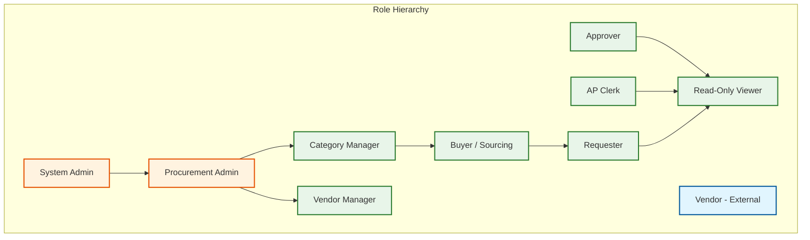
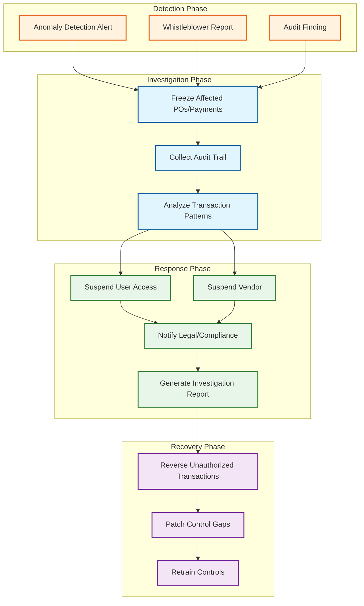

# Security & Compliance

## Authentication & Authorization

### Authentication Architecture

| Mechanism | Use Case | Details |
|-----------|----------|---------|
| **SAML 2.0 / OIDC SSO** | Enterprise users accessing via corporate identity provider | Primary authentication; integrates with customer's IdP (Active Directory, Okta, etc.); platform acts as SP/RP |
| **API Key + HMAC** | System-to-system integration (ERP, vendor portal) | API key identifies the integration; HMAC signature ensures request integrity and prevents replay |
| **OAuth 2.0 Client Credentials** | Service-to-service communication | Internal microservice authentication; short-lived tokens issued by central auth service |
| **Email-based OTP** | Vendor portal access for external vendors | Vendors do not have SSO access; email-based one-time passwords for portal authentication |
| **Multi-Factor Authentication** | High-privilege actions (approve > $500K, change approval rules) | Step-up authentication for sensitive operations; TOTP or push notification |

### Authorization Model: Attribute-Based Access Control (ABAC)

Procurement requires authorization decisions based on multiple attributes simultaneously---not just "who the user is" (RBAC) but also "what they are accessing" (document ownership), "how much it costs" (amount threshold), and "what organization they belong to" (tenant + cost center + department).

```
AUTHORIZATION POLICY:

POLICY approve_purchase_order:
    SUBJECT.role IN ("approver", "finance_manager", "vp", "cfo")
    AND RESOURCE.tenant_id == SUBJECT.tenant_id
    AND RESOURCE.cost_center_id IN SUBJECT.authorized_cost_centers
    AND RESOURCE.amount <= SUBJECT.approval_limit
    AND RESOURCE.vendor.tier != "RESTRICTED"
    AND RESOURCE.status == "PENDING_APPROVAL"
    AND RESOURCE.requester_id != SUBJECT.user_id  // no self-approval

POLICY view_vendor_bank_details:
    SUBJECT.role IN ("ap_manager", "treasury")
    AND RESOURCE.tenant_id == SUBJECT.tenant_id
    AND ACTION == "VIEW_BANK_DETAILS"
    EFFECT: ALLOW + AUDIT_LOG(level: HIGH)

POLICY modify_approval_rules:
    SUBJECT.role IN ("procurement_admin", "system_admin")
    AND SUBJECT.mfa_verified == TRUE
    AND RESOURCE.tenant_id == SUBJECT.tenant_id
    EFFECT: ALLOW + AUDIT_LOG(level: CRITICAL) + REQUIRE_CHANGE_APPROVAL
```

### Role Hierarchy



### Separation of Duties (SoD)

| Control | Conflict | Enforcement |
|---------|----------|-------------|
| **Requester ≠ Approver** | Person requesting goods cannot approve their own requisition | System blocks self-approval; if requester is in approval chain, auto-skip to next level |
| **Buyer ≠ AP Clerk** | Person creating PO cannot process the invoice payment | Role exclusion: user cannot hold both Buyer and AP Clerk roles simultaneously |
| **Vendor Manager ≠ Bid Evaluator** | Person managing vendor relationship cannot evaluate their bids | Assignment validation: bid evaluation committee must exclude the vendor's relationship manager |
| **PO Creator ≠ Goods Receiver** | Person ordering goods cannot confirm receipt | GRN creation blocked for PO creator; requires warehouse staff or different authorized user |
| **Approval Rule Admin ≠ Approver** | Person configuring approval rules cannot be in the approval chain they configure | Four-eyes principle: approval rule changes require review by a second admin |

---

## Data Security

### Encryption Strategy

| Data Type | At Rest | In Transit | Access Control |
|-----------|---------|------------|----------------|
| **PO/Requisition data** | AES-256 (database-level TDE) | TLS 1.3 | Tenant isolation + ABAC |
| **Vendor bank details** | Application-level encryption (AES-256-GCM) | TLS 1.3 | Field-level encryption; decrypted only for AP Manager/Treasury |
| **Vendor tax IDs** | Application-level encryption | TLS 1.3 | Field-level encryption; masked in UI (show last 4 digits only) |
| **Sealed bid content** | RSA-4096 envelope encryption via HSM | TLS 1.3 | Decryption key held in HSM; released only after bid opening time |
| **Attachments (contracts, invoices)** | Server-side encryption with per-tenant keys | TLS 1.3 | Tenant-scoped access; time-limited signed URLs for download |
| **Audit logs** | Append-only encrypted storage | TLS 1.3 | Read-only access for compliance team; tamper-evident hash chain |
| **User PII** | AES-256 with key rotation | TLS 1.3 | Minimized collection; GDPR-compliant access controls |

### Key Management

```
KEY HIERARCHY:

Master Key (HSM-protected, never leaves HSM)
├── Tenant Master Key (one per tenant)
│   ├── Data Encryption Key (rotated monthly)
│   │   ├── PO/Requisition encryption
│   │   ├── Invoice encryption
│   │   └── Audit log encryption
│   ├── Field Encryption Key (rotated quarterly)
│   │   ├── Bank details encryption
│   │   ├── Tax ID encryption
│   │   └── PII encryption
│   └── Document Encryption Key (rotated annually)
│       ├── Contract encryption
│       └── Attachment encryption
└── Sealed Bid Keys (per-RFQ, time-locked)
    ├── RFQ-001 key pair (released at bid_opening_date)
    ├── RFQ-002 key pair
    └── ...
```

### Data Masking and Anonymization

| Field | Masking Rule | Who Sees Full Data |
|-------|-------------|-------------------|
| Vendor bank account | `****1234` | AP Manager, Treasury |
| Vendor tax ID | `*****6789` | Vendor Manager, Compliance |
| User email | `j***@company.com` | System Admin |
| Contract price details | Visible only | Contract parties + Procurement Admin |
| Bid amounts (pre-opening) | `[SEALED]` | No one until bid opening |
| User salary/cost rate | Not collected | N/A---procurement does not need employee salary data |

---

## Threat Model

### Top Attack Vectors

| # | Attack Vector | Likelihood | Impact | Mitigation |
|---|--------------|------------|--------|------------|
| 1 | **Fraudulent PO creation** - Insider creates POs to fake vendors, approves own purchases | High | Critical | SoD enforcement; no self-approval; vendor bank detail verification; mandatory segregation of PO creator and payment approver |
| 2 | **Bid rigging / sealed bid tampering** - Insider views sealed bids before opening to favor a vendor | High | Critical | HSM-based encryption; time-locked decryption keys; no admin override for bid access before opening time; full audit trail on all key operations |
| 3 | **Invoice fraud** - Submission of fake invoices or duplicate invoices for payment | High | High | Three-way matching; duplicate invoice detection (vendor + invoice number + amount hash); anomaly detection for unusual invoice patterns |
| 4 | **Vendor impersonation** - Attacker changes vendor bank details to redirect payments | Medium | Critical | Bank detail change requires dual approval; confirmation sent to vendor's registered email and phone; cooling-off period (48h) for bank detail changes |
| 5 | **Budget manipulation** - Admin inflates budget to allow unauthorized spending | Medium | High | Budget changes require dual approval; audit trail on all budget modifications; automated reconciliation against GL approved budgets |
| 6 | **Approval chain bypass** - User manipulates approval rules to skip required approvals | Low | Critical | Approval rule changes require MFA + second admin review; rule change audit trail; automated compliance check validates rule coverage |
| 7 | **Data exfiltration** - Extraction of vendor pricing, contract terms, or bid data | Medium | High | DLP policies; download rate limiting; watermarking on exported reports; anomaly detection on data access patterns |
| 8 | **Session hijacking** - Attacker gains access to authenticated session | Medium | High | Short session tokens (30 min); re-auth for sensitive actions; IP binding for API keys; concurrent session limits |

### Rate Limiting & Abuse Protection

| Endpoint | Rate Limit | Window | Response |
|----------|-----------|--------|----------|
| Login attempts | 5 | 15 min | Lock account; require unlock via admin |
| Requisition creation | 50 | 1 hour | 429; "Contact admin for bulk upload access" |
| Approval actions | 100 | 1 hour | 429; possible automation detected |
| Bid submission | 10 per auction | per auction duration | 429; alert auction administrator |
| Vendor bank detail changes | 1 | 24 hours | Block; require support escalation |
| Report downloads | 20 | 1 hour | 429; DLP flag |
| API key requests | 1000 | 1 hour | Throttle; alert system admin |

---

## Compliance

### SOX Compliance (Sarbanes-Oxley)

SOX Section 404 requires adequate internal controls over financial reporting. The procurement system enforces:

| SOX Control | Implementation |
|-------------|---------------|
| **Segregation of Duties** | System-enforced role exclusions; no user can request + approve + pay |
| **Approval Authority Matrix** | Configurable per-tenant; validated on every approval action; changes require dual approval |
| **Audit Trail** | Every state transition logged with who, what, when, from-where; immutable append-only audit log |
| **Budget Controls** | Real-time budget checking with configurable hard/soft limits; budget exhaustion notifications |
| **Three-Way Matching** | Automated PO ↔ GRN ↔ Invoice matching before payment authorization; exception documentation required |
| **Access Reviews** | Quarterly access review reports; flag dormant users, excessive privileges, SoD violations |
| **Change Management** | All configuration changes (approval rules, tolerance thresholds, budget limits) tracked with approval workflow |

### GDPR Compliance

| Requirement | Implementation |
|-------------|---------------|
| **Data Minimization** | Collect only necessary vendor contact data; do not store vendor employee personal data beyond primary contacts |
| **Right to Erasure** | Vendor personal data (contacts, not transaction records) can be anonymized on request; financial records retained per regulatory requirements |
| **Data Processing Agreements** | Tenant as data controller; platform as data processor; DPA signed during onboarding |
| **Consent Management** | Vendor consents to data processing during onboarding; consent records maintained |
| **Cross-Border Transfers** | EU tenant data remains in EU region; Standard Contractual Clauses for any necessary transfers |
| **Breach Notification** | Automated breach detection; 72-hour notification pipeline to affected tenants |

### Anti-Bribery and Corruption (FCPA / UK Bribery Act)

| Control | Implementation |
|---------|---------------|
| **Vendor Due Diligence** | Mandatory sanctions screening, PEP (Politically Exposed Person) checks, adverse media screening during onboarding |
| **Gift and Entertainment Policy** | Automated flagging of POs containing gift, entertainment, or hospitality categories |
| **Unusual Pattern Detection** | Anomaly detection for round-number invoices, invoices just below approval thresholds, frequent amendments |
| **Third-Party Intermediary Controls** | Enhanced due diligence for agents, consultants, and intermediaries; flagging of commission-based payments |

### Audit Trail Design

```
AUDIT_LOG_ENTRY:
    log_id:           UUID
    tenant_id:        UUID
    timestamp:        ISO-8601 (microsecond precision)
    actor:
        user_id:      UUID
        username:     VARCHAR
        role:         VARCHAR
        ip_address:   VARCHAR
        user_agent:   VARCHAR
        session_id:   UUID
    action:
        type:         ENUM(CREATE, UPDATE, DELETE, APPROVE, REJECT,
                           DELEGATE, VIEW, EXPORT, LOGIN, LOGOUT,
                           CONFIG_CHANGE, RULE_CHANGE)
        resource_type: VARCHAR (e.g., "PurchaseOrder")
        resource_id:   UUID
        description:   TEXT
    change:
        previous_state: JSONB (serialized before-state)
        new_state:      JSONB (serialized after-state)
        diff:           JSONB (field-level changes)
    context:
        correlation_id: UUID
        parent_action:  UUID NULLABLE
        reason:         TEXT NULLABLE
    integrity:
        hash:           VARCHAR(64) (SHA-256 of log entry)
        previous_hash:  VARCHAR(64) (hash chain for tamper detection)

STORAGE:
    - Append-only table with no UPDATE/DELETE permissions
    - Hash chain linking consecutive entries for tamper detection
    - Daily integrity verification job validates hash chain continuity
    - Archived to immutable object storage after 90 days
    - Retained for 7+ years per regulatory requirements
```

---

## Vendor Portal Security

External vendors access a separate portal with restricted permissions:

| Feature | Internal Users | External Vendors |
|---------|---------------|-----------------|
| Authentication | SSO via corporate IdP | Email OTP + optional TOTP |
| Session duration | 8 hours | 2 hours |
| Data visibility | Full tenant data per role | Own RFQs, own POs, own invoices only |
| Download limits | Per-role limits | Strict limits; no bulk download |
| API access | Full API with role-based scoping | Read-only API for own data; write for bid/invoice submission |
| Audit level | Standard audit logging | Enhanced audit logging + IP tracking |

---

## Incident Response for Procurement Fraud


