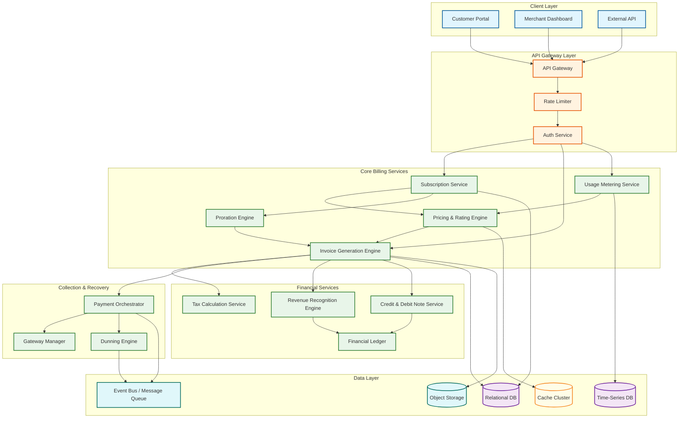
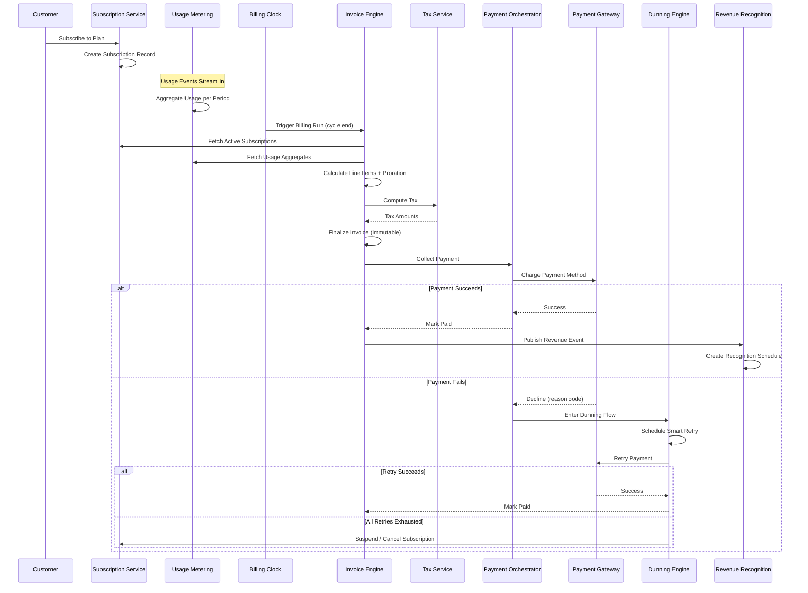

# Invoice & Billing System Design (Recurring Billing, Proration, Revenue Recognition, Dunning)

## System Overview

An Invoice & Billing System---often called a Billing Engine or Subscription Billing Platform---manages the complete revenue lifecycle from subscription creation through invoice generation, payment collection, revenue recognition, and failed-payment recovery. Systems like Stripe Billing, Chargebee, Zuora, and Recurly handle subscription management, usage-based metering, proration calculations, invoice rendering, payment orchestration across multiple gateways, dunning workflows for failed payments, credit/debit note issuance, and revenue recognition compliant with ASC 606 / IFRS 15. The core engineering challenge is building an invoice generation pipeline that can produce millions of invoices in tight billing-cycle windows while maintaining financial accuracy down to the cent, handling mid-cycle plan changes with correct proration, orchestrating payment collection across unreliable external gateways with exactly-once semantics, and recognizing revenue on the correct schedule regardless of when cash is collected. Unlike procurement systems optimized for correctness of inbound spend, billing systems must optimize for outbound revenue correctness, collection efficiency, and regulatory compliance---every invoice must be immutable once finalized, every payment attempt traceable, and every revenue dollar recognized in the correct accounting period.

---

## Key Characteristics

| Characteristic | Description |
|---------------|-------------|
| **Read/Write Pattern** | Write-heavy during billing runs (batch invoice generation, payment attempts); read-heavy for customer portal, invoice history, usage dashboards, and revenue reports |
| **Latency Sensitivity** | Low latency for real-time usage metering ingestion (< 100ms) and customer-facing invoice retrieval; tolerant of minutes-to-hours for batch billing runs and revenue recognition jobs |
| **Consistency Model** | Strong consistency for financial ledger operations (invoice finalization, payment recording, credit application); eventual consistency for usage aggregation, analytics, and reporting dashboards |
| **Data Volume** | High---platforms process 50M+ subscriptions, billions of usage events/month, 100M+ invoices/year, and petabytes of metering data |
| **Architecture Model** | Event-driven microservices with billing-cycle orchestration; CQRS for invoice generation vs. customer-facing reads; saga pattern for multi-step payment orchestration |
| **Regulatory Burden** | Very High---PCI DSS for payment data, ASC 606 / IFRS 15 for revenue recognition, SOC 2 for operational controls, local tax regulations (VAT/GST), multi-currency financial reporting |
| **Complexity Rating** | **Very High** |

---

## Quick Navigation

| Document | Description |
|----------|-------------|
| [01 - Requirements & Estimations](./01-requirements-and-estimations.md) | Functional/non-functional requirements, capacity planning, SLOs |
| [02 - High-Level Design](./02-high-level-design.md) | Architecture diagrams, data flow, key decisions |
| [03 - Low-Level Design](./03-low-level-design.md) | Data models, API design, algorithms (pseudocode) |
| [04 - Deep Dive & Bottlenecks](./04-deep-dive-and-bottlenecks.md) | Subscription lifecycle, proration, invoice pipeline, dunning strategies |
| [05 - Scalability & Reliability](./05-scalability-and-reliability.md) | Horizontal scaling, billing run partitioning, exactly-once guarantees |
| [06 - Security & Compliance](./06-security-and-compliance.md) | PCI DSS, SOC 2, data encryption, access controls, audit trail |
| [07 - Observability](./07-observability.md) | Billing metrics, invoice latency, payment success rates, dunning effectiveness |
| [08 - Interview Guide](./08-interview-guide.md) | 45-min pacing, trap questions, trade-offs, scoring rubric |
| [09 - Insights](./09-insights.md) | Key architectural insights, patterns, lessons |

---

## What Differentiates This from Related Systems

| Aspect | Invoice & Billing (This) | ERP System | Accounting / GL | Procurement | Payment Gateway |
|--------|--------------------------|------------|-----------------|-------------|-----------------|
| **Core Function** | Outbound billing lifecycle: subscriptions, invoicing, collection, revenue recognition | Unified business operations across all departments | Financial record-keeping, journal entries, period close, reporting | Inbound purchasing lifecycle: requisition to payment | Low-level payment processing: authorization, capture, settlement |
| **Revenue Model** | Manages recurring revenue, usage-based billing, hybrid models, and proration | Tracks revenue as part of broader financial operations | Records recognized revenue in journals, does not generate invoices | Manages outbound payments to suppliers, not inbound collections | Processes individual payment transactions, no subscription awareness |
| **Invoice Lifecycle** | Full lifecycle: draft → finalize → send → collect → reconcile → recognize revenue | Cross-module document management | Posts invoice amounts to GL accounts | Receives and matches vendor invoices | No invoice concept---operates at transaction level |
| **Subscription Logic** | Deep---plan management, trials, upgrades/downgrades, proration, renewal, cancellation | Shallow or delegated to billing module | None---records financial impact of subscriptions | None---procurement is purchase-order driven | None---stateless transaction processing |
| **Failed Payment Handling** | Sophisticated dunning: smart retries, cascading gateways, customer communication, grace periods | Delegates to billing/AR module | Records bad debt provisions | Not applicable (pays, does not collect) | Returns decline codes; no retry intelligence |
| **Revenue Recognition** | ASC 606 / IFRS 15 compliant: performance obligations, allocation, recognition schedules | May include rev-rec module or delegate to GL | Records journal entries per recognition schedule | Not applicable | Not applicable |
| **Usage Metering** | Real-time event ingestion, aggregation, rating against pricing tiers | Limited to ERP-tracked consumption | None | None | None |

---

## What Makes This System Unique

1. **Billing Clock as a Distributed Scheduler**: Unlike request-driven systems that respond to user actions, a billing system must autonomously generate invoices at the correct moment for millions of subscriptions with different billing dates, timezones, and cycle lengths. The billing clock is a distributed scheduler that must guarantee exactly-once invoice generation---producing a duplicate invoice is a financial error, and missing an invoice is lost revenue. This scheduler must handle clock drift, timezone transitions (including daylight saving), and graceful catch-up after outages.

2. **Proration as a Financial State Machine**: Mid-cycle plan changes (upgrades, downgrades, quantity adjustments) create proration scenarios where the system must calculate partial charges and credits with cent-level precision. The proration engine must handle multiple changes within a single billing period, producing a coherent invoice that reflects the customer's plan history. This is not simple date arithmetic---it involves tracking performance obligations and applying the correct pricing for each sub-period.

3. **Invoice Immutability with Correction Semantics**: Once an invoice is finalized and sent, it cannot be modified---this is a legal and accounting requirement in most jurisdictions. Corrections are issued as credit notes (reducing the amount) or debit notes (increasing the amount) that reference the original invoice. This append-only correction model creates a chain of financial documents that must maintain referential integrity and net to the correct balance.

4. **Dunning as a Multi-Channel Recovery Orchestration**: Failed payment recovery is not just retrying the charge. Effective dunning orchestrates smart retry timing (based on decline reason codes, card network patterns, and time-of-day optimization), gateway failover (cascading to alternative payment processors), customer communication (escalating email/SMS sequences), and service degradation (grace periods before suspension). Each customer's dunning state machine runs independently with configurable policies per segment.

5. **Revenue Recognition Decoupled from Cash Collection**: Under ASC 606 / IFRS 15, revenue is recognized when performance obligations are satisfied, not when payment is received. An annual subscription paid upfront generates 12 monthly revenue recognition events. A usage-based charge generates revenue at the point of consumption. The billing system must maintain dual ledgers: a cash ledger (when money moved) and a revenue ledger (when obligations were fulfilled), with automated reconciliation between the two.

6. **Multi-Currency Invoicing with Tax Integration**: The system must generate invoices in the customer's preferred currency while maintaining internal accounting in a base currency. Each invoice must integrate with tax calculation services to apply the correct VAT, GST, sales tax, or other levies based on the seller's nexus, buyer's location, and product taxability classification---all before the invoice is finalized and becomes immutable.

---

## Quick Reference: Scale Numbers

| Metric | Value | Notes |
|--------|-------|-------|
| Active subscriptions | ~50M | Across all tenants on a multi-tenant billing platform |
| Usage events ingested per day | ~5B | Metering events: API calls, storage bytes, compute minutes |
| Invoices generated per month | ~60M | Including renewals, usage charges, and one-time items |
| Peak billing run throughput | ~500K invoices/hour | Concentrated in first 3 days of billing cycle |
| Payment attempts per day | ~10M | Including initial charges and dunning retries |
| Payment success rate (first attempt) | ~92--95% | Varies by payment method and geography |
| Dunning recovery rate | ~40--55% | Percentage of initially failed payments recovered |
| Revenue recognized per month | ~$15B | Across all tenants; requires period-accurate allocation |
| Credit/debit notes per month | ~2M | Corrections, refunds, and adjustments |
| Currencies supported | ~135 | With real-time exchange rate feeds |
| Tax jurisdictions computed | ~30K+ | Federal, state, county, city, and special district rates |
| Average invoice line items | ~4 | Ranges from 1 (simple subscription) to 100+ (usage tiers) |
| Webhook delivery rate | ~200M events/month | Invoice, payment, subscription lifecycle events to merchants |
| Customer portal page views | ~50M/month | Self-service invoice download, payment method update, plan changes |

---

## Architecture Overview (Conceptual)

---

## Key Trade-Offs in Invoice & Billing System Design

| Trade-Off | Option A | Option B | This System's Choice |
|-----------|----------|----------|---------------------|
| **Invoice Generation** | Real-time (generate on demand) | Batch (scheduled billing runs) | Hybrid: batch for cycle renewals (efficiency at scale); real-time for one-time charges and mid-cycle changes |
| **Usage Aggregation** | Real-time aggregation (always current) | Periodic snapshots (batched) | Periodic with near-real-time dashboards: aggregate usage events every 5 minutes for billing; real-time estimates for customer-facing display |
| **Payment Retry Strategy** | Fixed schedule (retry every 3 days) | Intelligent/adaptive (ML-driven timing) | Intelligent: retry timing based on decline reason code, card network, time-of-day optimization, and customer segment behavior |
| **Revenue Recognition** | Inline during invoice finalization | Async post-processing pipeline | Async pipeline: invoice finalization publishes events; rev-rec engine processes recognition schedules independently to avoid blocking billing |
| **Invoice Storage** | Relational DB only (queryable) | Object storage as PDF + metadata in DB | Hybrid: structured invoice data in relational DB for queries; rendered PDF in object storage for download; ensures long-term archival compliance |
| **Multi-Currency** | Convert at invoice time (lock rate) | Convert at payment time (floating rate) | Convert at invoice time: exchange rate locked at finalization for financial predictability; rate source from treasury feed |
| **Proration Calculation** | Simple daily proration | Weighted by calendar days in period | Calendar-day weighted: accounts for months of different lengths; February upgrade prorates differently from July upgrade |

---

## Billing Lifecycle Flow

---

## Related Designs

| Design | Relevance |
|--------|-----------|
| [9.1 - ERP System](../9.1-erp-system-design/) | Parent system; billing is a core ERP module with integration to GL, AR, and order management |
| [9.2 - Accounting / General Ledger](../9.2-accounting-general-ledger-system/) | Revenue recognition journal entries, accounts receivable posting, period close |
| [9.3 - Tax Calculation Engine](../9.3-tax-calculation-engine/) | Tax computation for invoice line items; nexus determination; compliance reporting |
| [9.5 - Procurement System](../9.5-procurement-system/) | Inverse process: procurement handles inbound invoices; billing handles outbound invoices |

---

## Sources

- Stripe Engineering --- Billing Infrastructure at Scale, Subscription Lifecycle Architecture
- Chargebee Engineering --- Usage-Based Billing Engine, Dunning Optimization Pipeline
- Zuora Architecture --- Billing Run Design, Revenue Recognition Engine (Z-Finance)
- Recurly Engineering --- Smart Dunning, Payment Retry Optimization
- Lago Open-Source Billing --- Event-Driven Metering Architecture
- Metronome Engineering --- Usage-Based Billing and Rating Engine Design
- ASC 606 (FASB) / IFRS 15 (IASB) --- Revenue from Contracts with Customers
- PCI Security Standards Council --- PCI DSS v4.0 Requirements for Payment Systems
- Gartner --- Magic Quadrant for Recurring Billing Applications (2025)
- Forrester --- The Forrester Wave: SaaS Billing Solutions (Q1 2025)
