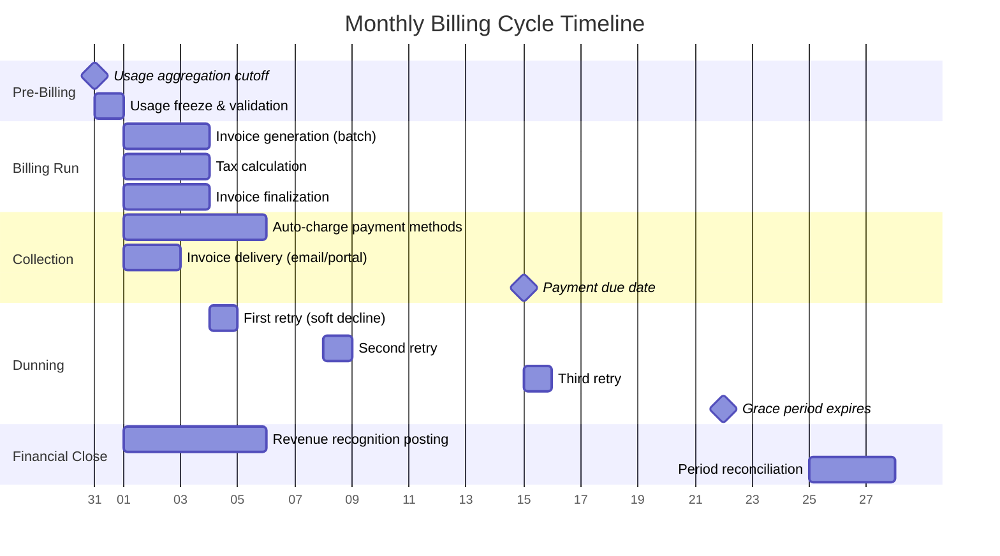

# Requirements & Estimations

## Functional Requirements

### Core Billing Features

| ID | Requirement | Description |
|----|-------------|-------------|
| FR-01 | **Subscription Management** | Create, update, pause, resume, cancel subscriptions with support for trials, fixed-term contracts, and auto-renewal |
| FR-02 | **Plan & Pricing Configuration** | Define pricing plans with flat-rate, per-unit, tiered, volume, staircase, and package models; support add-ons and discounts |
| FR-03 | **Usage-Based Metering** | Ingest, deduplicate, and aggregate usage events in near-real-time; support multiple meters per subscription |
| FR-04 | **Invoice Generation** | Automatically generate invoices at billing cycle boundaries; include subscription charges, usage charges, proration adjustments, taxes, and discounts |
| FR-05 | **Proration Engine** | Calculate prorated charges and credits for mid-cycle plan changes (upgrades, downgrades, quantity adjustments, add-on modifications) |
| FR-06 | **Payment Collection** | Orchestrate payment collection across multiple gateways; support credit card, ACH/SEPA, wire transfer, and digital wallet methods |
| FR-07 | **Dunning & Recovery** | Manage failed payment recovery with configurable retry schedules, smart retry timing, gateway failover, customer notification sequences, and grace periods |
| FR-08 | **Credit & Debit Notes** | Issue credit notes for refunds, corrections, and goodwill adjustments; issue debit notes for additional charges; maintain referential integrity to original invoice |
| FR-09 | **Revenue Recognition** | Automatically generate revenue recognition schedules compliant with ASC 606 / IFRS 15; handle deferred revenue, performance obligations, and multi-element arrangements |
| FR-10 | **Tax Integration** | Calculate applicable taxes (VAT, GST, sales tax) per invoice line item based on seller nexus, buyer location, and product tax classification |

### Supporting Features

| ID | Requirement | Description |
|----|-------------|-------------|
| FR-11 | **Multi-Currency** | Generate invoices in customer's currency; maintain base-currency accounting; lock exchange rates at invoice finalization |
| FR-12 | **Customer Portal** | Self-service portal for invoice download, payment method management, plan changes, and usage dashboards |
| FR-13 | **Webhook & Event System** | Publish billing lifecycle events (invoice.created, payment.succeeded, subscription.cancelled) to merchant integrations via webhooks |
| FR-14 | **Invoice PDF Rendering** | Generate professional, customizable PDF invoices with merchant branding, line item details, tax breakdowns, and payment instructions |
| FR-15 | **Reporting & Analytics** | MRR/ARR tracking, churn analysis, revenue waterfall, aging receivables, dunning effectiveness metrics |
| FR-16 | **Coupon & Discount Management** | Apply percentage or fixed-amount coupons at subscription or invoice level with duration limits, redemption caps, and stackability rules |
| FR-17 | **Prepaid Credits & Wallet** | Maintain customer credit balances; auto-apply credits before charging payment method; support credit top-ups and expiration |

---

## Non-Functional Requirements

| Category | Requirement | Target |
|----------|-------------|--------|
| **Availability** | Billing API and customer portal | 99.99% (< 52 min downtime/year) |
| **Availability** | Invoice generation pipeline | 99.95% (< 4.4 hours downtime/year) |
| **Latency** | API response time (p50 / p99) | 50ms / 500ms |
| **Latency** | Usage event ingestion (p99) | < 100ms acknowledgment |
| **Latency** | Invoice PDF generation | < 5 seconds per invoice |
| **Throughput** | Usage event ingestion | 100K events/second sustained; 500K burst |
| **Throughput** | Billing run (invoice generation) | 500K invoices/hour per billing partition |
| **Throughput** | Payment processing | 5,000 payment attempts/second |
| **Consistency** | Financial operations | Strong consistency (serializable isolation for ledger writes) |
| **Consistency** | Usage aggregation | Eventual consistency with 5-minute convergence window |
| **Durability** | Invoice and payment records | Zero data loss; replicated across 3+ availability zones |
| **Idempotency** | All financial operations | Exactly-once semantics via idempotency keys |
| **Scalability** | Horizontal scaling | Linear scaling to 100M+ subscriptions |
| **Compliance** | PCI DSS Level 1 | For any system handling cardholder data |
| **Compliance** | SOC 2 Type II | Continuous compliance for all billing operations |
| **Compliance** | ASC 606 / IFRS 15 | Automated revenue recognition schedules |
| **Data Retention** | Invoice records | 7+ years (regulatory requirement) |
| **Disaster Recovery** | RPO / RTO | RPO < 1 minute; RTO < 15 minutes |

---

## Capacity Estimations

### Subscription & Invoice Volume

```
Active subscriptions:             50,000,000
Average billing cycles per year:  12 (monthly majority)

Monthly invoices:
  Recurring subscriptions:        50M × 1          = 50,000,000
  Mid-cycle changes (proration):  50M × 5%         =  2,500,000
  One-time charges:               ~5,000,000
  Credit/debit notes:             ~2,000,000
  ─────────────────────────────────────────────────
  Total monthly invoices:         ~59,500,000 ≈ 60M

Daily invoices (average):         60M / 30          = 2,000,000
Daily invoices (peak first 3 days): 60M × 40% / 3  = 8,000,000
Peak hourly invoice generation:   8M / 16 hours     = 500,000
```

### Usage Metering Volume

```
Subscriptions with usage-based component:  50M × 30%     = 15,000,000
Average usage events per subscription/day: ~350
Daily usage events:                        15M × 350     = 5,250,000,000 ≈ 5B
Peak events per second:                    5B / 86400 × 3 = ~175,000 (3x average)

Usage event size:                          ~200 bytes
Daily usage data:                          5B × 200B     = 1 TB/day
Monthly usage data (raw):                  ~30 TB
Monthly usage data (aggregated):           ~500 GB (after rollup)
```

### Payment Processing Volume

```
Monthly payment attempts:
  First-attempt payments:         60M invoices × 70% auto-pay = 42,000,000
  Dunning retries:                42M × 8% failure × 3 retries = 10,080,000
  Manual payments:                ~5,000,000
  ─────────────────────────────────────────────────────────────
  Total monthly attempts:         ~57,000,000

Daily payment attempts:           57M / 30           = 1,900,000
Peak daily (first 3 days):        57M × 35% / 3     = 6,650,000
Peak payment TPS:                 6.65M / 86400      = ~77 TPS (sustained)
Burst payment TPS:                ~300 TPS
```

### Storage Estimations

```
Invoice record size (structured):     ~2 KB per invoice
Invoice PDF size:                     ~50 KB per invoice
Revenue recognition schedule:         ~500 bytes per invoice

Monthly storage:
  Invoice records:    60M × 2 KB    = 120 GB
  Invoice PDFs:       60M × 50 KB   = 3 TB
  Usage events (raw): 30 TB (30-day retention, then aggregate)
  Usage aggregates:   500 GB (retained indefinitely)
  Rev-rec schedules:  60M × 500B    = 30 GB
  ────────────────────────────────────
  Total monthly new:  ~33.7 TB

Annual storage:
  Structured data:    ~1.8 TB
  Invoice PDFs:       ~36 TB
  Usage (aggregated): ~6 TB
  ────────────────────────────────────
  Total annual:       ~43.8 TB

7-year retention total:  ~300 TB
```

### Network Estimations

```
Usage event ingestion bandwidth:
  Peak: 175K events/sec × 200B   = 35 MB/sec inbound

Invoice delivery bandwidth:
  Peak: 500K invoices/hour × 50KB PDF = 7 GB/hour = ~2 MB/sec

Webhook delivery:
  200M events/month → ~75 events/sec
  Average payload: 1 KB
  Bandwidth: 75 KB/sec (negligible)

Payment gateway communication:
  Peak: 300 TPS × 2 KB (request + response) = 600 KB/sec
```

---

## SLO Definitions

| SLO | Target | Measurement Window | Error Budget |
|-----|--------|--------------------|--------------|
| **Invoice Generation Completeness** | 100% of due invoices generated within 24 hours of billing date | Per billing cycle | Zero tolerance---missing invoices are revenue loss |
| **Invoice Financial Accuracy** | 100% correct amounts (charges, tax, proration) | Per invoice | Zero tolerance---financial errors require credit notes |
| **Payment Processing Availability** | 99.99% | 30-day rolling | 4.3 minutes/month |
| **Usage Event Ingestion Availability** | 99.95% | 30-day rolling | 21.6 minutes/month |
| **API Latency (p99)** | < 500ms | 5-minute rolling | 1% of requests may exceed |
| **First-Attempt Payment Success Rate** | > 92% | 7-day rolling | Monitored; below 90% triggers gateway investigation |
| **Dunning Recovery Rate** | > 45% | 30-day rolling | Below 35% triggers retry strategy review |
| **Webhook Delivery (first attempt)** | 99.9% success within 30 seconds | 24-hour rolling | 0.1% may be retried |
| **Invoice PDF Generation Latency** | < 5 seconds (p99) | 1-hour rolling | 1% may exceed |
| **Revenue Recognition Timeliness** | All rev-rec entries posted within 24 hours of invoice finalization | Per billing cycle | Critical for period close |

---

## Billing Cycle Timeline



---

## Key Assumptions

| Assumption | Rationale |
|------------|-----------|
| 70% of invoices are auto-charged (card on file) | Industry standard for B2B SaaS; remainder are net-terms or manual payment |
| 8% first-attempt payment failure rate | Average across credit card, ACH, and SEPA; cards fail at ~5-8%, ACH at ~3-5% |
| 30% of subscriptions include usage-based components | Growing trend toward hybrid pricing; majority still flat-rate or per-seat |
| Monthly billing is dominant (75% of subscriptions) | Annual billing accounts for ~20%, quarterly ~5% |
| Average 3 dunning retry attempts before exhaustion | Balance between recovery rate and customer experience |
| Invoice PDFs retained for 7 years minimum | Regulatory requirement in most jurisdictions for tax audit compliance |
| Multi-currency involves 10-15 active currencies per merchant | Top currencies: USD, EUR, GBP, JPY, CAD, AUD, INR, BRL |
| Usage event deduplication required within 24-hour window | Events may be replayed due to client retries or network issues |
