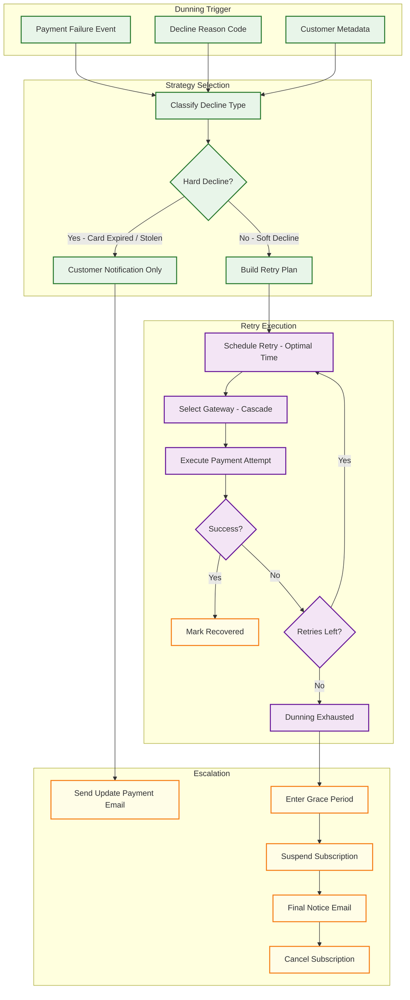
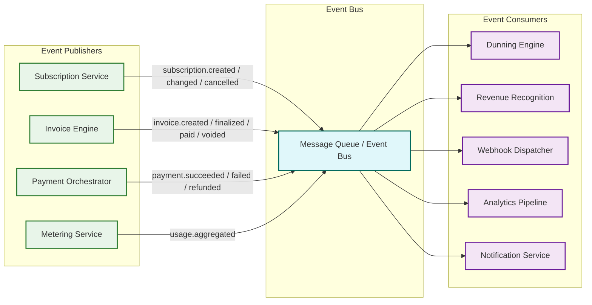

# High-Level Design

## Architecture Overview

The Invoice & Billing System follows an event-driven microservices architecture organized around six functional domains: subscription management, usage metering, invoice generation, payment collection, revenue recognition, and customer self-service. The architecture separates the hot path (real-time usage ingestion, API requests) from the batch path (billing runs, revenue recognition posting) to optimize for both latency and throughput.

---

## System Architecture

```mermaid
flowchart TB
    subgraph Client["Client Layer"]
        PORTAL[Customer Self-Service Portal]
        MERCH[Merchant Dashboard]
        API_PUB[Public Billing API]
        METER_API[Metering Ingestion API]
    end

    subgraph Edge["Edge Layer"]
        CDN[CDN / Static Assets]
        AG[API Gateway]
        RL[Rate Limiter / Throttle]
        AUTHN[Authentication Service]
    end

    subgraph Subscription["Subscription Domain"]
        SUB_SVC[Subscription Service]
        PLAN_SVC[Plan & Pricing Service]
        COUPON[Coupon & Discount Service]
        TRIAL[Trial Manager]
    end

    subgraph Metering["Metering Domain"]
        INGEST[Event Ingestion Pipeline]
        DEDUP[Deduplication Engine]
        AGG[Aggregation Service]
        TS_STORE[(Time-Series Store)]
    end

    subgraph Invoicing["Invoice Generation Domain"]
        CLOCK[Billing Clock / Scheduler]
        CALC[Charge Calculator]
        PRORATE[Proration Engine]
        TAX_INT[Tax Integration]
        INV_GEN[Invoice Assembler]
        PDF[PDF Renderer]
    end

    subgraph Collection["Payment Collection Domain"]
        PAY_ORCH[Payment Orchestrator]
        GW_ROUTE[Gateway Router]
        DUNNING[Dunning Engine]
        WEBHOOK[Webhook Dispatcher]
    end

    subgraph Financial["Financial Domain"]
        REV_REC[Revenue Recognition Engine]
        CREDIT_SVC[Credit / Debit Note Service]
        LEDGER[Financial Ledger]
        WALLET[Prepaid Credit Wallet]
    end

    subgraph Data["Shared Data Infrastructure"]
        PG[(Primary Relational DB)]
        PG_READ[(Read Replicas)]
        REDIS[(Cache / Rate Counters)]
        KAFKA[Event Bus]
        S3[(Object Storage)]
        SEARCH[(Search / Analytics)]
    end

    PORTAL --> CDN
    PORTAL --> AG
    MERCH --> AG
    API_PUB --> AG
    METER_API --> INGEST
    AG --> RL --> AUTHN

    AUTHN --> SUB_SVC
    AUTHN --> INV_GEN
    AUTHN --> PAY_ORCH

    SUB_SVC --> PLAN_SVC
    SUB_SVC --> COUPON
    SUB_SVC --> TRIAL

    INGEST --> DEDUP --> AGG
    AGG --> TS_STORE

    CLOCK --> INV_GEN
    INV_GEN --> CALC
    CALC --> PLAN_SVC
    CALC --> AGG
    CALC --> PRORATE
    INV_GEN --> TAX_INT
    INV_GEN --> PDF
    INV_GEN --> WALLET

    INV_GEN --> PAY_ORCH
    PAY_ORCH --> GW_ROUTE
    PAY_ORCH --> DUNNING
    PAY_ORCH --> WEBHOOK

    INV_GEN --> REV_REC
    INV_GEN --> CREDIT_SVC
    REV_REC --> LEDGER
    CREDIT_SVC --> LEDGER

    SUB_SVC --> PG
    INV_GEN --> PG
    PAY_ORCH --> PG
    LEDGER --> PG
    PORTAL --> PG_READ
    MERCH --> PG_READ
    PLAN_SVC --> REDIS
    SUB_SVC --> KAFKA
    INV_GEN --> KAFKA
    PAY_ORCH --> KAFKA
    PDF --> S3
    AGG --> SEARCH

    classDef client fill:#e1f5fe,stroke:#01579b,stroke-width:2px
    classDef api fill:#fff3e0,stroke:#e65100,stroke-width:2px
    classDef service fill:#e8f5e9,stroke:#2e7d32,stroke-width:2px
    classDef data fill:#f3e5f5,stroke:#6a1b9a,stroke-width:2px
    classDef cache fill:#fffde7,stroke:#f57f17,stroke-width:2px
    classDef queue fill:#e0f7fa,stroke:#00695c,stroke-width:2px

    class PORTAL,MERCH,API_PUB,METER_API client
    class CDN,AG,RL,AUTHN api
    class SUB_SVC,PLAN_SVC,COUPON,TRIAL,INGEST,DEDUP,AGG,CLOCK,CALC,PRORATE,TAX_INT,INV_GEN,PDF,PAY_ORCH,GW_ROUTE,DUNNING,WEBHOOK,REV_REC,CREDIT_SVC,LEDGER,WALLET service
    class PG,PG_READ,TS_STORE data
    class REDIS,SEARCH cache
    class KAFKA,S3 queue
```



---

## Data Flow: Invoice Generation Pipeline

The billing run is the most critical batch process in the system. It executes on a billing-cycle boundary for each subscription partition.

```mermaid
flowchart LR
    subgraph Phase1["Phase 1: Selection"]
        CLOCK[Billing Clock] --> SELECT[Select Due Subscriptions]
        SELECT --> PARTITION[Partition by Billing Date Hash]
    end

    subgraph Phase2["Phase 2: Calculation"]
        PARTITION --> FETCH[Fetch Plan + Usage + Credits]
        FETCH --> CHARGE[Calculate Base Charges]
        CHARGE --> PRORATE[Apply Proration Adjustments]
        PRORATE --> DISCOUNT[Apply Coupons / Discounts]
        DISCOUNT --> TAX[Calculate Tax per Line Item]
    end

    subgraph Phase3["Phase 3: Finalization"]
        TAX --> ASSEMBLE[Assemble Invoice]
        ASSEMBLE --> VALIDATE[Financial Validation]
        VALIDATE --> FINALIZE[Finalize - Make Immutable]
        FINALIZE --> PDF[Render PDF]
        FINALIZE --> PERSIST[Persist to DB + Object Store]
    end

    subgraph Phase4["Phase 4: Collection"]
        PERSIST --> CREDIT_CHECK[Apply Prepaid Credits]
        CREDIT_CHECK --> CHARGE_PM[Charge Payment Method]
        CHARGE_PM --> RESULT{Payment Result}
        RESULT -->|Success| MARK_PAID[Mark Invoice Paid]
        RESULT -->|Failure| DUNNING[Enter Dunning Queue]
    end

    classDef service fill:#e8f5e9,stroke:#2e7d32,stroke-width:2px
    classDef data fill:#f3e5f5,stroke:#6a1b9a,stroke-width:2px
    classDef cache fill:#fffde7,stroke:#f57f17,stroke-width:2px

    class CLOCK,SELECT,PARTITION service
    class FETCH,CHARGE,PRORATE,DISCOUNT,TAX service
    class ASSEMBLE,VALIDATE,FINALIZE,PDF,PERSIST data
    class CREDIT_CHECK,CHARGE_PM,MARK_PAID,DUNNING cache
```



---

## Data Flow: Usage Metering Pipeline

Usage events flow through a multi-stage pipeline from ingestion to billing-ready aggregates.

```mermaid
flowchart LR
    subgraph Ingestion["Ingestion Layer"]
        CLIENT[Client SDK / API] --> ENDPOINT[Metering Endpoint]
        ENDPOINT --> VALIDATE[Schema Validation]
        VALIDATE --> ACK[Acknowledge to Client]
        VALIDATE --> BUFFER[Write-Ahead Buffer]
    end

    subgraph Processing["Processing Layer"]
        BUFFER --> DEDUP[Deduplication - Idempotency Key]
        DEDUP --> ENRICH[Enrich - Customer + Meter Metadata]
        ENRICH --> ROUTE[Route to Meter-Specific Aggregator]
    end

    subgraph Aggregation["Aggregation Layer"]
        ROUTE --> WINDOW[Time-Window Aggregation - 5 min]
        WINDOW --> ROLLUP[Hourly / Daily Rollup]
        ROLLUP --> SNAPSHOT[Billing Period Snapshot]
    end

    subgraph Output["Output Layer"]
        SNAPSHOT --> BILLING[Billing-Ready Aggregate]
        WINDOW --> REALTIME[Real-Time Usage Dashboard]
        ROLLUP --> ANALYTICS[Usage Analytics]
    end

    classDef service fill:#e8f5e9,stroke:#2e7d32,stroke-width:2px
    classDef data fill:#f3e5f5,stroke:#6a1b9a,stroke-width:2px

    class CLIENT,ENDPOINT,VALIDATE,ACK,BUFFER service
    class DEDUP,ENRICH,ROUTE service
    class WINDOW,ROLLUP,SNAPSHOT service
    class BILLING,REALTIME,ANALYTICS data
```



---

## Data Flow: Dunning & Payment Recovery



---

## Key Architecture Decisions

### Decision 1: Billing Clock Design

**Context**: Millions of subscriptions have different billing dates, cycle lengths, and timezones. The system must trigger invoice generation at the correct moment for each.

**Decision**: Partition-based billing clock with date-bucketed scheduling.

**Rationale**: Rather than a per-subscription timer (which creates millions of scheduled jobs), subscriptions are bucketed by billing date into daily partitions. The billing clock runs a daily sweep that processes each partition:

```
Day-1 partition: All subscriptions billing on the 1st
Day-2 partition: All subscriptions billing on the 2nd
...
Day-31 partition: All subscriptions billing on the 31st
```

For months without a 31st (or 30th, or 29th), subscriptions in those partitions are shifted to the last day of the month. Each partition is further subdivided by tenant ID range for parallel processing.

**Trade-off**: Partitioning by billing date concentrates load on the 1st of the month (most common billing date). Mitigation: allow merchants to distribute billing dates across the month ("billing date spreading").

### Decision 2: Invoice Immutability Model

**Context**: Invoices are legal documents. Many jurisdictions require that finalized invoices cannot be altered---corrections must be issued as separate credit/debit notes.

**Decision**: Append-only correction model. Once an invoice transitions to FINALIZED status, its financial data is immutable. All corrections reference the original invoice via credit notes (reducing amount) or debit notes (increasing amount).

**Rationale**: This satisfies legal requirements in the EU (VAT directive), India (GST), and many other jurisdictions. It also simplifies the audit trail---the original invoice plus all associated notes net to the true balance.

**Trade-off**: More complex reconciliation (must aggregate invoice + notes to determine true balance). Mitigation: maintain a denormalized `net_amount` on the customer account that is updated on every note issuance.

### Decision 3: Payment Orchestration with Gateway Abstraction

**Context**: No single payment gateway has global coverage. Different regions, payment methods, and card networks have different success rates across gateways.

**Decision**: Gateway abstraction layer with intelligent routing. The payment orchestrator selects the optimal gateway based on:
- Payment method type (card → Gateway A; ACH → Gateway B; SEPA → Gateway C)
- Geographic routing (EU cards → EU-based gateway for lower fees and higher success)
- Cascade on failure (if Gateway A declines, retry on Gateway B before entering dunning)
- Cost optimization (route to lowest-fee gateway for high-value transactions)

**Rationale**: Multi-gateway routing improves overall payment success by 3--5% and reduces processing costs by enabling competitive fee routing.

**Trade-off**: Increased complexity in reconciliation (payments spread across multiple gateways). Mitigation: centralized payment ledger that aggregates gateway settlement reports.

### Decision 4: Usage Metering Separation

**Context**: Usage events arrive at very high volume (100K+ events/sec) and must not block or slow down the billing pipeline.

**Decision**: Separate the metering pipeline from the billing pipeline. Usage events flow through a dedicated ingestion path (write-ahead buffer → deduplication → aggregation) that produces billing-ready aggregates consumed by the invoice generator.

**Rationale**: Metering has fundamentally different performance characteristics: very high write throughput, append-only, tolerant of eventual consistency. Billing requires strong consistency and complex business logic. Separating them allows each to scale independently and use appropriate storage (time-series store for raw events; relational DB for billing data).

**Trade-off**: Usage aggregates have a convergence delay (up to 5 minutes). Mitigation: real-time usage estimates are served from the streaming layer for customer dashboards, while billing uses the fully-converged aggregates.

### Decision 5: Revenue Recognition as Async Pipeline

**Context**: Revenue recognition involves complex allocation logic (multi-element arrangements, stand-alone selling price determination, variable consideration) that should not block invoice generation.

**Decision**: Invoice finalization publishes a `invoice.finalized` event. The revenue recognition engine subscribes to this event and asynchronously creates recognition schedules. Recognition entries are posted to the financial ledger independently.

**Rationale**: Invoice generation is time-critical (must complete within the billing window). Revenue recognition is deadline-tolerant (must be complete before period close, typically days later). Decoupling them prevents rev-rec complexity from slowing billing runs.

**Trade-off**: Revenue data lags behind invoice data. Mitigation: rev-rec pipeline targets < 1 hour processing delay; real-time dashboards show "pending rev-rec" status.

---

## Service Boundaries and Communication

| Service | Owns | Communicates With | Protocol |
|---------|------|-------------------|----------|
| **Subscription Service** | Subscription lifecycle, plan assignments | Plan Service, Trial Manager, Coupon Service | Sync (gRPC) |
| **Plan & Pricing Service** | Plan definitions, pricing tiers, rate cards | Subscription Service, Charge Calculator | Sync (gRPC) + Cache |
| **Usage Metering Service** | Event ingestion, dedup, aggregation | Time-series store, Charge Calculator | Async (event stream) |
| **Invoice Generation Engine** | Invoice lifecycle, line items, finalization | All calculation services, Tax, PDF | Sync (internal) + Async (events) |
| **Payment Orchestrator** | Payment attempts, gateway routing, reconciliation | Gateway Manager, Dunning Engine | Sync (gateway calls) + Async (events) |
| **Dunning Engine** | Retry schedules, escalation state machine | Payment Orchestrator, Subscription Service, Notification | Async (event-driven) |
| **Revenue Recognition Engine** | Recognition schedules, deferred revenue, journal entries | Financial Ledger | Async (event-driven) |
| **Financial Ledger** | Double-entry ledger, account balances | Revenue Recognition, Credit/Debit Service | Sync (writes) + Read replicas |
| **Webhook Dispatcher** | Outbound event delivery, retry logic | All services (subscribes to event bus) | Async (event bus → HTTP delivery) |

---

## Event-Driven Communication



### Key Events

| Event | Publisher | Key Consumers | Trigger |
|-------|-----------|---------------|---------|
| `subscription.created` | Subscription Service | Analytics, Webhook | New subscription activated |
| `subscription.updated` | Subscription Service | Invoice Engine (proration), Webhook | Plan change, quantity adjustment |
| `subscription.cancelled` | Subscription Service | Rev-Rec (final recognition), Webhook | Customer or dunning-triggered cancellation |
| `invoice.finalized` | Invoice Engine | Rev-Rec, Webhook, Payment Orchestrator | Invoice ready for collection |
| `invoice.paid` | Payment Orchestrator | Rev-Rec, Webhook, Notification | Full payment received |
| `payment.failed` | Payment Orchestrator | Dunning Engine, Webhook, Notification | Payment attempt declined |
| `payment.succeeded` | Payment Orchestrator | Ledger, Webhook | Successful charge (including dunning recovery) |
| `dunning.exhausted` | Dunning Engine | Subscription Service (suspension), Webhook | All retry attempts failed |
| `usage.period_closed` | Metering Service | Invoice Engine | Usage aggregation complete for billing period |
| `credit_note.issued` | Credit Service | Ledger, Rev-Rec (reversal), Webhook | Refund or correction applied |

---

## Multi-Tenancy Model

The system serves as a platform for thousands of merchants (tenants). Each merchant manages their own customers, subscriptions, and billing configuration.

| Concern | Approach |
|---------|----------|
| **Data Isolation** | Logical isolation via `tenant_id` column on all tables; row-level security policies in the database |
| **Configuration Isolation** | Per-tenant billing settings: billing day preferences, dunning policies, payment gateway credentials, tax configuration, branding |
| **Compute Isolation** | Shared compute for most operations; dedicated billing-run workers for high-volume tenants (> 1M subscriptions) |
| **Rate Limiting** | Per-tenant API rate limits; usage metering has separate per-tenant ingestion quotas |
| **Noisy Neighbor Prevention** | Billing run partitioning ensures one tenant's large billing run does not delay another's |

---

## External Integration Points

| Integration | Direction | Protocol | Purpose |
|-------------|-----------|----------|---------|
| Payment gateways (3+) | Outbound | HTTPS / REST | Charge, refund, void payment methods |
| Tax calculation service | Outbound | HTTPS / REST | Real-time tax computation per invoice line |
| Email delivery service | Outbound | HTTPS / REST | Invoice delivery, dunning notifications, receipts |
| Accounting system / ERP | Outbound | Webhook + API | Push journal entries, sync customer/invoice data |
| Bank settlement feeds | Inbound | SFTP / API | Reconcile actual settlements against recorded payments |
| Card network tokenization | Outbound | HTTPS | PCI-compliant card token management |
| Currency exchange rate feed | Inbound | HTTPS / WebSocket | Real-time and daily exchange rates for multi-currency |
| Fraud detection service | Outbound | HTTPS | Score payment attempts for fraud risk |
