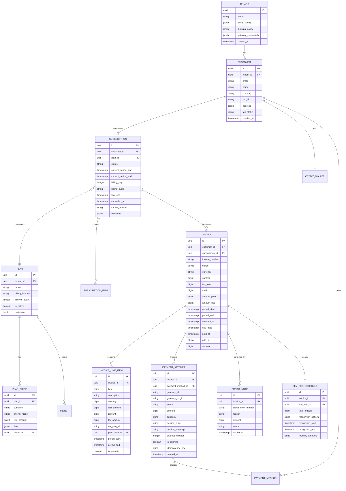
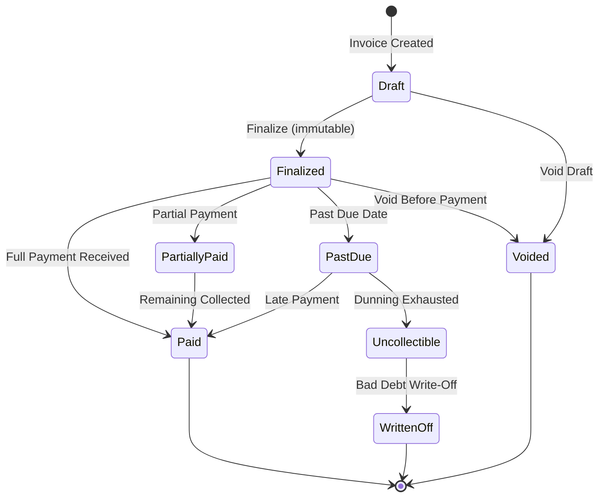
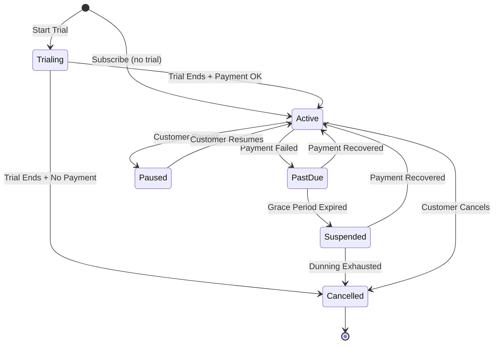

# Low-Level Design

## Data Model

### Core Entity Relationship



### Key Schema Details

#### Financial Amounts

All monetary amounts are stored as **integers in the smallest currency unit** (cents for USD, pence for GBP, etc.) to avoid floating-point precision issues. The `currency` field determines the decimal position for display.

```
Amount: $149.99 → stored as 14999 (bigint)
Amount: ¥1500  → stored as 1500  (bigint, JPY has no subunit)
```

#### Invoice Status State Machine



#### Subscription Status State Machine



---

## API Design

### Subscription APIs

```
POST   /v1/subscriptions
  Body: { customer_id, plan_id, items[], trial_end?, billing_day?, coupon_id?, payment_method_id }
  Response: 201 { subscription object }
  Idempotency: Required (Idempotency-Key header)

GET    /v1/subscriptions/{id}
  Response: 200 { subscription object with current_period, plan, items }

PATCH  /v1/subscriptions/{id}
  Body: { items[]?, plan_id?, coupon_id?, proration_behavior: "create_prorations" | "none" | "always_invoice" }
  Response: 200 { updated subscription, pending_proration_invoice? }

POST   /v1/subscriptions/{id}/cancel
  Body: { cancel_at: "period_end" | "immediately", reason? }
  Response: 200 { subscription with cancel_at_period_end or cancelled status }

POST   /v1/subscriptions/{id}/pause
  Body: { resume_at? }
  Response: 200 { subscription with paused status }

POST   /v1/subscriptions/{id}/resume
  Response: 200 { subscription with active status }
```

### Invoice APIs

```
GET    /v1/invoices
  Query: customer_id, subscription_id, status, created[gte], created[lte], limit, starting_after
  Response: 200 { data: [invoice objects], has_more, next_cursor }

GET    /v1/invoices/{id}
  Response: 200 { invoice with line_items[], payment_attempts[], credit_notes[] }

POST   /v1/invoices/{id}/finalize
  Response: 200 { finalized invoice }

POST   /v1/invoices/{id}/pay
  Body: { payment_method_id?, off_session: true|false }
  Response: 200 { invoice with payment_attempt result }

POST   /v1/invoices/{id}/void
  Response: 200 { voided invoice }
  Constraint: Only if status is draft or finalized with no payments

GET    /v1/invoices/{id}/pdf
  Response: 302 redirect to signed PDF URL
```

### Usage Metering APIs

```
POST   /v1/usage_events
  Body: { events: [{ customer_id, meter_id, value, timestamp, idempotency_key }] }
  Response: 202 { accepted: N, duplicates: M }
  Note: Batch endpoint accepts up to 100 events per call

GET    /v1/usage_summary
  Query: customer_id, meter_id, period_start, period_end, granularity (hourly|daily|total)
  Response: 200 { data: [{ timestamp, value }], total }
```

### Payment APIs

```
POST   /v1/payment_methods
  Body: { customer_id, type, token }  // token from client-side tokenization
  Response: 201 { payment_method object }

POST   /v1/refunds
  Body: { payment_id, amount?, reason }
  Response: 201 { refund object }

POST   /v1/credit_notes
  Body: { invoice_id, lines: [{ amount, description }], reason }
  Response: 201 { credit_note object }
```

### Webhook Event Structure

```
POST [merchant_webhook_url]
  Headers: { X-Signature: HMAC-SHA256, X-Event-Id: uuid, X-Timestamp: epoch }
  Body: {
    id: "evt_...",
    type: "invoice.paid",
    created: 1709251200,
    data: {
      object: { ... invoice object ... }
    }
  }
```

---

## Core Algorithms

### Algorithm 1: Proration Calculation

The proration engine handles mid-cycle plan changes by calculating credits for unused time on the old plan and charges for remaining time on the new plan.

```
FUNCTION calculate_proration(subscription, old_plan_price, new_plan_price, change_date):
    period_start = subscription.current_period_start
    period_end   = subscription.current_period_end

    total_days = days_between(period_start, period_end)
    days_used  = days_between(period_start, change_date)
    days_remaining = total_days - days_used

    // Credit for unused portion of old plan
    old_daily_rate = old_plan_price.unit_amount / total_days
    credit_amount  = ROUND_DOWN(old_daily_rate * days_remaining)

    // Charge for remaining portion of new plan
    new_daily_rate = new_plan_price.unit_amount / total_days
    charge_amount  = ROUND_UP(new_daily_rate * days_remaining)

    // Net proration (positive = customer owes; negative = credit)
    net_amount = charge_amount - credit_amount

    RETURN ProrationResult {
        credit_line: {
            description: "Unused time on {old_plan.name} ({days_remaining} days)",
            amount: -credit_amount,
            period_start: change_date,
            period_end: period_end,
            is_proration: true
        },
        charge_line: {
            description: "Remaining time on {new_plan.name} ({days_remaining} days)",
            amount: charge_amount,
            period_start: change_date,
            period_end: period_end,
            is_proration: true
        },
        net_amount: net_amount
    }

FUNCTION calculate_proration_with_quantity_change(subscription_item, old_qty, new_qty, change_date):
    period_start = subscription.current_period_start
    period_end   = subscription.current_period_end

    total_days = days_between(period_start, period_end)
    days_remaining = days_between(change_date, period_end)

    per_unit_daily = subscription_item.unit_price / total_days
    qty_delta = new_qty - old_qty
    proration_amount = ROUND(per_unit_daily * qty_delta * days_remaining)

    RETURN ProrationResult {
        line: {
            description: "Quantity change: {old_qty} → {new_qty} ({days_remaining} days)",
            amount: proration_amount,
            is_proration: true
        }
    }
```

### Algorithm 2: Usage-Based Charge Calculation (Tiered Pricing)

```
FUNCTION calculate_tiered_charge(usage_total, tiers):
    // Tiers: [{ up_to: 1000, unit_amount: 100 }, { up_to: 10000, unit_amount: 50 }, { up_to: INF, unit_amount: 25 }]
    remaining = usage_total
    total_charge = 0
    line_items = []
    prev_boundary = 0

    FOR tier IN tiers:
        tier_capacity = tier.up_to - prev_boundary
        consumed_in_tier = MIN(remaining, tier_capacity)

        IF consumed_in_tier > 0:
            tier_charge = consumed_in_tier * tier.unit_amount
            total_charge += tier_charge
            remaining -= consumed_in_tier

            line_items.append({
                description: "Usage: {prev_boundary + 1} - {prev_boundary + consumed_in_tier} units @ {tier.unit_amount}",
                quantity: consumed_in_tier,
                unit_amount: tier.unit_amount,
                amount: tier_charge
            })

        prev_boundary = tier.up_to

        IF remaining <= 0:
            BREAK

    RETURN { total: total_charge, lines: line_items }

FUNCTION calculate_volume_charge(usage_total, tiers):
    // Volume pricing: entire usage charged at the tier rate matching the total
    applicable_tier = NULL
    FOR tier IN tiers:
        IF usage_total <= tier.up_to:
            applicable_tier = tier
            BREAK

    total_charge = usage_total * applicable_tier.unit_amount
    RETURN { total: total_charge, tier_applied: applicable_tier }
```

### Algorithm 3: Invoice Generation Pipeline (per subscription)

```
FUNCTION generate_invoice(subscription, billing_period):
    // Idempotency check
    existing = DB.find_invoice(subscription.id, billing_period.start, billing_period.end)
    IF existing IS NOT NULL:
        RETURN existing  // Already generated

    invoice = Invoice.create(
        customer_id: subscription.customer_id,
        subscription_id: subscription.id,
        currency: subscription.customer.currency,
        period_start: billing_period.start,
        period_end: billing_period.end,
        status: DRAFT
    )

    line_items = []

    // 1. Base subscription charges
    FOR item IN subscription.items:
        price = resolve_price(item.plan_price_id, invoice.currency)

        IF price.pricing_model == "flat_rate":
            line_items.append(flat_rate_line(item, price, billing_period))

        ELSE IF price.pricing_model == "per_unit":
            line_items.append(per_unit_line(item, price, billing_period))

        ELSE IF price.pricing_model == "tiered":
            usage = METERING.get_aggregate(subscription.customer_id, price.meter_id, billing_period)
            line_items.extend(calculate_tiered_charge(usage.total, price.tiers).lines)

        ELSE IF price.pricing_model == "volume":
            usage = METERING.get_aggregate(subscription.customer_id, price.meter_id, billing_period)
            line_items.append(calculate_volume_charge(usage.total, price.tiers))

    // 2. Pending proration adjustments
    prorations = DB.get_pending_prorations(subscription.id, billing_period)
    FOR proration IN prorations:
        line_items.extend(proration.lines)

    // 3. Apply coupons / discounts
    discount_lines = apply_discounts(subscription, line_items)
    line_items.extend(discount_lines)

    // 4. Calculate subtotal
    subtotal = SUM(item.amount FOR item IN line_items)

    // 5. Calculate tax per line item
    FOR item IN line_items:
        tax_result = TAX_SERVICE.calculate(
            seller: subscription.tenant,
            buyer: subscription.customer,
            amount: item.amount,
            product_category: item.tax_category
        )
        item.tax_amount = tax_result.amount
        item.tax_rate_id = tax_result.rate_id

    tax_total = SUM(item.tax_amount FOR item IN line_items)

    // 6. Apply prepaid credits
    credit_applied = WALLET.apply_credits(
        subscription.customer_id,
        MIN(subtotal + tax_total, customer.credit_balance)
    )

    // 7. Assemble and finalize
    invoice.line_items = line_items
    invoice.subtotal = subtotal
    invoice.tax_total = tax_total
    invoice.total = subtotal + tax_total
    invoice.amount_paid = credit_applied
    invoice.amount_due = invoice.total - credit_applied
    invoice.due_date = billing_period.end + tenant.net_terms_days
    invoice.status = FINALIZED
    invoice.finalized_at = NOW()
    invoice.invoice_number = generate_sequential_number(subscription.tenant_id)

    DB.save(invoice)
    EVENTS.publish("invoice.finalized", invoice)

    RETURN invoice
```

### Algorithm 4: Smart Dunning Retry Scheduling

```
FUNCTION schedule_dunning_retry(payment_failure):
    decline_code = payment_failure.decline_code
    attempt_number = payment_failure.attempt_number
    customer = payment_failure.customer

    // Classify decline type
    IF decline_code IN [CARD_EXPIRED, CARD_NOT_FOUND, STOLEN_CARD, PICKUP_CARD]:
        // Hard decline: do not retry automatically
        RETURN DunningAction {
            action: NOTIFY_CUSTOMER,
            message: "payment_method_update_required",
            next_retry: NONE
        }

    // Soft decline: schedule intelligent retry
    base_delays = [3, 7, 14]  // days between retries
    IF attempt_number > LEN(base_delays):
        RETURN DunningAction { action: EXHAUST_DUNNING }

    base_delay = base_delays[attempt_number - 1]

    // Optimize retry time-of-day based on historical success patterns
    optimal_hour = get_optimal_retry_hour(customer.timezone, decline_code)

    // Adjust for card network renewal windows
    IF decline_code == INSUFFICIENT_FUNDS:
        // Retry around typical pay-cycle dates (1st, 15th of month)
        next_pay_date = next_likely_pay_date(NOW())
        retry_date = MAX(NOW() + base_delay, next_pay_date)
    ELSE:
        retry_date = NOW() + base_delay

    retry_at = combine_date_time(retry_date, optimal_hour, customer.timezone)

    // Select gateway for retry (cascade if previous gateway failed)
    gateway = select_retry_gateway(
        payment_failure.gateway_id,
        payment_failure.payment_method,
        attempt_number
    )

    RETURN DunningAction {
        action: RETRY,
        retry_at: retry_at,
        gateway_id: gateway.id,
        notification: dunning_email_template(attempt_number)
    }

FUNCTION select_retry_gateway(failed_gateway, payment_method, attempt):
    available_gateways = get_gateways_for_method(payment_method)
    // Remove the failed gateway for first retry; allow re-use on later retries
    IF attempt == 1:
        available_gateways.remove(failed_gateway)
    // Sort by historical success rate for this decline pattern
    available_gateways.SORT_BY(success_rate_for_decline_type, DESC)
    RETURN available_gateways[0]
```

---

## Indexing Strategy

| Table | Index | Type | Purpose |
|-------|-------|------|---------|
| `subscriptions` | `(tenant_id, billing_day, status)` | B-tree | Billing clock partition selection |
| `subscriptions` | `(customer_id, status)` | B-tree | Customer subscription lookup |
| `invoices` | `(tenant_id, invoice_number)` | Unique B-tree | Invoice number uniqueness per tenant |
| `invoices` | `(customer_id, status, created_at DESC)` | B-tree | Customer invoice history |
| `invoices` | `(subscription_id, period_start, period_end)` | Unique B-tree | Idempotency: one invoice per period per subscription |
| `invoice_line_items` | `(invoice_id)` | B-tree | Line item retrieval |
| `payment_attempts` | `(invoice_id, created_at DESC)` | B-tree | Payment history per invoice |
| `payment_attempts` | `(idempotency_key)` | Unique B-tree | Payment idempotency |
| `payment_attempts` | `(status, is_dunning, created_at)` | B-tree | Dunning queue queries |
| `usage_events` | `(customer_id, meter_id, timestamp)` | B-tree (time-series) | Usage aggregation queries |
| `usage_events` | `(idempotency_key)` | Unique B-tree | Event deduplication |
| `rev_rec_schedules` | `(invoice_id)` | B-tree | Revenue schedule lookup |
| `rev_rec_schedules` | `(recognition_start, recognition_end)` | B-tree | Period-based recognition queries |
| `credit_notes` | `(invoice_id)` | B-tree | Credit notes per invoice |
| `customers` | `(tenant_id, email)` | Unique B-tree | Customer lookup per tenant |

---

## Idempotency Design

Idempotency is critical in billing---duplicate charges or duplicate invoices are among the most severe financial errors.

| Operation | Idempotency Key | Mechanism |
|-----------|-----------------|-----------|
| **Invoice generation** | `(subscription_id, period_start, period_end)` | Unique constraint; billing run checks before creating |
| **Payment attempt** | Client-provided `Idempotency-Key` header | Stored in `payment_attempts` table; returns cached result on duplicate |
| **Usage event** | Client-provided `idempotency_key` per event | Deduplicated in ingestion pipeline using bloom filter + database check |
| **Credit note issuance** | Client-provided `Idempotency-Key` header | Unique constraint on `(invoice_id, idempotency_key)` |
| **Webhook delivery** | `(event_id, endpoint_id)` | Merchants must handle duplicate delivery (at-least-once) |
| **Revenue recognition entry** | `(invoice_id, line_item_id, period)` | Unique constraint; rev-rec engine checks before posting |

### Idempotency Key Flow

```
FUNCTION handle_idempotent_request(idempotency_key, request):
    // Check for existing result
    cached = DB.find_idempotency_record(idempotency_key)

    IF cached IS NOT NULL:
        IF cached.status == IN_PROGRESS AND age(cached) < 5 minutes:
            RETURN 409 Conflict  // Another request is in flight
        IF cached.status == COMPLETED:
            RETURN cached.response  // Return cached result
        // If IN_PROGRESS but stale (> 5 min), treat as abandoned; allow retry

    // Record intent
    DB.insert_idempotency_record(idempotency_key, status: IN_PROGRESS)

    TRY:
        result = execute_operation(request)
        DB.update_idempotency_record(idempotency_key, status: COMPLETED, response: result)
        RETURN result
    CATCH error:
        DB.update_idempotency_record(idempotency_key, status: FAILED, error: error)
        RAISE error
```

---

## Currency Handling

```
FUNCTION convert_currency(amount, from_currency, to_currency, rate_timestamp):
    IF from_currency == to_currency:
        RETURN amount

    rate = EXCHANGE_RATE_SERVICE.get_rate(from_currency, to_currency, rate_timestamp)

    // Convert in highest precision, then round to currency's smallest unit
    converted = amount * rate.value
    decimal_places = CURRENCY_DECIMALS[to_currency]  // 2 for USD, 0 for JPY
    rounded = ROUND_HALF_UP(converted, decimal_places)

    RETURN CurrencyAmount {
        amount: rounded,
        currency: to_currency,
        exchange_rate: rate.value,
        rate_timestamp: rate.timestamp
    }
```

All exchange rates are locked at invoice finalization time. The rate used is recorded on the invoice for audit purposes. Rate discrepancies between invoice time and settlement time are handled as foreign exchange gain/loss in the financial ledger.
