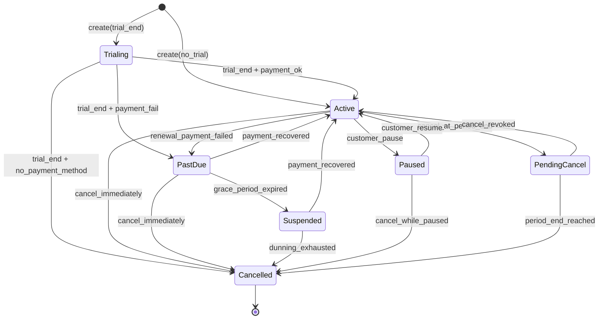
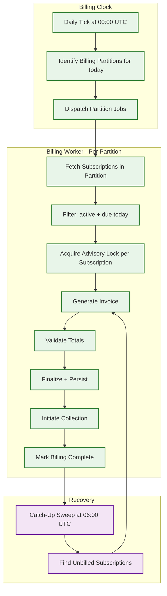
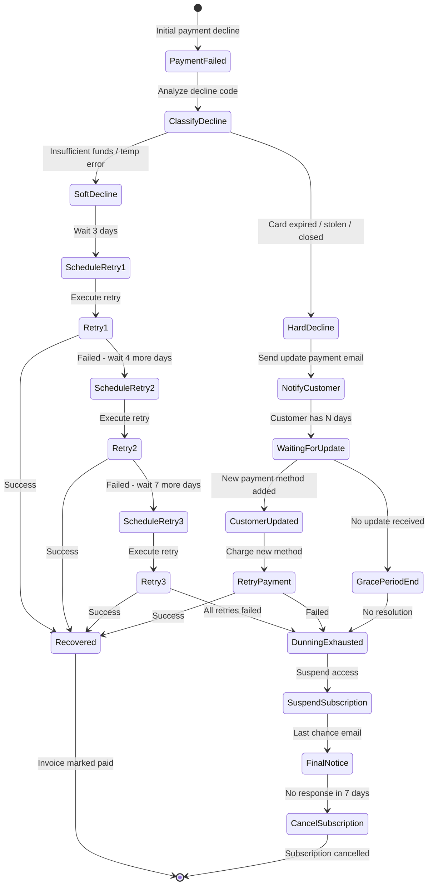

# Deep Dive & Bottlenecks

## Critical Component 1: Subscription Lifecycle State Machine

### Why This Is Critical

The subscription is the central entity in the billing system. Every billing decision---what to charge, when to charge, whether to generate an invoice, what dunning policy to apply---derives from the subscription's current state. A subscription that incorrectly transitions from Active to Cancelled loses revenue. A subscription stuck in PastDue when payment has been recovered creates customer frustration. The state machine must be bulletproof: every transition must be valid, atomic, and auditable.

### How It Works Internally



#### State Transition Validation

```
FUNCTION transition_subscription(subscription_id, event):
    BEGIN TRANSACTION
        sub = SELECT * FROM subscriptions WHERE id = subscription_id FOR UPDATE

        // Validate transition
        valid_transitions = TRANSITION_TABLE[sub.status]
        IF event NOT IN valid_transitions:
            ROLLBACK
            RETURN INVALID_TRANSITION(sub.status, event)

        new_status = valid_transitions[event]

        // Execute side effects
        SWITCH event:
            CASE "renewal_payment_failed":
                sub.past_due_since = NOW()
                sub.grace_period_end = NOW() + tenant.grace_period_days
                EVENTS.publish("subscription.past_due", sub)

            CASE "payment_recovered":
                sub.past_due_since = NULL
                sub.grace_period_end = NULL
                // Advance billing period if payment was for renewal
                IF payment.invoice.period_end > sub.current_period_end:
                    sub.current_period_start = payment.invoice.period_start
                    sub.current_period_end = payment.invoice.period_end
                EVENTS.publish("subscription.reactivated", sub)

            CASE "grace_period_expired":
                // Downgrade to suspended: restrict feature access but retain data
                sub.suspended_at = NOW()
                EVENTS.publish("subscription.suspended", sub)

            CASE "dunning_exhausted":
                sub.cancelled_at = NOW()
                sub.cancel_reason = "dunning_exhausted"
                EVENTS.publish("subscription.cancelled", sub)

        sub.status = new_status
        sub.updated_at = NOW()

        INSERT INTO subscription_audit_log (subscription_id, from_status, to_status, event, timestamp)

        COMMIT
    END TRANSACTION

TRANSITION_TABLE = {
    "trialing":       { "trial_end_payment_ok": "active", "trial_end_payment_fail": "past_due", ... },
    "active":         { "renewal_payment_failed": "past_due", "customer_pause": "paused", ... },
    "past_due":       { "payment_recovered": "active", "grace_period_expired": "suspended", ... },
    "suspended":      { "payment_recovered": "active", "dunning_exhausted": "cancelled" },
    "paused":         { "customer_resume": "active", "cancel_while_paused": "cancelled" },
    "pending_cancel": { "period_end_reached": "cancelled", "cancel_revoked": "active" },
}
```

### Failure Modes

| Failure | Impact | Mitigation |
|---------|--------|------------|
| **Race between payment recovery and cancellation** | Payment succeeds but subscription already cancelled by dunning | Optimistic lock: transition checks current status; if already cancelled, issue refund for the recovered payment |
| **Grace period timer drift** | Grace period expires early/late due to clock skew | Record absolute deadline (timestamp, not duration); sweep job runs every minute with 1-minute tolerance |
| **Trial conversion failure** | Trial ends but payment attempt takes 30+ seconds; status ambiguous | Two-phase: trial → pending_conversion → active/past_due; timeout on pending_conversion triggers retry |
| **Concurrent plan change and renewal** | Upgrade submitted at exact renewal time; two invoices generated | Mutex on (subscription_id): invoice generation and plan change acquire same lock; serialized execution |

---

## Critical Component 2: Proration Engine

### Why This Is Critical

Proration is the financial correctness guarantee for mid-cycle changes. When a customer upgrades from $50/month to $100/month on day 15 of a 30-day cycle, they should receive a $25 credit for the unused portion of the old plan and a $50 charge for the remaining portion of the new plan. Getting this wrong by even one cent across millions of invoices creates systemic financial discrepancies that are extremely difficult to detect and reconcile.

### How It Works Internally

#### Proration Strategies

| Strategy | Behavior | Use Case |
|----------|----------|----------|
| **create_prorations** | Generate proration line items on next invoice | Default for most plan changes; customer sees adjustment on next bill |
| **always_invoice** | Generate and invoice prorations immediately | Upgrade scenario where merchant wants immediate charge |
| **none** | No proration; new price takes effect at next renewal | Simple billing; common for annual plans |

#### Multi-Change Proration Within a Single Period

The most complex scenario: a customer changes plans multiple times within a single billing period.

```
FUNCTION calculate_multi_change_proration(subscription, changes, billing_period):
    // changes = [
    //   { date: day-5,  old_plan: A($50),  new_plan: B($100) },
    //   { date: day-15, old_plan: B($100), new_plan: C($75)  },
    //   { date: day-22, old_plan: C($75),  new_plan: C($75), old_qty: 5, new_qty: 8 }
    // ]

    total_days = days_in_period(billing_period)
    proration_lines = []

    // Process each change in chronological order
    FOR i, change IN ENUMERATE(changes):
        IF i == 0:
            segment_start = billing_period.start
        ELSE:
            segment_start = changes[i-1].date

        IF i == LEN(changes) - 1:
            segment_end = billing_period.end
        ELSE:
            segment_end = changes[i+1].date

        // Credit for old plan/qty in this segment
        days_old = days_between(change.date, segment_end)
        IF change.old_plan != change.new_plan:
            old_daily = change.old_plan.price / total_days
            credit = ROUND_DOWN(old_daily * days_old)
            proration_lines.append(credit_line(-credit, change.old_plan, change.date, segment_end))

        // Charge for new plan/qty in this segment
        IF change.old_plan != change.new_plan:
            new_daily = change.new_plan.price / total_days
            charge = ROUND_UP(new_daily * days_old)
            proration_lines.append(charge_line(charge, change.new_plan, change.date, segment_end))

        ELSE IF change.old_qty != change.new_qty:
            // Quantity change only
            per_unit_daily = change.new_plan.unit_price / total_days
            delta = change.new_qty - change.old_qty
            days_remaining = days_between(change.date, billing_period.end)
            amount = ROUND(per_unit_daily * delta * days_remaining)
            proration_lines.append(qty_change_line(amount, delta, change.date, billing_period.end))

    RETURN proration_lines
```

#### Rounding Strategy

Rounding errors across millions of proration calculations can accumulate into significant discrepancies. The system uses a consistent rounding strategy:

- **Credits to customer**: Always `ROUND_DOWN` (never overcharge via credit)
- **Charges to customer**: Always `ROUND_UP` (never undercharge; favor the merchant)
- **Rounding residual**: When credit + charge do not exactly equal the full-period price difference, the residual (always ≤ 1 smallest currency unit) is absorbed by the system as a rounding adjustment line item visible on the invoice

---

## Critical Component 3: Invoice Generation Pipeline

### Why This Is Critical

The billing run is the single most business-critical batch operation. It must generate millions of invoices within a tight time window (typically the first 1--3 days of the billing cycle), and every invoice must be financially correct. A billing run that crashes mid-way through must be resumable without generating duplicate invoices. A billing run that produces incorrect amounts creates a cascade of problems: incorrect payments, incorrect revenue recognition, and customer trust erosion.

### How It Works Internally



#### Partition Strategy

```
FUNCTION partition_billing_run(billing_date):
    // Subscriptions are bucketed by billing_day
    day_of_month = billing_date.day

    // For months shorter than billing_day (e.g., billing_day=31, month=February)
    // Those subscriptions are billed on the last day of the month
    IF day_of_month == last_day_of_month(billing_date):
        eligible_days = [day_of_month .. 31]
    ELSE:
        eligible_days = [day_of_month]

    // Further partition by tenant_id hash for parallelism
    subscriptions = SELECT * FROM subscriptions
                    WHERE billing_day IN eligible_days
                      AND status IN ('active', 'past_due', 'trialing')
                      AND current_period_end <= billing_date

    partitions = HASH_PARTITION(subscriptions, key: tenant_id, num_partitions: 64)
    RETURN partitions
```

#### Idempotent Invoice Generation

```
FUNCTION billing_worker(partition):
    FOR subscription IN partition.subscriptions:
        // Idempotency: check if invoice already exists for this period
        existing = DB.find_invoice(
            subscription_id: subscription.id,
            period_start: subscription.current_period_end,
            period_end: calculate_next_period_end(subscription)
        )

        IF existing IS NOT NULL:
            LOG.info("Invoice already exists, skipping", subscription.id)
            CONTINUE

        // Advisory lock prevents concurrent workers from billing same subscription
        IF NOT acquire_advisory_lock(subscription.id):
            LOG.warn("Lock held by another worker, skipping", subscription.id)
            CONTINUE

        TRY:
            invoice = generate_invoice(subscription, next_billing_period(subscription))
            advance_subscription_period(subscription)
        FINALLY:
            release_advisory_lock(subscription.id)
```

### Failure Modes

| Failure | Impact | Mitigation |
|---------|--------|------------|
| **Worker crash mid-billing-run** | Partition partially processed; some subscriptions unbilled | Advisory locks auto-release on crash; catch-up sweep at 06:00 UTC processes missed subscriptions |
| **Tax service unavailable** | Cannot compute tax; invoice generation blocked | Circuit breaker with fallback: generate invoice with `tax_pending` flag; recalculate when tax service recovers; do not finalize until tax is computed |
| **Usage aggregation incomplete** | Usage data not fully converged; invoice has incorrect usage charges | Usage freeze window: metering service publishes `usage.period_closed` event; invoice generation waits for this event before billing usage-based subscriptions |
| **Database write bottleneck** | High write throughput during billing run saturates DB | Batch inserts: accumulate 100 invoices in memory, write in single batch transaction; use write-ahead pattern with async persistence |

---

## Critical Component 4: Dunning & Payment Recovery Engine

### Why This Is Critical

Payment failures affect 5--8% of recurring charges, representing significant revenue at risk. The dunning engine's effectiveness directly impacts the company's revenue retention. A 10% improvement in dunning recovery rate for a platform processing $1B in annual billing translates to $5--8M in recovered revenue. The engine must balance aggressive recovery (more retries, more touchpoints) against customer experience (nobody wants 10 failed-payment emails in a week).

### How It Works Internally

#### Dunning State Machine



#### Intelligent Retry Timing

```
FUNCTION determine_optimal_retry_time(decline_code, customer, attempt_number):
    // Historical analysis shows payment success correlates with:
    // 1. Time since last payroll (1st, 15th of month for US)
    // 2. Day of week (Tuesday-Thursday have highest success)
    // 3. Time of day (10:00-14:00 local time)
    // 4. Hours since decline (first few hours have same-reason failures)

    min_delay_hours = [72, 96, 168]  // 3, 4, 7 days
    delay = min_delay_hours[attempt_number - 1]

    earliest_retry = NOW() + delay

    // Snap to next optimal window
    customer_tz = customer.timezone OR "UTC"
    candidate = earliest_retry

    WHILE NOT is_optimal_window(candidate, customer_tz):
        candidate += 1 hour

    RETURN candidate

FUNCTION is_optimal_window(timestamp, timezone):
    local = convert_to_timezone(timestamp, timezone)
    // Prefer Tuesday-Thursday, 10:00-14:00 local
    day = local.day_of_week
    hour = local.hour
    RETURN day IN [TUESDAY, WEDNESDAY, THURSDAY] AND hour >= 10 AND hour <= 14
```

#### Gateway Cascade on Retry

```
FUNCTION execute_payment_with_cascade(invoice, payment_method, dunning_context):
    gateways = get_gateway_cascade(payment_method, dunning_context.tenant)

    FOR gateway IN gateways:
        attempt = PaymentAttempt.create(
            invoice_id: invoice.id,
            payment_method_id: payment_method.id,
            gateway_id: gateway.id,
            amount: invoice.amount_due,
            idempotency_key: generate_idempotency_key(invoice.id, gateway.id, dunning_context.attempt),
            is_dunning: true,
            attempt_number: dunning_context.attempt
        )

        result = gateway.charge(payment_method, invoice.amount_due, attempt.idempotency_key)

        attempt.status = result.status
        attempt.gateway_txn_id = result.transaction_id
        attempt.decline_code = result.decline_code
        DB.save(attempt)

        IF result.status == SUCCESS:
            RETURN PaymentResult.SUCCESS
        ELSE IF result.decline_code IN HARD_DECLINE_CODES:
            RETURN PaymentResult.HARD_DECLINE  // Do not cascade
        // Soft decline: try next gateway in cascade

    RETURN PaymentResult.ALL_GATEWAYS_FAILED
```

---

## Concurrency & Race Conditions

### Race Condition 1: Concurrent Invoice Generation and Plan Change

**Scenario**: Customer submits plan upgrade at 00:01 UTC. Billing run starts processing the same subscription at 00:00 UTC. The billing worker fetches the old plan, but by the time it generates the invoice, the plan has changed.

```
FUNCTION generate_invoice_with_snapshot(subscription_id, billing_period):
    BEGIN TRANSACTION
        // Lock subscription to prevent concurrent modifications
        sub = SELECT * FROM subscriptions WHERE id = subscription_id FOR UPDATE

        // Snapshot the subscription state at billing time
        snapshot = create_billing_snapshot(sub)

        invoice = generate_invoice_from_snapshot(snapshot, billing_period)

        // Advance subscription period
        sub.current_period_start = billing_period.start
        sub.current_period_end = billing_period.end

        COMMIT
    END TRANSACTION

    // Any plan changes received during lock wait will be queued
    // and processed as proration on the NEXT billing period
```

### Race Condition 2: Payment Recovery During Dunning Retry

**Scenario**: Customer manually pays invoice via portal while dunning engine simultaneously retries the automatic charge. Both succeed, creating a double payment.

```
FUNCTION charge_with_double_payment_guard(invoice_id, amount, source):
    BEGIN TRANSACTION
        invoice = SELECT * FROM invoices WHERE id = invoice_id FOR UPDATE

        IF invoice.amount_due <= 0:
            ROLLBACK
            RETURN ALREADY_PAID

        IF amount > invoice.amount_due:
            amount = invoice.amount_due  // Cap at amount due

        // Proceed with charge...
        result = execute_charge(...)

        IF result.success:
            invoice.amount_paid += amount
            invoice.amount_due -= amount
            IF invoice.amount_due == 0:
                invoice.status = PAID
                invoice.paid_at = NOW()

        COMMIT
    END TRANSACTION
```

### Race Condition 3: Concurrent Credit Note Issuance

**Scenario**: Two support agents simultaneously issue credit notes for the same invoice, both checking the remaining creditable amount before issuing.

**Mitigation**: Row-level lock on invoice + creditable amount check within the transaction.

---

## Bottleneck Analysis

### Bottleneck 1: Billing Run Concentration on Day 1

**Problem**: 60--70% of subscriptions bill on the 1st of the month, creating a massive spike. A platform with 50M subscriptions may need to process 35M invoices on a single day.

**Mitigation**:
- **Billing date spreading**: Encourage merchants to distribute customer billing dates across the month (e.g., align with signup date rather than forcing the 1st)
- **Pre-computation**: Calculate base charges, applicable discounts, and tax rates in the 24 hours before the billing date; billing run then only assembles pre-computed components
- **Partition parallelism**: 64+ billing partitions running concurrently across dedicated worker pools
- **Staggered start times**: Not all tenants start their billing run at 00:00; distribute across 00:00--04:00 based on tenant timezone

### Bottleneck 2: Usage Aggregation Convergence Delay

**Problem**: Usage events arrive continuously, but billing needs a finalized aggregate. If billing runs while events are still in-flight, the invoice may undercount usage.

**Mitigation**:
- **Usage freeze window**: Metering service stops accepting events for the closed period 1 hour after period end; late events are credited to the next period
- **Two-phase aggregate**: Preliminary aggregate available within minutes; final (reconciled) aggregate available after the freeze window; billing uses the final aggregate
- **Late event correction**: Events arriving after the freeze are accumulated and issued as a "usage correction" line item on the next invoice

### Bottleneck 3: Payment Gateway Latency and Reliability

**Problem**: External payment gateways have variable latency (100ms--30s) and periodic outages. During a billing run with millions of payments, even 1% gateway failures create significant collection delays.

**Mitigation**:
- **Decouple invoice generation from payment collection**: Generate all invoices first, then process payments asynchronously via queue
- **Gateway health monitoring**: Track per-gateway success rates in real-time; route away from degraded gateways
- **Rate limiting per gateway**: Respect gateway-imposed rate limits; queue excess payments and process within rate allowances
- **Batch charge API**: Use gateway batch APIs where available (some gateways accept bulk charge requests) to reduce per-transaction overhead

### Bottleneck 4: PDF Generation at Scale

**Problem**: Generating 500K+ PDF invoices per hour requires significant compute. Each PDF involves template rendering, line-item layout, tax breakdown formatting, and multi-language support.

**Mitigation**:
- **Lazy PDF generation**: Generate PDF only when first requested (customer download or email delivery), not during billing run
- **Template pre-compilation**: Compile merchant invoice templates once; reuse compiled template across all invoices for that merchant
- **Dedicated PDF worker pool**: Separate compute cluster for PDF rendering; scales independently from billing workers
- **PDF caching**: Once generated, PDF is cached in object storage; subsequent downloads serve the cached copy
