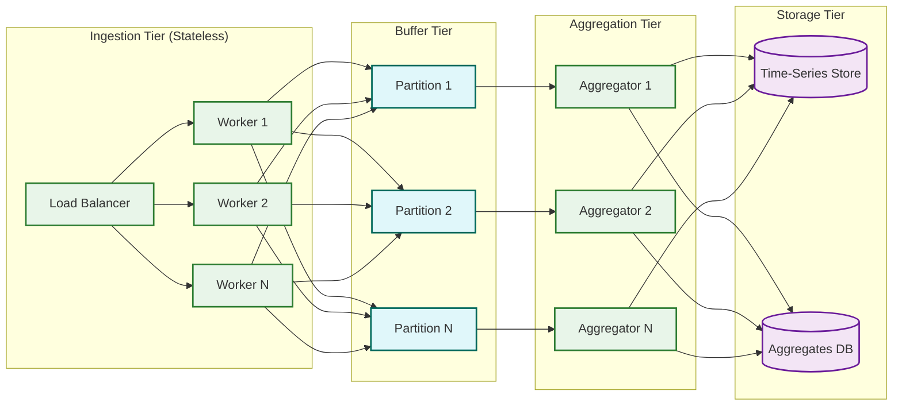
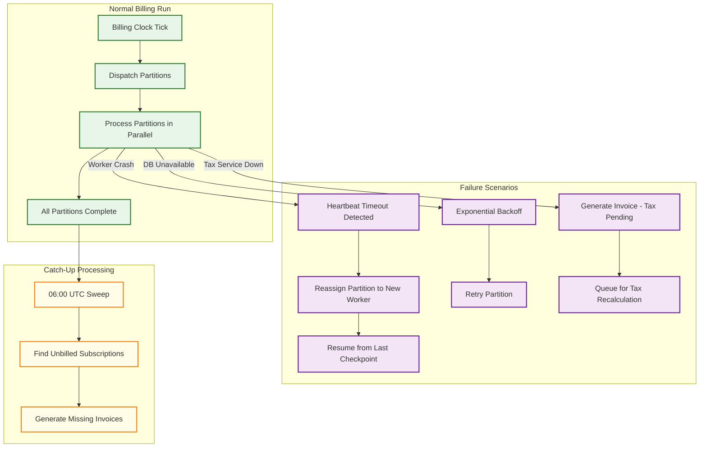

# Scalability & Reliability

## Scaling Strategy Overview

The billing system faces a unique scaling challenge: it must handle both steady-state real-time traffic (API requests, usage event ingestion) and periodic batch spikes (billing runs concentrated on the 1st of the month). The scaling strategy addresses each traffic pattern independently.

---

## Horizontal Scaling by Domain

### Subscription Service Scaling

| Concern | Strategy |
|---------|----------|
| **Read scaling** | Read replicas for customer portal and dashboard queries; cache frequently accessed subscription states in distributed cache |
| **Write scaling** | Shard by `tenant_id` at the application routing layer; each shard serves a subset of tenants with its own database partition |
| **Hot tenant isolation** | Tenants with > 1M subscriptions get dedicated database shards; prevents large-tenant operations from impacting smaller tenants |

### Usage Metering Scaling



- **Ingestion tier**: Stateless HTTP workers; scale horizontally based on events/second. Target 100K events/sec with 20 workers.
- **Buffer tier**: Partitioned message queue; events are partitioned by `(customer_id, meter_id)` to ensure ordering per customer. Add partitions to increase throughput.
- **Aggregation tier**: One aggregator per partition; maintains in-memory running totals; flushes to storage every 5 minutes. Aggregator count equals partition count.
- **Storage tier**: Time-series store for raw events (30-day retention); relational DB for billing-ready aggregates (retained indefinitely).

### Invoice Generation Scaling (Billing Run)

The billing run is the peak-load event. Scaling strategy:

```
Billing Run Capacity Planning:

Target: 35M invoices on day-1 (70% of 50M subscriptions)
Window: 16 hours (00:00 - 16:00 UTC)
Required throughput: 35M / 16h = 2.19M invoices/hour

Per-worker throughput: ~5,000 invoices/hour (includes DB reads, calculations, tax API, DB writes)
Workers needed: 2.19M / 5,000 = ~440 workers

Partition count: 64 base partitions × 7 sub-partitions = 448 parallel streams
Worker pool: 450 workers (with ~2% overhead for retries and catch-up)

Resource per worker:
  - 2 vCPU, 4 GB RAM
  - Persistent connection to read replica (subscription data)
  - Persistent connection to primary DB (invoice writes)
  - Connection to tax API (rate-limited at 1000 req/sec per worker)

Total billing-run compute: 900 vCPU, 1.8 TB RAM
Scaling: Auto-scale workers from 50 (idle) to 450 (billing peak) based on queue depth
```

### Payment Processing Scaling

| Component | Scaling Strategy | Throughput Target |
|-----------|-----------------|-------------------|
| **Payment orchestrator** | Stateless workers behind queue; scale by queue depth | 5,000 TPS |
| **Gateway connections** | Connection pool per gateway; max concurrent requests per gateway SLA | Per gateway: 200--1000 concurrent |
| **Reconciliation** | Batch processing; settlement files from gateways processed async | Not latency-sensitive |
| **Dunning scheduler** | Single-leader per partition with follower failover; dunning is per-subscription, not per-tenant | ~100 retry decisions/sec |

---

## Billing Run Partitioning Deep Dive

### Partition Assignment

```
FUNCTION assign_billing_partitions(billing_date):
    // Level 1: Partition by billing_day
    billing_day = billing_date.day
    IF billing_day == last_day_of_month(billing_date):
        day_range = [billing_day .. 31]
    ELSE:
        day_range = [billing_day]

    // Level 2: Sub-partition by tenant_id hash
    base_partitions = 64
    FOR day IN day_range:
        subscriptions = get_subscriptions_due(day)
        FOR sub IN subscriptions:
            partition_id = (day * 100) + (HASH(sub.tenant_id) % base_partitions)
            assign_to_partition(sub, partition_id)

    RETURN partitions

FUNCTION process_partition(partition_id):
    subscriptions = get_partition_subscriptions(partition_id)

    // Process in micro-batches of 100
    FOR batch IN chunk(subscriptions, 100):
        invoices = []
        FOR sub IN batch:
            IF NOT already_billed(sub):
                invoice = generate_invoice(sub)
                invoices.append(invoice)

        // Batch persist
        DB.batch_insert(invoices)

        // Batch enqueue for payment collection
        PAYMENT_QUEUE.batch_enqueue(invoices)
```

### Partition Rebalancing

When a billing partition is significantly larger than others (tenant with millions of subscriptions on the same billing day), the system splits it dynamically:

```
FUNCTION rebalance_partitions(partition_metrics):
    avg_size = MEAN(p.subscription_count FOR p IN partition_metrics)

    FOR partition IN partition_metrics:
        IF partition.subscription_count > avg_size * 3:
            // Split into sub-partitions using secondary hash
            split_partition(partition, factor: CEIL(partition.subscription_count / avg_size))
        ELSE IF partition.subscription_count < avg_size * 0.1:
            // Merge with adjacent partition
            merge_partition(partition, neighbor: find_smallest_neighbor(partition))
```

---

## Exactly-Once Invoice Generation

Generating duplicate invoices is one of the most severe billing errors. The system enforces exactly-once semantics through multiple layers:

### Layer 1: Database Unique Constraint

```sql
CREATE UNIQUE INDEX idx_unique_invoice_period
ON invoices (subscription_id, period_start, period_end)
WHERE status != 'voided';
```

Any attempt to insert a second invoice for the same subscription and period fails at the database level.

### Layer 2: Advisory Lock

Before generating an invoice, the billing worker acquires a database advisory lock keyed on the subscription ID. This prevents two workers from concurrently generating invoices for the same subscription (which could happen during partition rebalancing or catch-up processing).

### Layer 3: Idempotent Billing Worker

The billing worker checks for an existing invoice before generating. Combined with the advisory lock and unique constraint, this creates a three-layer defense:

1. **Check**: Look for existing invoice (fast path---avoids unnecessary work)
2. **Lock**: Acquire advisory lock (prevents concurrent generation)
3. **Constraint**: Unique index (database-level guarantee as final safety net)

---

## Fault Tolerance and Recovery

### Billing Run Recovery



### Worker Checkpoint Strategy

Each billing worker maintains a checkpoint of the last successfully billed subscription within its partition. On crash and recovery, the new worker resumes from the checkpoint rather than reprocessing the entire partition.

```
FUNCTION process_partition_with_checkpoint(partition_id):
    checkpoint = LOAD_CHECKPOINT(partition_id)
    subscriptions = get_partition_subscriptions(partition_id, after: checkpoint.last_subscription_id)

    FOR sub IN subscriptions:
        invoice = generate_invoice(sub)
        SAVE_CHECKPOINT(partition_id, last_subscription_id: sub.id)
```

### Payment Gateway Failover

```
FUNCTION charge_with_failover(payment_method, amount, invoice):
    primary_gateway = route_to_gateway(payment_method)
    fallback_gateways = get_fallback_gateways(payment_method)

    all_gateways = [primary_gateway] + fallback_gateways

    FOR gateway IN all_gateways:
        IF NOT gateway.is_healthy():
            CONTINUE  // Skip gateways with open circuit breaker

        TRY:
            result = gateway.charge(payment_method, amount)
            IF result.success:
                RETURN result
            ELSE IF result.decline_code IN HARD_DECLINE_CODES:
                RETURN result  // Hard decline: do not cascade
            // Soft decline or gateway error: try next gateway
        CATCH TimeoutException:
            gateway.circuit_breaker.record_failure()
            CONTINUE
        CATCH GatewayException:
            gateway.circuit_breaker.record_failure()
            CONTINUE

    RETURN PaymentResult.ALL_GATEWAYS_UNAVAILABLE
```

### Circuit Breaker Configuration

| Gateway Health Metric | Threshold | Action |
|----------------------|-----------|--------|
| Error rate (5-min window) | > 10% | Open circuit breaker; stop routing |
| Latency p99 (5-min window) | > 10 seconds | Mark degraded; reduce traffic allocation |
| Consecutive failures | > 5 | Open circuit breaker |
| Recovery probe interval | 30 seconds | Send test charge to probe recovery |
| Recovery success threshold | 3 consecutive successes | Close circuit breaker; resume routing |

---

## Disaster Recovery

### RPO and RTO Targets

| Component | RPO | RTO | Strategy |
|-----------|-----|-----|----------|
| **Subscription database** | < 1 minute | < 15 minutes | Synchronous replication to standby; automatic failover |
| **Invoice records** | 0 (zero data loss) | < 15 minutes | Synchronous replication; point-in-time recovery |
| **Usage events (raw)** | < 5 minutes | < 30 minutes | Replicated message queue with multi-AZ; consumer checkpoints |
| **Usage aggregates** | < 1 minute | < 15 minutes | Synchronous replication with primary DB |
| **Invoice PDFs** | < 1 hour | < 1 hour | Object storage with cross-region replication |
| **Revenue recognition ledger** | 0 (zero data loss) | < 15 minutes | Same as invoice records (co-located) |

### Multi-Region Billing Resilience

```
Active Region (Primary):
  - All write operations
  - Billing run execution
  - Payment processing
  - Real-time metering ingestion

Standby Region (DR):
  - Synchronous database replication (for financial data)
  - Async replication for non-critical data (PDFs, analytics)
  - Pre-warmed billing workers (scaled to 10% of primary)
  - Read-only API serving from replica

Failover Procedure:
  1. Detection: Automated health checks fail for > 2 minutes
  2. Decision: Automated failover if < 5 minutes; manual approval if > 5 minutes
  3. Execution:
     a. Promote standby database to primary
     b. Scale billing workers to 100%
     c. Update DNS / load balancer routing
     d. Resume billing run from checkpoint
  4. Validation: Verify no duplicate invoices; reconcile payment states
  5. Target total failover time: < 15 minutes
```

### Data Reconciliation After Failover

```
FUNCTION post_failover_reconciliation():
    // 1. Invoice integrity check
    orphaned_invoices = find_invoices_without_payments_or_dunning_entries()
    FOR invoice IN orphaned_invoices:
        IF invoice.status == FINALIZED:
            re_enqueue_for_payment(invoice)

    // 2. Payment state reconciliation
    in_flight_payments = find_payments_in_pending_state()
    FOR payment IN in_flight_payments:
        gateway_status = query_gateway_for_status(payment.gateway_txn_id)
        reconcile_payment_status(payment, gateway_status)

    // 3. Dunning state recovery
    active_dunning = find_dunning_entries_with_missed_retries()
    FOR dunning IN active_dunning:
        reschedule_retry(dunning)

    // 4. Billing run completeness check
    unbilled = find_subscriptions_due_but_unbilled()
    IF unbilled.count > 0:
        trigger_catch_up_billing_run(unbilled)
```

---

## Capacity Planning Guidelines

### Scaling Triggers

| Metric | Scale Up Trigger | Scale Down Trigger | Component |
|--------|-----------------|-------------------|-----------|
| Billing queue depth | > 10,000 pending | < 100 pending for 30 min | Billing workers |
| Usage ingestion lag | > 60 seconds | < 5 seconds for 15 min | Metering workers |
| Payment queue depth | > 5,000 pending | < 200 pending for 30 min | Payment workers |
| API latency p99 | > 400ms | < 100ms for 15 min | API server instances |
| Database CPU | > 70% | < 30% for 30 min | Read replicas |
| Cache hit rate | < 90% | N/A | Cache cluster nodes |

### Capacity Headroom Requirements

| Period | Expected Load Multiplier | Headroom Maintained |
|--------|------------------------|---------------------|
| Normal day | 1x baseline | 2x (100% overhead) |
| Billing day (1st of month) | 5--7x baseline | 1.5x over peak (50% overhead) |
| Year-end close | 3x billing-day peak | 1.3x over peak (30% overhead) |
| Black Friday / high-commerce | 2x normal billing day | 2x over peak |
