# Security & Compliance

## Threat Model

### Attack Surface

```mermaid
flowchart TB
    subgraph External["External Threats"]
        ATK1[Payment Fraud - Stolen Cards]
        ATK2[Invoice Manipulation]
        ATK3[API Key Compromise]
        ATK4[Usage Event Injection]
        ATK5[Customer Account Takeover]
    end

    subgraph Internal["Internal Threats"]
        ATK6[Privileged Insider - Invoice Tampering]
        ATK7[Database Admin - Direct Data Access]
        ATK8[Support Agent - Unauthorized Credit Notes]
    end

    subgraph System["System Vulnerabilities"]
        ATK9[IDOR - Access Other Tenant Data]
        ATK10[Race Conditions - Double Charge]
        ATK11[Supply Chain - Compromised Gateway SDK]
    end

    subgraph Targets["Critical Assets"]
        T1[Payment Card Data]
        T2[Invoice Financial Data]
        T3[Customer PII]
        T4[Revenue Records]
        T5[API Credentials / Gateway Keys]
    end

    ATK1 --> T1
    ATK2 --> T2
    ATK3 --> T5
    ATK4 --> T4
    ATK5 --> T3
    ATK6 --> T2
    ATK7 --> T1
    ATK8 --> T4
    ATK9 --> T3
    ATK10 --> T2
    ATK11 --> T1

    classDef external fill:#ffcdd2,stroke:#b71c1c,stroke-width:2px
    classDef internal fill:#fff3e0,stroke:#e65100,stroke-width:2px
    classDef system fill:#e1f5fe,stroke:#01579b,stroke-width:2px
    classDef target fill:#f3e5f5,stroke:#6a1b9a,stroke-width:2px

    class ATK1,ATK2,ATK3,ATK4,ATK5 external
    class ATK6,ATK7,ATK8 internal
    class ATK9,ATK10,ATK11 system
    class T1,T2,T3,T4,T5 target
```



---

## PCI DSS Compliance

### Cardholder Data Environment (CDE) Isolation

The billing system handles payment methods but minimizes its PCI DSS scope through tokenization.

| Data Element | Storage Approach | PCI Scope |
|-------------|-----------------|-----------|
| Full card number (PAN) | **Never stored**---tokenized client-side via gateway JS SDK | Out of scope |
| Card token | Stored in `payment_methods` table; opaque reference to gateway | Reduced scope (SAQ A-EP) |
| Last 4 digits | Stored for display purposes only | Minimal PCI impact |
| CVV / CVC | **Never received server-side** | Out of scope |
| Cardholder name | Stored encrypted; used for invoice display | In scope for PII |
| Expiration date | Stored encrypted; used for proactive dunning | In scope |

### Tokenization Flow

```
FUNCTION add_payment_method(customer_id, client_token):
    // client_token was generated by gateway's client-side JS SDK
    // Server never receives raw card data

    // Exchange client token for server token via gateway API
    gateway_response = PAYMENT_GATEWAY.create_payment_method(client_token)

    payment_method = PaymentMethod.create(
        customer_id: customer_id,
        gateway_id: gateway_response.gateway_id,
        gateway_token: gateway_response.token,  // opaque reference
        type: gateway_response.type,             // "card", "bank_account"
        last_four: gateway_response.last_four,
        exp_month: ENCRYPT(gateway_response.exp_month),
        exp_year: ENCRYPT(gateway_response.exp_year),
        card_brand: gateway_response.brand
    )

    RETURN payment_method
```

### PCI DSS v4.0 Key Requirements

| Requirement | Implementation |
|-------------|---------------|
| **Req 1**: Network security controls | CDE network segment isolated; firewall rules restrict traffic to/from gateways only |
| **Req 3**: Protect stored account data | No PAN storage; tokens are not reversible to original card numbers |
| **Req 4**: Protect data in transit | TLS 1.3 for all gateway communication; HSTS on all endpoints |
| **Req 6**: Secure systems and software | Dependency scanning (SCA), SAST, DAST in CI/CD pipeline |
| **Req 7**: Restrict access | RBAC with least-privilege; payment method access limited to payment orchestrator service |
| **Req 8**: Identify users and authenticate | MFA for all dashboard access; API key rotation policy (90 days) |
| **Req 10**: Log and monitor all access | All payment operations logged to immutable audit log; 1-year retention |
| **Req 12**: Organizational policies | Annual PCI assessment; staff security training; incident response plan |

---

## SOC 2 Type II Controls

### Trust Service Criteria

| Category | Control | Implementation |
|----------|---------|---------------|
| **Security** | Access control for billing operations | RBAC with tenant isolation; break-glass procedure for production access |
| **Security** | Encryption at rest and in transit | AES-256 for data at rest; TLS 1.3 for data in transit |
| **Availability** | Billing run SLA | 99.95% availability target; automated failover; catch-up billing |
| **Processing Integrity** | Invoice accuracy | Automated reconciliation; checksums on financial totals; immutable invoice records |
| **Confidentiality** | Customer financial data protection | Tenant data isolation; encrypted backups; access logging |
| **Privacy** | PII handling | Data minimization; customer data deletion on request (with legal retention exceptions) |

---

## Data Encryption

### Encryption at Rest

| Data Category | Encryption Method | Key Management |
|-------------|-------------------|----------------|
| **Database (primary)** | Transparent Data Encryption (TDE) | Database-managed keys with HSM backing |
| **Sensitive columns** (gateway tokens, PII) | Application-level encryption (AES-256-GCM) | Envelope encryption: data key encrypted by master key in KMS |
| **Invoice PDFs** | Server-side encryption in object storage | Object-storage-managed keys |
| **Backups** | Encrypted with separate backup key | Backup key stored in separate KMS from primary |
| **Usage event archives** | Column-level encryption for customer identifiers | Rotating encryption keys with 90-day lifecycle |

### Encryption in Transit

| Channel | Protocol | Certificate Management |
|---------|----------|----------------------|
| Client → API Gateway | TLS 1.3 (minimum TLS 1.2) | Automated certificate rotation via ACME |
| Service-to-service | Mutual TLS (mTLS) | Service mesh certificate authority |
| API → Payment gateway | TLS 1.3 with certificate pinning | Gateway-issued certificates; pinned in code |
| Webhook delivery | HTTPS with HMAC signature | HMAC-SHA256 signing key per merchant endpoint |

### Key Rotation

```
Key Rotation Schedule:
  - Master encryption key: Annual rotation (KMS-managed)
  - Data encryption keys: 90-day rotation with re-encryption
  - API keys (merchant): 90-day expiry; grace period for migration
  - Webhook signing secrets: Rotatable by merchant; dual-key support during rotation
  - Database TDE key: Annual rotation (transparent to application)
  - mTLS certificates: 30-day rotation (automated via service mesh)
```

---

## Access Control

### Role-Based Access Control (RBAC)

| Role | Permissions | Data Access |
|------|------------|-------------|
| **Merchant Admin** | Full tenant management; API key creation; plan configuration | All tenant data |
| **Merchant Finance** | Invoice viewing; credit note issuance; revenue reports | Financial data for tenant |
| **Merchant Support** | Customer lookup; subscription management; refund initiation (with limits) | Customer data for tenant |
| **Merchant Developer** | API key management; webhook configuration; usage metering setup | Technical configuration |
| **Platform Operator** | System monitoring; tenant provisioning; billing run management | Cross-tenant operational data (no financial detail) |
| **Platform Finance** | Platform-level revenue reports; settlement reconciliation | Aggregated financial data |
| **Platform Security** | Audit log review; access management; incident response | Audit logs; no direct financial data |

### Tenant Isolation Enforcement

```
FUNCTION enforce_tenant_isolation(request, resource):
    // Every database query includes tenant_id filter
    tenant_id = request.authenticated_tenant_id

    // Row-Level Security (RLS) in database
    // Policy: current_tenant_id() = row.tenant_id
    // Applied to ALL tables containing tenant data

    // Application-level validation (defense in depth)
    IF resource.tenant_id != tenant_id:
        LOG.security_alert("Cross-tenant access attempt", {
            requesting_tenant: tenant_id,
            target_tenant: resource.tenant_id,
            resource_type: resource.type,
            resource_id: resource.id
        })
        RETURN 403 Forbidden

    RETURN resource
```

### Separation of Duties

| Action | Required Role | Additional Control |
|--------|---------------|-------------------|
| Create invoice (system) | System (billing engine) | Automated; no human trigger |
| Void invoice | Merchant Admin or Finance | Audit log entry; only pre-payment invoices |
| Issue credit note | Merchant Finance or Support | Amount limits per role; approval for > $1,000 |
| Issue refund | Merchant Finance | Two-person approval for > $5,000 |
| Modify pricing plan | Merchant Admin | Versioned; changes take effect at next renewal |
| Access payment method details | Payment Orchestrator (service) | No human access to full tokens |
| Export customer data | Merchant Admin | Rate-limited; logged; encrypted export file |

---

## Audit Trail

### Immutable Audit Log Design

Every financial operation produces an immutable audit log entry:

```
AuditLogEntry {
    id:             UUID (time-ordered)
    timestamp:      ISO 8601
    tenant_id:      UUID
    actor_type:     "system" | "user" | "api_key" | "webhook"
    actor_id:       UUID or identifier
    action:         "invoice.finalized" | "credit_note.issued" | "payment.attempted" | ...
    resource_type:  "invoice" | "subscription" | "payment" | ...
    resource_id:    UUID
    before_state:   JSONB (snapshot before change)
    after_state:    JSONB (snapshot after change)
    ip_address:     string
    user_agent:     string
    idempotency_key: string (if applicable)
}
```

### Audit Log Properties

| Property | Implementation |
|----------|---------------|
| **Immutability** | Append-only table; no UPDATE or DELETE permissions granted to any application role; backed by write-once object storage for long-term retention |
| **Completeness** | Every state change to financial entities (invoice, payment, credit note, subscription status) produces an audit entry; enforced at the ORM/repository layer |
| **Tamper evidence** | Each entry includes a hash chain: `hash = SHA256(previous_hash + entry_data)`. Integrity verifiable by replaying the chain |
| **Retention** | 7-year minimum; archived to cost-effective storage after 1 year; searchable via audit log API |
| **Access control** | Read access limited to Platform Security and Merchant Admin roles; no write access except the logging service |

---

## Fraud Prevention

### Payment Fraud Detection

| Check | Stage | Action |
|-------|-------|--------|
| **Velocity check** | Pre-charge | Block if > N payment attempts per customer in 1 hour |
| **Amount anomaly** | Pre-charge | Flag if charge amount > 3x average for this subscription tier |
| **Geographic mismatch** | Pre-charge | Flag if billing address country differs from card issuing country |
| **Duplicate charge detection** | Pre-charge | Block if identical (amount, customer, payment_method) within 5 minutes |
| **Card testing pattern** | Pre-charge | Block if multiple small charges (< $1) from same IP range |
| **Fraud score integration** | Pre-charge | Route high-risk charges through 3D Secure / SCA challenge |

### Invoice Fraud Prevention

| Threat | Control |
|--------|---------|
| **Invoice amount manipulation** | Invoice total is computed server-side from line items; no client-provided total accepted |
| **Phantom invoice creation** | Invoices can only be created by the billing engine (system actor) or through the API with idempotency enforcement |
| **Credit note abuse** | Credit note amount cannot exceed original invoice amount; daily credit note limits per support agent; anomaly detection on credit note patterns |
| **Discount/coupon abuse** | Coupon redemption limits enforced; coupon stacking rules configurable; one-time coupons marked as redeemed atomically |

---

## Compliance-Specific Requirements

### Tax Compliance

| Jurisdiction | Requirement | Implementation |
|-------------|-------------|---------------|
| **EU VAT** | VAT ID validation; reverse charge mechanism; MOSS reporting | VAT ID validated via VIES API; reverse charge logic in tax integration |
| **US Sales Tax** | Nexus determination; product taxability; state/county/city rates | Delegated to tax calculation service; nexus tracked per merchant |
| **India GST** | GSTIN validation; HSN codes; e-invoicing to IRP | GST compliance module; e-invoice generation per government API |
| **Brazil** | NF-e electronic invoice; complex cascading taxes (ICMS, IPI, PIS, COFINS) | Delegated to regional tax partner |

### Data Residency

| Region | Requirement | Implementation |
|--------|-------------|---------------|
| **EU (GDPR)** | EU customer data must be processable within EU | EU database cluster; configurable data routing by customer region |
| **India (DPDP Act)** | Data localization for certain categories | India-resident database shard for Indian customers |
| **Australia** | Privacy Act; APPs compliance | Data can be processed in approved jurisdictions with adequate protections |

### Right to Deletion (GDPR Article 17)

```
FUNCTION handle_deletion_request(customer_id):
    // Identify data categories and retention requirements
    customer = DB.get_customer(customer_id)

    // Category 1: Can be deleted immediately
    delete_personal_data(customer)  // Name, email, address in customer record
    delete_payment_methods(customer_id)  // Revoke tokens at gateway

    // Category 2: Anonymize but retain (legal retention requirement)
    anonymize_invoices(customer_id)  // Replace PII with anonymized identifiers
    anonymize_payment_records(customer_id)

    // Category 3: Retain as-is (regulatory requirement)
    // Tax invoices: retained for 7 years per tax authority requirements
    // Revenue recognition entries: retained per ASC 606 requirements

    // Record deletion compliance
    INSERT INTO deletion_log (customer_id, requested_at, completed_at, categories_processed)

    RETURN DeletionResult {
        deleted: ["personal_data", "payment_methods"],
        anonymized: ["invoices", "payment_records"],
        retained: ["tax_documents (7-year retention)", "rev_rec_entries (regulatory)"]
    }
```

---

## Security Monitoring

### Real-Time Security Alerts

| Alert | Trigger | Severity | Response |
|-------|---------|----------|----------|
| **Cross-tenant data access** | RLS violation or application-level tenant mismatch | Critical | Immediate investigation; block API key |
| **Mass credit note issuance** | > 50 credit notes by single agent in 1 hour | High | Auto-pause agent permissions; manager notification |
| **API key usage from new IP** | API key used from IP not in allowlist (if configured) | Medium | Notify merchant; temporary rate limit |
| **Payment fraud pattern** | Velocity / amount / geographic anomaly detected | High | Block charge; notify merchant |
| **Privilege escalation attempt** | User attempts action outside RBAC permissions | High | Log; alert security team; temporary account lock |
| **Encryption key access anomaly** | KMS key accessed outside normal patterns | Critical | Immediate key rotation; investigation |
