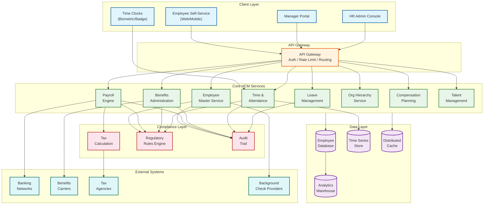

# Human Capital Management (HCM) System Design

## System Overview

A Human Capital Management (HCM) system---exemplified by platforms such as Workday HCM, SAP SuccessFactors, and Oracle HCM Cloud---is a comprehensive workforce management platform that orchestrates the entire employee lifecycle from hire to retire. Unlike point HR solutions that address a single function (standalone payroll processors, time-tracking tools, or applicant tracking systems), an HCM platform unifies Employee Core Data, Payroll Processing, Benefits Administration, Time and Attendance, Leave Management, Compensation Planning, Talent Management, and Workforce Analytics into a single, coherent data model. Every workforce event---a new hire onboarding, a promotion, a benefits election change, a clock-in at a remote facility---propagates through the shared employee record, updating downstream calculations without manual reconciliation. The core engineering challenges are deeply intertwined:

1. **Gross-to-Net Payroll Calculation Engine** --- Processing payroll for hundreds of thousands of employees requires a deterministic calculation pipeline that transforms gross compensation into net pay through a sequence of statutory deductions (federal, state, and local taxes), voluntary deductions (retirement contributions, insurance premiums), employer contributions, and garnishments. The engine must produce identical results when re-run with the same inputs (auditability) and handle mid-period changes (retroactive pay adjustments, off-cycle payments) without corrupting year-to-date accumulators.

2. **Multi-Jurisdiction Compliance Engine** --- A global HCM must simultaneously enforce labor laws, tax withholding rules, statutory benefits, and reporting requirements across dozens of countries and hundreds of sub-jurisdictions. Each jurisdiction has unique rules for overtime calculation, minimum wage thresholds, tax brackets, social security contributions, and mandatory leave accruals---all of which change frequently and must be applied retroactively when regulations are updated mid-year.

3. **Benefits Administration and Life Event Processing** --- Open enrollment windows create massive, time-bounded spikes where the entire workforce simultaneously reviews and selects benefit plans. Beyond enrollment periods, qualifying life events (marriage, birth, job change) trigger ad-hoc enrollment windows with strict regulatory deadlines. The system must enforce plan eligibility rules, calculate employer and employee contribution splits, and propagate elections to downstream payroll and carrier feeds.

4. **Time and Attendance at Scale** --- Capturing clock-in/clock-out events from diverse input channels (biometric terminals, mobile GPS, web browsers, badge readers) across multiple time zones, applying complex pay rules (overtime tiers, shift differentials, holiday premiums, union-specific rules), and resolving exceptions (missed punches, manager overrides) before the payroll cutoff deadline demands real-time ingestion with batch reconciliation.

5. **Organizational Hierarchy Modeling** --- Enterprises require multiple overlapping hierarchies: supervisory (reporting lines), cost center (financial allocation), legal entity (statutory compliance), matrix (project-based), and positional (headcount planning). Each hierarchy affects different system behaviors---approval routing follows supervisory lines, tax withholding follows legal entity, budget allocation follows cost center. Maintaining consistency across these overlapping trees during reorganizations is a core data integrity challenge.

6. **Employee Self-Service with Strict Access Control** --- Employees, managers, HR administrators, payroll specialists, and executives each see different slices of the same data. Compensation details visible to payroll must be invisible to peer employees. A manager can approve time sheets for direct reports but not for other teams. This fine-grained, role-and-relationship-based access model must be enforced consistently across every API, report, and UI surface.

7. **Batch Processing Within Regulatory Windows** --- Payroll runs, tax filing submissions, benefits carrier feeds, and year-end W-2/1099 generation are batch operations with hard deadlines. A payroll run for 100,000 employees must complete within a 4-hour window to meet direct deposit cutoff times at financial institutions. Failure to meet these windows has direct financial and legal consequences.

---

## Key Characteristics

| Characteristic | Description |
|---------------|-------------|
| **Read/Write Pattern** | Mixed---write-heavy during payroll runs, time capture, and enrollment windows; read-heavy for employee self-service, reporting, org charts, and analytics dashboards |
| **Latency Sensitivity** | Moderate---employee self-service queries require < 300ms; payroll calculation is throughput-optimized (batch); time clock punches require < 2s acknowledgment for worker experience |
| **Consistency Model** | Strong consistency for payroll calculations, leave balances, and benefits elections (financial accuracy); eventual consistency acceptable for analytics, org chart rendering, and search indexes |
| **Data Volume** | High---a 100K-employee organization generates ~2M time entries/month, 200K payroll calculation records/cycle, and millions of historical transaction records with 7+ year retention |
| **Architecture Model** | Domain-partitioned services with shared employee master; event-driven propagation between domains; CQRS for reporting; batch orchestration for payroll and compliance |
| **Regulatory Burden** | Very High---labor laws per jurisdiction, tax withholding rules, SOX compliance for payroll, GDPR/CCPA for employee PII, HIPAA for benefits health data, ERISA for retirement plans |
| **Complexity Rating** | **Very High** |

---

## Quick Navigation

| Document | Description |
|----------|-------------|
| [01 - Requirements & Estimations](./01-requirements-and-estimations.md) | Functional/non-functional requirements, capacity planning, SLOs |
| [02 - High-Level Design](./02-high-level-design.md) | Architecture diagrams, data flow, key decisions |
| [03 - Low-Level Design](./03-low-level-design.md) | Data models, API design, algorithms (pseudocode) |
| [04 - Deep Dive & Bottlenecks](./04-deep-dive-and-bottlenecks.md) | Payroll engine internals, benefits enrollment, time tracking edge cases |
| [05 - Scalability & Reliability](./05-scalability-and-reliability.md) | Multi-tenant payroll, batch parallelism, global jurisdiction scaling |
| [06 - Security & Compliance](./06-security-and-compliance.md) | PII protection, GDPR/CCPA, SOX for payroll, HIPAA, role-based access |
| [07 - Observability](./07-observability.md) | Payroll run metrics, time tracking accuracy, benefits enrollment, alerting |
| [08 - Interview Guide](./08-interview-guide.md) | 45-min pacing, trap questions, trade-offs, scoring rubric |
| [09 - Insights](./09-insights.md) | Key architectural insights unique to HCM systems |

---

## What Differentiates This from Related Systems

| Aspect | HCM (This) | Standalone Payroll | Time Tracking Tool | Benefits Platform | ATS (Recruiting) | ERP HR Module |
|--------|-----------|-------------------|-------------------|------------------|------------------|---------------|
| **Scope** | Full employee lifecycle: hire, pay, manage, develop, retire; unified across all HR domains | Gross-to-net calculation, tax filing, direct deposit; no upstream employee management | Clock-in/out capture, timesheet approval, overtime calculation; no payroll or benefits context | Plan administration, enrollment, carrier feeds; no payroll integration or time tracking | Candidate pipeline, interview scheduling, offer management; ends at hire | HR as one module among finance, supply chain, manufacturing; breadth over HR depth |
| **Data Model** | Employee-centric: single record links compensation, benefits, time, performance, org position, and compliance data | Pay-run-centric: focuses on earnings, deductions, and tax calculations per pay period | Timecard-centric: raw punches, approved hours, and exception flags per employee per day | Enrollment-centric: plan selections, coverage levels, dependent data, and carrier eligibility | Candidate-centric: applications, interview feedback, and offer terms | Entity-centric: employee is one entity among vendors, customers, and assets |
| **Compliance Surface** | All labor, tax, benefits, and data privacy regulations across every jurisdiction served | Tax withholding and filing compliance only; relies on upstream system for labor law enforcement | Overtime and meal-break compliance for time rules; limited to worked-hours regulations | ERISA, COBRA, ACA compliance for benefits; no payroll tax or labor law coverage | EEOC, OFCCP reporting for hiring compliance; narrow regulatory footprint | Broad but shallow compliance; financial audit focus with basic HR regulatory support |
| **Integration Complexity** | Hub for downstream feeds: payroll to banks, benefits to carriers, time to payroll, compliance to government agencies | Downstream only: receives employee data, sends payments and tax filings | Upstream only: sends approved hours to payroll; receives employee roster from HR | Bidirectional: receives eligibility from HR, sends elections to payroll and carrier EDI feeds | Upstream only: sends hired-candidate data to core HR for onboarding | Internal integration between ERP modules; less external carrier/agency integration |
| **Event Processing** | Life events trigger cascading updates: marriage changes tax withholding, benefits eligibility, and emergency contacts simultaneously | Processes pay-period events only; no awareness of life events outside compensation changes | Real-time punch capture with batch reconciliation; no life-event awareness | Life-event-driven enrollment windows with strict deadline enforcement | Hiring events only; no ongoing employee event processing | Event processing spans all ERP modules; HR events compete with financial and supply chain events |
| **Batch Workloads** | Multiple concurrent batch domains: payroll runs, benefits carrier feeds, tax filings, year-end reporting, ACA submissions | Single batch domain: pay calculation and tax filing per period | Minimal batch: timesheet approval reminders and period-end lockout | Periodic batch: open enrollment processing, carrier file generation, ACA reporting | Low batch: bulk candidate imports and EEOC aggregate reporting | Batch across all modules: month-end close, payroll, inventory revaluation compete for resources |

---

## Conceptual Architecture (Bird's Eye)

---

## Key Terminology

| Term | Definition |
|------|-----------|
| **Gross-to-Net** | The payroll calculation pipeline that transforms gross compensation (salary + earnings) into net pay by sequentially applying taxes, deductions, and contributions |
| **Pay Period** | The recurring time interval (weekly, biweekly, semi-monthly, monthly) for which compensation is calculated and disbursed |
| **Open Enrollment** | An annual window during which employees select or modify their benefits elections for the upcoming plan year |
| **Qualifying Life Event (QLE)** | A change in personal circumstances (marriage, birth, divorce, job loss) that triggers a special enrollment period outside open enrollment |
| **Retroactive Adjustment (Retro)** | A payroll recalculation applied to prior pay periods when compensation, tax status, or deduction changes are effective-dated in the past |
| **Accrual** | The systematic accumulation of leave or benefits entitlement over time based on tenure, hours worked, or policy rules |
| **Legal Entity** | A separately incorporated business unit within an organization, each subject to its own jurisdiction's tax and labor laws |
| **Cost Center** | An organizational unit used for financial allocation and budgeting; employees are assigned to cost centers for expense tracking |
| **Effective Dating** | A data management pattern where every record change includes the date it becomes effective, enabling point-in-time queries and retroactive processing |
| **Carrier Feed** | An automated data file (typically EDI 834) sent to insurance carriers containing employee enrollment, termination, and demographic changes |
