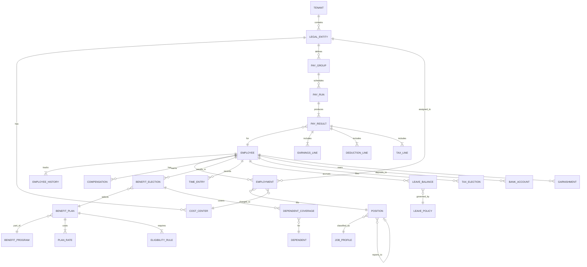

# Low-Level Design

## Data Model

### Entity Relationship Diagram



---

### Core Tables

#### Employee

```
TABLE employee:
    id                  UUID PRIMARY KEY
    tenant_id           UUID NOT NULL (partition key)
    employee_number     VARCHAR(20) UNIQUE per tenant
    person_id           UUID FOREIGN KEY -> person (name, DOB, SSN)
    status              ENUM(PRE_HIRE, ACTIVE, LEAVE_OF_ABSENCE,
                             SUSPENDED, TERMINATED, RETIRED, DECEASED)
    hire_date           DATE NOT NULL
    original_hire_date  DATE (for rehires)
    termination_date    DATE NULLABLE
    termination_reason  VARCHAR(50) NULLABLE
    primary_employment_id UUID FOREIGN KEY -> employment
    created_at          TIMESTAMP
    updated_at          TIMESTAMP

    INDEX: (tenant_id, status)
    INDEX: (tenant_id, employee_number)
    INDEX: (tenant_id, hire_date)
```

#### Employment (Effective-Dated)

```
TABLE employment:
    id                  UUID PRIMARY KEY
    tenant_id           UUID NOT NULL
    employee_id         UUID FOREIGN KEY -> employee
    effective_start     DATE NOT NULL
    effective_end       DATE DEFAULT '9999-12-31'
    position_id         UUID FOREIGN KEY -> position
    legal_entity_id     UUID FOREIGN KEY -> legal_entity
    cost_center_id      UUID FOREIGN KEY -> cost_center
    location_id         UUID FOREIGN KEY -> location
    pay_group_id        UUID FOREIGN KEY -> pay_group
    employment_type     ENUM(FULL_TIME, PART_TIME, CONTRACTOR,
                             TEMPORARY, INTERN)
    fte_percentage      DECIMAL(5,2) DEFAULT 100.00
    standard_hours      DECIMAL(5,2) DEFAULT 40.00
    worker_type         ENUM(EMPLOYEE, CONTINGENT)
    manager_id          UUID FOREIGN KEY -> employee NULLABLE
    created_at          TIMESTAMP

    UNIQUE: (employee_id, effective_start)
    INDEX: (tenant_id, legal_entity_id, effective_start, effective_end)
    INDEX: (tenant_id, manager_id, effective_start)
    INDEX: (tenant_id, cost_center_id)
```

#### Compensation (Effective-Dated)

```
TABLE compensation:
    id                  UUID PRIMARY KEY
    tenant_id           UUID NOT NULL
    employee_id         UUID FOREIGN KEY -> employee
    effective_start     DATE NOT NULL
    effective_end       DATE DEFAULT '9999-12-31'
    comp_type           ENUM(BASE_SALARY, HOURLY_RATE, ANNUAL_BONUS_TARGET,
                             EQUITY_GRANT, ALLOWANCE, COMMISSION_RATE)
    amount              DECIMAL(18,4) NOT NULL
    currency            VARCHAR(3) NOT NULL
    frequency           ENUM(ANNUAL, MONTHLY, HOURLY, ONE_TIME)
    reason              VARCHAR(100) (HIRE, MERIT, PROMOTION, ADJUSTMENT, MARKET)
    approved_by         UUID FOREIGN KEY -> employee
    approved_at         TIMESTAMP

    UNIQUE: (employee_id, comp_type, effective_start)
    INDEX: (tenant_id, employee_id, comp_type, effective_start DESC)
```

#### Pay Run and Pay Result

```
TABLE pay_run:
    id                  UUID PRIMARY KEY
    tenant_id           UUID NOT NULL
    pay_group_id        UUID FOREIGN KEY -> pay_group
    period_start        DATE NOT NULL
    period_end          DATE NOT NULL
    pay_date            DATE NOT NULL
    run_type            ENUM(REGULAR, OFF_CYCLE, SUPPLEMENTAL, FINAL)
    status              ENUM(DRAFT, CALCULATING, CALCULATED, REVIEWED,
                             APPROVED, COMMITTED, PAID, VOIDED)
    total_gross         DECIMAL(18,2)
    total_net           DECIMAL(18,2)
    total_employer_tax  DECIMAL(18,2)
    employee_count      INTEGER
    started_at          TIMESTAMP
    completed_at        TIMESTAMP
    committed_by        UUID FOREIGN KEY -> employee
    committed_at        TIMESTAMP

    UNIQUE: (tenant_id, pay_group_id, period_start, run_type)
    INDEX: (tenant_id, status, pay_date)

TABLE pay_result:
    id                  UUID PRIMARY KEY
    pay_run_id          UUID FOREIGN KEY -> pay_run
    employee_id         UUID FOREIGN KEY -> employee
    status              ENUM(PENDING, CALCULATED, ERROR, OVERRIDDEN, VOIDED)
    gross_pay           DECIMAL(18,2)
    net_pay             DECIMAL(18,2)
    total_taxes         DECIMAL(18,2)
    total_deductions    DECIMAL(18,2)
    total_employer_cost DECIMAL(18,2)
    calculation_hash    VARCHAR(64) (determinism verification)
    error_messages      JSONB NULLABLE
    calculated_at       TIMESTAMP

    INDEX: (pay_run_id, status)
    INDEX: (employee_id, pay_run_id)

TABLE earnings_line:
    id                  UUID PRIMARY KEY
    pay_result_id       UUID FOREIGN KEY -> pay_result
    earnings_code       VARCHAR(20) (REG, OT, HOL, BONUS, COMMISSION, etc.)
    hours               DECIMAL(8,2) NULLABLE
    rate                DECIMAL(12,4) NULLABLE
    amount              DECIMAL(18,2) NOT NULL
    ytd_amount          DECIMAL(18,2)
    cost_center_id      UUID FOREIGN KEY -> cost_center

TABLE deduction_line:
    id                  UUID PRIMARY KEY
    pay_result_id       UUID FOREIGN KEY -> pay_result
    deduction_code      VARCHAR(20) (401K, MEDICAL, DENTAL, HSA, GARN, etc.)
    deduction_type      ENUM(PRE_TAX, POST_TAX, EMPLOYER)
    employee_amount     DECIMAL(18,2)
    employer_amount     DECIMAL(18,2) DEFAULT 0
    ytd_employee        DECIMAL(18,2)
    ytd_employer        DECIMAL(18,2)
    annual_limit        DECIMAL(18,2) NULLABLE
    goal_amount         DECIMAL(18,2) NULLABLE

TABLE tax_line:
    id                  UUID PRIMARY KEY
    pay_result_id       UUID FOREIGN KEY -> pay_result
    tax_code            VARCHAR(30) (FED_INCOME, STATE_CA, FICA_SS, etc.)
    jurisdiction        VARCHAR(10)
    taxable_wages       DECIMAL(18,2)
    employee_tax        DECIMAL(18,2)
    employer_tax        DECIMAL(18,2)
    ytd_taxable         DECIMAL(18,2)
    ytd_employee_tax    DECIMAL(18,2)
    ytd_employer_tax    DECIMAL(18,2)
```

#### Benefits

```
TABLE benefit_plan:
    id                  UUID PRIMARY KEY
    tenant_id           UUID NOT NULL
    plan_code           VARCHAR(30)
    plan_name           VARCHAR(200)
    plan_type           ENUM(MEDICAL, DENTAL, VISION, LIFE, STD, LTD,
                             RETIREMENT_401K, HSA, FSA, COMMUTER, WELLNESS)
    carrier_id          UUID FOREIGN KEY -> carrier
    plan_year_start     DATE
    plan_year_end       DATE
    status              ENUM(ACTIVE, CLOSED, DISCONTINUED)

TABLE benefit_election:
    id                  UUID PRIMARY KEY
    tenant_id           UUID NOT NULL
    employee_id         UUID FOREIGN KEY -> employee
    plan_id             UUID FOREIGN KEY -> benefit_plan
    coverage_level      ENUM(EMPLOYEE_ONLY, EE_SPOUSE, EE_CHILDREN,
                             EE_FAMILY)
    enrollment_reason   ENUM(NEW_HIRE, OPEN_ENROLLMENT, LIFE_EVENT,
                             COBRA, REHIRE)
    life_event_id       UUID NULLABLE
    effective_start     DATE NOT NULL
    effective_end       DATE DEFAULT '9999-12-31'
    employee_cost       DECIMAL(12,2) per pay period
    employer_cost       DECIMAL(12,2) per pay period
    status              ENUM(PENDING, ACTIVE, WAIVED, TERMINATED, COBRA)
    enrolled_at         TIMESTAMP
    carrier_notified    BOOLEAN DEFAULT FALSE

    INDEX: (tenant_id, employee_id, plan_id, effective_start)
    INDEX: (tenant_id, plan_id, status)
    INDEX: (tenant_id, carrier_notified, status)

TABLE dependent:
    id                  UUID PRIMARY KEY
    tenant_id           UUID NOT NULL
    employee_id         UUID FOREIGN KEY -> employee
    first_name          VARCHAR(100) ENCRYPTED
    last_name           VARCHAR(100) ENCRYPTED
    date_of_birth       DATE ENCRYPTED
    ssn                 VARCHAR(11) ENCRYPTED
    relationship        ENUM(SPOUSE, DOMESTIC_PARTNER, CHILD,
                             STEPCHILD, FOSTER_CHILD, OTHER)
    gender              ENUM(MALE, FEMALE, NON_BINARY, UNDISCLOSED)
    is_disabled         BOOLEAN DEFAULT FALSE
    is_student          BOOLEAN DEFAULT FALSE
```

#### Time and Attendance

```
TABLE time_entry:
    id                  UUID PRIMARY KEY
    tenant_id           UUID NOT NULL
    employee_id         UUID FOREIGN KEY -> employee
    entry_date          DATE NOT NULL
    entry_type          ENUM(CLOCK_IN, CLOCK_OUT, BREAK_START,
                             BREAK_END, TRANSFER, MEAL_START, MEAL_END)
    timestamp           TIMESTAMP WITH TIME ZONE NOT NULL
    source              ENUM(TIME_CLOCK, MOBILE_APP, WEB, MANAGER_ENTRY,
                             SCHEDULE_AUTO, SYSTEM)
    location_id         UUID NULLABLE
    gps_latitude        DECIMAL(10,7) NULLABLE
    gps_longitude       DECIMAL(10,7) NULLABLE
    device_id           VARCHAR(50) NULLABLE
    is_exception        BOOLEAN DEFAULT FALSE
    exception_type      VARCHAR(30) NULLABLE (MISSED_PUNCH, LATE, EARLY, etc.)
    override_by         UUID NULLABLE FOREIGN KEY -> employee
    override_reason     TEXT NULLABLE

    INDEX: (tenant_id, employee_id, entry_date, timestamp)
    INDEX: (tenant_id, entry_date, is_exception)
    PARTITION BY: entry_date (monthly)

TABLE timecard:
    id                  UUID PRIMARY KEY
    tenant_id           UUID NOT NULL
    employee_id         UUID FOREIGN KEY -> employee
    period_start        DATE NOT NULL
    period_end          DATE NOT NULL
    status              ENUM(OPEN, SUBMITTED, APPROVED, REJECTED,
                             LOCKED, SENT_TO_PAYROLL)
    total_regular_hours DECIMAL(8,2)
    total_overtime_hours DECIMAL(8,2)
    total_double_time   DECIMAL(8,2)
    total_pto_hours     DECIMAL(8,2)
    submitted_at        TIMESTAMP NULLABLE
    approved_by         UUID NULLABLE
    approved_at         TIMESTAMP NULLABLE

    UNIQUE: (tenant_id, employee_id, period_start)
    INDEX: (tenant_id, status, period_end)
```

#### Leave Balance

```
TABLE leave_policy:
    id                  UUID PRIMARY KEY
    tenant_id           UUID NOT NULL
    policy_name         VARCHAR(100)
    leave_type          ENUM(PTO, VACATION, SICK, FMLA, PARENTAL,
                             BEREAVEMENT, JURY_DUTY, MILITARY, SABBATICAL)
    accrual_frequency   ENUM(PER_PAY_PERIOD, MONTHLY, ANNUALLY,
                             HOURS_WORKED, FRONT_LOADED)
    accrual_rate        DECIMAL(8,4) (hours per accrual period)
    max_balance         DECIMAL(8,2) NULLABLE (cap)
    carry_forward_limit DECIMAL(8,2) NULLABLE
    carry_forward_expiry_months INTEGER NULLABLE
    waiting_period_days INTEGER DEFAULT 0
    eligible_statuses   JSONB (which employment types qualify)

TABLE leave_balance:
    id                  UUID PRIMARY KEY
    tenant_id           UUID NOT NULL
    employee_id         UUID FOREIGN KEY -> employee
    leave_type          VARCHAR(30)
    policy_id           UUID FOREIGN KEY -> leave_policy
    balance_year        INTEGER
    accrued             DECIMAL(8,2) DEFAULT 0
    used                DECIMAL(8,2) DEFAULT 0
    adjusted            DECIMAL(8,2) DEFAULT 0
    carry_forward       DECIMAL(8,2) DEFAULT 0
    available           DECIMAL(8,2) GENERATED (carry_forward + accrued - used + adjusted)
    last_accrual_date   DATE

    UNIQUE: (tenant_id, employee_id, leave_type, balance_year)
    INDEX: (tenant_id, employee_id, leave_type)
```

---

## API Design

### Employee Service APIs

```
POST   /api/v1/employees
  Body: { person: {...}, employment: {...}, compensation: {...} }
  Returns: 201 { employee_id, employee_number }
  Notes: Creates employee, first employment, and initial compensation atomically

GET    /api/v1/employees/{id}
  Query: ?effective_date=YYYY-MM-DD&include=compensation,benefits,leave_balances
  Returns: 200 { employee with requested associations as of effective_date }

PUT    /api/v1/employees/{id}/employment
  Body: { effective_start, position_id, legal_entity_id, cost_center_id, ... }
  Returns: 200 { new employment record }
  Notes: Creates new effective-dated employment record; does not overwrite history

POST   /api/v1/employees/{id}/termination
  Body: { effective_date, reason, last_day_worked, eligible_for_rehire }
  Returns: 200 { termination confirmation, pending_actions: [...] }
  Notes: Triggers lifecycle event for payroll final pay, benefits COBRA, access revocation

GET    /api/v1/employees?legal_entity={id}&status=ACTIVE&page={n}&size={s}
  Returns: 200 { employees: [...], pagination: {...} }

POST   /api/v1/employees/search
  Body: { query: "john", filters: { department: "Engineering", location: "NYC" } }
  Returns: 200 { results: [...], facets: {...} }
```

### Payroll Service APIs

```
POST   /api/v1/payroll/runs
  Body: { pay_group_id, period_start, period_end, pay_date, run_type }
  Returns: 201 { pay_run_id, status: "DRAFT" }

POST   /api/v1/payroll/runs/{id}/calculate
  Returns: 202 { status: "CALCULATING", estimated_completion: "..." }
  Notes: Async; triggers batch calculation. Poll status or await webhook.

GET    /api/v1/payroll/runs/{id}/status
  Returns: 200 { status, progress_pct, employees_processed, errors_count }

GET    /api/v1/payroll/runs/{id}/results?status=ERROR&page={n}
  Returns: 200 { results: [...], summary: { total_gross, total_net, ... } }

POST   /api/v1/payroll/runs/{id}/commit
  Returns: 200 { status: "COMMITTED", ach_file_ref, gl_journal_ref }
  Notes: Irreversible; generates ACH file and GL entries

GET    /api/v1/payroll/employees/{id}/pay-stubs?year=2025
  Returns: 200 { stubs: [{ period, gross, net, taxes, deductions, pdf_url }] }

POST   /api/v1/payroll/off-cycle
  Body: { employee_id, earnings: [...], pay_date, reason }
  Returns: 201 { pay_run_id for off-cycle run }
```

### Benefits Service APIs

```
GET    /api/v1/benefits/plans?plan_year=2025&plan_type=MEDICAL
  Returns: 200 { plans: [{ id, name, type, coverage_options, rates }] }

GET    /api/v1/benefits/employees/{id}/elections
  Returns: 200 { elections: [{ plan, coverage, cost, status, dependents }] }

POST   /api/v1/benefits/employees/{id}/enroll
  Body: { plan_id, coverage_level, dependent_ids: [...], reason }
  Returns: 201 { election_id, effective_date, costs }
  Notes: Validates eligibility, checks enrollment window, calculates costs

POST   /api/v1/benefits/employees/{id}/life-event
  Body: { event_type: "MARRIAGE", event_date, documentation_url }
  Returns: 201 { life_event_id, enrollment_window: { opens, closes }, eligible_plans }

POST   /api/v1/benefits/open-enrollment/start
  Body: { plan_year: 2026, enrollment_start, enrollment_end, eligible_populations }
  Returns: 201 { enrollment_event_id, employee_count }

GET    /api/v1/benefits/carrier-feeds/{carrier_id}/pending
  Returns: 200 { feed_records: [...], record_count }
```

### Time and Attendance APIs

```
POST   /api/v1/time/punches
  Body: { employee_id, entry_type, timestamp, source, device_id, gps: {...} }
  Returns: 201 { time_entry_id, acknowledged: true }
  Notes: Sub-2s response required; validates against schedule and geofence

GET    /api/v1/time/employees/{id}/timecard?period_start=YYYY-MM-DD
  Returns: 200 { timecard with daily entries, calculated hours, exceptions }

POST   /api/v1/time/employees/{id}/timecard/submit
  Body: { period_start, attestation: true }
  Returns: 200 { status: "SUBMITTED", approval_routing: [...] }

POST   /api/v1/time/timecards/{id}/approve
  Body: { approved_by, adjustments: [{ entry_id, new_hours, reason }] }
  Returns: 200 { status: "APPROVED" }

GET    /api/v1/time/exceptions?date={YYYY-MM-DD}&location={id}
  Returns: 200 { exceptions: [{ employee, type, entry, suggested_resolution }] }
```

### Leave Service APIs

```
GET    /api/v1/leave/employees/{id}/balances
  Returns: 200 { balances: [{ type, accrued, used, available, policy }] }

POST   /api/v1/leave/requests
  Body: { employee_id, leave_type, start_date, end_date, hours_per_day, notes }
  Returns: 201 { request_id, status: "PENDING_APPROVAL", balance_impact }

POST   /api/v1/leave/requests/{id}/approve
  Body: { approved_by, comments }
  Returns: 200 { status: "APPROVED", updated_balance }

POST   /api/v1/leave/accruals/run
  Body: { accrual_date, employee_population: "ALL" or [...ids] }
  Returns: 202 { batch_id, employee_count }
  Notes: Batch accrual calculation; typically nightly
```

---

## Core Algorithms

### Gross-to-Net Payroll Calculation

```
FUNCTION calculate_employee_pay(employee_id, pay_run):
    // Step 1: Gather inputs
    emp = get_employee_as_of(employee_id, pay_run.period_end)
    compensation = get_compensation_as_of(employee_id, pay_run.period_end)
    time_data = get_approved_hours(employee_id, pay_run.period_start, pay_run.period_end)
    benefits = get_active_elections(employee_id, pay_run.period_end)
    tax_elections = get_tax_elections(employee_id)
    garnishments = get_active_garnishments(employee_id)
    ytd = get_ytd_accumulators(employee_id, pay_run.period_end.year)
    retro_adjustments = get_pending_retro(employee_id, pay_run.id)

    // Step 2: Calculate gross earnings
    earnings = []
    IF compensation.type == SALARY:
        regular_amount = compensation.annual_amount / pay_run.periods_per_year
        earnings.add(EarningsLine(code="REG", amount=regular_amount))
    ELSE IF compensation.type == HOURLY:
        FOR each day_hours IN time_data.daily_breakdown:
            regular = MIN(day_hours.total, 8.0) * compensation.hourly_rate
            overtime = MAX(day_hours.total - 8.0, 0) * compensation.hourly_rate * 1.5
            earnings.add(EarningsLine(code="REG", hours=MIN(day_hours.total, 8.0),
                                     rate=compensation.hourly_rate, amount=regular))
            IF overtime > 0:
                earnings.add(EarningsLine(code="OT", hours=day_hours.total - 8.0,
                                         rate=compensation.hourly_rate * 1.5, amount=overtime))

    // Add shift differentials, holiday premium, on-call, etc.
    earnings.extend(calculate_premium_earnings(time_data, compensation))

    // Add retro adjustments
    FOR each retro IN retro_adjustments:
        earnings.add(EarningsLine(code="RETRO", amount=retro.difference,
                                 reference_period=retro.original_period))

    gross_pay = SUM(e.amount FOR e IN earnings)

    // Step 3: Pre-tax deductions (reduce taxable income)
    pre_tax_deductions = []
    FOR each election IN benefits WHERE election.is_pre_tax:
        deduction_amount = election.employee_cost_per_period
        // Check annual limit (e.g., 401k $23,500 limit)
        IF election.annual_limit IS NOT NULL:
            remaining_limit = election.annual_limit - ytd.get(election.code, 0)
            deduction_amount = MIN(deduction_amount, remaining_limit)
        pre_tax_deductions.add(DeductionLine(code=election.code,
                                             amount=deduction_amount, type=PRE_TAX))

    taxable_gross = gross_pay - SUM(d.amount FOR d IN pre_tax_deductions)

    // Step 4: Tax calculations
    taxes = tax_engine.calculate(
        employee_id=employee_id,
        taxable_gross=taxable_gross,
        gross_pay=gross_pay,
        ytd_taxable=ytd.taxable_wages,
        ytd_taxes=ytd.taxes_by_jurisdiction,
        tax_elections=tax_elections,
        work_jurisdiction=emp.work_location.jurisdiction,
        resident_jurisdiction=emp.home_address.jurisdiction
    )

    // Step 5: Post-tax deductions
    post_tax_deductions = []
    FOR each election IN benefits WHERE NOT election.is_pre_tax:
        post_tax_deductions.add(DeductionLine(code=election.code,
                                              amount=election.employee_cost_per_period,
                                              type=POST_TAX))

    // Garnishments (ordered by priority: child support > tax levy > creditor)
    remaining_disposable = gross_pay - SUM(taxes) - SUM(pre_tax_deductions)
    FOR each garn IN garnishments ORDER BY garn.priority:
        garn_amount = calculate_garnishment(garn, remaining_disposable)
        post_tax_deductions.add(DeductionLine(code="GARN", amount=garn_amount))
        remaining_disposable -= garn_amount

    // Step 6: Net pay
    net_pay = gross_pay - SUM(pre_tax_deductions) - SUM(taxes) - SUM(post_tax_deductions)

    // Step 7: Update YTD accumulators
    update_ytd(employee_id, earnings, pre_tax_deductions, taxes, post_tax_deductions)

    // Step 8: Calculate employer costs
    employer_taxes = tax_engine.calculate_employer(employee_id, gross_pay, ytd)
    employer_benefits = SUM(e.employer_cost FOR e IN benefits)

    // Step 9: Generate calculation hash for determinism verification
    calc_hash = HASH(inputs_snapshot + earnings + deductions + taxes + net_pay)

    RETURN PayResult(
        employee_id, gross_pay, net_pay, earnings,
        pre_tax_deductions, taxes, post_tax_deductions,
        employer_taxes, employer_benefits, calc_hash
    )
```

### Retroactive Pay Adjustment

```
FUNCTION calculate_retro_adjustment(employee_id, change_effective_date, current_period):
    // Find all pay periods between change effective date and current period
    affected_periods = get_pay_periods(change_effective_date, current_period.start)

    total_retro = 0
    retro_details = []

    FOR each period IN affected_periods:
        // Recalculate what pay SHOULD have been with the new data
        new_result = calculate_employee_pay_as_of(employee_id, period,
                                                   using_data_as_of=NOW)

        // Get what was ACTUALLY paid
        original_result = get_historical_pay_result(employee_id, period)

        // The difference is the retro adjustment
        difference = new_result.gross_pay - original_result.gross_pay

        IF difference != 0:
            retro_details.add(RetroLine(
                period=period,
                original_gross=original_result.gross_pay,
                recalculated_gross=new_result.gross_pay,
                difference=difference
            ))
            total_retro += difference

    RETURN RetroAdjustment(employee_id, total_retro, retro_details)
```

### Leave Accrual Engine

```
FUNCTION run_accrual_batch(accrual_date):
    eligible_employees = get_employees_with_active_leave_policies(accrual_date)

    FOR each employee IN eligible_employees (PARALLEL):
        policies = get_applicable_leave_policies(employee, accrual_date)

        FOR each policy IN policies:
            balance = get_or_create_balance(employee.id, policy.leave_type,
                                            accrual_date.year)

            // Check if accrual is due based on frequency
            IF NOT is_accrual_due(policy.accrual_frequency, balance.last_accrual_date,
                                  accrual_date):
                CONTINUE

            // Calculate accrual amount
            accrual_amount = policy.accrual_rate

            // Adjust for FTE if part-time
            IF employee.fte_percentage < 100:
                accrual_amount = accrual_amount * (employee.fte_percentage / 100)

            // Adjust for hours-worked-based accrual
            IF policy.accrual_frequency == HOURS_WORKED:
                hours_since_last = get_hours_worked(employee.id,
                                                     balance.last_accrual_date,
                                                     accrual_date)
                accrual_amount = FLOOR(hours_since_last / policy.hours_per_unit)
                                 * policy.accrual_rate

            // Check waiting period
            IF days_between(employee.hire_date, accrual_date) < policy.waiting_period_days:
                CONTINUE

            // Apply maximum balance cap
            IF policy.max_balance IS NOT NULL:
                available_after = balance.available + accrual_amount
                IF available_after > policy.max_balance:
                    accrual_amount = MAX(0, policy.max_balance - balance.available)

            // Apply accrual
            IF accrual_amount > 0:
                balance.accrued += accrual_amount
                balance.last_accrual_date = accrual_date
                save_balance(balance)
                log_accrual_transaction(employee.id, policy, accrual_amount, accrual_date)
```

### Organizational Hierarchy Traversal

```
FUNCTION get_hierarchy_subtree(root_position_id, hierarchy_type, effective_date):
    // Materialize the hierarchy tree from a given root node
    // Uses iterative BFS with effective-date filtering

    result = []
    queue = [root_position_id]
    visited = SET()

    WHILE queue IS NOT EMPTY:
        current_id = queue.dequeue()
        IF current_id IN visited:
            CONTINUE
        visited.add(current_id)

        node = get_position_as_of(current_id, hierarchy_type, effective_date)
        IF node IS NULL:
            CONTINUE

        incumbent = get_incumbent_as_of(current_id, effective_date)
        result.add(HierarchyNode(
            position=node,
            employee=incumbent,
            depth=node.depth_from_root,
            children_count=count_direct_reports(current_id, hierarchy_type, effective_date)
        ))

        children = get_direct_children(current_id, hierarchy_type, effective_date)
        FOR each child IN children:
            queue.enqueue(child.id)

    RETURN result

FUNCTION get_full_reporting_chain(employee_id, effective_date):
    // Walk up the supervisory hierarchy to the root
    chain = []
    current = get_employment_as_of(employee_id, effective_date)

    WHILE current IS NOT NULL AND current.manager_id IS NOT NULL:
        manager_emp = get_employment_as_of(current.manager_id, effective_date)
        chain.add(manager_emp)
        current = manager_emp

        // Cycle detection
        IF current.employee_id IN [c.employee_id FOR c IN chain]:
            BREAK

    RETURN chain
```

### Benefits Eligibility Evaluation

```
FUNCTION evaluate_eligibility(employee_id, plan_id, evaluation_date):
    employee = get_employee_as_of(employee_id, evaluation_date)
    employment = get_employment_as_of(employee_id, evaluation_date)
    plan = get_benefit_plan(plan_id)
    rules = get_eligibility_rules(plan_id)

    FOR each rule IN rules:
        SWITCH rule.type:
            CASE "EMPLOYMENT_STATUS":
                IF employee.status NOT IN rule.allowed_statuses:
                    RETURN EligibilityResult(eligible=FALSE,
                        reason="Employment status not eligible")

            CASE "EMPLOYMENT_TYPE":
                IF employment.employment_type NOT IN rule.allowed_types:
                    RETURN EligibilityResult(eligible=FALSE,
                        reason="Employment type not eligible")

            CASE "MINIMUM_HOURS":
                IF employment.standard_hours < rule.minimum_hours:
                    RETURN EligibilityResult(eligible=FALSE,
                        reason="Below minimum hours threshold")

            CASE "WAITING_PERIOD":
                days_employed = days_between(employee.hire_date, evaluation_date)
                IF days_employed < rule.waiting_period_days:
                    eligible_date = employee.hire_date + rule.waiting_period_days
                    RETURN EligibilityResult(eligible=FALSE,
                        reason="Waiting period not met",
                        eligible_after=eligible_date)

            CASE "LEGAL_ENTITY":
                IF employment.legal_entity_id NOT IN rule.eligible_entities:
                    RETURN EligibilityResult(eligible=FALSE,
                        reason="Legal entity not eligible")

            CASE "JOB_CLASSIFICATION":
                job = get_job_profile(employment.position.job_profile_id)
                IF job.classification NOT IN rule.eligible_classifications:
                    RETURN EligibilityResult(eligible=FALSE,
                        reason="Job classification not eligible")

    RETURN EligibilityResult(eligible=TRUE, effective_date=evaluation_date)
```
