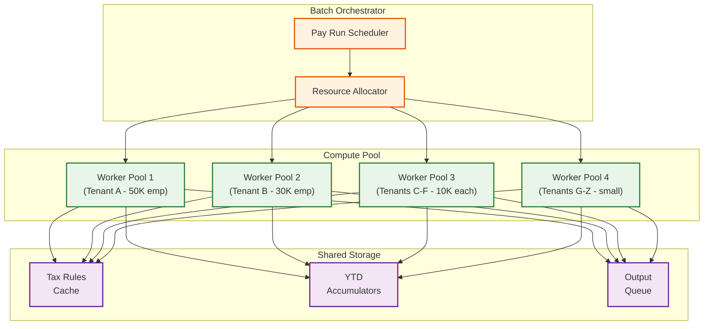
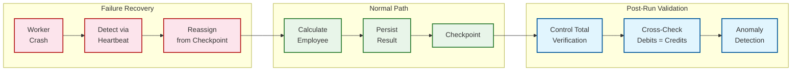

# Scalability and Reliability

## Scaling Strategies

### Multi-Tenant Payroll Processing at Scale

Payroll is the most resource-intensive batch workload in HCM. A platform serving 500 tenants with a combined 2 million employees must process payroll for multiple tenants concurrently, each with different pay schedules, tax jurisdictions, and calculation rules.

#### Tenant-Partitioned Parallel Execution



**Scaling approach:**
1. **Tenant-level isolation**: Each tenant's payroll runs in an isolated worker pool to prevent cross-tenant resource contention. Large tenants (>50K employees) get dedicated pools; smaller tenants are bin-packed onto shared pools.
2. **Employee-level parallelism within a tenant**: Individual employee calculations are embarrassingly parallel. A 50K-employee tenant can distribute across 100 workers, each processing 500 employees.
3. **Checkpoint-based recovery**: After each employee calculation completes, the result is persisted with a checkpoint. If a worker crashes, recovery resumes from the last checkpoint rather than restarting the entire run.
4. **Priority queuing**: Payroll runs are prioritized by urgency (final pay for terminations > regular payroll > off-cycle). Resource allocation reflects priority levels.

#### Scaling the Tax Calculation Service

Tax calculation is stateless and CPU-bound, making it ideal for horizontal scaling:

- **Pre-loaded rule sets**: At pay-run start, all applicable tax jurisdiction rules are loaded into a distributed cache. Workers read from cache, never touching the database during calculation.
- **Jurisdiction-aware routing**: Route employees to tax workers pre-loaded with their specific jurisdiction rules, reducing cache misses.
- **Auto-scaling based on pay-run queue depth**: When multiple tenants trigger payroll simultaneously (e.g., biweekly Friday for all US tenants), the tax service auto-scales based on pending calculation requests.

### Scaling Time Capture for Shift-Change Peaks

At 7:00 AM, 500 factory locations each have 200 workers clocking in within a 15-minute window---100,000 punches in 900 seconds (~111 punches/second sustained, with spikes to 500+/second).

**Scaling approach:**
1. **Edge buffering**: Time clock terminals maintain a local buffer and batch-transmit punches every 5-10 seconds, converting 500 individual requests into 50 batch requests.
2. **Ingestion tier separation**: A lightweight ingestion service accepts and acknowledges punches immediately (sub-2s SLA), writing to a durable queue. A separate processing service reads from the queue to apply pay rules, detect exceptions, and update timecards.
3. **Partition by location**: Time entry storage is partitioned by location and date, ensuring that concurrent writes from different locations do not contend for the same partition.
4. **Read replica for self-service**: Employee timecard views are served from read replicas, decoupled from the write path that handles incoming punches.

### Scaling Open Enrollment

Open enrollment creates a 3-week spike where self-service traffic increases 10-20x over steady state.

**Scaling approach:**
1. **Pre-computed enrollment packages**: Batch-generate personalized plan options, costs, and eligibility for every employee before enrollment opens. Serve from a read-optimized cache.
2. **Queue-based election processing**: Election submissions go to a durable queue rather than directly hitting the transactional database. Workers process elections at a sustainable rate, returning confirmation asynchronously.
3. **Horizontal web tier scaling**: Add capacity to the API gateway and employee self-service tier based on concurrent session count, with auto-scaling triggered at 70% capacity.
4. **Graceful degradation**: If enrollment load exceeds capacity, degrade non-critical features (plan comparison charts, historical cost trends) while keeping election submission always available.

---

## Reliability Patterns

### Payroll Run Fault Tolerance

Payroll has zero tolerance for data loss but can tolerate brief delays within the processing window.



**Reliability mechanisms:**
1. **Idempotent calculations**: Each employee calculation is identified by (pay_run_id, employee_id). Re-executing produces the same result and overwrites, not duplicates.
2. **Control total verification**: Before committing a pay run, verify that:
   - Total gross = sum of all earnings lines
   - Total net = gross - total deductions - total taxes
   - Total debits = total credits in the GL journal
   - Employee count matches expected population
3. **Anomaly detection**: Flag employees whose net pay deviates by >20% from the previous period (catches data entry errors, missed terminations, incorrect retro calculations).
4. **Two-phase commit for disbursement**: Payroll calculation and ACH file generation are separate steps. The pay run enters "REVIEWED" status after calculation, requiring explicit "COMMIT" from an authorized payroll administrator before ACH files are generated.

### Benefits Election Durability

An employee's benefits election is a legal commitment. Losing an election after the employee has confirmed it creates compliance exposure.

**Reliability mechanisms:**
1. **Synchronous persistence**: Election submissions are persisted to the primary database with synchronous replication before returning confirmation to the employee.
2. **Election confirmation records**: A separate, immutable confirmation record is created for each election, serving as the legal record of the employee's choice.
3. **Carrier feed reconciliation**: After transmitting carrier feeds, the system ingests carrier acknowledgment files and reconciles every record. Discrepancies trigger alerts for manual review.

### Time Capture Resilience

Missing or duplicate time entries directly impact payroll accuracy.

**Reliability mechanisms:**
1. **At-least-once delivery with deduplication**: Time clocks deliver punches at-least-once. The server deduplicates based on (employee_id, entry_type, timestamp) within a 60-second window.
2. **Store-and-forward at the edge**: Time clocks have persistent local storage. Network outages do not cause punch loss; queued punches transmit when connectivity resumes.
3. **Missing punch detection**: At the end of each day, a reconciliation job identifies employees with incomplete punch pairs (clock-in without clock-out) and generates exceptions for manager resolution.
4. **Payroll lock protection**: Time entries cannot be modified after the timecard enters "SENT_TO_PAYROLL" status. Any post-lock corrections require a formal adjustment process that flows through the next pay period.

---

## Global Payroll Across Jurisdictions

### The Multi-Country Challenge

A global HCM serving employees in 40 countries must handle:

| Dimension | Variation |
|-----------|-----------|
| Pay frequency | Weekly (US hourly), monthly (Europe), semi-monthly (mixed) |
| Tax system | Progressive brackets (US, UK), flat tax (Russia), no income tax (UAE) |
| Social contributions | Social Security + Medicare (US), National Insurance (UK), CPF (Singapore), superannuation (Australia) |
| Statutory deductions | Mandatory pension (many EU), mandatory health insurance (Germany), union fees (Nordic) |
| Currency | Local currency payroll with cross-border transfers for expatriates |
| Year-end reporting | W-2 (US), P60 (UK), Lohnsteuerbescheinigung (Germany), Group Certificate (Australia) |
| Data residency | GDPR (EU), PDPA (Singapore), LGPD (Brazil) may require in-country data processing |

### Architecture for Global Payroll

```
APPROACH: Country Payroll Engines with Shared Core

Shared Core (all countries):
  - Employee master data management
  - Gross earnings calculation (base + premiums + retro)
  - General ledger posting format
  - Audit trail and workflow

Country-Specific Engine (per jurisdiction):
  - Tax withholding calculation
  - Statutory deduction rules
  - Government reporting formats
  - Compliance validation rules
  - Locale-specific pay stub format

Execution Model:
  - Each country engine runs as a pluggable module
  - Shared core invokes country engine via a standard interface:
    calculate_taxes(gross, ytd, employee_tax_profile) -> TaxResult
    calculate_statutory(gross, employee_profile) -> DeductionResult
    generate_filing(pay_period, employees) -> FilingDocument
```

**Scaling considerations for global payroll:**
1. **Time-zone-aware scheduling**: US payroll runs during US business hours; European payroll during EU hours. This naturally distributes batch load across the day.
2. **Data residency compliance**: For jurisdictions requiring in-country processing (EU under GDPR), deploy country-specific payroll workers in regional data centers. The shared employee master replicates to regional instances with field-level encryption for sensitive data.
3. **Currency handling**: All monetary calculations use the employee's local currency. Cross-border cost allocation uses exchange rates locked at the pay-period start date for consistency.

---

## Disaster Recovery

### Recovery Strategy by Component

| Component | RPO | RTO | Strategy |
|-----------|-----|-----|----------|
| Employee master database | 0 (zero data loss) | < 15 min | Synchronous replication to standby; automated failover |
| Payroll database | 0 | < 30 min | Synchronous replication; pay run can restart from checkpoint |
| Time capture ingestion | < 5 min | < 10 min | Multi-zone ingestion endpoints; edge buffering covers brief outages |
| Benefits database | 0 | < 30 min | Synchronous replication; critical during enrollment windows |
| Document store | < 1 hour | < 2 hours | Asynchronous replication; documents are regeneratable from source data |
| Analytics warehouse | < 4 hours | < 8 hours | Rebuilt from CDC pipeline; non-critical latency |

### Payroll Disaster Recovery Scenario

If the primary payroll engine fails mid-run:

1. Batch orchestrator detects missing heartbeats from failed workers within 30 seconds
2. Remaining uncalculated employees are redistributed to surviving workers or standby pool
3. Already-calculated employees (checkpointed) are not recalculated
4. If the entire primary region fails, the payroll run is restarted in the DR region from the last global checkpoint
5. The pay run completion target has a 2-hour buffer before the ACH cutoff, providing recovery time

### Data Backup and Retention

| Data Type | Retention | Backup Frequency | Notes |
|-----------|-----------|-------------------|-------|
| Employee master | 7 years post-termination | Continuous replication + daily snapshot | Labor law and tax audit requirements |
| Payroll results | 7 years | Daily snapshot; immutable after commit | IRS, state tax audit requirements |
| Time entries | 3 years | Daily snapshot | FLSA recordkeeping requirements |
| Benefits elections | 7 years | Daily snapshot | ERISA and ACA compliance |
| Tax filings | 7 years | Immutable after submission | IRS retention requirements |
| Audit trail | 10 years | Continuous replication | SOX and general compliance |
| Documents (pay stubs, W-2s) | 7 years | Object storage with versioning | Employee access and audit |
