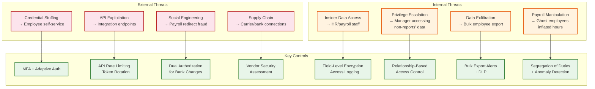

# Security and Compliance

## Threat Model

### Data Sensitivity Classification

| Data Category | Sensitivity | Examples | Threat Impact |
|--------------|-------------|----------|---------------|
| **PII - Critical** | Highest | SSN, bank account numbers, tax IDs | Identity theft, financial fraud |
| **PII - Sensitive** | High | Salary, compensation, performance ratings | Discrimination, workplace conflict |
| **PHI (Health)** | High | Benefits medical elections, disability status, FMLA reasons | HIPAA violation, discrimination |
| **Financial** | High | Payroll results, tax withholding, garnishments | Fraud, regulatory penalties |
| **Organizational** | Medium | Org charts, headcount, compensation bands | Competitive intelligence |
| **General HR** | Medium | Job titles, work locations, hire dates | Privacy concerns |
| **Public** | Low | Company directory (name, department, photo) | Minimal |

### Top Threat Vectors



---

## PII Protection

### Encryption Strategy

| Layer | Mechanism | Scope |
|-------|-----------|-------|
| **Transport** | TLS 1.3 for all connections | All API calls, internal service communication, time clock → server |
| **At rest (database)** | Transparent data encryption (TDE) | Entire database volumes |
| **At rest (field-level)** | Application-level encryption with per-tenant keys | SSN, bank accounts, tax IDs, dependent SSNs |
| **At rest (documents)** | Object storage server-side encryption with customer-managed keys | Pay stubs, tax forms, benefits documents |
| **In memory** | Encrypted processing where supported; clear-on-use for sensitive fields | Payroll calculation buffers |
| **Key management** | Hardware security module (HSM) with automatic key rotation | All encryption keys; 90-day rotation |

### Field-Level Encryption Design

```
SENSITIVE FIELDS AND ENCRYPTION APPROACH:

Critical PII (encrypted at application layer, searchable via blind index):
  - employee.ssn → AES-256-GCM encrypted; blind index (HMAC-SHA256) for lookup
  - bank_account.account_number → AES-256-GCM encrypted; no index needed
  - bank_account.routing_number → AES-256-GCM encrypted
  - dependent.ssn → AES-256-GCM encrypted; blind index for lookup
  - tax_election.filing_status → AES-256-GCM encrypted

Sensitive PII (encrypted at application layer, limited query support):
  - compensation.amount → Encrypted; decrypted only for payroll and authorized views
  - pay_result.net_pay → Encrypted; decrypted for pay stubs and reporting
  - garnishment.amount → Encrypted
  - garnishment.case_number → Encrypted

Health Information (encrypted, separate access control):
  - benefit_election (medical/dental/vision plans) → Encrypted
  - dependent.is_disabled → Encrypted
  - leave_request.reason (when FMLA/medical) → Encrypted

Tokenization (for display without revealing full value):
  - SSN displayed as "***-**-1234" (last 4 only)
  - Bank account displayed as "****5678" (last 4 only)
```

### Data Masking for Non-Production Environments

- Development and staging environments use fully synthetic employee data generated by a data masking pipeline
- Production data never leaves the production environment---masking is irreversible (not pseudonymization)
- Masking preserves statistical distribution (salary ranges, demographic ratios) for realistic testing
- Payroll calculations in non-production use synthetic tax tables that mirror production structure

---

## Access Control Model

### Role-Based and Relationship-Based Access

HCM access control combines traditional RBAC with relationship-based access (ReBAC). An employee's access depends on both their role AND their organizational relationships.

```
ACCESS CONTROL MATRIX:

Employee (self):
  - READ own: profile, compensation, benefits, time, leave balances, pay stubs
  - WRITE own: personal info (address, emergency contacts), time entries, leave requests
  - WRITE own: benefits elections (during enrollment windows only)
  - CANNOT: see any other employee's compensation or benefits details

Manager (direct reports only):
  - READ: profile, job details, time entries, leave balances for direct reports
  - READ: compensation (only if granted "comp viewer" role)
  - WRITE: approve time cards, approve leave requests for direct reports
  - CANNOT: modify compensation, benefits elections, or payroll data

HR Administrator (scoped to assigned legal entities/populations):
  - READ/WRITE: employee profiles, employment records, org assignments
  - READ: compensation and benefits (within scope)
  - WRITE: initiate lifecycle events (hire, transfer, termination)
  - CANNOT: commit payroll runs or modify bank account information

Payroll Specialist (scoped to assigned pay groups):
  - READ: compensation, tax elections, benefits deductions, time data
  - WRITE: run payroll calculations, review results, process off-cycle payments
  - CANNOT: modify employee compensation or hire/terminate employees

Benefits Administrator:
  - READ/WRITE: benefit plans, eligibility rules, carrier configurations
  - READ: employee elections (within scope)
  - WRITE: process life events, manage open enrollment, generate carrier feeds
  - CANNOT: access payroll results or modify compensation

Payroll Approver (segregated from payroll specialist):
  - READ: payroll run results and control totals
  - WRITE: commit approved payroll runs for disbursement
  - CANNOT: modify individual employee calculations or run payroll
```

### Segregation of Duties (SOD) Enforcement

SOD prevents a single person from controlling an entire sensitive process:

| Process | Duty 1 | Duty 2 | Enforcement |
|---------|--------|--------|-------------|
| Payroll | Calculate payroll (Specialist) | Commit payroll (Approver) | Different users required |
| Employee creation | Create employee (HR Admin) | Approve employee (HR Manager) | Two-person approval |
| Bank account change | Employee initiates | Payroll verifies (out-of-band) | Dual authorization |
| Compensation change | Manager proposes | HR/Comp approves | Workflow enforcement |
| Benefits plan setup | Benefits Admin configures | Benefits Manager approves | Separate roles |

### SOD Violation Detection

```
FUNCTION check_sod_violations(action, user, context):
    // Get conflicting duties for this action
    conflicts = get_sod_rules(action.type)

    FOR each conflict IN conflicts:
        // Check if this user performed the conflicting duty
        prior_actions = get_recent_actions(
            user_id=user.id,
            action_type=conflict.conflicting_action,
            entity_id=context.entity_id,
            lookback_period=conflict.lookback_window
        )

        IF prior_actions IS NOT EMPTY:
            log_sod_violation(user, action, conflict, prior_actions)

            IF conflict.enforcement == HARD_BLOCK:
                RETURN DENIED("SOD violation: cannot perform both " +
                              action.type + " and " + conflict.conflicting_action)
            ELSE IF conflict.enforcement == SOFT_WARN:
                notify_compliance_team(user, action, conflict)
                RETURN ALLOWED_WITH_WARNING

    RETURN ALLOWED
```

---

## Regulatory Compliance

### GDPR Compliance (Employee Data)

| GDPR Right | HCM Implementation |
|------------|-------------------|
| **Right to access** | Employee self-service data export; generates complete data package within 30 days |
| **Right to rectification** | Employee can update personal information; HR validates and applies corrections |
| **Right to erasure** | Complex in HCM: payroll records have mandatory retention (tax law overrides GDPR erasure). Implement selective erasure: delete non-required personal data, pseudonymize retained records |
| **Right to portability** | Export employee data in machine-readable format (JSON/CSV) including compensation, benefits, and time history |
| **Lawful basis** | Employment contract (Art. 6(1)(b)) for core HR data; legal obligation (Art. 6(1)(c)) for payroll/tax; consent for optional data (emergency contacts of non-employees) |
| **Data minimization** | Collect only data required for employment administration; periodic review of custom fields for necessity |
| **Retention limits** | Automated data lifecycle: delete non-required data after retention period; pseudonymize payroll records after 7-year tax retention |

### GDPR Erasure with Payroll Retention Exception

```
FUNCTION process_erasure_request(employee_id):
    employee = get_employee(employee_id)

    // Determine which data can be erased vs. must be retained
    erasable = []
    retained = []

    FOR each data_category IN employee.data_categories:
        retention_rules = get_retention_rules(data_category,
                                              employee.legal_entity.country)

        IF retention_rules.mandatory_retention_end > NOW:
            retained.add(data_category,
                         reason=retention_rules.legal_basis,
                         until=retention_rules.mandatory_retention_end)
        ELSE:
            erasable.add(data_category)

    // Erase what can be erased
    FOR each category IN erasable:
        delete_data(employee_id, category)

    // Pseudonymize retained data
    FOR each category IN retained:
        pseudonymize_data(employee_id, category)
        // Replace name with "Former Employee #hash"
        // Replace address with legal entity country only
        // Retain financial figures for tax/audit but strip identifying context

    // Log the erasure action
    log_erasure_event(employee_id, erasable, retained)

    RETURN ErasureResult(erased=erasable, retained_with_justification=retained)
```

### SOX Compliance for Payroll

SOX (Sarbanes-Oxley) applies to payroll because payroll is a material financial process:

| SOX Control | Implementation |
|-------------|---------------|
| **IT General Controls (ITGC)** | Change management for payroll calculation logic; access reviews quarterly |
| **Segregation of duties** | Calculate vs. commit separation (see SOD matrix above) |
| **Audit trail** | Every payroll action logged with who, what, when, before/after values |
| **Access certification** | Quarterly review of all users with payroll access; automated deprovisioning |
| **Reconciliation** | Automated payroll-to-GL reconciliation; variance investigation for all differences |
| **Change detection** | Alerts for payroll parameter changes (tax tables, deduction codes) outside change window |
| **Logical access** | MFA for payroll systems; session timeout; no shared accounts |

### HIPAA for Benefits Health Data

Benefits administration involves Protected Health Information (PHI) when employees enroll in medical plans:

| Safeguard | Implementation |
|-----------|---------------|
| **Access controls** | Benefits data accessible only to benefits administrators and the enrolled employee; payroll sees only deduction amounts, not plan details |
| **Audit controls** | All access to medical plan elections logged; quarterly audit review |
| **Transmission security** | Carrier feeds (EDI 834) encrypted in transit; SFTP with mutual authentication |
| **Integrity controls** | Carrier feed checksums; reconciliation against carrier acknowledgments |
| **Minimum necessary** | Payroll engine receives deduction codes and amounts only---not diagnosis, plan tier, or dependent health status |
| **Business associate agreements** | All benefits carriers and third-party administrators have BAAs on file |

---

## Payroll Fraud Detection

### Common Payroll Fraud Patterns and Controls

| Fraud Type | Detection Method |
|------------|-----------------|
| **Ghost employees** | Cross-reference employee roster against badge access logs, benefits enrollment, and tax filing records; flag employees with no activity |
| **Inflated hours** | Compare reported hours against schedule, badge access, and peer group averages; flag outliers >2 standard deviations |
| **Unauthorized pay changes** | Alert on compensation changes not linked to an approved workflow; detect bulk changes by a single user |
| **Bank account redirect** | Require dual authorization for bank account changes; cooling period before first payment to new account; verify via out-of-band confirmation |
| **Duplicate payments** | Deduplication check before ACH generation; flag same employee appearing in multiple pay runs for the same period |
| **Terminated employee payments** | Cross-reference payroll population against active employee roster before every pay run; flag any terminated employees still in a pay group |

### Anomaly Detection Algorithm

```
FUNCTION detect_payroll_anomalies(pay_run):
    anomalies = []

    FOR each result IN pay_run.results:
        // Compare against historical baseline
        history = get_pay_history(result.employee_id, periods=6)

        IF history.count < 2:
            CONTINUE  // New employee, insufficient baseline

        avg_net = AVERAGE(h.net_pay FOR h IN history)
        stddev = STDDEV(h.net_pay FOR h IN history)

        // Flag significant deviations
        IF ABS(result.net_pay - avg_net) > 2 * stddev:
            anomalies.add(Anomaly(
                employee_id=result.employee_id,
                type="NET_PAY_DEVIATION",
                expected=avg_net,
                actual=result.net_pay,
                deviation_pct=(result.net_pay - avg_net) / avg_net * 100
            ))

        // Flag zero net pay (possible error)
        IF result.net_pay <= 0 AND result.gross_pay > 0:
            anomalies.add(Anomaly(type="ZERO_OR_NEGATIVE_NET_PAY"))

        // Flag new bank account with first payment
        IF is_new_bank_account(result.employee_id, within_days=30):
            anomalies.add(Anomaly(type="FIRST_PAYMENT_NEW_BANK"))

    RETURN anomalies
```

---

## Audit Trail Architecture

### What Gets Logged

Every state change to an HCM record is captured in an append-only audit log:

| Event Category | Data Captured |
|---------------|---------------|
| Employee data changes | Field changed, old value, new value, changed_by, timestamp, source (API/UI/integration) |
| Payroll actions | Run initiated/calculated/committed, by whom, employee count, total amounts |
| Benefits elections | Plan selected, coverage level, effective date, enrollment reason, enrollment window |
| Time entries | Original entry, modifications, approvals, rejections with reasons |
| Access events | Login, logout, failed attempts, privilege escalation, sensitive data access |
| Configuration changes | Pay rule updates, policy changes, tax table updates, changed_by, approval reference |
| Integration events | Carrier feeds sent, bank files transmitted, tax filings submitted, acknowledgments received |

### Audit Log Schema

```
TABLE audit_log:
    id                  UUID PRIMARY KEY
    tenant_id           UUID NOT NULL (partition key)
    event_timestamp     TIMESTAMP NOT NULL
    entity_type         VARCHAR(50) (EMPLOYEE, PAY_RUN, BENEFIT_ELECTION, etc.)
    entity_id           UUID
    action              VARCHAR(30) (CREATE, UPDATE, DELETE, ACCESS, APPROVE, COMMIT)
    actor_id            UUID (user who performed action)
    actor_type          ENUM(EMPLOYEE, SYSTEM, INTEGRATION, BATCH_JOB)
    actor_ip            VARCHAR(45)
    field_changes       JSONB NULLABLE (array of {field, old_value, new_value})
    context             JSONB (request_id, session_id, workflow_id, approval_chain)
    data_classification VARCHAR(20) (CRITICAL_PII, SENSITIVE, FINANCIAL, GENERAL)

    PARTITION BY RANGE (event_timestamp) -- monthly partitions
    INDEX: (tenant_id, entity_type, entity_id, event_timestamp)
    INDEX: (tenant_id, actor_id, event_timestamp)
    INDEX: (tenant_id, data_classification, event_timestamp)

    IMMUTABLE: No UPDATE or DELETE operations permitted
    RETENTION: 10 years with automated archival to cold storage after 2 years
```
