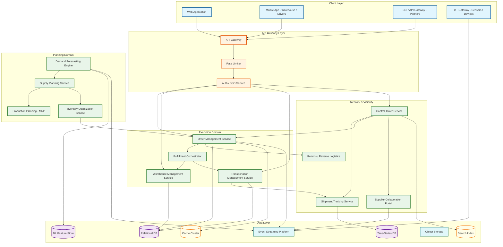
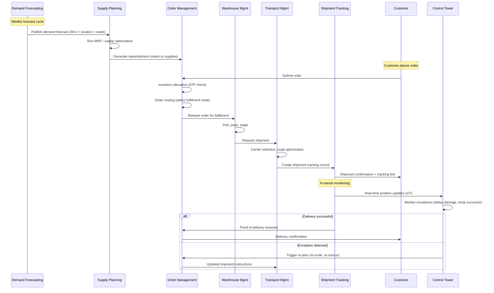

# Supply Chain Management System Design (Demand Forecasting, Order Management, Logistics Optimization)

## System Overview

A Supply Chain Management (SCM) System orchestrates the end-to-end flow of goods, information, and capital from raw material sourcing through production, warehousing, transportation, and final delivery to the customer. Systems like SAP SCM, Oracle SCM Cloud, and Blue Yonder coordinate demand forecasting, order management (OMS), warehouse management (WMS), transportation management (TMS), production planning (MRP/MRP II), supplier collaboration, and reverse logistics across global multi-tier supply networks. The core engineering challenge is building a platform that can simultaneously optimize across competing objectives---minimizing inventory carrying costs while preventing stockouts, reducing transportation costs while meeting delivery SLAs, and maximizing production throughput while maintaining quality---all while reacting in near-real-time to disruptions like supplier delays, demand spikes, port congestion, and geopolitical events. Unlike consumer-facing systems optimized for request throughput, supply chain platforms are optimized for decision quality: every routing decision, inventory allocation, and forecast adjustment has cascading financial consequences measured in millions of dollars. The system must blend deterministic workflows (order-to-cash, procure-to-pay) with probabilistic models (demand forecasting, risk scoring) and combinatorial optimization (route planning, production scheduling).

---

## Key Characteristics

| Characteristic | Description |
|---------------|-------------|
| **Read/Write Pattern** | Write-heavy for transactional flows (orders, shipments, receipts, inventory adjustments); read-heavy for visibility dashboards, forecast queries, and analytics; mixed for planning workloads that read current state and write optimized plans |
| **Latency Sensitivity** | Variable---order capture requires sub-second response; demand forecasting and route optimization are batch/near-real-time (seconds to minutes); production planning can tolerate minutes to hours; control tower dashboards need sub-5-second refresh |
| **Consistency Model** | Strong consistency for inventory allocation and order state transitions (double-allocation is catastrophic); eventual consistency for forecast models, KPI dashboards, and supplier performance scores |
| **Data Volume** | Very High---large enterprises process 1M+ orders/year, 10M+ shipments, billions of IoT sensor readings from fleet/warehouse, and petabytes of historical demand data for ML models |
| **Architecture Model** | Event-driven microservices with domain-driven boundaries; CQRS for order management (write-optimized order state vs. read-optimized visibility); separate compute planes for transactional processing, ML inference, and optimization solvers |
| **Regulatory Burden** | High---customs compliance (HS codes, tariff classification), trade sanctions screening, food safety traceability (FDA FSMA), pharmaceutical chain of custody (DSCSA), hazmat regulations (DOT/IATA), ESG and carbon reporting |
| **Complexity Rating** | **Very High** |

---

## Quick Navigation

| Document | Description |
|----------|-------------|
| [01 - Requirements & Estimations](./01-requirements-and-estimations.md) | Functional/non-functional requirements, capacity planning, SLOs |
| [02 - High-Level Design](./02-high-level-design.md) | Architecture diagrams, data flow, key decisions |
| [03 - Low-Level Design](./03-low-level-design.md) | Data models, API design, algorithms (pseudocode) |
| [04 - Deep Dive & Bottlenecks](./04-deep-dive-and-bottlenecks.md) | Demand forecasting models, order routing optimization, inventory allocation, bullwhip effect mitigation |
| [05 - Scalability & Reliability](./05-scalability-and-reliability.md) | Multi-region supply chains, event-driven architecture, disaster recovery |
| [06 - Security & Compliance](./06-security-and-compliance.md) | Supply chain data security, EDI security, customs compliance, trade sanctions |
| [07 - Observability](./07-observability.md) | Supply chain KPIs, order fulfillment metrics, logistics tracking, forecast accuracy |
| [08 - Interview Guide](./08-interview-guide.md) | 45-min pacing, trap questions, trade-offs, scoring rubric |
| [09 - Insights](./09-insights.md) | Key architectural insights, patterns, lessons |

---

## What Differentiates This from Related Systems

| Aspect | Supply Chain Mgmt (This) | ERP System | Inventory Management | Procurement System | Invoice & Billing |
|--------|--------------------------|------------|---------------------|-------------------|-------------------|
| **Core Function** | End-to-end orchestration of goods flow from supplier to customer across global networks | Unified business operations across all departments | Stock tracking, warehouse operations, reorder management | Purchasing lifecycle from need to payment | Outbound billing, revenue recognition, collections |
| **Optimization Focus** | Multi-objective: cost, speed, service level, risk, sustainability simultaneously | Process standardization and data integration | Storage efficiency, picking optimization, stock accuracy | Spend reduction, compliance enforcement, vendor management | Cash flow optimization, revenue accuracy |
| **Planning Horizon** | Strategic (years), tactical (months), operational (days/hours)---all three simultaneously | Transactional and periodic reporting | Short-term: reorder points, safety stock | Per-transaction: requisition to payment cycle | Per-invoice: billing cycle to collection |
| **External Network** | Deep---hundreds of suppliers, carriers, 3PLs, customs brokers, freight forwarders across multiple tiers | Internal departments, some vendor integration | Primarily internal warehouse operations | Direct supplier relationships | Customer-facing billing relationships |
| **Forecasting** | Core capability: statistical + ML demand forecasting drives all downstream planning | Basic demand signals from sales modules | Min/max reorder triggers based on consumption | No forecasting---reactive to requisitions | Revenue forecasting from billing pipeline |
| **Physical World** | Deeply coupled---IoT sensors, GPS tracking, warehouse robotics, container visibility | Digital records with physical inventory counts | Warehouse-centric physical operations | Document-centric (POs, invoices, contracts) | Purely financial/digital |
| **Disruption Response** | Real-time detection and automated re-planning across the entire network | Manual exception handling per module | Safety stock buffers only | Alternate vendor sourcing | Payment rescheduling |

---

## What Makes This System Unique

1. **Multi-Echelon Optimization Across Competing Objectives**: Unlike systems that optimize a single metric, SCM must simultaneously balance inventory costs (minimize stock), service levels (maximize availability), transportation costs (consolidate shipments vs. fast delivery), and production efficiency (long runs vs. flexibility). These objectives directly conflict: reducing inventory increases stockout risk; faster delivery increases transport cost. The system must compute Pareto-optimal trade-off frontiers and let planners choose positions along them---or automate the selection based on configurable business policies.

2. **Demand Forecasting as the Foundation of All Planning**: Every downstream decision---how much to produce, what to stock, which routes to plan, how many trucks to book---depends on demand forecasts. A 10% improvement in forecast accuracy can reduce inventory costs by 15--25% and stockouts by 30--50%. The system must support multiple forecasting methods (ARIMA, exponential smoothing, Prophet, DeepAR, gradient-boosted trees) and automatically select the best model per SKU-location combination based on historical accuracy, demand pattern characteristics (intermittent, seasonal, trending, lumpy), and data availability.

3. **The Bullwhip Effect as an Architectural Problem**: Small demand fluctuations at the retail level amplify as they propagate upstream through distributors, manufacturers, and raw material suppliers. This is not just a business problem---it is an information architecture problem. Systems that batch orders, delay information sharing, or use local (non-collaborative) forecasting amplify the bullwhip. The architecture must enable real-time demand signal propagation, collaborative planning with suppliers (VMI, CPFR), and visibility into downstream inventory positions to dampen amplification.

4. **Physical-Digital Coupling with IoT at Scale**: SCM systems must ingest and process millions of IoT events per day---GPS pings from trucks, temperature readings from cold-chain sensors, RFID scans in warehouses, container tracking from port systems. These physical-world signals must be correlated with digital order and shipment records in near-real-time to provide accurate ETA predictions, exception alerts (temperature excursion, route deviation), and automated re-planning when physical reality diverges from the plan.

5. **Supply Chain Control Tower as a Real-Time Decision Hub**: The control tower aggregates data from all supply chain nodes into a single visibility layer, providing real-time dashboards, exception-based alerting, and prescriptive recommendations. It is not just a monitoring tool---it must correlate events across domains (a port strike + demand spike + low inventory = proactive air freight recommendation), run what-if simulations, and orchestrate automated responses for pre-defined disruption scenarios.

6. **Returns and Reverse Logistics as a Parallel Supply Chain**: Reverse logistics (returns, repairs, recycling, disposal) operates as an inverted supply chain with its own routing, inspection, disposition, and inventory management challenges. Returns cannot simply follow the forward path in reverse---they require separate inspection workflows, disposition decisions (restock, refurbish, liquidate, recycle), and often different transportation networks. The reverse flow generates valuable data for quality improvement and demand pattern analysis.

---

## Quick Reference: Scale Numbers

| Metric | Value | Notes |
|--------|-------|-------|
| Organizations supported | ~3,000 | Multi-tenant platform serving manufacturers, retailers, distributors |
| Total users | ~1.5M | Planners, warehouse staff, drivers, suppliers, customer service |
| Orders processed per year | ~500M | Across all tenants; large retailers process 50--100M each |
| SKU-location combinations | ~2B | 200K SKUs × 10K locations per large enterprise |
| Shipments tracked per year | ~1B | Including last-mile, LTL, FTL, ocean, air, rail |
| IoT events ingested per day | ~5B | GPS pings, temperature, humidity, RFID scans, weight sensors |
| Demand forecasts generated per cycle | ~500M | Per SKU-location-week for 52-week rolling horizon |
| Inventory transactions per day | ~50M | Receipts, picks, packs, ships, adjustments, cycle counts |
| Route optimization requests per day | ~2M | For fleet routing, carrier selection, load building |
| Supplier EDI messages per day | ~10M | ASN, PO acknowledgment, invoice, shipment status |
| Active carriers across platform | ~100K | LTL, FTL, parcel, ocean, air freight carriers |
| Warehouse nodes managed | ~50K | Distribution centers, fulfillment centers, stores, cross-docks |
| Average order lines | ~5 | Varies from 1 (e-commerce) to 500+ (B2B replenishment) |
| Concurrent control tower users | ~50K | Operations analysts monitoring real-time dashboards |

---

## Architecture Overview (Conceptual)

---

## Key Trade-Offs in Supply Chain System Design

| Trade-Off | Option A | Option B | This System's Choice |
|-----------|----------|----------|---------------------|
| **Forecast Model** | Statistical models (ARIMA, Holt-Winters)---interpretable, low compute | ML models (DeepAR, LightGBM)---higher accuracy, opaque, compute-heavy | Ensemble: statistical as baseline, ML for high-value/complex SKUs; automatic model selection per SKU-location based on backtesting |
| **Inventory Strategy** | Centralized inventory (fewer locations, lower holding cost) | Decentralized inventory (closer to demand, faster fulfillment) | Multi-echelon: strategic stock positioning based on demand variability and service level targets; forward-deploy fast-movers, centralize long-tail |
| **Order Routing** | Rules-based (simple, predictable, fast) | Optimization-based (cost-optimal, complex, slower) | Hybrid: rules for simple single-source orders; optimization solver for multi-source, split-shipment, and constrained scenarios |
| **Transportation** | Dedicated fleet (control, predictable cost) | Spot market carriers (flexibility, variable cost) | Mixed: dedicated for predictable lanes, spot for surge and long-tail routes; carrier selection optimization balances cost, reliability, and capacity |
| **Information Sharing** | Siloed per tier (simple, protects IP) | Full visibility across tiers (reduces bullwhip, complex trust model) | Tiered sharing: real-time demand signals and inventory positions shared with tier-1 suppliers; aggregated signals for tier-2+; blockchain-optional for provenance |
| **Planning Cadence** | Fixed-cycle (weekly/monthly batch planning) | Continuous (real-time re-planning on every event) | Layered: strategic planning monthly, tactical weekly, operational daily, exception-driven re-planning in real-time for disruptions |
| **Control Tower** | Passive visibility (dashboards and alerts) | Active orchestration (automated response to disruptions) | Progressive: visibility first, then automated responses for well-understood scenarios (carrier swap on delay, safety stock rebalance), human-in-loop for novel disruptions |

---

## End-to-End Supply Chain Flow

---

## Related Designs

| Design | Relevance |
|--------|-----------|
| [9.1 - ERP System](../9.1-erp-system-design/) | Parent system; SCM modules integrate deeply with finance, HR, and manufacturing |
| [9.4 - Inventory Management](../9.4-inventory-management-system/) | Core subsystem; inventory optimization and warehouse operations are SCM components |
| [9.5 - Procurement System](../9.5-procurement-system/) | Upstream integration; purchase orders and supplier management feed into supply planning |
| [9.6 - Invoice & Billing](../9.6-invoice-billing-system/) | Financial settlement for freight, carrier invoices, and customer billing |

---

## Sources

- Blue Yonder / JDA --- Supply Chain Planning Platform Architecture
- SAP Integrated Business Planning (IBP) --- Demand Sensing and Supply Optimization
- Oracle SCM Cloud --- Order Management and Transportation Architecture
- Manhattan Associates --- Warehouse and Transportation Management Platform Design
- Kinaxis RapidResponse --- Concurrent Planning Engine Architecture
- GS1 Standards --- Supply Chain Data Standards (GTIN, SSCC, EPCIS)
- APICS / ASCM --- Supply Chain Operations Reference Model (SCOR)
- VICS / GS1 US --- Collaborative Planning, Forecasting, and Replenishment (CPFR)
- MIT Center for Transportation & Logistics --- Supply Chain Network Optimization Research
- Gartner --- Supply Chain Technology Reference Architecture (2026)
- Council of Supply Chain Management Professionals (CSCMP) --- Supply Chain Best Practices
- DSCSA --- Drug Supply Chain Security Act Compliance Framework
