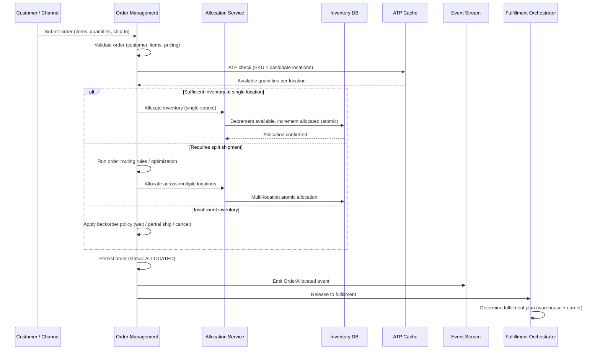
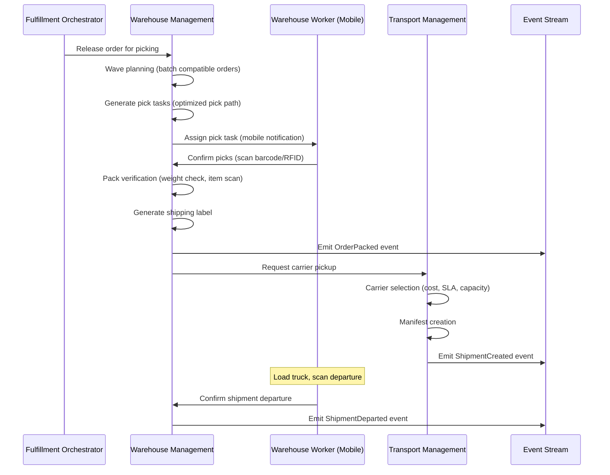
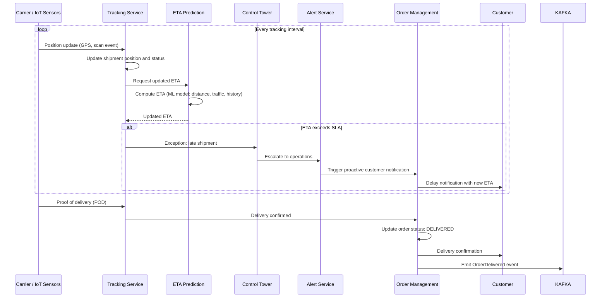
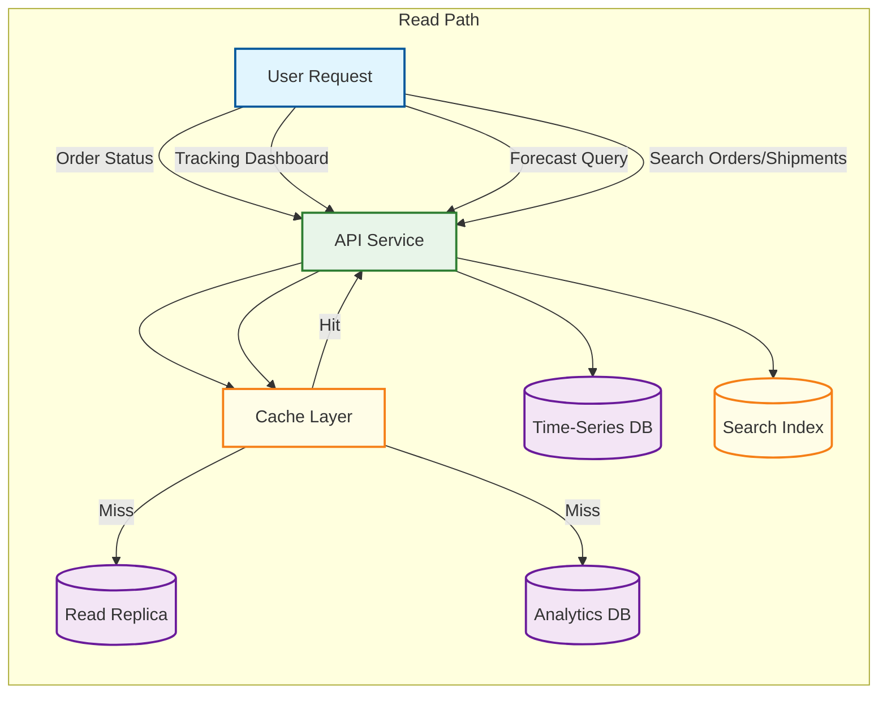
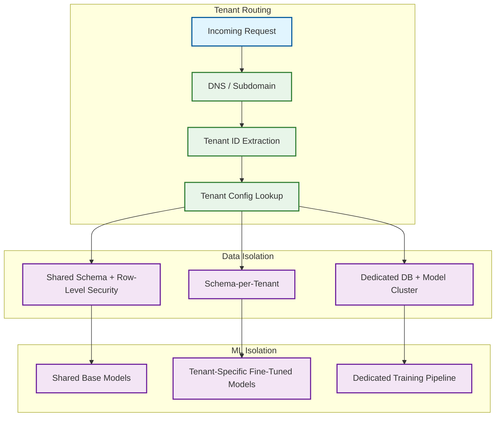

# High-Level Design

## System Architecture

The supply chain management platform follows a domain-driven microservices architecture organized into three planes: a **Planning Plane** for forecasting and optimization workloads, an **Execution Plane** for real-time transactional processing (orders, warehouse, transport), and a **Visibility Plane** for monitoring, tracking, and analytics. An event streaming backbone connects all planes, enabling real-time signal propagation and decoupled service evolution.

### Architecture Decisions

| Decision | Choice | Rationale |
|----------|--------|-----------|
| **Service Topology** | Domain-driven microservices with three compute planes | Planning (CPU-heavy optimization), execution (latency-sensitive transactions), and visibility (read-heavy analytics) have fundamentally different scaling and resource profiles |
| **Communication** | Event streaming (async) for cross-domain; synchronous gRPC for intra-domain | Demand signals must propagate across planning → execution → visibility without tight coupling; intra-domain calls (OMS → WMS) need low-latency synchronous coordination |
| **Database Strategy** | Polyglot persistence per domain | Relational for orders and inventory (ACID); time-series for IoT and tracking; columnar for analytics; graph for supply network topology; feature store for ML |
| **Caching** | Multi-layer: in-process for ATP hot paths, distributed for shared state | Inventory ATP checks must be sub-100ms; distributed cache for cross-service shared data (carrier rates, forecasts) |
| **Streaming Platform** | Durable event streaming with exactly-once semantics and replay | Supply chain events (order created, shipment departed) must never be lost; replay enables rebuilding read models and reprocessing after bug fixes |
| **ML Infrastructure** | Separate training pipeline with online inference serving | Demand forecasting models train on batch data (overnight); inference must be low-latency for real-time demand sensing and ATP adjustments |
| **Optimization Solvers** | Dedicated solver pool with job queue | Route optimization and production scheduling are CPU-intensive (minutes per solve); isolated from transactional latency-sensitive paths |

---

## System Architecture Diagram

```mermaid
flowchart TB
    subgraph Clients["Client Layer"]
        WEB[Web App - Planners / Analysts]
        MOB[Mobile App - WH Staff / Drivers]
        B2B[B2B EDI Gateway]
        B2C[B2C Order API]
        IOT[IoT Ingestion Gateway]
    end

    subgraph GW["API Gateway Layer"]
        AG[API Gateway]
        RL[Rate Limiter]
        SSO[SSO / Auth Service]
        TENANT[Tenant Router]
    end

    subgraph Planning["Planning Plane"]
        DEMAND_SVC[Demand Forecasting Service]
        SENSE[Demand Sensing Service]
        SUPPLY_SVC[Supply Planning Service]
        MRP_SVC[MRP / Production Planning]
        INV_OPT[Inventory Optimization]
        SCENARIO[Scenario Simulation Engine]
    end

    subgraph Execution["Execution Plane"]
        OMS_SVC[Order Management Service]
        ALLOC[Inventory Allocation Service]
        FULFILL_SVC[Fulfillment Orchestrator]
        WMS_SVC[Warehouse Management Service]
        TMS_SVC[Transportation Management Service]
        ROUTE_OPT[Route Optimization Solver]
        RMA_SVC[Returns Management Service]
    end

    subgraph Visibility["Visibility Plane"]
        CONTROL_SVC[Control Tower Service]
        TRACK_SVC[Shipment Tracking Service]
        ETA_SVC[ETA Prediction Service]
        ALERT_SVC[Alert & Escalation Service]
        REPORT[Reporting & Analytics]
    end

    subgraph Collaboration["Partner Collaboration"]
        SUPPLIER_SVC[Supplier Collaboration Portal]
        CARRIER_SVC[Carrier Integration Service]
        CUSTOMS_SVC[Trade Compliance Service]
    end

    subgraph DataLayer["Data Layer"]
        PG[(Relational DB Cluster)]
        TSDB[(Time-Series DB)]
        COLUMNAR[(Columnar Analytics DB)]
        GRAPH[(Graph DB - Network)]
        REDIS[(Cache Cluster)]
        KAFKA[Event Streaming Platform]
        BLOB[Object Storage]
        FEATURE[(ML Feature Store)]
        MODEL[Model Registry]
    end

    WEB --> AG
    MOB --> AG
    B2B --> AG
    B2C --> AG
    IOT --> KAFKA

    AG --> RL --> SSO --> TENANT

    TENANT --> OMS_SVC
    TENANT --> WMS_SVC
    TENANT --> TMS_SVC
    TENANT --> CONTROL_SVC
    TENANT --> DEMAND_SVC

    DEMAND_SVC --> SENSE
    DEMAND_SVC --> SUPPLY_SVC
    SUPPLY_SVC --> MRP_SVC
    SUPPLY_SVC --> INV_OPT
    INV_OPT --> ALLOC
    SCENARIO --> DEMAND_SVC
    SCENARIO --> SUPPLY_SVC

    OMS_SVC --> ALLOC
    OMS_SVC --> FULFILL_SVC
    FULFILL_SVC --> WMS_SVC
    FULFILL_SVC --> TMS_SVC
    TMS_SVC --> ROUTE_OPT
    TMS_SVC --> CARRIER_SVC
    OMS_SVC --> RMA_SVC

    CONTROL_SVC --> TRACK_SVC
    CONTROL_SVC --> ALERT_SVC
    TRACK_SVC --> ETA_SVC
    CONTROL_SVC --> REPORT

    SUPPLIER_SVC --> KAFKA
    CARRIER_SVC --> KAFKA
    CUSTOMS_SVC --> TMS_SVC

    OMS_SVC --> PG
    WMS_SVC --> PG
    TMS_SVC --> PG
    ALLOC --> PG
    ALLOC --> REDIS
    TRACK_SVC --> TSDB
    REPORT --> COLUMNAR
    SUPPLY_SVC --> GRAPH
    DEMAND_SVC --> FEATURE
    DEMAND_SVC --> MODEL
    ETA_SVC --> FEATURE
    CONTROL_SVC --> REDIS

    OMS_SVC --> KAFKA
    WMS_SVC --> KAFKA
    TMS_SVC --> KAFKA
    DEMAND_SVC --> KAFKA
    TRACK_SVC --> KAFKA

    classDef client fill:#e1f5fe,stroke:#01579b,stroke-width:2px
    classDef api fill:#fff3e0,stroke:#e65100,stroke-width:2px
    classDef service fill:#e8f5e9,stroke:#2e7d32,stroke-width:2px
    classDef data fill:#f3e5f5,stroke:#6a1b9a,stroke-width:2px
    classDef cache fill:#fffde7,stroke:#f57f17,stroke-width:2px
    classDef queue fill:#e0f7fa,stroke:#00695c,stroke-width:2px

    class WEB,MOB,B2B,B2C,IOT client
    class AG,RL,SSO,TENANT api
    class DEMAND_SVC,SENSE,SUPPLY_SVC,MRP_SVC,INV_OPT,SCENARIO,OMS_SVC,ALLOC,FULFILL_SVC,WMS_SVC,TMS_SVC,ROUTE_OPT,RMA_SVC,CONTROL_SVC,TRACK_SVC,ETA_SVC,ALERT_SVC,REPORT,SUPPLIER_SVC,CARRIER_SVC,CUSTOMS_SVC service
    class PG,TSDB,COLUMNAR,GRAPH data
    class REDIS,FEATURE,MODEL cache
    class KAFKA,BLOB queue
```



---

## Data Flow: Order-to-Delivery (Write Path)

### Order Capture and Allocation



### Warehouse Fulfillment



### Shipment Tracking and Delivery



---

## Read Path: Control Tower and Analytics



---

## Architecture Pattern Checklist

- [x] **Sync vs Async communication decided** --- Synchronous for user-facing APIs (order capture, ATP check); asynchronous event streaming for cross-domain propagation (order → warehouse → transport → tracking)
- [x] **Event-driven vs Request-response decided** --- Event-driven for supply chain signal propagation (demand changes, shipment milestones, inventory adjustments); request-response for user interactions and inter-service queries
- [x] **Push vs Pull model decided** --- Push for IoT ingestion, shipment alerts, and warehouse task assignment; pull for dashboards, forecast queries, and reporting
- [x] **Stateless vs Stateful services identified** --- All API services are stateless; optimization solvers are stateful (maintain solver state during execution); streaming consumers maintain local state for windowed aggregations
- [x] **Read-heavy vs Write-heavy optimization applied** --- CQRS: write path uses primary relational DB; read path uses read replicas + materialized views for dashboards + time-series DB for tracking + columnar DB for analytics
- [x] **Real-time vs Batch processing decided** --- Real-time for order processing, tracking, and ATP; near-real-time for demand sensing (5-minute windows); batch for forecast model training, route optimization, and overnight replenishment planning
- [x] **Edge vs Origin processing considered** --- Edge processing at IoT gateways for data filtering, aggregation, and anomaly pre-detection; origin processing for order management and planning

---

## Event-Driven Architecture

### Domain Events

| Event | Producer | Consumers | Purpose |
|-------|----------|-----------|---------|
| `DemandForecastPublished` | Demand Forecasting | Supply Planning, Inventory Optimization, Analytics | Triggers replenishment planning based on updated forecast |
| `DemandSignalReceived` | Demand Sensing | Demand Forecasting, Inventory Optimization | Real-time demand adjustment from POS/web signals |
| `OrderCreated` | Order Management | Allocation, Control Tower, Analytics | Triggers inventory allocation and visibility tracking |
| `OrderAllocated` | Allocation Service | Fulfillment, WMS, Analytics | Triggers warehouse fulfillment release |
| `OrderCancelled` | Order Management | Allocation (release inventory), Control Tower | Deallocates inventory and updates visibility |
| `PickCompleted` | WMS | Fulfillment, OMS, Analytics | Updates fulfillment progress |
| `ShipmentCreated` | TMS | Tracking, Control Tower, OMS | Initiates shipment monitoring |
| `ShipmentDeparted` | WMS / Carrier | Tracking, ETA Service, OMS | Triggers ETA computation |
| `TrackingUpdate` | Carrier / IoT | Tracking, ETA, Control Tower | Updates shipment position and predicted arrival |
| `DeliveryConfirmed` | Tracking | OMS, Analytics, Returns | Closes order fulfillment lifecycle |
| `ExceptionDetected` | Control Tower | Alert Service, OMS, TMS | Triggers automated or manual disruption response |
| `ReturnInitiated` | Returns Service | WMS (receiving), OMS, Analytics | Starts reverse logistics flow |
| `InventoryAdjusted` | WMS / Inventory | Allocation (ATP update), Analytics, Forecasting | Updates available inventory positions |
| `SupplierASNReceived` | Supplier Portal | WMS (inbound planning), Inventory | Enables advance receiving preparation |
| `CarrierRateUpdated` | Carrier Integration | TMS (rate cache), Analytics | Refreshes carrier pricing for route optimization |

### Event Schema Pattern

```
Event Envelope:
{
  event_id: UUID (idempotency key)
  event_type: "OrderAllocated"
  tenant_id: UUID
  aggregate_id: UUID (e.g., order ID)
  aggregate_type: "Order"
  version: 1
  timestamp: ISO-8601
  correlation_id: UUID (traces across the full order lifecycle)
  causation_id: UUID (parent event that caused this)
  actor: { user_id | system_id, source_service }
  payload: { ... domain-specific data ... }
  metadata: { source_service, schema_version, region }
}
```

---

## Key Integration Points

### External System Integration

```mermaid
flowchart LR
    subgraph SCM["Supply Chain Platform"]
        CORE[Core Services]
    end

    subgraph External["External Integrations"]
        ERP_SYS[ERP / Finance System]
        ECOM[E-Commerce Platform]
        CARRIER_SYS[Carrier Systems]
        SUPPLIER_SYS[Supplier Systems]
        CUSTOMS_SYS[Customs / Trade Compliance]
        WEATHER[Weather Data Providers]
        MARKET[Market Data Feeds]
        PORT[Port / Terminal Systems]
    end

    subgraph Protocols["Integration Protocols"]
        REST[REST / gRPC APIs]
        EDI_P[EDI X12 / EDIFACT]
        AS2[AS2 Protocol]
        MQTT[MQTT / IoT Protocols]
        WEBHOOK[Webhooks]
    end

    CORE <-->|Financial settlement, cost postings| ERP_SYS
    CORE <-->|Order ingestion, inventory sync| ECOM
    CORE <-->|Shipment tender, tracking, POD| CARRIER_SYS
    CORE <-->|PO, ASN, VMI data| SUPPLIER_SYS
    CORE <-->|HS codes, denied party, duties| CUSTOMS_SYS
    CORE <--|Weather forecasts for demand sensing| WEATHER
    CORE <--|Commodity prices, economic indicators| MARKET
    CORE <--|Vessel schedules, port congestion| PORT

    ERP_SYS --- REST
    ECOM --- REST
    CARRIER_SYS --- EDI_P
    CARRIER_SYS --- REST
    SUPPLIER_SYS --- EDI_P
    SUPPLIER_SYS --- AS2
    CUSTOMS_SYS --- REST
    WEATHER --- REST
    PORT --- REST

    classDef service fill:#e8f5e9,stroke:#2e7d32,stroke-width:2px
    classDef external fill:#fff3e0,stroke:#e65100,stroke-width:2px
    classDef protocol fill:#e0f7fa,stroke:#00695c,stroke-width:2px

    class CORE service
    class ERP_SYS,ECOM,CARRIER_SYS,SUPPLIER_SYS,CUSTOMS_SYS,WEATHER,MARKET,PORT external
    class REST,EDI_P,AS2,MQTT,WEBHOOK protocol
```

---

## Multi-Tenancy Architecture



Every database query, cache key, event message, streaming partition, and ML model inference is scoped by `tenant_id`. The data access layer enforces this---no service can issue a query without tenant context, and the ORM/query builder automatically injects the `tenant_id` predicate. ML model selection is also tenant-scoped: each tenant's demand forecasting uses models trained on their own historical data.

---

## Three-Plane Architecture Rationale

```mermaid
flowchart LR
    subgraph PlanningPlane["Planning Plane"]
        direction TB
        P1[Demand Forecasting]
        P2[Supply Planning]
        P3[Inventory Optimization]
        P4[Scenario Simulation]
    end

    subgraph ExecutionPlane["Execution Plane"]
        direction TB
        E1[Order Management]
        E2[Warehouse Management]
        E3[Transportation Management]
        E4[Returns Management]
    end

    subgraph VisibilityPlane["Visibility Plane"]
        direction TB
        V1[Control Tower]
        V2[Tracking Service]
        V3[Analytics Engine]
        V4[Alert Service]
    end

    PlanningPlane -->|"Plans & targets"| ExecutionPlane
    ExecutionPlane -->|"Execution signals"| VisibilityPlane
    VisibilityPlane -->|"Feedback & exceptions"| PlanningPlane

    classDef planning fill:#e1f5fe,stroke:#01579b,stroke-width:2px
    classDef execution fill:#e8f5e9,stroke:#2e7d32,stroke-width:2px
    classDef visibility fill:#fffde7,stroke:#f57f17,stroke-width:2px

    class P1,P2,P3,P4 planning
    class E1,E2,E3,E4 execution
    class V1,V2,V3,V4 visibility
```



| Plane | Compute Profile | Scaling Pattern | Failure Mode |
|-------|----------------|-----------------|-------------|
| **Planning** | CPU-intensive (solvers, ML training); bursty | Scale up for batch planning windows; scale out for parallel model training | Graceful degradation: use last known forecast if planning fails |
| **Execution** | Latency-sensitive, I/O-bound; steady with peaks | Horizontal auto-scaling based on order volume | Must not fail: order capture is revenue-critical |
| **Visibility** | Read-heavy, aggregation-intensive; steady | Scale read replicas and caching based on dashboard load | Stale data acceptable for minutes; tracking ingestion must always succeed |
