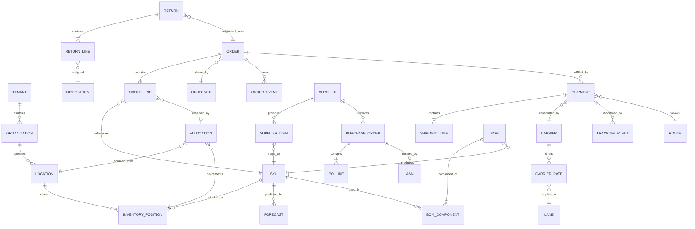
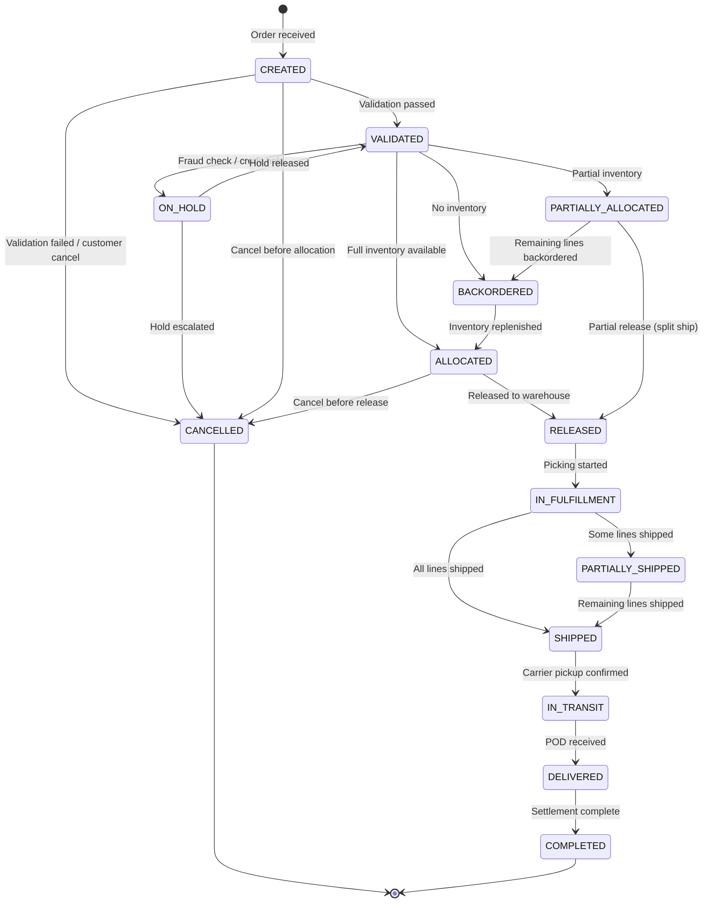
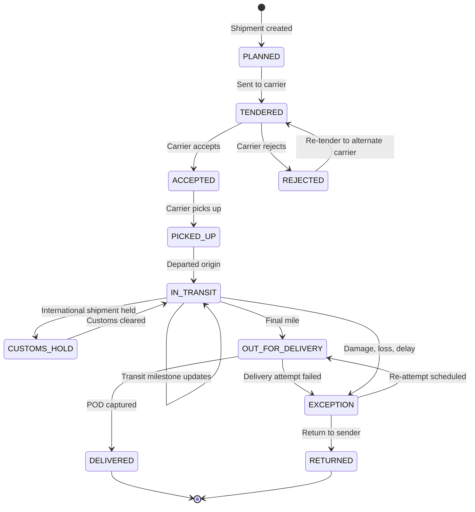

# Low-Level Design

## Data Model

### Entity Relationship Diagram



---

### Core Tables

#### Order

```
TABLE order:
    id                  UUID PRIMARY KEY
    tenant_id           UUID NOT NULL (partition key)
    order_number        VARCHAR(30) UNIQUE per tenant
    channel             ENUM(B2B_EDI, B2C_WEB, B2C_MOBILE, MARKETPLACE, PHONE, REPLENISHMENT)
    customer_id         UUID FOREIGN KEY -> customer
    status              ENUM(CREATED, VALIDATED, ALLOCATED, PARTIALLY_ALLOCATED,
                             RELEASED, IN_FULFILLMENT, PARTIALLY_SHIPPED,
                             SHIPPED, IN_TRANSIT, DELIVERED, COMPLETED,
                             CANCELLED, ON_HOLD, BACKORDERED)
    priority            ENUM(STANDARD, EXPEDITED, RUSH, NEXT_DAY)
    order_date          TIMESTAMP
    requested_ship_date DATE
    requested_delivery_date DATE
    ship_to_address_id  UUID FOREIGN KEY -> address
    bill_to_address_id  UUID FOREIGN KEY -> address
    total_amount        DECIMAL(18,4)
    currency            VARCHAR(3)
    source_location_id  UUID NULLABLE (assigned after routing)
    fulfillment_type    ENUM(SHIP_FROM_DC, SHIP_FROM_STORE, DROP_SHIP, CROSS_DOCK)
    created_at          TIMESTAMP
    updated_at          TIMESTAMP
    promised_delivery   TIMESTAMP

    INDEX: (tenant_id, status, created_at)
    INDEX: (tenant_id, customer_id, order_date)
    INDEX: (tenant_id, source_location_id, status)
    INDEX: (tenant_id, requested_delivery_date, status)
```

#### Order Line

```
TABLE order_line:
    id                  UUID PRIMARY KEY
    tenant_id           UUID NOT NULL
    order_id            UUID FOREIGN KEY -> order
    line_number         INTEGER
    sku_id              UUID FOREIGN KEY -> sku
    requested_qty       DECIMAL(12,4)
    allocated_qty       DECIMAL(12,4) DEFAULT 0
    shipped_qty         DECIMAL(12,4) DEFAULT 0
    delivered_qty       DECIMAL(12,4) DEFAULT 0
    cancelled_qty       DECIMAL(12,4) DEFAULT 0
    unit_price          DECIMAL(18,4)
    currency            VARCHAR(3)
    status              ENUM(OPEN, ALLOCATED, PARTIALLY_ALLOCATED,
                             SHIPPED, DELIVERED, CANCELLED, BACKORDERED)
    allocation_location_id UUID NULLABLE
    promised_date       DATE

    INDEX: (tenant_id, order_id, line_number)
    INDEX: (tenant_id, sku_id, status)
```

#### Inventory Position

```
TABLE inventory_position:
    id                  UUID PRIMARY KEY
    tenant_id           UUID NOT NULL
    sku_id              UUID FOREIGN KEY -> sku
    location_id         UUID FOREIGN KEY -> location
    on_hand_qty         DECIMAL(12,4)
    allocated_qty       DECIMAL(12,4)
    in_transit_qty      DECIMAL(12,4)
    on_order_qty        DECIMAL(12,4)
    available_qty       DECIMAL(12,4) GENERATED AS (on_hand - allocated)
    safety_stock_qty    DECIMAL(12,4)
    reorder_point       DECIMAL(12,4)
    lot_number          VARCHAR(50) NULLABLE
    expiry_date         DATE NULLABLE
    last_count_date     DATE
    updated_at          TIMESTAMP

    UNIQUE: (tenant_id, sku_id, location_id, lot_number)
    INDEX: (tenant_id, location_id, available_qty)
    INDEX: (tenant_id, sku_id, location_id)
```

#### Shipment

```
TABLE shipment:
    id                  UUID PRIMARY KEY
    tenant_id           UUID NOT NULL
    shipment_number     VARCHAR(30) UNIQUE per tenant
    order_id            UUID FOREIGN KEY -> order
    carrier_id          UUID FOREIGN KEY -> carrier
    service_level       ENUM(GROUND, EXPEDITED, NEXT_DAY, FREIGHT_LTL,
                             FREIGHT_FTL, OCEAN_FCL, OCEAN_LCL, AIR)
    status              ENUM(PLANNED, TENDERED, ACCEPTED, PICKED_UP,
                             IN_TRANSIT, OUT_FOR_DELIVERY, DELIVERED,
                             EXCEPTION, RETURNED)
    origin_location_id  UUID FOREIGN KEY -> location
    destination_address_id UUID FOREIGN KEY -> address
    ship_date           TIMESTAMP
    estimated_delivery  TIMESTAMP
    actual_delivery     TIMESTAMP NULLABLE
    tracking_number     VARCHAR(100)
    weight_kg           DECIMAL(10,3)
    volume_m3           DECIMAL(10,6)
    freight_cost        DECIMAL(18,4)
    currency            VARCHAR(3)
    pod_document_url    TEXT NULLABLE

    INDEX: (tenant_id, status, estimated_delivery)
    INDEX: (tenant_id, carrier_id, ship_date)
    INDEX: (tenant_id, tracking_number)
    INDEX: (tenant_id, order_id)
```

#### Tracking Event

```
TABLE tracking_event:
    id                  UUID PRIMARY KEY
    tenant_id           UUID NOT NULL
    shipment_id         UUID FOREIGN KEY -> shipment
    event_type          ENUM(PICKUP, DEPARTURE, ARRIVAL, CUSTOMS_HOLD,
                             CUSTOMS_CLEARED, OUT_FOR_DELIVERY, DELIVERED,
                             EXCEPTION, RETURN_INITIATED)
    timestamp           TIMESTAMP
    location_lat        DECIMAL(10,7) NULLABLE
    location_lon        DECIMAL(10,7) NULLABLE
    location_name       VARCHAR(200)
    carrier_status_code VARCHAR(20)
    carrier_description TEXT
    temperature_c       DECIMAL(5,2) NULLABLE
    humidity_pct        DECIMAL(5,2) NULLABLE
    source              ENUM(CARRIER_EDI, CARRIER_API, IOT_GPS, IOT_SENSOR,
                             MANUAL_SCAN, PORT_SYSTEM)

    INDEX: (tenant_id, shipment_id, timestamp DESC)
    INDEX: (tenant_id, event_type, timestamp DESC)
    PARTITION BY: RANGE(timestamp) -- monthly partitions
```

#### Demand Forecast

```
TABLE demand_forecast:
    id                  UUID PRIMARY KEY
    tenant_id           UUID NOT NULL
    sku_id              UUID FOREIGN KEY -> sku
    location_id         UUID FOREIGN KEY -> location
    forecast_date       DATE (start of forecast period)
    period_type         ENUM(DAILY, WEEKLY, MONTHLY)
    forecast_qty        DECIMAL(12,4)
    confidence_lower    DECIMAL(12,4) (10th percentile)
    confidence_upper    DECIMAL(12,4) (90th percentile)
    model_id            VARCHAR(100) (which model produced this)
    model_version       VARCHAR(20)
    forecast_cycle_id   UUID (groups forecasts from same run)
    planner_override_qty DECIMAL(12,4) NULLABLE
    actual_qty          DECIMAL(12,4) NULLABLE (filled after period ends)
    created_at          TIMESTAMP

    UNIQUE: (tenant_id, sku_id, location_id, forecast_date, period_type, forecast_cycle_id)
    INDEX: (tenant_id, forecast_cycle_id)
    INDEX: (tenant_id, sku_id, location_id, forecast_date)
```

#### Supplier and Purchase Order

```
TABLE supplier:
    id                  UUID PRIMARY KEY
    tenant_id           UUID NOT NULL
    supplier_code       VARCHAR(30) UNIQUE per tenant
    name                VARCHAR(200)
    status              ENUM(ACTIVE, INACTIVE, SUSPENDED, ONBOARDING)
    lead_time_days      INTEGER
    reliability_score   DECIMAL(5,2) (0-100)
    country_code        VARCHAR(2)
    edi_capable         BOOLEAN
    vmi_enabled         BOOLEAN
    created_at          TIMESTAMP

TABLE purchase_order:
    id                  UUID PRIMARY KEY
    tenant_id           UUID NOT NULL
    po_number           VARCHAR(30) UNIQUE per tenant
    supplier_id         UUID FOREIGN KEY -> supplier
    status              ENUM(DRAFT, SUBMITTED, ACKNOWLEDGED, PARTIALLY_RECEIVED,
                             RECEIVED, CLOSED, CANCELLED)
    destination_location_id UUID FOREIGN KEY -> location
    expected_delivery   DATE
    total_amount        DECIMAL(18,4)
    currency            VARCHAR(3)
    created_at          TIMESTAMP

TABLE po_line:
    id                  UUID PRIMARY KEY
    tenant_id           UUID NOT NULL
    purchase_order_id   UUID FOREIGN KEY -> purchase_order
    sku_id              UUID FOREIGN KEY -> sku
    ordered_qty         DECIMAL(12,4)
    received_qty        DECIMAL(12,4) DEFAULT 0
    unit_cost           DECIMAL(18,4)
    expected_date       DATE
```

---

## API Design

### Order Management APIs

```
# Create Order
POST /api/v1/orders
Request:
{
  channel: "B2C_WEB",
  customer_id: "uuid",
  ship_to_address: { street, city, state, postal, country },
  priority: "STANDARD",
  lines: [
    { sku_id: "uuid", quantity: 2, unit_price: 29.99 },
    { sku_id: "uuid", quantity: 1, unit_price: 49.99 }
  ],
  requested_delivery_date: "2026-03-15"
}
Response: 201 Created
{
  order_id: "uuid",
  order_number: "ORD-2026-000123",
  status: "CREATED",
  estimated_delivery: "2026-03-14",
  allocation_status: "PENDING"
}

# Get Order Status
GET /api/v1/orders/{order_id}
Response: 200 OK { ...full order with lines, allocation, shipments... }

# Cancel Order
POST /api/v1/orders/{order_id}/cancel
Request: { reason: "CUSTOMER_REQUEST", cancel_lines: ["line_id_1"] }
Response: 200 OK { order_id, status: "CANCELLED", released_inventory: [...] }

# Check Available-to-Promise
POST /api/v1/inventory/atp
Request: {
  items: [
    { sku_id: "uuid", quantity: 5, ship_to_postal: "94105" }
  ]
}
Response: 200 OK
{
  items: [
    {
      sku_id: "uuid",
      requested: 5,
      available: 5,
      sources: [
        { location_id: "uuid", available: 3, estimated_ship_days: 1 },
        { location_id: "uuid", available: 10, estimated_ship_days: 3 }
      ],
      promise_date: "2026-03-13"
    }
  ]
}
```

### Shipment Tracking APIs

```
# Get Shipment Tracking
GET /api/v1/shipments/{shipment_id}/tracking
Response: 200 OK
{
  shipment_id: "uuid",
  tracking_number: "1Z999AA10123456784",
  carrier: "UPS",
  status: "IN_TRANSIT",
  estimated_delivery: "2026-03-14T14:00:00Z",
  current_location: { lat: 37.7749, lon: -122.4194, name: "San Francisco Hub" },
  events: [
    { timestamp: "...", type: "PICKUP", location: "Los Angeles DC" },
    { timestamp: "...", type: "DEPARTURE", location: "Los Angeles DC" },
    { timestamp: "...", type: "ARRIVAL", location: "San Francisco Hub" }
  ],
  sensor_data: {
    temperature_c: 4.2,
    humidity_pct: 45,
    last_reading: "2026-03-12T10:30:00Z"
  }
}

# Bulk Tracking Update (carrier webhook)
POST /api/v1/tracking/events/bulk
Request: {
  carrier_id: "uuid",
  events: [
    { tracking_number: "...", status: "DELIVERED", timestamp: "...", location: {...}, pod_url: "..." },
    ...
  ]
}
Response: 202 Accepted { processed: 50, failed: 0 }
```

### Demand Forecasting APIs

```
# Get Forecast
GET /api/v1/forecasts?sku_id={id}&location_id={id}&horizon=12&period=WEEKLY
Response: 200 OK
{
  sku_id: "uuid",
  location_id: "uuid",
  model_used: "ensemble_v3",
  accuracy_mape: 18.5,
  forecasts: [
    { period_start: "2026-03-16", forecast_qty: 150, lower_bound: 120, upper_bound: 195 },
    { period_start: "2026-03-23", forecast_qty: 165, lower_bound: 130, upper_bound: 210 },
    ...
  ]
}

# Override Forecast (planner adjustment)
PUT /api/v1/forecasts/{forecast_id}/override
Request: { override_qty: 200, reason: "Upcoming promotion", expires_after_cycle: true }
Response: 200 OK { forecast_id, original_qty: 150, override_qty: 200, override_by: "user_id" }

# Trigger Forecast Refresh
POST /api/v1/forecasts/refresh
Request: { scope: "ALL" | { sku_ids: [...], location_ids: [...] }, model: "AUTO" | "ARIMA" | "PROPHET" | "DEEPAR" }
Response: 202 Accepted { job_id: "uuid", estimated_completion: "2026-03-12T06:00:00Z" }
```

### Transportation Management APIs

```
# Request Route Optimization
POST /api/v1/transport/optimize
Request: {
  shipments: [
    { origin_location_id: "uuid", destination_address: {...}, weight_kg: 50, volume_m3: 0.5, delivery_sla: "2026-03-15" },
    ...
  ],
  constraints: { max_stops: 5, max_driving_hours: 11, vehicle_type: "BOX_TRUCK" },
  objective: "MINIMIZE_COST" | "MINIMIZE_TIME" | "BALANCED"
}
Response: 200 OK
{
  solution_id: "uuid",
  routes: [
    {
      vehicle_id: "uuid",
      stops: [ { location: {...}, arrival_time: "...", departure_time: "...", shipments: [...] } ],
      total_distance_km: 450,
      total_cost: 1250.00,
      estimated_duration_hours: 8.5
    }
  ],
  unroutable_shipments: [],
  solve_time_ms: 2300
}

# Tender Shipment to Carrier
POST /api/v1/transport/tender
Request: {
  shipment_id: "uuid",
  carrier_id: "uuid",
  rate_quote_id: "uuid",
  pickup_window: { start: "...", end: "..." }
}
Response: 200 OK { tender_id: "uuid", status: "PENDING_ACCEPTANCE" }
```

---

## Core Algorithms

### Available-to-Promise (ATP) Calculation

```
FUNCTION compute_atp(tenant_id, sku_id, location_id, request_date):
    // ATP = On-Hand - Allocated - Safety Stock + Incoming Supply Before Date

    position = QUERY inventory_position
        WHERE tenant_id = tenant_id
        AND sku_id = sku_id
        AND location_id = location_id

    incoming = QUERY SUM(po_line.ordered_qty - po_line.received_qty)
        FROM po_line JOIN purchase_order
        WHERE purchase_order.destination_location_id = location_id
        AND po_line.sku_id = sku_id
        AND po_line.expected_date <= request_date
        AND purchase_order.status IN ('SUBMITTED', 'ACKNOWLEDGED')

    committed_future = QUERY SUM(order_line.allocated_qty - order_line.shipped_qty)
        FROM order_line JOIN order
        WHERE order_line.allocation_location_id = location_id
        AND order_line.sku_id = sku_id
        AND order.requested_ship_date <= request_date
        AND order_line.status = 'ALLOCATED'

    atp = position.on_hand_qty
          - position.allocated_qty
          - position.safety_stock_qty
          + incoming
          - committed_future

    RETURN MAX(0, atp)
```

### Intelligent Order Routing

```
FUNCTION route_order(tenant_id, order):
    candidate_locations = GET_FULFILLABLE_LOCATIONS(tenant_id, order)

    IF candidate_locations IS EMPTY:
        RETURN apply_backorder_policy(order)

    // Score each candidate location
    scored_candidates = []
    FOR EACH location IN candidate_locations:
        score = 0.0

        // Inventory availability (can fulfill all lines?)
        fill_rate = compute_fill_rate(location, order.lines)
        score += fill_rate * WEIGHT_FILL_RATE  // e.g., 0.4

        // Proximity to customer (shipping cost proxy)
        distance = haversine(location.coordinates, order.ship_to.coordinates)
        distance_score = 1.0 - NORMALIZE(distance, MAX_DISTANCE)
        score += distance_score * WEIGHT_PROXIMITY  // e.g., 0.25

        // Estimated shipping cost
        shipping_cost = estimate_shipping_cost(location, order.ship_to, order.weight)
        cost_score = 1.0 - NORMALIZE(shipping_cost, MAX_COST)
        score += cost_score * WEIGHT_COST  // e.g., 0.2

        // Current capacity / workload
        utilization = get_warehouse_utilization(location)
        capacity_score = 1.0 - utilization
        score += capacity_score * WEIGHT_CAPACITY  // e.g., 0.1

        // SLA achievability
        transit_days = estimate_transit_days(location, order.ship_to, carrier_service)
        can_meet_sla = (TODAY + processing_days + transit_days) <= order.requested_delivery_date
        score += (1.0 IF can_meet_sla ELSE 0.0) * WEIGHT_SLA  // e.g., 0.05

        scored_candidates.APPEND({ location, score, fill_rate, shipping_cost })

    // Sort by score descending
    scored_candidates.SORT_BY(score, DESC)

    best = scored_candidates[0]

    // Check if split shipment is better
    IF best.fill_rate < 1.0 AND order.allow_split:
        RETURN plan_split_shipment(order, scored_candidates)

    RETURN { source_location: best.location, routing_score: best.score }
```

### Demand Forecasting Model Selection

```
FUNCTION select_best_forecast_model(tenant_id, sku_id, location_id):
    // Fetch historical demand (24+ months)
    history = GET_DEMAND_HISTORY(tenant_id, sku_id, location_id, months=24)

    IF LENGTH(history) < 12:
        RETURN { model: "SIMPLE_MOVING_AVERAGE", reason: "insufficient history" }

    // Classify demand pattern
    pattern = classify_demand_pattern(history)
    // Returns: SMOOTH, SEASONAL, TRENDING, INTERMITTENT, LUMPY, NEW_PRODUCT

    // Select candidate models based on pattern
    candidates = []
    SWITCH pattern:
        CASE SMOOTH:
            candidates = ["HOLT_WINTERS", "ARIMA", "LIGHTGBM"]
        CASE SEASONAL:
            candidates = ["SEASONAL_ARIMA", "PROPHET", "DEEPAR"]
        CASE TRENDING:
            candidates = ["HOLT_LINEAR", "PROPHET", "LIGHTGBM"]
        CASE INTERMITTENT:
            candidates = ["CROSTON", "SBA", "DEEPAR"]  // Croston for sparse demand
        CASE LUMPY:
            candidates = ["CROSTON_TSB", "DEEPAR", "BOOTSTRAP"]
        CASE NEW_PRODUCT:
            candidates = ["ANALOGOUS_ITEM", "LIFECYCLE_MODEL", "MANUAL"]

    // Backtest each candidate (rolling-origin cross-validation)
    best_model = NULL
    best_accuracy = INFINITY

    FOR EACH model_type IN candidates:
        errors = []
        FOR window IN rolling_windows(history, train_pct=0.8, step=1_week):
            model = TRAIN(model_type, window.train_data)
            predictions = model.PREDICT(window.test_period)
            error = compute_mape(predictions, window.test_data)
            errors.APPEND(error)

        avg_error = MEAN(errors)
        IF avg_error < best_accuracy:
            best_accuracy = avg_error
            best_model = model_type

    RETURN {
        model: best_model,
        accuracy_mape: best_accuracy,
        demand_pattern: pattern,
        history_months: LENGTH(history)
    }
```

### Route Optimization (Vehicle Routing Problem)

```
FUNCTION optimize_routes(shipments, vehicles, constraints):
    // Solve Capacitated Vehicle Routing Problem with Time Windows (CVRPTW)
    // Using a two-phase approach: construction heuristic + local search improvement

    // Phase 1: Construction (Nearest-Neighbor with Time Windows)
    unassigned = COPY(shipments)
    routes = []

    WHILE unassigned IS NOT EMPTY:
        vehicle = GET_AVAILABLE_VEHICLE(vehicles)
        route = new Route(vehicle, origin=vehicle.depot)

        WHILE TRUE:
            best_next = NULL
            best_cost = INFINITY

            FOR EACH shipment IN unassigned:
                IF NOT route.can_accommodate(shipment, constraints):
                    CONTINUE  // weight, volume, or time window violation

                insertion_cost = route.compute_insertion_cost(shipment)
                IF insertion_cost < best_cost:
                    best_cost = insertion_cost
                    best_next = shipment

            IF best_next IS NULL:
                BREAK  // no more feasible insertions for this route

            route.ADD_STOP(best_next)
            unassigned.REMOVE(best_next)

        routes.APPEND(route)

    // Phase 2: Local Search Improvement
    improved = TRUE
    WHILE improved:
        improved = FALSE

        // 2-opt within routes (reverse segment)
        FOR EACH route IN routes:
            IF route.try_2opt_improvement():
                improved = TRUE

        // Cross-route exchange (move stop between routes)
        FOR EACH (route_a, route_b) IN PAIRS(routes):
            IF try_cross_route_exchange(route_a, route_b, constraints):
                improved = TRUE

    RETURN {
        routes: routes,
        total_cost: SUM(r.cost FOR r IN routes),
        total_distance: SUM(r.distance FOR r IN routes),
        utilization: AVG(r.weight_utilized_pct FOR r IN routes)
    }
```

### Safety Stock Optimization

```
FUNCTION compute_safety_stock(tenant_id, sku_id, location_id, target_service_level):
    // Safety Stock = Z × sqrt(LT × σ_d² + d² × σ_LT²)
    // where Z = service level z-score, LT = lead time, σ_d = demand std dev,
    //       d = avg demand, σ_LT = lead time std dev

    demand_history = GET_DEMAND_HISTORY(tenant_id, sku_id, location_id, periods=52)
    lead_time_history = GET_LEAD_TIME_HISTORY(tenant_id, sku_id, location_id, orders=50)

    avg_demand = MEAN(demand_history)  // per period
    std_demand = STDDEV(demand_history)
    avg_lead_time = MEAN(lead_time_history)  // in periods
    std_lead_time = STDDEV(lead_time_history)

    z_score = INVERSE_NORMAL_CDF(target_service_level)
    // e.g., 95% service level → z = 1.645; 99% → z = 2.326

    safety_stock = z_score * SQRT(
        avg_lead_time * std_demand^2 +
        avg_demand^2 * std_lead_time^2
    )

    // Apply minimum and maximum bounds
    safety_stock = MAX(safety_stock, MIN_SAFETY_STOCK_DAYS * avg_demand)
    safety_stock = MIN(safety_stock, MAX_SAFETY_STOCK_DAYS * avg_demand)

    reorder_point = (avg_demand * avg_lead_time) + safety_stock

    RETURN {
        safety_stock: ROUND_UP(safety_stock),
        reorder_point: ROUND_UP(reorder_point),
        service_level: target_service_level,
        demand_variability_cv: std_demand / avg_demand,
        lead_time_variability_cv: std_lead_time / avg_lead_time
    }
```

---

## State Machines

### Order Lifecycle State Machine



### Shipment Lifecycle State Machine



---

## Indexing and Partitioning Strategy

| Table | Partitioning | Rationale |
|-------|-------------|-----------|
| `order` | Range by `created_at` (monthly) | Orders are primarily queried by date range; old orders archived |
| `order_line` | Inherited from `order` partition | Co-located with parent order for join efficiency |
| `tracking_event` | Range by `timestamp` (monthly) | Time-series data; old events moved to cold storage |
| `inventory_position` | Hash by `tenant_id` | Even distribution across shards; frequently updated |
| `demand_forecast` | Range by `forecast_date` (monthly) | Forecast queries are time-bounded; old forecasts archived for accuracy analysis |
| `shipment` | Range by `ship_date` (monthly) | Shipment queries are date-oriented |
| `iot_sensor_reading` | Range by `timestamp` (daily) + hash by `device_id` | Very high volume; aggressive TTL-based expiry (90 days for raw, aggregated kept longer) |

### Read Replica Configuration

| Replica Set | Purpose | Staleness Tolerance |
|------------|---------|-------------------|
| **Transactional replicas** | Order status queries, inventory lookups | < 1 second |
| **Analytics replicas** | Dashboard queries, KPI computation | < 5 minutes |
| **Reporting replicas** | Scheduled reports, data exports | < 1 hour |
| **ML training replicas** | Demand history for model training | < 24 hours |
