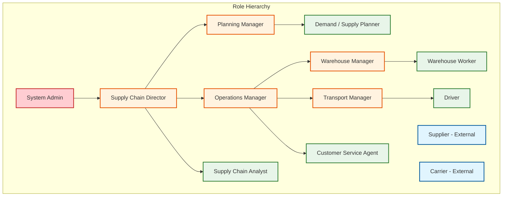
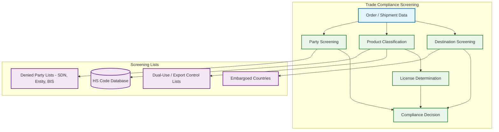

# Security & Compliance

## Authentication & Authorization

### Authentication Architecture

| Mechanism | Use Case | Details |
|-----------|----------|---------|
| **SAML 2.0 / OIDC SSO** | Enterprise users (planners, analysts, managers) | Primary authentication via customer's IdP; platform acts as SP/RP |
| **OAuth 2.0 Client Credentials** | Service-to-service communication | Internal microservice auth; short-lived tokens from central auth service |
| **API Key + HMAC** | EDI/B2B integration (carrier, supplier systems) | API key identifies the partner; HMAC signature ensures message integrity |
| **mTLS (Mutual TLS)** | IoT device authentication | Each device has a certificate; gateway validates before accepting sensor data |
| **Token-Based (JWT)** | Mobile app (warehouse workers, drivers) | Short-lived access tokens with refresh; offline-capable with cached permissions |
| **Multi-Factor Authentication** | High-privilege actions (inventory adjustment > threshold, carrier rate override, system configuration) | Step-up auth for sensitive operations; TOTP or push notification |

### Authorization Model: Attribute-Based Access Control (ABAC)

Supply chain authorization requires decisions based on user role, geographic region, warehouse assignment, supplier relationship, and data sensitivity level---not just simple role membership.

```
AUTHORIZATION POLICIES:

POLICY manage_inventory:
    SUBJECT.role IN ("warehouse_manager", "inventory_planner")
    AND RESOURCE.location_id IN SUBJECT.assigned_locations
    AND RESOURCE.tenant_id == SUBJECT.tenant_id
    AND ACTION IN ("VIEW", "ADJUST", "COUNT")
    EFFECT: ALLOW + AUDIT_LOG(level: HIGH for ADJUST)

POLICY view_supplier_forecast:
    SUBJECT.role IN ("supplier_user")
    AND SUBJECT.supplier_id == RESOURCE.supplier_id
    AND RESOURCE.data_type == "FORECAST"
    AND RESOURCE.share_level >= "SUPPLIER_VISIBLE"
    AND RESOURCE.tenant_id == SUBJECT.partner_tenant_id
    EFFECT: ALLOW (limited to their SKUs only)

POLICY modify_carrier_rates:
    SUBJECT.role IN ("transport_manager", "procurement_admin")
    AND RESOURCE.tenant_id == SUBJECT.tenant_id
    AND SUBJECT.mfa_verified == TRUE
    EFFECT: ALLOW + AUDIT_LOG(level: CRITICAL)

POLICY access_control_tower:
    SUBJECT.role IN ("supply_chain_analyst", "operations_manager", "exec")
    AND RESOURCE.region IN SUBJECT.authorized_regions
    AND RESOURCE.tenant_id == SUBJECT.tenant_id
    EFFECT: ALLOW (data filtered by authorized scope)

POLICY execute_order_override:
    SUBJECT.role IN ("operations_manager", "customer_service_lead")
    AND RESOURCE.tenant_id == SUBJECT.tenant_id
    AND RESOURCE.order_value <= SUBJECT.override_limit
    EFFECT: ALLOW + AUDIT_LOG(level: HIGH) + REQUIRE_REASON
```

### Role Hierarchy



---

## Data Security

### Data Classification

| Classification | Examples | Encryption | Access | Retention |
|---------------|----------|-----------|--------|-----------|
| **Confidential** | Carrier contract rates, supplier pricing, demand forecasts, negotiated terms | AES-256 at rest; TLS 1.3 in transit | Named individuals with business need; MFA required | Per contract terms |
| **Sensitive** | Customer addresses, supplier bank details, employee data | AES-256 at rest; TLS 1.3 in transit | Role-based; PII masked in non-production | Per regulatory requirement (GDPR, CCPA) |
| **Internal** | Order data, inventory positions, shipment tracking, production plans | AES-256 at rest; TLS 1.3 in transit | Tenant-scoped; role-filtered | 7 years (financial records) |
| **Partner-shared** | Shared forecasts, VMI inventory levels, ASN data, scorecards | AES-256 at rest; TLS 1.3 in transit; signed payloads | Partner-specific data views; no cross-partner visibility | Per partnership agreement |
| **Public** | Product catalog (non-pricing), general company info | TLS in transit | Unrestricted | Indefinite |

### EDI and B2B Communication Security

```mermaid
flowchart LR
    subgraph Partner["Trading Partner"]
        PARTNER_SYS[Partner System]
        PARTNER_CERT[Partner Certificate]
    end

    subgraph Security["Security Layer"]
        AS2[AS2 Gateway]
        SIGN[Digital Signature - Verify]
        ENCRYPT[Decryption - Partner's Key]
        VALIDATE[Schema Validation]
        DEDUP[Deduplication Check]
    end

    subgraph Platform["SCM Platform"]
        EDI_TRANS[EDI Translator]
        PROCESS[Business Processing]
        AUDIT_LOG[Audit Log]
    end

    PARTNER_SYS -->|"Signed + Encrypted EDI"| AS2
    PARTNER_CERT --> SIGN
    AS2 --> SIGN
    SIGN --> ENCRYPT
    ENCRYPT --> VALIDATE
    VALIDATE --> DEDUP
    DEDUP --> EDI_TRANS
    EDI_TRANS --> PROCESS
    AS2 --> AUDIT_LOG
    PROCESS --> AUDIT_LOG

    classDef partner fill:#e1f5fe,stroke:#01579b,stroke-width:2px
    classDef security fill:#fffde7,stroke:#f57f17,stroke-width:2px
    classDef platform fill:#e8f5e9,stroke:#2e7d32,stroke-width:2px

    class PARTNER_SYS,PARTNER_CERT partner
    class AS2,SIGN,ENCRYPT,VALIDATE,DEDUP security
    class EDI_TRANS,PROCESS,AUDIT_LOG platform
```



**EDI security controls**:
- **AS2 protocol**: Industry-standard for B2B document exchange with non-repudiation (MDN receipts)
- **Digital signatures**: Every EDI document is signed by the sender; signature verified before processing
- **Encryption**: Documents encrypted with recipient's public key; decrypted only at processing time
- **Non-repudiation**: Message Disposition Notifications (MDN) provide proof of receipt
- **Deduplication**: Control numbers (ISA/GS) tracked to prevent duplicate processing
- **Schema validation**: Every document validated against X12/EDIFACT schema before business processing

### IoT Security

| Layer | Threat | Mitigation |
|-------|--------|------------|
| **Device** | Compromised sensor sending false data | Device certificates with hardware-bound keys; attestation |
| **Transport** | Man-in-the-middle on sensor data | mTLS for all device-to-gateway communication |
| **Gateway** | DDoS on IoT ingestion endpoint | Rate limiting per device; anomaly detection on message volume |
| **Data** | Injection of false tracking data | Cross-validation: IoT GPS must correlate with carrier-reported position within tolerance |
| **Firmware** | Supply chain attack on device firmware | Signed firmware updates; secure boot chain; remote attestation |

---

## Trade Compliance

### Export Control and Sanctions Screening



**Screening workflow**:

1. **Denied party screening**: Every customer, consignee, end-user, and freight forwarder is screened against government denied party lists (OFAC SDN, BIS Entity List, EU Consolidated List, UN Sanctions). Fuzzy name matching (Jaro-Winkler similarity > 0.85) flags potential matches for human review.

2. **Product classification**: Each SKU is classified with HS (Harmonized System) codes for customs declaration. Dual-use items (technology with both civilian and military applications) require export license determination based on ECCN (Export Control Classification Number).

3. **Destination screening**: Shipment destinations are checked against embargoed countries and regions. Comprehensive sanctions apply to fully embargoed countries; sectoral sanctions restrict specific industries.

4. **License determination**: For controlled items, the system determines whether an export license is required based on the combination of product classification, destination country, end-use, and end-user.

5. **Compliance hold**: Orders flagged by screening are placed on compliance hold until a licensed trade compliance officer reviews and releases or rejects.

### Food Safety and Traceability

For food and pharmaceutical supply chains:

| Requirement | Regulation | Implementation |
|-------------|-----------|----------------|
| **One-up/one-down traceability** | FDA FSMA Rule 204 | Track from whom received and to whom shipped for every lot; queryable within 24 hours |
| **Lot-level tracking** | FDA FSMA, EU Reg 178/2002 | Every movement records lot number, quantity, timestamp, location |
| **Temperature monitoring** | FDA FSMA, GDP | Continuous IoT temperature logging; automated excursion alerts |
| **Recall management** | FDA FSMA | Identify all downstream recipients of a lot within 2 hours; automated recall notifications |
| **Product serialization** | DSCSA (pharma) | Unique serial numbers per saleable unit; verify at each transfer |

### Customs Compliance

| Document | Purpose | Automation Level |
|----------|---------|-----------------|
| **Commercial Invoice** | Declare goods value for duties | Auto-generated from order/shipment data |
| **Packing List** | Detail contents of each package | Auto-generated from WMS pack data |
| **Bill of Lading** | Contract of carriage | Auto-generated from TMS booking |
| **Certificate of Origin** | Determine tariff eligibility (FTA) | Semi-automated: rules engine identifies FTA eligibility; human reviews |
| **Customs Declaration** | Formal import entry | Auto-filed via customs broker API; HS codes from product master |
| **Dangerous Goods Declaration** | Hazmat classification | Auto-generated from hazmat attributes on SKU master |

---

## Sustainability and ESG Compliance

### Carbon Footprint Tracking

```
FUNCTION compute_shipment_carbon_footprint(shipment):
    // Calculate CO2 emissions for a shipment

    SWITCH shipment.transport_mode:
        CASE "ROAD_FTL":
            emission_factor = 62  // gCO2/tonne-km (average truck)
        CASE "ROAD_LTL":
            emission_factor = 80  // higher per-unit due to partial loads
        CASE "OCEAN_FCL":
            emission_factor = 8   // gCO2/tonne-km
        CASE "AIR_FREIGHT":
            emission_factor = 602 // gCO2/tonne-km
        CASE "RAIL":
            emission_factor = 22  // gCO2/tonne-km

    distance_km = compute_route_distance(shipment.origin, shipment.destination)
    weight_tonnes = shipment.weight_kg / 1000

    co2_grams = emission_factor * weight_tonnes * distance_km
    co2_kg = co2_grams / 1000

    RETURN {
        co2_kg: co2_kg,
        scope: 3,  // Scope 3: upstream/downstream transportation
        mode: shipment.transport_mode,
        distance_km: distance_km,
        methodology: "GLEC_FRAMEWORK_v3"
    }
```

| ESG Metric | Source | Reporting Frequency |
|------------|--------|-------------------|
| **Scope 3 transport emissions** | Shipment tracking + emission factors (GLEC framework) | Monthly |
| **Packaging waste** | WMS packing data + material classification | Quarterly |
| **Supplier ESG scores** | Third-party ESG rating agencies + self-assessment | Annual |
| **Ethical sourcing compliance** | Supplier audits + certification tracking | Annual |
| **Deforestation-free sourcing** | Supply chain traceability + geospatial analysis | Annual (EU EUDR) |

---

## Threat Model

### Supply Chain-Specific Threats

| Threat | Attack Vector | Impact | Mitigation |
|--------|-------------|--------|------------|
| **Counterfeit goods injection** | Compromised supplier ships fake products | Product quality failure, brand damage, safety risk | Serialization + authentication; supplier audits; receiving inspection |
| **EDI message tampering** | MITM attack on B2B communications | Altered PO quantities, fraudulent invoices | AS2 with digital signatures; message integrity hashing |
| **IoT sensor spoofing** | Fake GPS/temperature data to hide diversion or damage | Stolen goods reported as delivered; spoiled goods pass inspection | Device attestation; cross-validation with carrier data; anomaly detection |
| **Insider freight fraud** | Employee colludes with carrier on inflated rates | Financial loss through overpayment | Separation of duties (rate negotiation ≠ payment approval); freight audit |
| **Demand signal manipulation** | Competitor manipulates POS or web signals | Incorrect forecasts leading to stockouts or overstock | Signal validation against historical patterns; anomaly flagging |
| **Supply chain data exfiltration** | Breach exposes carrier rates, supplier pricing, demand forecasts | Competitive disadvantage | Data classification; encryption at rest; DLP monitoring; access logging |
| **Customs fraud** | Under-declaration of goods value or misclassification | Regulatory penalties, criminal liability | Automated HS code validation; value cross-check against PO |

### Security Controls Summary

| Control Category | Controls Implemented |
|-----------------|---------------------|
| **Network** | VPC isolation per tenant tier; private endpoints for DB access; WAF on API gateway; DDoS protection on IoT endpoints |
| **Identity** | SSO/OIDC for users; mTLS for devices; API keys for B2B; MFA for privileged operations |
| **Data** | AES-256 encryption at rest; TLS 1.3 in transit; field-level encryption for PII; tokenization for sensitive supplier data |
| **Application** | Input validation on all EDI messages; parameterized queries; rate limiting; CORS restrictions |
| **Monitoring** | Centralized SIEM; real-time alerting on anomalous access patterns; EDI transaction monitoring; IoT device behavior analytics |
| **Compliance** | Automated screening against sanctions lists (updated daily); HS code validation; FSMA traceability audit; GDPR data subject rights automation |
| **Audit** | Immutable audit log for all state transitions; tamper-proof audit trail using append-only storage with hash chains; 7-year retention |
