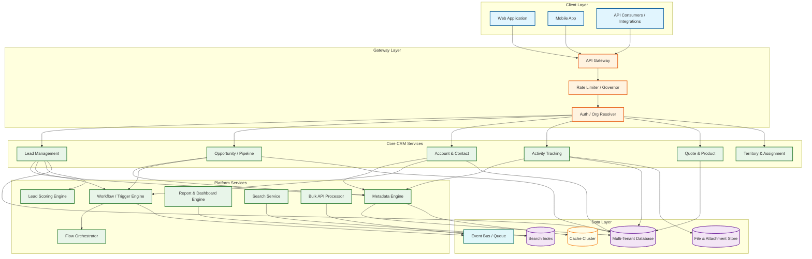
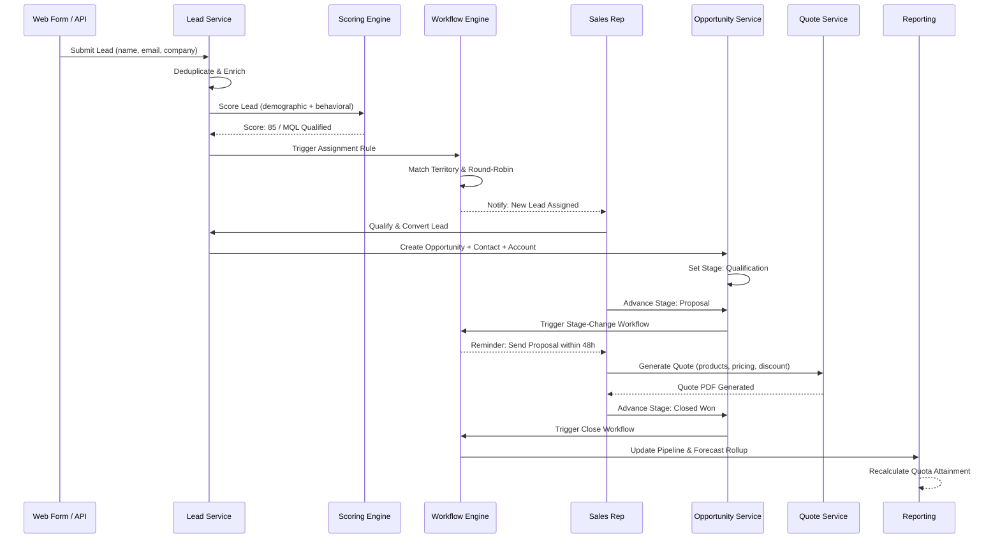

# CRM System Design

## System Overview

A Customer Relationship Management (CRM) system---exemplified by platforms such as Salesforce, Zoho CRM, and HubSpot---is a multi-tenant platform that serves as the operational backbone for sales, marketing, and customer success teams. Unlike single-purpose tools (email campaign software, helpdesk ticketing, or standalone contact databases), a CRM system unifies the entire customer lifecycle---from initial lead capture through opportunity tracking, deal closure, post-sale account management, and renewal---into a single data model where every interaction, activity, and data point is connected to a 360-degree customer record. The core engineering challenges are deep and multifaceted:

1. **Metadata-Driven Custom Object Engine** --- The platform must allow each tenant to define entirely new entity types (custom objects), custom fields on both standard and custom objects, custom relationships, formula fields, validation rules, and rollup summaries---all without DDL operations on the underlying database. This metadata-driven approach means the schema is virtual: the physical database stores data in generic tables, while the tenant-specific schema exists as metadata that the runtime interprets on every query, render, and validation. The custom object engine is the architectural foundation, not a bolt-on feature.

2. **Lead Scoring and Sales Pipeline Optimization** --- Leads flow through qualification stages (MQL, SQL, SAL) with scoring models that combine demographic fit (company size, industry, job title), behavioral signals (page visits, email opens, content downloads), and firmographic enrichment. The scoring engine must process millions of events per day, update scores in near-real-time, and feed predictive models that forecast conversion probability---all while allowing tenants to customize scoring rules without ML expertise.

3. **Multi-Tenant Data Isolation with Shared Infrastructure** --- Thousands of tenants share database instances, compute clusters, and cache layers. Each tenant's data must be completely invisible to every other tenant, enforced not just at the database row level but at every layer: cache keys, search indexes, file storage, event queues, and API responses. Governor limits prevent any single tenant from monopolizing shared resources.

4. **Workflow Automation and Trigger Execution** --- Tenants define automation rules (triggers, workflow rules, process builders, flows) that fire on data events (record creation, field updates, stage transitions). These automations can cascade: a trigger on Opportunity update fires a workflow that updates Account, which fires another trigger. The engine must detect infinite loops, enforce execution depth limits, and maintain transaction atomicity across cascading automations.

5. **Cross-Object Query Engine (SOQL/Report Builder)** --- Users build reports and dashboards that join data across standard objects, custom objects, and their relationships. The query engine must translate these logical queries against the virtual schema into efficient physical queries against the generic storage tables---a query compilation problem analogous to building a SQL optimizer on top of an EAV-like storage layer.

6. **API Platform at Scale** --- The CRM exposes REST, GraphQL, Bulk, and Streaming APIs that external systems use for integration. The API layer must enforce per-tenant rate limits, support bulk operations (inserting 50K records in a single API call), provide change data capture for downstream systems, and maintain backward compatibility across API versions while the platform evolves.

7. **Activity and Email Tracking** --- Every email sent, call logged, meeting held, and task completed is associated with contact and opportunity records, creating a comprehensive activity timeline. Email integration requires parsing inbound emails, matching them to CRM records via email address resolution, and tracking open/click events---all at scale across millions of tenant users.

---

## Key Characteristics

| Characteristic | Description |
|---------------|-------------|
| **Read/Write Pattern** | Mixed---write-heavy for lead ingestion, activity logging, and field updates; read-heavy for pipeline views, dashboards, reports, and search |
| **Latency Sensitivity** | High---sales reps expect < 300ms page loads for record detail views; < 500ms for list views and pipeline boards; reports tolerate 2-5s; bulk API operations tolerate minutes |
| **Consistency Model** | Strong consistency for record updates and pipeline stage transitions (sales reps must see the latest data); eventual consistency for search indexes, analytics rollups, and dashboard aggregations |
| **Data Volume** | High---large tenants store tens of millions of records across standard and custom objects; aggregate across 50K tenants reaches petabyte scale with attachments and activity history |
| **Architecture Model** | Metadata-driven multi-tenant platform with shared physical schema; CQRS for reporting paths; event-driven automation engine; API-first design |
| **Regulatory Burden** | Moderate-to-High---GDPR consent management and right-to-erasure, CCPA data subject requests, SOC 2 audit compliance, HIPAA for healthcare CRM, data residency requirements |
| **Complexity Rating** | **Very High** |

---

## Quick Navigation

| Document | Description |
|----------|-------------|
| [01 - Requirements & Estimations](./01-requirements-and-estimations.md) | Functional/non-functional requirements, capacity planning, SLOs |
| [02 - High-Level Design](./02-high-level-design.md) | Architecture diagrams, data flow, key decisions |
| [03 - Low-Level Design](./03-low-level-design.md) | Data models, API design, algorithms (pseudocode) |
| [04 - Deep Dive & Bottlenecks](./04-deep-dive-and-bottlenecks.md) | Custom object engine, lead scoring, workflow triggers, query optimization |
| [05 - Scalability & Reliability](./05-scalability-and-reliability.md) | Multi-tenant scaling, governor limits, API rate limiting, data archival |
| [06 - Security & Compliance](./06-security-and-compliance.md) | Field-level security, sharing rules, org-wide defaults, GDPR consent |
| [07 - Observability](./07-observability.md) | CRM usage metrics, API call tracking, workflow monitoring, alerting |
| [08 - Interview Guide](./08-interview-guide.md) | 45-min pacing, trap questions, trade-offs, scoring rubric |
| [09 - Insights](./09-insights.md) | Key architectural insights, patterns, lessons |

---

## What Differentiates This from Related Systems

| Aspect | CRM (This) | ERP System | Marketing Automation | Helpdesk/Ticketing | Data Warehouse | Custom In-House |
|--------|-----------|------------|---------------------|-------------------|----------------|----------------|
| **Scope** | Full customer lifecycle: leads, contacts, accounts, opportunities, activities, quotes, and custom objects with arbitrary tenant-defined schemas | All business functions (finance, HR, supply chain, manufacturing) in a unified transactional backbone | Marketing funnel only: campaigns, email sequences, landing pages, form captures, nurture workflows | Post-sale support: tickets, SLA tracking, knowledge base, agent assignment | Historical analytics: data ingestion, transformation, warehousing, BI reporting | Purpose-built for one company's specific sales workflow |
| **Data Model** | Flexible metadata-driven schema where tenants create custom objects and relationships; relational graph of accounts, contacts, opportunities, and activities | Fixed-but-extensible module schemas with cross-module referential integrity | Campaign-centric: contacts exist as audience members with engagement scores | Ticket-centric: customers exist as requesters with case histories | Star/snowflake schema optimized for analytical queries; no transactional operations | Hardcoded schema requiring developer changes for new entities |
| **Multi-Tenancy** | Deep multi-tenancy with tenant-specific virtual schemas, governor limits, and shared physical database infrastructure | Multi-tenant with per-tenant customization but typically less schema flexibility than CRM | SaaS multi-tenant but limited to marketing domain objects | Multi-tenant within support domain; simpler object model | Typically single-tenant or workspace-isolated; optimized for query throughput over tenant density | Single-tenant by definition |
| **Automation** | Record-triggered workflows, approval processes, formula fields, rollup summaries, and flow orchestration across all objects | Cross-module workflows (order-to-cash, procure-to-pay) with approval hierarchies | Journey-based automation: if-then email sequences, lead scoring rules, list segmentation | Ticket routing rules, SLA escalation, macro responses, simple if-then automations | ETL/ELT pipelines and scheduled transformations; no record-level triggers | Custom code for every automation; no declarative workflow builder |
| **API Surface** | Comprehensive: REST, GraphQL, Bulk, Streaming, Metadata API for schema introspection and modification | Module-specific APIs; integration middleware (iPaaS) for cross-module orchestration | Campaign and contact APIs; webhook-based event notifications | Ticket CRUD APIs; webhook notifications for status changes | SQL/query APIs for data access; limited write-back capability | Custom API per use case; no standardized platform API |
| **Query Complexity** | Cross-object queries over virtual schema with formula fields, rollups, and tenant-specific field filters | Cross-module reporting with financial integrity constraints | Segment queries against contact attributes and engagement history | Ticket filtering by status, priority, SLA, and custom fields | Complex analytical queries with joins, aggregations, window functions | Custom queries per reporting need |

---

## What Makes This System Unique

1. **The Virtual Schema Problem---Physical Tables, Logical Entities**: Unlike traditional databases where each entity has a dedicated table, a CRM platform stores all tenant data for all custom objects in shared generic tables. The "Accounts" table, the "Opportunities" table, and a tenant's custom "Projects" object all live in the same physical table, distinguished only by metadata. Every query must first consult the metadata catalog to understand what "columns" exist for a given object in a given tenant, then translate the logical query into a physical query against generic columns. This is a database-within-a-database problem where the CRM runtime acts as a query planner for a virtual relational schema.

2. **Governor Limits as a First-Class Architectural Concept**: Unlike most SaaS systems that enforce rate limits at the API gateway, CRM platforms enforce resource limits at every execution layer: maximum SOQL queries per transaction (100), maximum records retrieved per query (50,000), maximum DML statements per transaction (150), maximum CPU time per transaction (10 seconds), maximum heap size (6 MB synchronous / 12 MB asynchronous). These governor limits are not afterthought safeguards---they are load-bearing architectural constraints that shape how every feature is designed and how every tenant's code executes.

3. **Cascading Automation with Transaction Boundaries**: A single record save can trigger a validation rule, then a before-trigger, then the DML operation, then an after-trigger, then a workflow rule, then a process builder flow, then a roll-up summary recalculation on the parent---and any of these can modify other records that trigger their own cascade. The execution engine must maintain a single transaction boundary across this entire cascade, enforce order-of-execution guarantees, detect infinite recursion, and roll back atomically if any step fails.

4. **Relationship Graph as Business Intelligence**: CRM data is inherently a graph: Accounts have Contacts, Contacts have Opportunities, Opportunities have Products, Activities span multiple objects, and custom lookup relationships create arbitrary edges. The platform must efficiently traverse this graph for rollup summaries, related-list rendering, report generation, and territory/ownership propagation---making graph query optimization a core platform capability even though the underlying storage is relational.

5. **AppExchange/Marketplace as Platform Leverage**: The CRM platform's value multiplies through its extension marketplace where ISVs build packaged applications (industry solutions, integrations, analytics add-ons) that install into tenant orgs. The platform must support managed packages with namespace isolation, upgrade-safe customizations, license enforcement, and dependency resolution---effectively building a package manager for a multi-tenant runtime environment.

---

## Quick Reference: Scale Numbers

| Metric | Value | Notes |
|--------|-------|-------|
| Total tenants (orgs) | ~150,000 | Mix of SMB (< 20 users) to enterprise (> 5,000 users) |
| Average users per tenant | ~50 | Median ~15; mean skewed by large enterprises |
| Total registered users | ~7,500,000 | Across all tenants |
| Peak concurrent users | ~750,000 | ~10% of total during business hours overlap |
| Records per tenant (avg) | ~5,000,000 | Contacts, accounts, opportunities, activities, custom objects |
| Aggregate records | ~750 billion | Across all tenants including activity and history records |
| Custom objects per tenant (avg) | ~25 | Ranges from 0 for basic CRM to 200+ for enterprise platform usage |
| Custom fields per tenant (avg) | ~150 | Across all standard and custom objects |
| API calls per day | ~2,000,000,000 | REST + Bulk + Streaming + internal platform calls |
| Lead ingestion per day | ~50,000,000 | Web forms, imports, API integrations, marketing platform syncs |
| Workflow executions per day | ~500,000,000 | Triggers, flows, process builders, approval processes |
| Email activities tracked per day | ~200,000,000 | Sent, received, opens, clicks across all tenants |
| Report executions per day | ~10,000,000 | Ad-hoc, scheduled, and dashboard-embedded reports |
| Search queries per day | ~100,000,000 | Global search, lookup search, list view filters |
| Data volume per tenant (avg) | ~50 GB | Records + attachments + files + activity history |
| Aggregate data volume | ~7.5 PB | Across all tenants with indexes and replication |

---

## Architecture Overview (Conceptual)

---

## Key Trade-Offs in CRM System Design

| Trade-Off | Option A | Option B | This System's Choice |
|-----------|----------|----------|---------------------|
| **Custom Object Storage** | Dedicated table per custom object (strong query performance, DDL required per change, migration complexity) | Shared generic tables with metadata-driven virtual schema (no DDL, flexible, query translation overhead) | Shared generic tables with typed extension columns for frequently-queried fields; metadata catalog cached aggressively; query compiler translates virtual queries to physical queries |
| **Lead Scoring Model** | Rule-based scoring with tenant-defined point assignments (transparent, predictable, manual maintenance) | ML-based predictive scoring with automatic feature extraction (accurate, opaque, requires training data) | Hybrid: rule-based scoring as foundation with optional ML overlay; tenants configure rules, platform trains models on conversion history; ML scores augment but do not replace explicit rules |
| **Workflow Execution** | Synchronous execution within the save transaction (immediate consistency, latency cost, governor limit pressure) | Asynchronous execution after commit (lower latency for save, eventual consistency, complex error handling) | Mixed: before-triggers and validation rules execute synchronously (must complete before save); after-triggers and workflow actions execute asynchronously (queued after commit) with retry and dead-letter handling |
| **Multi-Tenancy Isolation** | Database-per-tenant (strongest isolation, highest cost, simplest compliance) | Shared database with org_id discriminator on every table (cost-efficient, complex isolation, governor limits required) | Shared database with org_id partitioning for cost efficiency; governor limits enforce per-transaction resource caps; dedicated database option for enterprise tenants with regulatory requirements |
| **Search Architecture** | Real-time index updates (fresh results, write amplification, index contention) | Near-real-time with async indexing (slight staleness, better write throughput, simpler contention management) | Near-real-time async indexing with < 3s lag; indexer consumes change events from the write path; full re-index available for metadata schema changes |
| **API Versioning** | URL-based versioning (/v1/, /v2/) with full backward compatibility per version | Header-based versioning with field-level deprecation and sunset headers | URL-based major versions with field-level deprecation within versions; minimum 3-year support per version; migration tools for version upgrades |
| **Report Execution** | Real-time query against transactional database (fresh data, OLTP load, governor limit constrained) | Pre-computed analytical store with periodic refresh (fast queries, stale data, storage cost) | CQRS: simple reports query read replicas in real-time; complex cross-object reports run against analytical store refreshed every 5 minutes; scheduled reports execute during off-peak hours |

---

## Lead-to-Close Data Flow

---

## Related Designs

| Design | Relevance |
|--------|-----------|
| [9.1 - ERP System Design](../9.1-erp-system-design/) | Shared multi-tenant and metadata-driven architecture patterns; CRM is often a module within ERP |
| [9.4 - Inventory Management System](../9.4-inventory-management-system/) | Quote-to-order integration; product catalog shared between CRM and inventory |
| [9.5 - Procurement System](../9.5-procurement-system/) | Vendor relationship management parallels customer relationship management in data model and workflow patterns |

---

## Sources

- Salesforce --- Force.com Multitenant Architecture Whitepaper and Platform Fundamentals
- Salesforce --- Apex Developer Guide: Governor Limits, Trigger Order of Execution, SOQL Reference
- Zoho --- CRM Architecture and Customization Framework Documentation
- HubSpot --- CRM Data Model, Pipeline Management, and API Platform Documentation
- Microsoft --- Dynamics 365 Dataverse Metadata-Driven Architecture and Plugin Framework
- Gartner --- Magic Quadrant for Sales Force Automation and CRM Customer Engagement Center
- Martin Fowler --- Patterns of Enterprise Application Architecture (Metadata Mapping, Query Object)
- Pat Helland --- Life Beyond Distributed Transactions: An Apostate's Opinion
- Craig Larman --- Applying UML and Patterns (Domain Model for Sales and CRM)
