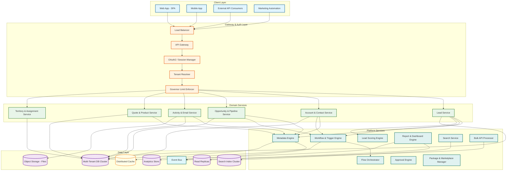
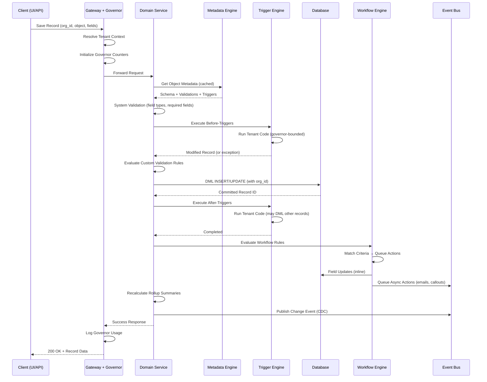
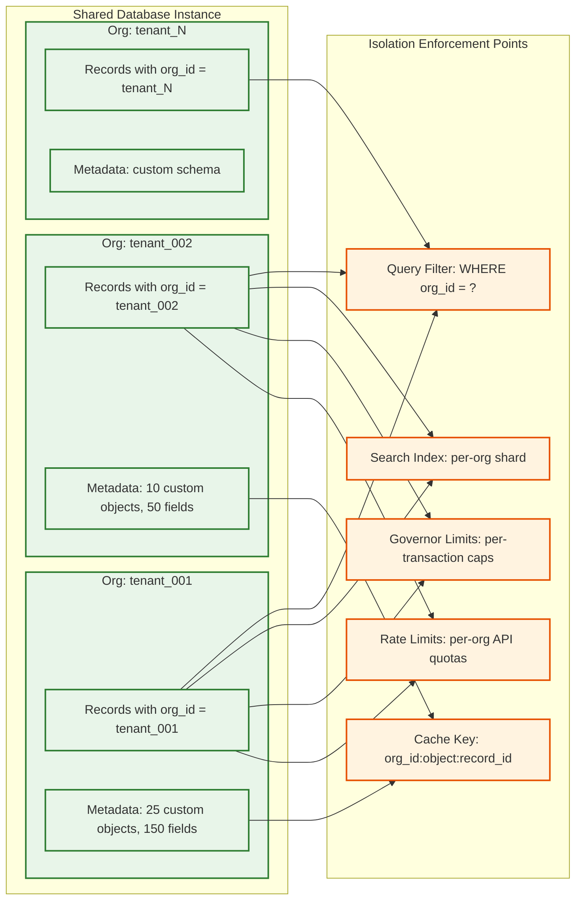
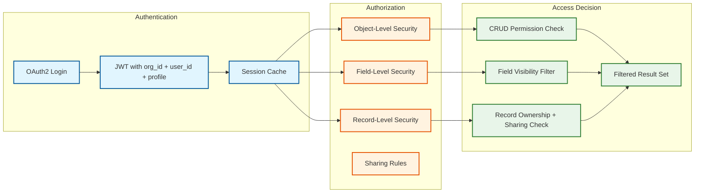

# High-Level Design

## Architecture Overview

The CRM platform is organized into four architectural layers: the **Client Layer** handles user interaction and API consumption; the **Gateway Layer** manages authentication, tenant resolution, rate limiting, and governor enforcement; the **Service Layer** contains domain services (Lead, Account, Opportunity, Activity) and platform services (Metadata Engine, Workflow Engine, Scoring Engine, Report Engine); and the **Data Layer** provides multi-tenant storage, caching, event streaming, search indexing, and file storage. Every request flows through the gateway, which resolves the tenant context (org_id) and attaches it to the request, ensuring that all downstream operations are scoped to the correct tenant.

---

## System Architecture Diagram

---

## Core Component Responsibilities

### Gateway Layer

**API Gateway**: Routes requests to appropriate domain services based on URL pattern and HTTP method; applies request/response transformation; manages API versioning (v1, v2) by mapping version-specific request formats to internal canonical representations.

**Tenant Resolver**: Extracts tenant identity from the authentication token (org_id embedded in JWT claims or session lookup); attaches tenant context to request headers so all downstream services scope their operations to the correct organization. Every database query, cache lookup, and search query includes the org_id filter derived from this context.

**Governor Limit Enforcer**: Maintains per-transaction resource counters (SOQL queries issued, DML statements executed, CPU time consumed, heap allocated) in thread-local storage. Before each resource-consuming operation, the enforcer checks the current count against the limit and throws a `GovernorLimitException` if exceeded. This enforcement happens at the platform layer, not the application layer, ensuring that tenant-authored automations and API calls cannot exceed resource boundaries regardless of their implementation.

### Domain Services

**Lead Service**: Manages the lead lifecycle from capture through qualification to conversion. Handles deduplication (fuzzy match on email, company name, phone), enrichment (async callout to data providers), score calculation (delegates to Scoring Engine), assignment (delegates to Territory Service), and conversion (atomic creation of Account + Contact + Opportunity).

**Account & Contact Service**: Manages account hierarchies and contact associations. Enforces referential integrity for parent-child account relationships, handles merge operations (surviving record selection, child reassignment, history preservation), and maintains the account team membership model.

**Opportunity & Pipeline Service**: Manages opportunity lifecycle through configurable stage sequences. Enforces stage validation rules (required fields per stage), calculates weighted pipeline amounts (amount x stage probability), maintains forecast category assignments, and triggers stage-change events for workflow automation.

**Activity & Email Service**: Records all customer interactions (emails, calls, meetings, tasks, notes) and associates them with CRM records via polymorphic relationships (an activity can belong to a Lead, Contact, Account, or Opportunity). Integrates with email providers for bidirectional sync, tracks email engagement (opens, clicks), and builds the unified activity timeline.

**Quote & Product Service**: Manages the product catalog (products, price books, price book entries), quote generation (line items, discounts, terms), and quote-to-opportunity association. Supports multi-currency pricing with exchange rate conversion.

**Territory & Assignment Service**: Defines territory hierarchies (Region → District → Territory) with assignment rules based on account attributes (industry, geography, company size). Manages territory membership, territory-based forecasting, and automatic account/opportunity reassignment when territory boundaries change.

### Platform Services

**Metadata Engine**: The heart of the platform. Stores and serves the virtual schema for every tenant: object definitions, field definitions, relationship definitions, page layout configurations, validation rules, and formula field expressions. All domain services consult the metadata engine before performing CRUD operations to know which fields exist, what types they are, what validations to apply, and how to render them. Metadata is aggressively cached per tenant with invalidation on schema changes.

**Workflow & Trigger Engine**: Executes tenant-defined automation logic in response to data events. Maintains the order-of-execution contract: (1) system validations, (2) before-triggers, (3) custom validation rules, (4) DML commit, (5) after-triggers, (6) assignment rules, (7) auto-response rules, (8) workflow rules, (9) process builder flows, (10) rollup summary calculations, (11) cross-object workflow field updates, (12) post-commit async operations. Detects and prevents infinite recursion (max 16 levels).

**Lead Scoring Engine**: Evaluates lead scores based on two signal categories: (1) demographic/firmographic signals (job title, company size, industry) scored by rule-based point assignments, and (2) behavioral signals (page visits, email opens, form submissions, content downloads) scored by recency-weighted event counts. Optionally overlays an ML predictive model trained on the tenant's historical conversion data. Scores are recomputed incrementally as new signals arrive.

**Report & Dashboard Engine**: Translates user-defined report specifications (selected columns, filters, groupings, aggregations) into queries against the virtual schema. For simple reports, queries execute against read replicas in real-time. For complex cross-object reports, queries run against the analytics store. The engine handles formula field evaluation, rollup aggregation, and result formatting for chart rendering.

**Search Service**: Provides global search (search across all objects), SOSL (Salesforce Object Search Language equivalent), and lookup search (search within a specific object for record selection). Maintains a per-tenant search index that is updated asynchronously from the write path via change events. Supports synonym dictionaries, stemming, and relevance ranking.

**Bulk API Processor**: Handles large-volume data operations (insert, update, upsert, delete) asynchronously. Accepts batches of up to 10,000 records per batch, processes them in parallel across worker nodes, and reports per-record success/failure results. Enforces separate governor limits for bulk operations and provides job status tracking via polling or callback.

---

## Data Flow: Record Save with Automation

---

## Multi-Tenant Data Isolation Model

Every data access path includes the org_id filter:
- **Database**: Every query has `WHERE org_id = :current_org` appended by the data access layer (not by application code)
- **Cache**: Every cache key is prefixed with `org_id:` to prevent cross-tenant cache pollution
- **Search**: Index is partitioned by org_id; search queries are scoped to the requesting tenant
- **Event Bus**: Events are tagged with org_id; consumers filter to their tenant
- **File Storage**: Files are stored in tenant-specific directory partitions

---

## Key Architectural Decisions

### Decision 1: Shared Generic Tables over Dedicated Tables per Object

**Context**: Custom objects need physical storage. Two options: (A) run `CREATE TABLE` for each custom object in each tenant, or (B) store all custom object data in shared generic tables with metadata-driven interpretation.

**Decision**: Shared generic tables. The database has a fixed set of data tables (`mt_data_001` through `mt_data_500`) with generic typed columns (`string_col_001` through `string_col_100`, `number_col_001` through `number_col_50`, `date_col_001` through `date_col_25`, etc.). The metadata engine maps each custom object's fields to specific generic columns. For example, a tenant's "Project" custom object with fields "project_name" and "budget" might map to `string_col_042` and `number_col_017` in `mt_data_023`.

**Rationale**: Running DDL for each tenant's schema changes is operationally prohibitive at 150K tenants---lock contention, schema cache invalidation, and migration coordination make this approach unscalable. Shared generic tables require zero DDL for schema changes; only metadata rows are inserted. The trade-off is query complexity (joins through metadata mapping) and loss of column-name readability in the physical layer.

### Decision 2: Hybrid Lead Scoring (Rules + ML)

**Context**: Lead scoring can be purely rule-based (transparent, configurable) or purely ML-based (accurate, opaque). Enterprise customers demand both transparency and accuracy.

**Decision**: Layered scoring with tenant control. Rule-based scoring serves as the foundation---tenants define explicit point values for demographic attributes and behavioral actions. The ML layer trains a gradient-boosted model on the tenant's historical lead-to-opportunity conversion data, producing a predictive score. The final score is a weighted combination: `final_score = (rule_weight x rule_score) + (ml_weight x ml_score)`, where the tenant controls the weights.

**Rationale**: Pure rule-based scoring misses non-obvious patterns (e.g., leads from companies using a specific technology stack convert 3x better). Pure ML scoring produces scores that sales reps do not trust because they cannot explain why a lead scored high. The hybrid approach lets tenants start with rules (immediate value, full transparency) and gradually increase ML weight as they build confidence in the model's predictions.

### Decision 3: Synchronous Before-Triggers, Asynchronous After-Actions

**Context**: Automations triggered by record saves can execute synchronously (within the save transaction) or asynchronously (after commit).

**Decision**: Before-triggers and validation rules execute synchronously within the transaction boundary. After-triggers that modify the triggering record also execute synchronously. Workflow actions (email alerts, outbound callouts, task creation for other records) execute asynchronously after the transaction commits.

**Rationale**: Before-triggers must be synchronous because they can modify the record being saved (field defaults, computed values, record routing). Validation rules must be synchronous because a validation failure must prevent the save. After-actions like emails and callouts have no transactional dependency on the save---making them asynchronous reduces save latency, prevents callout timeouts from blocking the UI, and allows retry logic for transient failures.

### Decision 4: CQRS for Reporting

**Context**: Reports query across objects with complex joins, aggregations, and formula evaluations. Running these queries against the transactional database degrades OLTP performance.

**Decision**: CQRS with two query paths. Operational queries (record detail views, list views, simple counts) query the primary database or read replicas. Analytical queries (cross-object reports, dashboards, forecast rollups) query a dedicated analytics store that receives incremental updates via change data capture from the event bus. The analytics store materializes denormalized views of the most common report patterns.

**Rationale**: The transactional database is optimized for single-record CRUD with tenant isolation. Report queries that scan millions of records across multiple objects and apply formula field evaluations would consume excessive resources and trigger governor limits. The analytics store is optimized for scan-heavy queries with pre-joined data, avoiding the EAV-style query compilation overhead for common report patterns.

### Decision 5: Governor Limits as Platform-Level Enforcement

**Context**: In a multi-tenant environment, any tenant's automation code or API integration can potentially consume unbounded resources, degrading service for other tenants.

**Decision**: Governor limits are enforced at the platform runtime layer, not at the application layer. Every resource-consuming operation (SOQL query, DML statement, CPU cycle, memory allocation, external callout) increments a per-transaction counter maintained in thread-local storage. The platform intercepts these operations before they execute and throws an uncatchable exception if the limit is exceeded.

**Rationale**: Application-level enforcement is bypassable---tenant code could ignore resource budgets. Platform-level enforcement is mandatory---the runtime physically prevents resource overconsumption regardless of what tenant code attempts. This is the CRM platform's equivalent of an operating system's process resource limits, ensuring fair sharing of compute, memory, and I/O across thousands of co-tenant organizations.

---

## Cross-Cutting Concerns

### Authentication & Authorization Flow

Authorization is evaluated at three levels for every data access:
1. **Object-Level Security (OLS)**: Does the user's profile have Read/Create/Edit/Delete permission on this object type?
2. **Field-Level Security (FLS)**: For each field on the object, does the user's profile have Read and/or Edit access?
3. **Record-Level Security (RLS)**: Does the user have access to this specific record? Determined by record ownership, role hierarchy, sharing rules, manual shares, and org-wide defaults.

### Multi-Currency Support

The platform supports organizations operating in multiple currencies:
- **Corporate currency**: The org's base currency for reporting and consolidation
- **Record currency**: Each monetary record stores its currency ISO code and amount
- **Dated exchange rates**: Exchange rates with effective dates for historical accuracy
- **Conversion on display**: Amounts are stored in record currency and converted to corporate or user-preferred currency on display and in reports using the applicable exchange rate for the record's date
