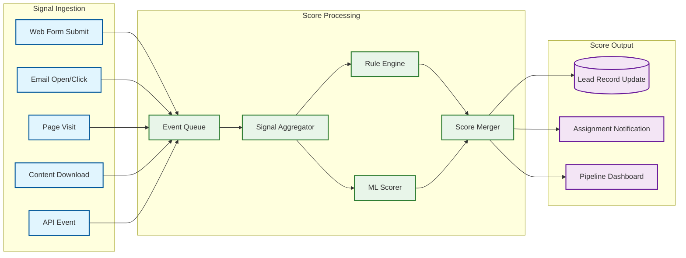

# Deep Dive & Bottlenecks

## Deep Dive 1: Custom Object Metadata Engine

### The Virtual Schema Problem

The metadata engine is the architectural foundation of the entire CRM platform. Every CRUD operation, every query, every form render, every validation check, and every report execution begins with a metadata lookup: "For this tenant and this object, what fields exist, what types are they, what columns do they map to, and what rules apply?" This makes the metadata engine the hottest code path in the system---it is invoked on every single request.

### Physical Storage Strategy

The platform uses a **typed slot allocation** approach for physical storage:

```
Object: "Project__c" (tenant: org_12345)
──────────────────────────────────────────
Metadata mapping:
  "Budget__c"    → number_col_003   (DECIMAL)
  "Status__c"    → string_col_007   (VARCHAR - picklist)
  "StartDate__c" → date_col_002     (DATE)
  "Account__c"   → string_col_008   (VARCHAR - lookup FK)

Physical row in mt_data:
  org_id = 'org_12345'
  object_type_id = 'obj_789'
  string_col_007 = 'Active'       ← Status__c
  string_col_008 = '001abc123'    ← Account__c (lookup)
  number_col_003 = 250000.00      ← Budget__c
  date_col_002 = '2025-06-15'     ← StartDate__c
  (all other slot columns are NULL)
```

When a tenant creates a new field, the platform allocates the next available slot of the correct type. When a field is deleted, the slot is marked as available for reuse (after the recycle bin retention period). The slot allocation map is stored in metadata_field.physical_column and cached in the metadata cache.

### Bottleneck: Metadata Cache Stampede

When a tenant admin modifies the schema (adds a field, changes a validation rule), the metadata cache for that tenant must be invalidated. If the tenant has 5,000 concurrent users, all 5,000 will simultaneously miss the cache and query the metadata tables---a classic cache stampede.

**Mitigation: Coalesce-on-miss with distributed locking**

```
FUNCTION get_metadata_with_coalesce(org_id, object_id):
    cached = distributed_cache.get(cache_key(org_id, object_id))
    IF cached IS NOT NULL:
        RETURN cached

    // Acquire distributed lock to prevent stampede
    lock = distributed_lock.try_acquire(
        key = "meta_load:" + org_id + ":" + object_id,
        timeout = 5_seconds
    )

    IF lock.acquired:
        TRY:
            // Double-check after acquiring lock
            cached = distributed_cache.get(cache_key(org_id, object_id))
            IF cached IS NOT NULL:
                RETURN cached
            // Load from database
            metadata = database.load_object_metadata(org_id, object_id)
            distributed_cache.set(cache_key(org_id, object_id), metadata, ttl=30_minutes)
            RETURN metadata
        FINALLY:
            lock.release()
    ELSE:
        // Another thread is loading; wait and retry
        SLEEP(50ms)
        RETURN get_metadata_with_coalesce(org_id, object_id)
```

### Bottleneck: Slot Exhaustion

A tenant that has created 500 custom fields across all objects approaches the slot limit of the generic table. Adding more slots requires an `ALTER TABLE` on a multi-billion-row table---a multi-hour operation that blocks all tenants on that database instance.

**Mitigation: Overflow to JSON column**

Fields beyond the typed slot limit spill into a JSONB overflow column on the data table. These overflow fields lose the benefit of typed columns and individual indexing but remain queryable via JSON path expressions. The metadata engine tracks whether each field is in a typed slot or in the JSON overflow, generating the appropriate physical query for each case.

```
TABLE mt_data (additional column)
──────────────────────────────────────────────
overflow_data    JSONB    -- For fields beyond typed slot capacity
                          -- e.g., {"CustomField501__c": "value", "CustomField502__c": 42}
```

### Bottleneck: Formula Field Evaluation at Scale

Formula fields are computed on every read. A list view displaying 2,000 records with 5 formula fields requires 10,000 formula evaluations. If formulas reference fields on related objects (cross-object formulas like `Account.Owner.Manager.Name`), each evaluation may trigger additional database queries.

**Mitigation: Batch evaluation with prefetch**

```
FUNCTION evaluate_formulas_batch(records, formula_fields, object_meta):
    // Phase 1: Identify all cross-object references needed
    related_refs = SET()
    FOR EACH field IN formula_fields:
        related_refs.ADD_ALL(extract_relationship_refs(field.formula_expression))

    // Phase 2: Batch-fetch related records
    related_data = {}
    FOR EACH ref IN related_refs:
        parent_ids = records.map(r => r.get(ref.lookup_field)).filter_not_null()
        related_data[ref.name] = batch_query(parent_ids)  // Single query for all

    // Phase 3: Evaluate formulas with pre-fetched data
    FOR EACH record IN records:
        context = new FormulaContext(record, related_data)
        FOR EACH field IN formula_fields:
            record[field.api_name] = evaluate_formula_with_context(field.formula_expression, context)
```

---

## Deep Dive 2: Lead Scoring Pipeline

### Architecture

The lead scoring pipeline operates as an event-driven system with three stages:



### Score Decay and Freshness

Behavioral scores decay over time---a website visit from 90 days ago is less predictive than one from yesterday. The decay function uses exponential decay with a configurable half-life:

```
score_contribution = base_points * e^(-λ * age_days)

where λ = ln(2) / half_life_days

Example with half_life = 30 days:
  Visit today:      100 * e^(0)        = 100 points
  Visit 30 days ago: 100 * e^(-0.693)  = 50 points
  Visit 60 days ago: 100 * e^(-1.386)  = 25 points
  Visit 90 days ago: 100 * e^(-2.079)  = 12.5 points
```

### Bottleneck: Score Recalculation at Scale

When a tenant changes their scoring rules (modifies point values, adds new behavioral events), all existing lead scores become stale. A tenant with 2 million leads needs full score recalculation. Running this synchronously would take hours and block other operations.

**Mitigation: Incremental batch recalculation**

```
FUNCTION recalculate_all_scores(org_id, new_scoring_config):
    // Mark scoring config as "recalculating" (UI shows stale warning)
    set_scoring_status(org_id, 'recalculating')

    // Process in batches of 1,000 leads
    cursor = NULL
    batch_size = 1000
    total_processed = 0

    WHILE TRUE:
        leads = query_leads_batch(org_id, cursor, batch_size)
        IF leads.is_empty():
            BREAK

        FOR EACH lead IN leads:
            new_score = calculate_lead_score(org_id, lead, new_scoring_config)
            batch_update_buffer.add(lead.id, new_score)

        // Flush batch update
        bulk_update_scores(org_id, batch_update_buffer)
        batch_update_buffer.clear()

        cursor = leads.last().id
        total_processed += leads.length

        // Checkpoint progress for resumability
        save_checkpoint(org_id, cursor, total_processed)

        // Yield to prevent monopolizing resources
        IF total_processed % 10000 == 0:
            SLEEP(100ms)

    set_scoring_status(org_id, 'current')
```

### Bottleneck: ML Model Training Data Volume

Training a predictive lead scoring model requires historical conversion data. New tenants or tenants with low conversion volume lack sufficient training data for a reliable model.

**Mitigation: Tiered model strategy**

| Tenant Conversion History | Model Approach |
|--------------------------|----------------|
| < 200 conversions | Rule-based only; ML disabled |
| 200--1,000 conversions | Logistic regression with strong regularization; limited feature set |
| 1,000--10,000 conversions | Gradient-boosted trees with full feature set |
| > 10,000 conversions | Deep learning ensemble with behavioral sequences |

The platform also offers a **pooled model** trained on anonymized conversion data across all tenants as a starting point, which individual tenants can fine-tune with their own data as it accumulates.

---

## Deep Dive 3: Workflow Trigger Execution Engine

### Order of Execution

The trigger execution engine enforces a strict, deterministic order for every record save:

```
1. Load record from database (for updates)
2. Overwrite old values with new values from request
3. System validation rules (field types, required fields, unique constraints)
4. Execute BEFORE triggers (can modify record fields)
5. Re-run system validation after trigger modifications
6. Evaluate custom validation rules
7. DML: save record to database
8. Execute AFTER triggers
9. Execute assignment rules
10. Execute auto-response rules
11. Execute workflow rules (immediate actions)
12. Execute flow triggers (record-triggered flows)
13. Execute escalation rules
14. Calculate rollup summary fields on parent records
15. If rollup changes parent → re-execute from step 3 for parent (cascading)
16. Execute post-commit async logic (future methods, queueable jobs)
17. Publish platform events and change data capture events
```

### Bottleneck: Cascading Trigger Storms

Consider: a trigger on Opportunity updates a custom field on Account. This Account update fires a trigger that updates all related Contacts. Each Contact update fires a trigger that creates a Task. The Task creation fires a trigger that sends an email. A single Opportunity save has now cascaded into hundreds of DML operations.

**Mitigation: Recursion depth tracking and governor enforcement**

```
FUNCTION execute_triggers_with_depth_tracking(records, operation, depth):
    IF depth > MAX_TRIGGER_DEPTH (16):
        THROW TriggerRecursionException(
            "Maximum trigger recursion depth (16) exceeded. " +
            "Review trigger logic for cascading updates."
        )

    // Execute triggers at current depth
    trigger_context.set_depth(depth)
    execute_before_triggers(records, operation)
    committed = database.dml(records, operation)
    execute_after_triggers(committed, operation)

    // Any DML operations within triggers recursively call this function
    // with depth + 1, naturally enforcing the depth limit

    // Governor limits also constrain total operations across all depths:
    // - 100 total SOQL queries across ALL trigger executions
    // - 150 total DML statements across ALL trigger executions
    // - 10,000ms total CPU time across ALL trigger executions
    // These are per-TRANSACTION limits, not per-trigger limits
```

### Bottleneck: Workflow Rule Evaluation Volume

A tenant with 500 workflow rules per object means every save evaluates 500 rule conditions. With 10,000 record saves per hour, that is 5 million rule evaluations per hour for one tenant on one object.

**Mitigation: Short-circuit evaluation with field change tracking**

```
FUNCTION evaluate_workflow_rules_optimized(org_id, object_name, records, operation):
    all_rules = metadata_cache.get_workflows(org_id, object_name)

    // Phase 1: Filter by trigger type
    applicable_rules = all_rules.filter(rule =>
        (operation == 'INSERT' AND rule.trigger_type IN ['on_create', 'on_create_or_update']) OR
        (operation == 'UPDATE' AND rule.trigger_type IN ['on_update', 'on_create_or_update'])
    )

    // Phase 2: For updates, filter by changed fields
    IF operation == 'UPDATE':
        changed_fields = get_changed_field_names(records)
        applicable_rules = applicable_rules.filter(rule =>
            rule.depends_on_fields.intersects(changed_fields) OR
            rule.depends_on_fields.is_empty()  // Rules with no field dependency always evaluate
        )

    // Phase 3: Evaluate remaining rules (typically 5-20% of total)
    fired_rules = []
    FOR EACH rule IN applicable_rules:
        FOR EACH record IN records:
            IF evaluate_entry_criteria(rule.entry_criteria, record):
                fired_rules.ADD({rule: rule, record: record})

    RETURN fired_rules
```

---

## Deep Dive 4: SOQL/Query Optimization for Virtual Schema

### The Query Compilation Challenge

A user writes a logical query against the virtual schema:

```
SELECT Name, Email, Company, LeadScore__c, Account__r.Industry
FROM Lead
WHERE Status = 'Qualified'
  AND LeadScore__c > 80
  AND CreatedDate > LAST_90_DAYS
ORDER BY LeadScore__c DESC
LIMIT 100
```

The query compiler must translate this into an efficient physical query against generic tables:

```sql
SELECT d.name,
       d.string_col_003 AS Email,
       d.string_col_005 AS Company,
       d.number_col_003 AS LeadScore__c,
       parent.string_col_007 AS Account__r_Industry
FROM mt_data d
LEFT JOIN mt_relationship r
    ON r.org_id = d.org_id
    AND r.child_record_id = d.record_id
    AND r.relationship_def_id = 'rel_lead_account'
LEFT JOIN mt_data parent
    ON parent.record_id = r.parent_record_id
    AND parent.org_id = d.org_id
WHERE d.org_id = 'org_12345'
  AND d.object_type_id = 'obj_lead'
  AND d.is_deleted = false
  AND d.string_col_009 = 'Qualified'      -- Status
  AND d.number_col_003 > 80               -- LeadScore__c
  AND d.created_date > NOW() - INTERVAL 90 DAY
ORDER BY d.number_col_003 DESC
LIMIT 100
```

### Bottleneck: Index Selectivity on Generic Columns

Standard database indexes on generic columns like `string_col_009` span data from ALL object types and ALL tenants. An index on `string_col_009` contains values from Lead.Status, Account.Type, Opportunity.StageName, and every custom picklist field that maps to that column. The index selectivity is terrible.

**Mitigation: Composite indexes with object_type_id prefix**

```
-- Instead of indexing generic columns alone:
INDEX idx_poor (string_col_009)

-- Use composite indexes scoped to tenant and object type:
INDEX idx_good (org_id, object_type_id, string_col_009)
INDEX idx_good (org_id, object_type_id, number_col_003)

-- For the most frequently queried patterns, create covering indexes:
INDEX idx_covering (org_id, object_type_id, string_col_009, number_col_003, created_date)
```

### Bottleneck: Cross-Object Join Fan-Out

Cross-object reports that traverse multiple relationships (e.g., "Show all Activities on Contacts of Accounts in Territory 'West'") require multiple self-joins on the generic tables, each joined through the relationship table. With three levels of traversal, the query plan involves 6+ table joins.

**Mitigation: Materialized relationship paths**

For common traversal patterns (Account → Contact → Activity, Account → Opportunity → Product), the platform maintains denormalized relationship path tables that store flattened relationship chains:

```
TABLE relationship_path (materialized, async-updated)
──────────────────────────────────────────────
org_id              VARCHAR(18)
ancestor_record_id  VARCHAR(18)    -- e.g., Account ID
descendant_record_id VARCHAR(18)   -- e.g., Activity ID
path_type           VARCHAR(50)    -- e.g., 'account_contact_activity'
depth               INT            -- Levels of traversal (e.g., 2)
intermediate_ids    JSONB          -- [contact_id] for audit/debugging

INDEX idx_path (org_id, path_type, ancestor_record_id)
```

Reports querying "all activities under Account X" use a single join through the path table instead of traversing the relationship chain.

### Query Governor Enforcement

```
FUNCTION execute_soql_with_governors(org_id, compiled_query, governor):
    // Check SOQL count governor
    governor.increment_soql_count(1)
    IF governor.soql_count > governor.soql_limit:
        THROW GovernorException("Too many SOQL queries: " + governor.soql_limit)

    // Execute with row limit enforcement
    result = database.execute(compiled_query)

    // Check rows retrieved governor
    governor.increment_rows_retrieved(result.row_count)
    IF governor.rows_retrieved > governor.rows_retrieved_limit:
        THROW GovernorException("Too many query rows: " + governor.rows_retrieved_limit)

    // Check query execution time
    IF result.execution_time_ms > 120_000:
        THROW GovernorException("Query timeout exceeded: 120 seconds")

    RETURN result
```

---

## Bottleneck Summary

| Bottleneck | Impact | Mitigation | Trade-Off |
|-----------|--------|------------|-----------|
| Metadata cache stampede | All users for a tenant hit database simultaneously after schema change | Distributed lock coalescing; single-thread reload | Slight delay for first post-invalidation request |
| Slot exhaustion | Cannot add more typed custom fields | JSON overflow column for extra fields | Overflow fields lose indexing and type enforcement |
| Formula evaluation at scale | List views with formula fields trigger thousands of evaluations | Batch prefetch of related records; expression caching | Memory overhead for prefetched data |
| Score recalculation volume | Changing scoring rules requires recalculating millions of leads | Incremental batch processing with checkpointing | Stale scores during recalculation window |
| ML training data scarcity | New tenants cannot use ML scoring | Tiered model strategy; pooled anonymous model | Pooled model is less accurate than tenant-specific |
| Cascading trigger storms | Single save triggers hundreds of downstream operations | Recursion depth limit (16); transaction-level governor limits | Complex automations may hit limits and fail |
| Workflow evaluation volume | 500 rules per object evaluated on every save | Field-change-based short-circuit filtering | Rules without field dependencies cannot be filtered |
| Generic column index selectivity | Indexes span all objects and tenants, reducing selectivity | Composite indexes with org_id + object_type_id prefix | More indexes increase write amplification |
| Cross-object join fan-out | Multi-hop relationship queries require many self-joins | Materialized relationship path tables | Async maintenance overhead; staleness risk |
