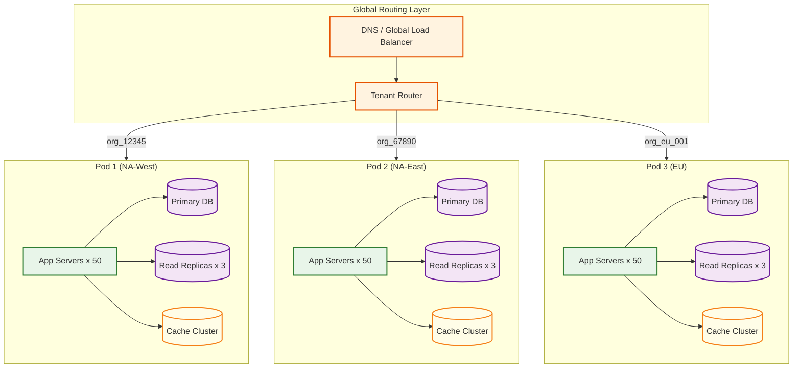
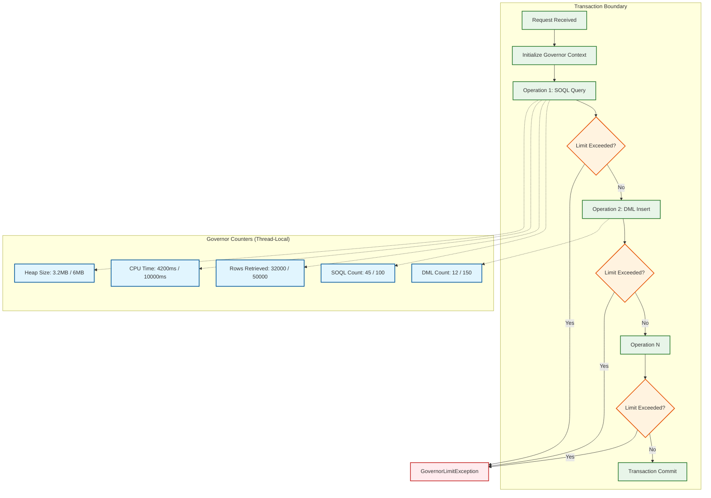

# Scalability & Reliability

## Multi-Tenant Scaling Strategy

### Database Tier Scaling

The CRM platform uses a **pod-based** scaling model where each pod is a self-contained unit of database instances, application servers, and cache clusters serving a subset of tenants:



**Pod sizing:**
- Each pod serves ~5,000 tenants
- Each database instance holds ~250 billion rows across all tenants in the pod
- Tenants are assigned to pods based on geography (data residency) and load characteristics
- New pods are provisioned when existing pods approach 80% capacity

**Tenant migration between pods:**
When a tenant grows beyond what its current pod can accommodate (or for load balancing), the platform migrates the tenant to a new pod using a dual-write strategy:

```
FUNCTION migrate_tenant(org_id, source_pod, target_pod):
    // Phase 1: Bulk copy (background)
    snapshot_timestamp = current_timestamp()
    bulk_copy_records(org_id, source_pod, target_pod, up_to=snapshot_timestamp)

    // Phase 2: Enable dual-write
    routing_table.set(org_id, mode='dual_write', primary=source_pod, secondary=target_pod)
    // All writes now go to both pods; reads still from source

    // Phase 3: Catch up delta
    copy_delta_records(org_id, source_pod, target_pod, since=snapshot_timestamp)

    // Phase 4: Verify consistency
    mismatches = compare_checksums(org_id, source_pod, target_pod)
    IF mismatches.count > 0:
        reconcile(mismatches)
        RETRY Phase 4

    // Phase 5: Switch reads to target
    routing_table.set(org_id, mode='dual_write', primary=target_pod, secondary=source_pod)

    // Phase 6: Drain source (after verification period)
    AFTER 24_hours:
        routing_table.set(org_id, mode='single', primary=target_pod)
        schedule_deletion(org_id, source_pod, after=30_days)
```

### Application Tier Scaling

Application servers are stateless and horizontally scalable. Auto-scaling policies:

| Metric | Scale-Up Threshold | Scale-Down Threshold | Cooldown |
|--------|-------------------|---------------------|----------|
| CPU utilization | > 70% for 3 min | < 30% for 10 min | 5 min |
| Request queue depth | > 100 per server | < 20 per server | 3 min |
| Response latency (p95) | > 500ms for 2 min | < 200ms for 15 min | 5 min |
| Governor limit violations | > 1% of requests | < 0.1% of requests | 10 min |

### Read Replica Strategy

Read replicas handle three categories of traffic:
1. **Report queries**: Complex cross-object reports and dashboards query read replicas to avoid OLTP impact
2. **Search indexing**: The search indexer reads from replicas to build and update the search index
3. **Analytics pipeline**: The analytics store ingests data from replicas for CQRS materialized views

Replication lag SLO: < 5 seconds. If lag exceeds 5 seconds, the platform falls back to reading from the primary for consistency-critical operations (record detail views, list views).

---

## Governor Limits as Scaling Mechanism

Governor limits are not just safety guardrails---they are the primary mechanism that makes multi-tenant scaling possible. Without governor limits, a single tenant's poorly-written automation could consume the entire database connection pool, exhaust CPU on the application server, or generate enough I/O to saturate the storage tier.

### Governor Limit Architecture



### API Rate Limiting (Per-Tenant)

Beyond per-transaction governor limits, the platform enforces per-tenant API rate limits:

| Tier | API Calls / 24 Hours | Concurrent API Requests | Bulk API Jobs / 24 Hours |
|------|----------------------|------------------------|------------------------|
| Starter | 15,000 | 25 | 100 |
| Professional | 100,000 | 25 | 5,000 |
| Enterprise | 1,000,000 | 50 | 10,000 |
| Unlimited | 5,000,000 | 100 | 25,000 |

Rate limits use a **sliding window** algorithm with token bucket burst tolerance:

```
FUNCTION check_api_rate_limit(org_id, api_type):
    tenant_tier = get_tenant_tier(org_id)
    limit = get_rate_limit(tenant_tier, api_type)

    bucket = rate_limiter.get_bucket(org_id, api_type)
    IF bucket.try_consume(1):
        RETURN ALLOWED
    ELSE:
        remaining_seconds = bucket.time_until_next_token()
        THROW RateLimitException(
            "API rate limit exceeded",
            retry_after = remaining_seconds,
            limit = limit.max_requests,
            remaining = 0
        )
```

---

## Data Archival Strategy

CRM tenants accumulate data over years: activity history, old opportunities, stale leads, and audit logs. Active data must remain fast; historical data can tolerate higher latency.

### Tiered Storage

```
HOT TIER (Primary Database)
├── Active records (last 2 years of modifications)
├── All custom object records
├── All metadata
└── Access: < 10ms query latency

WARM TIER (Archival Database)
├── Records not modified in 2+ years
├── Closed-lost opportunities older than 1 year
├── Completed activities older than 6 months
└── Access: < 500ms query latency (on-demand retrieval)

COLD TIER (Object Storage)
├── Audit logs older than 3 years
├── Deleted records past recycle bin retention
├── Email attachments older than 5 years
└── Access: < 30s retrieval (batch export)
```

### Archival Process

```
FUNCTION archive_tenant_data(org_id):
    // Run during off-peak hours for each tenant
    archival_config = get_archival_config(org_id)

    FOR EACH object_config IN archival_config.objects:
        // Identify archival candidates
        candidates = query(
            "SELECT record_id FROM mt_data " +
            "WHERE org_id = :org_id " +
            "AND object_type_id = :object_type " +
            "AND last_modified_date < :cutoff_date " +
            "AND is_deleted = false",
            cutoff_date = NOW() - object_config.archive_after_days
        )

        // Batch move to warm tier
        FOR EACH batch IN candidates.chunk(5000):
            warm_db.bulk_insert(batch)
            hot_db.mark_archived(batch)  // Set archived=true, keep stub for references
            event_bus.publish('records_archived', {
                org_id: org_id,
                record_ids: batch.map(r => r.record_id)
            })

    // Update search index to remove archived records
    search_indexer.remove_archived(org_id, archived_record_ids)
```

---

## Reliability Patterns

### Database Failover

Each pod's primary database has synchronous replication to a standby in a different availability zone:

- **Detection**: Health checks every 2 seconds; failover initiated after 3 consecutive failures (6 seconds)
- **Promotion**: Standby promoted to primary; read replicas redirected to new primary
- **DNS update**: Connection pool drains to old primary; new connections routed to new primary
- **Total failover time**: < 30 seconds (within RTO of 15 minutes)
- **Data loss**: Zero (synchronous replication ensures standby is identical to primary)

### Circuit Breaker for External Callouts

Workflow actions that make external HTTP callouts (webhook notifications, data enrichment APIs) use circuit breakers to prevent cascading failures:

```
FUNCTION execute_callout_with_circuit_breaker(org_id, endpoint, payload):
    circuit = circuit_breaker_registry.get(org_id, endpoint)

    IF circuit.state == 'OPEN':
        IF circuit.should_attempt_reset():
            circuit.state = 'HALF_OPEN'
        ELSE:
            queue_for_retry(org_id, endpoint, payload)
            RETURN CIRCUIT_OPEN

    TRY:
        response = http_client.post(endpoint, payload, timeout=10_seconds)
        IF response.status_code >= 200 AND response.status_code < 300:
            circuit.record_success()
            RETURN SUCCESS
        ELSE:
            circuit.record_failure()
            RETURN FAILURE
    CATCH TimeoutException:
        circuit.record_failure()
        queue_for_retry(org_id, endpoint, payload)
        RETURN TIMEOUT

    // Circuit opens after 5 failures in 60 seconds
    // Resets to half-open after 30 seconds
    // Closes after 3 consecutive successes in half-open state
```

### Idempotency for Bulk Operations

Bulk API operations must be idempotent---retrying a failed batch should not create duplicate records:

```
FUNCTION process_bulk_batch_idempotent(job_id, batch_id, records):
    FOR EACH record IN records:
        // Generate deterministic idempotency key from job + batch + row position
        idempotency_key = hash(job_id + batch_id + record.row_number)

        // Check if this record was already processed
        existing = idempotency_store.get(idempotency_key)
        IF existing IS NOT NULL:
            results.add(existing)  // Return cached result
            CONTINUE

        TRY:
            result = process_single_record(record)
            idempotency_store.set(idempotency_key, result, ttl=7_days)
            results.add(result)
        CATCH Exception as e:
            error_result = { success: false, error: e.message }
            idempotency_store.set(idempotency_key, error_result, ttl=7_days)
            results.add(error_result)

    RETURN results
```

### Disaster Recovery

| Component | Strategy | RPO | RTO |
|-----------|----------|-----|-----|
| Primary database | Synchronous replication to standby in another AZ | 0 | < 30s |
| Read replicas | Asynchronous replication; rebuilt from primary if needed | < 5s | < 5 min |
| Search index | Rebuilt from database if lost; async replication across AZs | < 30s | < 30 min |
| Cache cluster | Ephemeral; rebuilt automatically on restart | N/A | < 2 min |
| File storage | Multi-AZ replication with versioning | 0 | < 5 min |
| Event bus | Multi-AZ replication; consumer offsets checkpointed | < 1s | < 2 min |
| Metadata | Backed up every hour to cross-region storage; critical for recovery | < 1 hour | < 15 min |

### Cross-Region Disaster Recovery

For tenants requiring cross-region DR, the platform maintains an asynchronous replica in a secondary region:

- **Normal operation**: All traffic goes to primary region; async replication to secondary with < 60s lag
- **Regional failure**: DNS failover to secondary region; secondary promoted to primary
- **Failover time**: 5-15 minutes (DNS propagation + promotion)
- **Data at risk**: Up to 60 seconds of writes that may not have replicated

---

## Capacity Planning

### Growth Projections

| Metric | Current | +1 Year | +3 Years |
|--------|---------|---------|----------|
| Tenants | 150K | 225K | 500K |
| Total users | 7.5M | 12M | 30M |
| Peak RPS | 125K | 200K | 500K |
| Storage (total) | 10 PB | 18 PB | 50 PB |
| Pods | 30 | 45 | 100 |

### Scale-Up Triggers

| Trigger | Action | Timeline |
|---------|--------|----------|
| Pod CPU > 80% sustained | Add app servers to pod | Immediate (auto-scale) |
| Pod storage > 75% | Provision new database instance, migrate tenants | 1-2 weeks |
| Pod tenant count > 5,000 | Split pod, migrate half of tenants | 2-4 weeks |
| API error rate > 0.5% | Scale app tier + investigate root cause | Immediate + 24h |
| Query latency p99 > 2s | Add read replicas + optimize indexes | 1-3 days |
