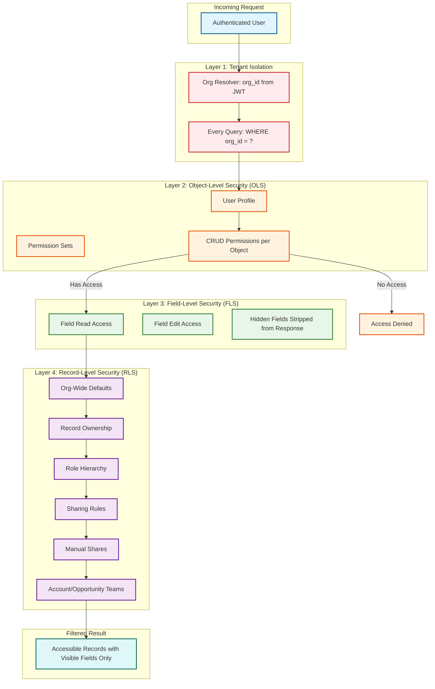

# Security & Compliance

## Security Architecture Overview

CRM systems store highly sensitive business data: customer contact information, deal sizes, sales strategies, competitive intelligence, and communication history. The security model must enforce access control at four levels---tenant isolation (org-level), object-level, field-level, and record-level---creating a fine-grained permission matrix that determines exactly which data each user can see and modify.

---

## Multi-Layer Access Control Model



---

## Layer 1: Tenant Isolation

Every data access path includes the `org_id` filter, enforced at the data access layer (not by application code):

```
FUNCTION secure_query(org_id, base_query):
    // Append org_id filter to EVERY query, regardless of what the caller specified
    IF NOT base_query.has_org_id_filter():
        base_query.add_where("org_id = :org_id", org_id)

    // Validate that no query can reference cross-tenant data
    IF base_query.contains_org_id_override():
        THROW SecurityException("Cannot override org_id filter")

    RETURN database.execute(base_query)
```

**Enforcement points:**
- Database queries: `WHERE org_id = ?` on every statement
- Cache access: Key prefix `org_id:` on every cache operation
- Search queries: Index partitioned by org_id; query scoped to partition
- File storage: Tenant-isolated directory structure; path validation prevents traversal
- Event bus: Events tagged with org_id; consumers filter to their tenant
- API responses: Response serializer verifies all returned records belong to requesting org

---

## Layer 2: Object-Level Security (OLS)

Each user has a **Profile** that defines CRUD (Create, Read, Update, Delete) permissions for every standard and custom object. **Permission Sets** layer additional permissions on top of the profile:

```
TABLE user_profile_permissions
──────────────────────────────────────────────
org_id          VARCHAR(18)
profile_id      VARCHAR(18)
object_id       VARCHAR(18)
can_create      BOOLEAN
can_read        BOOLEAN
can_edit        BOOLEAN
can_delete      BOOLEAN
can_view_all    BOOLEAN    -- Bypasses record-level security for reads
can_modify_all  BOOLEAN    -- Bypasses record-level security for writes
```

```
FUNCTION check_object_permission(user, object_name, operation):
    profile_perms = get_profile_permissions(user.profile_id, object_name)
    perm_set_perms = get_permission_set_permissions(user.permission_set_ids, object_name)

    // Merge: permission sets ADD to profile permissions (never subtract)
    effective = merge_permissions(profile_perms, perm_set_perms)

    SWITCH operation:
        CASE 'CREATE': RETURN effective.can_create
        CASE 'READ':   RETURN effective.can_read
        CASE 'UPDATE': RETURN effective.can_edit
        CASE 'DELETE': RETURN effective.can_delete
```

---

## Layer 3: Field-Level Security (FLS)

For each object a user can access, FLS controls visibility of individual fields:

```
TABLE field_level_security
──────────────────────────────────────────────
org_id          VARCHAR(18)
profile_id      VARCHAR(18)
field_id        VARCHAR(18)
is_readable     BOOLEAN
is_editable     BOOLEAN
```

**Enforcement in query results:**

```
FUNCTION apply_field_level_security(user, object_meta, records):
    visible_fields = get_visible_fields(user.profile_id, object_meta.object_id)

    FOR EACH record IN records:
        FOR EACH field IN object_meta.fields:
            IF field.id NOT IN visible_fields:
                record.remove(field.api_name)  // Strip hidden fields from response
            ELSE IF NOT visible_fields[field.id].is_editable:
                record.mark_read_only(field.api_name)  // Mark as read-only in UI

    RETURN records
```

**Critical security rule**: FLS is enforced on every data access path---REST API, SOQL queries, report results, formula field evaluations, and workflow field references. A formula field that references a field the user cannot see must return `#HIDDEN#` or be blocked entirely.

---

## Layer 4: Record-Level Security (RLS)

Record-level security determines which specific records a user can access. This is the most complex layer with multiple mechanisms that combine to determine access:

### Org-Wide Defaults (OWD)

Each object has a default sharing level that applies to all records:

| OWD Setting | Meaning |
|------------|---------|
| **Private** | Only the record owner and users above in the role hierarchy can access |
| **Public Read Only** | All users can read; only owner and hierarchy can edit |
| **Public Read/Write** | All users can read and edit |
| **Controlled by Parent** | Access inherited from parent record (for master-detail children) |

### Sharing Rules Evaluation

```
FUNCTION evaluate_record_access(user, record):
    // Step 1: Is user the record owner?
    IF record.owner_id == user.id:
        RETURN FULL_ACCESS

    // Step 2: Check role hierarchy (managers see their reports' records)
    IF is_in_role_hierarchy_above(user.role_id, get_owner_role(record.owner_id)):
        RETURN FULL_ACCESS

    // Step 3: Check org-wide default
    owd = get_org_wide_default(user.org_id, record.object_type)
    IF owd == 'public_read_write':
        RETURN FULL_ACCESS
    IF owd == 'public_read_only':
        grant = READ_ONLY

    // Step 4: Check sharing rules (criteria-based and owner-based)
    sharing_rules = get_sharing_rules(user.org_id, record.object_type)
    FOR EACH rule IN sharing_rules:
        IF rule.type == 'owner_based':
            IF record.owner_role IN rule.shared_from_roles AND user.role IN rule.shared_to_roles:
                grant = MAX(grant, rule.access_level)
        ELSE IF rule.type == 'criteria_based':
            IF evaluate_criteria(rule.criteria, record):
                IF user.role IN rule.shared_to_roles OR user.group IN rule.shared_to_groups:
                    grant = MAX(grant, rule.access_level)

    // Step 5: Check manual shares
    manual_shares = get_manual_shares(record.id)
    FOR EACH share IN manual_shares:
        IF share.user_or_group_id == user.id OR user.group_ids.contains(share.user_or_group_id):
            grant = MAX(grant, share.access_level)

    // Step 6: Check account/opportunity team membership
    IF record.object_type IN ['Account', 'Opportunity']:
        team_access = get_team_access(record.id, user.id)
        IF team_access IS NOT NULL:
            grant = MAX(grant, team_access)

    RETURN grant  // NONE, READ_ONLY, or FULL_ACCESS
```

### Sharing Table (Pre-Computed Access)

For performance, the platform maintains a pre-computed **sharing table** that is updated whenever ownership, sharing rules, or role hierarchy changes:

```
TABLE record_share
──────────────────────────────────────────────
org_id          VARCHAR(18)
record_id       VARCHAR(18)
user_or_group_id VARCHAR(18)
access_level    ENUM('read', 'edit', 'all')
share_reason    ENUM('owner', 'role_hierarchy', 'sharing_rule', 'manual', 'team')
row_cause       VARCHAR(50)    -- Specific sharing rule or reason

INDEX idx_share_user (org_id, user_or_group_id, record_id)
INDEX idx_share_record (org_id, record_id)
```

SOQL queries are rewritten to join against the sharing table:

```sql
-- User's query:
SELECT Id, Name FROM Account WHERE Industry = 'Technology'

-- Platform-rewritten query (when OWD is Private):
SELECT d.record_id, d.name
FROM mt_data d
INNER JOIN record_share s
    ON s.org_id = d.org_id
    AND s.record_id = d.record_id
    AND s.user_or_group_id IN (:user_id, :user_group_ids)
WHERE d.org_id = :org_id
    AND d.object_type_id = :account_obj_id
    AND d.string_col_007 = 'Technology'  -- Industry
    AND d.is_deleted = false
```

---

## GDPR Compliance

### Consent Management

```
TABLE consent_record
──────────────────────────────────────────────
org_id              VARCHAR(18)
consent_id          VARCHAR(18)
contact_id          VARCHAR(18)    -- FK to Contact record
consent_type        ENUM('marketing_email', 'phone_calls', 'data_processing',
                         'third_party_sharing', 'profiling', 'tracking')
status              ENUM('granted', 'revoked', 'pending')
granted_date        TIMESTAMP
revoked_date        TIMESTAMP
source              VARCHAR(100)   -- 'web_form', 'email_preference', 'api', 'manual'
ip_address          VARCHAR(45)
legal_basis         ENUM('consent', 'contract', 'legitimate_interest', 'legal_obligation')
expiry_date         DATE           -- Consent expires after this date
notes               TEXT
```

### Right to Erasure (GDPR Article 17)

```
FUNCTION process_erasure_request(org_id, contact_id):
    // Step 1: Validate request
    contact = get_record(org_id, 'Contact', contact_id)
    IF contact IS NULL:
        THROW NotFoundException("Contact not found")

    // Step 2: Check legal holds (may block erasure)
    holds = get_legal_holds(org_id, contact_id)
    IF holds.count > 0:
        RETURN { status: 'blocked', reason: 'Legal hold active', holds: holds }

    // Step 3: Identify all related data
    related_data = {
        activities: query("SELECT Id FROM Activity WHERE who_id = :contact_id"),
        opportunities: query("SELECT Id FROM OpportunityContactRole WHERE contact_id = :contact_id"),
        cases: query("SELECT Id FROM Case WHERE contact_id = :contact_id"),
        emails: query("SELECT Id FROM EmailMessage WHERE to_address LIKE :contact_email"),
        attachments: query("SELECT Id FROM Attachment WHERE parent_id = :contact_id"),
        custom_records: find_all_references(org_id, contact_id)  // Cross-object reference scan
    }

    // Step 4: Anonymize (preferred over hard delete for referential integrity)
    anonymize_record(contact_id, {
        first_name: 'REDACTED',
        last_name: 'REDACTED',
        email: generate_anonymous_email(),
        phone: 'REDACTED',
        mailing_address: 'REDACTED'
    })

    // Step 5: Delete personal data in related records
    FOR EACH activity IN related_data.activities:
        anonymize_activity(activity.id)
    FOR EACH email IN related_data.emails:
        delete_email_content(email.id)  // Remove body, keep metadata stub

    // Step 6: Purge from search index
    search_indexer.delete(org_id, contact_id)

    // Step 7: Purge from analytics/data warehouse
    analytics_store.delete_contact_data(org_id, contact_id)

    // Step 8: Audit log (must retain erasure record itself)
    audit_log.write({
        org_id: org_id,
        action: 'gdpr_erasure',
        subject_id: contact_id,
        timestamp: NOW(),
        performed_by: current_user.id,
        data_categories_erased: ['contact_info', 'activities', 'emails', 'attachments']
    })

    RETURN { status: 'completed', records_processed: count_total_records }
```

### Data Subject Access Request (DSAR)

```
FUNCTION process_dsar(org_id, contact_id):
    report = {
        personal_data: get_record_all_fields(org_id, 'Contact', contact_id),
        activities: query_all_activities(org_id, contact_id),
        opportunities: query_related_opportunities(org_id, contact_id),
        cases: query_related_cases(org_id, contact_id),
        consent_history: query_consent_history(org_id, contact_id),
        login_history: query_login_history_if_user(org_id, contact_id),
        email_history: query_email_interactions(org_id, contact_id)
    }

    // Generate downloadable report
    export_file = generate_dsar_report(report, format='json')
    RETURN { download_url: signed_url(export_file, expires=7_days) }
```

---

## Audit Trail

### Field-Level Audit History

Track changes to specific fields on critical objects:

```
TABLE field_audit_trail
──────────────────────────────────────────────
org_id              VARCHAR(18)
audit_id            VARCHAR(18)
record_id           VARCHAR(18)
object_type         VARCHAR(80)
field_name          VARCHAR(80)
old_value           TEXT
new_value           TEXT
changed_by          VARCHAR(18)
changed_date        TIMESTAMP
change_type         ENUM('create', 'update', 'delete', 'undelete')

INDEX idx_audit_record (org_id, record_id, changed_date DESC)
INDEX idx_audit_user (org_id, changed_by, changed_date DESC)
```

### Login and API Audit

```
TABLE login_audit
──────────────────────────────────────────────
org_id              VARCHAR(18)
login_id            VARCHAR(18)
user_id             VARCHAR(18)
login_time          TIMESTAMP
source_ip           VARCHAR(45)
login_type          ENUM('ui', 'api', 'oauth', 'saml')
status              ENUM('success', 'failed', 'locked_out')
failure_reason      VARCHAR(100)
browser             VARCHAR(255)
platform            VARCHAR(100)
session_id          VARCHAR(100)

INDEX idx_login_audit (org_id, user_id, login_time DESC)
```

### API Call Audit

```
TABLE api_audit
──────────────────────────────────────────────
org_id              VARCHAR(18)
audit_id            VARCHAR(18)
user_id             VARCHAR(18)
api_endpoint        VARCHAR(255)
http_method         VARCHAR(10)
request_size        INT
response_size       INT
response_code       INT
execution_time_ms   INT
governor_usage      JSONB          -- {soql: 45, dml: 12, cpu_ms: 3200}
client_id           VARCHAR(100)   -- OAuth connected app ID
timestamp           TIMESTAMP

INDEX idx_api_audit (org_id, timestamp DESC)
INDEX idx_api_audit_user (org_id, user_id, timestamp DESC)
```

---

## Encryption

### Encryption at Rest

| Data Category | Encryption Method |
|--------------|-------------------|
| Database records | Transparent Data Encryption (TDE) with per-pod encryption keys |
| Tenant-sensitive fields (SSN, credit card) | Application-level field encryption with per-tenant keys |
| File attachments | Encrypted at rest in object storage with per-tenant keys |
| Backups | Encrypted with backup-specific keys; separate from production keys |
| Search index | Encrypted at rest; decryption at query time |

### Shield Platform Encryption (Deterministic vs. Probabilistic)

For tenants requiring application-level encryption of specific fields:

- **Deterministic encryption**: Same plaintext always produces the same ciphertext; enables exact-match filtering but leaks frequency distribution
- **Probabilistic encryption**: Same plaintext produces different ciphertext each time; prevents frequency analysis but disables filtering and sorting

```
FUNCTION encrypt_field(org_id, field_value, encryption_scheme):
    tenant_key = key_management.get_tenant_key(org_id)

    IF encryption_scheme == 'deterministic':
        // AES-SIV: deterministic authenticated encryption
        RETURN aes_siv_encrypt(field_value, tenant_key)
    ELSE:
        // AES-GCM: probabilistic authenticated encryption
        nonce = generate_random_nonce()
        RETURN aes_gcm_encrypt(field_value, tenant_key, nonce)
```

### Encryption in Transit

- All client-to-server communication: TLS 1.3 (minimum TLS 1.2)
- All service-to-service communication: mTLS with certificate rotation every 90 days
- Database connections: TLS encrypted with certificate pinning
- Cache connections: TLS encrypted

---

## IP Restrictions and Session Security

```
TABLE login_ip_restriction
──────────────────────────────────────────────
org_id          VARCHAR(18)
profile_id      VARCHAR(18)
start_ip        INET
end_ip          INET
description     VARCHAR(255)
```

```
TABLE session_settings
──────────────────────────────────────────────
org_id                      VARCHAR(18)
session_timeout_minutes     INT           -- Default: 120
lock_sessions_to_ip         BOOLEAN       -- Invalidate session if IP changes
require_https               BOOLEAN       -- Always true for CRM
csrf_protection_enabled     BOOLEAN
clickjack_protection        ENUM('same_origin', 'deny', 'allow')
```

---

## Compliance Matrix

| Regulation | Requirement | Platform Capability |
|-----------|-------------|---------------------|
| **GDPR** | Right to erasure | Automated anonymization pipeline with referential integrity preservation |
| **GDPR** | Data portability | DSAR export in JSON/CSV; Bulk API for data extraction |
| **GDPR** | Consent tracking | Per-contact consent records with legal basis, source, and expiry |
| **GDPR** | Data residency | Pod-based architecture with EU-resident pods for EU tenant data |
| **CCPA** | Do Not Sell | Opt-out flag on contact records; enforced in data sharing workflows |
| **CCPA** | Right to know | Same DSAR pipeline as GDPR |
| **SOC 2** | Access control audit | Login audit trail, API audit trail, field audit trail |
| **SOC 2** | Change management | Metadata change tracking, deployment audit trail |
| **HIPAA** | PHI protection | Field-level encryption for health data; BAA support; access logging |
| **HIPAA** | Minimum necessary | Field-level security limits PHI exposure to authorized users |
| **SOX** | Financial data integrity | Immutable audit trail for opportunity amounts and forecast changes |
| **PCI DSS** | Cardholder data | Never store full card numbers; tokenization via payment gateway integration |
