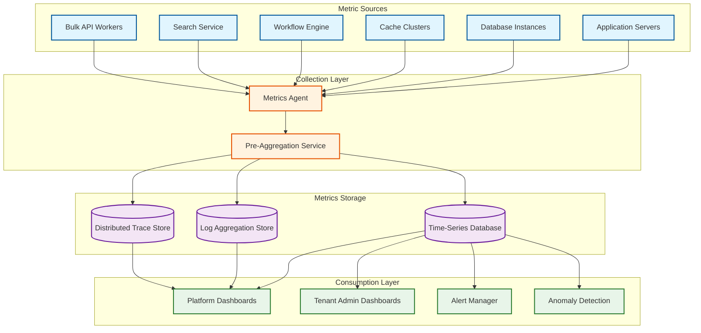

# Observability

## Observability Strategy

CRM platform observability must cover two distinct audiences: **platform engineers** who monitor infrastructure health, multi-tenant resource distribution, and system-level performance; and **tenant administrators** who monitor their org's API consumption, workflow execution, governor limit usage, and user adoption. The observability system must partition all metrics, logs, and traces by `org_id` to serve both audiences from the same data pipeline.

---

## Metrics Architecture



---

## Platform-Level Metrics

### Request Processing Metrics

| Metric | Type | Labels | Description |
|--------|------|--------|-------------|
| `crm.request.count` | Counter | org_id, method, endpoint, status_code | Total requests processed |
| `crm.request.latency_ms` | Histogram | org_id, method, endpoint | Request latency distribution |
| `crm.request.error_rate` | Gauge | org_id, status_code | Error rate percentage |
| `crm.concurrent_requests` | Gauge | org_id, pod_id | Active concurrent requests |
| `crm.request.body_size_bytes` | Histogram | org_id, endpoint | Request payload size distribution |

### Database Metrics

| Metric | Type | Labels | Description |
|--------|------|--------|-------------|
| `crm.db.query.count` | Counter | pod_id, query_type | Database queries executed |
| `crm.db.query.latency_ms` | Histogram | pod_id, query_type | Query execution time |
| `crm.db.connections.active` | Gauge | pod_id | Active database connections |
| `crm.db.connections.pool_utilization` | Gauge | pod_id | Connection pool usage percentage |
| `crm.db.replication_lag_ms` | Gauge | pod_id, replica_id | Read replica replication lag |
| `crm.db.deadlock.count` | Counter | pod_id | Deadlocks detected |
| `crm.db.rows_scanned` | Counter | pod_id, org_id | Total rows scanned (query efficiency) |

### Cache Metrics

| Metric | Type | Labels | Description |
|--------|------|--------|-------------|
| `crm.cache.hit_rate` | Gauge | cache_type (metadata, record, session) | Cache hit percentage |
| `crm.cache.metadata.hit_rate` | Gauge | org_id | Metadata cache hit rate per tenant |
| `crm.cache.eviction.count` | Counter | cache_type, reason | Cache evictions (LRU, TTL, invalidation) |
| `crm.cache.memory_usage_bytes` | Gauge | pod_id | Cache memory consumption |
| `crm.cache.stampede.count` | Counter | org_id | Cache stampede events detected |

### Multi-Tenant Resource Distribution

| Metric | Type | Labels | Description |
|--------|------|--------|-------------|
| `crm.tenant.cpu_seconds` | Counter | org_id | CPU time consumed per tenant |
| `crm.tenant.db_queries` | Counter | org_id | Database queries per tenant |
| `crm.tenant.storage_bytes` | Gauge | org_id | Total storage per tenant |
| `crm.tenant.api_calls` | Counter | org_id, api_type | API calls per tenant |
| `crm.tenant.noisy_neighbor_score` | Gauge | org_id | Resource consumption deviation from expected |

---

## Tenant-Facing Metrics

### API Usage Dashboard

| Metric | Visualization | Refresh Rate |
|--------|--------------|--------------|
| API calls used vs. limit (24h window) | Progress bar + trend line | 5 minutes |
| API calls by endpoint | Bar chart (top 10 endpoints) | 15 minutes |
| API calls by connected app | Pie chart | 15 minutes |
| API error rate by endpoint | Heat map | 5 minutes |
| Bulk API job status | Table (running, queued, completed, failed) | 1 minute |
| Streaming API subscriptions | Active subscription count + event volume | 5 minutes |

### Governor Limit Usage

| Metric | Visualization | Alert Threshold |
|--------|--------------|-----------------|
| SOQL queries per transaction (peak) | Gauge: peak/limit | > 80% of limit |
| DML operations per transaction (peak) | Gauge: peak/limit | > 80% of limit |
| CPU time per transaction (peak) | Gauge: peak_ms/limit_ms | > 70% of limit |
| Heap usage per transaction (peak) | Gauge: peak_bytes/limit_bytes | > 75% of limit |
| Governor limit exceptions (24h) | Counter + trend | > 10 per hour |
| Top automations by governor usage | Table: automation name, avg SOQL, avg DML, avg CPU | N/A |

### Workflow Execution Monitoring

| Metric | Type | Description |
|--------|------|-------------|
| `tenant.workflow.executions` | Counter per rule | Total executions per workflow rule |
| `tenant.workflow.failures` | Counter per rule | Failed executions per rule |
| `tenant.workflow.latency_ms` | Histogram per rule | Execution time distribution |
| `tenant.trigger.cpu_ms` | Histogram per trigger | CPU time consumed per trigger execution |
| `tenant.flow.executions` | Counter per flow | Flow execution count |
| `tenant.flow.error_rate` | Gauge per flow | Flow error percentage |
| `tenant.approval.pending_count` | Gauge | Approval requests waiting for response |
| `tenant.approval.avg_response_hours` | Gauge | Average time to approve/reject |

### User Adoption Metrics

| Metric | Description |
|--------|-------------|
| Daily active users | Unique users who logged in and performed at least one action |
| Feature adoption | Percentage of users using reports, dashboards, mobile, email integration |
| Login frequency distribution | Histogram of logins per user per week |
| Record creation velocity | New leads, contacts, opportunities created per day |
| Pipeline activity | Stage transitions, opportunity updates per day |

---

## Structured Logging

### Log Schema

Every log entry includes tenant context for filtering:

```
{
    "timestamp": "2025-03-15T14:30:05.123Z",
    "level": "INFO",
    "org_id": "org_12345",
    "user_id": "user_67890",
    "request_id": "req_abc-123-def",
    "trace_id": "trace_xyz-789",
    "service": "lead-service",
    "pod_id": "pod-na-west-003",
    "event": "record_save",
    "object": "Lead",
    "record_id": "00Qabc123",
    "operation": "update",
    "changed_fields": ["Status", "LeadScore"],
    "triggers_executed": 3,
    "workflows_fired": 2,
    "governor_usage": {
        "soql_queries": 12,
        "dml_statements": 5,
        "cpu_ms": 450,
        "heap_bytes": 1048576
    },
    "duration_ms": 85,
    "status": "success"
}
```

### Critical Log Events

| Event | Level | Trigger Condition | Action |
|-------|-------|-------------------|--------|
| `governor_limit_exceeded` | ERROR | Any governor limit hit during execution | Log full governor state; alert tenant admin |
| `trigger_recursion_limit` | ERROR | Trigger depth exceeds 16 | Log trigger chain; abort transaction |
| `sharing_recalculation_started` | WARN | Large sharing rule change affecting > 10K records | Log scope; monitor duration |
| `metadata_cache_miss_burst` | WARN | > 100 cache misses in 10 seconds for one org | Log org_id; potential cache stampede |
| `bulk_job_timeout` | ERROR | Bulk job exceeds maximum execution time | Log job details; partial results available |
| `cross_tenant_access_attempt` | CRITICAL | Query or cache access attempted with wrong org_id | Immediate alert; block request; security review |
| `api_rate_limit_exceeded` | WARN | Tenant exceeds API quota | Log client_id; return 429 |

---

## Distributed Tracing

### Trace Propagation

Every request generates a trace that propagates through all services:

```
Trace: crm-req-abc123
├── Span: api-gateway (12ms)
│   ├── Span: tenant-resolver (2ms)
│   └── Span: governor-init (1ms)
├── Span: lead-service.save (85ms)
│   ├── Span: metadata-engine.get_object (3ms) [cache: HIT]
│   ├── Span: before-trigger.execute (15ms)
│   │   ├── Span: soql-query-1 (8ms) [rows: 50]
│   │   └── Span: field-update (2ms)
│   ├── Span: validation-rules.evaluate (5ms) [rules: 12, passed: 12]
│   ├── Span: database.dml-insert (10ms)
│   ├── Span: after-trigger.execute (20ms)
│   │   ├── Span: soql-query-2 (12ms) [rows: 200]
│   │   └── Span: dml-update-account (8ms)
│   ├── Span: workflow-rules.evaluate (8ms) [rules: 45, fired: 3]
│   │   ├── Span: field-update-action (3ms)
│   │   └── Span: email-alert-queue (2ms) [async]
│   └── Span: rollup-summary.recalculate (12ms)
├── Span: cdc-event.publish (2ms)
└── Span: response-serialize (3ms)

Total: 102ms | Governor: SOQL=12/100, DML=5/150, CPU=450ms/10000ms
```

### Trace Sampling Strategy

| Traffic Type | Sampling Rate | Rationale |
|-------------|---------------|-----------|
| Normal requests (< 200ms, success) | 0.1% | Volume is too high for 100% tracing |
| Slow requests (> 500ms) | 100% | Always trace slow requests for debugging |
| Error responses (4xx, 5xx) | 100% | Always trace errors |
| Governor limit warnings (> 80% usage) | 100% | Trace near-limit executions |
| Bulk API operations | 10% | Sample bulk operations for throughput analysis |
| Admin/metadata operations | 100% | Always trace schema changes |

---

## Alerting Rules

### Platform-Level Alerts

| Alert | Condition | Severity | Action |
|-------|-----------|----------|--------|
| Pod error rate spike | Error rate > 1% for 3 minutes | P1 | Page on-call; investigate pod health |
| Database replication lag | Lag > 30 seconds for 2 minutes | P1 | Page DBA; consider failover to replica |
| Database connection pool exhaustion | Pool > 90% utilized for 5 minutes | P2 | Scale connection pool; investigate slow queries |
| Metadata cache hit rate drop | Hit rate < 90% for 5 minutes | P2 | Investigate invalidation storm; potential cache sizing issue |
| Noisy neighbor detection | Tenant consuming > 5x expected resources | P3 | Throttle tenant; notify account team |
| Search index lag | Index lag > 30 seconds | P3 | Scale indexer workers; check event bus health |
| Bulk API backlog | > 10,000 pending bulk jobs | P3 | Scale bulk workers; check for stuck jobs |
| Cross-tenant access detected | Any org_id mismatch in data access | P0 | Immediate investigation; potential security breach |

### Tenant-Level Alerts (Configurable by Admin)

| Alert | Default Threshold | Recipient |
|-------|-------------------|-----------|
| API usage approaching limit | > 80% of daily quota consumed | Org admin |
| Governor limit exceptions spike | > 50 exceptions in 1 hour | Org admin + developer |
| Workflow failure rate | > 5% failure rate for any rule | Org admin |
| Bulk job failure | Any bulk job fails | Job owner |
| Login from new IP/location | First login from unrecognized IP | User + org admin |
| Mass data delete detected | > 1,000 records deleted in 1 hour | Org admin |
| Storage approaching limit | > 80% of storage quota | Org admin |

---

## Health Check Endpoints

```
GET /health/live
Response: 200 OK
{ "status": "UP" }

GET /health/ready
Response: 200 OK
{
    "status": "UP",
    "components": {
        "database": { "status": "UP", "latency_ms": 3 },
        "cache": { "status": "UP", "hit_rate": 0.97 },
        "search": { "status": "UP", "index_lag_ms": 1200 },
        "event_bus": { "status": "UP", "consumer_lag": 500 },
        "metadata_engine": { "status": "UP", "cache_size": 125000 }
    }
}

GET /health/metrics
Response: 200 OK (Prometheus format)
crm_request_total{method="GET",status="200"} 1523456
crm_request_duration_ms{method="GET",quantile="0.95"} 145
crm_db_connections_active{pod="pod-na-west-003"} 78
crm_cache_hit_rate{type="metadata"} 0.97
crm_tenant_api_calls{org_id="org_12345"} 45231
```

---

## SLI/SLO Dashboard Layout

```
┌─────────────────────────────────────────────────────────────────┐
│  CRM Platform SLO Dashboard                                     │
├──────────────────────┬──────────────────────┬───────────────────┤
│  Availability        │  Latency (p99)       │  Error Budget     │
│  ████████████░ 99.97%│  Record CRUD: 210ms  │  ██████████░░     │
│  Target: 99.95%      │  Search: 380ms       │  18.5 min remain  │
│  Status: HEALTHY     │  Report: 4.2s        │  of 22 min/month  │
├──────────────────────┴──────────────────────┴───────────────────┤
│  Request Volume (24h)            │  Error Rate (24h)            │
│  ▁▂▃▅▇█████▇▅▃▂▁▁▂▃▅▇████▇▅▃▂  │  ▁▁▁▁▂▁▁▁▁▁▁▁▁▁▁▁▁▁▁▂▁▁▁  │
│  Peak: 125K RPS at 14:00 UTC    │  Peak: 0.08% at 14:15 UTC   │
├──────────────────────────────────┴──────────────────────────────┤
│  Top 5 Tenants by Resource Consumption                          │
│  1. org_mega_corp    CPU: 12% │ DB: 8%  │ API: 2.1M calls     │
│  2. org_big_sales    CPU: 8%  │ DB: 6%  │ API: 1.5M calls     │
│  3. org_enterprise   CPU: 6%  │ DB: 5%  │ API: 980K calls     │
│  4. org_growing      CPU: 4%  │ DB: 3%  │ API: 450K calls     │
│  5. org_heavy_api    CPU: 3%  │ DB: 2%  │ API: 3.2M calls     │
├──────────────────────────────────────────────────────────────────┤
│  Pod Health                                                      │
│  pod-na-west-001: ● HEALTHY  │  pod-eu-west-001: ● HEALTHY     │
│  pod-na-west-002: ● HEALTHY  │  pod-eu-west-002: ● HEALTHY     │
│  pod-na-east-001: ● HEALTHY  │  pod-apac-001:    ● DEGRADED    │
│  pod-na-east-002: ● HEALTHY  │  pod-apac-002:    ● HEALTHY     │
└──────────────────────────────────────────────────────────────────┘
```

---

## Observability for Debugging Common Issues

| Issue Pattern | Observable Signal | Investigation Path |
|---------------|-------------------|-------------------|
| Slow page loads for one tenant | `crm.request.latency_ms` spike for specific org_id | Trace slow requests → identify slow SOQL or trigger |
| Governor limit errors after deployment | `governor_limit_exceeded` events correlated with metadata change | Check recent automation changes; correlate with workflow_id |
| Search results stale | `crm.search.index_lag_ms` > threshold | Check event bus consumer lag; search indexer health |
| Bulk job stuck | Bulk job status = 'InProgress' for > 1 hour | Check worker logs for the job; dead-letter queue for failed records |
| Cross-tenant data leak (security) | `cross_tenant_access_attempt` alert | Full audit: trace request, check org_id propagation, review recent code changes |
| Noisy neighbor degradation | `crm.tenant.noisy_neighbor_score` > 5.0 | Identify tenant; check for runaway automation or bulk operation; apply throttling |
